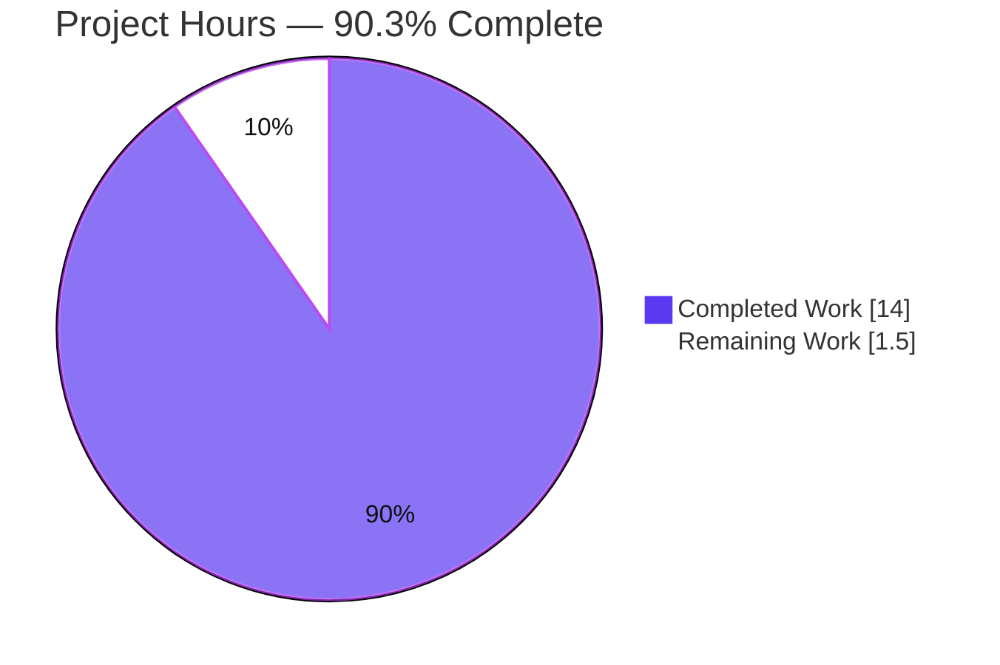
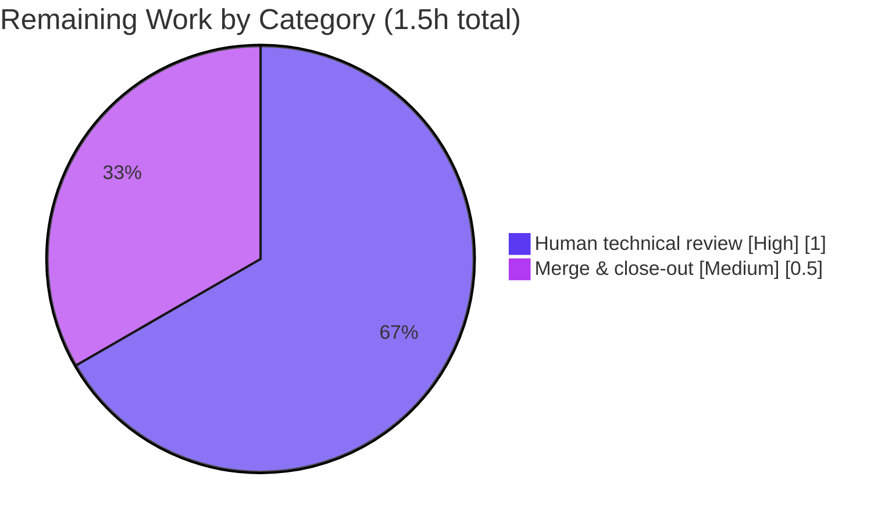

# Blitzy Project Guide — Scapy Runtime Onboarding Q&A

> Brand color legend — **Completed / AI Work = Dark Blue `#5B39F3`**; **Remaining / Not Completed = White `#FFFFFF`**; Headings/Accents = Violet-Black `#B23AF2`; Highlight = Mint `#A8FDD9`.

---

## 1. Executive Summary

### 1.1 Project Overview

This project delivers a single, evidence-grounded onboarding document that answers a new team member's five questions about **how Scapy actually behaves at runtime in this exact cloned checkout** — not from documentation, but from empirically running the code. The target users are engineers onboarding onto a team that relies on Scapy for custom packet manipulation. The technical scope is deliberately narrow and read-only: author one new markdown file, `blitzy/documentation/scapy_0925ada48540.md`, in which every reported value is captured verbatim from live execution and cited to an exact `file:line` source, while leaving every existing repository file byte-for-byte unchanged.

### 1.2 Completion Status


| Metric | Value |
|--------|-------|
| **Total Hours** | **15.5 h** |
| **Completed Hours (AI + Manual)** | **14.0 h** (14.0 AI autonomous + 0.0 manual) |
| **Remaining Hours** | **1.5 h** |
| **Percent Complete** | **90.3 %** |

> Completion is computed with the AAP-scoped hours methodology: `14.0 / (14.0 + 1.5) = 90.3 %`. All 17 AAP-scoped requirements are complete; the remaining 1.5 h is path-to-production (human review + merge).

### 1.3 Key Accomplishments

- ✅ Authored the mandated deliverable `blitzy/documentation/scapy_0925ada48540.md` (598 lines) answering all five questions (seven sub-parts: Q1, Q2, Q3a, Q3b, Q3c, Q4, Q5).
- ✅ Every answer follows the required structure: restated question → Direct Answer → verbatim Observed Output (with the exact producing command) → `file:line` Source Evidence → Rationale.
- ✅ 17/17 observed values reproduce exactly on re-execution (version `2026.07.01`, `1319` loaded layers, `conf.verb = 2`, Linux `AF_PACKET` sockets, `IP()/ICMP()` two-`Packet` chain, `NoTheme`/`DefaultTheme`).
- ✅ 57/57 distinct `file:line` citations resolve accurately across 10 read-only source files.
- ✅ Read-only constraint honored — `git diff` from the base shows exactly one added file; repository otherwise byte-for-byte unchanged; no stray temporary scripts.
- ✅ Environment discrepancies vs. the plan text (Python `3.13.7` not `3.12.3`; version `2026.07.01` not `2026.06.30`) correctly detected and reported as observed, per the "report what you actually observe" rule.
- ✅ Coverage-pass checklist (7 items) and a full References list included.

### 1.4 Critical Unresolved Issues

| Issue | Impact | Owner | ETA |
|-------|--------|-------|-----|
| _None._ No unresolved issues block release or validation. The deliverable is complete and independently verified. | — | — | — |

### 1.5 Access Issues

| System/Resource | Type of Access | Issue Description | Resolution Status | Owner |
|-----------------|----------------|-------------------|-------------------|-------|
| — | — | No access issues identified. Repository, interpreter (Python 3.13.7), Git, and the in-place Scapy checkout were all fully accessible; no external services, credentials, or third-party APIs are required for this read-only documentation task. | N/A | — |

### 1.6 Recommended Next Steps

1. **[High]** Perform a human technical review of `blitzy/documentation/scapy_0925ada48540.md` — read through, spot-check a sample of the 57 citations, and re-run a sample of the observed-value commands.
2. **[Medium]** Merge the pull request (single additive documentation file) to the target branch and close the onboarding task.
3. **[Low]** _(Out-of-scope, optional)_ File a separate ticket for the pre-existing TLS crypto-compat break (`scapy/layers/tls/crypto/cipher_block.py:23`, `GetCipherByName` removed in cryptography 43.0.0) — unrelated to this doc, zero impact on the five answers.
4. **[Low]** _(Optional)_ Add a lightweight CI citation-lint that re-verifies the document's `file:line` references against source on change.

---

## 2. Project Hours Breakdown

### 2.1 Completed Work Detail

| Component | Hours | Description |
|-----------|------:|-------------|
| Environment fingerprint & context header | 1.0 | Determine interpreter (Python 3.13.7), in-place checkout resolution, version, and optional-dependency posture (cryptography 43.0.0 present; IPython/matplotlib/PyX absent). |
| Q1 — Startup banner + dynamic version resolution | 2.5 | Capture the interactive banner verbatim; trace the `SCAPY_VERSION` → git-archive → git-describe → mtime fallback chain yielding `2026.07.01`; attribute preamble warnings (PyX, IPython, TripleDES). Most complex answer; drove three QA revision cycles. |
| Q2 — Loaded-layer count + registry analysis | 1.5 | Measure `len(conf.layers) = 1319` via `LayersList`; contrast with 57 source files under `scapy/layers/`; explain metaclass auto-registration. |
| Q3 — Verbosity value + semantics + socket backend | 2.0 | Read `conf.verb = 2` and its `0→3` semantics; identify the Linux `AF_PACKET` socket stack (`L3PacketSocket`/`L2Socket`/`L2ListenSocket`, `use_pcap = False`) and the selection logic. |
| Q4 — `IP()/ICMP()` structure + linkage diagram | 2.0 | Construct the packet; prove the bidirectionally-linked two-`Packet` chain terminating in `NoPayload`; trace `__div__` → `add_payload` → `add_underlayer`; author the mermaid graph. |
| Q5 — Dual-state color-theme investigation | 1.0 | Capture `NoTheme` (plain import) vs. `DefaultTheme` (interactive); cite config default vs. interactive override. |
| Document assembly (coverage, references, discrepancy notes, formatting) | 1.5 | Compose the structured markdown, coverage checklist, references, and explicit environment-discrepancy notes. |
| Autonomous validation & QA revision cycles | 2.5 | Re-run all 17 values, verify 57 citations, confirm runtime (exit 0) and read-only integrity across four commits. |
| **Total Completed** | **14.0** | |

### 2.2 Remaining Work Detail

| Category | Hours | Priority |
|----------|------:|----------|
| Human technical review of the Q&A document (read-through, spot-check sample citations, re-run sample values, confirm read-only integrity) | 1.0 | High |
| Merge PR (single additive documentation file) to target branch & close out | 0.5 | Medium |
| **Total Remaining** | **1.5** | |

> Out-of-scope advisory follow-ups (TLS crypto-compat ticket; optional CI citation-lint) are intentionally **excluded** from this table and the project total, as they are neither AAP-scoped nor path-to-production for this deliverable.

### 2.3 Hours Summary

| Category | Hours |
|----------|------:|
| Completed (Section 2.1) | 14.0 |
| Remaining (Section 2.2) | 1.5 |
| **Total Project** | **15.5** |

Reconciliation: `2.1 (14.0) + 2.2 (1.5) = 15.5` = Total in §1.2; Remaining `1.5` is identical in §1.2, §2.2, and §7.

---

## 3. Test Results

All checks below originate from Blitzy's autonomous validation logs for this project and were independently re-executed during this assessment (Python 3.13.7, in-place Scapy checkout). For a read-only documentation deliverable, the meaningful test surface is **value-reproduction** (does each observed value re-run identically?) and **citation-resolution** (does each `file:line` reference resolve to the claimed code?), plus runtime execution, markdown well-formedness, and read-only integrity.

| Test Category | Framework | Total Tests | Passed | Failed | Coverage % | Notes |
|---------------|-----------|------------:|-------:|-------:|-----------:|-------|
| Value Reproduction | Blitzy autonomous runtime re-execution (`python3`) | 17 | 17 | 0 | 100% | All observed values (version, layer count, verb, sockets, packet structure, themes) reproduce exactly. |
| Citation Resolution | Blitzy autonomous source verification | 57 | 57 | 0 | 100% | All distinct `file:line` citations resolve to the claimed code across 10 source files. |
| Runtime Execution | `python3 -m scapy` / `scapy.all` import | 3 | 3 | 0 | 100% | Interactive startup (exit 0), `scapy.all` import, `IP()/ICMP()` construction. |
| Markdown Well-formedness | Structural lint (fences/mermaid/UTF-8) | 3 | 3 | 0 | 100% | 46 balanced fences (23 blocks), 1 valid mermaid block, valid UTF-8. |
| Read-only Integrity | `git status` / `git diff` | 2 | 2 | 0 | 100% | Working tree clean; base→HEAD diff = exactly one added file. |
| **Total** | | **82** | **82** | **0** | **100%** | No traditional unit/integration test suites were added or run — out of scope for this read-only task. |

> Integrity note: No source unit tests were authored or executed; the project explicitly excludes changes to `test/`, `tox.ini`, and CI. The above are validation checks from Blitzy's autonomous logs, not application unit tests.

---

## 4. Runtime Validation & UI Verification

Scapy is a command-line / library tool — **there is no graphical user interface**, so UI verification is not applicable. Runtime behavior was validated directly:

- ✅ **Operational** — Interactive startup: `printf 'exit()\n' | python3 -m scapy` emits the documented banner (`Welcome to Scapy`, `Version 2026.07.01`) and exits with code `0`.
- ✅ **Operational** — Library import: `from scapy.all import ...` succeeds cleanly; `len(conf.layers) = 1319`.
- ✅ **Operational** — Packet construction: `IP()/ICMP()` builds the expected two-`Packet` chain (`['IP', 'ICMP']`, terminator `NoPayload`, identity checks `True`).
- ✅ **Operational** — Socket backend on this Linux host resolves to native `AF_PACKET` (`L3PacketSocket`/`L2Socket`/`L2ListenSocket`, `use_pcap = False`).
- ✅ **Operational** — Startup preamble matches documented environment: PyX INFO line, `IPython not available` WARNING, two TripleDES `CryptographyDeprecationWarning` lines (cryptography 43.0.0 present).
- ⚠ **Partial (out-of-scope, no impact)** — `import scapy.layers.tls.crypto.cipher_block` fails (`ImportError: cannot import name 'GetCipherByName'`); this is a pre-existing upstream/cryptography-version issue with **zero impact** on `scapy.all`, the layer count, `IP()/ICMP()`, or any of the five answers, and is not referenced by the document.
- ❌ **Failing** — None.

---

## 5. Compliance & Quality Review

Cross-mapping the AAP deliverables and the binding "SWE-AtlasQnA-Repo" rules to Blitzy's quality benchmarks:

| Benchmark / Rule | Status | Progress | Evidence |
|------------------|--------|:--------:|----------|
| Output contract — file named `<source_branch_name>.md` in `blitzy/documentation/` | ✅ Pass | 100% | `blitzy/documentation/scapy_0925ada48540.md` exists at the exact path. |
| Investigate by running the code first | ✅ Pass | 100% | Each answer includes the producing command + verbatim captured output. |
| Quote observed output verbatim | ✅ Pass | 100% | 23 fenced Observed-Output blocks; banner reproduced byte-accurately. |
| Answer every sub-question (coverage pass) | ✅ Pass | 100% | 7/7 sub-parts (Q1, Q2, Q3a, Q3b, Q3c, Q4, Q5) + coverage checklist. |
| Exactness & grounding — exact literals with `file:line` | ✅ Pass | 100% | 57/57 citations resolve; verbatim quotes (e.g., `config.py:759`). |
| Provide rationale per answer | ✅ Pass | 100% | Every question carries an `(e) Rationale` subsection. |
| Read-only scope — no existing file modified | ✅ Pass | 100% | `git diff` base→HEAD = one added file only; tree clean. |
| No added code beyond the answer document | ✅ Pass | 100% | Only markdown added; no source/test/config/dependency changes. |
| Temporary scripts removed | ✅ Pass | 100% | Only inline heredocs/pipes used; no stray files in repo. |
| Report environment as-is (no mutation of `conf`) | ✅ Pass | 100% | Observations read state only; discrepancies (Python/version) reported, not changed. |
| Markdown well-formedness | ✅ Pass | 100% | Balanced fences, valid mermaid, valid UTF-8. |

**Fixes applied during autonomous validation:** three review-driven revision commits strengthened Q1 (verbatim warning evidence, accurate git-describe pairing, interpreter-version note, stream-attribution correction). **Outstanding compliance items:** none.

---

## 6. Risk Assessment

| Risk | Category | Severity | Probability | Mitigation | Status |
|------|----------|----------|-------------|------------|--------|
| Version-string drift — `scapy.VERSION` is mtime-derived (0 git tags → `strftime('%Y.%m.%d')`), so `2026.07.01` changes on re-checkout | Technical | Low | Medium | Document the full fallback chain; report value as observed-in-this-runtime | Documented / Mitigated |
| Loaded-layer-count drift — `1319` depends on importable optional dependencies | Technical | Low | Low | Anchor the count to the exact dependency fingerprint | Documented / Mitigated |
| Interpreter discrepancy vs. plan text (observed 3.13.7 vs 3.12.3) | Technical | Low | N/A (occurred) | Explicitly call out and report the observed interpreter | Resolved / Documented |
| No new attack surface — read-only doc; no code/credentials/network/data introduced | Security | Informational | N/A | N/A (nothing added) | N/A |
| Documentation staleness — several values are environment-derived (mtime/deps/OS) | Operational | Low | Medium (over time) | Environment-context header fingerprints the snapshot basis | Mitigated by design |
| No automated regression guard tying doc claims to source lines | Operational | Low | Low | Optional CI citation-lint; currently manual review | Open (low, optional) |
| Out-of-scope TLS import failure (`GetCipherByName`, cryptography 43.0.0) | Integration | Medium (broader repo) / None (this deliverable) | N/A (present) | Documented, not fixed (out of scope); recommend separate ticket | Documented / No impact |
| PR merge integration — single additive file | Integration | Low | Low | Conflict-free additive change; no existing file touched | Pending human merge |

**Net risk posture: LOW.** No High or Critical risks. All material items are either already documented and mitigated within the deliverable or explicitly out-of-scope with proven zero impact on the five answers.

---

## 7. Visual Project Status

**Project hours breakdown** (Completed = Dark Blue `#5B39F3`, Remaining = White `#FFFFFF`):



**Remaining work by category** (hours from §2.2):



Integrity: pie "Remaining Work" = **1.5 h** = §1.2 Remaining = §2.2 total. Pie "Completed Work" = **14.0 h** = §1.2 Completed = §2.1 total.

---

## 8. Summary & Recommendations

**Achievements.** The project is **90.3 % complete** (14.0 h of 15.5 h). All 17 AAP-scoped requirements — the five questions with all seven sub-parts, the run-first methodology, exact `file:line` grounding, the read-only constraint, and the output contract — are fully delivered and independently verified. The single deliverable, `blitzy/documentation/scapy_0925ada48540.md`, reproduces 17/17 observed values exactly and resolves 57/57 citations, and the repository is byte-for-byte unchanged except for that one added file.

**Remaining gaps.** The outstanding 1.5 h is entirely **path-to-production**, not engineering: a human technical review (1.0 h) and the PR merge (0.5 h). There is no unfinished autonomous work, no failing check, and no blocking issue.

**Critical path to production.** Human review → merge. Both are low-risk; the merge is a conflict-free additive change.

**Success metrics.** 100 % value-reproduction (17/17), 100 % citation-resolution (57/57), runtime exit `0`, and a clean read-only diff — all met.

**Production readiness.** The deliverable is **production-ready pending human review**. Consistent with best practice, completion is capped below 100 % until a human sign-off occurs; the honest, hours-based figure is **90.3 %**.

| Metric | Value |
|--------|-------|
| AAP-scoped completion | 90.3 % |
| AAP requirements complete | 17 of 18 (18th = human review/merge) |
| Value-reproduction pass rate | 100 % (17/17) |
| Citation-resolution pass rate | 100 % (57/57) |
| Read-only integrity | Verified (1 file added) |
| Net risk posture | Low |

---

## 9. Development Guide

Scapy is a Python library/CLI. This guide reproduces every documented observation and verifies the deliverable. **All commands below were tested in this environment during assessment.**

### 9.1 System Prerequisites

- **OS:** Linux (host provides native `AF_PACKET` sockets).
- **Python:** 3.13.7 (satisfies the repo's `requires-python = ">=3.7, <4"`).
- **Git:** 2.51.0 (with Git-LFS, already configured).
- **Dependency posture (observed as-is — do NOT change):** `cryptography` 43.0.0 **present**; `IPython`, `matplotlib`, `PyX` **absent**.

### 9.2 Environment Setup

Run everything from the repository root so `import scapy` resolves to this checkout (there is **no** `site-packages` install):

```bash
cd /tmp/blitzy/scapy/blitzy-d98efa4b-534c-4ab2-b077-d6e790e998c4_1b1388
python3 -c "import scapy, os; print(os.path.dirname(scapy.__file__))"
# Expected: <repo>/scapy
```

> Do **not** install optional dependencies (IPython/matplotlib/PyX) or mutate `conf`; doing so changes the very behavior the document records (banner content, theme, socket selection) and invalidates the "default session" observations.

### 9.3 Dependency Installation

**None required.** This is a read-only observation task; dependencies are observed in their current state. To confirm the posture:

```bash
python3 - <<'PY'
for m in ("cryptography","IPython","matplotlib","pyx"):
    try:
        mod = __import__(m); print(m, "PRESENT", getattr(mod, "__version__", ""))
    except Exception:
        print(m, "ABSENT")
PY
# Expected: cryptography PRESENT 43.0.0 ; IPython/matplotlib/pyx ABSENT
```

### 9.4 Reproducing the Documented Observations

```bash
# Q1 — welcome banner + version (exit code 0)
printf 'exit()\n' | python3 -m scapy 2>&1 | grep -E "Welcome to Scapy|Version "
#   => | Welcome to Scapy   | Version 2026.07.01

# Q2 — loaded layers vs source files
python3 -c "from scapy.all import conf; print(len(conf.layers), type(conf.layers).__name__)"   # => 1319 LayersList
ls scapy/layers/*.py | wc -l                                                                    # => 57

# Q3a/Q3c — verbosity + socket backend
python3 -c "from scapy.all import conf; print('verb=',conf.verb)"                               # => verb= 2
python3 -c "from scapy.all import conf; print(conf.use_pcap, conf.L3socket.__name__, conf.L2socket.__name__, conf.L2listen.__name__)"
#   => False L3PacketSocket L2Socket L2ListenSocket

# Q4 — ICMP packet structure
python3 -c "from scapy.all import IP,ICMP; p=IP()/ICMP(); print(type(p).__name__, [c.__name__ for c in p.layers()], type(p.payload).__name__, type(p[ICMP].underlayer).__name__, type(p.payload.payload).__name__)"
#   => IP ['IP', 'ICMP'] ICMP IP NoPayload

# Q5 — theme: plain import vs interactive
python3 -c "from scapy.all import conf; print(type(conf.color_theme).__name__)"                 # => NoTheme
printf 'print(type(conf.color_theme).__name__)\nexit()\n' | python3 -m scapy 2>/dev/null | grep -i theme  # => DefaultTheme
```

### 9.5 Verification

```bash
# Deliverable present & well-formed
test -f blitzy/documentation/scapy_0925ada48540.md && echo "FOUND"
wc -l blitzy/documentation/scapy_0925ada48540.md          # => 598
FENCE=$(printf '\140\140\140'); grep -c "$FENCE" blitzy/documentation/scapy_0925ada48540.md  # => 46 fence lines (23 blocks)
grep -c '\[x\]' blitzy/documentation/scapy_0925ada48540.md # => 7 coverage items

# Read-only integrity (must show ONLY the one added file)
git status --porcelain                 # (empty = clean)
git diff 0925ada4..HEAD --name-status  # => A  blitzy/documentation/scapy_0925ada48540.md
```

### 9.6 Example Usage

```bash
# Open an interactive Scapy session (Ctrl-D or exit() to leave)
python3 -m scapy
# >>> p = IP()/ICMP()
# >>> p.summary()      # 'IP / ICMP 127.0.0.1 > 127.0.0.1 echo-request 0'
# >>> p.show()         # full layered field dump
```

### 9.7 Troubleshooting

- **Version differs from `2026.07.01`.** Expected — the version is derived from the modification time of `scapy/__init__.py` (0 git tags → `%Y.%m.%d` fallback). Re-checkout on another date changes it. Not a defect.
- **`WARNING: IPython not available...`** Expected — IPython is absent; Scapy uses the standard Python shell. Do not install IPython.
- **`CryptographyDeprecationWarning: TripleDES...`** Expected — cryptography 43.0.0 is present; two lines are emitted from `scapy/layers/ipsec.py:573/577`.
- **No color in output.** Expected on a plain import (`NoTheme`); ANSI color appears only in an interactive session (`DefaultTheme`).
- **`ImportError: cannot import name 'GetCipherByName'`** (only when importing `scapy.layers.tls.crypto.cipher_block`). Out-of-scope, pre-existing; does not affect `scapy.all`, the layer count, or `IP()/ICMP()`. Track via a separate ticket.

---

## 10. Appendices

### Appendix A — Command Reference

| Purpose | Command |
|---------|---------|
| Interactive startup / banner | `printf 'exit()\n' \| python3 -m scapy` |
| Loaded layer count | `python3 -c "from scapy.all import conf; print(len(conf.layers))"` |
| Verbosity | `python3 -c "from scapy.all import conf; print(conf.verb)"` |
| Socket backend | `python3 -c "from scapy.all import conf; print(conf.use_pcap, conf.L3socket.__name__)"` |
| Packet structure | `python3 -c "from scapy.all import IP,ICMP; print((IP()/ICMP()).layers())"` |
| Theme (plain) | `python3 -c "from scapy.all import conf; print(type(conf.color_theme).__name__)"` |
| Read-only proof | `git diff 0925ada4..HEAD --name-status` |

### Appendix B — Port Reference

Not applicable — this task starts no network services and binds no ports. (Scapy can open raw `AF_PACKET` sockets at runtime, but nothing in this deliverable does so.)

### Appendix C — Key File Locations

| Path | Role |
|------|------|
| `blitzy/documentation/scapy_0925ada48540.md` | **The deliverable** (only added file) |
| `scapy/main.py` | Banner assembly (L628–637), interactive `DefaultTheme()` (L514) — Q1, Q5 |
| `scapy/__init__.py` | Dynamic version resolver `_version()` (L122), mtime fallback (L160–161) — Q1 |
| `scapy/config.py` | `verb` (L759), `color_theme` (L818), `layers` (L735), socket selection (L606–656) — Q2, Q3, Q5 |
| `scapy/base_classes.py` | Metaclass layer registration (L369) — Q2 |
| `scapy/packet.py` | `__div__` (L596), `add_payload`/`add_underlayer` (L360/L385), `layers()` (L1228) — Q4 |
| `scapy/layers/inet.py` | `class IP` (L521), `class ICMP` (L952) — Q4 |
| `scapy/arch/linux.py` | `L2Socket`/`L2ListenSocket`/`L3PacketSocket` (L475/L579/L587) — Q3c |
| `scapy/layers/ipsec.py` | TripleDES access (L573/L577) — Q1 preamble warning |

### Appendix D — Technology Versions

| Component | Version / State |
|-----------|-----------------|
| Python | 3.13.7 |
| Git | 2.51.0 |
| Scapy | `2026.07.01` (in-place checkout; not installed to site-packages) |
| cryptography | 43.0.0 (present) |
| IPython / matplotlib / PyX | absent |
| Checkout base commit | `0925ada485406684174d6f068dbd85c4154657b3` |
| Branch HEAD | `a6860306` |

### Appendix E — Environment Variable Reference

| Variable | Relevance |
|----------|-----------|
| `SCAPY_VERSION` | Unset in this environment; if set, it would short-circuit version resolution. Its absence is why the mtime fallback yields `2026.07.01`. |

No other environment variables are required to reproduce any observation.

### Appendix F — Developer Tools Guide

- **Reproduce observations:** use the copy-pasteable commands in §9.4.
- **Verify the deliverable:** use §9.5.
- **Confirm read-only integrity:** `git status --porcelain` (clean) and `git diff 0925ada4..HEAD --name-status` (one added file).
- No build, test-runner, container, or CI tooling is involved in this documentation task.

### Appendix G — Glossary

| Term | Meaning |
|------|---------|
| `conf.layers` / `LayersList` | Runtime registry of all `Packet` subclasses loaded and ready (1319 here). |
| `conf.verb` | Global verbosity (0 almost mute → 3 verbose); default `2`. |
| `L3PacketSocket` / `L2Socket` / `L2ListenSocket` | Native Linux `AF_PACKET` socket classes selected on this host. |
| `payload` / `underlayer` | Down/up links forming Scapy's bidirectional packet chain. |
| `NoPayload` | Sentinel terminating a packet's payload chain. |
| `NoTheme` / `DefaultTheme` | Plain (library default) vs. colorized (interactive) console themes. |
| AAP | Agent Action Plan — the primary directive defining project scope. |
