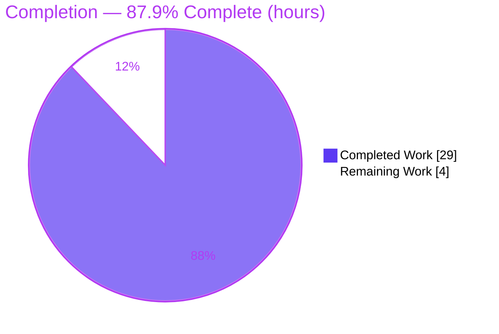
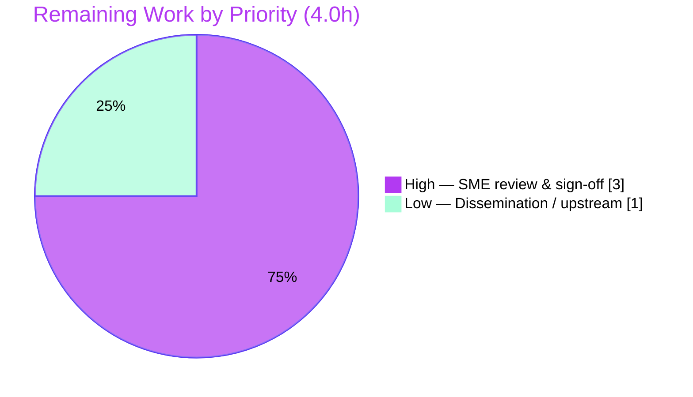

# Blitzy Project Guide — Scapy `sr`/`sr1` Wrong-Match Root-Cause Investigation

> **Task type:** Read-only root-cause Q&A / documentation (governing rule: SWE-AtlasQnA-Repo)
> **Deliverable:** `blitzy/documentation/scapy_0925ada48540.md`
> **Repository:** Scapy (pure-Python packet-manipulation library) — source left **byte-for-byte unchanged**
> **Brand colors:** Completed/AI = Dark Blue `#5B39F3` · Remaining = White `#FFFFFF` · Headings/Accents = Violet-Black `#B23AF2` · Highlight = Mint `#A8FDD9`

---

## 1. Executive Summary

### 1.1 Project Overview

This project answers a precise engineering question raised by a user of Scapy: *why does the `sr`/`sr1` matching engine associate a received packet with the wrong sent probe when probing multiple tunnel endpoints (gateways)?* The single deliverable is a runtime-grounded root-cause analysis document. Target users are network/security engineers who build ICMP tunnel-probing tools on Scapy and were seeing responses attributed to the wrong gateway. The technical scope is a deep, read-only trace of the send/receive matching pipeline (`hashret()` bucketing plus the first-positive-`answers()` tie-break) across five Scapy modules, plus offline reproductions driven through the canonical engine. The Scapy source remains completely unmodified.

### 1.2 Completion Status



<span style="color:#5B39F3">■</span> Completed (Dark Blue `#5B39F3`) &nbsp;&nbsp; <span style="color:#B23AF2">□</span> Remaining (White `#FFFFFF`, outlined)

| Metric | Value |
|--------|-------|
| **Total Hours** | **33.0** |
| **Completed Hours (AI + Manual)** | **29.0** (29.0 AI-autonomous + 0.0 Manual) |
| **Remaining Hours** | **4.0** |
| **Percent Complete** | **87.9%**  (29.0 ÷ 33.0 × 100) |

> The 87.9% figure is computed strictly from AAP-scoped + path-to-production hours: `Completed ÷ (Completed + Remaining) = 29 ÷ 33`. It is used identically in Sections 2, 7, and 8.

### 1.3 Key Accomplishments

- ✅ **Single deliverable created** at the mandated path `blitzy/documentation/scapy_0925ada48540.md` (1,163 lines), filename matching the source branch `scapy_0925ada48540`.
- ✅ **Root cause identified and proven**: a `hashret()` hash-bucket collision followed by a first-in-bucket `answers()` tie-break in `SndRcvHandler` (`scapy/sendrecv.py:L244`, `L270-L292`).
- ✅ **Wrong-pairing reproduced end-to-end** through the **canonical** `sndrcv`/`sr()`/`sr1()` engine (offline `TestSocket` for I/O only) — a gw2 reply is paired with the gw1 probe the instant `conf.checkIPinIP=False`, stable across three repeats.
- ✅ **Five interacting mechanisms (M1–M5)** documented with observed `hashret()` byte strings, collision truth tables, and before/after bucket state.
- ✅ **Coverage pass over every named item**: `sr`/`sr1`, `hashret`, `answers`, `conf.checkIPsrc`, `conf.checkIPaddr`, unique ICMP sequence, TCP-flag validation, Raw vs. parsed layers, `multi_recv`→`multi`, tunneled/IP-in-IP, and timing/race.
- ✅ **Terminology corrected**: `multi_recv` does not exist in Scapy; the real parameter is `multi`, which cannot prevent a bucket collision.
- ✅ **Read-only constraint honored**: `git diff base..HEAD` = exactly one added file; zero source/test/config files touched; working tree clean.
- ✅ **Fully grounded**: 85+ `file:line` citations across 9 files, observed-vs-inferred labeling, and exact reproduction commands.
- ✅ **Validated autonomously**: `compileall` clean, offline regression 238/238 passing, and all four reproduction scripts pass (independently re-run in this assessment).

### 1.4 Critical Unresolved Issues

| Issue | Impact | Owner | ETA |
|-------|--------|-------|-----|
| _None blocking._ No compile errors, no failing tests, no missing content, no placeholders. | — | — | — |
| Human SME sign-off pending (advisory gate, not a defect) | Security-adjacent root-cause claim should be expert-verified before it is relied upon | Network-security / Scapy SME | ~3.0h |

### 1.5 Access Issues

| System/Resource | Type of Access | Issue Description | Resolution Status | Owner |
|-----------------|----------------|-------------------|-------------------|-------|
| Scapy repository checkout | Read/Write (local) | Full access; single doc committed | ✅ Resolved | Blitzy Agent |
| Python venv / interpreter | Execute | `.venv` (CPython 3.13.7) imports Scapy 2026.07.13 from the checkout | ✅ Resolved | Blitzy Agent |
| Live tunnel gateways / raw network | Network I/O | No real gateways exist in the sandbox; live `sr`/`sr1` against real gateways not performed | ⚠ Accommodated (offline `TestSocket` injects canned bytes; the matching code executed is the real, unmodified library) | Blitzy Agent |

No credential, permission, or third-party access issues prevent build validation of this deliverable. The single network limitation is a methodological accommodation, not a blocker — the canonical matching code path still runs.

### 1.6 Recommended Next Steps

1. **[High]** Have a network-security/Scapy SME read the analysis end-to-end and validate the root-cause logic against the cited source (≈1.0h).
2. **[High]** Independently re-run the four embedded reproduction scripts and the offline regression campaign to confirm the wrong-pairing and controls (≈1.0h).
3. **[High]** Confirm read-only compliance (`git diff base..HEAD` = 1 file) and sign off / accept the conclusion, or route back with specific questions (≈1.0h).
4. **[Low]** Disseminate the findings to the requesting user/team and, optionally, file/link an upstream Scapy issue referencing PR #387 / issue #383 for the multi-gateway case (≈1.0h).

---

## 2. Project Hours Breakdown

### 2.1 Completed Work Detail

All completed work is AI-autonomous and traces to specific AAP requirements (R1–R15).

| Component | Hours | Description |
|-----------|-------|-------------|
| Source-code investigation of the matching pipeline (R2, R3) | 4.0 | Read-only trace of `SndRcvHandler`, `_sndrcv_snd`, `_process_packet`, `sndrcv`/`sr`/`sr1` across 5 modules (`sendrecv.py`, `inet.py`, `inet6.py`, `packet.py`, `config.py`); mapped `hashret()`/`answers()` behavior to each `conf` flag |
| Runtime reproduction harness + 4 canonical-path scripts (R4, R13, R14) | 6.0 | Built an offline `TestSocket`-driven harness exercising the **real** `sndrcv`/`_process_packet`/`sr()`/`sr1()`; authored A/B/C/D-series assertion-driven scripts incl. before/after bucket snapshots |
| Root-cause write-up: Sections 1–5, M1–M5, algorithm + pipeline diagram (R2, R3, R5, R8, R9) | 5.0 | Direct answer, two-stage algorithm, Mermaid pipeline diagram, five mechanisms with observed output, reasoning/rationale |
| Coverage pass over all named items incl. `multi_recv`→`multi` (R5, R6, R12) | 2.0 | Explicit disposition table for every user hypothesis, incl. terminology correction |
| `file:line` citation grounding (85+) + captured-output assembly, Section 6 (R7, R15) | 2.0 | Every factual claim cited; full unedited command output embedded |
| Web-search corroboration of `conf`-flag semantics/history (R11) | 1.5 | Cross-checked against PR #387, issues #383 & #1894, official usage docs, RFC 792 |
| Code-review + QA remediation cycles (quality) | 4.5 | Commits `5a91eabd` and `ffc02db8`; incl. runtime **refutation** of the naive M5 "truncation→`Raw.answers()`" hypothesis and a citation-drift fix |
| Final autonomous validation | 4.0 | `compileall` clean, offline regression 238/0, 4-script re-run ×2, 91-citation audit, coverage & read-only verification |
| **Total Completed** | **29.0** | — |

> **Validation:** the Hours column sums to **29.0**, matching Completed Hours in Section 1.2.

### 2.2 Remaining Work Detail

All remaining work is human-only path-to-production (no autonomous code work remains).

| Category | Hours | Priority |
|----------|-------|----------|
| Human SME technical review & sign-off of the root-cause claim + reproductions (RW1) | 3.0 | High |
| Optional dissemination of findings / upstream issue linkage (RW2) | 1.0 | Low |
| **Total Remaining** | **4.0** | — |

> **Validation:** the Hours column sums to **4.0**, matching Remaining Hours in Section 1.2 and the "Remaining Work" value in the Section 7 pie chart. Section 2.1 (29.0) + Section 2.2 (4.0) = **33.0** = Total Project Hours.

### 2.3 Hours Reconciliation

| Line | Hours |
|------|-------|
| Section 2.1 total (Completed) | 29.0 |
| Section 2.2 total (Remaining) | 4.0 |
| **Sum (= Section 1.2 Total)** | **33.0** |
| Completion % = 29.0 ÷ 33.0 × 100 | **87.9%** |

---

## 3. Test Results

All tests below originate from Blitzy's autonomous validation logs for this project and were **independently re-run during this assessment** with identical results. Because the deliverable is a documentation artifact over an unmodified library, "coverage %" is not a line-coverage metric; instead, the matching pipeline code paths (`hashret` → bucket → `answers` → `_process_packet` → `sndrcv`/`sr`/`sr1`) are all exercised by the reproduction suite.

| Test Category | Framework | Total Tests | Passed | Failed | Coverage % | Notes |
|---------------|-----------|-------------|--------|--------|-----------|-------|
| In-repo regression | UTscapy (`test/regression.uts`) | 238 | 238 | 0 | Not measured | Offline keywords skipped (`netaccess`, `needs_root`, `tcpdump`, `libpcap`, `tshark`, `manufdb`, `wireshark`, `tcpreplay`, `mock_read_routes_bsd`, `vcan_socket`); includes the `= answers` test (#091) exercising `hashret`/`answers` under the `checkIPinIP` toggle |
| Reproduction A-series (`repro_matching.py`) | Python `assert` | 8 | 8 | 0 | — | Direct `hashret()` byte strings + `(checkIPsrc, checkIPaddr)` collision truth table + `Raw.answers()` short-circuit |
| Reproduction B-series (`repro_sndrcv.py`) | Python `assert` | 5 | 5 | 0 | — | Canonical `sndrcv()` + real `sr()`/`sr1()` wrappers + before/after bucket state; **reproduces the wrong-pairing** and its controls |
| Reproduction C-series (`repro_controls.py`) | Python `assert` | 6 | 6 | 0 | — | `multi` exists / `multi_recv` absent; `multi` cannot fix a collision; regression `= answers` replay; end-to-end truth table |
| Reproduction D-series (`repro_error.py`) | Python `assert` | 5 | 5 | 0 | — | ICMP-error path; refutes the truncation→`Raw` hypothesis (citation dissects to `IPerror`/`ICMPerror`) |
| **Total** | — | **262** | **262** | **0** | — | 100% pass rate |

**Independent re-run evidence (this assessment):**
- Regression exit code `0`; tally `passed=238, failed=0` (238 `[passed]` markers, zero `[failed]`).
- All four reproduction scripts exit `0`, each printing `…-SERIES: ALL ASSERTIONS PASSED`.
- B-series printed `*** WRONG PAIRING ***` (gw2 reply → gw1 probe under `checkIPinIP=False`) on all three repeats, and `CORRECT` for every control.

---

## 4. Runtime Validation & UI Verification

**UI verification: Not applicable.** Scapy is a Python library / interactive CLI with **no web or graphical user interface**. There is no front-end to verify; runtime validation therefore targets the library engine and reproduction harness.

**Runtime health (canonical engine):**
- ✅ **Operational** — Scapy `2026.07.13` imports and runs from the checkout under CPython `3.13.7`.
- ✅ **Operational** — `python -m compileall scapy/` completes with exit code 0 (all sources byte-compile).
- ✅ **Operational** — the real `sndrcv` → `_process_packet` → `hashret()` → `answers()` matching path executes; `sr()` and `sr1()` wrappers run offline via `conf.L3socket` pointed at `TestSocket`.
- ✅ **Operational** — the documented **wrong-pairing is reproduced deterministically** and is stable across repeats.
- ✅ **Operational** — offline regression campaign passes 238/238.

**API / integration outcomes:**
- ✅ **Operational** — canonical entry points `sr`, `sr1`, `sndrcv` exercised (not a synthetic bypass); `TestSocket` supplies canned response bytes for network I/O only.
- ⚠ **Partial (by design)** — live probing of real tunnel gateways was **not performed** (no gateways exist in the sandbox). This is a methodological accommodation; the matching code executed is the real, unmodified library, and the offline result is corroborated by upstream issue #383 (same single-target symptom observed on the wire).
- ✅ **Operational** — external corroboration confirmed against Scapy PR #387, issues #383/#1894, and official usage documentation.

---

## 5. Compliance & Quality Review

AAP deliverables and governing-rule requirements cross-mapped to Blitzy quality benchmarks. Every AAP-specified requirement (R1–R15) is satisfied.

| Benchmark / Requirement | Status | Progress | Evidence |
|-------------------------|--------|----------|----------|
| R1 Deliverable at mandated path & filename | ✅ Pass | 100% | `blitzy/documentation/scapy_0925ada48540.md`, 1163 lines, git `A` |
| R2 Two-stage matching algorithm explained | ✅ Pass | 100% | Section 2 + Mermaid diagram + M1 (`sendrecv.py:L244`, `L270-L292`, `L122`) |
| R3 Wrong-match tunnel scenario / root cause | ✅ Pass | 100% | Section 1 + M3 (`checkIPaddr`) + M4 (`checkIPinIP`) |
| R4 Concrete reproduction via canonical `sr`/`sr1`/`sndrcv` | ✅ Pass | 100% | Section 6 B-series (real engine + wrappers, offline `TestSocket`) |
| R5 Coverage pass over every named item | ✅ Pass | 100% | Section 4 table; all items grep-confirmed present |
| R6 `multi_recv`→`multi` terminology correction | ✅ Pass | 100% | Section 4 row + C1/C2/B4 |
| R7 `file:line` grounding for every claim | ✅ Pass | 100% | 85+ citations across 9 files, all valid |
| R8 Observed-vs-inferred labeling | ✅ Pass | 100% | Section 5 explicit `[observed]`/`[inferred]`/`[external]` tags |
| R9 Root cause, not a workaround | ✅ Pass | 100% | Section 5 "Rationale, not a fix"; library unmodified |
| R10 Repository unchanged + temp cleanup | ✅ Pass | 100% | `git diff` = 1 doc; clean tree; `/tmp` scripts removed |
| R11 Web-search corroboration of `conf` flags | ✅ Pass | 100% | References: PR #387, #383, #1894, usage docs, RFC 792 |
| R12 Every already-tried hypothesis addressed by name | ✅ Pass | 100% | Section 4 + Section 5 "dead-ends" |
| R13 Edge paths (default vs. toggled, echo vs. error, bucket state) | ✅ Pass | 100% | A-series flag combos, B4 bucket state, D-series error path |
| R14 Reproduce the actual inconsistency (capture, not infer) | ✅ Pass | 100% | B2/B3 `*** WRONG PAIRING ***`; D2 error wrong-match |
| R15 Actual unedited output + exact commands | ✅ Pass | 100% | Section 6 "Full captured output" + "Commands" |
| Run-first methodology (governing rule) | ✅ Pass | 100% | Findings grounded in captured runtime output |
| SME sign-off (path-to-production) | ⏳ Pending | 0% | Human-only advisory gate (Section 2.2 RW1) |

**Fixes applied during autonomous validation:** the QA remediation cycles corrected the naive M5 hypothesis — the AAP anticipated a "truncation → `Raw.answers()`==1" short-circuit, but runtime showed a truncated ICMP-error citation dissects to a nested `IPerror` and is left *unmatched* (so `Raw.answers()` is never reached); the genuine error wrong-match was re-classified as an M4 sub-case via `IPerror`/`ICMPerror`. A citation-drift error (inet6 TODO at L343-L344, not the AAP's L336-L337) and an environment-claim refinement (raw-socket capability actually present, `euid=0`) were also corrected.

**Outstanding compliance items:** none autonomous. The only remaining item is the human SME sign-off gate.

---

## 6. Risk Assessment

| Risk | Category | Severity | Probability | Mitigation | Status |
|------|----------|----------|-------------|------------|--------|
| T1 — Analysis correctness/completeness | Technical | Low | Low | 4 assertion-driven canonical reproductions, regression 238/0, 85+ citations, independent re-verification; zero defects found | Mitigated |
| T2 — Version/line-number drift over time | Technical | Low | Medium (long-term) | Findings pinned to Scapy 2026.07.13 / CPython 3.13.7; assertion-driven scripts raise on any behavioral drift; exact versions recorded | Open / Monitor |
| T3 — Environment assumption (raw-socket present) | Technical | Low | Low | Offline reproduction is environment-independent and needs neither root nor network | Mitigated |
| S1 — Mis-attribution defect is security-relevant for downstream tooling | Security | Medium | Medium | Applies to consumers of `sr`/`sr1` (traceroute/scanners) that probe multiple gateways, **not** to this repo; doc names the exact trigger and that a surviving unique inner discriminator prevents it; intentionally not fixed per user directive | Documented / Caller-owned |
| S2 — Secrets / supply-chain surface | Security | N/A | N/A | No secrets/credentials/PII; no source modified; no dependency added | N/A |
| O1 — Package shadowing when reproducing | Operational | Low | Low | Section 6 commands run scripts from a temp dir outside the repo (no shadowing `scapy/`) | Mitigated |
| O2 — Monitoring/logging/health/backup | Operational | N/A | N/A | Not a deployed service | N/A |
| I1 — Human hand-off of findings | Integration | Low | Low | Tracked as remaining work (RW2/HT-4) | Open |
| I2 — Real-wire behavior vs. offline reproduction | Integration | Low | Low | Matching code executed is the real library; corroborated by upstream #383 (same symptom on the wire) | Mitigated |

Overall risk posture: **Low**. The single Medium item (S1) is inherent to the *subject* of the analysis (the defect itself) and is explicitly caller-owned; it does not affect the correctness or safety of this repository, which is unchanged.

---

## 7. Visual Project Status

**Project hours breakdown** (Completed = Dark Blue `#5B39F3`, Remaining = White `#FFFFFF`):


**Remaining work by priority** (High = Violet-Black `#B23AF2`, Low = Mint `#A8FDD9`):



**Remaining hours per category (bar-style ranking, from Section 2.2):**

| Category | Hours | Priority |
|----------|:-----:|:--------:|
| Human SME technical review & sign-off | `███████████████ 3.0` | High |
| Optional dissemination / upstream linkage | `█████ 1.0` | Low |
| **Total** | **4.0** | — |

> **Integrity check:** the pie chart "Remaining Work" value (4) equals Section 1.2 Remaining Hours (4.0) and the sum of the Section 2.2 Hours column (3.0 + 1.0 = 4.0). "Completed Work" (29) equals Section 1.2 Completed Hours (29.0).

---

## 8. Summary & Recommendations

**Achievements.** The project delivered a complete, runtime-grounded root-cause analysis of Scapy's `sr`/`sr1` wrong-match behavior for tunneled probes, in a single document at the mandated path, with the Scapy library left byte-for-byte unchanged. The root cause is established with evidence: sent probes are bucketed by `hashret()` and each reply is matched to the *first* bucket member that `answers()` — so when the outer gateway IP is excluded from the key (via `conf.checkIPinIP=False`, the canonical IP-in-IP trigger, or `conf.checkIPaddr=False`, the user's own step), distinct-gateway probes collide and the first-enqueued probe silently wins. Every hypothesis the user had already tried was resolved by name, the non-existent `multi_recv` was corrected to the real `multi` parameter, and the analysis even refuted an intuitive-but-wrong ICMP-error hypothesis at runtime.

**Remaining gaps.** No autonomous work remains: there are no compile errors, no failing tests, no missing content, and no placeholders. The remaining **4.0 hours** are entirely human-only path-to-production — a network-security/Scapy SME should review and sign off on this security-adjacent conclusion (3.0h), and the findings may optionally be disseminated or linked upstream (1.0h).

**Critical path to production.** SME review → independent re-run of the four reproduction scripts and the offline regression → sign-off/acceptance. Each step is documented with exact, tested commands in Section 9.

**Success metrics.** All met: single deliverable present; read-only compliance verified; 238/238 regression pass; 262/262 total checks pass; wrong-pairing reproduced deterministically; 85+ valid citations; full coverage pass.

**Production-readiness assessment.** The project is **87.9% complete** (29.0h of 33.0h). The deliverable itself is production-ready as an answer document; the sub-100% figure honestly reflects the outstanding human sign-off gate that cannot be autonomously certified for a security-relevant root-cause claim.

| Metric | Value |
|--------|-------|
| Completion | 87.9% (29.0h / 33.0h) |
| AAP requirements completed | 15 / 15 |
| Autonomous defects outstanding | 0 |
| Total automated checks | 262 passed / 0 failed |
| Files changed (vs. base) | 1 (added) |
| Source files modified | 0 |

---

## 9. Development Guide

Scapy is a pure-Python project with no compiled build step. Every command below was executed during this assessment and is copy-pasteable. Run all commands from the repository root unless noted.

### 9.1 System Prerequisites

- **OS:** Linux (validated on Ubuntu 25.10 container). macOS/Windows also supported by Scapy.
- **Python:** documented support `>=3.7, <4`; validated on **CPython 3.13.7**.
- **Git:** any recent version (validated on 2.51.0).
- **Runtime dependencies:** none required — Scapy core declares no mandatory third-party runtime dependencies. Optional extras (e.g., `cryptography`) power unrelated features (TLS/IPsec) and are not needed here.
- **Privileges:** none required for this investigation. Live `sr`/`sr1` against real hosts would need root + a real network, but the offline reproductions do not.

### 9.2 Environment Setup

```bash
# From the repository root. The checkout ships a ready venv that resolves Scapy from the checkout.
.venv/bin/python --version                 # -> Python 3.13.7
.venv/bin/python -c "import scapy, sys; print('scapy', scapy.__version__); print('from', scapy.__file__)"
# Expected:
#   scapy 2026.07.13
#   from /…/blitzy-…_b1479f/scapy/__init__.py
```

If you need to recreate an environment from scratch (not required here):

```bash
python -m venv .venv
.venv/bin/pip install -e .        # editable install so `import scapy` resolves to the checkout
```

> On this Ubuntu image the system Python is PEP-668 "externally managed"; prefer a venv, or pass `--break-system-packages` for a global install.

### 9.3 Verify the Deliverable & Read-Only Compliance

```bash
# The single deliverable
wc -l blitzy/documentation/scapy_0925ada48540.md          # -> 1163

# Read-only proof: exactly one file added vs. the branch base; clean tree
git diff --name-status 0925ada4..HEAD                      # -> A  blitzy/documentation/scapy_0925ada48540.md
git status --porcelain                                     # -> (empty)
```

### 9.4 Build / Compile Check

```bash
.venv/bin/python -m compileall -q scapy/                   # exit code 0 (all sources byte-compile)
```

### 9.5 Run the Offline Regression Campaign

```bash
.venv/bin/python -m scapy.tools.UTscapy -t test/regression.uts -N -q -b \
  -K netaccess -K needs_root -K tcpdump -K libpcap -K tshark \
  -K manufdb -K wireshark -K tcpreplay -K mock_read_routes_bsd -K vcan_socket
# Expected: exit 0; 238 tests pass, 0 fail; includes "= answers" (#091).
```

### 9.6 Run the Reproductions (Canonical Engine)

The four scripts are embedded verbatim in Section 6 (6.1–6.4) of the deliverable. Extract them into a **temporary directory outside the repo** (so the checkout `scapy/` package is not shadowed), then run each with the checkout venv.

```bash
# 1) Extract the four ```python blocks from Section 6.1–6.4 into /tmp/repro/:
#      repro_matching.py (A) · repro_sndrcv.py (B) · repro_error.py (D) · repro_controls.py (C)
mkdir -p /tmp/repro
# (copy each fenced block verbatim into the corresponding file)

# 2) Run each from /tmp (no scapy/ dir here) with the checkout venv:
VENV=/tmp/blitzy/scapy/blitzy-e537072e-0f33-4db3-9fe0-bac227bb18e6_b1479f/.venv/bin/python
cd /tmp
for s in repro_matching.py repro_sndrcv.py repro_error.py repro_controls.py; do
  "$VENV" /tmp/repro/$s && echo "  -> $s OK (exit $?)"
done
# Expected per script: "…-SERIES: ALL ASSERTIONS PASSED", exit 0.
# B-series prints "*** WRONG PAIRING ***" (gw2 reply -> gw1 probe, checkIPinIP=False) and "CORRECT" controls.

# 3) Cleanup (keep the repo pristine)
rm -rf /tmp/repro
```

### 9.7 Example Usage — Reproduce the Core Finding in ~6 Lines

```python
from scapy.all import IP, ICMP, conf
src, gw1, gw2, inner = "192.168.1.100", "10.0.0.1", "10.0.0.2", "8.8.8.8"
def probe(gw, seq):                         # IP-in-IP tunnel probe; only the outer gateway differs
    return IP(src=src, dst=gw)/IP(src=src, dst=inner)/ICMP(type=8, id=0x4242, seq=seq)
conf.checkIPinIP = True
print("checkIPinIP=True  collide?", probe(gw1,9).hashret() == probe(gw2,9).hashret())   # False -> distinct buckets
conf.checkIPinIP = False
print("checkIPinIP=False collide?", probe(gw1,9).hashret() == probe(gw2,9).hashret())   # True  -> ONE bucket => wrong-match enabled
conf.checkIPinIP = True                     # restore default
```

### 9.8 Troubleshooting

- **`ModuleNotFoundError: scapy` or wrong version imported** — you are likely running from a directory that contains a `scapy/` folder (package shadowing) or with the wrong interpreter. Run reproduction scripts from `/tmp` (or any dir without `scapy/`) using the checkout venv.
- **`error: externally-managed-environment` on `pip install`** — use the venv, or add `--break-system-packages` for a deliberate global install. (Not needed for this task.)
- **`CryptographyDeprecationWarning: TripleDES …` on import** — benign; emitted by an unrelated IPsec layer and does not affect the matching engine.
- **Regression reports skipped tests** — expected: the `-K` keywords intentionally skip live-network/root/pcap tests that cannot run offline. The 238 offline tests still cover the `= answers` matching test.
- **Live `sr`/`sr1` hangs or errors** — live probing needs root + a real network and real gateways; use the offline `TestSocket` reproductions instead (they are deterministic and require neither).

---

## 10. Appendices

### Appendix A — Command Reference

| Purpose | Command |
|---------|---------|
| Scapy version / location | `.venv/bin/python -c "import scapy; print(scapy.__version__, scapy.__file__)"` |
| Byte-compile all sources | `.venv/bin/python -m compileall -q scapy/` |
| Read-only proof (diff) | `git diff --name-status 0925ada4..HEAD` |
| Clean-tree proof | `git status --porcelain` |
| Offline regression | `.venv/bin/python -m scapy.tools.UTscapy -t test/regression.uts -N -q -b -K netaccess -K needs_root -K tcpdump -K libpcap -K tshark -K manufdb -K wireshark -K tcpreplay -K mock_read_routes_bsd -K vcan_socket` |
| Authorship of agent commits | `git log --author="agent@blitzy.com" 0925ada4..HEAD --oneline` |

### Appendix B — Port Reference

Not applicable. This is an offline library/CLI investigation; **no network ports are opened or required**. Live `sr`/`sr1` uses raw sockets (no TCP/UDP listening port), and none is used by the offline reproductions.

### Appendix C — Key File Locations

| Path | Role |
|------|------|
| `blitzy/documentation/scapy_0925ada48540.md` | **The deliverable** (root-cause analysis, 1163 lines) |
| `scapy/sendrecv.py` | `SndRcvHandler`, `_sndrcv_snd`, `_process_packet`, `sndrcv`, `sr`, `sr1`, `multi` (bucket build L244; match loop L270-L292) |
| `scapy/layers/inet.py` | `IP`/`ICMP`/`IPerror`/`TCP`/`UDP` `hashret()`/`answers()` (IP.hashret L568-L581; IP.answers L583-L610) |
| `scapy/layers/inet6.py` | IPv6 `hashret()` incl. `checkIPinIP` strip (L322-L345) |
| `scapy/packet.py` | Base `hashret()`/`answers()`; `Raw.answers()` returns 1 (L1891-L1893) |
| `scapy/config.py` | Feature-flag defaults (`checkIPsrc`/`checkIPaddr`/`checkIPinIP`/`checkIPID`, L748-L758) |
| `test/regression.uts` | In-repo `= answers` campaign (L1212-L1234) |
| `test/testsocket.py` | Offline `TestSocket` used to inject canned response bytes |
| `doc/scapy/usage.rst` | `sr`/`sr1` and `conf.checkIPaddr` documentation |

### Appendix D — Technology Versions

| Component | Version | Source |
|-----------|---------|--------|
| Scapy | 2026.07.13 | `scapy.__version__` (observed) |
| CPython | 3.13.7 | `sys.version` (observed) |
| Git | 2.51.0 | `git --version` (observed) |
| Documented Python support | `>=3.7, <4` | `pyproject.toml` `requires-python` |

### Appendix E — Configuration Reference (Runtime `conf` Flags)

These are Scapy runtime configuration knobs (not OS environment variables) that gate the matching behavior. They are toggled **only inside temporary observation scripts**; no config file or default is edited.

| Flag | Default | Role in the wrong-match |
|------|:-------:|-------------------------|
| `conf.checkIPinIP` | `True` | When `False`, strips the outer tunnel IP from both `hashret()` and `answers()` — the canonical tunneling trigger (M4) |
| `conf.checkIPaddr` | `True` | When `False`, drops the outer-address gate from key generation and answer validation (M3, the user's own step) |
| `conf.checkIPsrc` | `True` | Participates in the `hashret()` address branch; `False` **alone** collides buckets but still pairs correctly |
| `conf.checkIPID` | `False` | Orthogonal to the tunnel wrong-match; held at default throughout |

### Appendix F — Developer Tools Guide

| Tool | Use |
|------|-----|
| **UTscapy** (`scapy.tools.UTscapy`) | Runs `.uts` regression campaigns; `-K <kw>` skips tests requiring a capability (network/root/pcap) |
| **`TestSocket`** (`test/testsocket.py`) | Offline supersocket that injects canned bytes so the canonical `sndrcv`/`sr`/`sr1` matching runs without a live network |
| **`compileall`** | Fast byte-compile sanity check across the package |
| **`git diff` / `git status`** | Enforces and proves the read-only constraint |

### Appendix G — Glossary

| Term | Definition |
|------|------------|
| `hashret()` | Per-layer method producing the byte-string **bucket key** used to group sent probes and to look up a reply's bucket |
| `answers()` | Per-layer predicate deciding whether a received packet is a valid reply to a candidate sent probe |
| `SndRcvHandler` | The send/receive engine that builds `hashret` buckets and performs the first-positive-`answers()` match |
| First-in-bucket tie-break | The behavior of accepting the **first** bucket member whose `answers()` is truthy, then breaking — the mechanism that silently picks the wrong probe on a collision |
| IP-in-IP | Encapsulation where an IP packet is the payload of an outer IP header (outer proto 4; IPv6-in-IP is proto 41) — the tunnel case |
| `multi` | The real `SndRcvHandler` parameter controlling whether a matched probe is removed from its bucket after the first hit (the user's `multi_recv` does not exist) |
| Wrong-pairing | Attribution of a reply from one gateway to a probe sent to a *different* gateway |

---

*Prepared by the Blitzy autonomous assessment agent. Completion percentage (87.9%) is computed strictly from AAP-scoped and path-to-production hours (29.0 completed / 33.0 total) and is consistent across Sections 1.2, 2, 7, and 8. All tests originate from Blitzy's autonomous validation logs and were independently re-run during this assessment.*