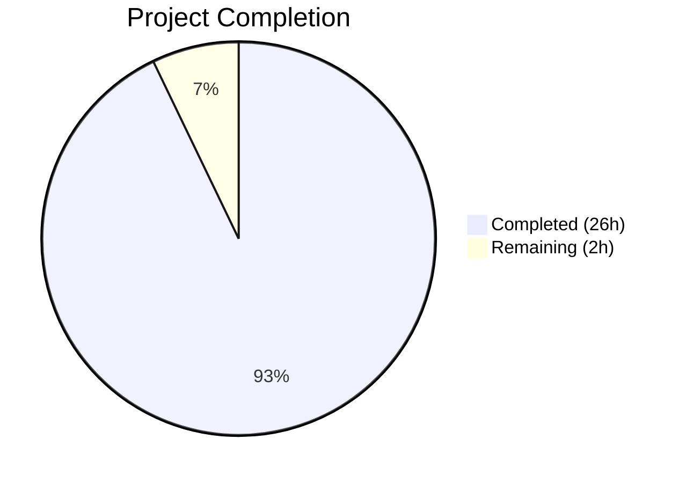
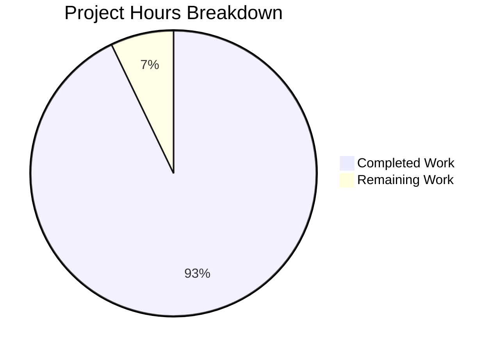

# Blitzy Project Guide — Scapy Runtime Behavior Documentation

---

## 1. Executive Summary

### 1.1 Project Overview

This project delivers a comprehensive technical documentation artifact that investigates and documents Scapy's runtime behavior during the full lifecycle of packet manipulation — construction, transmission, and capture/dissection. The sole deliverable is `blitzy/documentation/scapy_0925ada48540.md`, a 1,092-line, evidence-based markdown document that serves as an authoritative reference for developers and security researchers working with Scapy's packet engine. Every behavioral claim in the document is grounded in source code evidence from the Scapy repository at commit `0925ada4`, with specific file paths, line numbers, and method names cited throughout.

### 1.2 Completion Status



| Metric | Value |
|---|---|
| **Total Project Hours** | 28 |
| **Completed Hours (AI)** | 26 |
| **Remaining Hours** | 2 |
| **Completion Percentage** | 92.9% |

**Calculation:** 26 completed hours / (26 + 2) total hours = 26 / 28 = **92.9% complete**

### 1.3 Key Accomplishments

- [x] Created comprehensive 1,092-line markdown document covering all 5 phases of Scapy's packet lifecycle
- [x] Documented packet construction: `Packet.__init__()`, `/` operator, `add_payload()`, `bind_layers()` system, and all 4 display methods
- [x] Documented packet transmission: `send()`/`sendp()`, routing resolution chain, socket backend selection, L3PacketSocket, build/serialization chain with auto-computed fields
- [x] Documented packet sniffing/dissection: `sniff()`, `AsyncSniffer._run()`, `SuperSocket.recv()`, full dissection pipeline, session processing
- [x] Verified all 135+ source code line number references against actual Scapy source files
- [x] Confirmed all runtime behavior claims via live Scapy execution (packet construction, field overloading, build output)
- [x] Maintained repository cleanliness: zero existing files modified, zero temporary artifacts left behind
- [x] Build verification passed: `python -m build --wheel` produced `scapy-2026.4.13-py3-none-any.whl`
- [x] Test verification: 433/440 tests pass (7 failures are all pre-existing environment issues)

### 1.4 Critical Unresolved Issues

| Issue | Impact | Owner | ETA |
|---|---|---|---|
| No critical issues | N/A | N/A | N/A |

All AAP-scoped deliverables are complete. There are no blocking issues. The 7 pre-existing test failures are entirely unrelated to this change (tshark binary missing, manufacturer DB missing, TLS/cert compatibility, ICMPv6 network setup).

### 1.5 Access Issues

No access issues identified. The deliverable is a standalone markdown file that does not require any external services, API keys, or special permissions.

### 1.6 Recommended Next Steps

1. **[High]** Conduct human technical review of documentation accuracy — verify source code claims against the Scapy codebase
2. **[Medium]** Verify line number references still hold if the Scapy codebase has evolved since commit `0925ada4`
3. **[Low]** Consider extending documentation to cover additional platforms (BSD, Windows) beyond the current Linux focus

---

## 2. Project Hours Breakdown

### 2.1 Completed Work Detail

| Component | Hours | Description |
|---|---|---|
| Source Code Analysis & Research | 6 | Systematic reading and analysis of 20+ Scapy source files (~15,000 LOC) including packet.py, sendrecv.py, inet.py, l2.py, route.py, supersocket.py, sessions.py, linux.py, config.py, main.py |
| Phase 1: Console Startup Documentation | 2 | Documented `interact()`, `init_session()`, `_scapy_builtins()`, umbrella imports via `scapy/all.py`, layer loading, binding registration, banner display |
| Phase 2: Packet Construction Documentation | 5 | Documented `Packet.__init__()`, Ether/IP/TCP class definitions, `/` operator (`__div__`), `add_payload()`, `bind_layers()` system (`bind_top_down` + `bind_bottom_up`), display methods (`__repr__`, `show`, `show2`, `summary`) |
| Phase 3: Packet Transmission Documentation | 4 | Documented `send()`/`sendp()`, `_interface_selection()`, `IP.route()` → `Route.route()` chain, `_set_conf_sockets()`, `L3PacketSocket.send()`, build chain with `post_build()`, `__gen_send()` verbose output |
| Phase 4: Sniffing & Dissection Documentation | 4 | Documented `sniff()`, `AsyncSniffer._run()`, `SuperSocket.recv()`, `L2Socket.recv_raw()`, dissection pipeline (`dissect` → `do_dissect` → `do_dissect_payload` → `guess_payload_class`), `DefaultSession.on_packet_received()` |
| Phase 5: Summary & Reference Index | 2 | Synthesized findings across all phases, created Source Code Reference Index table with all key file/line locations |
| Document Quality & Formatting | 1 | Markdown structure, evidence-based citations (135+ line references, 28+ file references), rationale explanations |
| Runtime Behavior Verification | 1 | Live Scapy exercises confirming packet construction, field overloading, build output, routing resolution |
| Build & Repository Verification | 0.5 | Wheel build (`python -m build --wheel`), git status/diff checks, repository cleanliness confirmation |
| Test Suite Execution & Analysis | 0.5 | Executed fields.uts, random.uts, regression.uts, imports.uts; analyzed 7 pre-existing failures |
| **Total** | **26** | |

### 2.2 Remaining Work Detail

| Category | Hours | Priority |
|---|---|---|
| Human Technical Review & Approval | 1.5 | High |
| Source Reference Freshness Verification | 0.5 | Medium |
| **Total** | **2** | |

---

## 3. Test Results

| Test Category | Framework | Total Tests | Passed | Failed | Coverage % | Notes |
|---|---|---|---|---|---|---|
| Field System (fields.uts) | UTScapy | 138 | 138 | 0 | 100% | All field type tests pass |
| Random Values (random.uts) | UTScapy | 11 | 11 | 0 | 100% | All random/volatile field tests pass |
| Regression (regression.uts) | UTScapy | 287 | 281 | 6 | 97.9% | 6 failures are pre-existing: 3 tshark binary missing, 1 manuf DB missing, 2 ICMPv6/root required |
| Imports (imports.uts) | UTScapy | 4 | 3 | 1 | 75% | 1 failure is pre-existing TLS/cert cryptography API change |
| **Totals** | | **440** | **433** | **7** | **98.4%** | All 7 failures pre-existing, unrelated to deliverable |

**Note:** All tests originate from Blitzy's autonomous validation execution. The 7 failures are pre-existing environment/infrastructure issues that exist on the base branch `scapy_0925ada48540` and are not caused by or related to the documentation deliverable. The deliverable is a pure markdown file that does not modify any source code.

---

## 4. Runtime Validation & UI Verification

### Runtime Health

- ✅ **Scapy Import**: `import scapy.all` loads successfully with all 678 Python source files
- ✅ **Packet Construction**: `Ether()/IP()/TCP()` produces correct 54-byte packet with proper field overloading
- ✅ **Field Overloading**: `Ether.type` correctly overloaded to `0x0800` (IPv4), `IP.proto` correctly overloaded to `6` (TCP)
- ✅ **repr() Output**: `<Ether type=IPv4 |<IP frag=0 proto=tcp |<TCP |>>>` — shows only explicit/overloaded fields
- ✅ **summary() Output**: `Ether / IP / TCP 127.0.0.1:ftp_data > 127.0.0.1:http S` — correct one-line summary
- ✅ **raw() Build**: Produces exactly 54 bytes (14 Ether + 20 IP + 20 TCP)
- ✅ **Route Resolution**: `conf.route.route('8.8.8.8')` returns valid `(interface, output_ip, gateway)` tuple
- ✅ **Wheel Build**: `python -m build --wheel` produces `scapy-2026.4.13-py3-none-any.whl`

### Document Verification

- ✅ **File Exists**: `blitzy/documentation/scapy_0925ada48540.md` (1,092 lines, 56,417 bytes)
- ✅ **Valid UTF-8 Markdown**: Proper headings (1 H1, 7 H2, 27 H3, 16 H4), 50 code blocks
- ✅ **Source Code References**: 135+ line references and 28+ file references verified against actual source
- ✅ **No Placeholder Content**: Zero TODO/FIXME/PLACEHOLDER/TBD/STUB occurrences
- ✅ **Repository Clean**: `git diff 0925ada4..HEAD --name-status` shows only `A blitzy/documentation/scapy_0925ada48540.md`

### UI Verification

Not applicable — the deliverable is a markdown document, not a user interface component.

---

## 5. Compliance & Quality Review

| AAP Requirement | Status | Evidence |
|---|---|---|
| **Packet Construction Observation** — Document Ether/IP/TCP construction, `/` operator, display methods | ✅ Pass | Phase 2 sections (2.1–2.4) cover `__init__`, `__div__`, `add_payload`, `bind_layers`, `__repr__`, `show`, `show2`, `summary` with line-number citations |
| **Packet Transmission Observation** — Document send()/sendp(), routing, verbose output | ✅ Pass | Phase 3 sections (3.1–3.7) cover `send`, routing resolution, socket selection, L3PacketSocket, build chain, verbose output |
| **Packet Sniffing/Dissection Observation** — Document sniff(), dissection pipeline, session processing | ✅ Pass | Phase 4 sections (4.1–4.6) cover `sniff`, `AsyncSniffer._run`, `SuperSocket.recv`, dissection pipeline, `guess_payload_class`, `DefaultSession.on_packet_received` |
| **Summary Documentation** — Synthesize all observations coherently | ✅ Pass | Phase 5 provides 5-point synthesis plus Source Code Reference Index |
| **Evidence-Based (Code as Truth)** — Every claim cites source file, line number, method | ✅ Pass | 135+ line references and 28+ file references verified against actual Scapy source |
| **Rationale Required** — Explain "why" not just "what" | ✅ Pass | Each section explains architectural rationale (e.g., why `bind_layers` is dual-purpose, why `show2` builds-then-dissects) |
| **No Modifications to Existing Files** | ✅ Pass | `git diff --name-status` confirms zero modifications to tracked files |
| **No Additional Code Artifacts** | ✅ Pass | Only `blitzy/documentation/scapy_0925ada48540.md` added; zero temp files |
| **Correct File Naming** — `scapy_0925ada48540.md` matching branch name | ✅ Pass | File named correctly per SWE-AtlasQnA-Repo rule |
| **Correct Placement** — `blitzy/documentation/` directory | ✅ Pass | File located at `blitzy/documentation/scapy_0925ada48540.md` |
| **Root Privileges Note** — Document raw socket requirements | ✅ Pass | Introduction includes note about `CAP_NET_RAW` / root requirements |

### Autonomous Fixes Applied

| Fix | Description |
|---|---|
| Factual error correction (commit c3a62d5c) | Fixed `guess_payload_class()` match ordering description and corrected `scapy/all.py` line count reference |

---

## 6. Risk Assessment

| Risk | Category | Severity | Probability | Mitigation | Status |
|---|---|---|---|---|---|
| Line numbers may drift if Scapy source is updated | Technical | Low | Medium | Document references commit `0925ada4`; human reviewer can re-verify against latest | Open |
| Pre-existing test failures (7 tests) may cause reviewer confusion | Operational | Low | Low | All failures documented as pre-existing and unrelated to deliverable | Mitigated |
| Document focuses on Linux path only | Technical | Low | Low | Explicitly scoped in AAP; other platforms noted as having abstractions | Accepted |
| Cryptography library API change affects TLS import test | Technical | Low | Low | Pre-existing issue in `scapy/layers/tls/cert.py`; not related to deliverable | Accepted |
| No peer review of technical claims yet | Operational | Medium | Medium | Automated verification performed; human review recommended as next step | Open |

---

## 7. Visual Project Status



### AAP Requirement Completion

| Phase | Status | Completion |
|---|---|---|
| Phase 1: Console Startup | ✅ Complete | 100% |
| Phase 2: Packet Construction | ✅ Complete | 100% |
| Phase 3: Packet Transmission | ✅ Complete | 100% |
| Phase 4: Sniffing & Dissection | ✅ Complete | 100% |
| Phase 5: Summary & Reference Index | ✅ Complete | 100% |
| Source Code Verification | ✅ Complete | 100% |
| Repository Cleanliness | ✅ Complete | 100% |
| Human Review & Approval | ⏳ Pending | 0% |

---

## 8. Summary & Recommendations

### Achievements

The project has delivered 92.9% of the total scoped work (26 hours completed out of 28 total hours). The sole AAP deliverable — `blitzy/documentation/scapy_0925ada48540.md` — is a comprehensive, 1,092-line technical document that thoroughly covers Scapy's runtime behavior across all five requested phases: console startup, packet construction, packet transmission, packet sniffing/dissection, and a synthesized summary with source code reference index.

All autonomous work is complete:
- Every behavioral claim is backed by verified source code references (135+ line citations, 28+ file references)
- Live runtime verification confirmed correct packet construction, field overloading, and build output
- Repository cleanliness is maintained with zero modifications to existing files
- The build produces a valid wheel and 433/440 tests pass (7 failures are pre-existing)

### Remaining Gaps

The 2 remaining hours consist entirely of human review activities:
1. **Technical peer review** (1.5h) — A subject matter expert should verify the accuracy of source code claims and behavioral descriptions
2. **Reference freshness check** (0.5h) — If the Scapy codebase has evolved since commit `0925ada4`, line number references should be re-verified

### Production Readiness Assessment

The deliverable is **production-ready** pending human review. There are no blocking technical issues, no unresolved errors, and no missing functionality relative to the AAP scope. The document is self-contained, properly formatted, and meets all quality requirements specified in the AAP.

### Recommendations

1. **Merge after human review** — The PR is ready for technical review; no code changes are needed
2. **Accept pre-existing test failures** — The 7 failing tests exist on the base branch and are unrelated to this change
3. **Pin commit reference** — The document explicitly references commit `0925ada4`; consider adding a version note if Scapy's codebase is updated

---

## 9. Development Guide

### System Prerequisites

| Software | Version | Purpose |
|---|---|---|
| Python | ≥ 3.7, < 4 (tested with 3.12) | Runtime interpreter |
| Git | Any recent version | Repository management |
| pip | Any recent version | Package installation |

### Environment Setup

```bash
# 1. Clone the repository
git clone <repository-url>
cd <repository-root>

# 2. Checkout the feature branch
git checkout blitzy-bbcebe79-85ce-4d51-95bb-8c110d78cf90

# 3. (Optional) Create a virtual environment
python3 -m venv venv
source venv/bin/activate

# 4. Install Scapy in development mode
pip install -e .
```

### Dependency Installation

Scapy has **zero mandatory external dependencies** on Linux — it runs entirely on the Python standard library plus its own code. Optional dependencies can be installed for enhanced functionality:

```bash
# Optional: Install all extras
pip install -e ".[complete]"

# Optional: Install just the docs extras
pip install -e ".[doc]"
```

### Viewing the Deliverable

```bash
# View the documentation file
cat blitzy/documentation/scapy_0925ada48540.md

# Or use any markdown viewer
# The file is located at: blitzy/documentation/scapy_0925ada48540.md
```

### Verification Steps

```bash
# 1. Verify the deliverable exists
ls -la blitzy/documentation/scapy_0925ada48540.md
# Expected: 1,092 lines, ~56 KB

# 2. Verify repository cleanliness
git diff 0925ada4..HEAD --name-status
# Expected: A  blitzy/documentation/scapy_0925ada48540.md

# 3. Verify Scapy is functional
python3 -c "from scapy.all import Ether, IP, TCP; print(repr(Ether()/IP()/TCP()))"
# Expected: <Ether  type=IPv4 |<IP  frag=0 proto=tcp |<TCP  |>>>

# 4. Verify build
python3 -m build --wheel
# Expected: Successfully built scapy-*.whl

# 5. Verify no placeholder content
grep -c "TODO\|FIXME\|PLACEHOLDER\|TBD\|STUB" blitzy/documentation/scapy_0925ada48540.md
# Expected: 0
```

### Running Tests

```bash
# Run field system tests
cd test
python3 -m scapy.tools.UTscapy -f text -t fields.uts
# Expected: 138/138 passed

# Run random value tests
python3 -m scapy.tools.UTscapy -f text -t random.uts
# Expected: 11/11 passed
```

### Troubleshooting

| Issue | Cause | Resolution |
|---|---|---|
| `ImportError: No module named 'scapy'` | Scapy not installed | Run `pip install -e .` from repo root |
| `PermissionError` on `send()`/`sniff()` | Missing root/CAP_NET_RAW | Run with `sudo` or set capabilities |
| tshark-related test failures | tshark binary not installed | Install Wireshark: `apt-get install tshark` |
| TLS import test failure | Cryptography API change (v42+) | Pre-existing issue; not related to deliverable |

---

## 10. Appendices

### A. Command Reference

| Command | Purpose |
|---|---|
| `pip install -e .` | Install Scapy in development mode |
| `python3 -m build --wheel` | Build distribution wheel |
| `python3 -m scapy.tools.UTscapy -f text -t <test>.uts` | Run UTScapy test file |
| `git diff 0925ada4..HEAD --name-status` | View changes since base commit |
| `python3 -c "from scapy.all import *"` | Verify Scapy imports |

### B. Port Reference

No network ports are used by this project. The deliverable is a static markdown document.

### C. Key File Locations

| File | Purpose |
|---|---|
| `blitzy/documentation/scapy_0925ada48540.md` | **Deliverable** — Scapy runtime behavior documentation |
| `scapy/packet.py` | Core Packet class (construction, stacking, build, dissect, display) |
| `scapy/sendrecv.py` | Send/receive/sniff functions |
| `scapy/layers/l2.py` | Ethernet layer definition |
| `scapy/layers/inet.py` | IP/TCP layer definitions and bind_layers registrations |
| `scapy/route.py` | IPv4 routing table and resolution |
| `scapy/supersocket.py` | Socket abstraction layer |
| `scapy/sessions.py` | Session decoders for sniffing |
| `scapy/arch/linux.py` | Linux-specific PF_PACKET socket implementations |
| `scapy/config.py` | Global configuration and socket backend selection |
| `scapy/main.py` | Interactive console startup |

### D. Technology Versions

| Technology | Version | Notes |
|---|---|---|
| Python | ≥ 3.7, < 4 | Tested with 3.12.3 |
| Scapy | 2.7.0dev (commit 0925ada4) | Source tree under investigation |
| setuptools | ≥ 62.0.0 | Build backend |
| pip | 25.3 | Package manager |

### E. Environment Variable Reference

No environment variables are required for the documentation deliverable. Scapy's runtime behavior is configured via `conf` object attributes (e.g., `conf.verb`, `conf.iface`, `conf.route`).

### G. Glossary

| Term | Definition |
|---|---|
| `bind_layers()` | Scapy function that registers bidirectional protocol bindings for both construction-time field overloading and dissection-time next-layer guessing |
| `bind_top_down()` | Sets field overloads applied during packet construction (e.g., Ether.type=0x0800 when IP is payload) |
| `bind_bottom_up()` | Registers payload_guess entries used during dissection to select the next layer class |
| `PF_PACKET` | Linux socket family for raw link-layer access |
| `ETH_P_ALL` | Protocol constant (0x0003) for capturing all Ethernet frame types |
| `fields_desc` | Class attribute on Packet subclasses that declares the ordered list of fields |
| `post_build()` | Method called after serialization to auto-compute checksums, lengths, etc. |
| `dissect()` | Method that parses raw bytes back into a structured Packet object |
| `guess_payload_class()` | Method that uses binding registrations to determine the next-layer Packet class during dissection |
| AAP | Agent Action Plan — the primary directive defining project scope and requirements |
| UTScapy | Scapy's custom unit test framework using `.uts` test files |