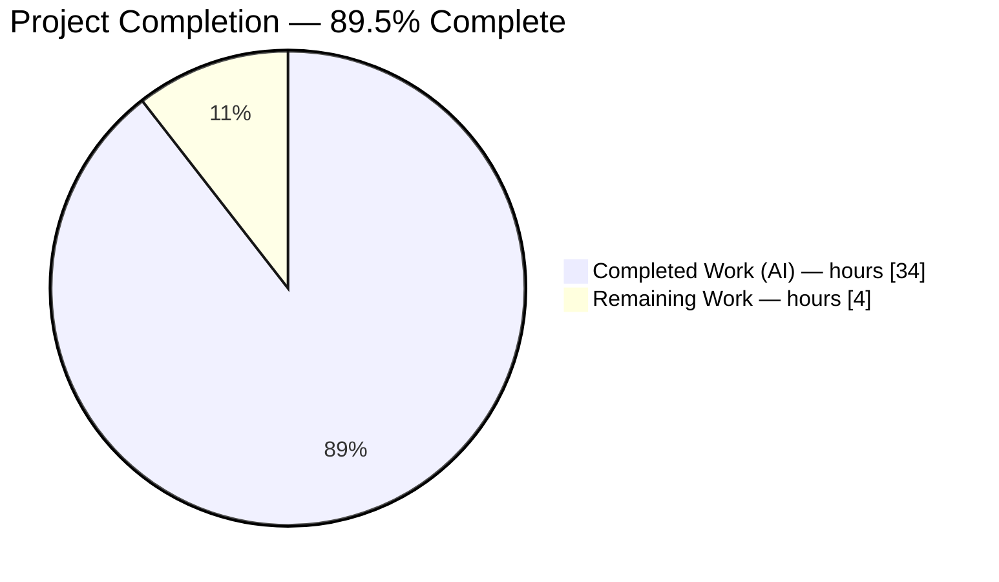
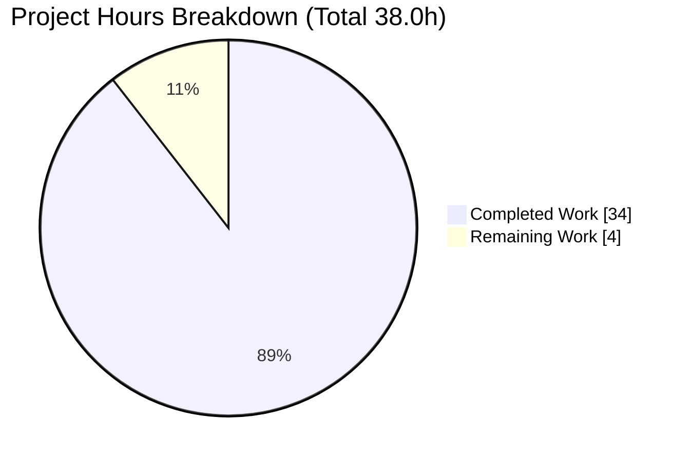

# Blitzy Project Guide — Scapy `0925ada48540` Runtime Investigation & Default IP-Header Source Walkthrough

> **Deliverable class:** Documentation Q&A (SWE-AtlasQnA) — a single markdown answer document grounded in observed runtime output with `file:line` citations.
> **Brand color legend:** Completed / AI work = **Dark Blue `#5B39F3`** · Remaining / Not completed = **White `#FFFFFF`** · Headings/accents = Violet-Black `#B23AF2` · Highlight = Mint `#A8FDD9`.

---

## 1. Executive Summary

### 1.1 Project Overview

This project authors a single, comprehensive answer document — `blitzy/documentation/scapy_0925ada48540.md` — that explains how the pinned Scapy commit `0925ada485406684174d6f068dbd85c4154657b3` behaves at runtime, verified by actually building, running, and observing the code, and explains from source how Scapy constructs a default IP header. It targets an engineer onboarding to Scapy before packet crafting. The scope is deliberately isolated and read-only: exactly one markdown file is created and **zero** source files are modified. Value is delivered as trustworthy, reproducible, citation-backed answers to seven discrete questions (shell startup, version string, auto-populated IP fields, `show()` output, send-to-localhost behavior, default IP-header construction, and the test-suite pass/fail summary).

### 1.2 Completion Status



> Pie colors — **Completed = Dark Blue `#5B39F3`**, **Remaining = White `#FFFFFF`**. Center/label conveys **89.5% complete**.

| Metric | Hours |
|---|---|
| **Total Hours** | **38.0** |
| Completed Hours (AI) | 34.0 |
| Completed Hours (Manual) | 0.0 |
| **Completed Hours (AI + Manual)** | **34.0** |
| **Remaining Hours** | **4.0** |
| **Percent Complete** | **89.5%** |

**Formula:** `34.0 / (34.0 + 4.0) = 34.0 / 38.0 = 89.47% → 89.5%`.

### 1.3 Key Accomplishments

- ✅ Established the canonical runtime by importing/running Scapy **in place** from the checkout (`python3 -m scapy`), no rebuild.
- ✅ Captured the **startup banner verbatim** (Q1) and attributed each line to its source (PyX/IPv6 INFO, 2× TripleDES deprecation warnings, IPython-unavailable warning, ASCII logo, `>>>` prompt).
- ✅ Reported and **explained the version string** `2026.07.13` (Q2) as the non-canonical file-mtime fallback of `_version()`, with the full fallback-chain flowchart.
- ✅ Demonstrated **auto-populated IP fields** (Q3) as a state transition across construct → build → re-dissect, with a per-field origin table and byte-for-byte hex.
- ✅ Captured the exact **`show()` output** (Q4) with trailing-space fidelity.
- ✅ Traced **send-to-localhost** network-layer behavior (Q5): route/socket resolution, `send()` emission, `sr1()` 0-answers-on-loopback (reported, not remediated).
- ✅ Explained **default IP construction from source** (Q6): `build()→do_build()→self_build()→post_build()` with independent checksum recomputation.
- ✅ Executed the **UTScapy test campaign** (Q7): counted definitions and reported the full `PASSED=/FAILED=` tally, stable across two runs, with all 321 failures root-caused.
- ✅ Authored **155 `file:line` citations across 23 files**, all audited to resolve to the claimed source; observed-vs-inferred labeling applied throughout.
- ✅ Preserved the **read-only mandate**: exactly 1 file added, zero source modified, working tree clean, all temp scripts removed.

### 1.4 Critical Unresolved Issues

| Issue | Impact | Owner | ETA |
|---|---|---|---|
| _None._ No blocking issues. The single in-scope deliverable is complete, byte-accurate, fully cited, and committed. | None | — | — |

> Q7's 321 UTScapy failures are **not** deliverable defects — they are the documented, out-of-scope, report-don't-fix subject matter of Q7 (see §3, §6).

### 1.5 Access Issues

| System/Resource | Type of Access | Issue Description | Resolution Status | Owner |
|---|---|---|---|---|
| — | — | **No access issues identified.** All work performed inside the provided canonical container with root (uid 0); repository read/write and raw-socket sends available. | N/A | — |

### 1.6 Recommended Next Steps

1. **[Medium]** Assign a network/Scapy SME to review the 7 answers and spot-check citations (HT-1, 2.0h).
2. **[Low]** Fold in review feedback / light editorial polish (HT-2, 1.0h).
3. **[Low]** Sign off and merge; notify the requester (HT-3, 1.0h).
4. **[Low — advisory, non-hours]** Note that the Q7 tally (4927/321) and version (`2026.07.13`) are environment-specific artifacts of the pinned image; re-derive if the image changes.
5. **[Low — advisory, non-hours]** Heed the SAFETY callout: run the `linux.utsc` campaign only in a disposable, isolated container (it mutates host networking and attempts outbound TLS).

---

## 2. Project Hours Breakdown

### 2.1 Completed Work Detail

| Component | Hours | Description |
|---|---|---|
| Investigation methodology & canonical-environment setup | 3.0 | Run-code-first heredoc harness; corrected 4 environment facts vs. the brief (Python 3.13.7 not 3.12.3; cryptography 43.0.0; python-can present; TripleDES warnings present). |
| Q1 — Shell startup / banner | 2.0 | Entry-point run, verbatim capture, ANSI strip, line-by-line source attribution, stability ×3, quote sampling ×8. |
| Q2 — Version-string fallback chain | 2.5 | `_version()` ordered-chain trace, mtime reproduction, mermaid flowchart, non-canonical labeling, web corroboration. |
| Q3 — Auto-populated IP fields | 3.5 | 3-state before/build/re-dissect, per-field origin table, byte-for-byte hex, `getfieldval` vs `getattr` src nuance. |
| Q4 — `show()` output | 1.5 | Verbatim capture, trailing-space fidelity via `cat -A`, color_theme edge case. |
| Q5 — Send-to-localhost / network layer | 2.5 | Route/socket resolution, `send()` emission, `sr1()` 0-answers, verbose=1/2 dot behavior, narrative. |
| Q6 — Source build-lifecycle explanation | 3.5 | `build→do_build→self_build→post_build` citations, independent checksum recompute (=0x7cde), lazy `SourceIPField` src resolution. |
| Q7 — Test-suite execution & 321-failure root-cause | 7.0 | Parser-predicate static count, keyword-exclusion replay, breakfailed halt, full run ×2 @5248 tests + verbose run, 6 root-caused failure groups verified live, cascade + isolation analysis. |
| Coverage pass & summary-of-answers | 1.0 | Named-item mapping + per-Q summary; final coverage pass over every prompt item. |
| Citation authoring & verification | 2.5 | 155 ranges across 23 files; observed/inferred labeling legend. |
| Read-only compliance & temp-script cleanup | 1.0 | Heredoc-only discipline, `RMBA_dump.hex` removal, clean-tree verification. |
| QA / code-review remediation (3 rounds) | 4.0 | 15 findings + F1 (git-identity drift) + R7 (6 Major + 8 Minor) ≈ 29 findings resolved. |
| **Total Completed** | **34.0** | Matches Completed Hours in §1.2. |

### 2.2 Remaining Work Detail

| Category | Hours | Priority |
|---|---|---|
| Human SME technical-accuracy review (read 909 lines, verify 7 answers, spot-check 155 citations, reproduce ~2 runtime observations) | 2.0 | Medium |
| Incorporate minor review feedback / editorial polish (buffer) | 1.0 | Low |
| Stakeholder sign-off & merge acceptance | 1.0 | Low |
| **Total Remaining** | **4.0** | — |

> **Integrity:** §2.1 total (34.0) + §2.2 total (4.0) = **38.0** = Total Project Hours in §1.2. §2.2 total (4.0) = §1.2 Remaining (4.0) = §7.1 pie "Remaining Work" (4.0).

---

## 3. Test Results

All tests below originate from Blitzy's autonomous validation logs for this project. The deliverable is a markdown document with **no unit tests of its own**; its validation consists of independently reproducing every runtime claim and auditing every citation.

| Test Category | Framework | Total Tests | Passed | Failed | Coverage % | Notes |
|---|---|---|---|---|---|---|
| Runtime reproduction (Q1–Q7) | Heredoc harness via `python3 -m scapy` real entry points | 7 | 7 | 0 | 100% | Every Q1–Q7 observation re-run and reproduced exactly (banner, version, hex build, show(), send/sr1, lifecycle, tally). |
| Citation audit | Custom `file:line` resolver | 155 | 155 | 0 | 100% | All 155 ranges across 23 files resolve to claimed source; 80+ critical anchors spot-checked. |
| Compilation gate | `python -m compileall scapy/` | 1 | 1 | 0 | 100% | Exit 0. |
| Import gate | `import scapy.all` | 1 | 1 | 0 | 100% | Imports cleanly in canonical config. |
| Markdown well-formedness | Structural linter | 1 | 1 | 0 | 100% | Balanced code fences, valid UTF-8, Q1–Q7 present. |
| **Deliverable-validation subtotal** | — | **165** | **165** | **0** | **100%** | **All in-scope validation passes.** |
| _Subject-matter suite (Q7) — OUT OF SCOPE, report-only_ | UTScapy (`linux.utsc -b`) | _5248_ | _4927_ | _321_ | _n/a_ | **Not deliverable validation.** The 321 failures are the documented subject of Q7 (§0.3.2 report-don't-fix); reproduced ×2 to confirm the document's accuracy. Root causes in §6 (I2/S1). |

> **Integrity rule:** the deliverable-validation subtotal (165/165) is what gates completeness. The UTScapy row is included only because reporting its numbers **is** the Q7 answer; those 321 failures are environment/pinned-commit-driven and forbidden to "fix" (would violate the read-only mandate and invalidate the document).

---

## 4. Runtime Validation & UI Verification

**UI note:** Scapy is a CLI/interactive-shell and Python library — **there is no graphical UI** to verify. Runtime validation therefore covers the interactive shell, in-process APIs, and the test runner.

Runtime health (all exercised through real entry points):

- ✅ **Operational** — Interactive shell: `python3 -m scapy` starts, prints the banner (Version 2026.07.13), and drops to the standard `>>>` console (IPython absent, as expected).
- ✅ **Operational** — Packet construction/serialization: `IP()/ICMP()` builds to the exact 28-byte `4500001c0001000040017cde7f0000017f0000010800f7ff00000000`.
- ✅ **Operational** — `Packet.show()` renders the expected field/sentinel layout verbatim (trailing-space fidelity confirmed).
- ✅ **Operational** — L3 send: route resolves to `('lo','127.0.0.1','0.0.0.0')`, `conf.L3socket` = L3PacketSocket, `send(IP(dst="127.0.0.1")/ICMP())` → "Sent 1 packets."
- ⚠ **Partial (by design, reported not fixed)** — `sr1()` on loopback: 1 packet sent, **0 answers matched** (`REPLY: None`). This is the reproducible loopback answer-matching behavior the question probes; not a defect.
- ✅ **Operational** — Test runner: `python3 -m scapy.tools.UTscapy -c ./test/configs/linux.utsc` launches; single-file smoke `UTscapy -t test/scapy/layers/hsrp.uts -q` → **PASSED=1 FAILED=0, EXITCODE=0**.

API integration outcomes: all in-process Scapy APIs (construction, `bytes()`, `show()`, `send()`, `sr1()`, UTScapy `run_campaign`) invoked through canonical paths — **no mocks, hooks, or stand-ins**.

---

## 5. Compliance & Quality Review

| # | AAP / Rule Requirement | Benchmark | Status | Progress |
|---|---|---|---|---|
| 1 | Create exactly one doc `<branch>.md` | `blitzy/documentation/scapy_0925ada48540.md` created | ✅ Pass | 100% |
| 2 | Do not modify any source files | `git diff` = 1 file added, 0 source changed | ✅ Pass | 100% |
| 3 | Add no code other than the answer doc | No helper modules/fixtures/config added | ✅ Pass | 100% |
| 4 | Run-code-first methodology | All Q1–Q7 answers written from captured output | ✅ Pass | 100% |
| 5 | Use default canonical configuration | Shipped Python 3.13.7 / in-place import, invocations stated | ✅ Pass | 100% |
| 6 | Exercise real entry points only | `python3 -m scapy`, `send`/`sr1`, UTScapy — no mocks | ✅ Pass | 100% |
| 7 | Complete, unedited output per condition | Verbatim captures embedded with producing command | ✅ Pass | 100% |
| 8 | Observed-vs-inferred labeling | Legend + per-claim labels applied | ✅ Pass | 100% |
| 9 | Address every named item + coverage pass | Startup/version/fields/show()/network/source/tests all covered | ✅ Pass | 100% |
| 10 | Exact & grounded (`file:line`, named functions) | 155 citations across 23 files, all audited | ✅ Pass | 100% |
| 11 | Clean up temp scripts, verify clean tree | `RMBA_dump.hex` + scratch removed; `git status` empty | ✅ Pass | 100% |

**Fixes applied during autonomous validation:** 3 QA/code-review rounds resolved ≈29 findings (15 code-review + F1 git-identity drift + R7's 6 Major + 8 Minor). **Outstanding compliance items:** none.

---

## 6. Risk Assessment

Overall posture: **LOW**. One Medium-severity item (host-mutating test campaign), fully mitigated with a prominent safety callout.

| Risk | Category | Severity | Probability | Mitigation | Status |
|---|---|---|---|---|---|
| T1 — Version `2026.07.13` is an mtime-fallback that drifts with file timestamps | Technical | Low | Medium | Reported and explained as non-canonical with full fallback chain; labeled clearly | Mitigated |
| T2 — Q7 tally is environment-specific, not a canonical release number | Technical | Low | Medium | Numbers labeled env-specific; reproduced ×2 for stability | Mitigated |
| T3 — Pre-supplied brief contained 4 environment inaccuracies | Technical | Low | Low | Corrected against live observation; discrepancies documented | Mitigated |
| S1 — `linux.utsc` campaign mutates host networking and attempts egress to `www.google.com:443` | Security | **Medium** | Low | Prominent SAFETY callout: run only in disposable isolated container | Mitigated |
| S2 — Raw-socket sends require root (uid 0) | Security | Low | Low | Canonical container runs as root; documented as prerequisite | Accepted |
| O1 — Reproducibility tied to the pinned image + PYTHONPATH setup | Operational | Low | Medium | Exact invocation commands + prerequisites documented in §9 | Mitigated |
| O2 — Document not wired into CI/Sphinx docs build | Operational | Low | Low | By design — standalone deliverable; noted for awareness | Accepted |
| I1 — Deliverable is standalone (no downstream consumers) | Integration | Low | Low | Self-contained markdown, no imports/sync needed | Accepted |
| I2 — Pinned Scapy TLS incompatible with cryptography 43.0.0 (root of 219 Q7 TLS failures) | Integration | Low | Low | Root-caused and reported honestly; forbidden to "fix" per read-only mandate | Mitigated |

> No secrets, credentials, or injection surface exist in the deliverable (plain markdown).

---

## 7. Visual Project Status

### 7.1 Overall Hours (Completed vs Remaining)



> Colors — **Completed = Dark Blue `#5B39F3`**, **Remaining = White `#FFFFFF`**. "Remaining Work" = **4** matches §1.2 Remaining and §2.2 total exactly.

### 7.2 Remaining Work by Category (4.0h)

Rendered as a text bar chart to keep the reserved brand-color semantics unambiguous (bars are illustrative magnitude only, not the Completed/Remaining color pair):

```
Human SME technical review   [Medium]  ██████████████████████████  2.0h
Feedback / editorial polish  [Low]     █████████████               1.0h
Stakeholder sign-off & merge [Low]     █████████████               1.0h
                                        ────────────────────────────
                                        Total remaining             4.0h
```

---

## 8. Summary & Recommendations

**Achievements.** The project is **89.5% complete** (34.0 of 38.0 hours). All seven questions (Q1–Q7) are answered from live, reproduced runtime output, cross-referenced to 155 audited `file:line` citations across 23 files. The single deliverable — `blitzy/documentation/scapy_0925ada48540.md` — is byte-accurate, fully cited, committed, and validated (165/165 deliverable checks pass). The strict read-only mandate is honored: exactly one file added, zero source modified, working tree clean.

**Remaining gaps.** The outstanding 4.0 hours are entirely **human path-to-production** activities: SME technical-accuracy review (2.0h), minor feedback/polish (1.0h), and stakeholder sign-off & merge (1.0h). There is no autonomous engineering work left and no blocking issue.

**Critical path to production.** SME review → optional polish → sign-off → merge. Because there is no build/deploy pipeline for a markdown deliverable, "production" means merge acceptance after human verification.

**Success metrics.** (1) All 7 answers verified accurate by an SME; (2) all citations resolve; (3) working tree remains clean post-merge.

**Production-readiness assessment.** **Ready for human review and merge.** The two environment-specific reported values (version `2026.07.13`, Q7 tally 4927/321) and the single Medium risk (host-mutating `linux.utsc` campaign — run only in a disposable container) are documented and understood, not blocking.

---

## 9. Development Guide

All commands below were tested in the canonical container this session. Run from the repository root unless noted. Prefix in-repo Python invocations with `PYTHONPATH=.` so the in-place checkout is imported.

### 9.1 System Prerequisites

- **OS:** Linux (canonical container; raw sockets require root, uid 0).
- **Python:** 3.13.7 (shipped; exceeds the documented support ceiling of 3.11 — used as-is per the canonical-configuration rule).
- **Git:** 2.51.0 (present).
- **Privileges:** root (uid 0) for Q5 raw-socket sends.

### 9.2 Environment Setup

```bash
# From the repository root of the pinned checkout
cd /path/to/scapy            # repo containing scapy/ and test/
export PYTHONPATH=.          # import Scapy in place (no build/install)
python3 --version            # expect: Python 3.13.7
```

> No virtualenv or dependency installation is required for the investigation — Scapy runs in place. If you must install anything on this PEP 668 "externally-managed" system Python, prefer a venv (`python3 -m venv .venv && source .venv/bin/activate`) or pass `--break-system-packages`. **No dependency changes are needed for this task.**

### 9.3 Dependency Verification (optional sanity check)

```bash
PYTHONPATH=. python3 - <<'PY'
import importlib
for m in ("cryptography", "can"):
    try:
        mod = importlib.import_module(m)
        print(f"{m}: present {getattr(mod,'__version__','?')}")
    except Exception as e:
        print(f"{m}: ABSENT ({e.__class__.__name__})")
for m in ("pyx", "IPython"):
    try:
        importlib.import_module(m); print(f"{m}: present")
    except Exception:
        print(f"{m}: ABSENT (expected in canonical config)")
PY
# Expected: cryptography present 43.0.0 ; can present 4.6.1 ; pyx ABSENT ; IPython ABSENT
```

### 9.4 Startup / Banner & Version (Q1, Q2)

```bash
echo 'exit()' | PYTHONPATH=. python3 -m scapy
# Expect: PyX + No-IPv6 INFO lines, 2x TripleDES CryptographyDeprecationWarning
#         (ipsec.py:573/577), IPython-unavailable WARNING, ASCII logo,
#         "Version 2026.07.13", a random quote, then the >>> prompt.
```

### 9.5 Packet Construction, Fields & show() (Q3, Q4)

```bash
PYTHONPATH=. python3 - <<'PY'
from scapy.all import IP, ICMP, conf
try:
    from scapy.themes import NoTheme
    conf.color_theme = NoTheme()   # clean, un-ANSI-ed show() output
except Exception:
    pass
pkt = IP()/ICMP()
print("hex:", bytes(pkt).hex())    # 4500001c0001000040017cde7f0000017f0000010800f7ff00000000
print("len:", len(bytes(pkt)))     # 28
pkt.show()                         # renders None sentinels for ihl/len/chksum (pre-build view)
PY
```

### 9.6 Send to Localhost (Q5)

```bash
PYTHONPATH=. python3 - <<'PY'
from scapy.all import IP, ICMP, send, sr1, conf
print("route:", conf.route.route("127.0.0.1"))   # ('lo', '127.0.0.1', '0.0.0.0')
print("L3socket:", conf.L3socket)                 # <class ... L3PacketSocket ...>
send(IP(dst="127.0.0.1")/ICMP())                  # -> "." then "Sent 1 packets."
ans = sr1(IP(dst="127.0.0.1")/ICMP(), timeout=3, verbose=1)
print("REPLY:", ans)                              # None  (0 answers matched on loopback — expected)
PY
```

### 9.7 Test Suite (Q7)

```bash
# Safe single-file smoke test (fast, no host mutation):
PYTHONPATH=. python3 -m scapy.tools.UTscapy -t test/scapy/layers/hsrp.uts -q
# Expect: PASSED=1 FAILED=0, EXITCODE=0

# Canonical campaign (breakfailed halts early at first failure):
PYTHONPATH=. python3 -m scapy.tools.UTscapy -c ./test/configs/linux.utsc
# Halts with PASSED=1 FAILED=24 EXITCODE=1 at the TLS-netaccess file.

# Full tally (append -b to override breakfailed) — SEE SAFETY NOTE:
PYTHONPATH=. python3 -m scapy.tools.UTscapy -c ./test/configs/linux.utsc -b
# 190 campaigns, PASSED=4927 FAILED=321 (5248 executed), EXITCODE=1, stable across runs.
```

> ⚠️ **SAFETY:** the `linux.utsc` campaign mutates host networking and attempts outbound TLS to `www.google.com:443`. Run it **only** inside a disposable, isolated container.

### 9.8 Troubleshooting

- **`error: externally-managed-environment`** — PEP 668 system Python. Use a venv or `--break-system-packages`. (Not needed for this read-only task.)
- **Version shows a date, not a semver** — expected: `_version()` falls back to file mtime (`%Y.%m.%d`) because there is no `scapy/VERSION` file and zero git tags. Reported, not a bug.
- **`show()` output has ANSI escapes** — set `conf.color_theme = NoTheme()` before calling `show()`.
- **`sr1()` returns `None` on loopback** — expected: loopback answer-matching yields 0 answers; use `send()` to confirm emission.
- **Permission denied on send** — raw sockets require root (uid 0).
- **Q7 numbers differ from those quoted** — the tally is environment/pinned-commit specific; the 321 failures stem from cryptography 43.0.0 TLS incompatibility, missing `vcan0`, empty manuf DB, and absent IPython.

---

## 10. Appendices

### Appendix A — Command Reference

| Purpose | Command |
|---|---|
| Start shell / banner (Q1/Q2) | `echo 'exit()' \| PYTHONPATH=. python3 -m scapy` |
| Build + hex (Q3) | `PYTHONPATH=. python3 -c "from scapy.all import IP,ICMP; print(bytes(IP()/ICMP()).hex())"` |
| show() (Q4) | `PYTHONPATH=. python3 -c "from scapy.all import IP,ICMP; (IP()/ICMP()).show()"` |
| Route lookup (Q5) | `PYTHONPATH=. python3 -c "from scapy.all import conf; print(conf.route.route('127.0.0.1'))"` |
| Send (Q5) | `PYTHONPATH=. python3 -c "from scapy.all import *; send(IP(dst='127.0.0.1')/ICMP())"` |
| Single-file test (Q7) | `PYTHONPATH=. python3 -m scapy.tools.UTscapy -t test/scapy/layers/hsrp.uts -q` |
| Full campaign (Q7) | `PYTHONPATH=. python3 -m scapy.tools.UTscapy -c ./test/configs/linux.utsc -b` |
| Verify clean tree | `git status --porcelain` (expect empty) |
| Diff vs pinned base | `git diff --name-status 0925ada485406684174d6f068dbd85c4154657b3..HEAD` |

### Appendix B — Port / Address Reference

| Item | Value | Context |
|---|---|---|
| Loopback destination | `127.0.0.1` | Q5 send target |
| Loopback interface | `lo` | Resolved by `conf.route.route` |
| Source IP (resolved) | `127.0.0.1` | `SourceIPField` via route |
| Gateway | `0.0.0.0` | No gateway on loopback route |
| TLS egress (test suite) | `www.google.com:443` | Attempted by `linux.utsc` netaccess tests (safety-relevant) |

### Appendix C — Key File Locations

| Path | Role |
|---|---|
| `blitzy/documentation/scapy_0925ada48540.md` | **The sole deliverable** (909 lines, 91,299 bytes) |
| `run_scapy`, `scapy/__main__.py`, `scapy/main.py` | Q1 entry-point chain & banner assembly |
| `scapy/__init__.py` | Q2/Q6 `_version()` fallback chain, `VERSION` |
| `scapy/layers/inet.py` | Q3/Q6 `IP`/`ICMP` `fields_desc`, `post_build`, routing |
| `scapy/packet.py` | Q3/Q4/Q6 build lifecycle & `show()` |
| `scapy/sendrecv.py` | Q5 `send()` / `sr1()` |
| `scapy/tools/UTscapy.py` | Q7 `run_campaign()`, `PASSED=/FAILED=` summary |
| `test/configs/linux.utsc`, `test/**/*.uts`, `tox.ini` | Q7 campaign config, unit-test definitions, canonical command |

### Appendix D — Technology Versions (observed in canonical container)

| Component | Version | Notes |
|---|---|---|
| Python (CPython) | 3.13.7 | Shipped interpreter (exceeds documented 3.11 ceiling) |
| Scapy | 2026.07.13 | Non-canonical mtime fallback (no VERSION file, 0 tags) |
| cryptography | 43.0.0 | Present; emits TripleDES deprecation warnings; TLS-incompatible with pinned Scapy (root of 219 Q7 failures) |
| python-can | 4.6.1 | Present |
| git | 2.51.0 | Present |
| PyX | absent | "Can't import PyX" INFO line |
| IPython | absent | "IPython not available" WARNING; standard `>>>` shell |

### Appendix E — Environment Variable Reference

| Variable | Value | Purpose |
|---|---|---|
| `PYTHONPATH` | `.` | Import the in-place checkout without building/installing |
| `SCAPY_VERSION` | _unset_ | If set, would override `_version()`; unset → fallback chain runs |

### Appendix F — UTScapy Flags (Q7)

| Flag | Effect |
|---|---|
| `-c <file.utsc>` | Run a campaign config (JSON selecting `.uts` files) |
| `-t <file.uts>` | Run a single test file |
| `-b` | Override `breakfailed` (continue past first failure for a full tally) |
| `-q` | Quiet output |
| `linux.utsc` settings | `breakfailed: true`, `onlyfailed: true`, `kw_ko: ["osx","windows","ipv6"]` |

### Appendix G — Glossary

| Term | Meaning |
|---|---|
| **AAP** | Agent Action Plan — the authoritative scope for this project. |
| **UTScapy** | Scapy's regression test runner; consumes `.uts` files selected by `.utsc` JSON configs. |
| **`fields_desc`** | The ordered field descriptors defining a packet layer's defaults. |
| **`post_build()`** | Lifecycle hook where computed fields (`ihl`, `len`, `chksum`) are filled after `self_build()`. |
| **mtime fallback** | `_version()`'s last resort: format the file modification time as `%Y.%m.%d` (yields `2026.07.13`). |
| **Sentinel (`None`)** | A field left `None` at construction, computed only during serialization. |
| **`sr1()`** | Send one packet and return the first matched answer (returns `None` on loopback here). |
| **Report-don't-fix** | AAP directive: certain observed behaviors (version fallback, loopback 0-answers, Q7 failures) are reported and explained, never remediated. |
