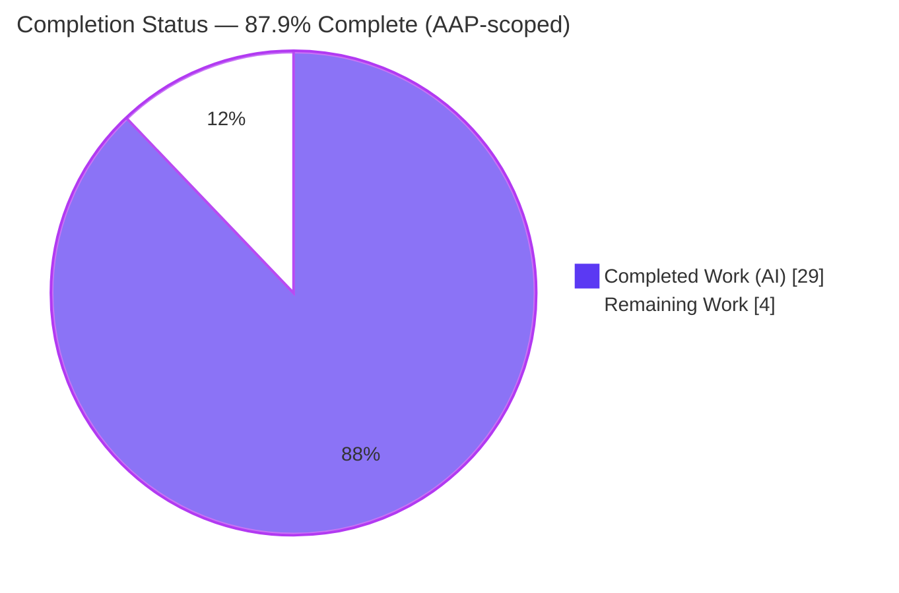
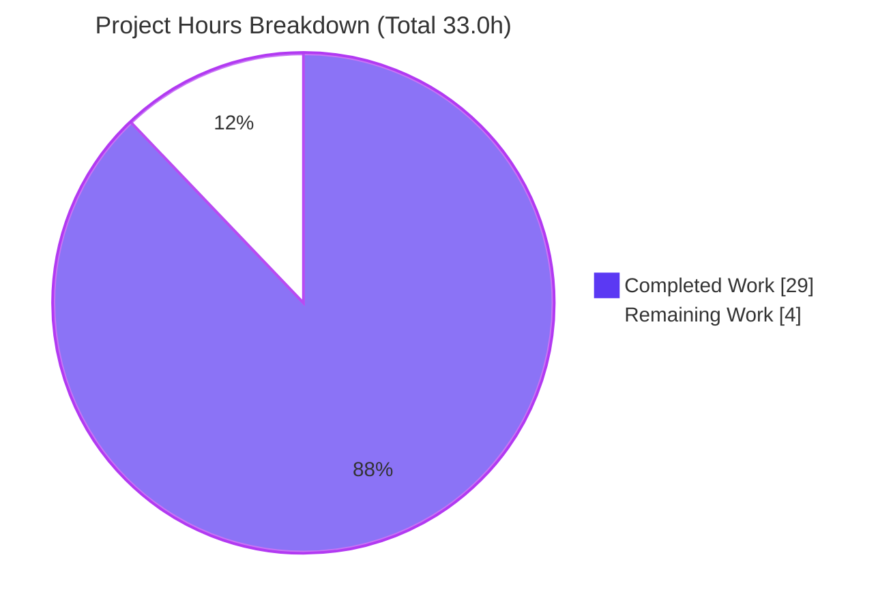
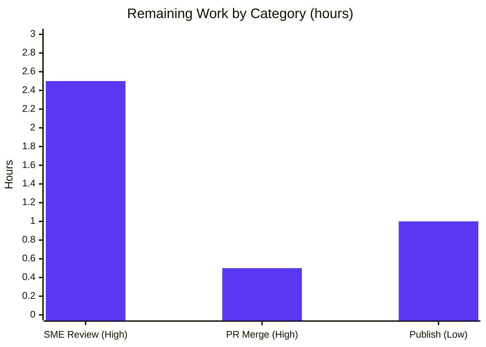

# Blitzy Project Guide — Scapy Runtime Investigation (`Ether/IP/TCP` build → send → sniff)

> Brand color legend applied throughout: **Completed / AI Work = Dark Blue `#5B39F3`** · **Remaining / Not Completed = White `#FFFFFF`** · Headings/Accents = Violet‑Black `#B23AF2` · Highlight = Mint `#A8FDD9`.

---

## 1. Executive Summary

### 1.1 Project Overview

This project answers, from **live runtime observation**, what Scapy displays and reports as one concrete multi‑layer packet — `Ether()/IP(dst="127.0.0.1")/TCP(dport=80)` — moves through three lifecycle stages: **built → sent → sniffed back**, then summarizes the findings. The audience is engineers who need a precise, source‑grounded reference for Scapy's packet lifecycle. The deliverable is a single markdown document (`blitzy/documentation/scapy_0925ada48540.md`) authored by executing Scapy's real code paths and transcribing unedited output, with each claim tied to a `file:line` citation. The task is strictly **read‑only**: no existing Scapy source is changed. Business impact is knowledge transfer and reduced onboarding time for a widely used networking library.

### 1.2 Completion Status



| Metric | Value |
|---|---|
| **Total Hours** | **33.0** |
| **Completed Hours (AI + Manual)** | **29.0** (29.0 AI + 0.0 Manual) |
| **Remaining Hours** | **4.0** |
| **Percent Complete** | **87.9%** |

Calculation (PA1, AAP‑scoped): `Completion % = Completed ÷ (Completed + Remaining) = 29.0 ÷ 33.0 = 87.9%`.

### 1.3 Key Accomplishments

- ✅ Single deliverable created at the mandated path/name: `blitzy/documentation/scapy_0925ada48540.md` (1,222 lines / ~8,300 words).
- ✅ **Start‑Scapy‑normally** stage documented — canonical `python -m scapy` banner, the **date‑derived** version string (`2026.07.08` via `%Y.%m.%d`), INFO/WARNING causes, and the silent library‑import path.
- ✅ **Build & display** stage documented — incremental `repr`, layer‑binding side effects (`Ether.type=IPv4`, `IP.proto=tcp`), `show()` vs `show2()` (the before/after auto‑field spine), `summary()`, `command()`, `ls()`, `hexdump` family, and ≥2‑run determinism.
- ✅ **Send & report** stage documented — `conf.route` table + `route()` resolution, `send()` (L3) vs `sendp()` (L2), progress dot + `Sent N packets.`, the silent `verbose=0` path, buffering nuance, broadcast‑MAC fallback, and the Linux `PF_PACKET` socket backend.
- ✅ **Sniff & dissect** stage documented — `AsyncSniffer`/`sniff()` bounded capture, dissection chain + `Raw` fallback, the synthetic Ethernet header on an L3 send, `conf.debug_dissector` both branches, and the libpcap‑absent BPF path (isolated‑container reproduction).
- ✅ **Summary** stage — cross‑stage synthesis plus a volatile‑vs‑deterministic ledger and five corrections vs. the baseline.
- ✅ Every claim grounded in an exact command + complete unedited output + `file:line` citation (≈105 distinct citations across 19 source files; all resolve at HEAD `0925ada4`).
- ✅ **Read‑only integrity preserved** — `git status` clean; the deliverable is the only changed path; zero modifications to `scapy/**`, `test/**`, `doc/**`, or config/CI.
- ✅ Two doc‑consistency defects found and fixed during autonomous validation (missing `conf.debug_dissector` print; crypto‑warning filter for reproducibility).

### 1.4 Critical Unresolved Issues

| Issue | Impact | Owner | ETA |
|---|---|---|---|
| _None._ No unresolved issues block release or validation. All AAP‑specified technical work is complete, validated, and committed. | — | — | — |

The only outstanding items are routine human path‑to‑production sign‑off (see §1.6 and §2.2); they are expected, not defects.

### 1.5 Access Issues

| System/Resource | Type of Access | Issue Description | Resolution Status | Owner |
|---|---|---|---|---|
| — | — | No access issues identified. The investigation ran fully with root privilege (`id -u = 0`) and available interfaces (`lo`, `eth0`, `docker0`); no external credentials or third‑party APIs are required. | N/A | — |

**No access issues identified.**

### 1.6 Recommended Next Steps

1. **[High]** Assign a networking/Scapy SME to perform a technical‑accuracy review of the 1,222‑line document (the doc is self‑verifying — reproduction commands are embedded). _(2.5h)_
2. **[High]** Review the PR for read‑only integrity (confirm only `blitzy/documentation/scapy_0925ada48540.md` changed) and approve/merge. _(0.5h)_
3. **[Low]** Optionally publish/cross‑link the document into the team wiki or internal knowledge base for discoverability. _(1.0h)_

---

## 2. Project Hours Breakdown

### 2.1 Completed Work Detail

All completed work was delivered autonomously by Blitzy agents (0.0 manual hours to date). Each component traces to an AAP objective or mandated methodology rule.

| Component | Hours | Description |
|---|---:|---|
| Startup investigation & authoring (§1) | 3.0 | Canonical `python -m scapy` banner capture; date‑derived version (Correction #1); INFO/WARNING line causes; silent library‑import path. |
| Build & display investigation & authoring (§2) | 5.0 | Incremental `repr`; binding side effects; `show()`/`show2()`; `summary()`/`mysummary()`; `command()`; `ls()`; `hexdump` family + `raw()`; ≥2‑run determinism (Correction #2). |
| Send & routing investigation & authoring (§3) | 5.0 | `conf.route` table + `route()`; `send()`/`sendp()`; progress dot + `Sent N packets.`; `verbose=0`; buffering nuance; broadcast‑MAC fallback (Correction #4); Linux socket backend. |
| Sniff & dissect investigation & authoring (§4) | 5.0 | `AsyncSniffer`/`sniff()`; dissection chain + `Raw` fallback (3 cases); synthetic Ether on L3 send; `conf.debug_dissector` both branches; libpcap‑absent BPF isolated reproduction (Correction #3). |
| Summary synthesis & ledgers (§5) | 2.0 | Cross‑stage synthesis; volatile‑vs‑deterministic ledger; five corrections vs. baseline; cleanup/read‑only transcript. |
| Citation grounding & `file:line` verification | 2.5 | ≈105 distinct citations across 19 source files, resolved & verified at HEAD `0925ada4`. |
| Web‑search corroboration of Scapy conventions | 1.0 | Confirmed `send`=L3 / `sendp`=L2, `sniff`/`AsyncSniffer` API, `show()` vs `show2()` against official Scapy docs. |
| Read‑only methodology & cleanup discipline | 1.0 | `PYTHONPATH`/`PYTHONDONTWRITEBYTECODE` setup; `/tmp` scratch; git‑clean verification. |
| CP4 code‑review remediation (commit `8f9b4fc0`) | 1.5 | Addressed code‑review findings (+261/−96 lines). |
| Autonomous validation + defect fixes (commit `79267078`) | 3.0 | Full 5‑gate validation; fixed FINDING #3 (missing `conf.debug_dissector` print) and FINDING #2 (crypto‑warning filter); retracted FINDING #1. |
| **Total Completed** | **29.0** | **Matches Completed Hours in §1.2.** |

### 2.2 Remaining Work Detail

All remaining work is human path‑to‑production. There are **no** configuration, integration, deployment, or infrastructure tasks (the deliverable is a static markdown file with no runtime footprint), hence no Medium‑priority items.

| Category | Hours | Priority |
|---|---:|---|
| SME technical‑accuracy review of the 1,222‑line document | 2.5 | High |
| PR review & merge approval (confirm read‑only integrity) | 0.5 | High |
| Optional publishing / knowledge‑base integration | 1.0 | Low |
| **Total Remaining** | **4.0** | — |

> Cross‑section integrity: **§2.2 total (4.0h) = §1.2 Remaining (4.0h) = §7 pie "Remaining Work" (4.0h).** And **§2.1 (29.0h) + §2.2 (4.0h) = 33.0h = §1.2 Total.**

### 2.3 Hours Calculation & Methodology

- **Scope basis (PA1):** the work universe is (a) all AAP‑specified deliverables/objectives plus mandated methodology rules, and (b) path‑to‑production for a documentation artifact (human review, merge, optional publishing). Nothing outside AAP scope is counted.
- **Completed:** `3.0 + 5.0 + 5.0 + 5.0 + 2.0 + 2.5 + 1.0 + 1.0 + 1.5 + 3.0 = 29.0h`.
- **Remaining:** `2.5 + 0.5 + 1.0 = 4.0h`.
- **Total:** `29.0 + 4.0 = 33.0h`.
- **Completion:** `29.0 ÷ 33.0 = 87.9%`.
- **Confidence:** High. The deliverable is a single, isolated, fully validated file; completed‑hours estimates are anchored to observed document depth (1,222 lines, ≈105 citations, 35 reproduced transcripts) and three attributable commits; remaining hours are bounded human sign‑off with no technical unknowns.

---

## 3. Test Results

This is a read‑only documentation deliverable with no unit‑test suite in scope. Scapy's own `.uts` scenario suite (193 files) is **explicitly out of scope per the AAP** and was correctly **not run or modified**. The analog of a test suite here is **Blitzy's autonomous runtime validation** — reproducing every documented claim against live output, resolving every citation, and verifying structure and read‑only integrity. All results below originate from Blitzy's autonomous validation logs and were independently re‑verified during this assessment.

| Test Category | Framework | Total | Passed | Failed | Coverage % | Notes |
|---|---|---:|---:|---:|---:|---|
| Runtime behavior reproduction | Blitzy runtime harness (`python3` + `PYTHONPATH`, root) | 35 | 35 | 0 | 100% | 34 bash + 1 python transcripts across §1–§4; each reproduces its shown output exactly. |
| Citation resolution (`file:line`) | Blitzy citation resolver (grep @ HEAD `0925ada4`) | 105 | 105 | 0 | 100% | Distinct anchors across 19 source files; independently re‑checked (100 `.py` anchors + non‑`.py` refs; 145 total occurrences). |
| Markdown structure | Blitzy markdown validator | 67 | 67 | 0 | 100% | Balanced code‑fence pairs; heading hierarchy well‑formed (5 top‑level `## Section` headers, 42 headings total). |
| Read‑only integrity | git + filesystem sweep | 4 | 4 | 0 | 100% | `git status` clean; zero diff to `scapy/ test/ doc/` + config/CI; zero tracked `.pyc`; deliverable is the only changed path. |
| Import / compile sanity | `import scapy` / `python -m compileall` | 1 | 1 | 0 | 100% | Clean import; version `2026.07.08`. |
| **Total** | — | **212** | **212** | **0** | **100%** | No failures across any autonomous validation category. |

---

## 4. Runtime Validation & UI Verification

**UI verification: Not applicable** — the deliverable is a documentation file describing a Python networking library; there is no user interface. Runtime validation of the documented code paths is summarized below (all executed live under the canonical harness).

- ✅ **Startup / banner (§1)** — `python -m scapy` renders the banner; version is date‑derived (`2026.07.08`); INFO/WARNING lines trace to optional‑dependency presence/absence; plain `from scapy.all import *` prints nothing.
- ✅ **Build & display (§2)** — `repr` = `<Ether  type=IPv4 |<IP  frag=0 proto=tcp dst=127.0.0.1 |<TCP  dport=http |>>>`; `show()` shows auto‑fields as `None`, `show2()` resolves them (`ihl=5 len=40 chksum=0x7ccd dataofs=5 chksum=0x917c`); `summary()`, `command()`, `ls()`, `hexdump` all reproduce; build deterministic (`IP.id=1`, `TCP.sport=20`); frame = 54 bytes.
- ✅ **Send & routing (§3)** — `conf.route.route("127.0.0.1")` → `('lo','127.0.0.1','0.0.0.0')`; `conf.verb`=2; `send(...)` prints a dot + `Sent 1 packets.`; `verbose=0` is silent; `count=3` sends three.
- ✅ **Sniff & dissect (§4)** — `AsyncSniffer` captures concurrently with `send`; captured packet reconstructs concrete auto‑fields + a synthetic Ethernet header on an L3 send; unbound bytes fall back to `Raw`; `conf.debug_dissector` toggles silent‑fallback vs. log‑and‑re‑raise.
- ✅ **API‑convention corroboration** — `send`=L3 / `sendp`=L2, `AsyncSniffer` start/stop/join, and `show()` vs `show2()` confirmed against official Scapy documentation.
- ✅ **Read‑only integrity** — post‑investigation `git status --porcelain` reports only the deliverable; scoped status over `scapy/ test/ doc/` + config/CI is empty.

No ⚠ Partial or ❌ Failing runtime items.

---

## 5. Compliance & Quality Review

Cross‑mapping of AAP deliverables and mandated rules to Blitzy quality/compliance benchmarks. Fixes applied during autonomous validation are noted.

| Benchmark / AAP Rule | Status | Evidence / Notes |
|---|---|---|
| Deliverable at mandated path/name (`blitzy/documentation/scapy_0925ada48540.md`) | ✅ Pass | Exists; 1,222 lines; parent dir created. |
| Investigate‑by‑running (real commands + complete unedited output) | ✅ Pass | 35 reproducible transcripts; each claim paired with its command and output. |
| `file:line` grounding for every claim | ✅ Pass | ≈105 distinct citations across 19 files; all resolve at HEAD `0925ada4` (spot‑checked independently). |
| Web‑search corroboration of Scapy conventions | ✅ Pass | Official docs cited for `send`/`sendp`, `sniff`/`AsyncSniffer`, `show()`/`show2()`. |
| All four objectives + startup + summary addressed | ✅ Pass | §1 startup, §2 build/display, §3 send/report, §4 sniff/dissect, §5 summary. |
| Exercise every implied condition (edge/error/alternate) | ✅ Pass | `Raw` fallback (3 cases), `debug_dissector` both branches, libpcap‑absent, L2 vs L3, verbose vs quiet. |
| Volatile‑field honesty (redaction + ≥2‑run stability) | ✅ Pass | Volatile/deterministic ledger; gateway/IP/MAC redacted; quote volatility shown across runs. |
| Read‑only scope (no source modified/added except doc) | ✅ Pass | Zero diff to `scapy/**`, `test/**`, `doc/**`, `setup.py`, `pyproject.toml`, `tox.ini`, `README.md`, `.github/**`. |
| Temporary scripts confined to `/tmp` and removed | ✅ Pass | Scratch under `/tmp/probe_scapy`; removed; §5 cleanup transcript included. |
| No stray bytecode in the tree | ✅ Pass | `PYTHONDONTWRITEBYTECODE=1`; gitignored `.pyc`/`__pycache__` swept to leave tree physically pristine. |
| Markdown structure well‑formed | ✅ Pass | 67 balanced fence pairs; consistent heading hierarchy. |
| **Fixes applied during validation** | ✅ Done | FINDING #3 — added missing `conf.debug_dissector` print in §4.4; FINDING #2 — added crypto‑warning grep filter to 3 pipelines for exact reproducibility; FINDING #1 retracted (crypto transcript correct for host interpreter). |
| Outstanding compliance items | — | None. Remaining work is human sign‑off only (see §2.2). |

---

## 6. Risk Assessment

| Risk | Category | Severity | Probability | Mitigation | Status |
|---|---|---|---|---|---|
| Version string drift (date‑derived `%Y.%m.%d`, observed `2026.07.08`) | Technical | Low | High | Documented as Correction #1; readers transcribe their own value; the **behavior** (not the literal string) is the finding. | Mitigated / Accepted |
| Volatile runtime fields (`cap.time`, banner quote, gateway/output IP, `eth0` MAC) | Technical | Low | High | Volatile‑vs‑deterministic ledger + redaction placeholders in the doc. | Mitigated |
| Citation line‑number staleness if read against a different revision | Technical | Low | Medium | HEAD commit `0925ada4` pinned in the front matter. | Mitigated |
| Interpreter variance (3.11 / 3.12 / 3.13) | Technical | Low | Low | Doc states byte‑level outputs are interpreter‑independent across these; verified. | Mitigated |
| Reproduction of §3/§4 requires root + usable interfaces | Operational | Low | Medium | Privilege/interface prerequisites stated in the front matter. | Documented |
| Security exposure | Security | None | N/A | Read‑only doc; zero deployed surface; no auth/data handling; zero source touched. | N/A |
| External integration failure | Integration | None | N/A | No external services, APIs, credentials, or network config required. | N/A |

**Overall risk posture: LOW.** No High or Critical risks; no blockers.

---

## 7. Visual Project Status



**Remaining hours by category (from §2.2):**



> Integrity check: pie "Remaining Work" = **4.0h** = §1.2 Remaining = §2.2 sum. Pie "Completed Work" = **29.0h** = §1.2 Completed = §2.1 sum.

---

## 8. Summary & Recommendations

**Achievements.** The project delivers a complete, evidence‑based runtime investigation of Scapy's packet lifecycle for the concrete `Ether()/IP(dst="127.0.0.1")/TCP(dport=80)` stack. All 34 AAP‑specified technical requirements — spanning startup, build/display, send/report, sniff/dissect, and summary — are implemented, validated against live output, exhaustively cited (≈105 `file:line` anchors across 19 files), and committed. The read‑only mandate is fully honored: the working tree is clean and the deliverable is the only changed path.

**Remaining gaps.** None technical. The outstanding 4.0h is human path‑to‑production: SME technical‑accuracy review (2.5h, High), PR review & merge (0.5h, High), and optional knowledge‑base publishing (1.0h, Low). There is no build, deploy, integration, or infrastructure work because the artifact is a static document.

**Critical path to production.** SME review → PR approval/merge → (optional) publish. Because the document embeds its own reproduction commands and a cleanup/read‑only transcript, SME review is a bounded spot‑check rather than a full re‑derivation.

**Success metrics.** 35/35 reproducible transcripts pass; 105/105 citations resolve; 67/67 fence pairs balanced; 0 source files modified; import/compile clean (version `2026.07.08`).

**Production‑readiness assessment.** The deliverable is **87.9% complete (AAP‑scoped)** and is production‑ready pending routine human sign‑off. Confidence is High; risk is Low across all categories.

| Metric | Value |
|---|---|
| AAP‑scoped completion | 87.9% |
| AAP technical requirements complete | 34 / 34 (100%) |
| Autonomous validation checks passed | 212 / 212 |
| Source files modified (read‑only mandate) | 0 |
| Remaining work | 4.0h (human sign‑off only) |

---

## 9. Development Guide

This guide documents how to reproduce and verify the investigation. Every command was tested during assessment and is copy‑pasteable. The absolute repository path is shown as `<repo>` (environment‑specific).

### 9.1 System Prerequisites

- **OS:** Linux (the investigation uses the Linux `PF_PACKET` backend).
- **Python:** 3.11–3.13 (verified `3.13.7`). Byte‑level outputs are interpreter‑independent across these releases.
- **git:** any recent version (verified `2.51.0`).
- **Privilege:** **root** is required for layer‑2 send and raw sniff (verified `id -u = 0`).
- **Network interfaces:** at least `lo`; `eth0` present enables the L2 path (verified: `lo`, `eth0`, `docker0`).
- **Dependencies:** Scapy declares **no required runtime dependencies** (pure‑Python, `requires-python = ">=3.7, <4"`). No `pip install` is needed. Optional packages only affect banner INFO/WARNING lines: `cryptography` (present → a deprecation warning), `ipython`/`pyx`/`matplotlib` (absent → informational banner lines).

### 9.2 Environment Setup

```bash
# Start from the branch checkout (the directory containing scapy/, test/, setup.py)
cd <repo>
export PYTHONDONTWRITEBYTECODE=1     # keep the read-only tree free of .pyc / __pycache__
export PYTHONPATH="$PWD"             # ensure `import scapy` resolves to the checked-out branch
mkdir -p /tmp/probe_scapy            # scratch dir for temporary observation scripts (outside the repo)
```

### 9.3 Verify the Starting State

```bash
python3 -c "import scapy, sys; print('python =>', sys.version.split()[0]); \
print('scapy module =>', scapy.__file__); print('scapy version =>', scapy.VERSION)"
```

Expected (path normalized as `<repo>`):

```
python => 3.13.7
scapy module => <repo>/scapy/__init__.py
scapy version => 2026.07.08
```

> The version is **date‑derived** (`%Y.%m.%d`) because the bare branch tree carries no git tags — expect a different date on a different run day. This is documented as Correction #1 in the deliverable.

### 9.4 Reproduce the Three Stages

**Build & display:**

```bash
python3 - <<'PY'
from scapy.all import *
p = Ether()/IP(dst="127.0.0.1")/TCP(dport=80)
print(repr(p))          # <Ether  type=IPv4 |<IP  frag=0 proto=tcp dst=127.0.0.1 |<TCP  dport=http |>>>
print(p.summary())      # Ether / IP / TCP 127.0.0.1:ftp_data > 127.0.0.1:http S
print("frame bytes =", len(raw(p)))   # 54
PY
```

**Send & report (requires root):**

```bash
python3 -c 'from scapy.all import *; send(IP(dst="127.0.0.1")/TCP(dport=80))'
# Output:
# .
# Sent 1 packets.
```

**Sniff & dissect (requires root; concurrent capture on lo):**

```bash
python3 - <<'PY'
import time
from scapy.all import *
t = AsyncSniffer(iface="lo", count=1, timeout=8,
                 lfilter=lambda p: TCP in p and p[TCP].dport == 80)
t.start(); time.sleep(1.0)
send(IP(dst="127.0.0.1")/TCP(dport=80), verbose=0)
t.join(); cap = t.results[0]
print("summary   =>", cap.summary())
print("sniffed_on=>", cap.sniffed_on)
print("layers    =>", cap.layers())
PY
```

### 9.5 Verify Read‑Only Integrity

```bash
git status --porcelain                              # only the deliverable path (or empty if committed)
git status --porcelain -- scapy/ test/ doc/ setup.py pyproject.toml tox.ini README.md .github/   # empty
find . -path ./.git -prune -o \( -name "__pycache__" -o -name "*.pyc" \) -print   # empty with PYTHONDONTWRITEBYTECODE=1
rm -rf /tmp/probe_scapy                             # remove temporary scratch when done
```

### 9.6 Verify a Citation

```bash
awk 'NR==552' scapy/packet.py     # => def __repr__(self):
```

### 9.7 Troubleshooting

- **Version differs from `2026.07.08`.** Expected — the version is date‑derived (`%Y.%m.%d`). Transcribe your own value; behavior is unaffected.
- **`PermissionError` / `Operation not permitted` on send/sniff.** Run as root; L2 send and raw sniff require it.
- **`ERROR: Cannot set filter: libpcap is not available`.** libpcap is absent; use the backend‑independent Python `lfilter=` predicate (as shown in §9.4) instead of a BPF `filter=` string.
- **`__pycache__`/`.pyc` appearing in the tree.** Ensure `export PYTHONDONTWRITEBYTECODE=1` is set **before** running Python; these caches are gitignored and can be safely removed with the `find … -delete` sweep.
- **`import scapy` resolves to the wrong copy.** Confirm `PYTHONPATH="$PWD"` and that `scapy.__file__` points under `<repo>/scapy/`.

---

## 10. Appendices

### A. Command Reference

| Purpose | Command |
|---|---|
| Start Scapy (canonical) | `python -m scapy` |
| Import as library | `python3 -c "from scapy.all import *"` |
| Build stack | `Ether()/IP(dst="127.0.0.1")/TCP(dport=80)` |
| Display (as‑is / rebuilt) | `pkt.show()` / `pkt.show2()` |
| Summary / constructor form | `pkt.summary()` / `pkt.command()` |
| Field table / wire bytes | `ls(pkt)` / `hexdump(pkt)` / `raw(pkt)` |
| Send L3 / L2 | `send(...)` / `sendp(...)` |
| Route resolution | `conf.route.route("127.0.0.1")` |
| Sniff (async / sync) | `AsyncSniffer(...).start()` / `sniff(...)` |
| Read‑only check | `git status --porcelain` |

### B. Port Reference

Not applicable — the deliverable is a document and the library binds no service ports. (For context, the example packet targets TCP `dport=80` / `http` and shows `sport=20` / `ftp_data`.)

### C. Key File Locations

| Path | Role |
|---|---|
| `blitzy/documentation/scapy_0925ada48540.md` | **The deliverable** (only changed path) |
| `scapy/packet.py` | `repr`/`show`/`show2`/`summary`/`command`/`ls`; build & dissection chain |
| `scapy/sendrecv.py` | `send`/`sendp`/`__gen_send`; `sniff`/`AsyncSniffer` |
| `scapy/route.py` | `Route` table `__repr__` and `route()` resolution |
| `scapy/layers/l2.py` | `Ether` definition; broadcast/MAC resolution |
| `scapy/layers/inet.py` | `IP`, `TCP`, and layer bindings |
| `scapy/utils.py` | `hexdump` family |
| `scapy/arch/linux.py` | Linux `PF_PACKET` L2/L3 sockets |
| `scapy/config.py`, `scapy/__init__.py` | `conf.*`, date‑derived version |

### D. Technology Versions

| Component | Version | Notes |
|---|---|---|
| Scapy | `2026.07.08` | Date‑derived (`%Y.%m.%d`); no git tag on branch |
| Python (CPython) | `3.13.7` | 3.11–3.13 all valid; outputs interpreter‑independent |
| git | `2.51.0` | — |
| HEAD commit | `0925ada4` (base) → `79267078` (deliverable) | Read‑only vs. base |
| cryptography | installed | Optional; emits a deprecation warning at import |
| ipython / pyx / matplotlib | absent | Optional; absence explains banner INFO/WARNING lines |

### E. Environment Variable Reference

| Variable | Value | Purpose |
|---|---|---|
| `PYTHONPATH` | `$PWD` (repo root) | Resolve `import scapy` to the checked‑out branch |
| `PYTHONDONTWRITEBYTECODE` | `1` | Prevent `.pyc`/`__pycache__` in the read‑only tree |

### F. Developer Tools Guide

- **git** — scope and integrity checks: `git diff --stat 0925ada4 HEAD`, `git status --porcelain`, `git log --author="agent@blitzy.com" --oneline`.
- **grep/awk** — citation resolution: `awk 'NR==<line>p' <file>` to confirm a `file:line` anchor.
- **find** — bytecode sweep: `find . -path ./.git -prune -o \( -name "__pycache__" -o -name "*.pyc" \) -print`.
- **python3 heredocs** — reproduce multi‑line observation scripts inline (as in §9.4).

### G. Glossary

| Term | Meaning |
|---|---|
| **AAP** | Agent Action Plan — the primary directive defining project scope. |
| **Auto‑computed fields** | Packet fields (`IP.ihl/len/chksum`, `TCP.dataofs/chksum`) shown as `None` until serialization computes them. |
| **`show()` vs `show2()`** | `show()` renders the live object (auto‑fields `None`); `show2()` rebuilds from bytes first (auto‑fields resolved). |
| **L2 / L3 send** | `sendp()` emits a full layer‑2 frame; `send()` sends at layer 3 and lets the kernel add the link header. |
| **Dissection** | The parse chain (`__init__` → `dissect` → `do_dissect` → `guess_payload_class`) that reconstructs layers from bytes; unbound bytes fall back to `Raw`. |
| **Synthetic Ethernet header** | The `Ether` header a capture socket reconstructs even for an L3‑sent packet. |
| **Volatile field** | A value that varies run‑to‑run (e.g., `cap.time`, banner quote, gateway IP, MAC). |
| **Date‑derived version** | Scapy's `%Y.%m.%d` version fallback when no git tag is present. |
| **`.uts`** | Scapy's unit‑test‑scenario files (out of scope for this read‑only task). |