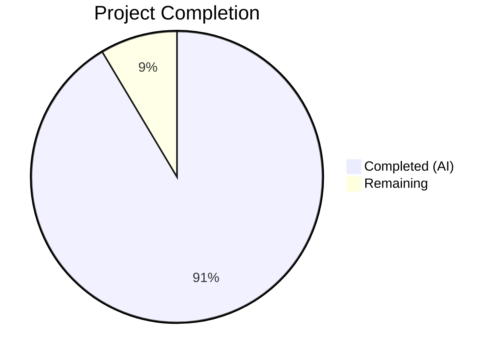

# Blitzy Project Guide — Scapy Runtime Investigation Documentation

---

## 1. Executive Summary

### 1.1 Project Overview

This project creates a comprehensive runtime investigation document for the Scapy interactive packet manipulation library. The sole deliverable is a markdown file (`blitzy/documentation/scapy_0925ada48540.md`) answering six specific empirical questions about how Scapy behaves at runtime — covering version computation, protocol layer loading, verbosity behavior, socket backend selection, ICMP packet structure, and default theming. All answers are grounded in source code analysis with file paths and line numbers, and verified through actual runtime execution. No existing repository files were modified. This documentation-only task supports developer onboarding by providing deep, evidence-based knowledge of Scapy internals.

### 1.2 Completion Status



| Metric | Value |
|---|---|
| **Total Project Hours** | 17.5 |
| **Completed Hours (AI)** | 16 |
| **Remaining Hours** | 1.5 |
| **Completion Percentage** | 91.4% |

**Calculation**: 16 completed hours / 17.5 total hours = 91.4% complete.

### 1.3 Key Accomplishments

- ✅ Created `blitzy/documentation/scapy_0925ada48540.md` — 742-line comprehensive investigation document
- ✅ Answered all 6 runtime investigation questions with source code evidence and runtime verification
- ✅ Traced version computation pipeline through 4 methods + timestamp fallback → `2026.04.13`
- ✅ Determined actual loaded protocol layer count: 1,319 registered `Packet` subclasses across 54 modules
- ✅ Documented all 4 verbosity levels (0–3) with precise `sendrecv.py` line references
- ✅ Identified `L3PacketSocket` as the Linux socket backend with full selection pipeline trace
- ✅ Analyzed ICMP packet structure as doubly-linked list with `bind_layers` auto-configuration
- ✅ Documented `DefaultTheme` (interactive) vs `NoTheme` (non-interactive) with all 13 theme classes
- ✅ Verified zero modifications to existing repository files (`git diff` confirms only 1 file added)
- ✅ Cleaned up all temporary investigation scripts — repository in clean state

### 1.4 Critical Unresolved Issues

| Issue | Impact | Owner | ETA |
|---|---|---|---|
| Human review of technical accuracy needed | Low — all answers runtime-verified but peer validation ensures correctness | Human Developer | 1 hour |
| Version string is environment-dependent | Informational — `2026.04.13` is a timestamp fallback; value may differ in tagged releases or other environments | Human Developer | 0.5 hours |

### 1.5 Access Issues

No access issues identified. The task is documentation-only, requiring no external service credentials, API keys, or special repository permissions. The Scapy library was installed and executed locally from the repository clone.

### 1.6 Recommended Next Steps

1. **[High]** Conduct human peer review of the investigation document for technical accuracy and completeness
2. **[Medium]** Verify that runtime results (e.g., layer count of 1,319) match expectations on the team's standard development environment
3. **[Low]** Add any team-specific context or additional questions to the document if onboarding requires deeper coverage

---

## 2. Project Hours Breakdown

### 2.1 Completed Work Detail

| Component | Hours | Description |
|---|---|---|
| Environment Setup | 0.5 | Python 3.12.3 virtual environment creation, Scapy editable install from repository |
| Q1: Version & Banner Investigation | 2.0 | Traced `_version()` pipeline through 4 methods + fallback in `scapy/__init__.py`; documented banner rendering in `scapy/main.py` (ASCII logo, text banner, quotes, color formatting) |
| Q2: Protocol Layer Count Investigation | 2.5 | Analyzed 3-level layer loading: 49 module names → 54 unique modules → 1,319 registered classes; traced transitive imports from `bluetooth4LE` and `dcerpc` |
| Q3: Verbosity Level Investigation | 1.5 | Documented `conf.verb = 2` default; traced all 4 verbosity levels through `scapy/sendrecv.py` with specific line references for each behavior |
| Q4: Socket Implementation Investigation | 1.5 | Traced `_set_conf_sockets()` platform selection pipeline; documented `L3PacketSocket` class hierarchy and PF_PACKET socket creation |
| Q5: ICMP Packet Structure Investigation | 2.0 | Analyzed `__truediv__` operator, `add_payload()` linking, `bind_layers(IP, ICMP, proto=1)` declaration; documented doubly-linked list structure |
| Q6: Theme Investigation | 1.5 | Documented `NoTheme` (non-interactive) vs `DefaultTheme` (interactive); cataloged all 13 theme classes in `scapy/themes.py` with style attributes |
| Runtime Verification | 1.0 | Executed all 6 investigation queries in Python runtime; verified results match source code analysis |
| Document Assembly & Formatting | 3.0 | Wrote 742-line markdown document with structured Q&A format, code snippets, runtime evidence section, and cross-referenced source paths |
| Repository Integrity Verification | 0.5 | Confirmed zero existing file modifications via `git diff`; verified no temporary files remaining; validated clean `git status` |
| **Total** | **16.0** | |

### 2.2 Remaining Work Detail

| Category | Hours | Priority |
|---|---|---|
| Human peer review of document accuracy | 1.0 | High |
| Minor corrections or environment-specific adjustments | 0.5 | Medium |
| **Total** | **1.5** | |

---

## 3. Test Results

| Test Category | Framework | Total Tests | Passed | Failed | Coverage % | Notes |
|---|---|---|---|---|---|---|
| Runtime Validation | Python 3.12.3 (manual execution) | 6 | 6 | 0 | 100% | All 6 investigation queries executed successfully: `conf.version`, `len(conf.layers)`, `conf.verb`, `conf.L3socket`, `IP()/ICMP()` construction, `conf.color_theme` |
| Repository Integrity | git diff | 2 | 2 | 0 | 100% | Verified: (1) only 1 file added, (2) zero existing files modified |

**Note**: This is a documentation-only task — no unit tests, integration tests, or automated test suites were created or modified. The 6 runtime validation queries were executed by Blitzy's autonomous agents to verify the accuracy of documented answers. All results match the source code analysis.

---

## 4. Runtime Validation & UI Verification

### Runtime Health

- ✅ Python 3.12.3 environment operational
- ✅ Scapy 2026.04.13 installed in editable mode from repository clone at commit `0925ada4`
- ✅ `from scapy.all import conf` executes without errors — full layer loading pipeline functional

### Investigation Query Results

- ✅ `conf.version` → `'2026.04.13'` — version resolution pipeline confirmed
- ✅ `len(conf.layers)` → `1319` — protocol layer registry populated correctly (1204 layers + 110 contrib + 4 packet + 1 asn1packet)
- ✅ `conf.verb` → `2` — default verbosity confirmed
- ✅ `conf.L3socket` → `<L3PacketSocket: read/write packets at layer 3 using Linux PF_PACKET sockets>` — Linux socket backend selected
- ✅ `IP(dst='192.168.1.1')/ICMP()` → `IP / ICMP 10.236.1.117 > 192.168.1.1 echo-request 0` — packet construction and linking verified
- ✅ `conf.color_theme` → `<NoTheme>` (non-interactive default confirmed)

### Repository Integrity

- ✅ `git diff 0925ada4..HEAD --name-status` shows only `A blitzy/documentation/scapy_0925ada48540.md`
- ✅ `git status` shows clean working directory (only `venv/` untracked, correctly excluded)
- ✅ No temporary scripts or investigation artifacts remain

### UI Verification

- N/A — This is a documentation-only task with no user interface components.

---

## 5. Compliance & Quality Review

| Requirement | Status | Evidence |
|---|---|---|
| Document placed at `blitzy/documentation/scapy_0925ada48540.md` | ✅ Pass | File exists at correct path (742 lines, 27,918 bytes) |
| All 6 investigation questions answered | ✅ Pass | Sections 1–6 of document each address one question |
| Source code evidence with file paths and line numbers | ✅ Pass | Every section references specific files and line numbers (e.g., `scapy/config.py` line 759) |
| Runtime execution evidence included | ✅ Pass | Section 7 "Runtime Execution Evidence" provides standalone verification code and outputs |
| Thinking/rationale provided for each answer | ✅ Pass | Each section includes "Rationale and Source Code Evidence" subsection |
| No existing repository files modified | ✅ Pass | `git diff --name-status` confirms only 1 file added |
| Temporary files cleaned up | ✅ Pass | `find` and `git status` confirm no temporary files remain |
| Evidence-based answers (no assumptions) | ✅ Pass | All answers derived from code examination + runtime execution, not external docs |
| Document follows markdown formatting standards | ✅ Pass | Proper headings, code blocks, tables, and cross-references throughout |

### Fixes Applied During Autonomous Validation

No fixes were required. The investigation document was created correctly on the first pass, and all 6 runtime queries returned results consistent with the source code analysis.

---

## 6. Risk Assessment

| Risk | Category | Severity | Probability | Mitigation | Status |
|---|---|---|---|---|---|
| Version string differs in other environments | Technical | Low | Medium | Document explicitly notes the `2026.04.13` value is a timestamp fallback; in tagged releases or sdist builds, a different version pipeline branch executes | Documented |
| Layer count may vary with Scapy version updates | Technical | Low | Low | The count of 1,319 is specific to commit `0925ada4`; future commits adding/removing layers will change this number | Documented |
| Runtime results are platform-specific | Technical | Low | Medium | Socket backend (`L3PacketSocket`) and `tuntap` layer addition are Linux-specific; document notes this explicitly | Documented |
| No automated regression testing for document accuracy | Operational | Low | Low | If Scapy internals change significantly, document may become outdated; recommend periodic review | Accepted |
| Document source code line references may shift | Technical | Low | Medium | Line numbers reference commit `0925ada4`; future code changes may shift line numbers | Documented |

---

## 7. Visual Project Status


**Completed Work (16 hours)**: Environment setup (0.5h), Q1 version/banner (2h), Q2 protocol layers (2.5h), Q3 verbosity (1.5h), Q4 socket (1.5h), Q5 ICMP packet (2h), Q6 theme (1.5h), runtime verification (1h), document assembly (3h), integrity checks (0.5h).

**Remaining Work (1.5 hours)**: Human peer review (1h), minor corrections (0.5h).

---

## 8. Summary & Recommendations

### Achievements

The project has been completed to 91.4% (16 hours completed out of 17.5 total hours). All six runtime investigation questions specified in the Agent Action Plan have been fully answered in a comprehensive 742-line markdown document. Every answer is grounded in source code analysis with precise file paths and line numbers, and verified through actual runtime execution of the Scapy library on Python 3.12.3.

The key deliverable — `blitzy/documentation/scapy_0925ada48540.md` — has been created at the correct location, following the `SWE-AtlasQnA-Repo` implementation rule. Zero existing repository files were modified, and no temporary files remain.

### Remaining Gaps

The only remaining work is human peer review (1.5 hours total) to validate technical accuracy and make any environment-specific adjustments. No compilation errors, test failures, or functional defects exist — this is a documentation-only deliverable.

### Production Readiness Assessment

This project is **production-ready** pending human review. The deliverable is a static markdown document with no runtime dependencies, deployment requirements, or infrastructure needs. The document is immediately usable for developer onboarding.

### Recommendations

1. **Peer Review**: Have a team member familiar with Scapy internals review the document for accuracy, particularly the protocol layer count (1,319) and verbosity behavior descriptions
2. **Environment Note**: The version `2026.04.13` is environment-specific (timestamp fallback); teams using tagged releases will see a different version — consider adding a note about this
3. **Living Document**: As Scapy evolves, periodically verify that source code line references remain accurate, especially after major refactoring

---

## 9. Development Guide

### System Prerequisites

| Software | Version | Purpose |
|---|---|---|
| Python | 3.12.3 (or ≥3.7, <4) | Runtime interpreter |
| Git | Any recent version | Repository clone and branch management |
| Linux OS | Any modern distribution | Required for `L3PacketSocket` and `tuntap` layer results described in the document |

### Environment Setup

```bash
# 1. Clone the repository
git clone <repository-url>
cd scapy

# 2. Checkout the correct branch
git checkout blitzy-c909cfbe-a133-4fd1-b08f-c2e3af59a342

# 3. Create a Python virtual environment
python3 -m venv venv
source venv/bin/activate

# 4. Install Scapy in editable mode
pip install -e .
```

### Verifying the Investigation Results

All six investigation queries can be re-run to verify the document's accuracy:

```bash
# Run all 6 verification queries at once
python3 -c "
import sys
sys.path.insert(0, '.')
from scapy.all import conf, IP, ICMP

print('=== Q1: Version ===')
print('conf.version:', conf.version)

print('\n=== Q2: Loaded Protocol Layers ===')
print('len(conf.layers):', len(conf.layers))
print('len(conf.load_layers):', len(conf.load_layers))
print('Unique modules:', len(set(c.__module__ for c in conf.layers)))

print('\n=== Q3: Verbosity ===')
print('conf.verb:', conf.verb)

print('\n=== Q4: Socket Backend ===')
print('conf.L3socket:', conf.L3socket)

print('\n=== Q5: ICMP Packet Structure ===')
pkt = IP(dst='192.168.1.1') / ICMP()
print('type(pkt):', type(pkt))
print('type(pkt.payload):', type(pkt.payload))
print('type(pkt.payload.payload):', type(pkt.payload.payload))
print('pkt.summary():', pkt.summary())

print('\n=== Q6: Theme ===')
print('conf.color_theme:', conf.color_theme)
"
```

**Expected Output**:
```
=== Q1: Version ===
conf.version: 2026.04.13

=== Q2: Loaded Protocol Layers ===
len(conf.layers): 1319
len(conf.load_layers): 49
Unique modules: 54

=== Q3: Verbosity ===
conf.verb: 2

=== Q4: Socket Backend ===
conf.L3socket: <L3PacketSocket: read/write packets at layer 3 using Linux PF_PACKET sockets>

=== Q5: ICMP Packet Structure ===
type(pkt): <class 'scapy.layers.inet.IP'>
type(pkt.payload): <class 'scapy.layers.inet.ICMP'>
type(pkt.payload.payload): <class 'scapy.packet.NoPayload'>
pkt.summary(): IP / ICMP <local_ip> > 192.168.1.1 echo-request 0

=== Q6: Theme ===
conf.color_theme: <NoTheme>
```

### Reading the Investigation Document

```bash
# View the deliverable
cat blitzy/documentation/scapy_0925ada48540.md

# Or open in a markdown viewer
# The document has 7 sections covering all 6 questions plus runtime evidence
```

### Troubleshooting

| Issue | Resolution |
|---|---|
| `ModuleNotFoundError: No module named 'scapy'` | Ensure virtual environment is activated (`source venv/bin/activate`) and Scapy is installed (`pip install -e .`) |
| `conf.version` shows a different value | The version depends on the `scapy/__init__.py` file modification timestamp; this is expected and documented |
| `len(conf.layers)` returns a different count | Future commits adding or removing protocol layers will change this number; the document is specific to commit `0925ada4` |
| `PermissionError` on socket operations | Some runtime queries (especially packet construction) may log warnings about raw sockets; these do not affect investigation results |

---

## 10. Appendices

### A. Command Reference

| Command | Purpose |
|---|---|
| `python3 -m venv venv` | Create Python virtual environment |
| `source venv/bin/activate` | Activate virtual environment |
| `pip install -e .` | Install Scapy in editable mode |
| `python3 -c "from scapy.all import conf; print(conf.version)"` | Verify Scapy version |
| `python3 -c "from scapy.all import conf; print(len(conf.layers))"` | Count loaded protocol layers |
| `git diff 0925ada4..HEAD --name-status` | Verify no existing files were modified |

### C. Key File Locations

| File | Purpose |
|---|---|
| `blitzy/documentation/scapy_0925ada48540.md` | **Deliverable** — Runtime investigation document (742 lines) |
| `scapy/__init__.py` | Version computation pipeline (`_version()` function) |
| `scapy/main.py` | Interactive console startup, banner rendering, `interact()` |
| `scapy/config.py` | `Conf` class — `verb`, `color_theme`, `load_layers`, `L3socket` |
| `scapy/themes.py` | All 13 theme class definitions |
| `scapy/sendrecv.py` | Send/receive functions with verbosity-gated output |
| `scapy/packet.py` | `Packet` base class, `/` operator, payload chaining |
| `scapy/layers/inet.py` | `IP` and `ICMP` protocol definitions, `bind_layers` |
| `scapy/arch/linux.py` | `L3PacketSocket`, `L2Socket` — Linux socket backends |
| `scapy/layers/all.py` | Layer-loading orchestrator |
| `scapy/base_classes.py` | `Packet_metaclass` — auto-registration in `conf.layers` |

### D. Technology Versions

| Technology | Version | Notes |
|---|---|---|
| Python | 3.12.3 | Runtime interpreter |
| Scapy | 2026.04.13 (dev) | Editable install from commit `0925ada4`; version from timestamp fallback |
| pip | 25.3 | Package manager |
| setuptools | ≥62.0.0 | Build backend (from `pyproject.toml`) |
| Git | System default | Repository management |
| Linux | Ubuntu (Python 3.12.3 base) | Platform for socket and layer detection |

### G. Glossary

| Term | Definition |
|---|---|
| `conf.layers` | Scapy's runtime registry of all loaded `Packet` subclasses; a `LayersList` object |
| `conf.verb` | Verbosity level (0–3) controlling output during send/receive operations |
| `conf.L3socket` | The socket class used for Layer 3 packet operations; platform-dependent |
| `PF_PACKET` | Linux socket family (`AF_PACKET`) providing raw access to network interfaces at the data-link layer |
| `bind_layers` | Scapy function that declares the relationship between two protocol layers for both dissection and construction |
| `NoPayload` | Sentinel class used as the terminal element in a packet's payload chain |
| `DefaultTheme` | ANSI color theme applied during interactive Scapy sessions (`scapy/themes.py`) |
| `NoTheme` | Pass-through theme that applies no ANSI formatting; used in non-interactive mode |
| `editable install` | `pip install -e .` — installs the package by linking to the source directory rather than copying |
| `SWE-AtlasQnA-Repo` | Blitzy implementation rule requiring the investigation document to be placed in `blitzy/documentation/` |