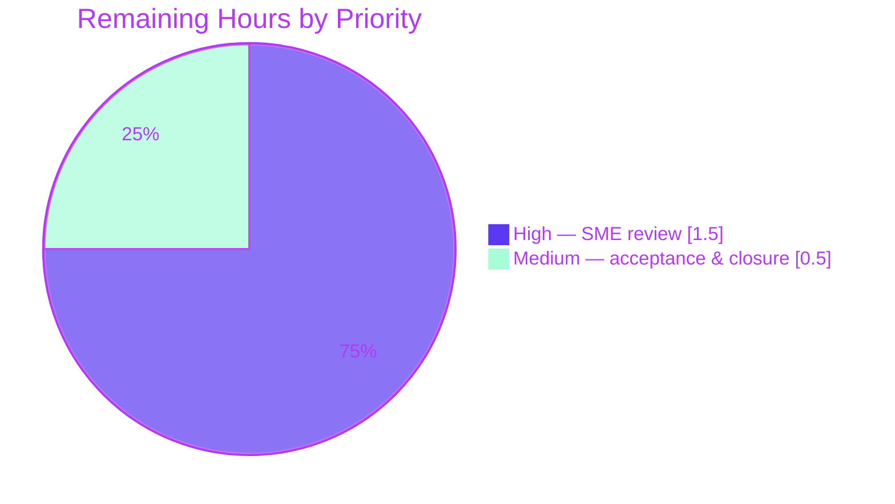

# Blitzy Project Guide

**Project:** Scapy Checksum / Cache / IP-Length Internals — Technical Q&A Documentation
**Deliverable:** `blitzy/documentation/scapy_0925ada48540.md`
**Branch:** `blitzy-aa573021-ed86-4539-991e-15a1daacf1c1` (base `0925ada4`, HEAD `fad9ff7b`)
**Rule set:** SWE-AtlasQnA-Repo (documentation-only, read-only source mandate)

> **Blitzy brand colors used throughout:** Completed / AI Work = Dark Blue `#5B39F3`; Remaining / Not Completed = White `#FFFFFF`; Headings / Accents = Violet‑Black `#B23AF2`; Highlight = Mint `#A8FDD9`.

---

## 1. Executive Summary

### 1.1 Project Overview

This project delivers a single, evidence-backed technical answer document explaining **how the Scapy packet-manipulation library computes and caches protocol checksums (IP header + TCP) and auto-fills the IP total-length field during packet building**. The audience is engineers who need an under-the-hood, reproducible account rather than prose from code reading. The document answers six concrete investigative requirements plus a cache-scope edge case, each grounded in real runtime output (hex dumps and decimal values) and `file:line` citations. Scope is strictly isolated: exactly one new Markdown file is authored under `blitzy/documentation/`, with a read-only posture toward every existing repository file and full cleanup of temporary observation scripts.

### 1.2 Completion Status


| Metric | Value |
|--------|-------|
| **Total Hours** | **22** |
| **Completed Hours (AI + Manual)** | **20** (AI 20 + Manual 0) |
| **Remaining Hours** | **2** |
| **Percent Complete** | **90.9%** |

Completion is computed with the AAP-scoped hours methodology: `20 / (20 + 2) = 90.9%`. All completed hours were delivered autonomously by Blitzy agents; the 2 remaining hours are the reserved human path-to-production (review + acceptance).

### 1.3 Key Accomplishments

- ✅ Authored `blitzy/documentation/scapy_0925ada48540.md` (855 lines) answering all six requirements (R1–R6) plus the cache-scope edge case, by name, with reasoning.
- ✅ Every byte-sensitive value produced through Scapy's **real** entry points (`bytes(pkt)`, `copy.deepcopy(pkt)`) and captured as unedited output.
- ✅ Embedded a self-contained, assertion-bearing observation probe (30 `eq()` checks) that regenerates all evidence and exits non-zero on any mismatch.
- ✅ Two-run byte-stability proven (identical SHA256 `6c2b053b…`); byte-sensitive checksums verified two independent ways (Scapy helpers + pure-Python one's-complement).
- ✅ Every claim grounded in an accurate `file:line` citation across `scapy/packet.py`, `scapy/layers/inet.py`, `scapy/utils.py`; OBSERVED (17×) and INFERRED (6×) labels applied honestly.
- ✅ Read-only mandate honored — `git diff 0925ada4..HEAD` shows only the added document (855 insertions, 0 deletions); temporary scripts kept outside the checkout and removed; `git status` clean.
- ✅ Explicit OBSERVED correction of the canonical fixture size (45 bytes, resolving an internal inconsistency in the AAP prose) — the run-first methodology working as intended.

### 1.4 Critical Unresolved Issues

| Issue | Impact | Owner | ETA |
|-------|--------|-------|-----|
| _None_ | No blocking or unresolved issues. The deliverable is complete, validated across five production-readiness gates, and independently reproduced with zero corrections. | — | — |

### 1.5 Access Issues

| System/Resource | Type of Access | Issue Description | Resolution Status | Owner |
|-----------------|----------------|-------------------|-------------------|-------|
| — | — | No access issues identified. The task required only the in-repository Scapy source and its local runtime; no repository permissions, service credentials, or third-party APIs are involved. | N/A | — |

**No access issues identified.**

### 1.6 Recommended Next Steps

1. **[High]** Have a reviewer familiar with Scapy internals perform a technical-accuracy sign-off of the answer document (optionally re-running the embedded probe to confirm exit 0 + SHA256 `6c2b053b…`). (~1.5h)
2. **[Medium]** Obtain requester acceptance that the answer resolves the original six questions, then close the task. (~0.5h)
3. **[Low]** If the answer will be reused against a different Scapy/Python/`cryptography` version, note that exact byte values are environment-specific while the mechanism is version-independent; re-run the probe to regenerate values. (advisory, 0h)

---

## 2. Project Hours Breakdown

### 2.1 Completed Work Detail

All work below was completed autonomously by Blitzy agents and independently re-verified. Rows retain half-hour granularity and sum to exactly **20.0 hours**.

| Component | Hours | Description |
|-----------|-------|-------------|
| Read-only source investigation & citation mapping | 4.5 | Traced the build pipeline, cache mechanism, attribute assignment, and copy semantics across `scapy/packet.py`, `scapy/layers/inet.py`, `scapy/utils.py` (~20 `file:line` loci: `__bytes__`→`build`→`do_build`→`post_build`, `raw_packet_cache`, `setfieldval`/`__setattr__`, `copy`/`__deepcopy__`, `IP`/`TCP` `post_build`, `in4_chksum`, `checksum`). |
| Observation probe development | 3.5 | Authored the assertion-bearing probe (30 `eq()` checks) using real entry points `bytes()`/`deepcopy`, covering R1–R6 + edge + environment proof + independent checksum recompute. |
| Probe execution & stability proof | 1.5 | Ran the probe repeatedly to achieve two-run byte-stability, captured SHA256 `6c2b053b…`, and proved a clean repository (outputs written outside the checkout). |
| Document authoring — TL;DR + build-pipeline primer | 1.5 | Wrote §1 headline conclusions and §3 the shared build pipeline every scenario exercises. |
| Document authoring — six requirement sections (R1–R6) | 4.0 | Wrote the six answer sections with full before/after hex, decimal values, causal mechanism, and reasoning. |
| Document authoring — edge case + environment/methodology (§2.1–2.4) | 1.5 | Wrote the cache-scope edge section, the runtime/fixture/reproducibility subsections, and the explicit 45-byte fixture-size correction. |
| Coverage note + OBSERVED/INFERRED discipline + polish | 1.0 | Authored the closing coverage checklist (each named item ticked) and applied honest OBSERVED/INFERRED labeling throughout. |
| Code-review response + fix iterations | 2.0 | Three review/fix commits: address code-review findings (`facd560c`), fix temp-dir boundary in reproduction commands (`2b2c7d52`), correct the import-time `CryptographyDeprecationWarning` claim (`fad9ff7b`). |
| Cleanup + read-only verification | 0.5 | Removed all temporary observation scripts and verified a clean `git status` (only the document added). |
| **Total Completed** | **20.0** | |

### 2.2 Remaining Work Detail

All remaining work is the reserved human path-to-production. Rows sum to exactly **2.0 hours**.

| Category | Hours | Priority |
|----------|-------|----------|
| SME technical-accuracy review / sign-off of the answer document | 1.5 | High |
| Requester acceptance & task closure | 0.5 | Medium |
| **Total Remaining** | **2.0** | |

> **Cross-section check:** Section 2.1 (20.0) + Section 2.2 (2.0) = **22.0** Total Hours (matches §1.2). Section 2.2 total (2.0) = §1.2 Remaining (2.0) = §7 pie "Remaining Work" (2).

---

## 3. Test Results

The only test artifact for this documentation task is the **embedded, assertion-bearing observation probe** — executed by Blitzy's autonomous validation and independently reproduced during this assessment. No repository unit/integration/UI/E2E suite was added or run (explicitly out of scope per AAP §0.4.2).

| Test Category | Framework | Total Tests | Passed | Failed | Coverage % | Notes |
|---------------|-----------|-------------|--------|--------|-----------|-------|
| Runtime observation probe (assertions) | Custom Python `eq()` assertion harness (raises `AssertionError` → non-zero exit) | 30 | 30 | 0 | 100% requirement coverage (R1–R6 + edge) | Exit 0 on repeated runs; stderr 0 bytes; stdout byte-identical (SHA256 `6c2b053b6a5ed6eb18a9800abc20c8a210ee48f87e046a86f5aef3a8a6aee777`); terminal line "=== ALL ASSERTIONS PASSED ===". Byte-sensitive checksums cross-checked via a fully independent pure-Python one's-complement recompute. |

**Integrity note:** all tests reported here originate from Blitzy's autonomous validation logs for this project (Final Validator Gate 1) and were re-executed independently during this assessment with identical results.

---

## 4. Runtime Validation & UI Verification

**Runtime validation (library / CLI):**

- ✅ **Operational** — Probe executes cleanly via the canonical `.venv` interpreter (`Python 3.12.13`, in-repo Scapy `2026.07.13`): exit 0 on repeated runs, 0 bytes on stderr.
- ✅ **Operational** — Two-run byte-stability confirmed: identical SHA256 `6c2b053b…`; `diff` of the two captures is empty.
- ✅ **Operational** — Interactive build example (`bytes(IP()/TCP()/Raw(b"HELLO"))`) reproduces R1 exactly: total 45 bytes, IP length field `002d` (=45), IP header checksum `7cc8`, TCP checksum `ade5`, both `chksum` fields `None` after build.
- ✅ **Operational** — Read-only mandate: `git status --porcelain` empty; `git diff 0925ada4..HEAD` shows only the added document.

**UI verification:**

- **Not applicable** — this project produces a static Markdown document for a networking library; there is no user interface, web page, or rendered front-end to verify. The observation probe opens no sockets and starts no services.

---

## 5. Compliance & Quality Review

Cross-mapping AAP deliverables and the SWE-AtlasQnA-Repo rules to Blitzy's quality benchmarks. All items independently verified during this assessment.

| Benchmark / Rule | Requirement | Status | Progress |
|------------------|-------------|--------|----------|
| Deliverable naming & location | `blitzy/documentation/<source_branch>.md` = `scapy_0925ada48540.md` | ✅ Pass | 100% |
| Answer every named item | R1, R2, R3, R4, R5, R6 + edge all answered by name | ✅ Pass | 100% |
| Run-first methodology | Built/ran real code paths; captured real output first | ✅ Pass | 100% |
| Stability across ≥2 runs | Byte-identical output (SHA256 `6c2b053b…`) | ✅ Pass | 100% |
| Real/canonical entry point | `bytes(pkt)`, `copy.deepcopy(pkt)` used (no bypassing interface) | ✅ Pass | 100% |
| Complete, unedited output | Full before/after hex + decimals embedded, not paraphrased | ✅ Pass | 100% |
| Byte-sensitive verification | Checksums verified against emitted bytes + independent recompute | ✅ Pass | 100% |
| `file:line` grounding | Every claim cites specific source lines (verified accurate) | ✅ Pass | 100% |
| Observed vs inferred labeling | OBSERVED (17×) / INFERRED (6×) applied honestly | ✅ Pass | 100% |
| Coverage pass | Closing checklist re-reads the question and ticks each item | ✅ Pass | 100% |
| Read-only source mandate | No existing repo file modified (diff shows only added doc) | ✅ Pass | 100% |
| Cleanup of temporary scripts | Scripts kept in `/tmp`, removed; `git status` clean | ✅ Pass | 100% |
| Markdown quality | Well-formed; balanced code fences; 0 TODO/placeholder markers | ✅ Pass | 100% |

**Fixes applied during autonomous validation:** (1) addressed code-review findings (`facd560c`); (2) fixed the temporary-directory boundary in the reproduction commands so evidence is written outside the checkout (`2b2c7d52`); (3) corrected the import-time `CryptographyDeprecationWarning` claim to match the canonical runtime (`fad9ff7b`).

**Outstanding compliance items:** none.

---

## 6. Risk Assessment

| Risk | Category | Severity | Probability | Mitigation | Status |
|------|----------|----------|-------------|------------|--------|
| Exact byte values (`0x7cc8`/`0xade5`) and 45-byte fixture are specific to Scapy `2026.07.13` / Python `3.12.13`; other versions may emit different bytes | Technical | Low | Medium | Document pins the exact environment and base commit `0925ada4` and states values are environment-specific while the mechanism/reasoning is version-independent; the probe regenerates values on demand | Mitigated |
| Six statements are labeled INFERRED rather than OBSERVED (e.g., cache-init consequence, warning version-dependence) | Technical | Low | Low | Labeled honestly; all byte-sensitive claims are OBSERVED and dual-verified | Mitigated |
| Reproduction depends on the repo `.venv` (editable Scapy) and `PYTHONPATH`; a fresh clone must provision the venv first | Operational | Low | Low | Exact commands documented in the deliverable (§2.3) and in §9 below, including a fresh-clone fallback | Mitigated |
| AAP prose contained an internal 46-vs-45-byte fixture inconsistency | Process | Low | Low | Deliverable resolved it to 45 bytes via observation and flagged the correction explicitly (§2.4) | Resolved |
| Security exposure (credentials, network, data handling) | Security | None | — | Deliverable is a static document; no code changed, no secrets, no network, no data processed | N/A |
| External service / API / dependency integration | Integration | None | — | No external services, APIs, credentials, or new dependencies introduced | N/A |

**Overall risk posture: LOW.** The change is a single static document produced by a read-only investigation and validated across five gates.

---

## 7. Visual Project Status

**Project hours breakdown** (Completed = Dark Blue `#5B39F3`, Remaining = White `#FFFFFF`):


**Remaining work by priority** (High vs Medium):



**Remaining hours by category (Section 2.2):**

| Category | Hours |
|----------|-------|
| SME technical-accuracy review / sign-off | 1.5 |
| Requester acceptance & task closure | 0.5 |
| **Total** | **2.0** |

> **Integrity check:** the pie chart "Remaining Work" value (2) equals §1.2 Remaining Hours (2) and the Section 2.2 "Hours" column sum (2.0).

---

## 8. Summary & Recommendations

**Achievements.** The project is **90.9% complete** (`20 / 22` hours). A single, rigorous, reproducible answer document was authored and validated, explaining Scapy's checksum/cache/length behavior with real hex/decimal evidence and accurate `file:line` grounding. All six requirements (R1–R6) and the cache-scope edge case are answered by name; the embedded assertion probe (30 checks) reproduces byte-identically and exits 0.

**Critical path to production.** For a documentation deliverable, "production" means acceptance and publication of the answer. The critical path is short and human-only: (1) SME technical-accuracy sign-off; (2) requester acceptance and closure. No agent work remains.

**Remaining gaps.** None in the deliverable itself. The 2 remaining hours are the reserved human review/acceptance the AAP methodology holds back from autonomous completion (a documentation answer is never declared 100% complete before a human accepts it).

**Success metrics (all met):**

| Metric | Target | Result |
|--------|--------|--------|
| Requirements answered by name | 6/6 + edge | ✅ 6/6 + edge |
| Assertion probe pass rate | 100% | ✅ 30/30 |
| Two-run output stability | Byte-identical | ✅ SHA256 `6c2b053b…` |
| Read-only mandate | 0 source files changed | ✅ only doc added |
| `file:line` citation accuracy | 100% | ✅ verified |
| Working tree after cleanup | Clean | ✅ `git status` empty |

**Production readiness assessment: READY for human review.** The deliverable is complete, accurate, reproducible, and fully compliant with the read-only + cleanup mandate. Recommend proceeding directly to SME sign-off and requester acceptance.

---

## 9. Development Guide

This guide covers how to **view the deliverable** and **reproduce every value** it reports. All commands were tested during this assessment and are copy-pasteable from the repository root.

### 9.1 System Prerequisites

- **OS:** Linux (developed/validated in an Ubuntu container).
- **Git:** required (base commit `0925ada4` and HEAD `fad9ff7b` present).
- **Disk:** ~260 MB for the full checkout.
- **Python:** the canonical interpreter is **Python 3.12.x** — the repo `.venv` reports `3.12.13`.
  - ⚠️ The *system* `python3` is a **different** interpreter (`3.13.7`). Always use the `.venv` interpreter for canonical byte values.
- **Scapy:** `2026.07.13`, resolved from the in-repo checkout via an editable install.

### 9.2 Environment Setup

```bash
# From the repository root:
cd "$(git rev-parse --show-toplevel)"

# Confirm the canonical interpreter and Scapy resolution:
./.venv/bin/python --version
# -> Python 3.12.13
./.venv/bin/python -c "import scapy; print(scapy.VERSION, scapy.__file__)"
# -> 2026.07.13 /…/scapy/__init__.py   (in-repo checkout)
```

**Fresh-clone fallback** (only if `.venv` is absent):

```bash
python3.12 -m venv .venv
./.venv/bin/pip install -e .
```

### 9.3 Dependency Installation

No new dependencies are introduced by this task. Scapy requires no hard runtime dependency for these scenarios (`cryptography 41.0.7` is optionally present). Use the editable install above only when provisioning a fresh `.venv`.

### 9.4 View the Deliverable

```bash
less blitzy/documentation/scapy_0925ada48540.md   # 855 lines, 46,477 bytes
```

### 9.5 Reproduce the Evidence (Verification)

This regenerates every value in the document and proves the repository stays clean. Tested end-to-end during this assessment.

```bash
# 1) Work outside the checkout so the repo stays clean:
mkdir -p /tmp/scapy_investigation

# 2) Extract the embedded probe (verbatim from the document):
sed -n '140,360p' blitzy/documentation/scapy_0925ada48540.md > /tmp/scapy_investigation/probe.py

# 3) Run the SAME input twice with the canonical interpreter:
PYTHONPATH="$(git rev-parse --show-toplevel)" ./.venv/bin/python /tmp/scapy_investigation/probe.py > /tmp/scapy_investigation/run1.txt
PYTHONPATH="$(git rev-parse --show-toplevel)" ./.venv/bin/python /tmp/scapy_investigation/probe.py > /tmp/scapy_investigation/run2.txt

# 4) Prove stability and a clean repo:
sha256sum /tmp/scapy_investigation/run1.txt /tmp/scapy_investigation/run2.txt   # both = 6c2b053b…
diff /tmp/scapy_investigation/run1.txt /tmp/scapy_investigation/run2.txt        # empty => identical
tail -1 /tmp/scapy_investigation/run1.txt                                       # === ALL ASSERTIONS PASSED ===

# 5) Cleanup (leave the repository unchanged):
rm -rf /tmp/scapy_investigation
git status --porcelain                                                          # empty => clean
```

**Expected:** both runs exit 0, print an identical SHA256 (`6c2b053b6a5ed6eb18a9800abc20c8a210ee48f87e046a86f5aef3a8a6aee777`), an empty `diff`, the final line `=== ALL ASSERTIONS PASSED ===`, and an empty `git status`.

### 9.6 Example Usage (quick, interactive)

```bash
PYTHONPATH="$(git rev-parse --show-toplevel)" ./.venv/bin/python -W ignore -c "
from scapy.layers.inet import IP, TCP
from scapy.packet import Raw
pkt = IP()/TCP()/Raw(b'HELLO')
raw = bytes(pkt)
print('total bytes      :', len(raw))
print('IP  len   [2:4]  :', raw[2:4].hex(), '= dec', int.from_bytes(raw[2:4],'big'))
print('IP  chksum[10:12]:', raw[10:12].hex())
print('TCP chksum[36:38]:', raw[36:38].hex())
print('IP.chksum field  :', pkt.chksum)
print('TCP.chksum field :', pkt[TCP].chksum)
"
```

**Expected output:**

```
total bytes      : 45
IP  len   [2:4]  : 002d = dec 45
IP  chksum[10:12]: 7cc8
TCP chksum[36:38]: ade5
IP.chksum field  : None
TCP.chksum field : None
```

### 9.7 Troubleshooting

- **Bytes differ from the document / wrong values:** you are likely using the *system* `python3` (`3.13.7`). Use `./.venv/bin/python` (`3.12.13`) and set `PYTHONPATH` to the repo root.
- **`ModuleNotFoundError: scapy`:** run `export PYTHONPATH="$(git rev-parse --show-toplevel)"`, or provision the editable `.venv` (§9.2 fallback).
- **`CryptographyDeprecationWarning` on import:** cosmetic and version-dependent; the probe silences warnings and it does not affect the packet-build bytes (canonical runtime emits 0 stderr bytes).
- **`git status` shows changes after running:** ensure the probe **and** its captured output live under `/tmp` (outside the checkout) — never write inside the repository.

---

## 10. Appendices

### A. Command Reference

| Command | Purpose |
|---------|---------|
| `git rev-parse --show-toplevel` | Resolve the repository root |
| `git diff --stat 0925ada4..HEAD` | Confirm only the document changed (855 insertions) |
| `git status --porcelain` | Verify a clean working tree |
| `./.venv/bin/python --version` | Confirm the canonical interpreter (3.12.13) |
| `./.venv/bin/python -c "import scapy; print(scapy.VERSION, scapy.__file__)"` | Confirm Scapy version + in-repo resolution |
| `sed -n '140,360p' blitzy/documentation/scapy_0925ada48540.md > /tmp/scapy_investigation/probe.py` | Extract the embedded probe |
| `PYTHONPATH="$(git rev-parse --show-toplevel)" ./.venv/bin/python /tmp/scapy_investigation/probe.py` | Run the observation probe |
| `sha256sum … && diff …` | Prove two-run byte-stability |

### B. Port Reference

**Not applicable.** The deliverable is a static document; the observation probe opens no sockets and starts no services, so no ports are used.

### C. Key File Locations

| Path | Role |
|------|------|
| `blitzy/documentation/scapy_0925ada48540.md` | **The deliverable** (855 lines) — the sole authored artifact |
| `scapy/packet.py` | REFERENCE — build pipeline, `raw_packet_cache`, `setfieldval`/`__setattr__`, `copy`/`__deepcopy__`, `do_dissect` |
| `scapy/layers/inet.py` | REFERENCE — `IP.post_build` (len + checksum), `TCP.post_build`, `in4_chksum`, field defaults |
| `scapy/utils.py` | REFERENCE — `checksum()` one's-complement helper |
| `.venv/bin/python` | Canonical interpreter (Python 3.12.13, editable Scapy) |
| `run_scapy` | Repo launcher (adds repo root to `PYTHONPATH`) |

### D. Technology Versions

| Component | Version |
|-----------|---------|
| Scapy (under investigation) | `2026.07.13` |
| Python (canonical, `.venv`) | `3.12.13` |
| Python (system, non-canonical) | `3.13.7` |
| cryptography (optional, present) | `41.0.7` |
| Base commit | `0925ada485406684174d6f068dbd85c4154657b3` |
| Branch HEAD | `fad9ff7bc814185f8b6c03b2f6e1ac10647d5a5f` |

### E. Environment Variable Reference

| Variable | Value / Example | Purpose |
|----------|-----------------|---------|
| `PYTHONPATH` | `$(git rev-parse --show-toplevel)` | Ensures the in-repo Scapy checkout is imported (mirrors the `run_scapy` launcher) |

No secrets, tokens, or service credentials are required for this project.

### F. Developer Tools Guide

| Tool | Use in this project |
|------|---------------------|
| `git` | Confirm scope (`diff`/`status`), authorship, and a clean tree |
| `./.venv/bin/python` | Run the observation probe and interactive examples with the canonical interpreter |
| `sed` | Extract the embedded probe verbatim from the document (lines 140–360) |
| `sha256sum` / `diff` | Prove two-run byte-stability of the reproduced evidence |
| `py_compile` | Confirm the extracted probe compiles cleanly |

### G. Glossary

| Term | Meaning |
|------|---------|
| `post_build()` | Per-layer hook that fills auto-computed fields (checksums, lengths) into the output bytes at build time when the field is `None`. |
| `raw_packet_cache` | Optional cached byte string populated only during **dissection** of existing bytes; `None` for from-scratch packets, so they always recompute on `bytes()`. |
| One's-complement checksum | The Internet checksum algorithm implemented by `checksum()` in `scapy/utils.py`. |
| `in4_chksum` | Helper that builds the IPv4 pseudo-header and calls `checksum()` for the TCP checksum. |
| `None` sentinel | A field value of `None` means "auto-compute me"; a non-`None` value is treated as an explicit override and preserved. |
| From-scratch packet | A packet built in memory (e.g., `IP()/TCP()/Raw(...)`), as opposed to one dissected from raw bytes. |
| Fixture | The canonical test packet `IP()/TCP()/Raw(b"HELLO")` (45 bytes). |
