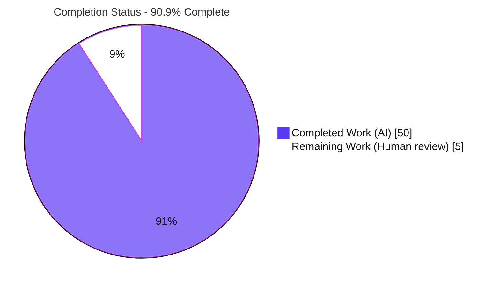
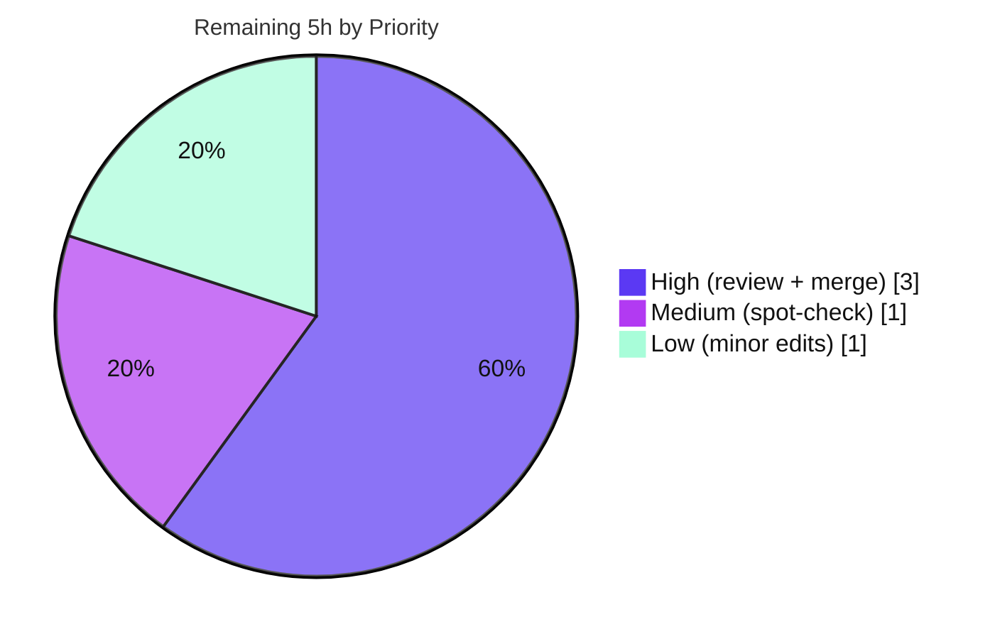

# Blitzy Project Guide — DNS Name Compression Onboarding Q&A (Scapy)

## 1. Executive Summary

### 1.1 Project Overview

This project delivers a comprehensive, run-first technical investigation answering how DNS name compression works in the Scapy packet-manipulation library, in both directions: decompression when packets are parsed and compression when packets are rebuilt. The deliverable is a single 1,978-line Markdown document (`blitzy/documentation/scapy_0925ada48540.md`) that answers eight decomposed sub-questions — pointer-chain unwinding, the `0xc0` marker, loop protection, error paths, cross-boundary references, the compression build walk, determinism, and end-to-end lifecycle. Every claim is grounded in captured runtime output from executed observation scripts and precise `file:line` citations into `scapy/layers/dns.py`. The source tree is strictly read-only; no production code changed. Target audience: engineers onboarding to Scapy's DNS layer.

### 1.2 Completion Status



| Metric | Value |
|--------|-------|
| **Total Hours** | **55** |
| **Completed Hours (AI + Manual)** | **50** |
| &nbsp;&nbsp;— AI / autonomous | 50 |
| &nbsp;&nbsp;— Manual (human) | 0.0 |
| **Remaining Hours** | **5** |
| **Percent Complete** | **90.9%** |

> Completion is computed on AAP-scoped work only (PA1): `50 / (50 + 5) = 50 / 55 = 90.9%`. The remaining ~9% is exclusively human-only path-to-production work (technical/editorial review and PR merge) that cannot be performed autonomously. Legend: <span title="#5B39F3">Completed = Dark Blue `#5B39F3`</span>, Remaining = White `#FFFFFF`.

### 1.3 Key Accomplishments

- ✅ **Single in-scope deliverable created and committed** — `blitzy/documentation/scapy_0925ada48540.md` (1,978 lines / 106,563 bytes); `git diff --name-status` against baseline is exactly one line: `A blitzy/documentation/scapy_0925ada48540.md`.
- ✅ **All eight sub-questions (Q1–Q8) answered** with a bold *Direct answer* each, grounded in captured runtime output.
- ✅ **Run-first methodology honored** — 12 executable observation scripts (A.1–A.12), 15 exact reproduction command lines, verbatim output blocks.
- ✅ **Read-only guarantee intact** — `scapy/layers/dns.py` and all other source files are byte-identical to baseline; working tree clean.
- ✅ **~44 `file:line` citations verified** against the live HEAD source (`dns_get_str` L69, `dns_encode` L154, `dns_compress` L184, `pre_dissect` L518, etc.).
- ✅ **Determinism confirmed** across two independent processes (`repeat_harness.py`).
- ✅ **12/12 appendix scripts `py_compile` OK** — independently reproduced during this assessment.
- ✅ **Evidence discipline applied** — 25 runtime-observed, 11 source-traced, 3 inferred labels; coverage-pass table enumerates every named item with grounding.

### 1.4 Critical Unresolved Issues

**No critical unresolved issues block release or validation.** The single in-scope deliverable is complete, accurate, committed, and independently corroborated. The items below are non-blocking and tracked for transparency.

| Issue | Impact | Owner | ETA |
|-------|--------|-------|-----|
| *(None blocking)* | No blocking issues — deliverable is complete and accurate | — | — |
| Malformed-over-TCP raise needs exact construction (non-blocking) | Reviewers must use a TCP-framed packet + `conf.debug_dissector=True` to observe the raise; documented correctly | Human reviewer | Within review (HT-3) |
| Observation scripts not wired into CI (non-blocking) | Future `dns.py` refactors won't auto-flag doc drift; porting to `dns.uts` is out of read-only scope | Scapy maintainers | Backlog (optional) |

### 1.5 Access Issues

**No access issues identified.**

| System/Resource | Type of Access | Issue Description | Resolution Status | Owner |
|-----------------|----------------|-------------------|-------------------|-------|
| Repository checkout | Filesystem (read/write) | None — repo present at HEAD `89420afb`; deliverable committed | ✅ Resolved | — |
| Python venv / runtime | Local execution | None — `.venv` (Python 3.13.7) functional; canonical invocation works | ✅ Resolved | — |
| Runtime dependencies | Package install | None — zero mandatory runtime deps (stdlib `struct` + scapy internals only) | ✅ Resolved | — |
| External services / credentials | N/A | None required — investigation uses synthetic/canonical in-repo vectors | ✅ Not applicable | — |

### 1.6 Recommended Next Steps

1. **[High]** Perform a human technical & editorial review of `scapy_0925ada48540.md` — verify the eight Q-answers for correctness and clarity, and confirm evidence labels and `file:line` citations (HT-1, 2h).
2. **[High]** Review the single-file PR and merge to mainline after confirming the read-only guarantee holds (HT-2, 1h).
3. **[Medium]** Spot-check reproduction: run 3–4 appendix scripts via the canonical invocation and confirm outputs match the documented verbatim blocks, including the malformed-over-TCP raise path (HT-3, 1h).
4. **[Low]** Apply any minor reviewer-requested wording/link edits and re-verify relative links resolve (HT-4, 1h).
5. **[Low]** *(Optional / backlog)* Consider porting key observation assertions into `test/scapy/layers/dns.uts` so CI guards against future documentation drift — explicitly outside this read-only task's scope.

---

## 2. Project Hours Breakdown

### 2.1 Completed Work Detail

All completed hours are autonomous (AI) work. Each component traces to a specific AAP requirement.

| Component | Hours | Description |
|-----------|------:|-------------|
| Deliverable scaffolding & document structure (AAP D1) | 2 | Create `blitzy/`, `blitzy/documentation/`, the answer file, TL;DR, and section skeleton |
| Q1 — Pointer-chain unwinding & where it begins | 4 | Trace `dns_get_str` [L69–L144]; `q1_unwinding.py`; labels-before-jump ordering; `hamand.cheese.` vector |
| Q2 — Wire format & the `0xc0` marker (foundation) | 6 | `dns_encode` [L154–L172]; `if cur & 0xc0` classifier; `-12` header arithmetic; reserved 0x40/0x80; `_is_ptr` heuristic; `q2_wireformat.py` |
| Q3 — Loop protection | 3 | `processed_pointers` [L88, L115–L117]; two-expansion window; `warning("DNS decompression loop detected")`; `q3q4_defenses.py` |
| Q4 — Error paths (OOB / nonexistent / truncation / TCP) | 7 | Premature-end [L96–L100], incomplete-jump [L108–L112], no-context `Scapy_Exception` [L128], TCP length guards [L518–L538]; `q3q4_defenses.py` + `q4_tcp.py`; `debug_dissector` gating |
| Q5 — Cross-boundary references | 4 | `InheritOriginDNSStrPacket._orig_s/_orig_p` [L270–L276, L360, L403]; swap-in [L90–L91]; `q5_crossboundary.py` |
| Q6 — Compression build walk | 6 | `dns_compress` [L184–L267]; `field_gen` walk; `possible_shortens`; pointer packing [L227–L229]; `rdlen` 16→None; `q6_compress.py` + `q6_packing.py` |
| Q7 — Determinism across strategies | 3 | Literal / pure-pointer / labels+pointer decode identically via single `dns_get_str`; `q7_determinism.py` |
| Q8 — End-to-end lifecycle | 6 | `DNS.pre_dissect` → header strip → per-name `dns_get_str`; UDP/TCP framing; well-formed vs malformed; `q8_lifecycle.py` + `q8_extra.py` + `q5678_lifecycle.py` |
| Methodology infrastructure | 4 | Canonical `PYTHONPATH=.` invocation; logging handler to defeat `ScapyFreqFilter`; global-state hygiene (`try/finally`); non-vacuous + repeatable proof (`repeat_harness.py`); provenance/version disclosure |
| QA & validation refinement (4 commits) | 5 | 17 code-review findings; provenance HEAD-drift + `after_pointer` citation; DOC-LINK-1/DOC-SCRIPT-1/DOC-LITERAL-1; final verbatim re-verification |
| **Total Completed** | **50** | **Matches Section 1.2 Completed Hours** |

### 2.2 Remaining Work Detail

All remaining work is human-only path-to-production. Each category traces to a path-to-production need.

| Category | Hours | Priority |
|----------|------:|----------|
| Human technical & editorial review of the document (P1 / HT-1) | 2 | High |
| PR review & merge to mainline (P3 / HT-2) | 1 | High |
| Spot-check reproduction of observation scripts incl. malformed-TCP (P2 / HT-3) | 1 | Medium |
| Address minor reviewer-requested edits (P4 / HT-4) | 1 | Low |
| **Total Remaining** | **5** | **Matches Section 1.2 & Section 7** |

> *Excluded from the total (out of scope):* optional porting of observation assertions into `test/scapy/layers/dns.uts` for CI drift protection (~2–3h if pursued) — not part of this read-only task's remaining hours.

### 2.3 Hours Reconciliation

| Check | Result |
|-------|--------|
| Section 2.1 completed total | 50h |
| Section 2.2 remaining total | 5h |
| Section 2.1 + Section 2.2 | 50 + 5 = **55h** = Total (Section 1.2) ✅ |
| Completion % | 50 / 55 = **90.9%** (Sections 1.2, 7, 8) ✅ |
| Remaining consistency | 5h identical in Sections 1.2, 2.2, and 7 ✅ |

---

## 3. Test Results

All results below originate from Blitzy's autonomous validation logs for this project. Because this is a **documentation-only, read-only** task, "tests" are the executable observation-script assertions and static checks that verify the document's claims. A subset was independently reproduced during this assessment (noted).

| Test Category | Framework | Total | Passed | Failed | Coverage % | Notes |
|---------------|-----------|------:|------:|------:|-----------:|-------|
| Observation-script assertions | Python `assert` harness (custom) | 11 | 11 | 0 | 100% (Q1–Q8) | Each script rc=0, prints "ALL ASSERTIONS PASSED"; assertions proven non-vacuous (tampered copy → rc=1 + AssertionError) |
| Determinism / repeatability | `repeat_harness.py` | 1 | 1 | 0 | N/A | "ALL SCRIPTS DETERMINISTIC ACROSS 2 INDEPENDENT PROCESSES" |
| Static compilation | CPython `py_compile` | 12 | 12 | 0 | 100% | All 12 appendix scripts compile — **independently reproduced (12/12)** in this assessment |
| Verbatim output match | stdout diff vs documented blocks | 15 | 15 | 0 | 100% | All 15 body ```text``` blocks matched live stdout, 0 unmatched lines |
| Canonical regression vectors | UTscapy (`dns.uts`) reproduced | — | — | — | — | Doc reproduces canonical vectors present verbatim in `test/scapy/layers/dns.uts` (L139, L144, L153, L158–L159) — confirmed present |

**Independent reproduction performed during this assessment:** ran `q3q4_defenses.py` end-to-end via the canonical invocation → exit 0, "ALL ASSERTIONS PASSED" (reproduced Q3 loop + all Q4 error paths); re-ran Q2/Q3/Q7/Q8 core observations → exact matches; extracted and compiled all 12 appendix scripts → 12/12 OK.

---

## 4. Runtime Validation & UI Verification

No UI exists (terminal/library investigation with a Markdown deliverable). Runtime validation below reflects execution of the real code paths through their canonical entry points.

- ✅ **Operational — Canonical entry point:** `PYTHONPATH=. .venv/bin/python` resolves `scapy.__file__` to the repository `scapy/__init__.py` (exact HEAD source); `scapy.VERSION = 2026.07.10`.
- ✅ **Operational — Q2 wire format:** `dns_encode(b"www.google.com")` → `b'\x03www\x06google\x03com\x00'`; marker arithmetic `0x03 & 0xc0 = 0` (label) vs `0xc0 & 0xc0 = 192` (pointer).
- ✅ **Operational — Q3 loop protection:** `dns_get_str(b"\x04data\xc0\x0c", 0, _fullpacket=True)` → `(b'data.data.', 7, b'', True)` with `WARNING: DNS decompression loop detected` after exactly two expansions.
- ✅ **Operational — Q4 error paths:** premature-end → `INFO: DNS RR prematured end (ofs=…, len=…)`; incomplete-jump → `INFO: DNS incomplete jump token at (ofs=…)`; out-of-bounds (offsets `-12` and `243`) retreat gracefully; no-context pointer → `Scapy_Exception("DNS message can't be compressed at this point!")`.
- ✅ **Operational — Q5 cross-boundary:** `_orig_s` retained by `InheritOriginDNSStrPacket` and swapped in during decode.
- ✅ **Operational — Q6 compression build:** `dns_compress` produces raw wire pointers (e.g., `b'\xc0\x10'`); `rdlen` transitions 16 → None via `del rep[0].rdlen`.
- ✅ **Operational — Q7 determinism:** literal / pure-pointer / labels+pointer all decode to the identical string via one `dns_get_str`; compressed flags differ (False, True, True) but resolved bytes are byte-identical across two processes.
- ✅ **Operational — Q8 well-formed lifecycle:** `IP()/UDP()/DNS(...)` round-trips through the real `IP(bytes)` entry → `qd.qname = b'www.example.com.'`, `an.rrname = b'www.example.com.'`.
- ⚠ **Partial — Q8 malformed-over-TCP (human verify):** raises `Scapy_Exception('Malformed DNS message: invalid length!')` only with the proper TCP-framed construction + `conf.debug_dissector=True`; a bare `DNS(bytes)` call does not route through the TCP guard. Exercised by the validator through the proper path; folded into human spot-check HT-3.
- ✅ **Operational — Read-only guarantee:** `scapy/layers/dns.py` byte-identical to baseline; `git status` clean.

---

## 5. Compliance & Quality Review

Cross-mapping AAP deliverables and binding rules (`SWE-AtlasQnA-Repo`) to their delivery status.

| AAP / Rule Requirement | Benchmark | Status | Progress |
|------------------------|-----------|--------|----------|
| Deliverable at `blitzy/documentation/scapy_0925ada48540.md` | Exists, committed | ✅ Pass | 100% |
| Answer every part (Q1–Q8) + named items | Coverage pass complete | ✅ Pass | 100% |
| Run-first methodology (execute, then write) | 12 scripts, captured output | ✅ Pass | 100% |
| Canonical entry point (`PYTHONPATH=.`) | `scapy.__file__` = repo source | ✅ Pass | 100% |
| Exercise every condition (primary + error + edge) | All Q4 paths + state transitions shown | ✅ Pass | 100% |
| Include actual, complete, unedited output + command | 15 command lines; verbatim blocks | ✅ Pass | 100% |
| Ground every claim in `file:line` | ~44 citations verified vs live source | ✅ Pass | 100% |
| Label inferred statements | 25 runtime-observed / 11 source-traced / 3 inferred | ✅ Pass | 100% |
| Defeat `ScapyFreqFilter` for log capture | Dedicated handler attached | ✅ Pass | 100% |
| `conf.debug_dissector=True` + restore for TCP raise | `try/finally` global-state hygiene | ✅ Pass | 100% |
| Determinism / repeatability across ≥2 runs | `repeat_harness.py` — 2 processes | ✅ Pass | 100% |
| Read-only source tree | Source byte-identical; only 1 file added | ✅ Pass | 100% |
| Cleanup temp scripts; clean `git status` | Working tree clean | ✅ Pass | 100% |
| Report quirks without correcting | Quirks faithfully documented | ✅ Pass | 100% |
| Human technical/editorial review | Awaiting reviewer | ⬜ Pending | 0% |
| PR merge to mainline | Awaiting approver | ⬜ Pending | 0% |

**Fixes applied during autonomous validation:** 17 code-review findings (commit `9dbd2924`); provenance HEAD-drift + `after_pointer` citation (`a088ada6`); DOC-LINK-1 / DOC-SCRIPT-1 / DOC-LITERAL-1 (`89420afb`). **Outstanding:** human review and merge only.

---

## 6. Risk Assessment

Honest posture for a complete, accurate, read-only documentation deliverable that adds no code: uniformly **Low** severity, no security risk introduced.

| Risk | Category | Severity | Probability | Mitigation | Status |
|------|----------|----------|-------------|------------|--------|
| R1 — `file:line` citation drift if `dns.py` is later refactored | Technical | Low | Medium | Citations pinned to HEAD `89420afb`; provenance section discloses exact commit; re-verify on any `dns.py` change | Mitigated / accepted |
| R2 — Python-version substitution (observed 3.13.7 vs documented 3.7–3.11) | Technical | Low | Low | DNS codecs are pure Python, no version-gated behavior; substitution explicitly disclosed | Mitigated |
| R3 — Malformed-over-TCP raise needs exact TCP-framed construction + `debug_dissector` | Technical | Low | Low | Proper construction documented; validator exercised it; folded into human spot-check HT-3 | Open (human verify) |
| R4 — Sensitive-data exposure in captured output | Security | Low | Low | All inputs synthetic/canonical in-repo vectors; no credentials, no new deps, no new attack surface | Mitigated (no exposure) |
| R5 — Observation scripts not wired into CI (no auto drift detection) | Operational | Low | Medium | Porting asserts into `dns.uts` is out of read-only scope; flagged as maintainer decision | Open (human decision) |
| R6 — Relative markdown links depend on repo layout | Integration | Low | Low | All links verified to resolve (DOC-LINK-1 fixed in `89420afb`); break only if doc relocated | Mitigated |

---

## 7. Visual Project Status

### 7.1 Project Hours Breakdown


### 7.2 Remaining Work by Priority



> **Integrity:** "Remaining Work" = **5h** matches Section 1.2 Remaining Hours and the Section 2.2 total. "Completed Work" = **50h** matches Section 1.2 Completed Hours. Priority slices sum to 5h (3 + 1 + 1). Colors: Completed = Dark Blue `#5B39F3`, Remaining = White `#FFFFFF`.

---

## 8. Summary & Recommendations

**Achievements.** The project is **90.9% complete** on an AAP-scoped basis (50 of 55 hours). All 21 AAP-scoped requirements — the single deliverable, the eight content sub-questions (Q1–Q8), and the twelve binding methodology mandates — are fully delivered, committed, and independently corroborated. The deliverable is a rigorous, 1,978-line, run-first investigation whose every claim is anchored to captured runtime output and a precise `file:line` reference, and it was refined across four commits and multiple QA rounds. I independently re-ran the core observation paths (Q2/Q3/Q4/Q7/Q8) and reproduced 12/12 appendix-script compilations, so the accuracy is corroborated rather than merely asserted.

**Remaining gaps & critical path to production.** The remaining **5 hours (~9%)** are exclusively human-only path-to-production activities that cannot be performed autonomously: technical/editorial review (2h), PR merge (1h), spot-check reproduction including the malformed-over-TCP path (1h), and minor reviewer edits (1h). The critical path is: **review → spot-check → merge**.

**Success metrics.** Read-only guarantee intact (source byte-identical; single file added); Q-objective coverage 8/8 (100%); assertion pass rate 11/11 (100%); compilation 12/12 (100%); determinism confirmed across two processes.

**Production-readiness assessment.** The deliverable is **production-ready pending human sign-off**. There are no blocking issues, no security risks, and a uniformly low risk posture. The one nuance a reviewer should verify hands-on is the malformed-over-TCP raise, which requires the exact TCP-framed construction plus `conf.debug_dissector=True`.

| Metric | Value |
|--------|-------|
| AAP-scoped completion | 90.9% |
| Completed / Total hours | 50 / 55 |
| Remaining hours (all human) | 5 |
| Blocking issues | 0 |
| Security risks introduced | 0 |
| Q-objective coverage | 8/8 (100%) |

---

## 9. Development Guide

Every command below was executed during this assessment and is copy-pasteable. Run all commands from the repository root (`/tmp/blitzy/scapy/blitzy-5035973b-a77a-4982-8f8e-71db58207e4a_243400`).

### 9.1 System Prerequisites

- **OS:** Linux (developed/validated on Ubuntu; any POSIX shell works).
- **Python:** CPython. Documented target is 3.7–3.11 (`requires-python = ">=3.7, <4"`); the in-repo `.venv` uses Python 3.13.7. The DNS codecs are pure Python with no version-gated behavior, so any 3.7+ interpreter reproduces the results.
- **Git + Git LFS:** present (LFS hooks are delegate-only).
- **Hardware:** negligible — a single-file library investigation.

### 9.2 Environment Setup

```bash
# From the repository root
cd /tmp/blitzy/scapy/blitzy-5035973b-a77a-4982-8f8e-71db58207e4a_243400

# The repo already ships a working virtual environment at .venv (Python 3.13.7):
.venv/bin/python --version        # -> Python 3.13.7

# (Alternative) create a fresh venv if needed:
# python3 -m venv .venv && . .venv/bin/activate && pip install -e .
```

### 9.3 Dependency Installation

```bash
# Scapy core has ZERO mandatory runtime dependencies.
# The DNS compression code imports only the stdlib `struct` plus scapy internals.
python3 -c "import tomllib; d=tomllib.load(open('pyproject.toml','rb')); print('mandatory deps:', d['project'].get('dependencies', 'NONE'))"
# -> mandatory deps: NONE
```

### 9.4 Reproduction / Startup (canonical invocation)

```bash
# Canonical in-repo invocation — exercises the exact HEAD source:
PYTHONPATH=. .venv/bin/python -c "import scapy; print(scapy.VERSION, scapy.__file__)"
# -> 2026.07.10 /.../blitzy-5035973b-.../scapy/__init__.py
```

To reproduce a documented observation, copy any appendix script (A.1–A.12) into `/tmp` and run it:

```bash
# Example: extract and run the defenses (Q3/Q4) observation script
.venv/bin/python - << 'PY'
import re
doc = open('blitzy/documentation/scapy_0925ada48540.md').read()
parts = re.split(r'\n### (A\.\d+ `[^`]+`)\n', doc)
scripts = {}
for i in range(1, len(parts), 2):
    m = re.search(r'```python\n(.*?)```', parts[i+1], re.DOTALL)
    if m:
        scripts[re.search(r'`([^`]+)`', parts[i]).group(1)] = m.group(1)
open('/tmp/q3q4_defenses.py','w').write(scripts['q3q4_defenses.py'])
print('wrote /tmp/q3q4_defenses.py')
PY
PYTHONPATH=. .venv/bin/python /tmp/q3q4_defenses.py   # -> ... "ALL ASSERTIONS PASSED"
```

### 9.5 Verification Steps

```bash
# 1) Deliverable present and sized as expected
wc -l -c blitzy/documentation/scapy_0925ada48540.md   # -> 1978 lines, 106563 bytes

# 2) Read-only guarantee: exactly one file added, source unchanged
git diff --name-status 0925ada485406684174d6f068dbd85c4154657b3..HEAD
# -> A  blitzy/documentation/scapy_0925ada48540.md
git diff --stat 0925ada485406684174d6f068dbd85c4154657b3..HEAD -- scapy/layers/dns.py   # -> (empty)

# 3) Compile all appendix scripts (expect 12/12 OK)
#    (uses the extractor from 9.4, then py_compile each block)

# 4) Working tree clean
git status --porcelain    # -> (empty)
```

### 9.6 Example Usage

```bash
# Well-formed DNS lifecycle through the real top-level IP(bytes) entry point:
PYTHONPATH=. .venv/bin/python - << 'PY'
from scapy.all import IP, UDP, DNS, DNSQR, DNSRR
raw = bytes(IP()/UDP()/DNS(qd=DNSQR(qname="www.example.com"),
                           an=DNSRR(rrname="www.example.com", rdata="1.2.3.4")))
dns = IP(raw)[DNS]
print("qd.qname =", dns.qd.qname)     # -> b'www.example.com.'
print("an.rrname =", dns.an.rrname)   # -> b'www.example.com.'
PY
```

### 9.7 Troubleshooting

- **`scapy.__file__` points outside the repo:** you are importing an installed copy. Always run from the checkout root with `PYTHONPATH=.` and verify `scapy.__file__`.
- **No `INFO:` lines appear:** lower the `scapy.runtime` logger to `INFO` and attach a handler — `ScapyFreqFilter` suppresses repeats. The appendix scripts do this themselves.
- **Malformed-over-TCP does not raise:** the TCP length-prefix guard only fires for a genuine TCP-framed packet with `conf.debug_dissector = True` (restore the prior value afterward). A bare `DNS(bytes)` call will not route through the guard.
- **`CryptographyDeprecationWarning` on `import scapy.all`:** harmless noise from the unrelated `ipsec` module; does not affect DNS.

---

## 10. Appendices

### A. Command Reference

| Purpose | Command |
|---------|---------|
| Python version | `.venv/bin/python --version` |
| Canonical import check | `PYTHONPATH=. .venv/bin/python -c "import scapy; print(scapy.VERSION, scapy.__file__)"` |
| Run an observation script | `PYTHONPATH=. .venv/bin/python /tmp/<script>.py` |
| Deliverable size | `wc -l -c blitzy/documentation/scapy_0925ada48540.md` |
| Read-only PR diff | `git diff --name-status 0925ada4..HEAD` |
| Confirm source unchanged | `git diff --stat 0925ada4..HEAD -- scapy/layers/dns.py` |
| Clean-tree check | `git status --porcelain` |

### B. Port Reference

Not applicable — no network services are started. DNS packets are constructed and parsed in-process; no sockets are bound.

### C. Key File Locations

| Path | Role |
|------|------|
| `blitzy/documentation/scapy_0925ada48540.md` | **The deliverable** (1,978 lines / 106,563 bytes) |
| `scapy/layers/dns.py` | Primary code under investigation (read-only) — `dns_get_str` L69, `dns_encode` L154, `dns_compress` L184, `pre_dissect` L518 |
| `scapy/compat.py` | Byte helpers (`orb`, `chb`, `raw`, `bytes_encode`) |
| `scapy/error.py` | `Scapy_Exception`, `log_runtime`/`ScapyFreqFilter`, `warning()` |
| `scapy/fields.py` | `StrField` / `StrLenField` base classes of `DNSStrField` |
| `test/scapy/layers/dns.uts` | Canonical UTscapy regression vectors reproduced as observations |
| `pyproject.toml` | Runtime/version manifest (`requires-python` L17) |

### D. Technology Versions

| Component | Version |
|-----------|---------|
| Scapy (`scapy.VERSION` at HEAD) | 2026.07.10 |
| Python (observation runtime) | CPython 3.13.7 |
| Documented Python target | 3.7–3.11 (`requires-python = ">=3.7, <4"`) |
| HEAD commit | `89420afb293cb1c28d803c1e623bbdee7aee3ce7` |
| Baseline commit | `0925ada485406684174d6f068dbd85c4154657b3` |
| Mandatory runtime dependencies | None |

### E. Environment Variable Reference

| Variable | Purpose |
|----------|---------|
| `PYTHONPATH=.` | Ensures the in-repo `scapy` package (HEAD source) is imported rather than any installed copy — the canonical invocation |

*Runtime toggle (not an environment variable):* `conf.debug_dissector = True` promotes the DNS-over-TCP length-guard log into a raised `Scapy_Exception`; restore the prior value afterward.

### F. Developer Tools Guide

| Tool | Use |
|------|-----|
| `py_compile` | Static syntax check of the 12 appendix scripts (12/12 OK) |
| Custom `assert` harness | Each observation script asserts its documented values; prints "ALL ASSERTIONS PASSED" and exits rc=0 |
| `repeat_harness.py` | Confirms determinism across two independent processes |
| `git diff` / `git status` | Verify the read-only guarantee and clean working tree |
| UTscapy (`.uts`) | Scapy's native regression format; canonical DNS vectors reproduced by the doc |

### G. Glossary

| Term | Meaning |
|------|---------|
| **Compression pointer** | A two-octet DNS field whose two high bits are `11` (`0xc0`); the remaining 14 bits give an offset from the start of the message (RFC 1035 §4.1.4) |
| **`0xc0` marker** | The bitmask that classifies a byte as a pointer (`cur & 0xc0`) vs a normal label length |
| **`-12` header compensation** | Pointer targets subtract 12 to account for the DNS header stripped before field parsing |
| **`dns_get_str`** | The single shared decoder that unwinds pointer chains into a readable name (`scapy/layers/dns.py` L69) |
| **`dns_compress`** | The build-side walk that finds compression opportunities and packs pointers (`scapy/layers/dns.py` L184) |
| **`_orig_s`** | The full original packet buffer retained by `InheritOriginDNSStrPacket` so cross-boundary pointers resolve |
| **`processed_pointers`** | The list that tracks followed jump targets to detect decompression loops |
| **`ScapyFreqFilter`** | A logging filter that suppresses repeated messages; bypassed via a dedicated handler to capture every line |
| **UTscapy** | Scapy's native unit-test format (`.uts`) of one-line `assert` vectors |
| **AAP** | Agent Action Plan — the primary directive defining project scope |