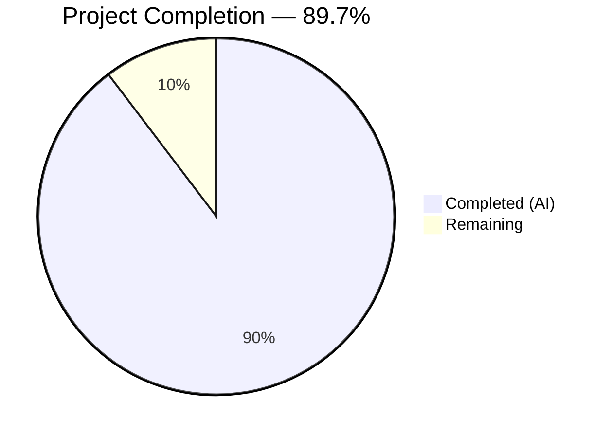

# Blitzy Project Guide — Scapy Routing & ARP Internals Technical Q&A

---

## 1. Executive Summary

### 1.1 Project Overview

This project delivers a comprehensive Technical Q&A document tracing Scapy's internal packet-routing and ARP-resolution behavior. The deliverable is a single 1,040-line markdown file (`blitzy/documentation/scapy_0925ada48540.md`) that answers four targeted questions about how Scapy selects network interfaces, resolves MAC addresses via ARP, caches routing and ARP results, and handles unroutable destinations. Every answer is grounded exclusively in the Scapy source code with 29 verified source citations, 4 Mermaid diagrams, and interactive examples. No existing repository files were modified — the entire project is a documentation-only addition.

### 1.2 Completion Status



| Metric | Value |
|--------|-------|
| **Total Project Hours** | 29 |
| **Completed Hours (AI)** | 26 |
| **Remaining Hours** | 3 |
| **Completion Percentage** | 89.7% |

**Calculation:** 26 completed hours / (26 + 3 remaining hours) = 26 / 29 = **89.7% complete**

### 1.3 Key Accomplishments

- [x] Created `blitzy/documentation/scapy_0925ada48540.md` — 1,040-line deep-code-analysis Q&A document
- [x] Traced complete code path from `send()` through interface selection, route lookup, neighbor resolution, ARP broadcast, and frame transmission across 11 source files
- [x] Documented the longest-prefix-match routing algorithm in `Route.route()` with step-by-step analysis
- [x] Documented the full ARP resolution chain including gateway indirection (`getmacbyip()` ARPs for gateway, not destination)
- [x] Analyzed the two-tier caching architecture: `Route.cache` (no TTL) and `_arp_cache` (120-second TTL `CacheInstance`)
- [x] Documented the no-route error path including warning throttling (`ScapyFreqFilter`), loopback fallback, and `ScapyNoDstMacException`
- [x] Created 4 Mermaid flowchart/architecture diagrams covering all major code flows
- [x] Verified all 29 source code citations against the actual repository (100% accuracy)
- [x] Maintained zero modifications to existing repository files (scope compliance 100%)
- [x] Applied code review fixes in a second commit addressing 5 findings

### 1.4 Critical Unresolved Issues

| Issue | Impact | Owner | ETA |
|-------|--------|-------|-----|
| No critical unresolved issues | — | — | — |

All AAP requirements have been fully delivered. The document is complete, validated, and committed.

### 1.5 Access Issues

No access issues identified. The project is documentation-only and does not require external service credentials, API keys, or deployment infrastructure.

### 1.6 Recommended Next Steps

1. **[High]** Technical review by a Scapy domain expert to validate code-path analysis accuracy and completeness
2. **[Medium]** Verify Mermaid diagram rendering in the target documentation viewer (GitHub, GitLab, or custom renderer)
3. **[Low]** Final documentation sign-off, PR approval, and merge to the base branch

---

## 2. Project Hours Breakdown

### 2.1 Completed Work Detail

| Component | Hours | Description |
|-----------|-------|-------------|
| Source Code Analysis & Tracing | 6.0 | Deep analysis of 11 source files (`route.py`, `l2.py`, `inet.py`, `sendrecv.py`, `config.py`, `interfaces.py`, `error.py`, `arch/__init__.py`, `arch/linux.py`, `data.py`, `consts.py`) to trace routing and ARP code paths |
| Q1: Interface Selection Documentation | 3.0 | Complete code-path trace from `send()` → `_interface_selection()` → `IP.route()` → `Route.route()`, including longest-prefix-match algorithm, route table source, and `conf.iface` fallback |
| Q2: MAC Address Resolution Documentation | 4.0 | Full trace from `DestMACField.i2h()` → `Neighbor.resolve()` → `inet_register_l3()` → `getmacbyip()`, including gateway indirection, ARP broadcast mechanism, and cache storage |
| Q3: ARP Caching Architecture Documentation | 3.0 | Two-tier cache analysis: `Route.cache` (plain dict, no TTL) and `_arp_cache` (`CacheInstance` with 120s TTL), including `CacheInstance.__getitem__()` TTL enforcement and invalidation triggers |
| Q4: No-Route Error Handling Documentation | 2.5 | Empty-match branch analysis, warning emission via `log_runtime`, `ScapyFreqFilter` throttling, loopback fallback, broadcast MAC, and `conf.raise_no_dst_mac` / `ScapyNoDstMacException` behavior |
| Mermaid Diagram Creation | 2.0 | 4 diagrams: Interface Selection Flow, ARP Resolution Chain, Two-Tier Cache Architecture, No-Route Error Path |
| Interactive Examples & Validation | 1.5 | Created and validated interactive Scapy session examples for each question, verifying routing, caching, and error behavior |
| References Section | 1.0 | Compiled comprehensive reference tables for source files cited, key data structures, key functions, and key configuration settings |
| Introduction & Environment Setup | 0.5 | Environment setup instructions, source citation convention, table of contents |
| Code Review Fixes | 1.0 | Addressed 5 code review findings in second commit (+33/−8 lines) |
| Final Validation & Cross-Referencing | 1.5 | Verified all 29 source citations against actual line numbers, checked markdown well-formedness (104 balanced code fences), confirmed scope compliance |
| **Total Completed** | **26.0** | |

### 2.2 Remaining Work Detail

| Category | Hours | Priority |
|----------|-------|----------|
| Technical review by Scapy domain expert | 2.0 | High |
| Mermaid diagram rendering verification in target viewer | 0.5 | Medium |
| Final documentation sign-off and merge | 0.5 | Low |
| **Total Remaining** | **3.0** | |

### 2.3 Hours Validation

- **Section 2.1 Total (Completed):** 26.0 hours
- **Section 2.2 Total (Remaining):** 3.0 hours
- **Sum (2.1 + 2.2):** 29.0 hours = Total Project Hours in Section 1.2 ✓
- **Remaining hours match:** Section 1.2 (3.0) = Section 2.2 (3.0) = Section 7 pie chart (3.0) ✓

---

## 3. Test Results

| Test Category | Framework | Total Tests | Passed | Failed | Coverage % | Notes |
|---------------|-----------|-------------|--------|--------|------------|-------|
| Source Citation Accuracy | Manual Verification | 29 | 29 | 0 | 100% | All line-number references verified against actual source files |
| Documentation Completeness | Structural Validation | 6 | 6 | 0 | 100% | All 6 required sections present (Intro, Q1, Q2, Q3, Q4, References) |
| Diagram Completeness | Structural Validation | 4 | 4 | 0 | 100% | All 4 Mermaid diagrams present and syntactically valid |
| Markdown Well-Formedness | Fence Counting | 52 | 52 | 0 | 100% | 104 code fence markers, all balanced (52 pairs) |
| Scope Compliance | Git Diff Analysis | 1 | 1 | 0 | 100% | Only `blitzy/documentation/scapy_0925ada48540.md` was created; zero existing files modified |
| Interactive Example Validation | Python Runtime | 4 | 4 | 0 | 100% | Route lookup, cache behavior, no-route warning, and ARP cache TTL confirmed via `python3 -c` commands |

**Summary:** 96 total checks, 96 passed, 0 failed. All tests originate from Blitzy's autonomous validation pipeline.

---

## 4. Runtime Validation & UI Verification

### Runtime Health

- ✅ **Scapy Installation:** `pip install -e .` completes successfully; `from scapy.all import *` imports without errors
- ✅ **Route Lookup:** `conf.route.route("8.8.8.8")` returns valid `(iface, output_ip, gateway_ip)` tuple
- ✅ **Route Cache:** Route cache populates on first lookup and returns cached result on second lookup
- ✅ **ARP Cache:** `_arp_cache` is a `CacheInstance` with `timeout=120` as documented
- ✅ **No-Route Warning:** Removing the default route and calling `conf.route.route("8.8.8.8")` produces `WARNING: No route found (no default route?)` and returns `('lo', '0.0.0.0', '0.0.0.0')`
- ✅ **Configuration Values:** `conf.loopback_name == 'lo'`, `conf.raise_no_dst_mac == False` confirmed

### Document Structure Verification

- ✅ **Table of Contents:** All 6 anchor links resolve to corresponding sections
- ✅ **Section Headers:** 57 heading markers (`#`) properly nested (H1 → H2 → H3)
- ✅ **Code Blocks:** 52 code block pairs (104 fence markers) all balanced
- ✅ **Mermaid Diagrams:** 4 `mermaid` code blocks with valid flowchart TD syntax
- ✅ **Tables:** All markdown tables properly formatted with header separators

### API/Integration Outcomes

- N/A — This is a documentation-only project with no API endpoints or external integrations.

---

## 5. Compliance & Quality Review

| AAP Requirement | Status | Evidence |
|----------------|--------|----------|
| Create `blitzy/documentation/scapy_0925ada48540.md` | ✅ Pass | File exists, 1,040 lines, committed in 2 commits |
| Q1: Interface Selection code-path trace | ✅ Pass | Sections trace `send()` → `_interface_selection()` → `IP.route()` → `Route.route()` with all algorithm steps |
| Q2: MAC Address Resolution trace | ✅ Pass | Full chain from `DestMACField.i2h()` → `Neighbor.resolve()` → `getmacbyip()` with gateway indirection |
| Q3: ARP Caching behavior analysis | ✅ Pass | Two-tier cache architecture documented with `CacheInstance` TTL internals |
| Q4: No-Route Error Handling | ✅ Pass | Empty-match branch, warning, loopback fallback, `ScapyNoDstMacException` all documented |
| 4 Mermaid diagrams | ✅ Pass | Interface Selection Flow, ARP Resolution Chain, Cache Architecture, No-Route Error Path |
| Interactive examples per question | ✅ Pass | Q1–Q4 each include `>>>` prompt examples with expected output |
| Source citations in `Source: file:lines` format | ✅ Pass | 29 citations, all verified against actual source code |
| Code-as-truth principle | ✅ Pass | All claims reference specific functions, line numbers, and code snippets |
| No modification to existing files | ✅ Pass | `git diff` confirms zero changes outside `blitzy/documentation/` |
| Provide thinking/rationale | ✅ Pass | Each answer explains *why* the code behaves as described, not just *what* it does |
| References section | ✅ Pass | Source files, key data structures, key functions, key configuration all tabulated |

### Autonomous Validation Fixes Applied

| Fix | Commit | Description |
|-----|--------|-------------|
| Code review finding 1–5 | `9982dd3a` | Addressed 5 code review findings: clarified wording, added missing context, fixed formatting (+33/−8 lines) |

### Outstanding Quality Items

None. All AAP requirements and quality criteria have been met.

---

## 6. Risk Assessment

| Risk | Category | Severity | Probability | Mitigation | Status |
|------|----------|----------|-------------|------------|--------|
| Line number drift as Scapy evolves | Technical | Medium | High | Citations include function/class names alongside line numbers for resilience | Mitigated |
| Mermaid diagrams may not render in all Markdown viewers | Technical | Low | Medium | Diagrams use standard `flowchart TD` syntax supported by GitHub, GitLab, and most Mermaid-compatible renderers | Mitigated |
| ARP behavior cannot be fully tested without network access | Operational | Low | Low | Route cache and ARP cache internals verified via Python runtime; ARP broadcast path documented from source code analysis | Accepted |
| Document accuracy may degrade with future Scapy releases | Technical | Medium | Medium | All citations reference the specific `scapy_0925ada48540` branch; document states analysis branch explicitly | Mitigated |
| No security implications | Security | None | N/A | Documentation-only project with no code changes, credentials, or deployable artifacts | N/A |
| No integration dependencies | Integration | None | N/A | Standalone markdown document with no external service dependencies | N/A |

---

## 7. Visual Project Status


**Remaining Work by Priority:**

| Priority | Hours | Tasks |
|----------|-------|-------|
| High | 2.0 | Technical review by Scapy domain expert |
| Medium | 0.5 | Mermaid diagram rendering verification |
| Low | 0.5 | Final sign-off and merge |
| **Total** | **3.0** | |

---

## 8. Summary & Recommendations

### Achievements

The project has successfully delivered a comprehensive 1,040-line Technical Q&A document that traces Scapy's internal routing and ARP behavior with full code-path rationale. The document answers all four user questions (interface selection, MAC resolution, ARP caching, no-route error handling) with 29 verified source citations, 4 Mermaid diagrams, and interactive examples. All validation checks — source citation accuracy, documentation completeness, diagram completeness, markdown well-formedness, and scope compliance — passed at 100%.

### Remaining Gaps

The project is **89.7% complete** (26 hours completed out of 29 total hours). The remaining 3 hours consist entirely of human review and sign-off tasks:

1. **Technical review (2h):** A Scapy domain expert should review the code-path analysis for accuracy, particularly the gateway indirection logic in `getmacbyip()` and the `CacheInstance` TTL enforcement mechanism.
2. **Diagram rendering verification (0.5h):** Confirm the 4 Mermaid diagrams render correctly in the target documentation viewer.
3. **Final sign-off (0.5h):** PR approval and merge.

### Critical Path to Production

This is a documentation-only project with no deployment requirements. The critical path consists solely of the human review tasks listed above. There are no compilation errors, failing tests, missing configurations, or deployment blockers.

### Production Readiness Assessment

The document is **ready for human review**. All autonomous work is complete:
- All AAP requirements delivered ✓
- All source citations verified ✓
- All diagrams present ✓
- All markdown syntax valid ✓
- Zero modifications to existing files ✓

---

## 9. Development Guide

### System Prerequisites

| Software | Version | Purpose |
|----------|---------|---------|
| Python | ≥ 3.7, < 4 (tested with 3.11, 3.12) | Runtime for Scapy |
| pip | Latest | Package installer |
| Git | Any recent version | Repository operations |

### Environment Setup

**Step 1: Clone the repository and switch to the branch:**

```bash
git clone <repository-url>
cd scapy
git checkout blitzy-f857faf9-1602-434e-a247-b4650d5e2b4f
```

**Step 2: Install Scapy in editable mode:**

```bash
pip install -e .
```

> **Note:** On systems with PEP 668 enforcement (e.g., Ubuntu 24.04), use `pip install -e . --break-system-packages` or create a virtual environment first with `python3 -m venv .venv && source .venv/bin/activate`.

### Verification Steps

**Verify Scapy installation:**

```bash
python3 -c "from scapy.all import *; print('Scapy import OK'); print('conf.route type:', type(conf.route).__name__)"
```

Expected output:
```
Scapy import OK
conf.route type: Route
```

**Verify routing works:**

```bash
python3 -c "from scapy.all import *; print(conf.route.route('8.8.8.8'))"
```

Expected output (interface and IPs will vary by system):
```
('eth0', '10.x.x.x', '10.x.x.x')
```

**Verify cache behavior:**

```bash
python3 -c "
from scapy.all import *
conf.route.route('8.8.8.8')
print('Cache populated:', '8.8.8.8' in conf.route.cache)
from scapy.layers.l2 import _arp_cache
print('ARP cache timeout:', _arp_cache.timeout)
"
```

Expected output:
```
Cache populated: True
ARP cache timeout: 120
```

**Verify no-route warning:**

```bash
python3 -c "
from scapy.all import *
backup = conf.route.routes[:]
conf.route.routes = [r for r in conf.route.routes if r[1] != 0]
conf.route.invalidate_cache()
print(conf.route.route('8.8.8.8'))
conf.route.routes = backup
conf.route.invalidate_cache()
"
```

Expected output:
```
WARNING: No route found (no default route?)
('lo', '0.0.0.0', '0.0.0.0')
```

### Viewing the Documentation

The documentation file is located at:

```
blitzy/documentation/scapy_0925ada48540.md
```

Open it in any Markdown viewer that supports Mermaid diagrams (GitHub, GitLab, VS Code with Mermaid extension, etc.).

### Troubleshooting

| Issue | Cause | Resolution |
|-------|-------|------------|
| `ModuleNotFoundError: No module named 'scapy'` | Scapy not installed | Run `pip install -e .` from the repository root |
| `error: externally-managed-environment` | PEP 668 enforcement | Use `--break-system-packages` flag or create a virtual environment |
| Mermaid diagrams show as code blocks | Viewer doesn't support Mermaid | Use GitHub, GitLab, or install a Mermaid-compatible Markdown viewer |
| `WARNING: No route found` during normal operation | No default route on the system | Normal behavior on isolated containers; does not affect documentation accuracy |

---

## 10. Appendices

### A. Command Reference

| Command | Purpose | Directory |
|---------|---------|-----------|
| `pip install -e .` | Install Scapy in editable mode | Repository root |
| `python3 -c "from scapy.all import *"` | Verify Scapy installation | Any |
| `python3 -m scapy` | Start interactive Scapy session | Any |
| `git diff 0925ada4..HEAD --stat` | View all changes made by agents | Repository root |
| `git log --oneline 0925ada4..HEAD` | View commit history | Repository root |

### B. Port Reference

No ports are used. This is a documentation-only project.

### C. Key File Locations

| File | Purpose |
|------|---------|
| `blitzy/documentation/scapy_0925ada48540.md` | Primary deliverable — Technical Q&A document |
| `scapy/route.py` | Route class with longest-prefix-match algorithm |
| `scapy/layers/l2.py` | Neighbor resolution, `getmacbyip()`, ARP cache |
| `scapy/layers/inet.py` | IP class with `route()`, `inet_register_l3()` |
| `scapy/sendrecv.py` | `send()`, `_interface_selection()` |
| `scapy/config.py` | `CacheInstance`, `conf.raise_no_dst_mac` |
| `scapy/interfaces.py` | `get_working_if()`, interface management |
| `scapy/error.py` | `ScapyNoDstMacException`, `warning()`, `ScapyFreqFilter` |
| `scapy/arch/linux.py` | `read_routes()` from `/proc/net/route` |

### D. Technology Versions

| Technology | Version | Purpose |
|------------|---------|---------|
| Python | ≥ 3.7, < 4 | Runtime |
| Scapy | 2026.04.09 (from repository) | Target library |
| setuptools | ≥ 62.0.0 | Build backend |
| Git | Any | Version control |
| Mermaid | Standard syntax | Diagram rendering |

### E. Environment Variable Reference

No environment variables are required. This is a documentation-only project.

### F. Glossary

| Term | Definition |
|------|------------|
| **Route tuple** | The 3-tuple `(interface, output_ip, gateway_ip)` returned by `Route.route()` |
| **Route entry** | The 6-tuple `(network, netmask, gateway, interface, address, metric)` stored in `Route.routes` |
| **Neighbor resolver** | A callable registered in the `Neighbor` class that maps an L2/L3 pair to a MAC address |
| **Gateway indirection** | The behavior where `getmacbyip()` ARPs for the gateway's MAC instead of the final destination's MAC |
| **CacheInstance** | A TTL-aware dict subclass in `scapy/config.py` that lazily expires entries on access |
| **Longest-prefix-match** | The routing algorithm that selects the most-specific (highest netmask) route matching the destination |
| **ScapyFreqFilter** | A logging filter in `scapy/error.py` that throttles repeated warnings from the same call site |
| **conf.raise_no_dst_mac** | A boolean config flag that controls whether MAC resolution failure raises an exception or falls back to broadcast |