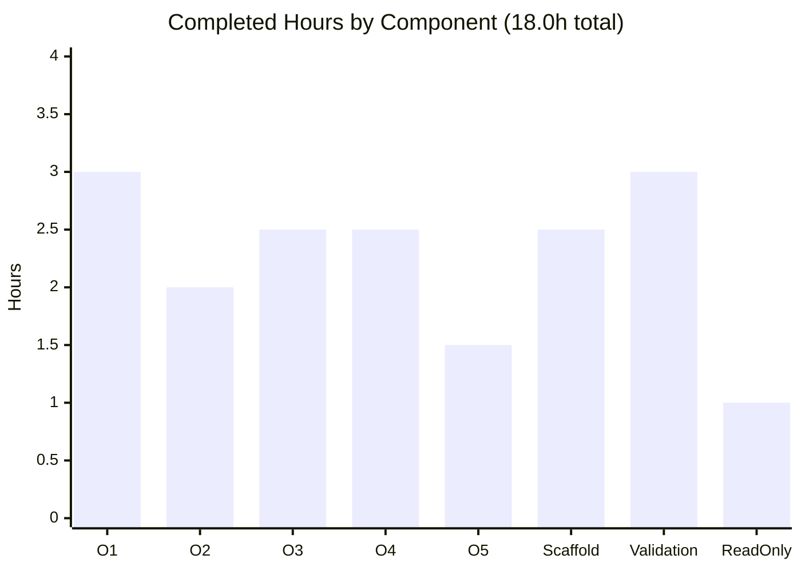

# Blitzy Project Guide — Scapy Runtime-Behavior Onboarding Q&A

> **Deliverable branch:** `blitzy-d8fc8d31-46ae-4582-bfa3-5eeaa6283f0e` · **Baseline:** `0925ada4` · **HEAD:** `502e3517`
> **Blitzy brand colors:** Completed / AI Work = **Dark Blue `#5B39F3`** · Remaining = **White `#FFFFFF`** · Headings/Accents = **Violet-Black `#B23AF2`** · Highlight = **Mint `#A8FDD9`**

---

## 1. Executive Summary

### 1.1 Project Overview

This project delivers a single, comprehensive onboarding document that empirically characterizes how the locally cloned **Scapy** checkout behaves **at runtime** — what is actually loaded and executed, not merely what files exist in the source tree — so a developer joining a Scapy-reliant team can orient before writing code. It answers five questions (startup banner & version, count of loaded protocol layers, default configuration, ICMP packet structure, and terminal theme), each grounded in real commands, real unedited output, and exact `file:line` citations. The scope is **documentation-only and strictly read-only**: exactly one new Markdown file is created and the entire Scapy source tree is left byte-for-byte unchanged.

### 1.2 Completion Status


| Metric | Value |
|---|---|
| **Total Hours** | **20.0 h** |
| **Completed Hours (AI + Manual)** | **18.0 h** (18.0 h AI + 0.0 h Manual) |
| **Remaining Hours** | **2.0 h** |
| **Percent Complete** | **90.0 %** |

> Completion is computed on AAP-scoped work only (PA1): `18.0 / (18.0 + 2.0) = 90.0%`. The remaining 2.0 h is exclusively human-in-the-loop path-to-production (review + merge).

### 1.3 Key Accomplishments

- ✅ **Deliverable created at the mandated path/name** — `blitzy/documentation/scapy_0925ada48540.md` (804 lines), one `##` section per question (O1–O5), each with Direct answer / Command(s) run / Captured output / `file:line` citations / Observed-vs-Inferred labeling.
- ✅ **O1** — Startup banner captured ("Welcome to Scapy / Version 2026.07.13 / GitHub URL / Have fun!" + rotating quote); the version is correctly labeled a **non-canonical mtime fallback** (zero git tags) with the canonical git-tag mechanism explained.
- ✅ **O2** — Runtime layer counts reported and stabilized: **49** loaded modules (`conf.load_layers`) and **1319** registered `Packet` classes (`conf.layers`), explicitly distinguished from the source-tree `.py` file count.
- ✅ **O3** — Default configuration answered in three parts: `conf.verb = 2`, its 0→3 semantics, and the Linux socket selection (`L3PacketSocket` / `L2Socket` / `L2ListenSocket`).
- ✅ **O4** — ICMP ping shown to be a **linked chain of distinct `Packet` instances** (not a composite): `IP.payload → ICMP`, `ICMP.underlayer → IP`, `NoPayload` terminator, `proto=1` auto-set — with a mermaid object-graph diagram.
- ✅ **O5** — Active theme identified: `DefaultTheme` (interactive console) vs `NoTheme` (plain import), with rationale.
- ✅ **Read-only mandate honored** — Scapy source tree byte-for-byte unchanged; only one file added; temporary probes confined to `/tmp` and removed.
- ✅ **Autonomous validation passed** — all documented commands reproduce their output; 93 unique citations verified accurate (one citation fix applied); `compileall scapy` exits 0; committed across 4 clean agent commits.

### 1.4 Critical Unresolved Issues

| Issue | Impact | Owner | ETA |
|---|---|---|---|
| _None_ — no blocking or release-critical issues identified | The deliverable is complete, validated, and committed; source tree unchanged | — | — |

> There are no unresolved defects. The only outstanding work is routine human review and merge (see §1.6 and §2.2).

### 1.5 Access Issues

| System/Resource | Type of Access | Issue Description | Resolution Status | Owner |
|---|---|---|---|---|
| — | — | **No access issues identified** | N/A | — |

> A standalone Markdown deliverable requires no repository permissions beyond the working branch, no service credentials, and no third-party API access.

### 1.6 Recommended Next Steps

1. **[High]** Have a Scapy-familiar reviewer read `blitzy/documentation/scapy_0925ada48540.md` and confirm the five answers are accurate and useful for onboarding; spot-check 2–3 documented commands on the target host.
2. **[Medium]** Approve and merge the pull request (single additive file; no conflicts expected).
3. **[Low]** Apply any minor wording/clarity adjustments the reviewer requests (small buffer; may not be needed).

---

## 2. Project Hours Breakdown

### 2.1 Completed Work Detail

| Component | Hours | Description |
|---|---:|---|
| O1 — Startup banner & version | 3.0 | Captured banner via canonical entry point; traced the 5-method `_version()` resolution (env → VERSION file → git-archive → git-describe → mtime fallback); proved why methods fail; labeled the mtime fallback non-canonical; banner-assembly citations; documented 4 startup notices |
| O2 — Loaded protocol-layer counts | 2.0 | Introspected `conf.load_layers = 49` and `conf.layers = 1319`; 48+`tuntap` decomposition; `LayersList` mechanics; stability re-runs; resolved the runtime-vs-`.py`-file distinction |
| O3 — Default configuration | 2.5 | `conf.verb = 2`; traced 0→3 verbosity semantics through consumers; socket selection `L3PacketSocket` / `L2Socket` / `L2ListenSocket` (+ IPv6 partial) |
| O4 — ICMP ping packet structure | 2.5 | Constructed `IP/ICMP` probe; introspected object graph (`payload` / `underlayer` / `NoPayload`); traced the `/` operator mechanism (`__div__` → `add_payload` → `bind_layers`); `proto=1` auto-set; mermaid diagram |
| O5 — Active terminal theme | 1.5 | `DefaultTheme` (interactive) vs `NoTheme` (import); rationale for the split; citations |
| Document scaffolding & methodology | 2.5 | Methodology, Environment & preconditions, Baseline & repository integrity, and Coverage summary sections |
| Autonomous validation & remediation | 3.0 | Three remediation cycles (code review, QA final-acceptance, citation fix) + five production-readiness gates + 93-citation accuracy sweep |
| Read-only integrity & cleanup | 1.0 | `/tmp`-only probes, `__pycache__` cleanup, byte-for-byte source-unchanged verification across commits |
| **Total Completed** | **18.0** | |

### 2.2 Remaining Work Detail

| Category | Hours | Priority |
|---|---:|---|
| Human technical review + command/output spot-check | 1.0 | High |
| PR approval & merge to target branch | 0.5 | Medium |
| Minor revision buffer (address any review feedback) | 0.5 | Low |
| **Total Remaining** | **2.0** | |

### 2.3 Hours Reconciliation & Totals

| Check | Result |
|---|---|
| Section 2.1 total (Completed) | 18.0 h |
| Section 2.2 total (Remaining) | 2.0 h |
| **2.1 + 2.2 = Total (Rule 2)** | **20.0 h ✅** |
| Remaining across §1.2 ↔ §2.2 ↔ §7 (Rule 1) | 2.0 h everywhere ✅ |
| Completion % = 18.0 / 20.0 | **90.0 % ✅** |

---

## 3. Test Results

This is a **documentation-only deliverable with no in-scope unit-test suite** (there is nothing to unit-test but the document itself). Accordingly, the applicable "tests" are the **empirical validations executed by Blitzy's autonomous validation systems** — command→output reproduction, citation accuracy, byte-compile, read-only integrity, and Markdown well-formedness — all sourced from the autonomous validation logs for this project.

| Test Category | Framework | Total Tests | Passed | Failed | Coverage % | Notes |
|---|---|---:|---:|---:|---:|---|
| Runtime command→output reproduction (O1–O5) | Shell / `./run_scapy` + `python3` probes | 5 | 5 | 0 | 100% | Every documented command reproduces its output exactly; count answers (O2, O4) stable across 2 runs |
| Citation accuracy sweep | Custom static check | 93 | 93 | 0 | 100% | 93 unique `file:line` citations across 17 files; 0 missing / 0 out-of-bounds after one fix (commit `502e3517`) |
| Byte-compile smoke test | `python3 -m compileall` | 1 | 1 | 0 | n/a | `compileall scapy` exits 0 |
| Read-only integrity | `git diff` / `git status` | 1 | 1 | 0 | n/a | Only `A blitzy/documentation/scapy_0925ada48540.md`; source byte-for-byte unchanged; tree clean |
| Markdown well-formedness | Structural check | 1 | 1 | 0 | n/a | 74 balanced code-fence lines; all five O-sections + coverage table present |
| **In-scope total** | | **101** | **101** | **0** | **100%** | All autonomous in-scope validations pass |

> **Out-of-scope (reference source, not part of this deliverable's validation):** the setup logs note **194 pre-existing failures** in Scapy's own source-code test suite (Docker test env). These reside in **read-only reference source** that the read-only mandate and the AAP forbid modifying, are **not caused by** this task (which adds only the document), and do **not** block the deliverable. They are **excluded** from the in-scope totals above and from the completion percentage.

---

## 4. Runtime Validation & UI Verification

**Runtime health (canonical entry point, default configuration):**

- ✅ **Operational** — `./run_scapy` and `PYTHONPATH=. python3 -m scapy` both start and exit cleanly (exit 0).
- ✅ **Operational** — Banner renders: "Welcome to Scapy / Version 2026.07.13 / https://github.com/secdev/scapy / Have fun!" + rotating quote.
- ✅ **Operational** — Layer registries populated: `conf.load_layers = 49`, `conf.layers = 1319` (stable across runs).
- ✅ **Operational** — Configuration resolves: `conf.verb = 2`; sockets `L3PacketSocket` / `L2Socket` / `L2ListenSocket`.
- ✅ **Operational** — Packet composition works: `IP(dst="8.8.8.8")/ICMP()` yields the documented linked chain with `proto=1`.
- ✅ **Operational** — Theme resolves: `DefaultTheme` (interactive) / `NoTheme` (import).
- ✅ **Operational** — Byte-compile clean: `compileall scapy` exits 0.

**Startup notices (expected, non-blocking):** "Can't import PyX", "No IPv6 support in kernel", `TripleDES` `CryptographyDeprecationWarning`, "IPython not available" — all expected given optional deps are absent and the warning originates in reference-only source.

**UI verification:** ⚠ **Not applicable** — Scapy is a CLI/REPL and Python library with **no graphical or web UI**. The only user-facing surface is the interactive console banner, which is verified above (✅ Operational). No API integrations are in scope for this documentation deliverable.

---

## 5. Compliance & Quality Review

AAP deliverables and project-rule (**SWE-AtlasQnA-Repo**) benchmarks, cross-mapped to status. Fixes applied during autonomous validation are noted.

| Benchmark (AAP / Rule) | Status | Progress | Notes |
|---|---|---|---|
| Deliverable at exact path/name `blitzy/documentation/scapy_0925ada48540.md` | ✅ Pass | 100% | File present; named after source branch |
| Run-first methodology (real command + real unedited output per claim) | ✅ Pass | 100% | Every O-section shows Command(s) run + Captured output |
| Canonical entry point exercised in default configuration | ✅ Pass | 100% | `./run_scapy` / `PYTHONPATH=. python3 -m scapy` |
| Stability confirmation for count/magnitude answers (≥2 runs) | ✅ Pass | 100% | O2 (49 / 1319) and O4 chain stable across 2 runs |
| Exact `file:line` grounding + Observed-vs-Inferred labeling | ✅ Pass | 100% | 93 unique citations / 17 files; every claim labeled |
| Coverage of every sub-part of all five questions | ✅ Pass | 100% | Coverage summary table (O1, O1-methods, O2, O3a/b/c, O4, O5) |
| Non-canonical values explicitly flagged | ✅ Pass | 100% | Version `2026.07.13` labeled mtime fallback; canonical mechanism explained |
| Read-only: source unchanged + temp scripts removed | ✅ Pass | 100% | 0 source files in diff; `/tmp`-only probes; tree clean |
| Committed to branch | ✅ Pass | 100% | 4 clean agent commits; HEAD `502e3517` |
| Citation correctness | ✅ Pass (1 fix) | 100% | Commit `502e3517` corrected `_probe_config_file` citation to cite both the definition line (`main.py:62`) and the actual `return None` (`main.py:68`) |
| Human review sign-off | ⏳ Pending | 0% | Path-to-production; requires human reviewer (see §2.2) |

---

## 6. Risk Assessment

| Risk | Category | Severity | Probability | Mitigation | Status |
|---|---|---|---|---|---|
| Version string is a non-canonical mtime fallback (`2026.07.13`) that could be mistaken for a release version | Technical | Low | Low | Document explicitly labels it non-canonical and explains the canonical git-tag mechanism | Mitigated |
| Runtime values are environment-specific (Python 3.13.7, cryptography 43.0.0, Linux, no IPv6); other hosts may differ | Technical | Low | Medium | All claims scoped to "this system"; platform-specificity flagged throughout | Mitigated |
| Observed values may drift (mtime fallback changes daily; upstream layer counts could change) | Technical | Low | Low | Exact commit + reproduction commands recorded; re-running refreshes values | Accepted |
| No code, dependencies, endpoints, data handling, or auth surface introduced | Security | None | N/A | Documentation-only change; nothing to secure | N/A |
| 194 pre-existing failures in Scapy's own source-code test suite (Docker test env) | Operational | Low | N/A (pre-existing) | Out-of-scope reference source; untouchable under read-only mandate; not caused by this task; documented transparently | Accepted / Out-of-scope |
| No CI/monitoring/deployment for a Markdown artifact | Operational | None | N/A | None required for a standalone document | N/A |
| Deliverable is standalone; not referenced by any build/test/runtime config; no external services | Integration | None | N/A | Nothing to integrate | N/A |
| Read-only constraint (must not modify source / leave temp files) | Process / Compliance | High (if violated) | Very Low | Byte-for-byte source-unchanged verification + `/tmp`-only probes + `__pycache__` cleanup, re-verified this session | Mitigated / Closed |

---

## 7. Visual Project Status

**Project hours breakdown (Completed = Dark Blue `#5B39F3`, Remaining = White `#FFFFFF`):**


**Completed hours by component (progress distribution):**



**Remaining hours by category (from §2.2 — sums to 2.0 h):**

| Category | Hours | Priority |
|---|---:|---|
| Human technical review + spot-check | 1.0 | High |
| PR approval & merge | 0.5 | Medium |
| Minor revision buffer | 0.5 | Low |
| **Total** | **2.0** | |

> **Integrity:** the "Remaining Work" pie value (2) equals the §1.2 Remaining Hours (2.0 h) and the §2.2 total (2.0 h). ✅

---

## 8. Summary & Recommendations

**Achievements.** The project is **90.0% complete** (18.0 h of 20.0 h). Every AAP requirement is delivered: the mandated document exists at `blitzy/documentation/scapy_0925ada48540.md` and answers all five questions (O1–O5, including all sub-parts) with a run-first methodology — real commands, real unedited output, exact `file:line` citations, and explicit Observed-vs-Inferred labeling. Count-based answers are stabilized across repeated runs, the non-canonical version is clearly flagged, and the read-only mandate is fully honored (the Scapy source tree is byte-for-byte unchanged; only one file was added).

**Remaining gaps & critical path to production.** No functional gaps remain. The critical path is short and entirely human-in-the-loop: **(1)** a technical review + command spot-check (1.0 h), **(2)** PR approval & merge (0.5 h), and **(3)** a small revision buffer (0.5 h) — **2.0 h total**.

**Success metrics.** All five documented commands reproduce their output; 93/93 citations are accurate (after one fix); `compileall scapy` exits 0; the diff versus baseline is exactly one added file; and the working tree is clean.

**Production-readiness assessment.** **Ready for review.** For a documentation deliverable, "production" means a correct, well-formed, committed answer document — achieved and independently re-verified. Once a reviewer signs off and the PR is merged, the deliverable is fully in production. The 194 out-of-scope pre-existing test failures do not affect this assessment.

| Metric | Value |
|---|---|
| Completion | 90.0% |
| In-scope validations passing | 101 / 101 (100%) |
| Citation accuracy | 93 / 93 (100%) |
| Source files modified | 0 |
| Files added | 1 |
| Remaining effort | 2.0 h (human review + merge) |

---

## 9. Development Guide

> All commands below were executed and verified during assessment; run them from the repository root. The repository is left byte-for-byte unchanged.

### 9.1 System Prerequisites

- **OS:** Linux (this host). Socket selection and the IPv6 notice are platform-specific.
- **Python:** 3.7+ (project declares `requires-python = ">=3.7, <4"`). This host runs **Python 3.13.7**.
- **git:** any recent version (this host: 2.51.0) — needed only to inspect history, not to run Scapy.
- **No build step and no `pip install`:** Scapy runs in-place from the checkout. **Core Scapy has zero mandatory dependencies.**
- **Optional dependencies:** present — `cryptography` 43.0.0 (emits a documented `TripleDES` deprecation warning), `openpyxl` 3.1.5. Absent (each produces a documented startup notice) — `IPython`, `PyX`, `matplotlib`.

### 9.2 Environment Setup

No virtualenv or environment variables are required for the default canonical run — `run_scapy` sets `PYTHONPATH` itself:

```bash
# run_scapy (excerpt): DIR=$(dirname "$0"); PYTHONPATH=$DIR exec "$PYTHON" -m scapy $@
```

Optional — keep the tree pristine by preventing bytecode cache files (`__pycache__` is git-ignored regardless):

```bash
export PYTHONDONTWRITEBYTECODE=1
```

### 9.3 Dependency Installation

```bash
# Nothing to install for core functionality — Scapy runs from the checkout.
# (Optional, only if you want the extras exercised in the doc:)
#   pip install --break-system-packages cryptography openpyxl
```

### 9.4 Application Startup (canonical entry point)

```bash
# Interactive REPL (prints banner, then a >>> prompt; type exit() to quit)
./run_scapy
# Equivalent:
PYTHONPATH=. python3 -m scapy

# Non-interactive banner capture (as used for O1)
printf 'exit()\n' | ./run_scapy
```

### 9.5 Verification Steps (all tested — reproduce exactly)

```bash
# Byte-compile smoke test  -> exit 0
python3 -m compileall -q scapy

# O2 — loaded layers        -> "49 1319"
PYTHONPATH=. python3 -c "from scapy.all import conf; print(len(conf.load_layers), len(conf.layers))"

# O3 — default config       -> "2 L3PacketSocket L2Socket L2ListenSocket"
PYTHONPATH=. python3 -c "from scapy.all import conf; print(conf.verb, conf.L3socket.__name__, conf.L2socket.__name__, conf.L2listen.__name__)"

# O4 — ICMP ping structure  -> layers=[IP, ICMP], payload=ICMP, underlayer=IP, proto=1
PYTHONPATH=. python3 -c "from scapy.all import IP, ICMP; p=IP(dst='8.8.8.8')/ICMP(); print(p.layers(), p.payload.__class__.__name__, p.payload.underlayer.__class__.__name__, p.proto)"

# O5 — theme on plain import -> "NoTheme"  (interactive console shows DefaultTheme)
PYTHONPATH=. python3 -c "from scapy.all import conf; print(conf.color_theme.__class__.__name__)"
```

### 9.6 View the Deliverable

```bash
sed -n '1,40p' blitzy/documentation/scapy_0925ada48540.md   # preview
wc -l blitzy/documentation/scapy_0925ada48540.md            # 804 lines
```

Open in any Markdown viewer for the full document (mermaid diagrams render in GitHub / VS Code).

### 9.7 Example Usage (reproduce a finding end-to-end)

```bash
# Reproduce the O2 counts and confirm stability (run twice -> identical output)
PYTHONPATH=. python3 -c "from scapy.all import conf; print(len(conf.load_layers), len(conf.layers))"
PYTHONPATH=. python3 -c "from scapy.all import conf; print(len(conf.load_layers), len(conf.layers))"
```

### 9.8 Troubleshooting

- **"Can't import PyX" / "IPython not available"** — expected (optional deps absent); Scapy falls back to its own shell. No action needed.
- **"No IPv6 support in kernel"** — expected on this host; unrelated to the deliverable.
- **`TripleDES` `CryptographyDeprecationWarning`** — expected from the optional `cryptography` package in reference-only source; harmless.
- **Version shows a date (`2026.07.13`) instead of a semantic version** — expected: it is the mtime fallback because the checkout has zero git tags; a tagged release would show a semantic version. Documented in O1.
- **`__pycache__` appears after `compileall`** — it is git-ignored; remove to keep the tree pristine:
  ```bash
  find scapy -name __pycache__ -type d -prune -exec rm -rf {} +
  ```

---

## 10. Appendices

### A. Command Reference

| Purpose | Command |
|---|---|
| Launch interactive REPL | `./run_scapy` |
| Launch (equivalent) | `PYTHONPATH=. python3 -m scapy` |
| Capture banner non-interactively | `printf 'exit()\n' \| ./run_scapy` |
| Byte-compile smoke test | `python3 -m compileall -q scapy` |
| O2 layer counts | `PYTHONPATH=. python3 -c "from scapy.all import conf; print(len(conf.load_layers), len(conf.layers))"` |
| O3 config | `PYTHONPATH=. python3 -c "from scapy.all import conf; print(conf.verb, conf.L3socket.__name__, conf.L2socket.__name__, conf.L2listen.__name__)"` |
| O4 ICMP structure | `PYTHONPATH=. python3 -c "from scapy.all import IP, ICMP; p=IP(dst='8.8.8.8')/ICMP(); print(p.layers(), p.proto)"` |
| O5 import theme | `PYTHONPATH=. python3 -c "from scapy.all import conf; print(conf.color_theme.__class__.__name__)"` |
| View deliverable | `sed -n '1,40p' blitzy/documentation/scapy_0925ada48540.md` |
| Confirm read-only integrity | `git diff --name-status 0925ada4 HEAD` |

### B. Port Reference

**Not applicable.** The deliverable is a Markdown document; it opens no listening services or ports. Scapy itself uses raw/`PF_PACKET` sockets on demand, but nothing in this task binds a port.

### C. Key File Locations

| Path | Role |
|---|---|
| `blitzy/documentation/scapy_0925ada48540.md` | **The deliverable** (804 lines; the only file added) |
| `run_scapy` | Canonical launcher (`PYTHONPATH=$DIR exec python3 -m scapy`) |
| `scapy/__main__.py` | Package entry point → `interact()` |
| `scapy/main.py` | `interact()`, banner assembly, `DefaultTheme` application (O1, O3, O5) |
| `scapy/__init__.py` | `_version()` resolution (O1) |
| `scapy/config.py` | `Conf` defaults: `verb`, `color_theme`, `load_layers` list (O2, O3, O5) |
| `scapy/arch/__init__.py` | Runtime `tuntap` append to `load_layers` (O2) |
| `scapy/arch/linux.py` | Linux socket classes (O3c) |
| `scapy/packet.py` | `/` composition (`__div__`, `add_payload`), `bind_layers` (O4) |
| `scapy/layers/inet.py` | `IP`, `ICMP`, `bind_layers(IP, ICMP, ...)` (O4) |
| `scapy/themes.py` | `NoTheme`, `DefaultTheme`, and variants (O5) |
| `scapy/sendrecv.py` | Consumers gating output on `conf.verb` (O3b) |

### D. Technology Versions

| Component | Version | Notes |
|---|---|---|
| Scapy | `2026.07.13` (runtime `conf.version`) | mtime fallback; run from checkout, not pip-installed |
| Python | 3.13.7 | Host interpreter; project supports 3.7+ |
| git | 2.51.0 | History inspection only |
| cryptography | 43.0.0 | Optional; emits `TripleDES` deprecation warning |
| openpyxl | 3.1.5 | Optional; spreadsheet export helpers |
| IPython / PyX / matplotlib | absent | Optional; absence produces documented startup notices |

### E. Environment Variable Reference

| Variable | Purpose | Required? |
|---|---|---|
| `PYTHONPATH` | Point Python at the checkout (set automatically by `run_scapy`; set to `.` for manual probes) | Only for manual `python3 -m scapy` / `-c` probes |
| `PYTHONDONTWRITEBYTECODE` | Prevent `__pycache__` creation to keep the tree pristine | Optional (recommended during read-only inspection) |
| `PYTHON` | Override the interpreter used by `run_scapy` (defaults to `python3`) | Optional |
| `SCAPY_VERSION` | Would override the resolved version if set (unset here → fallback chain runs) | No |

### F. Developer Tools Guide

| Tool | Use |
|---|---|
| `git log --oneline 0925ada4..HEAD` | Review the 4 agent commits (create → code-review → QA → citation fix) |
| `git diff --name-status 0925ada4 HEAD` | Confirm only the deliverable was added (read-only integrity) |
| `python3 -m compileall scapy` | Byte-compile smoke test (exit 0) |
| `sed -n` / Markdown viewer | Read the deliverable; mermaid renders in GitHub / VS Code |

### G. Glossary

| Term | Meaning |
|---|---|
| **`conf`** | Scapy's global configuration singleton (`scapy.config.Conf`) |
| **`conf.load_layers`** | List of layer **modules** loaded at runtime (49 here) |
| **`conf.layers`** | `LayersList` of registered `Packet` **classes** (1319 here) |
| **`conf.verb`** | Verbosity level, 0 (almost mute) → 3 (verbose); default `2` |
| **mtime fallback** | Version derived from the file modification time (`%Y.%m.%d`) when no git tag/VERSION file is available |
| **`payload` / `underlayer`** | Forward / backward links between stacked `Packet` layers |
| **`NoPayload`** | Sentinel object terminating a packet's layer chain |
| **`DefaultTheme` / `NoTheme`** | Colorized interactive theme / plain (no-color) theme |
| **AAP** | Agent Action Plan — the authoritative project requirements |
| **Read-only mandate** | The rule that no source file may be modified; only the answer document is added |