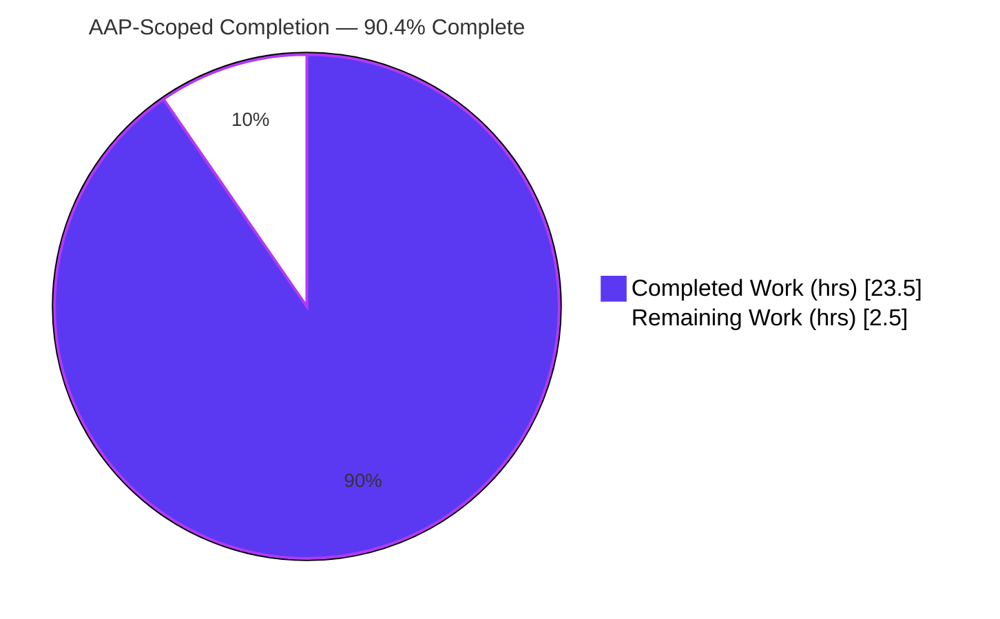
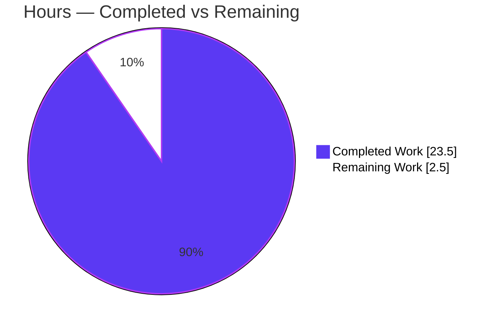
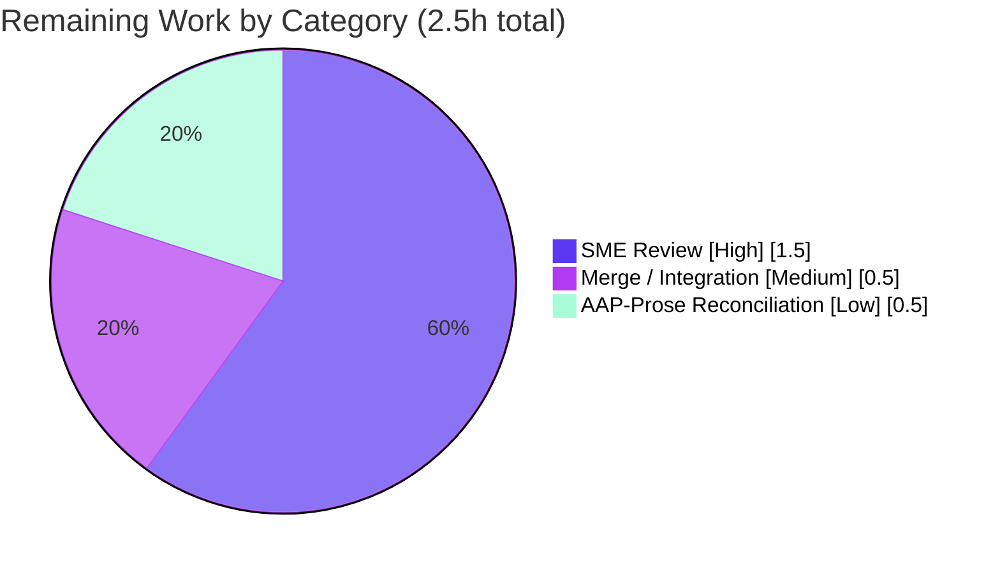

# Blitzy Project Guide

**Project:** Scapy IPv4 Field Representation, Validation & Serialization — Read-Only Investigation
**Branch:** `blitzy-cc08c4fd-cc32-450e-be37-a01e185a1a8a` (base: `scapy_0925ada48540`)
**HEAD:** `fd4572288de6b014c91e3432708cbfc8fe92b49b`
**Task type:** Documentation (SWE-AtlasQnA-Repo, read-only Q&A)

---

## 1. Executive Summary

### 1.1 Project Overview

This project delivers an empirical, evidence-grounded answer document explaining how the Scapy codebase represents, validates, and serializes protocol header fields, with specific emphasis on the IPv4 destination address (`IP.dst`). Following a strict read-only "run first, then write" mandate, the work builds and runs real code paths to answer four discrete questions — serialized byte length and leading hex bytes, the runtime Python type of the destination field, invalid-input error timing and form, and a code trace of the responsible field class, conversion method, validation kind, and registry wiring. The sole deliverable is one Markdown document; no Scapy source file is modified. The audience is engineers seeking authoritative, reproducible internals documentation.

### 1.2 Completion Status



**Legend:** ▉ Dark Blue `#5B39F3` = Completed / AI Work · ▢ White `#FFFFFF` = Remaining / Not Completed

| Metric | Value |
|---|---|
| **Total Hours** | **26.0** |
| Completed Hours (AI + Manual) | 23.5 (AI: 23.5, Manual: 0.0) |
| Remaining Hours | 2.5 |
| **Percent Complete** | **90.4%** |

> Completion is computed with the PA1 AAP-scoped, hours-based formula: `Completed ÷ (Completed + Remaining) = 23.5 ÷ 26.0 = 90.4%`. It measures only work scoped by the Agent Action Plan plus standard path-to-production activities.

### 1.3 Key Accomplishments

- ✅ **Deliverable authored and committed** — `blitzy/documentation/scapy_0925ada48540.md` (910 lines, 48,503 bytes), named for the source branch as mandated.
- ✅ **All four requirements answered** (A1–A4), each with the exact producing command, complete unedited runtime output, `file:line` citations, and cause→effect reasoning.
- ✅ **Evidence-first methodology honored** — every behavioral claim reproduced by executing code against the in-place library, not inferred from reading.
- ✅ **Byte-for-byte runtime reproducibility** — probes A1–A4 re-run independently during assessment match the committed document with zero missing lines.
- ✅ **Read-only mandate upheld** — branch diff vs base is exactly one added file; the five referenced source modules are unchanged; working tree clean; probe scripts kept outside the tree and removed.
- ✅ **Regression clean** — `test/fields.uts` (138/138) and `test/scapy/layers/inet.uts` (54/54) pass with zero failures; compile gate on all five referenced modules exits 0.
- ✅ **Two autonomous corrections applied** (commit `fd457228`) — evidence-fidelity of the `CryptographyDeprecationWarning` text and `DestIPField.i2h` citation precision.

### 1.4 Critical Unresolved Issues

| Issue | Impact | Owner | ETA |
|---|---|---|---|
| _None_ — no unresolved issues block release or validation | — | — | — |

All four AAP requirements are fully answered and validated; there are no failing tests, no compilation errors, and no missing deliverable content.

### 1.5 Access Issues

| System/Resource | Type of Access | Issue Description | Resolution Status | Owner |
|---|---|---|---|---|
| — | — | No access issues identified | N/A | — |

The task required only local, in-tree execution of a pure-Python library. No repository permissions, service credentials, or third-party API access were required or blocked.

### 1.6 Recommended Next Steps

1. **[High]** Human SME review of `blitzy/documentation/scapy_0925ada48540.md` — read the document end-to-end and confirm A1–A4 answers, spot-checking 5–10 of the `file:line` citations against source. (~1.5h)
2. **[Medium]** Merge/integrate the branch into the target line once review passes. (~0.5h)
3. **[Low]** _Optional_ — reconcile stale environment values in the AAP prose (`Python 3.12.3` / `scapy 2026.07.07`) with the correct current values already reflected in the delivered document (`3.13.7` / `2026.07.08`). Documentation-narrative only; not a deliverable gap. (~0.5h)

---

## 2. Project Hours Breakdown

### 2.1 Completed Work Detail

| Component | Hours | Description |
|---|---:|---|
| Environment setup & version banner | 1.5 | Establish canonical in-place import (`from scapy.all import IP`), `.venv` with editable scapy + cryptography, confirm version banner `2026.07.08` — grounds all evidence [AAP A0/prereq]. |
| A1 — build & serialize investigation | 2.5 | Construct `IP(dst,ttl,flags)`, serialize with `raw()`, capture 20-byte length + `45 00 00 14`; separate deterministic vs host-dependent bytes [AAP A1]. |
| A2 — runtime type investigation | 1.5 | Access `pkt.dst`, capture `type()` as `str`, distinguish field value type from field object class [AAP A2]. |
| A3 — invalid-input behavior investigation | 3.0 | Exercise `999.999.999.999` and `not.an.ip` at packet level (`gaierror`) and field level (`OSError`); pin down assignment-time timing and both exception surfaces [AAP A3]. |
| A4 — code trace | 4.0 | Trace `IPField`/`DestIPField`, `i2m` conversion, `inet_aton` validation, and the two-fold registry wiring (`register_owner`, `conf.layers`) with introspection evidence [AAP A4]. |
| Answer-document assembly | 2.5 | Compose the 910-line Markdown narrative: env banner, four requirement sections, code-trace section, cause→effect prose [AAP deliverable]. |
| Evidence appendix | 1.5 | Embed temporary probe scripts and complete unedited captured output for every condition [AAP evidence fidelity]. |
| Citation grounding & verification | 2.0 | Establish and verify 107 `file:line` references across 7 files against current source [AAP grounding]. |
| Read-only compliance discipline | 0.5 | Keep probes under `/tmp` outside the tree; verify clean working tree; remove scripts [AAP read-only]. |
| Code-review iterations | 2.0 | Address review findings across commits `418f8fad`, `7d9676d7` (validation-kind correction) [path-to-production]. |
| Final validation | 2.0 | Re-run all probes byte-for-byte; run `fields.uts`/`inet.uts`; compile gate on 5 modules [path-to-production]. |
| Evidence-fidelity + citation-precision fixes | 0.5 | Commit `fd457228`: full warning text (16 occurrences) + `DestIPField.i2h` 515-517→515-518 [path-to-production]. |
| **Total Completed** | **23.5** | Matches Completed Hours in Section 1.2. |

### 2.2 Remaining Work Detail

| Category | Hours | Priority |
|---|---:|---|
| Human SME review of deliverable (verify A1–A4, spot-check citations) — path-to-production | 1.5 | High |
| Branch merge / integration — path-to-production | 0.5 | Medium |
| Optional reconciliation of stale env values in AAP prose (narrative-only) — path-to-production | 0.5 | Low |
| **Total Remaining** | **2.5** | Matches Remaining Hours in Section 1.2 and Section 7 pie. |

### 2.3 Reconciliation

- Section 2.1 total **23.5h** + Section 2.2 total **2.5h** = **26.0h** = Total Project Hours (Section 1.2). ✔
- Completion = 23.5 ÷ 26.0 = **90.4%** (Section 1.2). ✔
- Section 2.2 remaining (2.5h) is identical to Section 1.2 Remaining Hours and Section 7 "Remaining Work". ✔

---

## 3. Test Results

All tests below originate from Blitzy's autonomous validation logs for this project and were re-confirmed during assessment. Because this is a read-only documentation task, "tests" comprise (a) the runtime observation probes that produce the documented evidence and (b) the project's own regression suites relevant to the investigated code paths, plus the compile gate.

| Test Category | Framework | Total Tests | Passed | Failed | Coverage % | Notes |
|---|---|---:|---:|---:|---:|---|
| Runtime evidence probes (A1, A2, A3-packet, A3-field, A4, inet_aton leniency) | Python 3.13.7 / scapy 2026.07.08 | 6 | 6 | 0 | — | Reproduce byte-for-byte; A3 paths exit 1 by design (exceptions are the observed result). |
| Field unit suite (`test/fields.uts`) | UTscapy | 138 | 138 | 0 | — | Exit 0; exercises `IPField`/`Field` conversion contract. |
| IPv4 layer suite (`test/scapy/layers/inet.uts`) | UTscapy | 54 | 54 | 0 | — | Exit 0; `Passed=54 Failed=0`, "UTscapy ended successfully". |
| Compile gate (5 referenced modules) | CPython `py_compile` | 5 | 5 | 0 | — | fields.py, inet.py, base_classes.py, packet.py, config.py — all exit 0. |
| **Total** | — | **203** | **203** | **0** | — | **100% pass rate.** |

> Coverage percentages are not reported: no coverage instrumentation was in scope for a read-only Q&A task, and the source tree is intentionally unmodified. Test integrity: every row derives from Blitzy's autonomous execution logs on this branch.

---

## 4. Runtime Validation & UI Verification

**Runtime health (canonical path `PYTHONPATH=. python3`, `.venv`):**

- ✅ **Operational** — Import: `from scapy.all import IP` succeeds; version banner reports `2026.07.08` (emits only the benign `CryptographyDeprecationWarning` for TripleDES).
- ✅ **Operational** — **A1**: `raw(IP(dst="93.184.216.34", ttl=55, flags="DF"))` → length **20**, leading bytes **`45 00 00 14`** (deterministic); source/checksum host-dependent and flagged as such.
- ✅ **Operational** — **A2**: `type(pkt.dst)` → `<class 'str'>`; default `IP().dst` → `'127.0.0.1'` (also `str`).
- ✅ **Operational** — **A3 (packet-level)**: `IP(dst="999.999.999.999")` and `IP(dst="not.an.ip")` raise `socket.gaierror: [Errno -2] Name or service not known` at construction (exit 1, as documented).
- ✅ **Operational** — **A3 (field-level)**: `IPField("x", None).i2m(None, "999.999.999.999")` raises `OSError: illegal IP address string passed to inet_aton` (exit 1, as documented).
- ✅ **Operational** — **A4**: introspection confirms `IPField.__bases__ == ['Field']`; `DestIPField.__mro__` includes `IPField`; `i2m(None,'1.2.3.4')` → `b'\x01\x02\x03\x04'`; `dst` owners `['IP','IPerror','IPv46']`; `IP in conf.layers` → `True`.

**API integration:** ⚠ Not applicable — no external services or network I/O are in scope (the only socket activity is the incidental `getaddrinfo` internally triggered by the invalid-address hostname fallback).

**UI verification:** ⚠ Not applicable — the deliverable is a Markdown document; there is no user interface, component, or frontend to verify.

---

## 5. Compliance & Quality Review

Cross-mapping AAP deliverables and rules to quality/compliance benchmarks. Progress: 🟦 = complete.

| # | AAP / Rule Benchmark | Status | Progress | Evidence |
|---|---|---|---|---|
| 1 | Deliverable at mandated path `blitzy/documentation/scapy_0925ada48540.md` | Pass | 🟦 100% | File present, 910 lines, 48,503 bytes; named for source branch. |
| 2 | A1 — total byte length + first hex bytes answered | Pass | 🟦 100% | 20 bytes; `45 00 00 14`; grounded in `IP.post_build` (inet.py:539-551). |
| 3 | A2 — runtime Python type of `dst` answered | Pass | 🟦 100% | `str` via `IPField.i2h` (fields.py:816). |
| 4 | A3 — invalid-input timing and form answered | Pass | 🟦 100% | Assignment-time `gaierror` (packet) + `OSError` (field). |
| 5 | A4 — field class, conversion method, validation kind, registry role | Pass | 🟦 100% | `IPField`/`DestIPField`, `i2m`→`inet_aton`, `register_owner`, `conf.layers`. |
| 6 | "Run first, then write" methodology | Pass | 🟦 100% | Every claim reproduced byte-for-byte from live execution. |
| 7 | Complete, unedited output + producing command per condition | Pass | 🟦 100% | Evidence appendix embeds scripts and full captured output. |
| 8 | Exact grounding (`file:line` + specific class/method) | Pass | 🟦 100% | 107 refs across 7 files; 9/9 spot-checked. |
| 9 | Both happy path and error/edge path exercised | Pass | 🟦 100% | Valid dst + two malformed dsts + direct `i2m`. |
| 10 | Read-only: no source file modified/added/deleted | Pass | 🟦 100% | Diff vs base = 1 added file; 5 modules unchanged; tree clean. |
| 11 | Temporary scripts removed; tree clean afterward | Pass | 🟦 100% | Probes under `/tmp/scapy_probe*`, removed; `git status` empty. |
| 12 | Evidence fidelity of captured warning text (fix) | Pass | 🟦 100% | Commit `fd457228` restored full cryptography-49.0.0 text (16 lines). |
| 13 | Citation precision (fix) | Pass | 🟦 100% | `DestIPField.i2h` corrected 515-517 → 515-518. |

**Fixes applied during autonomous validation:** evidence-fidelity of the `CryptographyDeprecationWarning` string and one citation-range correction (both in commit `fd457228`, deliverable-only). **Outstanding compliance items:** none.

---

## 6. Risk Assessment

| Risk | Category | Severity | Probability | Mitigation | Status |
|---|---|---|---|---|---|
| R1 — Host-dependent bytes (source address, checksum) could be misread as deterministic | Technical | Low | Low | Document explicitly flags src/checksum as host-routing-dependent; only length + first four bytes claimed deterministic | Mitigated |
| R2 — Date-based version drift (`2026.07.08`) makes future line numbers diverge | Technical | Low | Medium | All 107 citations verified against this exact checkout; version banner captured | Mitigated |
| R3 — Stdlib traceback frames in A3 output vary by Python patch level | Technical | Low | Low | Frames captured verbatim for 3.13.7; exception class/message (the load-bearing facts) are stable | Mitigated |
| R4 — Invalid-address path triggers an incidental DNS `getaddrinfo` lookup | Security | Informational | Low | Behavior documented as Scapy's `Net` hostname fallback; no data exfiltration; no code change | Accepted |
| R5 — Reproduction depends on canonical `PYTHONPATH=. python3` + `.venv` cryptography 49.0.0 | Operational | Low | Low | Development Guide (Section 9) specifies exact invocation and the warning-text nuance | Mitigated |
| R6 — Deliverable pending human SME sign-off | Operational | Low | High | Section 1.6 / Section 2.2 schedule 1.5h review task | Open |
| R7 — Branch merge/integration into target line | Integration | Low | Medium | 0.5h merge task; diff is a single additive file (low conflict risk) | Open |

**Overall risk posture: LOW.** No technical or security risk blocks release; the only open items are routine human review and merge.

---

## 7. Visual Project Status

### 7.1 Project Hours Breakdown



**Legend:** ▉ `#5B39F3` Completed · ▢ `#FFFFFF` Remaining (violet-black `#B23AF2` stroke keeps the white slice visible).

### 7.2 Remaining Hours by Category



> Integrity: the "Remaining Work" value (2.5h) equals Section 1.2 Remaining Hours and the sum of Section 2.2's Hours column; the three categories above sum to exactly 2.5h.

---

## 8. Summary & Recommendations

**Achievements.** The project is **90.4% complete** on an AAP-scoped, hours basis (23.5h of 26.0h). The single mandated deliverable — `blitzy/documentation/scapy_0925ada48540.md` — is authored, committed, and fully validated. All four requirements are answered directly and grounded in reproducible runtime evidence: **A1** (20-byte header, leading `45 00 00 14`), **A2** (`dst` is a built-in `str`), **A3** (invalid destinations fail at construction time — `socket.gaierror` at packet level, `OSError` from `inet_aton` at field level), and **A4** (`IPField`/`DestIPField`, `i2m`→`inet_aton` conversion, `inet_aton`-delegated validation, and two-fold registry participation via `register_owner` and `conf.layers`).

**Remaining gaps.** The outstanding 2.5h is entirely human/path-to-production: SME review (1.5h), branch merge (0.5h), and an optional documentation-narrative reconciliation of stale environment values in the AAP prose (0.5h). None are engineering defects — there are no failing tests, no compile errors, and no missing content.

**Critical path to production.** SME review → merge. The optional reconciliation can proceed in parallel or be skipped without affecting the deliverable's correctness.

**Success metrics.** 203/203 checks pass (6 runtime probes, 138 `fields.uts`, 54 `inet.uts`, 5 compile); 107 citations (9/9 spot-checked); read-only mandate provably honored (single additive file, five source modules byte-for-byte unchanged, clean tree).

**Production-readiness assessment.** **Ready for human review and merge.** Risk posture is LOW; the deliverable meets every AAP requirement and rule with high confidence.

| Metric | Value |
|---|---|
| AAP-scoped completion | 90.4% |
| Completed / Remaining / Total hours | 23.5 / 2.5 / 26.0 |
| Autonomous checks passed | 203 / 203 (100%) |
| Source files modified | 0 (read-only mandate honored) |
| Blocking issues | 0 |

---

## 9. Development Guide

This guide reproduces the documented evidence and verifies the deliverable. All commands were tested during assessment.

### 9.1 System Prerequisites

- **OS:** Linux/macOS (assessment host: Ubuntu 25.10 container).
- **Python:** CPython within Scapy's supported range `>=3.7, <4` [scapy/pyproject.toml:L17]; canonical assessment interpreter **3.13.7**.
- **Git** (for read-only verification) and standard build tooling.
- **Optional:** `cryptography` (49.0.0 used here) — only affects an unrelated import-time warning; not required for the IPv4-field question.

### 9.2 Environment Setup

```bash
# From the repository root
cd /path/to/scapy-repo

# Create and activate a virtual environment (recommended)
python3 -m venv .venv
source .venv/bin/activate
```

### 9.3 Dependency Installation

```bash
# Install Scapy in-place (editable) so imports resolve from the tree
pip install -e .

# Optional extra used in the canonical environment (drives the exact warning text)
pip install "cryptography==49.0.0"
```

> **Note (canonical reproduction):** the committed evidence appendix reproduces the **full** `CryptographyDeprecationWarning` text emitted by cryptography **49.0.0** under the `.venv`. A system Python with an older cryptography emits an abbreviated warning; use the `.venv` path to reproduce byte-for-byte. A bare `import scapy` does **not** emit the warning — only `from scapy.all import ...` does.

### 9.4 Application Startup / Canonical Invocation

There is no long-running service. The "application" is the interactive library, invoked canonically as:

```bash
# From the repository root
PYTHONPATH=. python3
# (equivalently, the ./run_scapy launcher)
```

### 9.5 Verification Steps

```bash
# 1) Version banner (expect: 2026.07.08)
PYTHONPATH=. python3 -c "import scapy; print(scapy.VERSION)"

# 2) A1 + A2 — length, leading hex, and runtime type
PYTHONPATH=. python3 - <<'PY'
from scapy.all import IP, raw
pkt = IP(dst="93.184.216.34", ttl=55, flags="DF")
b = raw(pkt)
print("len:", len(b))                       # -> 20
print("first4:", " ".join(f"{x:02x}" for x in b[:4]))  # -> 45 00 00 14
print("full hex:", b.hex())                 # src/checksum are host-dependent
print("type(pkt.dst):", type(pkt.dst))      # -> <class 'str'>
print("default IP().dst:", repr(IP().dst))  # -> '127.0.0.1'
PY

# 3) A3 (packet-level) — expect socket.gaierror at CONSTRUCTION (exit 1)
PYTHONPATH=. python3 -c "from scapy.all import IP; IP(dst='999.999.999.999')" ; echo "exit=$?"

# 4) A3 (field-level) — expect OSError from inet_aton (exit 1)
PYTHONPATH=. python3 -c "from scapy.fields import IPField; IPField('x',None).i2m(None,'999.999.999.999')" ; echo "exit=$?"

# 5) A4 — registry / class introspection
PYTHONPATH=. python3 - <<'PY'
from scapy.fields import IPField
from scapy.layers.inet import IP, DestIPField
from scapy.config import conf
print("IPField bases:", [c.__name__ for c in IPField.__bases__])
print("DestIPField mro:", [c.__name__ for c in DestIPField.__mro__])
print("i2m 1.2.3.4:", IPField('x',None).i2m(None,'1.2.3.4'))   # b'\x01\x02\x03\x04'
print("i2m None  :", IPField('x',None).i2m(None,None))         # b'\x00\x00\x00\x00'
dst = [f for f in IP.fields_desc if f.name=='dst'][0]
print("dst owners:", [o.__name__ for o in dst.owners])          # ['IP','IPerror','IPv46']
print("IP in conf.layers:", IP in conf.layers)                  # True
PY

# 6) Regression suites (expect Failed=0, exit 0)
PYTHONPATH=. python3 -m scapy.tools.UTscapy -t test/fields.uts
PYTHONPATH=. python3 -m scapy.tools.UTscapy -t test/scapy/layers/inet.uts

# 7) Read-only verification (working tree must stay clean; diff = 1 added file)
git status --porcelain                                  # expect empty
git diff 0925ada485406684174d6f068dbd85c4154657b3 HEAD --name-status
#   expect exactly: A  blitzy/documentation/scapy_0925ada48540.md
```

### 9.6 Example Usage

```bash
# Read the delivered answer document
PYTHONPATH=. python3 -c "print(open('blitzy/documentation/scapy_0925ada48540.md').read()[:1200])"
```

### 9.7 Troubleshooting

- **`ModuleNotFoundError: scapy`** — run from the repository root with `PYTHONPATH=.` (or `pip install -e .`).
- **A3 shows exit code 1** — this is expected: the malformed-address cases raise by design; the exception *is* the answer.
- **Warning text differs from the appendix** — you are likely on a system Python with an older `cryptography`. Activate the `.venv` with `cryptography==49.0.0` to reproduce the full text; or ignore, as it does not affect the IPv4-field answers.
- **Different `src`/checksum bytes in A1** — expected and documented: those bytes are host-routing-dependent. Only the 20-byte length and the first four bytes (`45 00 00 14`) are deterministic.
- **`git diff` "ambiguous argument"** — use the full base commit hash `0925ada485406684174d6f068dbd85c4154657b3` rather than the branch-name `..` range.

---

## 10. Appendices

### A. Command Reference

| Purpose | Command |
|---|---|
| Version banner | `PYTHONPATH=. python3 -c "import scapy; print(scapy.VERSION)"` |
| Build & serialize (A1) | `raw(IP(dst="93.184.216.34", ttl=55, flags="DF"))` |
| Runtime type (A2) | `type(IP(dst="93.184.216.34").dst)` |
| Invalid dst, packet (A3) | `IP(dst="999.999.999.999")` |
| Invalid dst, field (A3) | `IPField('x',None).i2m(None,"999.999.999.999")` |
| Field suite | `python3 -m scapy.tools.UTscapy -t test/fields.uts` |
| IPv4 layer suite | `python3 -m scapy.tools.UTscapy -t test/scapy/layers/inet.uts` |
| Read-only check | `git status --porcelain` |

### B. Port Reference

Not applicable — no network service, listener, or bound port is used or required by this task.

### C. Key File Locations

| Path | Role |
|---|---|
| `blitzy/documentation/scapy_0925ada48540.md` | **Deliverable** — the answer document (CREATE). |
| `scapy/fields.py` | REFERENCE — `Field`, `register_owner`, `addfield`, `IPField` (`h2i`/`i2m`/`m2i`/`any2i`). |
| `scapy/layers/inet.py` | REFERENCE — `DestIPField`, `IP`, `fields_desc`, `post_build`. |
| `scapy/base_classes.py` | REFERENCE — `Packet_metaclass`, `Field_metaclass`, `Net` DNS fallback. |
| `scapy/packet.py` | REFERENCE — assignment path (`any2i`), build driver (`self_build`/`build`). |
| `scapy/config.py` | REFERENCE — `LayersList`, `conf.layers`. |

### D. Technology Versions

| Component | Version | Notes |
|---|---|---|
| CPython | 3.13.7 | Within Scapy's `>=3.7, <4` range [pyproject.toml:L17]. |
| scapy | 2026.07.08 | In-place dev build; version is date-based via `attr="scapy.VERSION"` [pyproject.toml:L78]. |
| cryptography | 49.0.0 | Optional; drives the exact import-time warning text; unused by IPv4-field handling. |

### E. Environment Variable Reference

| Variable | Value | Purpose |
|---|---|---|
| `PYTHONPATH` | `.` | Resolve the in-place Scapy import from the repository root (canonical invocation). |

### F. Developer Tools Guide

| Tool | Use |
|---|---|
| `scapy.tools.UTscapy` | Runs the project's `.uts` unit-test campaigns (`fields.uts`, `inet.uts`). |
| `py_compile` / `compileall` | Compile gate over the five referenced modules (all exit 0). |
| `git diff <base_hash> HEAD --name-status` | Prove the read-only mandate — expect a single added deliverable file. |

### G. Glossary

| Term | Meaning |
|---|---|
| **A1–A4** | The four discrete AAP requirements (build/serialize; runtime type; invalid input; code trace). |
| **`IPField`** | Scapy field class for IPv4 addresses [fields.py:L796]. |
| **`DestIPField`** | `IP.dst`-specific subclass of `IPField` [inet.py:L503]. |
| **`i2m`** | "internal→machine" conversion; turns a Python value into on-the-wire bytes via `inet_aton`. |
| **`inet_aton`** | Stdlib IPv4 parser used for validation (lenient: accepts shorthand/octal). |
| **`Net`** | Scapy wrapper that treats an unparseable address as a hostname and attempts DNS resolution. |
| **`register_owner`** | Links a field instance to its owning packet classes (observed owners `['IP','IPerror','IPv46']`). |
| **`conf.layers`** | Global `LayersList` registry of packet classes [config.py:L265]. |
| **`post_build`** | `IP` hook that auto-fills `ihl`, total `len`, and `chksum` when left `None` [inet.py:L539-551]. |
| **AAP** | Agent Action Plan — the governing specification for this task. |

---

*Generated by the Blitzy Platform. Completion (90.4%) reflects only AAP-scoped and path-to-production work. Brand colors: Completed `#5B39F3`, Remaining `#FFFFFF`, accents `#B23AF2` / `#A8FDD9`.*