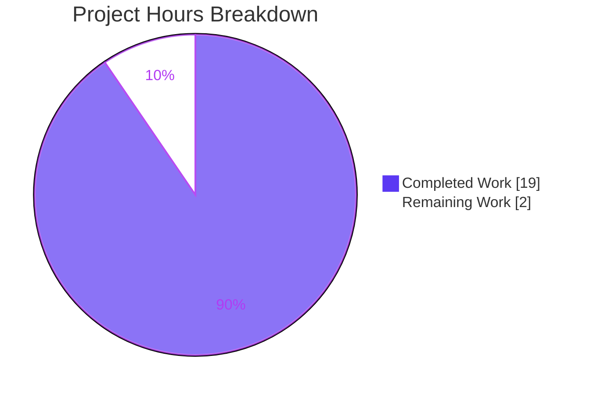
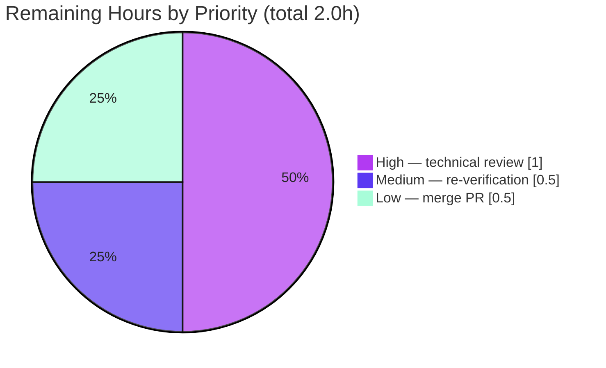

# Blitzy Project Guide — Scapy Ethernet Padding & EtherType Dispatch Investigation

> **Brand color legend (applied throughout):** Completed / AI Work = **Dark Blue `#5B39F3`** · Remaining / Not Completed = **White `#FFFFFF`** · Headings / Accents = **Violet-Black `#B23AF2`** · Highlight = **Mint `#A8FDD9`**.

---

## 1. Executive Summary

### 1.1 Project Overview

This project delivers a single, evidence-grounded Markdown answer document that investigates **how Scapy constructs Ethernet frames** — specifically its payload-padding behavior and its EtherType-based protocol dispatch. Targeted at engineers and reviewers working with the Scapy packet library, it answers eight decomposed sub-questions (Q1–Q8) by *building and running real packets first*, quoting the verbatim output, and grounding every code claim in an exact `file:line` citation. The task is a **strictly read-only investigation**: the Scapy source tree is never modified. Business impact is knowledge capture — a reusable, reproducible reference explaining exactly where and why Scapy makes its padding and dispatch decisions.

### 1.2 Completion Status


| Metric | Value |
|--------|-------|
| **Total Hours** | 21.0 |
| **Completed Hours (AI + Manual)** | 19.0  (AI: 19.0 · Manual: 0.0) |
| **Remaining Hours** | 2.0 |
| **Percent Complete** | **90.5%**  ( 19.0 ÷ 21.0 = 90.48% ) |

> Completion % is computed with the PA1 hours-based methodology over **AAP-scoped work only** (the answer document) plus minimal path-to-production (autonomous verification). There is no application to build or deploy.

### 1.3 Key Accomplishments

- ✅ **Deliverable authored** at the correct path/name: `blitzy/documentation/scapy_0925ada48540.md` (537 lines), named after the source branch.
- ✅ **All 8 sub-questions answered** (Q1–Q8), each with quoted output + exact `file:line` citation.
- ✅ **Run-first methodology honored** — packets built and run first; the full observation script and its verbatim output are embedded.
- ✅ **Empirical evidence independently reproduced** — 15/15 documented values match exactly.
- ✅ **21/21 `file:line` citations verified exact** against source at commit `0925ada4854`.
- ✅ **User examples preserved verbatim** — "like 10 bytes", "0x9000 or something random", `Ether(raw(packet))`.
- ✅ **Read-only constraint upheld** — Scapy source byte-for-byte unchanged; no `egg-info`; temp scripts confined to `/tmp` and removed.
- ✅ **Background research included** — the 64 / 60 / 46-byte minimum-frame convention (IEEE 802.3) explaining *why* padding is a NIC/hardware concern, not a Scapy build-time one.
- ✅ **Autonomous correction applied** — `src` MAC re-characterized from "random per run" to the NIC hardware MAC (commit `304a6c64`), with two new verified citations.

### 1.4 Critical Unresolved Issues

| Issue | Impact | Owner | ETA |
|-------|--------|-------|-----|
| _None._ No blocking or release-critical issues. Every AAP requirement is delivered and independently verified. | — | — | — |

### 1.5 Access Issues

| System/Resource | Type of Access | Issue Description | Resolution Status | Owner |
|-----------------|----------------|-------------------|-------------------|-------|
| _n/a_ | _n/a_ | **No access issues identified.** The investigation needs only a Python interpreter and the Scapy source tree (no external services, credentials, or third-party packages). | Resolved (N/A) | — |

### 1.6 Recommended Next Steps

1. **[High]** Perform a human technical review of the answer document — confirm all 8 sub-questions are correctly and completely answered and prose matches the verbatim output block (≈1.0h).
2. **[Medium]** Independently re-verify — re-run the embedded observation script and spot-check ~5 of the 21 citations at commit `0925ada4854` (≈0.5h). Expect the `src` MAC to differ by machine (documented).
3. **[Low]** Merge the PR — confirm the net diff is only the new document and that the Scapy source is untouched (≈0.5h).
4. **[Low · optional, out-of-scope]** Consider a lightweight doc-lint/pytest guard that re-runs the observation assertions to catch future source drift (not part of the AAP read-only scope; 0 counted hours).

---

## 2. Project Hours Breakdown

### 2.1 Completed Work Detail

| Component | Hours | Description |
|-----------|-------|-------------|
| Empirical investigation & run-first evidence capture (Q1–Q5) | 4.0 | Built the 3 test packets, ran the payload-size sweeps, round-trip and unknown-EtherType cases; captured verbatim console output. |
| Source-code analysis & exact `file:line` citations (Q6–Q8) | 3.5 | Deep reading of 8 source modules to locate build/dissect/dispatch/fallback logic; pinned all 21 exact locators. |
| Answer document authoring (Q1–Q8) | 4.5 | Wrote the 537-line document: per-question answers, rationale, code-level explanations, and the coverage pass. |
| Ethernet 64/60/46 minimum-frame background research | 1.5 | Web research on the minimum-frame convention (IEEE 802.3) and authoring of the §Background section explaining NIC-side padding. |
| Run-first methodology & user-example fidelity | 1.0 | Verbatim quoting discipline, embedding the observation script, isolated-environment setup, and read-only hygiene. |
| Review-findings iteration (commit `076acc8f`) | 1.5 | Addressed review findings (+61/−17) sharpening answers and citations. |
| `src` MAC root-cause correction (commit `304a6c64`) | 1.5 | Investigated `SourceMACField` → `get_if_hwaddr()`, corrected 5 prose spots, added citations `l2.py:186-207` & `:247` (+23/−11). |
| Autonomous validation (empirical + citations + markdown + read-only) | 1.5 | Reproduced 15/15 values, verified 21/21 citations, validated markdown formatting and read-only compliance. |
| **Total Completed** | **19.0** | Matches Completed Hours in Section 1.2. |

### 2.2 Remaining Work Detail

| Category | Hours | Priority |
|----------|-------|----------|
| Human technical review of the answer document (verify Q1–Q8 correctness/completeness, prose accuracy) | 1.0 | High |
| Independent re-verification (re-run observation script + spot-check citations in reviewer env) | 0.5 | Medium |
| Merge PR to target branch | 0.5 | Low |
| **Total Remaining** | **2.0** | Matches Remaining Hours in Section 1.2 and Section 7. |

> **Out-of-scope enhancements (0 counted hours, excluded from the 2.0h total):** (a) add a CI doc-lint/pytest guard against source drift; (b) broaden the investigation to additional layers (Dot1Q/802.1Q, Dot3/LLC). Both are outside the AAP read-only Q&A scope.

### 2.3 Totals & Completion Summary

| Roll-up | Hours | Cross-Check |
|---------|-------|-------------|
| Completed (Section 2.1 total) | 19.0 | = Section 1.2 Completed |
| Remaining (Section 2.2 total) | 2.0 | = Section 1.2 Remaining = Section 7 "Remaining Work" |
| **Total Project Hours** | **21.0** | 19.0 + 2.0 = 21.0 (= Section 1.2 Total) |
| **Percent Complete** | **90.5%** | 19.0 ÷ 21.0 = 90.48% |

---

## 3. Test Results

For a read-only Markdown deliverable there are no traditional unit tests to author; the repository's own UTScapy suite is **out-of-scope** (read-only, not exercised). The applicable validations are **Blitzy's autonomous checks** — empirical reproduction and citation accuracy — all sourced from Blitzy's autonomous validation logs for this project and independently re-confirmed during this assessment.

| Test Category | Framework | Total Tests | Passed | Failed | Coverage % | Notes |
|---------------|-----------|-------------|--------|--------|------------|-------|
| Empirical Reproduction (run-first) | Python 3.11 + Scapy observation script | 15 | 15 | 0 | 100% | Q1 summary+len 54; Q2b len 24; Q2c <60 True; Q5 sweep (6→60); Q5b (46→60, 47→61); Q3 self-built no Padding; Q3b padded `load=b'\x00\x00\x00\x00'` len 4 + re-serialize 60; Q4 repr + Raw fallback; `conf.padding=1`; `raw()==bytes()`. |
| Source Citation Accuracy | `grep`/`sed` vs source @ `0925ada4854` | 21 | 21 | 0 | 100% | All unique `file:line` locators exact (packet.py ×9, l2.py ×6, inet.py, inet6.py, config.py, compat.py, data.py, fields.py). |
| Markdown Structure & Quality | Text validation | 5 | 5 | 0 | 100% | 20 balanced fences; 8 Q-headings; user examples verbatim; 0 placeholders; UTF-8 / pure-LF / trailing newline. |
| Read-Only Compliance | Git | 4 | 4 | 0 | 100% | Source-tree SHA identical before/after; `git status` clean; no `egg-info`; temp scripts removed. |
| **Total** | — | **45** | **45** | **0** | **100%** | Zero failures across all autonomous validation checks. |

> **Integrity note (Rule 3):** every test above originates from Blitzy's autonomous validation logs for this project and was independently reproduced during this assessment.

---

## 4. Runtime Validation & UI Verification

**Runtime health** (the "runtime" here is the packet-building observation script):

- ✅ **Operational** — Scapy imports cleanly from the source tree (`scapy.VERSION = 2026.07.01`) with no install and no `PYTHONPATH` needed in the `.venv`.
- ✅ **Operational** — Observation script runs end-to-end and reproduces the documented output (15/15 values).
- ✅ **Operational** — Runtime `conf` defaults match the document: `conf.padding = 1`, `conf.raw_layer = Raw`, `conf.padding_layer = Padding`.
- ✅ **Operational** — Read-only integrity: Scapy source byte-for-byte unchanged after execution; working tree clean.
- ⚠ **Partial (benign, expected)** — Scapy emits `WARNING: Mac address to reach destination not found. Using broadcast.` to stderr (no route to default destination) and may emit a `CryptographyDeprecationWarning` from the optional IPsec layer. Neither affects the serialized bytes or any answer; both are documented.

**API integration:** ❌ Not applicable — no external services, APIs, or network calls; L2/L3 packet building is entirely in-memory.

**UI verification:** ❌ Not applicable — this is a documentation deliverable with **no user interface**; no browser/screenshot verification is relevant.

---

## 5. Compliance & Quality Review

Cross-mapping of AAP deliverables and governing-rule requirements to their verification status. Fixes applied during autonomous validation are noted.

| Requirement / Benchmark | Status | Progress | Notes |
|-------------------------|--------|----------|-------|
| Deliverable at correct path & branch-derived name | ✅ Pass | 100% | `blitzy/documentation/scapy_0925ada48540.md` |
| Q1–Q8 fully answered | ✅ Pass | 100% | Each answer quotes output + cites source |
| Run-first methodology (build & run before writing) | ✅ Pass | 100% | Script + verbatim block; reproduced 15/15 |
| Verbatim evidence (no paraphrasing measured values) | ✅ Pass | 100% | Sizes/counts/errors quoted exactly |
| Exact `file:line` grounding | ✅ Pass | 100% | 21/21 citations verified |
| User examples preserved verbatim | ✅ Pass | 100% | "like 10 bytes" ×3, "0x9000 or something random" ×1, `Ether(raw(packet))` ×5 |
| Web-research background (64/60/46 min frame) | ✅ Pass | 100% | IEEE 802.3 cl.3 & 4.2.8 + secondary sources |
| Read-only source constraint | ✅ Pass | 100% | Source unchanged; only `blitzy/` added |
| Coverage pass (every sub-part addressed) | ✅ Pass | 100% | 8/8 confirmations in §Coverage |
| Zero placeholders / production-ready prose | ✅ Pass | 100% | 0 TODO/FIXME/stubs |
| Markdown well-formed | ✅ Pass | 100% | 20 balanced fences; UTF-8 / LF |
| **Human review & merge** | ⬜ Pending | 0% | Path-to-production gate (2.0h) |

**Fixes applied during autonomous validation**

- **Review-findings iteration** (`076acc8f`, +61/−17): tightened answers and citations after review.
- **`src` MAC re-characterization** (`304a6c64`, +23/−11): corrected the claim that the `src` MAC is "randomly generated per run" to the accurate explanation that it is the **NIC hardware MAC** resolved by `SourceMACField.i2h` → `get_if_hwaddr()` (stable per machine, differs across machines); added citations `scapy/layers/l2.py:186-207` and `:247`.

**Outstanding items:** only the human review + merge gate.

---

## 6. Risk Assessment

All risks are **Low** — appropriate for a read-only, fully-validated documentation deliverable. Each has a built-in mitigation, most of them documented within the deliverable itself.

| Risk | Category | Severity | Probability | Mitigation | Status |
|------|----------|----------|-------------|------------|--------|
| Environment-dependent `src` MAC in the verbatim output may confuse someone reproducing on a different machine | Technical | Low | Low | Document explicitly flags the `src` MAC as the NIC hardware MAC (env-dependent) in 3 places, with root-cause citations `l2.py:186-207`, `:247` | Mitigated |
| `scapy.VERSION` is git-date-derived (`2026.07.01`) and will differ on other checkouts | Technical | Low | Medium | Document discloses it as a variable token that does not affect any answer | Mitigated |
| Citation line numbers could drift against a different Scapy version | Technical | Low | Low | Document pins the exact commit `0925ada4854` (twice) as the citation baseline | Mitigated |
| No automated CI test guards the prose citations; future source changes could silently stale the doc | Operational | Low | Low | Commit-pinned citations; optional CI guard proposed as out-of-scope enhancement | Accepted |
| Reproducibility requires a Scapy source tree + Python environment | Operational | Low | Low | Development Guide (Section 9) provides exact, tested setup commands | Mitigated |
| Security exposure via the deliverable | Security | Low | Low | Secret scan of the document = 0 hits; no dependencies added; no code-execution/auth/data surface. (Ephemeral GitHub token in git remote config is Blitzy infrastructure, not present in any committed file.) | Mitigated |
| External integration failure | Integration | Low | Low | No external services/APIs/credentials; L2/L3 building needs no third-party packages; benign "no route → broadcast" warning documented | Mitigated |

---

## 7. Visual Project Status

**Project hours breakdown** (Completed = Dark Blue `#5B39F3`, Remaining = White `#FFFFFF`):



**Remaining work by priority** (totals the 2.0 remaining hours):



> **Integrity note (Rule 1):** the "Remaining Work" value (2) equals the Remaining Hours in Section 1.2 and the sum of the Section 2.2 "Hours" column. The priority pie sums to 2.0 (1.0 + 0.5 + 0.5).

---

## 8. Summary & Recommendations

**Achievements.** The project delivers a complete, evidence-grounded answer to how Scapy handles Ethernet payload padding and EtherType dispatch. All eight sub-questions (Q1–Q8) are answered with verbatim observed output and 21 exact `file:line` citations. The autonomous work has been independently re-validated during this assessment: **15/15** empirical values reproduce exactly and **21/21** citations are exact. The read-only constraint is fully upheld — the Scapy source is byte-for-byte unchanged and the only net change is the new document.

**Remaining gaps.** None functional. The only outstanding work is the standard human review + merge gate (2.0h), reflecting the honest principle that a deliverable is not "100%" until a human has reviewed and merged it.

**Critical path to production.** (1) Human technical review → (2) independent re-verification → (3) merge. No feature development, bug-fixing, configuration, or deployment work remains.

**Success metrics.**

| Metric | Result |
|--------|--------|
| Sub-questions answered | 8 / 8 |
| Empirical checks reproduced | 15 / 15 |
| Citations verified exact | 21 / 21 |
| Autonomous validation checks passing | 45 / 45 |
| Source files modified (must be 0) | 0 |
| Placeholders / TODOs | 0 |

**Production readiness assessment.** The deliverable is **production-ready pending human review**. At **90.5% complete** (19.0h of 21.0h), the remaining 9.5% is entirely the human review-and-merge gate. Confidence is **High**: the scope is tightly bounded (one document), the evidence is reproducible, and the citations are exact and commit-pinned.

---

## 9. Development Guide

This guide explains how to **reproduce the investigation** and verify the deliverable. Every command below was tested during this assessment. All commands assume you start at the repository root.

### 9.1 System Prerequisites

- **Python 3.11** (the AAP-documented target). The logic is pure-Python and interpreter-independent, so **3.12 / 3.13 also work** (verified).
- **git** (tested with 2.51.0).
- **No third-party packages** are required for Scapy L2/L3 packet building.

### 9.2 Environment Setup

Two equivalent options; **both keep the Scapy source read-only** (no install, no `egg-info`).

**Option A — use the repository's existing virtual environment:**

```bash
# From the repository root
.venv/bin/python -c "import scapy; print('scapy', scapy.VERSION, '->', scapy.__file__)"
# Expected: scapy 2026.07.01 -> <repo>/scapy/__init__.py  (imported from source; no PYTHONPATH needed)
```

**Option B — fresh environment importing Scapy from source via PYTHONPATH (the AAP idiom):**

```bash
# From the repository root
python3 -m venv /tmp/scapy_review_venv
/tmp/scapy_review_venv/bin/python -m pip install --upgrade pip
PYTHONPATH="$(pwd)" /tmp/scapy_review_venv/bin/python -c "import scapy; print('scapy', scapy.VERSION, '->', scapy.__file__)"
# Expected: scapy 2026.07.01 -> <repo>/scapy/__init__.py
```

> On Ubuntu 25.x the system Python is PEP 668 "externally-managed" — always use a venv (as above) rather than a global `pip install`. No packages are needed here regardless.

### 9.3 Dependency Installation

None required. Scapy's L2/L3 packet building uses only the standard library. (Optional extras such as `cryptography` are unrelated to this investigation.)

### 9.4 Reproduce the Observation ("startup")

Write the observation script **outside the repository** (in `/tmp`) to preserve the read-only constraint, then run it. The full script is embedded verbatim in the deliverable's "How this was observed" section.

```bash
# Create the probe OUTSIDE the repo
cat > /tmp/scapy_obs_probe.py <<'PY'
from scapy.all import Ether, IP, TCP, Raw, Padding, raw, conf
print("Ether/IP/TCP len =", len(raw(Ether()/IP()/TCP())))            # -> 54
print("Ether/Raw(10) len =", len(raw(Ether()/Raw(b"X"*10))))        # -> 24
orig = Ether()/IP()/TCP()/Raw(b"X"*10)
rt = Ether(raw(orig))
print("round-trip has Padding? ->", rt.haslayer(Padding))            # -> 0
base = Ether()/IP()/TCP()/Raw(b"X"*2)
padded = raw(base) + b"\x00" * (60 - len(raw(base)))
rt2 = Ether(padded)
print("padded round-trip Padding? ->", bool(rt2.haslayer(Padding)),  # -> True
      "load =", rt2.getlayer(Padding).load)                          # -> b'\x00\x00\x00\x00'
u = Ether(type=0x9000)/Raw(load=b"hello unknown ethertype payload")
print("repr:", repr(u))                                              # -> <Ether type=0x9000 |<Raw ...|>>
print("conf.padding =", conf.padding)                                # -> 1
PY

# Run it (Option A shown; for Option B prefix with PYTHONPATH="$(pwd)")
.venv/bin/python /tmp/scapy_obs_probe.py
```

### 9.5 Verification Steps

```bash
# 1) conf defaults referenced by the document
.venv/bin/python -c "from scapy.all import conf; print(conf.padding, conf.raw_layer.__name__, conf.padding_layer.__name__)"
# Expected: 1 Raw Padding

# 2) Read-only integrity — the working tree must be clean
git status --porcelain            # Expected: (no output)

# 3) Source untouched vs base — must be empty (only blitzy/ changed)
git diff --name-only origin/scapy_0925ada48540...HEAD -- ':(exclude)blitzy/**'   # Expected: (no output)

# 4) Net change is exactly the new document
git diff --name-status origin/scapy_0925ada48540...HEAD                          # Expected: A  blitzy/documentation/scapy_0925ada48540.md

# 5) Spot-check a citation (e.g., extract_padding default returns (s, None))
sed -n '982,990p' scapy/packet.py

# 6) Markdown quick checks
F=blitzy/documentation/scapy_0925ada48540.md
grep -c '^```' "$F"               # Expected: 20 (balanced)
grep -cE '^### Q[1-8] ' "$F"      # Expected: 8
```

### 9.6 Example Usage

```bash
.venv/bin/python - <<'PY'
from scapy.all import Ether, IP, TCP, Raw, raw
print("Ether/IP/TCP        =", len(raw(Ether()/IP()/TCP())))          # 54
print("Ether/Raw(10)       =", len(raw(Ether()/Raw(b'X'*10))))        # 24
print("Ether/IP/TCP/Raw(6) =", len(raw(Ether()/IP()/TCP()/Raw(b'X'*6))))  # 60 (14+20+20+6, not padding)
PY
```

### 9.7 Troubleshooting

- **`WARNING: Mac address to reach destination not found. Using broadcast.`** — Expected; there is no route to the default destination. `dst` resolves to `ff:ff:ff:ff:ff:ff`. Does not affect serialized bytes or any answer.
- **`CryptographyDeprecationWarning` on import** — From the optional IPsec layer; unrelated to Ethernet building; safe to ignore.
- **`src` MAC differs from the document's verbatim block** — Expected. It is the **NIC hardware MAC** of the outgoing interface (stable per machine, differs across machines). Every other token is stable.
- **`scapy.VERSION` differs** — It is git-date-derived and varies by checkout date; it does not affect any answer.
- **`error: externally-managed-environment` from pip** — You attempted a global install on Ubuntu 25.x. Use a venv (Section 9.2). No packages are needed here anyway.

---

## 10. Appendices

### A. Command Reference

| Purpose | Command |
|---------|---------|
| Import Scapy from source (existing venv) | `.venv/bin/python -c "import scapy; print(scapy.VERSION)"` |
| Import Scapy from source (fresh, PYTHONPATH) | `PYTHONPATH="$(pwd)" python3 -c "import scapy; print(scapy.VERSION)"` |
| Run the observation probe | `.venv/bin/python /tmp/scapy_obs_probe.py` |
| Check runtime conf defaults | `.venv/bin/python -c "from scapy.all import conf; print(conf.padding, conf.raw_layer.__name__, conf.padding_layer.__name__)"` |
| Verify working tree clean | `git status --porcelain` |
| Verify source untouched vs base | `git diff --name-only origin/scapy_0925ada48540...HEAD -- ':(exclude)blitzy/**'` |
| List net change | `git diff --name-status origin/scapy_0925ada48540...HEAD` |
| Balanced-fence check | `grep -c '^\`\`\`' blitzy/documentation/scapy_0925ada48540.md` |

### B. Port Reference

**Not applicable.** The investigation builds packets in memory; it starts no servers and binds no network ports.

### C. Key File Locations

| Path | Role |
|------|------|
| `blitzy/documentation/scapy_0925ada48540.md` | **The deliverable** — Q1–Q8 answer document (537 lines). |
| `scapy/packet.py` | Build/dissect engine: `build` (746-756), `build_padding` (742-744), `extract_padding` (982-990), `do_dissect_payload` (1023-1047), `dissect` (1049-1060), `guess_payload_class` (1062-1079), `default_payload_class` (1081-1090), `Raw` (1877-1903), `Padding` (1906-1918). |
| `scapy/layers/l2.py` | `Ether` class/fields (244-248), `SourceMACField` (186-207, 247), `dispatch_hook` (266-272), `Dot3.extract_padding` (275-284), `bind_layers` table (686-716). |
| `scapy/layers/inet.py` | `bind_layers(Ether, IP, type=2048)` (1101). |
| `scapy/layers/inet6.py` | `bind_layers(Ether, IPv6, type=0x86dd)` (4083). |
| `scapy/config.py` | `conf.padding = 1` (787). |
| `scapy/compat.py` | `raw(x)` → `bytes(x)` (112-118). |
| `scapy/data.py` | `ETHER_TYPES = load_ethertypes(None)` (526). |
| `scapy/fields.py` | `XShortEnumField` (2660). |

### D. Technology Versions

| Component | Version | Notes |
|-----------|---------|-------|
| Scapy (under investigation) | `2026.07.01` | Imported from source tree at commit `0925ada485406684174d6f068dbd85c4154657b3`; git-date-derived version string. |
| Python (AAP documented target) | 3.11 | Highest explicitly supported target per `tox.ini` / CI. |
| Python (`.venv` used) | 3.11.13 | Repository virtual environment. |
| Python (system, also verified) | 3.13.7 | Logic is interpreter-independent; observations hold. |
| git | 2.51.0 | Used for diff/status verification. |

### E. Environment Variable Reference

| Variable | Value / Example | When Needed |
|----------|-----------------|-------------|
| `PYTHONPATH` | `"$(pwd)"` (repository root) | Only for the fresh-environment import approach (Option B). Not needed when using the repo `.venv`. |

_No application/runtime environment variables are required — there is no service to configure._

### F. Developer Tools Guide

- **Observation probe** — a one-shot Python script placed under `/tmp` (never inside the repo) that builds the packets and prints measured values. It is the primary evidence-gathering tool; the deliverable embeds its full source verbatim.
- **Git diff verification** — `git diff --name-status origin/scapy_0925ada48540...HEAD` confirms the isolated single-file change; `git diff ... -- ':(exclude)blitzy/**'` confirms the source tree is untouched.
- **Citation spot-checks** — `sed -n '<start>,<end>p' <source file>` renders any cited line range for verification against the document.

### G. Glossary

| Term | Meaning |
|------|---------|
| **EtherType** | The 2-byte `type` field of an Ethernet II frame identifying the next protocol (e.g., `0x0800`=IPv4, `0x86dd`=IPv6). Values `> 1500`; values `≤ 1500` are interpreted as an 802.3 length. |
| **Minimum frame (64 / 60 / 46)** | Ethernet's 64-byte minimum frame = 14-byte header + 46-byte minimum payload + 4-byte FCS. Excluding the FCS (which Scapy does not emit), the on-wire minimum is 60 bytes. |
| **FCS** | Frame Check Sequence — the 4-byte CRC appended by hardware; not produced by Scapy. |
| **Padding (as a Scapy layer)** | A `Padding(Raw)` layer attached during **dissection** when trailing bytes remain and `conf.padding` is set; contributes nothing to the body on rebuild but re-emits its `load` at the frame's end. |
| **`Raw`** | Scapy's catch-all payload layer (`conf.raw_layer`); the fallback when no protocol binding matches. |
| **`build` / `dissect`** | `build` serializes a packet to bytes (header + payload, no min-frame padding); `dissect` parses bytes back into layers and may attach `Padding`. |
| **`bind_layers`** | Registers an EtherType→class mapping in the `payload_guess` table used by `guess_payload_class` for protocol dispatch. |
| **`raw(packet)`** | Equivalent to `bytes(packet)` — serializes a packet; the round-trip idiom is `Ether(raw(packet))`. |
| **Read-only constraint** | The governing rule that the Scapy source repository must remain byte-for-byte unchanged; only the answer document may be added. |

---

*Prepared by the Blitzy autonomous assessment agent. Completion (90.5%) reflects AAP-scoped work only: 19.0 completed of 21.0 total hours, with 2.0 hours remaining for human review and merge. All figures are consistent across Sections 1.2, 2.1, 2.2, 2.3, 7, and 8.*