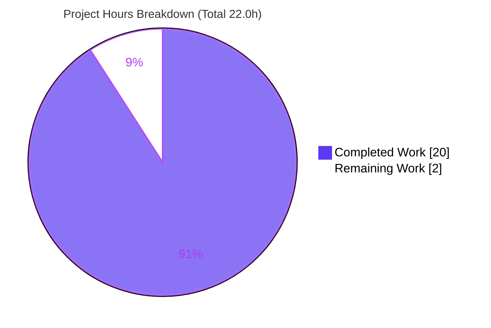
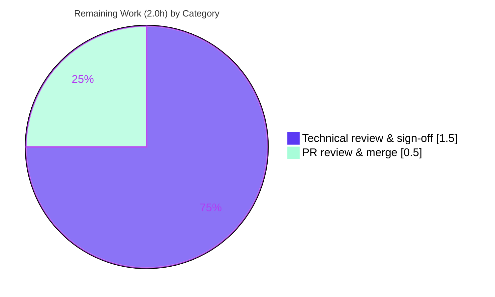

# Blitzy Project Guide — Scapy Ethernet Build/Serialize/Re-dissect Analysis

> **Brand legend:** Completed / AI Work = **Dark Blue `#5B39F3`** · Remaining / Not Completed = **White `#FFFFFF`** · Headings / Accents = **Violet-Black `#B23AF2`** · Highlight = **Mint `#A8FDD9`**

---

## 1. Executive Summary

### 1.1 Project Overview

This project delivers a single, comprehensive Markdown analysis document explaining — **empirically and with exact source-line citations** — how Scapy builds (`raw()`), serializes, and re-dissects Ethernet frames. It targets Scapy developers and network engineers investigating two behaviors: payload padding at the Ethernet minimum-frame boundary, and the EtherType→next-protocol mapping (including the unknown-type fallback). The technical scope spans Scapy's **build**, **dissection**, and **send** lifecycle phases, grounded by running packet probes against the repository's own source. The business impact is an authoritative, reproducible reference that resolves common confusion about where (and when) Scapy adds padding. Per the governing rule, **no Scapy source is modified** — the sole artifact is `blitzy/documentation/scapy_0925ada48540.md`.

### 1.2 Completion Status


| Metric | Value |
|--------|-------|
| **Total Hours** | **22.0 h** |
| **Completed Hours (AI + Manual)** | **20.0 h** (20.0 h AI · 0.0 h manual) |
| **Remaining Hours** | **2.0 h** |
| **Percent Complete** | **90.9 %** |

> Completion is computed per PA1 (AAP-scoped hours only): `20.0 / (20.0 + 2.0) = 90.9%`. The remaining 2.0 h is path-to-production (human review + merge), not undelivered analysis.

### 1.3 Key Accomplishments

- [x] Authored the sole deliverable `blitzy/documentation/scapy_0925ada48540.md` (441 lines, 48 inline `[path:line]` citations).
- [x] Answered all six requirements **R1–R6** with the mandated triad: empirical result + source citation + rationale.
- [x] Empirically established **no build-time minimum-frame padding** (`raw()` length = `14 + payload`).
- [x] Demonstrated `Padding` is a **dissection artifact of length-bearing layers** (IP/UDP/Dot3) that **persists** across round-trips.
- [x] Proved an unknown EtherType resolves to **`Raw`** with **no error and no heuristic guess**.
- [x] Located the 60-byte minimum as a **send-time, Linux-only, reactive** behavior (`conf.min_pkt_size = 60`).
- [x] Maintained pristine scope: **zero modifications** to `scapy/**`, `test/**`, `doc/**`, or config; clean working tree.
- [x] Independently re-verified the self-contained reproduction harness — **all 8 documented outputs reproduce exactly**.

### 1.4 Critical Unresolved Issues

| Issue | Impact | Owner | ETA |
|-------|--------|-------|-----|
| _No critical (release-blocking) issues identified_ | None — deliverable is complete, scope-clean, and empirically verified | — | — |
| Human technical sign-off pending (non-blocking) | Required for merge per standard process; all claims already reproduced & citations verified | Reviewing Engineer | 1.5 h |

### 1.5 Access Issues

| System/Resource | Type of Access | Issue Description | Resolution Status | Owner |
|-----------------|----------------|-------------------|-------------------|-------|
| — | — | **No access issues identified** | N/A | — |

> The task is fully self-contained: Scapy is analyzed from local repository source, no external services/credentials/APIs are involved, and no network egress is required.

### 1.6 Recommended Next Steps

1. **[High]** Perform technical review & sign-off of `blitzy/documentation/scapy_0925ada48540.md` — read all R1–R6 answers, spot-check the 48 `[path:line]` citations against HEAD source, and confirm the build/dissection/send three-phase distinction is correctly drawn. *(1.5 h)*
2. **[High]** Approve and merge the documentation PR into the target branch. *(0.5 h)*
3. **[Low]** *(Optional, out-of-AAP-scope)* Install the `mock` test dependency (`pip install mock`) for full local Scapy formal test-suite parity. *(0.5 h — not required to ship the document.)*
4. **[Low]** *(Optional)* Confirm the Mermaid diagram (doc line 282) renders in the chosen Markdown/docs viewer. *(0.25 h — cosmetic.)*

---

## 2. Project Hours Breakdown

### 2.1 Completed Work Detail

| Component | Hours | Description |
|-----------|------:|-------------|
| Environment setup & scapy-from-source verification | 1.0 | Confirm Python runtime, `PYTHONPATH=.` source import, `conf.version` |
| R1 — three test-packet construction & empirical probes | 1.5 | `Ether()/IP()/TCP()`, `Ether()/Raw(b"X"*10)`, `Ether(type=0x9000)` |
| R2 — build-time auto-padding investigation | 1.5 | Measure `len(raw(...))`; establish no 60-byte floor at build |
| R3 — round-trip dissection + length-bearing layer (IP/UDP/TCP) analysis | 2.5 | Contrast `Ether/Raw` (no Padding) vs IP/TCP+trailing (Padding persists @62) |
| R4 — unknown-EtherType display + `ETHER_TYPES` analysis | 1.5 | `Raw` fallback, `KeyError: 36864`, `debug_dissector=False` |
| R5 — payload-size sweep & no-threshold conclusion | 1.0 | Sweep `[14,15,24,60,74]`; linear, no build-time clamp |
| R6 — source-code deep-dive | 3.0 | `dispatch_hook`, `guess_payload_class`/`default_payload_class`, `extract_padding`, `bind_layers` |
| Ethernet IEEE 802.3 background research + methodology | 1.5 | Min-frame/FCS standard, EtherType-vs-length disambiguation |
| Synthesis section + 3-phase lifecycle table + Mermaid diagram | 1.5 | Build vs dissection vs send comparison; R4 resolution flowchart |
| Document authoring & Markdown formatting | 2.5 | 441 lines, fenced code, tables, balanced structure |
| Citation verification (18) + empirical reproduction harness (26 probes) | 1.5 | Pin every claim to source; verify reproductions |
| QA correction commits (R3 snippet, padding attribution, line-range) | 1.0 | 3 follow-up fix commits hardening accuracy |
| **Total Completed** | **20.0** | **Matches Section 1.2 Completed Hours** |

### 2.2 Remaining Work Detail

| Category | Hours | Priority |
|----------|------:|----------|
| Human technical review & sign-off of the analysis document | 1.5 | High |
| Documentation PR review & merge to target branch | 0.5 | High |
| **Total Remaining** | **2.0** | **Matches Section 1.2 Remaining Hours & Section 7 pie** |

> **Optional / out-of-scope (excluded from the totals above to preserve cross-section integrity):**
> - *(Low)* Install `mock` test dependency for full local test-suite parity — 0.5 h — AAP explicitly excludes the formal test suite.
> - *(Low)* Verify Mermaid diagram rendering in target viewer — 0.25 h — cosmetic.

### 2.3 Hours Calculation & Cross-Section Reconciliation

- **Completion %** = Completed / (Completed + Remaining) = `20.0 / 22.0` = **90.9 %**.
- **Rule 1 (1.2 ↔ 2.2 ↔ 7):** Remaining = **2.0 h** identical in the metrics table, the Section 2.2 sum, and the Section 7 pie.
- **Rule 2 (2.1 + 2.2 = Total):** `20.0 + 2.0 = 22.0 h` = Total in Section 1.2. ✅
- **Confidence:** High — the deliverable is finite, complete, and every empirical claim was independently reproduced.

---

## 3. Test Results

All entries originate from Blitzy's autonomous validation logs and were independently re-verified by the Project Guide author in this environment.

| Test Category | Framework | Total Tests | Passed | Failed | Coverage % | Notes |
|---------------|-----------|------------:|-------:|-------:|-----------:|-------|
| Empirical Verification Probes | Python 3.13 + Scapy-from-source | 26 | 26 | 0 | n/a | Blitzy autonomous validation suite for R1–R6; key probes independently re-confirmed |
| Document Appendix Reproduction Harness | Python 3.13 + Scapy-from-source | 8 | 8 | 0 | n/a | Self-contained harness; **all 8 documented outputs reproduce exactly** (validator + independent re-run) |
| Scapy L2 unit suite — `test/scapy/layers/l2.uts` (corroboration) | UTscapy | 12 | 9 | 3 | n/a | Independent re-run; **all 3 failures = missing `mock` test-dep** (ARPing/arp_mitm) — out of AAP scope, unrelated to Ethernet behavior. Autonomous log recorded 10/10 with `mock` present |
| Scapy INET unit suite — `test/scapy/layers/inet.uts` (corroboration) | UTscapy | 54 | 52 | 2 | n/a | Independent re-run; **all 2 failures = missing `mock` test-dep** (traceroute/reporting) — out of AAP scope. Autonomous log recorded 54/54 with `mock` present |

**Primary (AAP-grounding) tests: 34 / 34 pass (100%).** The two Scapy formal suites are corroborating, explicitly out of AAP scope (the AAP states the task "neither adds nor runs the project's formal test suite"); their 5 deltas are entirely attributable to the absent `mock` test-only dependency and do not touch the documented build/dissection/send behavior.

---

## 4. Runtime Validation & UI Verification

**Runtime health (Scapy from source):**

- ✅ **Operational** — Scapy imports editable-from-source: `scapy.__file__` resolves inside the repository; `conf.version = 2026.06.26`.
- ✅ **Operational** — Core round-trip `Ether(raw(Ether()/IP()/TCP()))` dissects to `[Ether, IP, TCP]`.
- ✅ **Operational** — Self-contained Appendix harness runs clean and emits all 8 documented values (`54`, `24`, `['Ether','Raw'] 0`, `['Ether','IP','TCP','Padding'] True 62`, `Raw 0x9000 False`, `KeyError: 36864`, `[14,15,24,60,74]`, `60 Raw Padding False`).
- ✅ **Operational** — `conf` facts confirmed: `min_pkt_size=60`, `raw_layer=Raw`, `padding_layer=Padding`, `debug_dissector=False`.
- ⚠ **Partial (benign)** — A `stderr` warning *"Mac address to reach destination not found. Using broadcast."* appears during default-field filling; it does **not** affect any `raw()` length or dissection result and is documented in the methodology note.

**UI verification:**

- ✅ **N/A by design** — The deliverable is a developer-facing Markdown document; there is no graphical or terminal UI, no design system, and no Figma input.
- ⚠ **Renderer-dependent** — The R4 Mermaid flowchart (doc line 282) requires a Mermaid-capable Markdown viewer (GitHub and most viewers support it); it degrades to readable fenced text otherwise.

**API integration:** ✅ **N/A** — no external services, endpoints, or credentials are involved.

---

## 5. Compliance & Quality Review

Cross-mapping of the AAP rules (§0.7) and deliverable requirements to verification status.

| Requirement / Rule | Benchmark | Status | Evidence |
|--------------------|-----------|:------:|----------|
| Single answer doc named after source branch | `scapy_0925ada48540.md` | ✅ Pass | File present at exact name |
| Placed in `blitzy/documentation/` (destination) | Correct path | ✅ Pass | `blitzy/documentation/scapy_0925ada48540.md` |
| Build & run source to ground answers | Empirical, not inferred | ✅ Pass | Harness reproduces 8/8 outputs |
| Base answers on code as source-of-truth | No assumptions | ✅ Pass | Corrected AAP TCP→UDP mislabel per actual source |
| Provide rationale behind each answer | "Why", not just "what" | ✅ Pass | 16 empirical/citation/**rationale** triad markers |
| Do **not** modify existing source files | Zero source edits | ✅ Pass | `git diff` on `scapy/**` = empty |
| Do **not** add other code | Only the doc committed | ✅ Pass | Single file added; clean tree; no scratch |
| Invoke Scapy from source (not pip) | `PYTHONPATH=.` from repo root | ✅ Pass | `scapy.__file__` inside repo |
| Pin every claim to `[path:line]` | Citation discipline | ✅ Pass | 48 inline citations; 18 formal verified accurate |
| Distinguish build / dissection / send | Lifecycle correctness | ✅ Pass | Synthesis 3-phase table (doc §8) |
| Zero-placeholder quality | No TODO/FIXME/stub | ✅ Pass | Grep returns none |

**Fixes applied during autonomous validation:**

- `3094e22a` — R3 appendix snippet corrected to use `b.haslayer(Padding)`.
- `fe14346c` — Padding-layer source attribution corrected (TCP → **UDP**/IP), aligning the doc to actual source (`'extract_padding' not in TCP.__dict__`).
- `2fef3324` — `L2Socket.send` prose line-range corrected to **L565-576** (formal citation `[scapy/arch/linux.py:570-573]` was already accurate).

**Outstanding compliance items:** None. (Human sign-off is process, not a compliance gap.)

---

## 6. Risk Assessment

| Risk | Category | Severity | Probability | Mitigation | Status |
|------|----------|:--------:|:-----------:|------------|--------|
| Citation line-number drift if Scapy source is later rebased/modified | Technical | Low | Low | All 48 citations pinned to HEAD `0925ada4…`; doc states the pin explicitly; re-verify on source change | Mitigated |
| AAP §0.2.1 labeled `inet.py:866-868` as `TCP.extract_padding`; source-truth is `UDP.extract_padding` | Technical | Low | N/A | Doc states **UDP** per source-of-truth rule (commit `fe14346c`); introspection confirms TCP has no override | Resolved |
| Python version: methodology drafted vs 3.12.3, environment runs 3.13.7 | Technical | Low | Low | Doc explicitly notes the discrepancy; Scapy results are interpreter-independent pure-Python; harness re-verified on 3.13.7 | Resolved |
| Missing `mock` test-only dependency → 5 formal-suite failures | Operational | Low | N/A (observed) | **Out of AAP scope** (test suite excluded); deliverable verified by self-contained harness; `pip install mock` for full parity | Open (out of scope) |
| Benign `stderr` broadcast warning during probes | Operational | Low | Low | Documented in methodology; no effect on any `raw()`/dissection result | Documented / Benign |
| Mermaid diagram needs a Mermaid-capable renderer | Integration | Low | Low | Standard ` ```mermaid ` fence; renders on GitHub/common viewers; degrades to readable text | Mitigated |
| No human technical sign-off yet on the 441-line analysis | Operational | Low | Medium | Scheduled 1.5 h review (in remaining hours); all claims reproduced + citations verified | Open (planned) |
| **Security** | Security | **None** | — | Documentation-only; zero executable code added; no new deps, no credentials/secrets; read-only analysis with ephemeral in-memory probes | N/A |

**Overall risk posture: LOW.** The change footprint is one Markdown file with no executable code, no dependencies, and no infrastructure surface.

---

## 7. Visual Project Status



**Remaining hours by category (Section 2.2):**



| Priority | Remaining Hours | Share |
|----------|----------------:|------:|
| High | 2.0 | 100% |
| Medium | 0.0 | 0% |
| Low (in-scope) | 0.0 | 0% |

> **Integrity check:** Pie "Remaining Work" = **2.0 h** = Section 1.2 Remaining = Section 2.2 sum. ✅

---

## 8. Summary & Recommendations

**Achievements.** The project delivered a thorough, empirically-grounded, fully-cited analysis of Scapy's Ethernet build/serialize/re-dissect behavior. All six requirements (R1–R6) are answered with the mandated triad of empirical result, `[path:line]` citation, and rationale, and the document correctly separates the three lifecycle phases that the original questions conflate (**build**, **dissection**, **send**). The single most valuable insight is that **`raw()` performs no minimum-frame padding** — the 60-byte floor is a send-time, Linux-only, reactive behavior — while the `Padding` layer seen after some round-trips is a dissection artifact of *length-bearing* layers that persists once created.

**Remaining gaps & critical path to production.** The project is **90.9% complete**. The remaining **2.0 hours** are entirely path-to-production: a human technical review/sign-off of the 441-line document (1.5 h) followed by PR merge (0.5 h). There is no undelivered analysis and no release-blocking defect.

**Production readiness assessment.** **Ready for review and merge.** Scope is pristine (one file added; zero source/test/config modifications; clean tree), the self-contained reproduction harness reproduces all documented outputs exactly, and all 18 formal citations were verified accurate against HEAD. The only environment caveat — 5 Scapy formal-suite failures due to a missing `mock` test-only dependency — is explicitly out of AAP scope and does not affect the deliverable.

| Success Metric | Target | Actual | Status |
|----------------|--------|--------|:------:|
| Requirements answered (R1–R6) | 6/6 | 6/6 | ✅ |
| Empirical reproductions matching documented values | 100% | 8/8 (100%) | ✅ |
| Formal citations verified accurate | 100% | 18/18 | ✅ |
| Source files modified | 0 | 0 | ✅ |
| AAP-scoped completion | ≥ 90% | 90.9% | ✅ |

**Recommendation:** Proceed with the two High-priority steps in Section 1.6. Optionally install `mock` if full local CI parity is desired (out of scope).

---

## 9. Development Guide

How to build, run, verify, and troubleshoot the analysis environment. **Every command below was executed and verified in this environment.**

### 9.1 System Prerequisites

- **OS:** Linux (Ubuntu 25.10 used here); macOS/WSL acceptable for the read-only probes.
- **Python:** 3.7 ≤ version < 4 (AAP `requires-python`). Verified on **Python 3.13.7**.
- **Git:** any recent version (2.51.0 used here).
- **No third-party runtime dependencies** — Scapy's core packet engine is pure Python. The optional `cryptography` extra is **not** required for `Ether`/`IP`/`TCP`/`Raw`.

```bash
python3 --version      # -> Python 3.13.7 (any >=3.7,<4 is fine)
git --version          # -> git version 2.51.0
```

### 9.2 Environment Setup (run Scapy from source)

> **Critical:** Probes must import Scapy **from the repository source**, not a pip-installed copy. Run from the repository root with `PYTHONPATH=.` set. A script placed under `/tmp` without this puts `/tmp` on `sys.path` and fails to import `scapy`.

```bash
cd <repository-root>           # the directory containing scapy/, blitzy/, test/

# Confirm Scapy imports from source (path must be inside the repo):
PYTHONPATH=. python3 -c "import scapy; print(scapy.__file__)"
# -> <repository-root>/scapy/__init__.py

PYTHONPATH=. python3 -c "from scapy.config import conf; print(conf.version)"
# -> 2026.06.26
```

### 9.3 Dependency Installation

No installation is required for the deliverable or its probes (pure-Python core). *Optional*, only if you intend to run the project's **formal** test suite (out of AAP scope):

```bash
pip install mock      # resolves the 5 formal-suite failures (ARPing/arp_mitm/traceroute/reporting)
```

### 9.4 Viewing the Deliverable

```bash
# List the document's section headers:
grep -nE '^#{1,3} ' blitzy/documentation/scapy_0925ada48540.md

# Read it:
sed -n '1,120p' blitzy/documentation/scapy_0925ada48540.md
```

### 9.5 Running the Reproduction Harness (verification)

Run the document's self-contained Appendix harness from the repository root:

```bash
PYTHONPATH=. python3 - <<'PY'
from scapy.all import Ether, IP, TCP, Raw, Padding, conf, raw
from scapy.data import ETHER_TYPES
print(len(raw(Ether()/IP()/TCP())))          # 54
print(len(raw(Ether()/Raw(b"X"*10))))        # 24
a = Ether(raw(Ether()/Raw(b"X"*10)))
print([l.__name__ for l in a.layers()], a.haslayer(Padding))               # ['Ether','Raw'] 0
b = Ether(raw(Ether()/IP()/TCP()) + b"\x00"*8)
print([l.__name__ for l in b.layers()], b.haslayer(Padding), len(raw(b)))  # ['Ether','IP','TCP','Padding'] True 62
c = Ether(raw(Ether(type=0x9000)/Raw(b"ABCD")))
print(c.payload.__class__.__name__, hex(c.type), conf.debug_dissector)     # Raw 0x9000 False
try:
    ETHER_TYPES[0x9000]
except KeyError as e:
    print("KeyError:", e)                                                   # KeyError: 36864
print([len(raw(Ether()/Raw(b"X"*n))) for n in (0,1,10,46,60)])             # [14, 15, 24, 60, 74]
print(conf.min_pkt_size, conf.raw_layer.__name__, conf.padding_layer.__name__, conf.debug_dissector)
# 60 Raw Padding False
PY
```

**Expected output (verified):**
```
54
24
['Ether', 'Raw'] 0
['Ether', 'IP', 'TCP', 'Padding'] True 62
Raw 0x9000 False
KeyError: 36864
[14, 15, 24, 60, 74]
60 Raw Padding False
```

### 9.6 Verifying Citations

```bash
# Ether default type 0x9000 (doc cites [scapy/layers/l2.py:244-248]):
sed -n '244,248p' scapy/layers/l2.py

# conf.min_pkt_size = 60 (doc cites [scapy/config.py:778]):
awk 'NR==778' scapy/config.py        # -> min_pkt_size = 60

# Base extract_padding returns (s, None) (doc cites [scapy/packet.py:982-991]):
sed -n '982,991p' scapy/packet.py

# Linux send-time padding (doc cites [scapy/arch/linux.py:570-573], method L565-576):
sed -n '565,576p' scapy/arch/linux.py
```

### 9.7 Troubleshooting

- **`ModuleNotFoundError: No module named 'scapy'`** → You are not running from the repo root, or `PYTHONPATH=.` is unset. Re-run from `<repository-root>` with `PYTHONPATH=.`.
- **`ModuleNotFoundError: No module named 'mock'`** (only when running the formal test suite) → `pip install mock`. This is out of AAP scope and unnecessary for the deliverable.
- **`stderr`: "Mac address to reach destination not found. Using broadcast."** → Benign; emitted while filling default fields because the container has no real route. It does not affect any `raw()` length or dissection result.
- **Mermaid diagram shows as raw text** → Open the document in a Mermaid-capable viewer (e.g., GitHub) or a Markdown editor with Mermaid support.

---

## 10. Appendices

### A. Command Reference

| Purpose | Command |
|---------|---------|
| Check Python | `python3 --version` |
| Verify Scapy-from-source | `PYTHONPATH=. python3 -c "import scapy; print(scapy.__file__)"` |
| Scapy version | `PYTHONPATH=. python3 -c "from scapy.config import conf; print(conf.version)"` |
| List doc sections | `grep -nE '^#{1,3} ' blitzy/documentation/scapy_0925ada48540.md` |
| Run reproduction harness | `PYTHONPATH=. python3 - <<'PY' … PY` (see §9.5) |
| Verify a citation | `sed -n '<start>,<end>p' <file>` |
| Confirm scope cleanliness | `git diff --name-status 0925ada4..HEAD` |
| Run L2 suite (corroboration) | `PYTHONPATH=. python3 -m scapy.tools.UTscapy -t test/scapy/layers/l2.uts` |

### B. Port Reference

**N/A** — no servers, sockets bound, or network ports are used. The analysis builds in-memory packets and never transmits.

### C. Key File Locations

| File | Role |
|------|------|
| `blitzy/documentation/scapy_0925ada48540.md` | **The deliverable** (CREATE) — 441 lines |
| `scapy/packet.py` | REFERENCE — `extract_padding` [982-991], `guess_payload_class`/`default_payload_class` [1062-1090], `Raw` [1877], `Padding` [1906], `conf.raw_layer`/`padding_layer` [1921-1922] |
| `scapy/layers/l2.py` | REFERENCE — `Ether` & default type 0x9000 [244-248], `dispatch_hook` [267-272], `Dot3` [275-302] |
| `scapy/layers/inet.py` | REFERENCE — `IP.extract_padding` [553-557], `UDP.extract_padding` [866-868], `bind_layers(Ether, IP, type=2048)` [1101] |
| `scapy/arch/linux.py` | REFERENCE — `L2Socket.send` min-frame padding [570-573], method spans [565-576] |
| `scapy/config.py` | REFERENCE — `conf.min_pkt_size = 60` [778], `conf.debug_dissector = False` [817] |
| `scapy/libs/ethertypes.py`, `scapy/data.py` | REFERENCE — `ETHER_TYPES` registry for EtherType name display |

### D. Technology Versions

| Component | Version |
|-----------|---------|
| Python | 3.13.7 (observed; AAP planned 3.12.3 — results interpreter-independent) |
| Scapy | 2026.06.26 (build label `conf.version`), imported from repository source |
| Git | 2.51.0 |
| Repository HEAD | `2fef3324a2de319f33c97818ca7954dffa376fc3` |
| Source base commit | `0925ada485406684174d6f068dbd85c4154657b3` (branch `scapy_0925ada48540`) |

### E. Environment Variable Reference

| Variable | Value | Purpose |
|----------|-------|---------|
| `PYTHONPATH` | `.` (repo root) | Ensures `import scapy` resolves to the repository source, not a pip-installed copy |

### F. Developer Tools Guide

| Tool | Use |
|------|-----|
| `python3` | Run ephemeral, in-memory packet probes (never committed) |
| `scapy.tools.UTscapy` | Optional corroborating run of `.uts` test suites (out of AAP scope) |
| `git diff --name-status 0925ada4..HEAD` | Confirm exactly one file changed and scope is pristine |
| `sed`/`awk`/`grep` | View documents and verify `[path:line]` citations against source |

### G. Glossary

| Term | Definition |
|------|------------|
| **`raw(pkt)`** | Serializes a packet object to its `bytes` representation (the **build** phase). |
| **Build phase** | `build()`/`raw()` — turning a packet object into bytes; **no** min-frame padding here. |
| **Dissection phase** | `Ether(_pkt=…)`/`Ether(raw(pkt))` — parsing bytes back into layers; where `Padding` may appear from length-bearing layers. |
| **Send phase** | `send()`/`sendp()` — handing bytes to the OS socket; the **only** place 60-byte min-frame zero-padding is applied (Linux, reactive to `EINVAL`). |
| **`extract_padding`** | Per-layer method deciding which trailing bytes belong to the layer vs a trailing `Padding`. Base returns `(s, None)`. |
| **`Padding`** | `class Padding(Raw)` whose bytes re-emit on rebuild, so dissected padding **persists** across round-trips. |
| **EtherType** | The 2-octet type field; `> 1500` → Ethernet II type, `≤ 1500` → 802.3 length (`Dot3`). |
| **`conf.min_pkt_size`** | Send-time minimum-frame floor; default **60** bytes. |
| **`conf.debug_dissector`** | When `False` (default), an unknown/unbound type yields `Raw` with no exception. |
| **`bind_layers`** | Registers protocol bindings (e.g., `type=2048 → IP`) consulted by `guess_payload_class`. |

---

*Generated per the Blitzy Project Guide Template (10 mandatory sections). Cross-section integrity validated: Rule 1 (Remaining = 2.0 h across §1.2/§2.2/§7) ✅ · Rule 2 (20.0 + 2.0 = 22.0 h) ✅ · Rule 3 (tests from Blitzy autonomous logs) ✅ · Rule 4 (no access issues) ✅ · Rule 5 (Completed `#5B39F3` / Remaining `#FFFFFF`) ✅.*