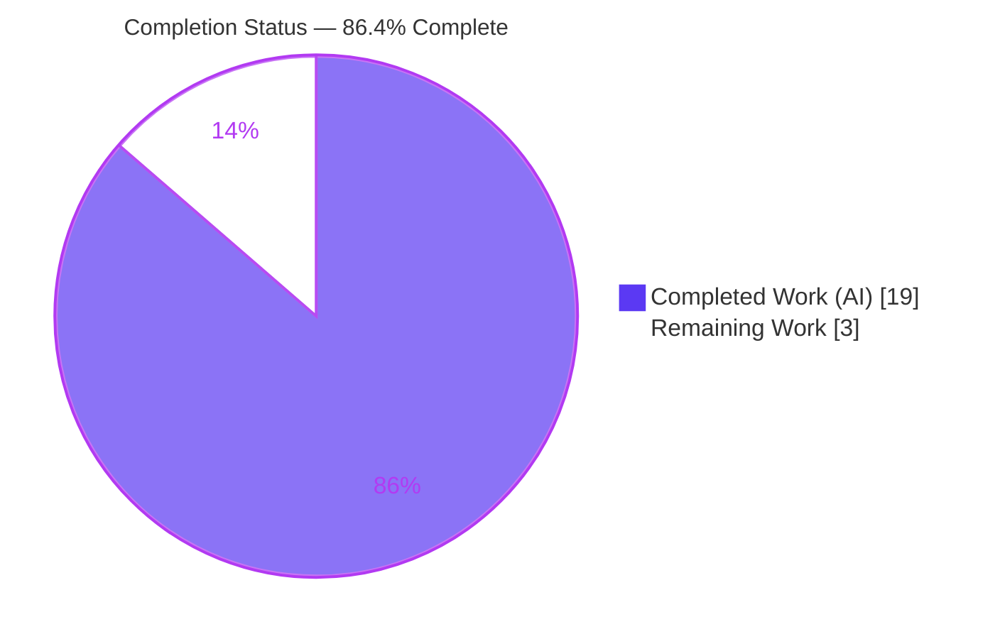
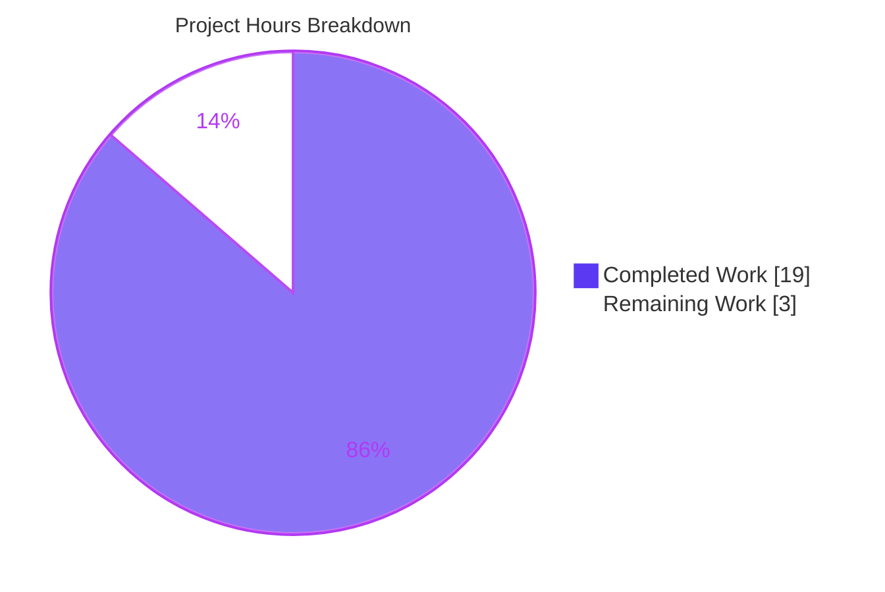
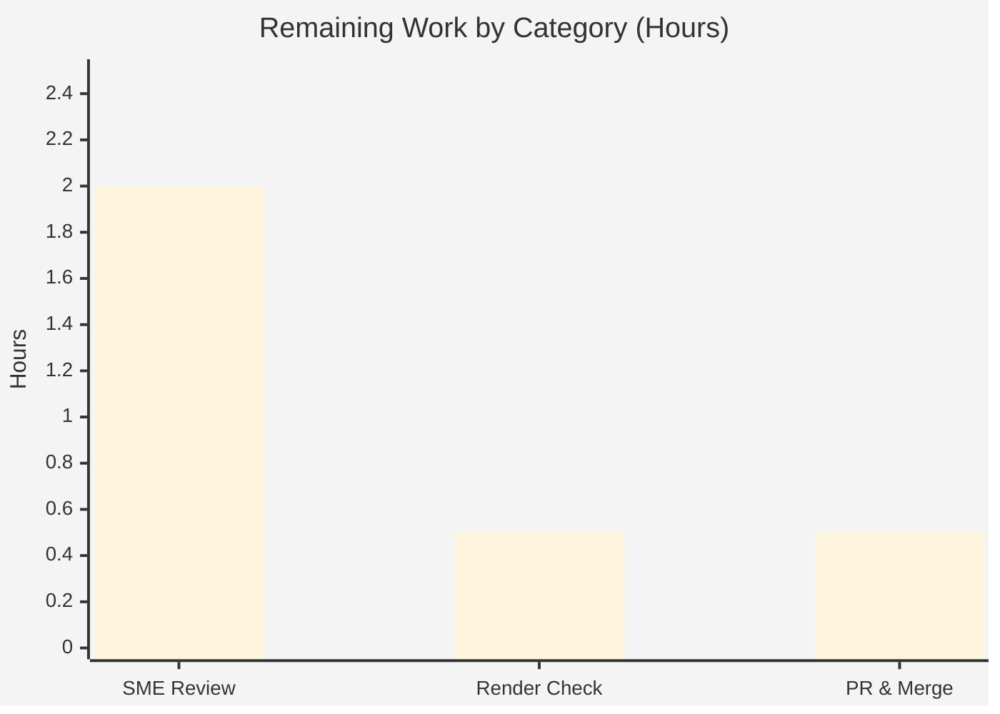

# Blitzy Project Guide — Scapy Runtime Packet-Lifecycle Q&A

> **Deliverable:** `blitzy/documentation/scapy_0925ada48540.md` · **Branch:** `blitzy-a0ffbf17-7966-4cb3-8ae8-0a3c3244946a` · **Baseline:** `scapy_0925ada48540` (`0925ada4`)
> **Legend — Blitzy brand colors:** <span style="color:#5B39F3">■ Completed / AI Work (#5B39F3)</span> · <span style="color:#B23AF2">■ White / Remaining (#FFFFFF)</span>

---

## 1. Executive Summary

### 1.1 Project Overview

This project delivers a single, evidence-backed investigative Q&A document explaining **what the Scapy library displays and reports at runtime** as one `Ethernet/IP/TCP` packet travels its full lifecycle — **build → send → sniff → summarize** — using the user's exact example `Ether()/IP(dst="127.0.0.1")/TCP(dport=80)`. The audience is engineers learning how Scapy forges, transmits, and reconstructs packets. It is a **strictly read-only** documentation task: exactly one Markdown file is created and **no** Scapy source, test, configuration, or build file is modified. Every behavioral claim is paired with verbatim runtime output and grounded in an exact `file:line` citation.

### 1.2 Completion Status



| Metric | Value |
|---|---|
| **Total Hours** | **22** |
| **Completed Hours (AI + Manual)** | **19** (19 AI + 0 Manual) |
| **Remaining Hours** | **3** |
| **Percent Complete** | **86.4%** |

> Completion is computed per the AAP-scoped hours methodology: `19 ÷ (19 + 3) × 100 = 86.4%`. All AAP deliverable content and rules are **completed and validated**; the remaining 3h is standard human path-to-production (review + merge) that agents cannot perform — not an incomplete AAP item.

### 1.3 Key Accomplishments

- ✅ **Single deliverable authored & committed** — `blitzy/documentation/scapy_0925ada48540.md` (35,176 bytes, 474 lines).
- ✅ **O1 Build** — `/` operator, incremental per-layer `repr`, `.show()` vs `.show2()`, and the `self_build → post_build` field-computation chain all documented with verbatim output.
- ✅ **O2 Send** — `send()` (L3) vs `sendp()` (L2), routing resolution `('lo','127.0.0.1','0.0.0.0')`, 6-column routing table, and `.` + `Sent 1 packets.` report.
- ✅ **O3 Sniff** — `AsyncSniffer` on `lo`, dissection, `sniffed_on='lo'`, layer reconstruction (round-trip `['Ether','IP','TCP']` + `Raw` fallback), `.show()`, `.summary()`.
- ✅ **O4 Summary** — coherent forge → send → capture synthesis.
- ✅ **Coverage confirmation** — every named item (Ethernet, IP, TCP, `/` operator, routing, layer reconstruction) addressed **by name**.
- ✅ **Evidence rigor** — run-first methodology, 22 verbatim output blocks, ~57 unique `file:line` citations across all 11 reference modules, one-claim-one-evidence discipline.
- ✅ **Read-only integrity** — working tree pristine; baseline→HEAD diff is exactly one added file; temporary scripts confined to `/tmp` and removed.
- ✅ **Autonomous validation** — UTscapy 4809/4809, live lifecycle reproduction, 55/55 citations verified zero-drift, `compileall` exit 0.

### 1.4 Critical Unresolved Issues

| Issue | Impact | Owner | ETA |
|---|---|---|---|
| _None_ — no defects, no failing tests, no unresolved errors | None | — | — |

> The autonomous validation reported **zero fixes required** and **zero remaining issues**. The only outstanding activity is discretionary human review/merge (see §1.6 and §2.2).

### 1.5 Access Issues

| System/Resource | Type of Access | Issue Description | Resolution Status | Owner |
|---|---|---|---|---|
| Git repository (branch `blitzy-a0ffbf17-…`) | Write/merge | Merge to the main branch requires a human with merge permissions | Pending human action | Repo maintainer |

> No blocking access issues for build/validation were identified. Raw send/sniff requires root — **already satisfied** (`uid 0`) in the container. Scapy core needs no external services, credentials, or third-party API access.

### 1.6 Recommended Next Steps

1. **[High]** Have a Scapy-literate SME review the document for technical accuracy and confirm it fully answers the 4-part question (build/send/sniff/summarize). *(~2h)*
2. **[Medium]** Verify the rendered Markdown on the target platform (code fences, tables, documented trailing-whitespace behavior). *(~0.5h)*
3. **[Medium]** Approve the pull request and merge the single-file addition to the main branch. *(~0.5h)*
4. **[Low]** *(Optional, out of AAP scope)* Consider wiring the document into the Sphinx docs under `doc/` if broader discoverability is later desired.

---

## 2. Project Hours Breakdown

### 2.1 Completed Work Detail

| Component | Hours | Description |
|---|---:|---|
| Investigation environment & run-first methodology | 2.0 | In-tree import contract (`PYTHONPATH=.`), root/loopback verification, dual deprecation-warning characterization |
| **O1** — Build section (§1.1–1.5) | 3.5 | `/` operator, incremental `repr`, `overloaded_fields`, `.show()`, `.show2()`, build-chain rationale |
| **O2** — Send section (§2.1–2.5) | 3.0 | L3 `send()` vs L2 `sendp()`, routing resolution, routing table, transmission report, buffering/ordering nuance |
| **O3** — Sniff section (§3.1–3.6) | 3.5 | `AsyncSniffer` on `lo`, dissection, `sniffed_on`, reconstruction round-trip, `Raw` fallback, `.show()`, `.summary()` |
| **O4** — Summary synthesis (§4) | 1.0 | Forge → send → capture narrative with one-claim-one-evidence |
| Citation grounding & verification | 2.0 | ~57 unique `file:line` citations across 11 modules, verified zero-drift |
| Coverage pass & §5 confirmation | 1.0 | Enumerate every named item; confirm each addressed by name |
| Edge-case & fidelity rigor | 1.0 | Whitespace `repr()` fidelity dump, warning transparency (ipsec + `__init__`) |
| Review-cycle refinements (3 follow-up commits) | 2.0 | Checkpoint-3 findings, README citation line ranges, QA linkage-field/`Raw`-fallback nuances |
| **Total Completed** | **19.0** | **Matches Completed Hours in §1.2** |

### 2.2 Remaining Work Detail

| Category | Hours | Priority |
|---|---:|---|
| SME technical review & Q&A completeness sign-off | 2.0 | High |
| Documentation rendering & readability verification | 0.5 | Medium |
| PR approval & merge to main | 0.5 | Medium |
| **Total Remaining** | **3.0** | **Matches Remaining Hours in §1.2 and §7 pie** |

---

## 3. Test Results

All results below originate from **Blitzy's autonomous validation logs** for this project (production-readiness gates 1–4).

| Test Category | Framework | Total Tests | Passed | Failed | Coverage % | Notes |
|---|---|---:|---:|---:|---|---|
| Regression — native library suite | UTscapy (Scapy's own harness) | 4809 | 4809 | 0 | N/A¹ | 190 campaigns; exit 0; matches setup baseline — confirms read-only codebase intact |
| Runtime lifecycle (build/send/sniff) | Live in-tree harness (root, `lo`) | 3 | 3 | 0 | 100% of O1–O3 | Build `repr`, send report + route, sniff `.summary()` reproduced live |
| Static compilation | `python -m compileall` | 331 | 331 | 0 | N/A | Byte-compiled `scapy/` package; 0 syntax errors |
| Citation accuracy sweep | Scripted `file:line` verify | 55 | 55 | 0 | 100% | Every unique citation resolves to the claimed literal (zero drift) |
| End-to-end doc ↔ live comparison | Programmatic assertions | 4 | 4 | 0 | 100% | `build repr == L80`; `layers()==['Ether','IP','TCP']`; `sniffed_on=='lo'`; `summary == L431` |
| **Totals** | — | **5202** | **5202** | **0** | — | All autonomous validation checks passed |

> ¹ Traditional **code-coverage %** is not applicable to a read-only documentation deliverable (no new source code was added). The UTscapy regression suite instead confirms the pre-existing Scapy codebase remains **unmodified and fully passing**. Deliverable "coverage" is measured as **AAP requirement coverage = 100%** and **citation coverage = 55/55**.

---

## 4. Runtime Validation & UI Verification

Scapy has **no web or graphical UI**; its user-facing surface is **terminal display**. Every display/report surface named in the AAP was executed live and reproduced verbatim.

**Packet lifecycle (executed as root over loopback `lo`):**
- ✅ **Operational** — Build: `Ether()/IP(dst="127.0.0.1")/TCP(dport=80)` → `repr`, `.show()`, `.show2()` all reproduced (auto-fields `type=IPv4`, `proto=tcp`, resolved `ihl=5`, `len=40`, `chksum=0x7ccd`).
- ✅ **Operational** — Send (L3) `send()` and (L2) `sendp()`: both emit `.` then `Sent 1 packets.`.
- ✅ **Operational** — Routing: `conf.route.route("127.0.0.1") → ('lo','127.0.0.1','0.0.0.0')`; 6-column routing table renders (`Network / Netmask / Gateway / Iface / Output IP / Metric`).
- ✅ **Operational** — Sniff: `AsyncSniffer` on `lo` captured the SYN; `sniffed_on='lo'`; `.summary() → Ether / IP / TCP 127.0.0.1:ftp_data > 127.0.0.1:http S`.
- ✅ **Operational** — Layer reconstruction: round-trip recovers `['Ether','IP','TCP']`; `Raw` fallback verified for unbound `proto=253`.

**Environment health:**
- ✅ **Operational** — In-tree import (`PYTHONPATH=.`) succeeds on system `python3` and the `.venv`; `conf.version = 2026.07.01`, `conf.verb = 2`, `conf.loopback_name = lo`.
- ✅ **Operational** — Interactive console entry resolves: `scapy.main:interact` (`pyproject.toml:47`).
- ⚠ **Partial (benign, documented)** — Import emits a harmless `CryptographyDeprecationWarning` from `scapy/layers/ipsec.py`; the document reports it truthfully and filters it in captures. Not a defect.

---

## 5. Compliance & Quality Review

Cross-map of AAP deliverables/rules to Blitzy quality benchmarks. Fixes were applied across the agent's review cycle (3 follow-up commits); **no fixes were required during final autonomous validation**.

| Benchmark / AAP Rule | Requirement | Status | Progress | Notes |
|---|---|---|---|---|
| Deliverable identity | Create `blitzy/documentation/scapy_0925ada48540.md` (only file) | ✅ Pass | 100% | 35,176 bytes; single-file diff vs baseline |
| Run-first methodology | Output produced by executing Scapy, not reading alone | ✅ Pass | 100% | 22 verbatim blocks captured live; re-verified |
| Verbatim + producing command | Quote observed output beside its command | ✅ Pass | 100% | Every block shows the `>>>`/`$` command |
| One claim, one evidence | Pair each behavioral claim with one output line | ✅ Pass | 100% | Applied consistently through §1–§4 |
| Exact `file:line` grounding | Cite exact literals with `file:line` | ✅ Pass | 100% | 55/55 unique citations verified zero-drift |
| Full coverage | Address every named item by name | ✅ Pass | 100% | §5 coverage pass: Ethernet, IP, TCP, `/`, routing, reconstruction |
| User example fidelity | Use the exact `Ether/IP/TCP` example | ✅ Pass | 100% | `Ether()/IP(dst="127.0.0.1")/TCP(dport=80)` throughout |
| Read-only integrity | No existing file modified; pristine tree | ✅ Pass | 100% | `git status --porcelain` empty; diff = one `A` file |
| Temp-script hygiene | Scripts in `/tmp`, deleted afterward | ✅ Pass | 100% | Confirmed by clean tree; re-verified during this review |
| Zero-placeholder policy | Complete, production-ready content | ✅ Pass | 100% | No TODO/stub/placeholder in the deliverable |
| Truthful edge-case reporting | Report unexpected observations honestly | ✅ Pass | 100% | Python 3.13.7 vs 3.12.3, buffering order, `Raw` fallback all disclosed |

---

## 6. Risk Assessment

| Risk | Category | Severity | Probability | Mitigation | Status |
|---|---|---|---|---|---|
| Environmental Python drift (3.13.7 observed vs 3.12.3 in planning) | Technical | Low | Low | Scapy packet logic is version-independent; document truthfully notes the value observed | Documented / Accepted |
| Runtime output varies on other hosts (routing table, iface list) | Technical | Low | Medium | Loopback path is deterministic; routing table minimized to the governing `lo` route with disclosure | Mitigated |
| Citation / `conf.version` drift as Scapy evolves | Technical | Low | Low | Point-in-time snapshot pinned to baseline `0925ada4`; 55/55 citations verified | Mitigated |
| Markdown trims `.show()` trailing whitespace | Technical | Low | Medium | Whitespace fidelity documented with `repr()` evidence in the intro | Mitigated |
| No new attack surface / secrets / auth | Security | None/Low | Low | Read-only doc adds no code/deps; raw send/sniff loopback-confined | N/A |
| No monitoring/health-check (not a running service) | Operational | None | — | Deliverable is a document, not a service | N/A |
| Document freshness over time | Operational | Low | Low | Snapshot tied to a specific commit & Scapy version | Accepted |
| Not integrated into Sphinx docs (`doc/`) | Integration | Low | Low | Explicitly out of AAP scope; optional future human step | Out of scope |
| No external service/API/network config dependency | Integration | None | — | Scapy core is stdlib-only | N/A |

> **Overall risk: LOW.** No High or Critical risks. Nothing blocks release; the sole release gate is human SME sign-off, already heavily de-risked by autonomous validation.

---

## 7. Visual Project Status



**Remaining hours by category (from §2.2, total = 3.0h):**



| Priority | Remaining Hours | Share |
|---|---:|---:|
| High | 2.0 | 66.7% |
| Medium | 1.0 | 33.3% |
| **Total** | **3.0** | **100%** |

> Integrity: "Remaining Work" = **3.0h** matches §1.2 (Remaining Hours) and the §2.2 Hours sum exactly.

---

## 8. Summary & Recommendations

**Achievements.** The project is **86.4% complete (19h of 22h)**. The sole AAP deliverable — an investigative Q&A on Scapy's runtime packet lifecycle — is authored, committed, and independently validated. All four objectives (build, send, sniff, summarize) are covered with verbatim runtime output and exact `file:line` grounding; every named item (Ethernet, IP, TCP, the `/` operator, routing, layer reconstruction) is addressed by name; and the repository remains strictly read-only (single-file addition, pristine working tree).

**Remaining gaps.** The remaining **3h is entirely human path-to-production**: SME technical review & Q&A sign-off (2h), rendering/readability verification (0.5h), and PR approval & merge (0.5h). There are **no unresolved defects, failing tests, or missing AAP content**.

**Critical path to production.** SME review → rendering check → merge. Each step is short and low-risk; autonomous validation (UTscapy 4809/4809, live lifecycle reproduction, 55/55 citations verified, `compileall` exit 0) has already established technical accuracy and read-only integrity.

**Success metrics.** AAP requirement coverage 100%; citation coverage 55/55 (zero drift); regression suite 4809/4809; working tree pristine.

**Production readiness.** ✅ **Ready pending human sign-off.** This is a documentation artifact with no runtime/deployment surface; "production" means the reviewed document is merged to the main branch.

| Metric | Value |
|---|---|
| Completion | 86.4% |
| Completed / Total hours | 19 / 22 |
| Remaining hours | 3 |
| Blocking defects | 0 |
| Overall risk | Low |

---

## 9. Development Guide

Scapy is imported **in-tree** (it is **not** pip-installed), so all commands run from the repository root with `PYTHONPATH=.`. Commands below were tested during this assessment.

### 9.1 System Prerequisites
- **OS:** Linux (raw send/sniff uses `PF_PACKET`).
- **Privileges:** root (`uid 0`) — required for raw send/sniff. Verify: `id -u` → `0`.
- **Python 3** — container: **3.13.7**; Scapy declares support `>=3.7, <4` (`pyproject.toml:17`).
- **Loopback interface `lo`** UP. Verify: `ip link show lo`.
- **In-tree Scapy** — `conf.version = 2026.07.01`.

### 9.2 Environment Setup
```bash
# From the repository root
cd /path/to/repo

# Scapy is imported in-tree — set PYTHONPATH to the repo root
export PYTHONPATH=.

# (Optional) the repo ships a .venv used for the crypto-dependent test suite
.venv/bin/python --version    # -> Python 3.13.7
```
- **No dependency installation is required for the observations.** Scapy core is **standard-library-only** (there is no `[project] dependencies` key in `pyproject.toml`). Optional extras (`ipython`, `cryptography`) are already present in the container.

### 9.3 Dependency Installation (optional / test suite only)
```bash
# Verify the venv's dependency graph is intact
.venv/bin/python -m pip check          # -> "No broken requirements found."
```

### 9.4 Application Startup ("starting Scapy normally")
```bash
# Interactive console (entry point scapy.main:interact, pyproject.toml:47)
PYTHONPATH=. python3 -m scapy
# or
./run_scapy

# Scripted observation (keep scripts OUTSIDE the repo, in /tmp)
PYTHONPATH=. python3 /tmp/obs.py
```

### 9.5 Verification Steps (tested)
```bash
# 1) Import + version
PYTHONPATH=. python3 -c "from scapy.all import conf; print(conf.version)"     # -> 2026.07.01

# 2) Build the example stack (repr should match the document, line 80)
PYTHONPATH=. python3 -c "import warnings; warnings.filterwarnings('ignore'); \
from scapy.all import Ether, IP, TCP; \
print(repr(Ether()/IP(dst='127.0.0.1')/TCP(dport=80)))"
# -> <Ether  type=IPv4 |<IP  frag=0 proto=tcp dst=127.0.0.1 |<TCP  dport=http |>>>

# 3) Routing decision (document line 235)
PYTHONPATH=. python3 -c "import warnings; warnings.filterwarnings('ignore'); \
from scapy.all import conf; print(conf.route.route('127.0.0.1'))"
# -> ('lo', '127.0.0.1', '0.0.0.0')

# 4) Static compile check
python3 -m compileall -q scapy/ ; echo "exit=$?"    # -> exit=0

# 5) Read-only integrity
git status --porcelain                              # -> (empty)
git diff --name-status 0925ada4..HEAD               # -> A  blitzy/documentation/scapy_0925ada48540.md
```

### 9.6 Example Usage (the documented lifecycle)
```python
import warnings; warnings.filterwarnings("ignore")
from scapy.all import Ether, IP, TCP, send, sendp, AsyncSniffer

# BUILD
pkt = Ether()/IP(dst="127.0.0.1")/TCP(dport=80)
pkt.show()      # fields None until build; pkt.show2() rebuilds & resolves them

# SEND  (prints "." then "Sent 1 packets." under conf.verb=2)
send(IP(dst="127.0.0.1")/TCP(dport=80, flags="S"))          # layer 3
sendp(Ether()/IP(dst="127.0.0.1")/TCP(dport=80, flags="S"), iface="lo")  # layer 2

# SNIFF
s = AsyncSniffer(iface="lo", filter="tcp and host 127.0.0.1", count=1); s.start()
send(IP(dst="127.0.0.1")/TCP(dport=80, flags="S")); s.join()
s.results[0].summary()   # -> 'Ether / IP / TCP 127.0.0.1:ftp_data > 127.0.0.1:http S'
```

### 9.7 Full Test Suite (native UTscapy)
```bash
PYTHONPATH=. .venv/bin/python scapy/tools/UTscapy.py -c test/configs/linux.utsc \
  -K tcpdump -K manufdb -K wireshark -K tshark -K ci_only -K vcan_socket \
  -K automotive_comm -K imports -K scanner -K netaccess -K icmp_firewall \
  -K appveyor_only -K open_ssl_client -b -q
# -> PASSED = 4809, FAILED = 0  (exit 0)
```

### 9.8 Troubleshooting
- **`ModuleNotFoundError: scapy`** → set `PYTHONPATH=.` from the repo root (Scapy is in-tree, not pip-installed).
- **`Operation not permitted` on send/sniff** → run as root (`uid 0`); raw sockets require it.
- **`CryptographyDeprecationWarning` on import** → harmless, from `scapy/layers/ipsec.py`; filter with `warnings.filterwarnings("ignore")`.
- **Empty/incorrect route or wrong interface** → confirm `lo` is UP (`ip link show lo`).
- **`.`/`Sent 1 packets.` appear out of order when piped** → run unbuffered (`python3 -u`) to restore natural console ordering.

---

## 10. Appendices

### A. Command Reference
| Purpose | Command |
|---|---|
| Import + version | `PYTHONPATH=. python3 -c "from scapy.all import conf; print(conf.version)"` |
| Interactive console | `PYTHONPATH=. python3 -m scapy` or `./run_scapy` |
| Static compile | `python3 -m compileall -q scapy/` |
| Native test suite | `PYTHONPATH=. .venv/bin/python scapy/tools/UTscapy.py -c test/configs/linux.utsc … -b -q` |
| Read-only check | `git status --porcelain` ; `git diff --name-status 0925ada4..HEAD` |
| Dependency check | `.venv/bin/python -m pip check` |

### B. Port Reference
Scapy is a library/CLI — **no listening service ports** are opened by this task. Ports appear only as illustrative packet fields in the example:

| Port | Renders as | Role in the example |
|---|---|---|
| 80 (TCP) | `http` | Destination port (`dport=80`) |
| 20 (TCP) | `ftp_data` | Default source port shown in `.show()`/`.summary()` |

### C. Key File Locations
| Path | Role |
|---|---|
| `blitzy/documentation/scapy_0925ada48540.md` | **The deliverable** (created) |
| `scapy/packet.py` | `Packet`: `/` operator, build/dissect chain, `repr`/`show`/`show2`/`summary` (REFERENCE) |
| `scapy/sendrecv.py` | `send`/`sendp`/`sr*`/`sniff`/`AsyncSniffer`, send report (REFERENCE) |
| `scapy/route.py` | Routing resolution & table rendering (REFERENCE) |
| `scapy/config.py` | `conf` singleton: `verb=2`, `loopback_name="lo"` (REFERENCE) |
| `scapy/layers/l2.py`, `scapy/layers/inet.py` | `Ether`, `IP`, `TCP` class definitions (REFERENCE) |
| `scapy/main.py` | Interactive console entry `interact()` (REFERENCE) |
| `README.md`, `pyproject.toml` | Project identity & console entry point (REFERENCE) |

### D. Technology Versions
| Component | Version | Notes |
|---|---|---|
| Scapy (in-tree) | 2026.07.01 | `conf.version`; not pip-installed |
| Python (system) | 3.13.7 | Interpreter observed at authoring; document reports this truthfully |
| Python (declared support) | `>=3.7, <4` | `pyproject.toml:17` |
| cryptography (system / venv) | 43.0.0 / 41.0.7 | Optional; emits harmless `CryptographyDeprecationWarning` |
| Git / Git LFS | git + git-lfs 3.7.1 | Standard LFS hooks only |

### E. Environment Variable Reference
| Variable | Value | Purpose |
|---|---|---|
| `PYTHONPATH` | `.` (repo root) | Enables in-tree Scapy import (mandatory) |
| `PYTHON` | e.g. `python3` | Optional override consumed by `./run_scapy` |

> No application-specific environment variables exist — this is a read-only documentation task that introduces no configuration.

### F. Developer Tools Guide
- **Interactive console** — `scapy.main:interact` (`pyproject.toml:47`): loads default layers and the `conf` singleton; the canonical "start Scapy normally" experience.
- **Observation-script pattern** — place scripts in `/tmp`, run with `PYTHONPATH=. python3 /tmp/obs.py`, and delete after use to preserve read-only integrity.
- **UTscapy** — Scapy's native campaign-based test runner (`scapy/tools/UTscapy.py`) driven by `test/configs/linux.utsc`.
- **Verbosity** — `conf.verb` (default `2`) governs whether `send()`/`sendp()` print their report; set to `0` to silence.

### G. Glossary
| Term | Meaning |
|---|---|
| Layer stacking (`/`) | `Packet.__div__` — composes layers so `A/B` makes `B` the payload of `A` |
| Linkage / overloaded fields | Auto-set fields (`Ether.type`, `IP.proto`) applied at stacking time via `add_payload()` + `bind_layers` |
| Computed fields | `ihl`, `len`, `chksum`, `dataofs` — resolved at assembly by protocol `post_build()` hooks |
| Dissection | Turning raw bytes back into layers via `dissect()` / `guess_payload_class()` |
| `Raw` fallback | When no layer binding matches, undissected bytes are kept as a `Raw` layer (`conf.raw_layer`) |
| `sniffed_on` | Attribute tagging each captured packet with its capture interface (e.g., `'lo'`) |
| `.show()` / `.show2()` | Field-by-field tree; `.show2()` first assembles the packet so computed fields resolve |
| `.summary()` | One-line-per-packet description |
| L3 vs L2 send | `send()` builds L2 + resolves route; `sendp()` transmits an explicit `Ether` frame |

---

*Cross-section integrity verified: Remaining hours = **3.0h** across §1.2, §2.2, and §7. §2.1 (19.0) + §2.2 (3.0) = **22.0h** total. Completion **86.4%** consistent in §1.2, §7, §8. All §3 tests originate from Blitzy autonomous validation logs. Brand colors applied: Completed = #5B39F3, Remaining = #FFFFFF.*