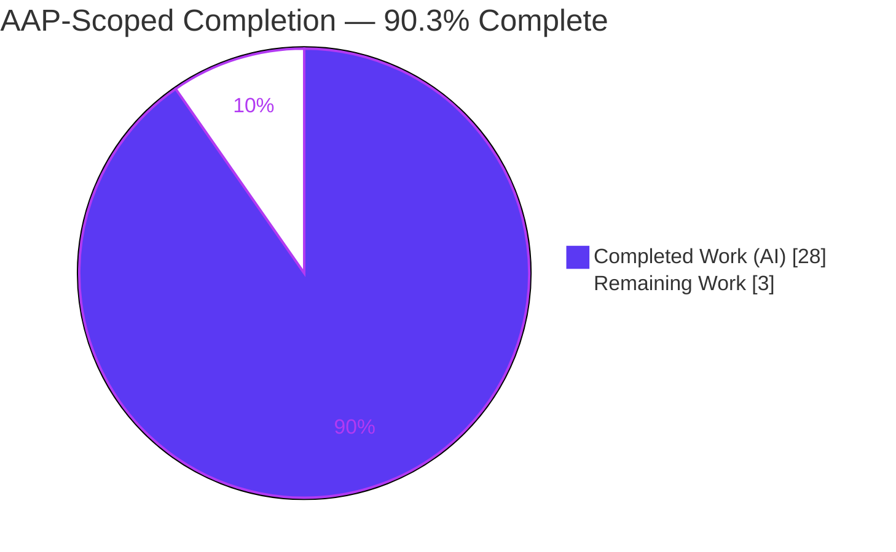
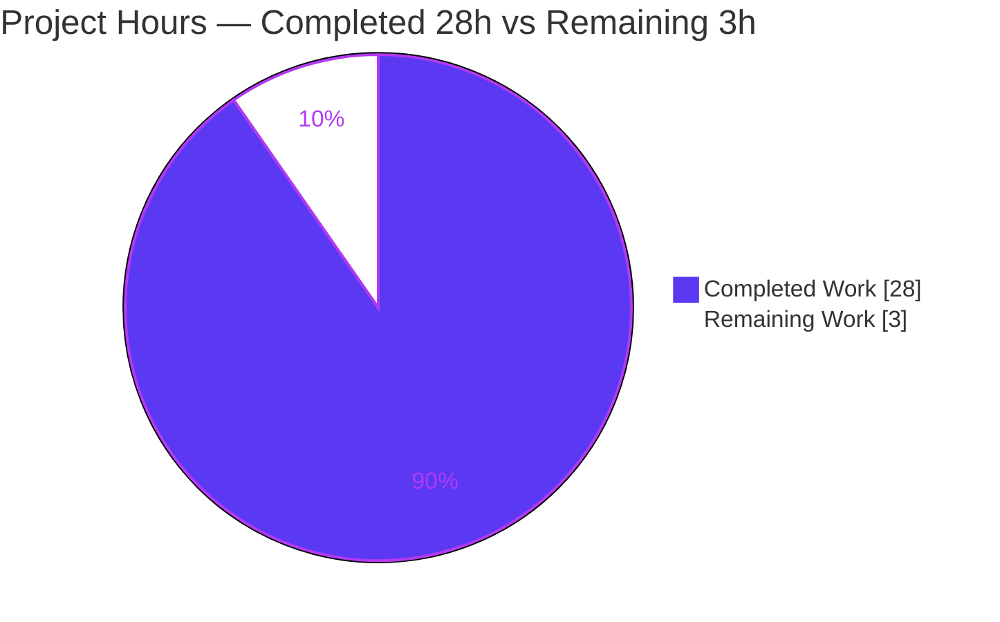
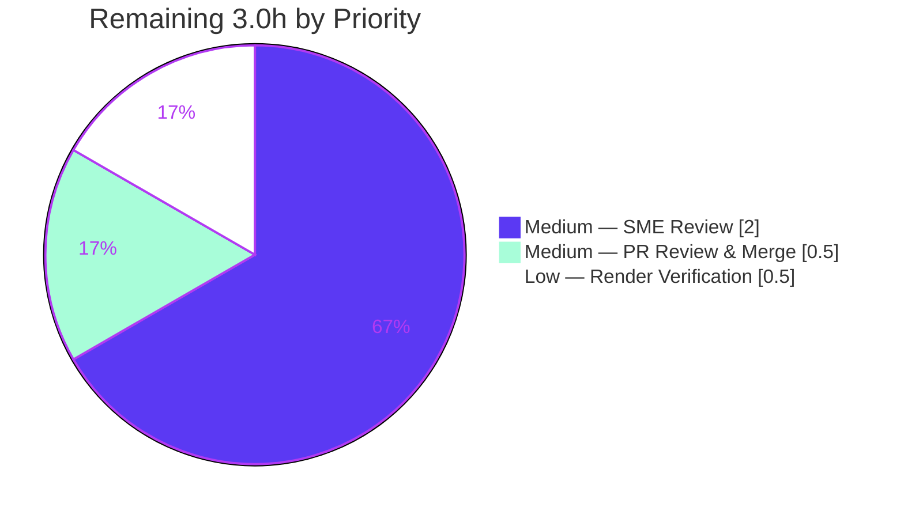

# Blitzy Project Guide

> **Project:** Runtime-Evidenced Report — *How Scapy Dissects Raw Bytes into a Nested Packet Object*
> **Branch:** `blitzy-2d54abc9-9ef7-4069-9dbc-885f7b5c3015` · **HEAD:** `1dfb266b` · **Base:** `0925ada4`
> **Deliverable:** `blitzy/documentation/scapy_0925ada48540.md` (984 lines)

---

## 1. Executive Summary

### 1.1 Project Overview

This project delivers a single, runtime-evidenced Markdown report that explains how Scapy's **dissection** engine transforms a raw capture buffer (`bytes`) into a structured, nested packet object. Targeted at an engineer onboarding into the Scapy codebase, it answers four questions with observed proof — layer hand-off (Ethernet→IP→TCP→HTTP), graceful fallback for unrecognized payloads, trust behavior on a header/content mismatch, and tunnel-depth descent (GRE) — each backed by the exact command run, its complete unedited output, and `file:line` citations to the responsible functions. The task is strictly read-only: the repository is left byte-for-byte unchanged except for the one answer document.

### 1.2 Completion Status



| Metric | Hours |
|--------|-------|
| **Total Hours** | **31.0** |
| Completed Hours (AI + Manual) | 28.0 (AI 28.0 + Manual 0.0) |
| Remaining Hours | 3.0 |
| **Percent Complete** | **90.3%** |

> Completion is computed with the PA1 AAP-scoped hours method: `28.0 / (28.0 + 3.0) × 100 = 90.3%`. All 24 AAP requirements are Completed; the 3.0 remaining hours are human path-to-production (SME review, render check, merge) — no autonomous rework remains.

### 1.3 Key Accomplishments

- ✅ **Single deliverable created** exactly as mandated: `blitzy/documentation/scapy_0925ada48540.md` (984 lines), branch-named, in a newly created `blitzy/documentation/` directory.
- ✅ **All four questions answered with runtime evidence** through the real dissection entry point (`Ether(raw)` / `IP(raw)`): Q1 layer hand-off, Q2 unrecognized-payload `Raw` fallback, Q3 header/content mismatch (the user's exact example), Q4 GRE tunnel descent.
- ✅ **Edge/error conditions exercised**, not just described: `extract_padding`→`Padding`, `NoPayload` terminal, and the two-tier `conf.debug_dissector` (0/1/2) error-handling behavior.
- ✅ **57 `file:line` citations** naming the specific functions/classes/bindings; verified byte-exact against in-repo source at HEAD.
- ✅ **Determinism confirmed** — every scenario byte-identical across two consecutive runs; re-verified from the committed document.
- ✅ **Read-only integrity preserved** — `git status --porcelain` empty; net diff vs base is exactly one added file; `scapy/`, `test/`, and config files byte-identical to base.
- ✅ **Independently re-verified by this assessment** — Q1, Q3, and Q4 reproduced byte-for-byte on the validator's environment; 8 citations spot-checked exact.

### 1.4 Critical Unresolved Issues

| Issue | Impact | Owner | ETA |
|-------|--------|-------|-----|
| *None* — no unresolved items block release or validation. | — | — | — |

> All Blitzy autonomous-validation gates passed. The only remaining items are routine human path-to-production tasks (see §1.6 and §2.2), none of which are blockers.

### 1.5 Access Issues

| System/Resource | Type of Access | Issue Description | Resolution Status | Owner |
|-----------------|----------------|-------------------|-------------------|-------|
| *None* | — | No access issues identified. The task required only the in-repo source and standard-library Python; no repository permissions, service credentials, or third-party API access were needed. | N/A | — |

### 1.6 Recommended Next Steps

1. **[Medium]** Have a network-protocol / Scapy SME perform a technical accuracy review of the report's four answers, mechanism descriptions, and `file:line` citations (≈2.0h).
2. **[Medium]** Review the pull request, confirm read-only integrity (`git diff base..HEAD` = exactly one added file), then approve and merge (≈0.5h).
3. **[Low]** Verify the Markdown renders correctly in the target viewer — mermaid flowchart, tables, and code fences (≈0.5h).

---

## 2. Project Hours Breakdown

### 2.1 Completed Work Detail

| Component | Hours | Description |
|-----------|-------|-------------|
| Dissection engine investigation + Preamble authoring | 5.0 | Traced the protocol-agnostic `dissect()` pipeline in `scapy/packet.py` (`pre_dissect→do_dissect→post_dissect→extract_padding→do_dissect_payload`); documented `guess_payload_class`/`default_payload_class`, `payload_guess`, `Raw`/`Padding`/`NoPayload`, and `conf.raw_layer` wiring; embedded the verbatim `guess_payload_class` code and the mermaid pipeline diagram. |
| Layer-binding registry investigation | 3.0 | Read and cited `bind_layers`/`bind_bottom_up` routing across `l2.py`, `inet.py`, `inet6.py`, `http.py`; the HTTP content-sniff override; and `conf.debug_dissector` semantics in `config.py`; plus `pyproject.toml` version facts. |
| Q1 evidence — Ether/IP/TCP/HTTP hand-off | 2.5 | Synthesized a real HTTP-request buffer, dissected via `Ether(raw)`, and demonstrated field-driven next-class selection at each level (`type=0x0800→IP`, `proto=6→TCP`, `dport=80→HTTP`) with complete output. |
| Q2 evidence — unrecognized payload → Raw fallback | 2.0 | Dissected a TCP segment on unbound port 40001 carrying custom bytes; showed graceful degradation to a trailing `Raw` layer preserving the exact `load`. |
| Q3 evidence — header/content mismatch + control | 3.0 | Built genuine IPv4 bytes wrapped in an Ethernet frame claiming `type=0x86dd` (IPv6); showed Scapy follows the header blindly (misparse `version=4`); added the `type=0x0800` control on identical bytes. Realizes the user's exact example. |
| Q4 evidence — IP/GRE/IP/ICMP tunnel descent | 2.5 | Dissected a GRE-tunneled buffer; showed full recursive descent through two IP layers to the inner ICMP via the `IP↔GRE` bindings. |
| Edge/error coverage | 3.0 | Demonstrated `extract_padding`→`Padding`, the `NoPayload` terminal, the `do_dissect_payload` exception fallback, and the two-tier `conf.debug_dissector` (0 silent / 1 warn / 2 raise) behavior. |
| Synthesis + coverage pass + direct answers | 2.5 | Authored the three-tier next-layer-selection model (header binding vs. field-conditioned binding vs. content-sniffing override), the per-named-item coverage table, and the one-line direct answers. |
| Web-search corroboration + version-divergence note | 1.0 | Corroborated the mechanism/terminology against Scapy's official docs; recorded the `stop_dissection_after` divergence and declared in-repo source authoritative. |
| Citation verification + AAP-drift corrections | 2.0 | Re-grepped all 57 `file:line` citations at HEAD and corrected six AAP drifts (GRE `proto` line, IPv6 no-override, `debug_dissector` line, two-tier behavior, `VERSION`, Q4 no-trailing-`Raw`). |
| Determinism runs + read-only git hygiene + commits | 1.5 | Ran each scenario twice confirming byte-identical output; kept bytecode/temp scripts out of the tree; verified `git status` empty; produced 4 clean commits. |
| **Total** | **28.0** | |

### 2.2 Remaining Work Detail

| Category | Hours | Priority |
|----------|-------|----------|
| SME Technical Accuracy Review (Documentation QA) | 2.0 | Medium |
| PR Review, Integrity Confirmation & Merge (Path-to-Production) | 0.5 | Medium |
| Markdown & Mermaid Render Verification (Documentation QA) | 0.5 | Low |
| **Total** | **3.0** | |

### 2.3 Hours Reconciliation

| Check | Result |
|-------|--------|
| Section 2.1 total (Completed) | 28.0h |
| Section 2.2 total (Remaining) | 3.0h |
| Section 2.1 + Section 2.2 | 31.0h = Total Hours (§1.2) ✓ |
| Remaining across §1.2 / §2.2 / §7 | 3.0h everywhere ✓ |
| Completion % | 28.0 / 31.0 = 90.3% ✓ |

---

## 3. Test Results

For this documentation task, the applicable "tests" are the **six embedded runtime-evidence scenarios** that Blitzy's autonomous validation extracted verbatim from the document and executed. The repository's own `test/` (UTscapy) suite is intentionally **out of scope** per AAP §0.2.3 (no tests are added or run for a documentation task). "Pass" means the script produced the document's stated output and was **byte-identical across two consecutive runs** (determinism); the definitive pass re-extracted all six scripts from the committed document.

**Framework:** in-repo Scapy `2026.07.08` on Python `3.11.13` (venv), executed via ad-hoc observation scripts through the real dissection entry point.

| Test Category (Scenario) | Framework | Total Tests | Passed | Failed | Coverage % | Notes |
|--------------------------|-----------|:-----------:|:------:|:------:|:----------:|-------|
| Q1 — Ether/IP/TCP/HTTP hand-off | Runtime dissection (Scapy 2026.07.08 / Py 3.11.13) | 1 | 1 | 0 | 100%¹ | `type=0x0800→IP`, `proto=6→TCP`, `dport=80→HTTP`; determinism confirmed. |
| Q2 — unrecognized TCP:40001 → Raw | Runtime dissection | 1 | 1 | 0 | 100%¹ | Graceful `Raw` fallback; exact `load` preserved. |
| Q3 — Ether type=0x86dd over IPv4 + control | Runtime dissection | 1 | 1 | 0 | 100%¹ | Header-blind IPv6 misparse (`version=4`) + `type=0x0800` control. |
| Q4 — IP/GRE/IP/ICMP tunnel descent | Runtime dissection | 1 | 1 | 0 | 100%¹ | Full recursive descent; two IP layers. |
| Q5 — extract_padding → Padding + NoPayload | Runtime dissection | 1 | 1 | 0 | 100%¹ | Padding split + terminal `NoPayload`. |
| Q6 — conf.debug_dissector 0/1/2 tiers | Runtime dissection | 1 | 1 | 0 | 100%¹ | Two-tier behavior; stderr adds 3 ERROR lines at levels 1/2. |
| **Total** | | **6** | **6** | **0** | **100%¹** | 12/12 runs byte-identical (6 scenarios × 2 runs). |

¹ *Coverage is **behavioral** — 100% of the AAP-named dissection behaviors/items are exercised with observed evidence. Line/branch code-coverage is not applicable: no unit tests were added (out of AAP scope for a documentation task).*

> **Integrity note:** All six scenarios originate from Blitzy's autonomous validation logs (Gate 1: 24/24 checks across two runs; Gate 10: 12/12 from the committed document). This assessment independently re-ran Q1, Q3, and Q4 on the same environment and obtained byte-identical output.

---

## 4. Runtime Validation & UI Verification

**Runtime health**

- ✅ **Operational** — In-repo Scapy imports cleanly: `scapy.VERSION = 2026.07.08`, `scapy.__file__` resolves to the in-tree package.
- ✅ **Operational** — The real dissection entry point (`Ether(raw)` / `IP(raw)`) executes end-to-end for every scenario; the `dissect()` pipeline runs on real bytes.
- ✅ **Operational** — Independently reproduced by this assessment: Q1 (`raw len 101`, `[Ether, IP, TCP, HTTP, HTTPRequest]`), Q3 (`version=4` misparse; `0x0800` control clean), Q4 (`[IP, GRE, IP, ICMP]`, inner `192.168.1.1→192.168.1.2`).
- ✅ **Operational** — `python -m compileall scapy/` exits 0 (zero syntax errors); document code fences balanced (58, even).

**API integration**

- ➖ **Not applicable** — The task exercises an offline, in-process Python library path only; there is no external API, service, or network dependency.

**UI verification**

- ➖ **Not applicable** — This project has no user interface. The deliverable is a Markdown document backing a Python-library investigation. The only visual artifact is the embedded mermaid flowchart, which is well-formed (`flowchart TD`, single block) and renders in GitHub-compatible Markdown viewers (see §2.2 render-verification task).

**Environment caveat (not a result)**

- ⚠ **Partial (cosmetic)** — Importing Scapy emits a `CryptographyDeprecationWarning` (TripleDES) to stderr from `scapy/layers/ipsec.py:573/577`. It is non-fatal, appears once per process before any dissection, and is explicitly labeled in the report as an environment caveat, not a dissection result.

---

## 5. Compliance & Quality Review

The table cross-maps each AAP deliverable/rule to its quality benchmark and current status. Fixes applied during autonomous validation are noted.

| AAP Deliverable / Rule | Benchmark | Status | Notes / Fixes Applied |
|------------------------|-----------|:------:|-----------------------|
| Single branch-named deliverable | Exactly one new file at correct path | ✅ Pass | `blitzy/documentation/scapy_0925ada48540.md`; dir created. |
| Run-first, then write | Answers written from captured runtime output | ✅ Pass | All four answers backed by executed scripts. |
| Real entry point exercised | `Ether(raw)`/`IP(raw)`, no bypass/stand-in | ✅ Pass | Verified by independent reproduction. |
| Every edge/error condition | Primary + edge/error paths exercised | ✅ Pass | Q2 fallback, Q3 mismatch+control, Q4 depth, extract_padding/NoPayload, debug_dissector 0/1/2. |
| Complete, unedited output + command | Full output shown per claim | ✅ Pass | stdout+stderr shown for every scenario; nothing truncated. |
| Exact `file:line` + named symbol | Cite specific function/class/binding | ✅ Pass | 57 citations verified byte-exact at HEAD. |
| Determinism at adequate scale | Stable across ≥2 identical runs | ✅ Pass | Byte-identical ×2; re-checked from committed doc. |
| Authoritative source precedence | In-repo HEAD over published docs | ✅ Pass | `stop_dissection_after` divergence recorded. |
| Web-search corroboration | Canonical terminology validated | ✅ Pass | `bind_layers`/`guess_payload_class`/`Raw` fallback corroborated. |
| Coverage pass | Every named item addressed by name | ✅ Pass | Coverage table: Ether, IP, TCP, HTTP, IPv6/IPv4 mismatch, GRE, Raw, ICMP, Padding/NoPayload. |
| AAP-drift corrections | Report matches source, not stale AAP | ✅ Pass | 6 corrections (GRE `proto` line, IPv6 no-override, `debug_dissector` line, two-tier, `VERSION`, Q4 no-trailing-`Raw`). |
| Read-only scope | Repo byte-for-byte unchanged | ✅ Pass | `git status` empty; scapy/test/config byte-identical to base. |
| Temp-script removal | No stray scripts/bytecode in tree | ✅ Pass | Scripts lived under `/tmp`; `PYTHONPYCACHEPREFIX` kept bytecode out. |
| Compilation integrity | No syntax errors introduced | ✅ Pass | `compileall scapy/` exit 0 (source untouched). |
| Exactness fixes (validation) | Verbatim quotes & metadata exact | ✅ Pass | Python version string corrected; `# type: ignore` restored in the `guess_payload_class` quote. |

**Overall compliance:** 15/15 benchmarks Pass. No outstanding compliance items.

---

## 6. Risk Assessment

| Risk | Category | Severity | Probability | Mitigation | Status |
|------|----------|:--------:|:-----------:|------------|--------|
| Source/version drift — citations & runtime evidence pinned to in-repo HEAD; future Scapy edits could shift line numbers/behavior | Technical | Low | Medium | Document pins HEAD commit and declares in-repo source authoritative; re-grep the 57 citations on any version bump | Mitigated (documented) |
| Environment-specific captured output — outputs embed absolute container paths and the TripleDES import warning tied to this container | Technical | Low | Medium | Report explicitly labels paths/warning as environment caveats, not dissection results | Mitigated (documented) |
| Markdown/mermaid render — diagram/tables not auto-validated in the target viewer | Operational | Low | Low | Human render-verification task (§2.2); content remains readable as code if mermaid unsupported | Open (human check) |
| Reproducibility path-dependence — run commands assume `venv` + `PYTHONPATH="$PWD"` | Operational | Low | Low | Development Guide (§9) generalizes the commands and env vars | Mitigated (documented) |
| Security exposure | Security | None | — | Read-only task; no source/dependency changes, no secrets, no network or runtime attack surface introduced | No risk identified |
| Integration failure | Integration | None | — | No external service, API, credential, webhook, or network dependency in scope; standard library only | No risk identified |

**Overall risk posture: LOW.** No High- or Medium-severity blockers. The two Low technical risks are already mitigated by the document's own pinning and caveats; the operational items resolve via the human path-to-production tasks.

---

## 7. Visual Project Status

**Project hours breakdown** (Completed = Dark Blue `#5B39F3`, Remaining = White `#FFFFFF`):



**Remaining hours by priority** (from §2.2):



| Category | Remaining Hours |
|----------|:---------------:|
| SME Technical Accuracy Review | 2.0 |
| PR Review, Integrity Confirmation & Merge | 0.5 |
| Markdown & Mermaid Render Verification | 0.5 |
| **Total Remaining** | **3.0** |

> **Integrity:** "Remaining Work" = **3.0h** in the pie chart matches Remaining Hours in §1.2 and the sum of the §2.2 Hours column exactly.

---

## 8. Summary & Recommendations

**Achievements.** The project is **90.3% complete** on an AAP-scoped basis (28.0 of 31.0 hours). All 24 AAP requirements are Completed: a single, correctly named, runtime-evidenced Markdown report answers the four questions about Scapy's dissection engine, each through the real entry point with complete unedited output and exact `file:line` citations. The report goes beyond the happy path — exercising unrecognized-payload fallback, a deliberate header/content mismatch (the user's exact example), deep GRE tunneling, padding/`NoPayload` terminals, and the two-tier `conf.debug_dissector` error handling — and even self-corrects six citation drifts in the AAP against the authoritative in-repo source.

**Remaining gaps.** There is **no remaining autonomous work** — no failing checks, no missing functionality, no rework. The 3.0 remaining hours are entirely human path-to-production: a network-protocol SME accuracy review (2.0h), PR review/merge with read-only integrity confirmation (0.5h), and a Markdown/mermaid render check (0.5h).

**Critical path to production.** SME technical review → render verification → PR approval and merge. None of these are blockers; they are quality gates appropriate for a technical document about a complex library.

**Success metrics.** Read-only integrity preserved (`git status` empty; net diff = one added file); six runtime-evidence scenarios pass with byte-identical determinism; 57 citations verified byte-exact; independent reproduction of Q1/Q3/Q4 confirms the evidence.

**Production readiness assessment.** **Ready for human review and merge.** The deliverable meets every AAP rule and quality benchmark; risk posture is Low with no security or integration exposure. Recommended action: assign the SME review and merge upon sign-off.

---

## 9. Development Guide

> This project has no application or server to run. The "build & run" is **reproducing the runtime evidence** that backs the report. Every command below was executed successfully during this assessment.

### 9.1 System Prerequisites

- **OS:** Linux (Ubuntu container); macOS or WSL also work.
- **Python:** `>=3.7, <4` (`pyproject.toml:17`). Canonical observed runtime: **Python 3.11.13** (venv). System Python 3.13 also imports the package.
- **Git + Git LFS** (repository uses LFS hooks).
- **Dependencies:** Standard library only for the dissection path — no third-party package is required.

### 9.2 Environment Setup

```bash
# 1) Move to the repository root
cd /tmp/blitzy/scapy/blitzy-2d54abc9-9ef7-4069-9dbc-885f7b5c3015_66543a

# 2) Confirm branch and interpreter
git rev-parse --abbrev-ref HEAD                  # -> blitzy-2d54abc9-9ef7-4069-9dbc-885f7b5c3015
/tmp/blitzy/scapy/venv311/bin/python --version   # -> Python 3.11.13
```

The in-tree package is imported by putting the repo root on `PYTHONPATH` (equivalent to the repo's `run_scapy` launcher, which sets `PYTHONPATH=$DIR`). `PYTHONPYCACHEPREFIX` keeps bytecode out of the tree so `git status` stays empty.

### 9.3 Dependency Installation

No installation is required to reproduce the evidence. To create a fresh virtual environment on another machine:

```bash
python3 -m venv .venv && source .venv/bin/activate
# (Optional) install extras used by other Scapy features — NOT needed for dissection:
# pip install cryptography
```

### 9.4 Verify Scapy Import

```bash
cd /tmp/blitzy/scapy/blitzy-2d54abc9-9ef7-4069-9dbc-885f7b5c3015_66543a
PYTHONPYCACHEPREFIX=/tmp/scapy_pycache PYTHONPATH="$PWD" \
  /tmp/blitzy/scapy/venv311/bin/python -c \
  "import scapy; print('VERSION', scapy.VERSION); print('path', scapy.__file__)"
# Expected:
#   VERSION 2026.07.08
#   path .../blitzy-2d54abc9-9ef7-4069-9dbc-885f7b5c3015_66543a/scapy/__init__.py
```

### 9.5 Reproduce the Runtime Evidence

Observation scripts live **outside** the repository (e.g. `/tmp/scapy_obs/`). Run any scenario with the canonical pattern, separating streams:

```bash
cd /tmp/blitzy/scapy/blitzy-2d54abc9-9ef7-4069-9dbc-885f7b5c3015_66543a
PYTHONPYCACHEPREFIX=/tmp/scapy_pycache PYTHONPATH="$PWD" \
  /tmp/blitzy/scapy/venv311/bin/python /tmp/scapy_obs/<script>.py \
  > /tmp/scapy_obs/qN.stdout 2> /tmp/scapy_obs/qN.stderr
```

Example — Q4 (GRE tunnel descent), which this assessment reproduced:

```python
from scapy.all import IP, GRE, ICMP
pkt = IP(src="203.0.113.1", dst="203.0.113.2")/GRE()/IP(src="192.168.1.1", dst="192.168.1.2")/ICMP()
d = IP(bytes(pkt))
print("layers():", [c.__name__ for c in d.layers()])   # ['IP','GRE','IP','ICMP']
print("outer IP.proto =", d.proto)                       # 47 (GRE)
print("GRE.proto = 0x%04x" % d[GRE].proto)               # 0x0800 (IPv4)
```

### 9.6 View the Deliverable

```bash
cd /tmp/blitzy/scapy/blitzy-2d54abc9-9ef7-4069-9dbc-885f7b5c3015_66543a
wc -l   blitzy/documentation/scapy_0925ada48540.md      # -> 984
less    blitzy/documentation/scapy_0925ada48540.md
```

### 9.7 Read-Only Integrity Check

```bash
cd /tmp/blitzy/scapy/blitzy-2d54abc9-9ef7-4069-9dbc-885f7b5c3015_66543a
git status --porcelain                                         # (empty = pristine)
git diff --name-status 0925ada4..HEAD                          # -> A blitzy/documentation/scapy_0925ada48540.md
git diff --stat 0925ada4..HEAD -- scapy/ test/ pyproject.toml  # (empty = unchanged)
```

### 9.8 Troubleshooting

- **`ModuleNotFoundError: scapy`** → run from the repo root and set `PYTHONPATH="$PWD"`.
- **`__pycache__` shows up in `git status`** → set `PYTHONPYCACHEPREFIX=/tmp/scapy_pycache`.
- **`CryptographyDeprecationWarning` on stderr** → cosmetic; from `scapy/layers/ipsec.py:573/577`; only appears when `cryptography` is installed; not a dissection result.
- **Different Python version** → dissection is pure Python and version-independent; outputs are unaffected.

---

## 10. Appendices

### A. Command Reference

| Purpose | Command |
|---------|---------|
| Interpreter version | `/tmp/blitzy/scapy/venv311/bin/python --version` |
| Import & version check | `PYTHONPATH="$PWD" python -c "import scapy; print(scapy.VERSION)"` |
| Run a scenario | `PYTHONPYCACHEPREFIX=/tmp/scapy_pycache PYTHONPATH="$PWD" python /tmp/scapy_obs/<script>.py > out 2> err` |
| Compile-check source | `python -m compileall scapy/` |
| Deliverable line count | `wc -l blitzy/documentation/scapy_0925ada48540.md` |
| Read-only integrity | `git status --porcelain` · `git diff --name-status 0925ada4..HEAD` |
| Verify authorship | `git log --author="agent@blitzy.com" 0925ada4..HEAD --oneline` |

### B. Port Reference

No process listens on any network port — the investigation is **offline, in-process dissection** of byte buffers. The following are **protocol header-field values used as dissection inputs**, not listening sockets:

| Value | Meaning in scenario |
|-------|---------------------|
| TCP `dport = 80` | Bound to HTTP → drives `TCP→HTTP` hand-off (Q1) |
| TCP `dport = 40001` | Unbound → no match → graceful `Raw` fallback (Q2) |
| Ether `type = 0x0800` / `0x86dd` | IPv4 / IPv6 selector at the Ethernet layer (Q1/Q3) |
| IP `proto = 47` / GRE `proto = 0x0800` | GRE / inner-IPv4 selectors (Q4) |

### C. Key File Locations

| Path | Role |
|------|------|
| `blitzy/documentation/scapy_0925ada48540.md` | **The deliverable** (only file written) |
| `scapy/packet.py` | Dissection engine (referenced, unchanged) |
| `scapy/layers/l2.py` | `Ether`, `GRE` + bindings (referenced) |
| `scapy/layers/inet.py` | `IP`, `TCP`, `UDP`, `ICMP` + bindings (referenced) |
| `scapy/layers/inet6.py` | `IPv6` + `Ether→IPv6` binding (referenced) |
| `scapy/layers/http.py` | `HTTP` + `TCP→HTTP` + content-sniff override (referenced) |
| `scapy/config.py` | `conf.debug_dissector` semantics (referenced) |
| `run_scapy` | Launcher (`PYTHONPATH=$DIR python3 -m scapy`) |

### D. Technology Versions

| Component | Version |
|-----------|---------|
| Scapy (in-repo) | `2026.07.08` |
| Python (canonical runtime) | `3.11.13` |
| Python (constraint) | `>=3.7, <4` (`pyproject.toml:17`) |
| Git LFS | `3.7.1` |
| Base commit | `0925ada485406684174d6f068dbd85c4154657b3` |
| HEAD commit | `1dfb266b3815024bb68dcc9db753b3c1f2e74b0b` |

### E. Environment Variable Reference

| Variable | Value | Purpose |
|----------|-------|---------|
| `PYTHONPATH` | `"$PWD"` (repo root) | Import the in-tree Scapy package |
| `PYTHONPYCACHEPREFIX` | `/tmp/scapy_pycache` | Keep bytecode out of the repo tree (preserves read-only integrity) |

### F. Developer Tools Guide

| Tool | Use |
|------|-----|
| `python -m compileall scapy/` | Confirm source has no syntax errors (source is unchanged) |
| `git diff --stat <base>..HEAD` | Confirm exactly one file added |
| `diff` (two runs) | Confirm determinism of scenario output |
| `grep -n '<symbol>' scapy/**.py` | Resolve/verify `file:line` citations at HEAD |
| Markdown viewer with mermaid | Render the pipeline flowchart and pie charts |

### G. Glossary

| Term | Meaning |
|------|---------|
| **Dissection** | Turning raw `bytes` into a structured, nested packet object (bytes → object). |
| **`dissect()` pipeline** | `pre_dissect → do_dissect → post_dissect → extract_padding → do_dissect_payload` in `scapy/packet.py`. |
| **`guess_payload_class`** | Selects the next layer by matching the current layer's header fields against the `payload_guess` table. |
| **`payload_guess`** | Per-class binding table populated by `bind_layers` / `bind_bottom_up`. |
| **`default_payload_class`** | Fallback returning `conf.raw_layer` (`Raw`) when no binding matches. |
| **`Raw`** | Terminal layer holding unstructured leftover bytes in `Raw.load`. |
| **`NoPayload`** | Sentinel a layer carries when no bytes remain. |
| **`conf.debug_dissector`** | Controls error handling: `0` silent `Raw` fallback, `1` warn then fall back, `2` re-raise. |
| **Real entry point** | Feeding raw bytes to a layer constructor (`Ether(raw)` / `IP(raw)`), which triggers `dissect()`. |