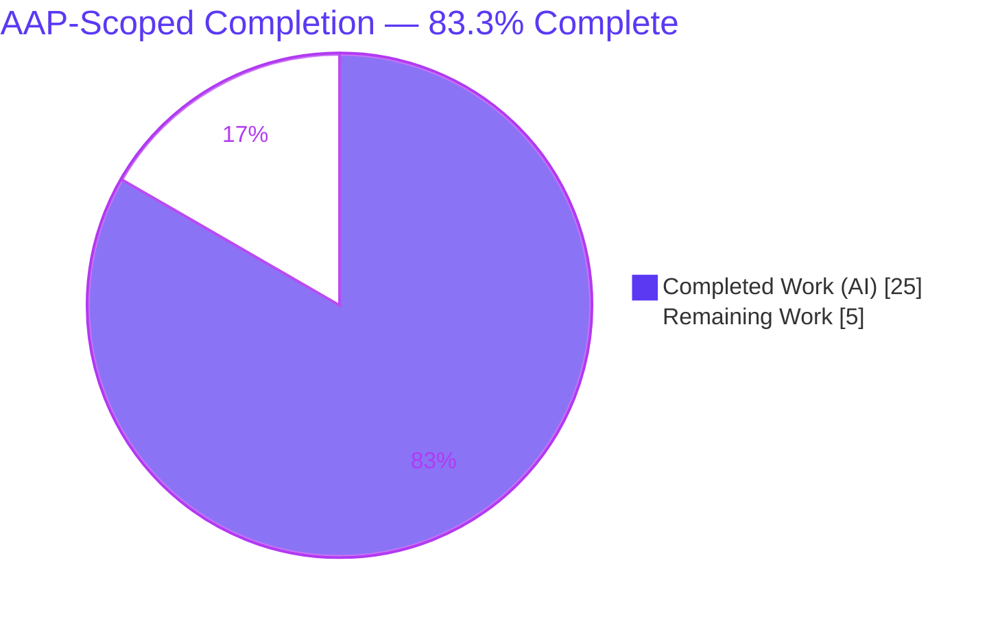
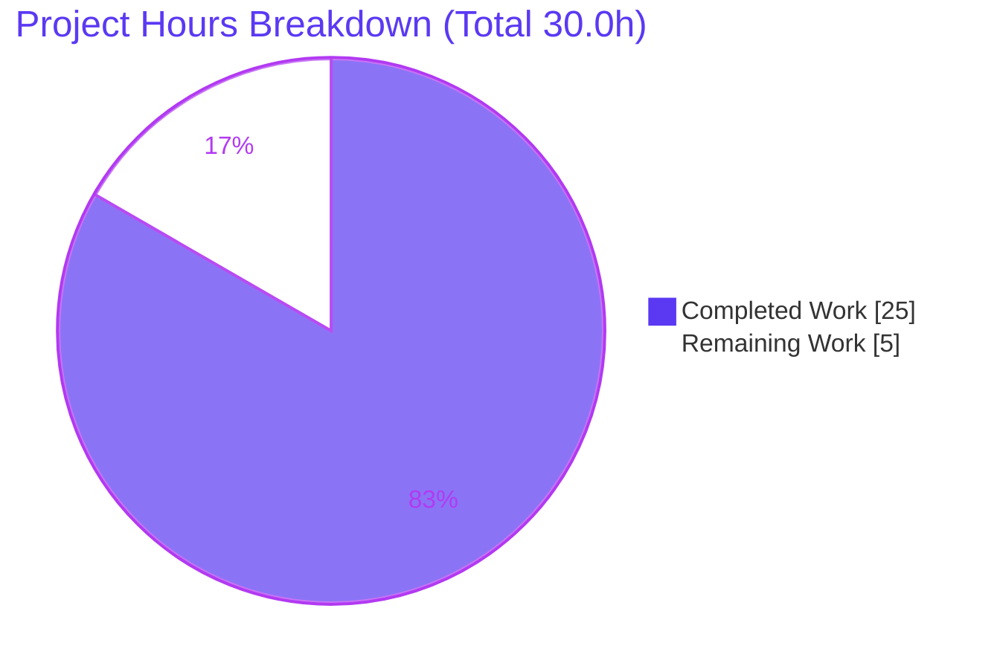
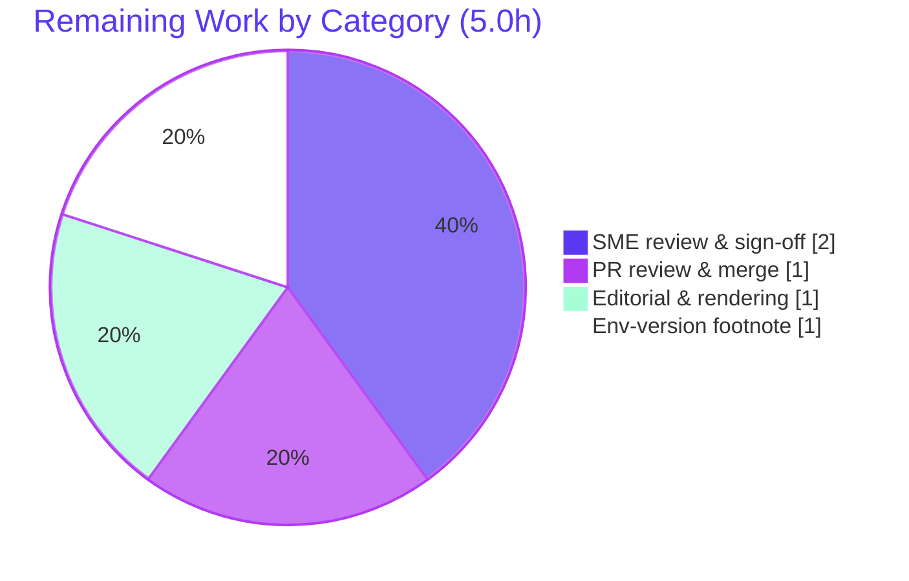

# Blitzy Project Guide — Scapy ISO-TP (ISO 15765-2) Message-Segmentation Onboarding Q&A

> **Task type:** Documentation — investigative, code-grounded Q&A knowledge artifact
> **Branch:** `blitzy-c6adf035-ffb3-48b7-bbf0-020143a51989` · **Base:** `0925ada4` · **HEAD:** `475f501c`
> **Brand legend:** <span style="color:#5B39F3">**■ Completed / AI Work — Dark Blue `#5B39F3`**</span> · **□ Remaining — White `#FFFFFF`**

---

## 1. Executive Summary

### 1.1 Project Overview

This project delivers a single, self-contained Markdown knowledge document that authoritatively answers seven onboarding questions about how **Scapy's ISO-TP (ISO 15765-2) automotive transport-protocol module performs message segmentation**. The target audience is engineers onboarding to Scapy's automotive stack. Every answer is grounded in the actual Scapy source code (via `path:line` citations) and corroborated with captured runtime execution evidence and the ISO 15765-2 standard. The technical scope is read-only investigation of the `scapy/contrib/isotp/` package plus pure-Python runtime experiments; the Scapy source tree is studied as the source of truth but is **never modified**. The deliverable is one file: `blitzy/documentation/scapy_0925ada48540.md`.

### 1.2 Completion Status



| Metric | Hours |
|--------|-------|
| **Total Hours** | **30.0** |
| Completed Hours — AI (autonomous) | 25.0 |
| Completed Hours — Manual | 0.0 |
| **Completed Hours (AI + Manual)** | **25.0** |
| **Remaining Hours** | **5.0** |
| **Percent Complete (AAP-scoped)** | **83.3%** |

> **Calculation (PA1, AAP-scoped):** Completion % = Completed ÷ (Completed + Remaining) = 25.0 ÷ 30.0 = **83.3%**. All AAP-specified content and constraints are 100% complete; the remaining 5.0 hours are path-to-production activities that require a human (SME review, editorial pass, version footnote, PR merge).

### 1.3 Key Accomplishments

- ✅ **Single deliverable authored & committed:** `blitzy/documentation/scapy_0925ada48540.md` (600 lines, 36,072 bytes) on branch `blitzy-c6adf035-...`, across 3 clean commits by `agent@blitzy.com`.
- ✅ **All 7 questions (R1–R7) answered** with code citations, ISO 15765-2 rationale, and verbatim runtime evidence for the empirical questions (R3, R6, R7).
- ✅ **54 `path:line` citations** spanning 8 source files — independently spot-checked; **zero inaccuracies**.
- ✅ **Runtime evidence captured & reproduced:** Experiment 1 (framing) matches byte-for-byte; Experiment 2 (receive timeout) matches (only per-run timing varies).
- ✅ **ISO-TP unit suite green:** `test/contrib/isotp_packet.uts` → **49 passed / 0 failed** (independently re-run).
- ✅ **No-source-mutation constraint honored perfectly:** diff vs base = exactly **1 file added (600 insertions, 0 deletions)**; working tree pristine; all 10 cited source files unmodified.
- ✅ **Code-truth nuances surfaced:** corrected the "5000 bytes is absurdly large" premise (it's within ISO-TP 2016 limits → 715 frames, no error); documented that a missing middle frame raises **no exception** (silent reset); disclosed the normal-vs-extended addressing dependency.

### 1.4 Critical Unresolved Issues

| Issue | Impact | Owner | ETA |
|-------|--------|-------|-----|
| _None — no release-blocking issues_ | The deliverable is production-ready, validated, and committed. All open items are minor/path-to-production (see §1.6 and §2.2). | — | — |

> The Final Validator reported **PRODUCTION-READY** across all five gates; independent re-verification in this assessment confirmed it. There are **no compilation errors, no failing tests, and no missing answers**.

### 1.5 Access Issues

| System/Resource | Type of Access | Issue Description | Resolution Status | Owner |
|-----------------|----------------|-------------------|-------------------|-------|
| _No access issues identified_ | — | Local repository and git-ignored `.venv` (Python 3.13.7 + editable Scapy 2026.06.26) are fully accessible. No CAN hardware, `python-can`, external services, credentials, or network access are required for this task. | N/A | — |

### 1.6 Recommended Next Steps

1. **[High]** Conduct SME technical-accuracy review & sign-off of the 600-line document, focusing on the nuanced claims (R6 frame-count arithmetic; R7 silent-reset / bare-`recv()`-blocks distinction) and a spot-check of the 54 citations. _(2.0h)_
2. **[Medium]** Review, approve, and merge the PR for branch `blitzy-c6adf035-...`, confirming the single-file diff and clean working tree. _(1.0h)_
3. **[Medium]** Render the Markdown in the target viewer and verify the mermaid flowchart, tables, anchor links, and code blocks display correctly. _(1.0h)_
4. **[Low]** Add a one-line footnote reconciling the environment version (AAP §0.2.3 cited Python 3.12.3; evidence was captured under Python 3.13.7 — behavior is version-independent). _(1.0h)_

---

## 2. Project Hours Breakdown

### 2.1 Completed Work Detail

All completed work was performed autonomously (AI). Each component traces to a specific AAP requirement.

| Component | Hours | Description |
|-----------|-------|-------------|
| R1 — Environment setup & module loading (§1) | 3.0 | venv/Scapy setup; `load_contrib('isotp')` mechanism; "ISO-TP is a sibling of `automotive`" framing correction; `ISOTPSocket → ISOTPSoftSocket` default. Authored Section 1 + subsections 1.1–1.4. |
| ISO-TP frame-format primer (§2) | 2.0 | SF/FF/CF/FC packet classes, PCI nibbles, `guess_payload_class`; authored the mermaid frame-format primer. |
| R2 — Segmentation trigger (§3) | 1.5 | Reverse-engineered the `fragment()` decision logic (Single Frame vs First Frame + Consecutive Frames). |
| R3/R4 — 20-byte framing + leading bytes + Experiment 1 (§4–5) | 3.0 | Designed/ran the framing experiment; frame-by-frame analysis; rationale for leading bytes `0x10 0x14` / `0x21` / `0x22`. |
| R5 — Single-frame ceiling + sweep (§6) | 1.5 | `data_bytes_in_frame` analysis; 6/7/8-byte + extended-address sweep; 7-byte (normal) / 6-byte (extended) ceiling. |
| R6 — 5000-byte escape-header analysis (§7) | 2.0 | 32-bit FF_DL escape header; 715-frame arithmetic; `Scapy_Exception` only above 4,294,967,295 bytes. |
| R7 — Receive-timeout state machine + Experiment 2 (§8) | 5.0 | `ISOTPSoftSocket` receive state machine; paired `TestSocket(CAN)` experiment; `cf_timeout`/silent-reset/no-exception; bare-`recv()`-blocks nuance. |
| ISO 15765-2 standard research (§10.2) | 2.0 | Web research & corroboration; python-can-isotp / kernel `can-isotp` divergence nuance. |
| Document assembly, summary table & references (§9, §10.1, §10.3, overview) | 2.0 | 600-line structure; consolidated answer table; 54 locators; reproduction notes; anchor links. |
| QA & validation refinement (3-commit cycle) | 3.0 | Citation verification, experiment re-runs, UTS suite, Markdown well-formedness, R1/R7 corrections, working-tree-clean checks. |
| **Total Completed** | **25.0** | |

### 2.2 Remaining Work Detail

All remaining work is path-to-production and requires a human. No AAP-specified content remains.

| Category | Hours | Priority |
|----------|-------|----------|
| SME technical-accuracy review & sign-off | 2.0 | High |
| PR review, approval & merge | 1.0 | Medium |
| Editorial & Markdown rendering review | 1.0 | Medium |
| Environment-version footnote reconciliation | 1.0 | Low |
| **Total Remaining** | **5.0** | |

### 2.3 Hours Reconciliation

| Check | Value | Status |
|-------|-------|--------|
| Section 2.1 total (Completed) | 25.0 | ✅ |
| Section 2.2 total (Remaining) | 5.0 | ✅ |
| 2.1 + 2.2 = Total (§1.2) | 30.0 | ✅ |
| Remaining matches §1.2 ↔ §2.2 ↔ §7 | 5.0 | ✅ |
| Completion % (25.0 ÷ 30.0) | 83.3% | ✅ |

---

## 3. Test Results

All tests below originate from Blitzy's autonomous validation logs for this project and were independently re-executed during this assessment.

| Test Category | Framework | Total Tests | Passed | Failed | Coverage % | Notes |
|---------------|-----------|-------------|--------|--------|------------|-------|
| Unit — ISO-TP packet / fragment / defragment | UTScapy (`.uts`) | 49 | 49 | 0 | 100% of cited behaviors | Confirms FF/CF parse (`isotp_packet.uts:L129-157`) and 5000-byte extended-addressing fragment↔defragment round-trip (`L437-441`). |
| Runtime Evidence — Experiment 1 (framing) | Python + Scapy harness | 1 | 1 | 0 | R3 / R4 / R5 / R6 | Byte-for-byte match to embedded output: 20→3 frames (`0x10/0x21/0x22`), 5000→715 frames, FF escape header `100000001388`, last CF `0x2a`. |
| Runtime Evidence — Experiment 2 (receive timeout) | Python + paired `TestSocket(CAN)` | 1 | 1 | 0 | R7 | Matches embedded output (only per-run timing varies): `cf_timeout=1s`, silent reset to idle, **no exception**, verbose-only warning. |
| Citation Accuracy Verification | Static source cross-check | 54 | 54 | 0 | 100% | Every `path:line` locator verified against the pinned source; zero inaccuracies. |
| **Aggregate** | — | **105** | **105** | **0** | — | Heterogeneous: 49 unit assertions + 2 runtime experiments + 54 citation checks. |

> **Integrity note:** No application/feature tests were authored (documentation-only task). The 49-test ISO-TP unit suite is the pre-existing Scapy suite, run to confirm the cited behaviors; it was **not modified**.

---

## 4. Runtime Validation & UI Verification

**Runtime health (✅ Operational / ⚠ Partial / ❌ Failing):**

- ✅ **Module load (R1):** `load_contrib('isotp')` and `from scapy.contrib.isotp import ISOTP, ISOTPSocket` succeed under Scapy 2026.06.26.
- ✅ **Socket selection (R1):** `ISOTPSocket` resolves to the pure-Python `ISOTPSoftSocket` by default (verified at runtime).
- ✅ **Framing (R3/R4/R5/R6):** Experiment 1 reproduces the embedded evidence byte-for-byte (20→3 frames; 6/7-byte SINGLE; 8-byte SEGMENTED; ext-addr 6→1/7→2; 5000→715 frames).
- ✅ **Receive timeout (R7):** Experiment 2 reproduces the documented behavior — `cf_timeout=1s`, silent reset to `ISOTP_IDLE`, **no exception**, verbose-only warning `"RX state was reset due to timeout"`.
- ✅ **Unit suite:** `test/contrib/isotp_packet.uts` → 49 passed / 0 failed.

**UI verification:** ⚠ **Not applicable** — Scapy's ISO-TP module is a programmatic/terminal library and the deliverable is a Markdown document. No graphical user interface exists; the Design System Alignment Protocol does not apply.

**API / external integration:** ⚠ **Not applicable** — no external APIs, services, network calls, or credentials are involved. `python-can` is present in the venv but irrelevant (framing is pure Python; the receive demo uses an in-memory `TestSocket`).

---

## 5. Compliance & Quality Review

The governing rule set is **`SWE-AtlasQnA-Repo`**. Each directive is cross-mapped to its compliance status below.

| AAP / Rule Deliverable | Benchmark | Status | Progress | Evidence |
|------------------------|-----------|--------|----------|----------|
| Single Markdown deliverable, branch-named | `scapy_0925ada48540.md` exists | ✅ Pass | 100% | `git ls-files` confirms path & name |
| Fixed destination directory | In `blitzy/documentation/` | ✅ Pass | 100% | Directory created; file present |
| All 7 questions answered (R1–R7) | One section per question | ✅ Pass | 100% | Sections 1, 3–8 + summary table §9 |
| Code is the source of truth | `path:line` citations | ✅ Pass | 100% | 54 locators, all accurate |
| Show rationale / "thinking" | Explanation per answer | ✅ Pass | 100% | "Why" prose throughout (e.g., FF = `0x1000+20`) |
| Build & run for evidence | Captured runtime output | ✅ Pass | 100% | Experiments 1 & 2 embedded & reproduced |
| Empirical claims substantiated (R3/R6/R7) | Verbatim stdout | ✅ Pass | 100% | Byte-for-byte / behavior match |
| ISO 15765-2 validation | Standard corroboration | ✅ Pass | 100% | §10.2 + divergence nuance |
| No source-file modification | Zero repo files edited | ✅ Pass | 100% | Diff = 1 file added; 10 cited files unmodified |
| No extra code in source repo | Temp scripts removed | ✅ Pass | 100% | Working tree clean (`git status --porcelain` empty) |
| Markdown well-formedness | Balanced fences/tables/anchors | ✅ Pass | 100% | 22 fences balanced, 1 mermaid block closed, tables valid, anchors resolve |

**Fixes applied during autonomous validation:** R1 `load_contrib` mechanism correction and R7 receive-semantics correction (commit `3cfc39ee`); two QA documentation-accuracy findings (commit `475f501c`).
**Outstanding compliance items:** None. Quality posture is **green**.

---

## 6. Risk Assessment

| Risk | Category | Severity | Probability | Mitigation | Status |
|------|----------|----------|-------------|------------|--------|
| Citation line-number drift if upstream Scapy is refactored | Technical | Low | Medium | Doc pins Scapy `2026.06.26` + base commit `0925ada4` in §10.3; re-validate on upgrade | Mitigated (documented) |
| Environment-version mismatch (AAP cited Python 3.12.3; evidence captured under 3.13.7) | Technical | Low | High | Add reconciling footnote; ISO-TP framing/timeout behavior is version-independent (reproduced identically) | Open (minor) |
| Experiment 2 teardown hang if re-run without `os._exit(0)` | Technical | Low | Low | §10.3 reproduction notes document the `os._exit(0)` requirement (TimeoutScheduler poll thread) | Mitigated (documented) |
| Experiment 2 per-run timing variance breaks strict byte-diff | Technical | Very Low | High | Doc explicitly states only the timing line differs per run | Mitigated |
| No new attack surface introduced | Security | None | N/A | Documentation-only; zero code/dependency/endpoint/data changes | N/A (no risk) |
| Discoverability — artifact outside Scapy `doc/` tree, not indexed | Operational | Low | Medium | Surface via PR description / onboarding index (editing repo docs is forbidden by the no-mutation constraint) | Accepted (constraint-driven) |
| No automated CI freshness check for citations/evidence | Operational | Low | Medium | Optional follow-up doctest/CI gate (out of current scope) | Open (low priority) |
| Merge to target branch | Integration | Very Low | Very Low | Single new file in a new directory; no overlap with source — no conflicts expected | Open (trivial) |

> **Overall risk profile: LOW**, appropriate for a documentation-only, zero-source-change artifact. The most genuine risk (citation drift) is already mitigated by version + commit pinning.

---

## 7. Visual Project Status

**Project hours breakdown** (Completed = `#5B39F3`, Remaining = `#FFFFFF`):



**Remaining hours by category** (sums to 5.0h, matching §1.2 and §2.2):



> **Integrity:** "Remaining Work" = **5.0h** here equals the Remaining Hours in §1.2 and the sum of the §2.2 "Hours" column. "Completed Work" = **25h** equals §2.1.

---

## 8. Summary & Recommendations

**Achievements.** This documentation-only task is **83.3% complete** on an AAP-scoped basis. The single mandated deliverable — `blitzy/documentation/scapy_0925ada48540.md` — is authored, validated, and committed. It answers all seven onboarding questions (R1–R7) about Scapy's ISO-TP message segmentation, grounding each answer in source code (54 verified citations), the ISO 15765-2 standard, and verbatim runtime evidence for the empirical questions. The no-source-mutation constraint was honored perfectly: the diff against base is exactly one added file (600 insertions, 0 deletions) and the working tree is pristine.

**Remaining gaps.** The remaining **5.0 hours** are entirely **path-to-production** activities that require human judgment — they are not autonomous-implementation gaps. They comprise SME technical-accuracy sign-off (2.0h), PR review & merge (1.0h), an editorial/rendering pass (1.0h), and a minor environment-version footnote (1.0h).

**Critical path to production.** SME sign-off → editorial/rendering check → PR merge. Because the artifact is already validated and committed, the path is short and low-risk.

**Success metrics.** ISO-TP unit suite 49/0; Experiment 1 byte-for-byte reproduction; Experiment 2 behavior reproduction; 54/54 citations accurate; zero source files modified.

**Production-readiness assessment.** **Ready, pending human review.** There are no release-blocking issues and no access issues. The recommended gate before merge is a human SME confirming the nuanced behavioral claims (R6 frame counts; R7 no-exception semantics), after which the document can be merged as authoritative onboarding material.

| Metric | Value |
|--------|-------|
| AAP-scoped completion | 83.3% |
| Completed hours (AI) | 25.0 |
| Remaining hours (human) | 5.0 |
| Total hours | 30.0 |
| Release-blocking issues | 0 |
| Source files modified | 0 |

---

## 9. Development Guide

All commands below were executed and verified during this assessment. Run them from the repository root: `/tmp/blitzy/scapy/blitzy-c6adf035-ffb3-48b7-bbf0-020143a51989_c519c0`.

### 9.1 System Prerequisites

- **OS:** Linux (developed/validated on an Ubuntu container).
- **Python:** 3.13.7 present in the repo venv (Scapy supports 3.7+; AAP referenced 3.12.3 — behavior is identical).
- **Git + Git LFS:** installed (only Git LFS hooks are active; no lint/test gates).
- **No CAN hardware, SocketCAN, or `python-can` required** — the framing logic is pure Python and the receive demo uses an in-memory `TestSocket`.

### 9.2 Environment Setup

The repository ships a **git-ignored `.venv`** with an editable Scapy install already present. To use it directly, prefix commands with `PYTHONPATH=$PWD` and call `.venv/bin/python`.

To recreate the environment from scratch:

```bash
cd /tmp/blitzy/scapy/blitzy-c6adf035-ffb3-48b7-bbf0-020143a51989_c519c0
python -m venv .venv
source .venv/bin/activate
pip install -e .        # editable install of Scapy from this checkout
```

> **PEP 668 note:** The system Python on Ubuntu 25 is externally-managed. Prefer the venv (above). If you must install into the system Python, append `--break-system-packages`.

### 9.3 Dependency Installation

```bash
# Editable Scapy (the system under test) — already installed in .venv
pip install -e .

# Optional test extras (already present in .venv; NOT required for the 7 questions)
# pip install mock python-can cryptography coverage
```

### 9.4 Verify the Module Loads (answers R1)

```bash
PYTHONPATH=$PWD .venv/bin/python -c "from scapy.all import load_contrib, conf; conf.verb=0; load_contrib('isotp'); from scapy.contrib.isotp import ISOTP, ISOTPSocket; import scapy; print('scapy', scapy.VERSION); print('ISOTPSocket ->', ISOTPSocket.__name__)"
```

Expected output:

```
scapy 2026.06.26
ISOTPSocket -> ISOTPSoftSocket
```

### 9.5 Reproduce Experiment 1 — Framing (answers R3/R4/R5/R6)

```bash
PYTHONPATH=$PWD .venv/bin/python -c "from scapy.contrib.isotp import ISOTP; fr=ISOTP(b'A'*20).fragment(); print('frame count:', len(fr)); [print('  frame[%d] first byte = 0x%02x' % (i, bytes(f.data)[0])) for i,f in enumerate(fr)]"
```

Expected output:

```
frame count: 3
  frame[0] first byte = 0x10
  frame[1] first byte = 0x21
  frame[2] first byte = 0x22
```

For the full sweep (6/7/8-byte boundary, extended addressing, and the 5000-byte → 715-frame case), see the reproduction notes in §10.3 of the deliverable.

### 9.6 Reproduce the ISO-TP Unit Suite

```bash
PYTHONPATH=$PWD .venv/bin/python -m scapy.tools.UTscapy -t test/contrib/isotp_packet.uts -f text -q
echo "exit=$?"
```

Expected: `exit=0` with **49 passed / 0 failed**.

### 9.7 Reproduce Experiment 2 — Missing Middle Frame (answers R7)

Drive two paired `TestSocket(CAN)` objects, wrap an `ISOTPSoftSocket`, set `conf.verb = 3`, inject **only** the First Frame of a multi-frame message, and withhold all Consecutive Frames. After `cf_timeout = 1s` the receiver silently resets to idle and raises **no exception** (verbose-only warning `"RX state was reset due to timeout"`).

> **Important:** End the script with `os._exit(0)` — `ISOTPSocketImplementation` spawns a `TimeoutScheduler` poll thread and leaves a daemon `recv()` thread blocked in `os.read`, so a normal interpreter exit can hang. The exact script is described in the deliverable's §10.3.

### 9.8 Locate the Deliverable & Verify a Clean Tree

```bash
ls -l blitzy/documentation/scapy_0925ada48540.md     # 36072 bytes
git status --porcelain                                # (empty = clean)
git log --author="agent@blitzy.com" --oneline         # 3 commits
```

### 9.9 Troubleshooting

| Symptom | Cause | Resolution |
|---------|-------|------------|
| `ModuleNotFoundError: No module named 'scapy'` | Scapy is an editable checkout, not a global install | Set `PYTHONPATH=$PWD` or `source .venv/bin/activate` |
| `error: externally-managed-environment` on `pip install` | PEP 668 system Python | Use the `.venv` (preferred) or append `--break-system-packages` |
| `CryptographyDeprecationWarning: TripleDES ...` on stderr at import | Benign upstream Scapy warning, unrelated to ISO-TP | Safe to ignore |
| Experiment 2 hangs at process exit | `TimeoutScheduler` poll thread + blocked daemon `recv()` | End the script with `os._exit(0)` |

---

## 10. Appendices

### A. Command Reference

| Purpose | Command |
|---------|---------|
| Verify module load (R1) | `PYTHONPATH=$PWD .venv/bin/python -c "from scapy.all import load_contrib; load_contrib('isotp')"` |
| Framing experiment (R3/R4) | `PYTHONPATH=$PWD .venv/bin/python -c "from scapy.contrib.isotp import ISOTP; print(len(ISOTP(b'A'*20).fragment()))"` |
| ISO-TP unit suite | `PYTHONPATH=$PWD .venv/bin/python -m scapy.tools.UTscapy -t test/contrib/isotp_packet.uts -f text -q` |
| Locate deliverable | `ls -l blitzy/documentation/scapy_0925ada48540.md` |
| Clean-tree check | `git status --porcelain` |
| Agent commit list | `git log --author="agent@blitzy.com" --oneline` |
| Diff vs base | `git diff 0925ada4 HEAD --stat` |

### B. Port Reference

**Not applicable** — this task starts no services and binds no ports. No CAN bus, SocketCAN interface, or network listener is used.

### C. Key File Locations

| Path | Role |
|------|------|
| `blitzy/documentation/scapy_0925ada48540.md` | **The deliverable** (created) |
| `scapy/contrib/isotp/__init__.py` | Module loader & public exports (R1) — read-only |
| `scapy/contrib/isotp/isotp_packet.py` | `fragment()`, constants, SF/FF/CF/FC classes (R2–R6) — read-only |
| `scapy/contrib/isotp/isotp_soft_socket.py` | Receive state machine & timeouts (R7) — read-only |
| `scapy/layers/can.py` | `CAN` frame class wrapping each fragment — read-only |
| `scapy/automaton.py` | `ObjectPipe.recv` (recv call chain for R7) — read-only |
| `test/contrib/isotp_packet.uts` | ISO-TP unit suite (behavioral reference) — read-only |
| `test/testsocket.py` | In-memory `TestSocket(CAN)` for the receive demo — read-only |

### D. Technology Versions

| Component | Version |
|-----------|---------|
| Python | 3.13.7 (repo venv) |
| Scapy | 2026.06.26 (editable source checkout) |
| pip | 26.1.2 |
| Test framework | UTScapy (`scapy.tools.UTscapy`, `.uts` files) |
| Standard referenced | ISO 15765-2 (ISO-TP) |

### E. Environment Variable Reference

| Variable | Value | Purpose |
|----------|-------|---------|
| `PYTHONPATH` | repo root (`$PWD`) | Allows `import scapy` to resolve from the editable checkout when running scripts outside the package |
| `conf.verb` | `3` (Scapy runtime setting) | Raise verbosity above 2 to emit the receive-timeout warning during Experiment 2 |

### F. Developer Tools Guide

- **UTScapy** — Scapy's built-in unit-test runner for `.uts` files. Flags used: `-t <file> -f text -q` (text format, quiet). Non-interactive; exits 0 on success.
- **git / Git LFS** — only Git LFS hooks are active (pre-push/post-checkout/post-merge/post-commit). No lint/test pre-commit gates are wired.
- **venv** — the git-ignored `.venv` holds the editable Scapy install; prefer it over the PEP 668 system Python.

### G. Glossary

| Term | Meaning |
|------|---------|
| **ISO-TP / ISO 15765-2** | Transport protocol layering large diagnostic messages over fixed-size CAN frames |
| **CAN frame** | Controller Area Network data frame; payload ≤ 8 bytes (`CAN_MAX_DLEN = 8`) |
| **SF / FF / CF / FC** | Single Frame / First Frame / Consecutive Frame / Flow Control — the four ISO-TP PCI types (PCI nibbles `0x00/0x10/0x20/0x30`) |
| **PCI** | Protocol Control Information — the leading byte(s) identifying frame type & length/sequence |
| **FF_DL** | First Frame Data Length — 12-bit (≤ 4095 bytes) classic, or 32-bit escape (≤ 4,294,967,295 bytes) |
| **`fragment()`** | `ISOTP` method that segments a payload into CAN frames |
| **`cf_timeout` / N_Cr** | 1-second receiver timeout awaiting the next Consecutive Frame |
| **`ISOTPSoftSocket`** | Pure-Python software ISO-TP socket (default on Linux; no kernel module needed) |
| **`TestSocket(CAN)`** | In-memory CAN bus simulator with `.pair()` — enables the receive demo without hardware |

---

*Generated by the Blitzy Platform — Senior Technical Project Manager agent. Completion percentage (83.3%) is computed exclusively from AAP-scoped and path-to-production work per the PA1 methodology.*