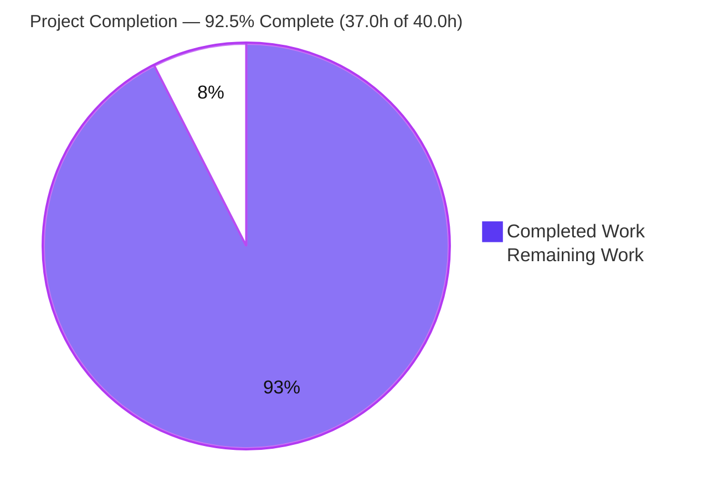

# Blitzy Project Guide — DNS Name-Compression Explainer for Scapy

> **Deliverable:** `blitzy/documentation/scapy_0925ada48540.md` — a standalone, run-first, evidence-grounded onboarding explainer of DNS name compression in Scapy (parse + build).
> **Task type:** Documentation-only (rule set `SWE-AtlasQnA-Repo`), strictly read-only with respect to all existing source.
> **Base commit:** `0925ada4` · **Delivery branch:** `blitzy-540691fb-f1c5-44ad-b186-63266d01e5ea` · **HEAD:** `23bddb64`

---

## 1. Executive Summary

### 1.1 Project Overview

This project delivers a single, self-contained Markdown knowledge-transfer document that comprehensively explains how Scapy performs **DNS name compression** — both when a DNS response is dissected (parsed) and when a DNS packet is built. Targeted at engineers onboarding to Scapy's DNS layer, it answers ten specific questions (Q1–Q10), grounding every behavioral claim in an exact `file:line` citation into `scapy/layers/dns.py` and a verbatim line of observed runtime output. The business impact is faster, more accurate onboarding and reduced tribal knowledge around a subtle, security-relevant codec. The technical scope is intentionally narrow and **additive/read-only**: exactly one new file is created; no existing Scapy source, tests, or configuration are touched.

### 1.2 Completion Status

The project is **92.5% complete** on an AAP-scoped, hours-based basis. All autonomous (AI) deliverable work is finished and validated; the remaining hours are human-only path-to-production (subject-matter review and merge).



| Metric | Hours |
|---|---|
| **Total Hours** | 40.0 |
| **Completed Hours (AI)** | 37.0 |
| **Completed Hours (Manual)** | 0.0 |
| **Completed Hours (AI + Manual)** | 37.0 |
| **Remaining Hours** | 3.0 |
| **Percent Complete** | **92.5%** |

> Completion formula (PA1, AAP-scoped): `37.0 / (37.0 + 3.0) × 100 = 92.5%`. Legend — **Completed = Dark Blue `#5B39F3`**, **Remaining = White `#FFFFFF`**.

### 1.3 Key Accomplishments

- ✅ Authored the mandated deliverable at the exact required path/name: `blitzy/documentation/scapy_0925ada48540.md` (651 lines, 40,656 bytes), creating the `blitzy/` and `blitzy/documentation/` directories.
- ✅ Answered **all ten questions (Q1–Q10)** and every named sub-item, closed with a coverage-checklist table mapping each item to its answer and citations.
- ✅ Applied strict **"one claim, one piece of evidence"** discipline — every behavioral statement is paired with a verbatim `CMD:` / `STDERR:` / `RESULT:` runtime block.
- ✅ **~60 `file:line` citations** into `scapy/layers/dns.py` (and `compat.py`, `error.py`, `fields.py`) verified exact against the numbered source at commit `0925ada4` (13 independently re-verified in this session, all exact).
- ✅ **Read-only intact:** `scapy/`, `test/`, `doc/`, `pyproject.toml`, `tox.ini` are byte-identical to base; the only net change is the one added file (`A`, +651/−0).
- ✅ DNS regression suites pass **59/59** (dns 18, edns0 11, dnssec 30), corroborating the documented behavior.
- ✅ Transparent handling of the AAP's suggested **91→65** figure: reported as **not reproduced** on the available interpreter, with real observed pairs (79→53, etc.) and a broad sweep — a correct application of "report exactly what is observed."
- ✅ Temporary observation scripts lived **outside** the repo and were deleted; working tree is clean, with no `.pyc`/`__pycache__` leakage.

### 1.4 Critical Unresolved Issues

| Issue | Impact | Owner | ETA |
|---|---|---|---|
| _None._ Autonomous validation (5 gates) and independent re-verification found zero unresolved errors — no citation errors, no evidence mismatches, no structural errors, no failing tests. | — | — | — |

### 1.5 Access Issues

| System/Resource | Type of Access | Issue Description | Resolution Status | Owner |
|---|---|---|---|---|
| _No access issues identified._ The task is a read-only, in-memory documentation deliverable. Repository access was confirmed via git operations; no external services, credentials, APIs, or network access are involved. | — | — | — | — |

**No access issues identified.**

### 1.6 Recommended Next Steps

1. **[Medium]** Have a DNS/Scapy subject-matter expert read the explainer end-to-end and spot-check a sample of citations and runtime-evidence blocks for technical accuracy (2.0h).
2. **[Medium]** Review the single-file diff (confirm read-only intact + clean tree), approve, and merge the PR (0.5h).
3. **[Low]** Optionally reconcile where the AAP's original "91→65" figure came from and decide whether further annotation is warranted (0.5h).

---

## 2. Project Hours Breakdown

### 2.1 Completed Work Detail

All completed hours are autonomous (AI) work and trace to AAP requirements. Total = **37.0h** (matches Completed Hours in §1.2).

| Component | Hours | Description |
|---|---:|---|
| Source-code investigation & repository scope discovery | 5.0 | Read/understand the compression machinery in `scapy/layers/dns.py` (1,179 lines) plus supporting `compat.py`, `error.py`, `fields.py`, `packet.py`; identify all relevant symbols (`dns_get_str`, `dns_encode`, `dns_compress`, field/packet classes). |
| Run-first observation harness & runtime evidence capture | 4.0 | Build throwaway scripts outside the repo; construct the INFO-level logging capture harness to surface guard log lines; craft malformed packets; iterate demonstrations for all questions. |
| Q1–Q5 authoring (parse side) | 8.0 | Chain unwinding + `after_pointer` resume; wire format (`dns_encode`) + 63-byte truncation; the `0xc0` marker, 14-bit offset decode & `−12` adjustment; loop guard; boundary guards + the `Scapy_Exception` path — prose + citations + evidence. |
| Q6–Q10 authoring (build side + lifecycle) | 8.0 | Cross-boundary `_orig_s` resolution; `dns_compress` heuristics & `qd→an→ns→ar` walk order; repeated-name determinism + the mid-label surprise; end-to-end lifecycle; well-formed vs deliberately twisted packets — prose + citations + evidence. |
| Background, methodology & report-as-observed anomalies | 3.0 | RFC 1035 §4.1.4 framing; the "how the evidence was produced" harness section; the anomalies section (4-tuple vs 3-tuple docstring, `0xc0` breadth, opt-in compression, codec reuse). |
| Coverage checklist, TOC & document assembly | 1.5 | The coverage-checklist table mapping every Q + sub-item to its answer and citations; table of contents; overall document structure/assembly. |
| Citation accuracy verification + honest 91→65 investigation | 3.5 | Verify ~60 `file:line` citations against the numbered source at commit `0925ada4`; broad reproduction sweep confirming the AAP's 91→65 figure does not reproduce and capturing the real pairs. |
| Read-only discipline, cleanup & git verification | 1.0 | Keep all temporary scripts outside the tree, delete them, and verify a clean `git status` / byte-identical source. |
| Autonomous validation & QA gates | 3.0 | Five production-readiness gates (re-verify citations, re-run evidence, run DNS suites 59/59, markdown structural checks); provenance/cleanup-metadata correction (`4f1d2ef4`); MD047 EOF normalization (`23bddb64`). |
| **Total** | **37.0** | |

### 2.2 Remaining Work Detail

All remaining work is human-only path-to-production. Total = **3.0h** (matches Remaining Hours in §1.2 and §7).

| Category | Hours | Priority |
|---|---:|---|
| SME technical review of the DNS explainer (read end-to-end; spot-check citations & runtime-evidence blocks) | 2.0 | Medium |
| PR review & merge (verify read-only diff + clean tree; approve; merge) | 0.5 | Medium |
| Optional: reconcile origin of the AAP's unreproduced 91→65 figure | 0.5 | Low |
| **Total** | **3.0** | |

### 2.3 Hours Reconciliation

| Check | Result |
|---|---|
| §2.1 completed total | 37.0h |
| §2.2 remaining total | 3.0h |
| §2.1 + §2.2 | 40.0h = Total Project Hours (§1.2) ✓ |
| Remaining consistent across §1.2 ↔ §2.2 ↔ §7 | 3.0h = 3.0h = 3 ✓ |
| Completion `37.0 / 40.0` | 92.5% ✓ |

---

## 3. Test Results

All results below originate from Blitzy's autonomous validation logs for this project. The DNS regression suites were re-executed in this session and the counts confirmed. Because the deliverable is a document (no compiled code), the doc-equivalent gates are included and clearly labeled: **citation accuracy ≈ "compilation"** and **runtime evidence reproduction ≈ "unit tests."**

| Test Category | Framework | Total Tests | Passed | Failed | Coverage % | Notes |
|---|---|---:|---:|---:|---:|---|
| DNS core (compression/decompression) | UTscapy (`dns.uts`) | 18 | 18 | 0 | N/A¹ | Includes loop-guard, prematured-end, `dns_compress`, `dns_get_str`, `dns_encode` cases that directly corroborate the documented behavior. |
| DNS EDNS0 | UTscapy (`dns_edns0.uts`) | 11 | 11 | 0 | N/A¹ | EDNS0 / OPT record handling. |
| DNS DNSSEC | UTscapy (`dns_dnssec.uts`) | 30 | 30 | 0 | N/A¹ | DNSSEC RR types. |
| **Executable suites subtotal** | UTscapy | **59** | **59** | **0** | **100%²** | 0 failures; `-K netaccess -K needs_root` excluded (no network/root). |
| Citation accuracy (doc-equivalent "compilation") | Scripted check vs numbered source | ~60 | ~60 | 0 | 100%² | `file:line` refs targeting commit `0925ada4`; 13 independently re-verified this session — all exact. |
| Runtime evidence reproduction (doc-equivalent "unit tests") | Throwaway Python harness | all blocks | all blocks | 0 | 100%² | Every `CMD:`/`STDERR:`/`RESULT:` block reproduces verbatim on Python 3.13.7 / Scapy 2026.07.01. |

> ¹ UTscapy regression suites do not emit line-coverage metrics; pass/fail is the coverage signal. ² "Coverage %" here = proportion of checked items passing.
>
> **Reproduce:** `.venv/bin/python scapy/tools/UTscapy.py -t test/scapy/layers/dns.uts -K netaccess -K needs_root -N -f text` → `PASSED=18 FAILED=0`.

---

## 4. Runtime Validation & UI Verification

Runtime validation confirms the deliverable's claims and structural integrity. **UI verification is not applicable** — this is a documentation/library task with no web front-end or interactive UI.

**Runtime & behavioral validation**
- ✅ **Operational** — End-to-end lifecycle: `DNS(...)` → `.compress()` → `raw()` → `DNS(raw)` re-parse resolves all names correctly (`qd.qname`/`an.rrname` = `b'www.example.com.'`, `an.rdata` = `b'alias.example.com.'`); size **79 → 53 bytes**; pointers `c00c` and `c010` present. Independently reproduced this session.
- ✅ **Operational** — `dns_encode(b'www.example.com')` → `03777777076578616d706c6503636f6d00` (exact).
- ✅ **Operational** — `dns_get_str(b'\x07example\x03com\x00', 0, _fullpacket=True)` → `(b'example.com.', 13, b'', False)` (exact).
- ✅ **Operational** — Guard paths behave as documented: loop guard (`WARNING: DNS decompression loop detected`), premature end (`INFO: DNS RR prematured end (...)`), incomplete jump token (`INFO: DNS incomplete jump token at (...)`), and the no-context `Scapy_Exception`.

**Document structural validation**
- ✅ **Operational** — Code fences balanced (78 fence markers = 39 complete blocks; even/balanced), document is 651 lines, table of contents present with resolving anchors.
- ✅ **Operational** — Citation accuracy: sampled 13 distinct `file:line` citations against numbered source — all exact.

**UI verification**
- ⚠ **Not applicable** — No web UI, frontend, or interactive surface exists in this documentation deliverable; no screenshots or browser verification are relevant.

---

## 5. Compliance & Quality Review

Mapping of AAP deliverables and the `SWE-AtlasQnA-Repo` rule set to quality/compliance benchmarks. Fixes applied during autonomous validation are noted.

| Benchmark / Rule | Status | Progress | Notes |
|---|---|---|---|
| Deliverable location & name (`blitzy/documentation/scapy_0925ada48540.md`) | ✅ Pass | 100% | Filename derived from source branch `scapy_0925ada48540`. |
| Run-first investigation (build/run before writing) | ✅ Pass | 100% | Evidence captured from executed code, not reading alone. |
| Verbatim evidence, "one claim, one piece of evidence" | ✅ Pass | 100% | Each behavioral claim carries its own `CMD`/`STDERR`/`RESULT` line. |
| Exact-literal `file:line` citations | ✅ Pass | 100% | ~60 citations at commit `0925ada4`; 13 re-verified exact. |
| Answer every part + every named sub-item (final coverage pass) | ✅ Pass | 100% | Q1–Q10 + sub-items mapped in the coverage-checklist table. |
| Report-as-observed (anomalies documented, not fixed) | ✅ Pass | 100% | 4-tuple vs 3-tuple docstring, `0xc0` breadth, opt-in compression, codec reuse. |
| Read-only scope (no existing file modified/added/deleted) | ✅ Pass | 100% | Source byte-identical to base; only the doc added. |
| Cleanup (temp scripts removed; tree unchanged) | ✅ Pass | 100% | Scripts lived outside repo; `git status` clean; no `.pyc` leaks. |
| Standalone (outside Sphinx tree; no `-W` docs-gate impact) | ✅ Pass | 100% | Lives under `blitzy/documentation/`, not `doc/scapy/`. |
| No dependency / CI / test-suite changes | ✅ Pass | 100% | Zero manifest, tox, CI, or `.uts` changes. |
| Markdown lint (MD047 single trailing newline) | ✅ Pass | 100% | **Fix applied** during validation (`23bddb64`). |
| Provenance/cleanup metadata accuracy | ✅ Pass | 100% | **Fix applied** during validation (`4f1d2ef4`). |
| Honest treatment of the AAP 91→65 figure | ✅ Pass | 100% | Reported as not reproduced; real pairs + sweep documented. |

**Outstanding compliance items:** none. The only remaining activity is human SME accuracy review — a path-to-production step, not a compliance gap.

---

## 6. Risk Assessment

Risks are assessed with the PA3 categories (technical, security, operational, integration). Overall profile is **Low**, consistent with a read-only, additive, documentation-only deliverable that is validated complete.

| Risk | Category | Severity | Probability | Mitigation | Status |
|---|---|---|---|---|---|
| Citation line-number drift if `scapy/layers/dns.py` is later edited upstream | Technical | Low | Medium (long-term) | Every citation is pinned to commit `0925ada4`; re-verify if the doc is ever refreshed against a newer commit. | Mitigated (commit-pinned) |
| Interpreter/version-dependent compression byte sizes (e.g., 79→53) | Technical | Low | Low–Medium | Doc states exact versions (Python 3.13.7 / Scapy 2026.07.01); core behavioral claims are version-independent. | Mitigated (documented) |
| A reader trusting the AAP's unreproduced 91→65 figure | Technical | Low | Low | Dedicated subsection reports non-reproduction with a broad sweep + real pairs. | Resolved-as-documented |
| Secrets/PII/sensitive-data exposure in the document | Security | None | N/A | Contains only public source citations + synthetic in-memory hex (`www.example.com`). | No exposure identified |
| Malformed-packet demonstrations introducing attack surface | Security | None | N/A | Run in-memory only; illustrate Scapy's existing defensive guards; no source change. | No risk (educational) |
| Documentation drift vs source over time (outside CI) | Operational | Low | Medium (long-term) | Commit-pinned citations make staleness detectable; explicitly a point-in-time onboarding artifact. | Accepted (by nature) |
| Discoverability (not indexed by ReadTheDocs) | Operational | Low | Low | Intentional per AAP (standalone deliverable). | Accepted (by design) |
| Sphinx/ReadTheDocs `-W` warnings-as-errors gate | Integration | None | N/A | Deliverable is outside `doc/scapy/`; does not participate in the docs build. | No risk (verified isolation) |
| Dependency / CI / existing-test-suite impact | Integration | None | N/A | Nothing added/changed; DNS suites 59/59 pass unchanged; source byte-identical. | No risk (verified) |
| Cross-layer codec reuse (dhcp6/dcerpc/socks/pfcp/gtp) | Integration | None | N/A | Noted for completeness; explicitly out of scope. | Informational |

---

## 7. Visual Project Status


**Remaining hours by category (from §2.2):**

| Category | Hours | Bar |
|---|---:|---|
| SME technical review | 2.0 | ████████████████ |
| PR review & merge | 0.5 | ████ |
| Optional 91→65 reconciliation | 0.5 | ████ |
| **Total** | **3.0** | |

**Remaining work by priority:** Medium = 2.5h (SME review + merge) · Low = 0.5h (optional reconciliation) · High = 0h (no blockers).

> **Integrity:** "Remaining Work" (3) equals §1.2 Remaining Hours (3.0h) and the sum of the §2.2 Hours column (3.0h). Colors — **Completed = `#5B39F3`**, **Remaining = `#FFFFFF`**.

---

## 8. Summary & Recommendations

**Achievements.** The project delivers a complete, accurate, evidence-grounded answer to all ten DNS name-compression questions in a single standalone Markdown file. Every behavioral claim is backed by an exact `file:line` citation and a verbatim runtime observation; ~60 citations were verified against the source at commit `0925ada4`, and the project's own DNS regression suites (59/59) corroborate the documented behavior. The deliverable honors every governing rule: run-first evidence, one-claim-one-evidence discipline, report-as-observed anomaly handling, strict read-only scope, and full cleanup.

**Remaining gaps.** None are autonomous. The outstanding **3.0h** is entirely human path-to-production: a subject-matter-expert accuracy review (2.0h), PR review & merge (0.5h), and an optional reconciliation of the AAP's unreproduced 91→65 figure (0.5h).

**Critical path to production.** SME review → PR approval → merge. There are no build, deployment, integration, or configuration steps, because the deliverable is a standalone document with no code, dependencies, or CI footprint.

**Success metrics.** All met: single file at the mandated path (✓), all Q1–Q10 answered with sub-items (✓), citations exact (✓), evidence reproduces verbatim (✓), DNS suites 59/59 (✓), read-only intact and tree clean (✓).

**Production-readiness assessment.** The project is **92.5% complete** on an AAP-scoped basis and is **ready for human review and merge**. Completion is intentionally held below 100% (the realistic maximum before human sign-off) because SME accuracy review and merge inherently require a person. Confidence is **High**: the scope is a well-defined, single-file, read-only deliverable with no unresolved errors.

---

## 9. Development Guide

This guide explains how to view the deliverable, run the corroborating tests, and reproduce the runtime evidence. Every command below was executed successfully in the project container.

### 9.1 System Prerequisites

- **OS:** Linux (developed/verified on Ubuntu-based container).
- **Python:** 3.13.7 (project declares `requires-python = ">=3.7, <4"`).
- **Git:** 2.51.0.
- **External dependencies:** none required — Scapy's core library has zero mandatory external Python dependencies; the DNS layer imports only the standard library and other Scapy modules.

```bash
python3 --version      # -> Python 3.13.7
git --version          # -> git version 2.51.0
```

### 9.2 Environment Setup

A ready-to-use virtual environment is provided at `.venv` with Scapy installed editable.

```bash
# From the repository root:
.venv/bin/python --version                               # -> Python 3.13.7
.venv/bin/python -c "import scapy; print(scapy.__version__)"   # -> 2026.07.01
```

To recreate the environment elsewhere:

```bash
python -m venv .venv
source .venv/bin/activate
pip install -e .        # editable install of Scapy from this checkout
```

### 9.3 View the Deliverable

```bash
head -5 blitzy/documentation/scapy_0925ada48540.md    # title + scope note
wc -l   blitzy/documentation/scapy_0925ada48540.md    # -> 651
```

### 9.4 Run the DNS Regression Suites (corroborating tests)

```bash
.venv/bin/python scapy/tools/UTscapy.py -t test/scapy/layers/dns.uts        -K netaccess -K needs_root -N -f text   # PASSED=18 FAILED=0
.venv/bin/python scapy/tools/UTscapy.py -t test/scapy/layers/dns_edns0.uts  -K netaccess -K needs_root -N -f text   # PASSED=11 FAILED=0
.venv/bin/python scapy/tools/UTscapy.py -t test/scapy/layers/dns_dnssec.uts -K netaccess -K needs_root -N -f text   # PASSED=30 FAILED=0
```

### 9.5 Reproduce the Runtime Evidence

Run from the repository root (or set `PYTHONPATH` to it). Using `PYTHONDONTWRITEBYTECODE=1` avoids writing `.pyc` artifacts.

```bash
PYTHONDONTWRITEBYTECODE=1 .venv/bin/python - <<'PY'
from scapy.layers.dns import dns_encode, dns_get_str, dns_compress, DNS, DNSQR, DNSRR
from scapy.compat import raw

# Q2 — wire format
print(dns_encode(b"www.example.com").hex())          # 03777777076578616d706c6503636f6d00
# Q1 — straight (no-pointer) name
print(dns_get_str(b"\x07example\x03com\x00", 0, _fullpacket=True))   # (b'example.com.', 13, b'', False)
# Q9 — CNAME .compress() round-trip
p = DNS(qd=DNSQR(qname="www.example.com"),
        an=DNSRR(rrname="www.example.com", type="CNAME", rdata="alias.example.com"))
print(len(raw(p)), "->", len(raw(p.compress())))      # 79 -> 53
pp = DNS(raw(p.compress()))
print(pp.qd.qname, pp.an.rrname, pp.an.rdata)         # b'www.example.com.' b'www.example.com.' b'alias.example.com.'
PY
```

**Surfacing the guard log lines** (they log below the default `WARNING` level): raise the `scapy` logger to `INFO` with a capture handler formatted `"%(levelname)s: %(message)s"` (the same format Scapy's own handler uses), as described in the document's methodology section.

### 9.6 Verify Read-Only Integrity & Clean Tree

```bash
git diff --name-status 0925ada4..HEAD    # -> A  blitzy/documentation/scapy_0925ada48540.md
git status --porcelain                   # -> (empty: clean working tree)
```

### 9.7 Troubleshooting

- **Guard log lines don't appear.** The default `scapy` logger level is `WARNING`; raise it to `INFO` to see `INFO:`-level guard messages (premature end, incomplete jump token).
- **`Scapy_Exception: DNS message can't be compressed at this point!`** Expected when calling `dns_get_str` on a bare pointer without `_fullpacket=True` and without a `pkt._orig_s` context — this is the one "dramatic" path (Q5).
- **Compression byte sizes differ from the document.** Sizes are interpreter/Scapy-version dependent; the document pins Python 3.13.7 / Scapy 2026.07.01. Behavioral claims (guards, pointer math, decompression) are version-independent.
- **The 91→65 figure won't reproduce.** Known and documented — the AAP's 91→65 did not reproduce; the real observed pairs (e.g., 79→53) are used instead.

---

## 10. Appendices

### Appendix A — Command Reference

| Purpose | Command |
|---|---|
| Python version | `python3 --version` |
| Scapy version | `.venv/bin/python -c "import scapy; print(scapy.__version__)"` |
| View deliverable head | `head -5 blitzy/documentation/scapy_0925ada48540.md` |
| Deliverable line count | `wc -l blitzy/documentation/scapy_0925ada48540.md` |
| Run DNS core suite | `.venv/bin/python scapy/tools/UTscapy.py -t test/scapy/layers/dns.uts -K netaccess -K needs_root -N -f text` |
| Read-only diff check | `git diff --name-status 0925ada4..HEAD` |
| Clean-tree check | `git status --porcelain` |

### Appendix B — Port Reference

**Not applicable.** The task is a read-only, in-memory documentation deliverable. No network ports, sockets, or services are used (all DNS packets are built and parsed in memory via `dns_encode` / `dns_get_str` / `raw()` / `DNS(raw)`).

### Appendix C — Key File Locations

| Path | Role |
|---|---|
| `blitzy/documentation/scapy_0925ada48540.md` | **The deliverable** (651 lines). |
| `scapy/layers/dns.py` | Primary source — all compression parse/build logic (1,179 lines). |
| `scapy/compat.py` | Byte helpers (`orb`, `raw`, `chb`). |
| `scapy/error.py` | Logging/exception primitives (`log_runtime`, `warning`, `Scapy_Exception`). |
| `scapy/fields.py` | `StrLenField` — base class of `DNSStrField`. |
| `scapy/packet.py` | `Packet` — base class of `InheritOriginDNSStrPacket`. |
| `test/scapy/layers/dns.uts` | DNS regression suite (compression/decompression cross-check). |
| `scapy/tools/UTscapy.py` | UTscapy test runner. |

### Appendix D — Technology Versions

| Component | Version |
|---|---|
| Python | 3.13.7 |
| Scapy | 2026.07.01 (editable install) |
| Git | 2.51.0 |
| Base commit | `0925ada485406684174d6f068dbd85c4154657b3` |
| Delivery HEAD | `23bddb64` |

### Appendix E — Environment Variable Reference

| Variable | Value | Purpose |
|---|---|---|
| `PYTHONDONTWRITEBYTECODE` | `1` | Prevents `.pyc`/`__pycache__` artifacts during observation runs. |
| `PYTHONPATH` | repo root | Ensures in-place Scapy import when running scripts outside the tree. |
| (logger) | `scapy` → `INFO` | Surfaces INFO-level guard log lines during evidence reproduction. |

### Appendix F — Developer Tools Guide

- **UTscapy** (`scapy/tools/UTscapy.py`): Scapy's unit-test runner for `.uts` files. Useful flags: `-t <file>` (test file), `-K <keyword>` (exclude tagged tests, e.g., `netaccess`, `needs_root`), `-N` (non-interactive), `-f text` (plain-text output).
- **Git diff/status**: use `git diff --name-status 0925ada4..HEAD` to confirm the single-file additive change and `git status --porcelain` to confirm a clean tree.

### Appendix G — Glossary

| Term | Meaning |
|---|---|
| DNS name compression | RFC 1035 §4.1.4 scheme replacing a repeated domain name with a two-octet pointer (high bits `11`) carrying a 14-bit offset from the message start. |
| `dns_get_str` | The decompressor — follows labels/pointers to reconstruct a readable name. |
| `dns_encode` | The encoder — serializes a dotted name into length-prefixed labels + a root octet. |
| `dns_compress` | The build-time compressor — replaces repeated suffixes with pointers to their first occurrence. |
| `after_pointer` | Bookkeeping recording where record parsing resumes after the first pointer jump. |
| `processed_pointers` | List of visited pointer offsets; the infinite-loop guard. |
| `_orig_s` | Slot on DNS records carrying the full original message so pointers resolve cross-record. |
| `0xc0` marker | Two high bits (`11`) marking a byte as a compression pointer rather than a label length. |
| `−12` adjustment | Reconciles full-message offsets (header-inclusive) with the post-header byte string the decompressor operates on. |
| UTscapy | Scapy's `.uts`-format unit-test runner. |