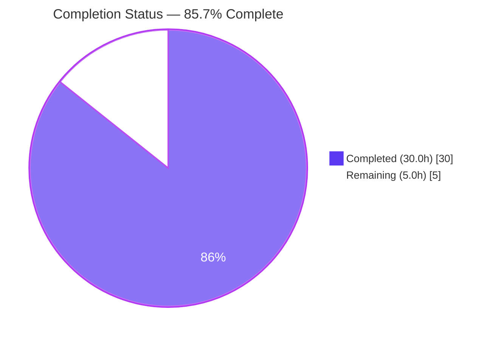
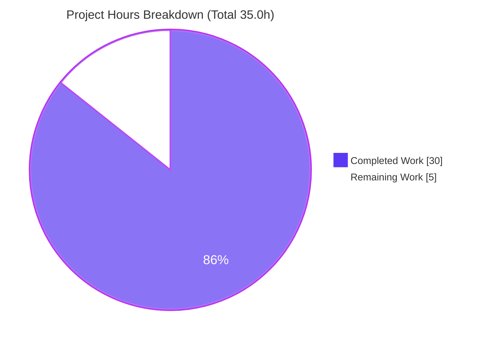

# Blitzy Project Guide — Scapy ICMP-Error-to-Request Matching (Investigative Q&A)

> Brand legend used throughout this guide: **Completed / AI Work = Dark Blue `#5B39F3`**, **Remaining / Not Completed = White `#FFFFFF`**, Headings/Accents = Violet‑Black `#B23AF2`, Highlight = Mint `#A8FDD9`.

---

## 1. Executive Summary

### 1.1 Project Overview

This project delivers a single, evidence‑grounded answer document that explains **how Scapy correlates an inbound ICMP error message back to the original request that triggered it**. The target audience is Scapy maintainers, protocol engineers, and technical reviewers who need an authoritative, runtime‑verified explanation of the stimulus‑response matching engine. The scope is deliberately narrow and **read‑only**: the sole artifact is `blitzy/documentation/scapy_0925ada48540.md`, produced by actually building and running Scapy's matching code paths offline and transcribing the observed output verbatim, with exact `file:line` citations. No source, test, or configuration file is modified — the effort answers six enumerated sub‑questions and reports (without patching) two source‑vs‑comment discrepancies discovered during investigation.

### 1.2 Completion Status

The completion percentage is computed with the AAP‑scoped hours methodology: `Completed ÷ (Completed + Remaining) × 100`. Only work defined by the Agent Action Plan and its documentation path‑to‑production is counted.



| Metric | Hours |
|--------|-------|
| **Total Project Hours** | **35.0** |
| Completed Hours (AI + Manual) | 30.0 |
| Remaining Hours | 5.0 |
| **Percent Complete** | **85.7%** |

> Calculation: `30.0 ÷ (30.0 + 5.0) × 100 = 30.0 ÷ 35.0 = 85.7%`. All completed hours were delivered autonomously by Blitzy agents; remaining hours are human path‑to‑production activities (review and publish). Per honest‑assessment policy, completion is not claimed at 100% prior to human sign‑off.

### 1.3 Key Accomplishments

- ✅ Authored `blitzy/documentation/scapy_0925ada48540.md` (547 lines) answering all **six** sub‑questions, each with a dedicated section: command → verbatim captured output → exact `file:line` citations → rationale.
- ✅ Followed a strict **run‑first, write‑second** discipline: **10** producing snippets executed offline and their stdout quoted verbatim (10 "Captured output" blocks).
- ✅ Grounded every claim with **60+** exact `file:line` citations across five source modules; all resolve to the claimed code.
- ✅ Documented the two‑stage matching engine: `hashret()` hash‑bucket lookup + `answers()` verification, with `IP.hashret` recursing into the embedded citation for ICMP error types `[3, 4, 5, 11, 12]`.
- ✅ Discovered and **reported (not patched)** two source‑vs‑comment discrepancies: `conf.checkIPID == 2` behavior, and `post_build` vs `post_dissection` extension checksum.
- ✅ Upheld the **read‑only mandate**: working tree clean; the only filesystem addition is the deliverable (`547` insertions, `0` deletions, `1` file); all five reference modules unmodified.
- ✅ Passed autonomous final validation: 10/10 snippets reproduce **byte‑for‑byte**; independently re‑verified by this assessment across all six requirements.

### 1.4 Critical Unresolved Issues

| Issue | Impact | Owner | ETA |
|-------|--------|-------|-----|
| None — no blocking issues | The deliverable is validated production‑ready; zero edits were required during final validation | N/A | N/A |

> There are no critical unresolved issues. The two discrepancies surfaced during investigation are **intentional REPORT‑ONLY findings** (per AAP §0.3.2), not defects in the deliverable; their optional disposition is tracked as a Low‑priority human task in Section 2.2 / the human task list.

### 1.5 Access Issues

| System/Resource | Type of Access | Issue Description | Resolution Status | Owner |
|-----------------|----------------|-------------------|-------------------|-------|
| Git repository (branch `blitzy-d079f106-aab7-423d-a197-6d4ce13b62b4`) | Read/Write | None — repository accessible, tree clean, deliverable committed | ✅ Resolved | — |
| Python venv + in‑repo Scapy | Execute | None — `./.venv/bin/python` (3.13.7) imports Scapy in place offline | ✅ Resolved | — |

> **No access issues identified.** The investigation is fully offline (no root, no live network, no libpcap, no third‑party credentials).

### 1.6 Recommended Next Steps

1. **[High]** Perform SME technical review of `blitzy/documentation/scapy_0925ada48540.md` — verify the six answers, spot‑check citations, and confirm the two discrepancy findings.
2. **[Medium]** Reproduce the 10 producing snippets in a clean/reviewer environment to confirm byte‑for‑byte output.
3. **[Medium]** Decide publication path (knowledge base link and/or Sphinx `doc/` tree) and merge the PR.
4. **[Low]** Decide disposition of the two report‑only discrepancies (optionally file upstream issues); explicitly out of the AAP's fix‑scope.

---

## 2. Project Hours Breakdown

### 2.1 Completed Work Detail

Each completed component traces to a specific AAP requirement (the six sub‑questions, the foundational investigation, and the quality/validation activities).

| Component | Hours | Description |
|-----------|-------|-------------|
| Foundational investigation & environment setup | 5.0 | Read the matching call‑chain end‑to‑end across 5 modules; establish the offline crafting harness; author Overview, Observed‑environment, and two‑stage‑algorithm sections |
| Req 1 — Matching strategy | 3.0 | Emulate the two‑stage engine; prove embedded‑copy extraction (`IPerror`/`ICMPerror`); capture `answers()=1` and layer list; cite `sendrecv.py`/`inet.py` |
| Req 2 — Hashing mechanism | 2.5 | Capture verbatim `hashret()` equality (`caa801610101000100`); explain recursion into embedded datagram and `NoPayload` base case |
| Req 3 — Subtle‑modification tolerance | 2.0 | Mutate embedded TTL/checksum; observe `answers()=1`; cite field‑selective `IPerror.answers` |
| Req 4 — Configuration toggles | 3.0 | Toggle `conf.checkIPsrc` and `conf.check_TCPerror_seqack`; capture `1/1/0/0/1` transitions; articulate strict‑vs‑tolerant trade‑offs |
| Req 5 — IP ID byte‑swap + discrepancy | 3.5 | Demonstrate `socket.htons()` transform (`0x1234→0x3412`) across `checkIPID` values; discover and report the `checkIPID == 2` doc‑vs‑code discrepancy |
| Req 6 — RFC4884 extension parsing + caveat | 4.5 | Craft oversized error; dissect before/after `contrib` import (layer list changes; matching unchanged); discover and report the `post_build` vs `post_dissection` checksum caveat |
| Coverage pass, citation precision & repo verification | 2.5 | Coverage‑pass checklist (six ✔); ensure 60+ exact `file:line` citations; verify repository unchanged and temp scripts cleaned up |
| QA iterations & autonomous final validation | 4.0 | 3 QA follow‑up commits; automated extractor+differ reproducing 10/10 snippets byte‑for‑byte; citation resolution; discrepancy reconfirmation; read‑only gate checks |
| **Total Completed** | **30.0** | Sums to Completed Hours in Section 1.2 |

### 2.2 Remaining Work Detail

Each remaining category is a human path‑to‑production activity for a documentation artifact. There are no code, test, or deployment tasks (this is a read‑only documentation deliverable).

| Category | Hours | Priority |
|----------|-------|----------|
| SME technical review of the answer document (verify 6 answers, citations, 2 discrepancy findings) | 2.0 | High |
| Reproduce the 10 producing snippets on a clean/reviewer environment | 1.0 | Medium |
| Publish/integrate the document (KB link / doc‑tree decision / PR merge) | 1.0 | Medium |
| Disposition of the 2 report‑only discrepancies (decision only; out of fix‑scope) | 1.0 | Low |
| **Total Remaining** | **5.0** | — |

> **Integrity check:** Section 2.1 total (30.0h) + Section 2.2 total (5.0h) = **35.0h** = Total Project Hours in Section 1.2. Section 2.2 total (5.0h) = Remaining Hours in Section 1.2 = Section 7 pie "Remaining Work".

### 2.3 Basis of Estimate & Confidence

- **Confidence: High.** The scope is narrow, isolated, and fully validated; hours reflect a senior engineer's investigative documentation effort (source reading, empirical scripting, authoring, discrepancy analysis, and QA/validation).
- Completed hours are anchored to observable evidence (547‑line deliverable, 10 snippets, 60+ citations, 4 commits). Remaining hours are conservative human‑review/publish estimates rounded to the nearest 0.5h.

---

## 3. Test Results

For this documentation deliverable, the "tests" are Blitzy's **autonomous validation activities**: an automated extractor+differ that re‑ran every producing snippet and diffed stdout byte‑for‑byte against the quoted output, plus citation resolution and repository‑integrity gates. All results originate from Blitzy's autonomous validation logs for this project and were independently corroborated during this assessment.

| Test Category | Framework | Total Tests | Passed | Failed | Coverage % | Notes |
|---------------|-----------|-------------|--------|--------|-----------|-------|
| Snippet reproduction (empirical observation) | Blitzy autonomous extractor+differ — Python 3.13.7 / in‑repo Scapy, offline (`SCAPY_USE_LIBPCAP=no PYTHONPATH=.`) | 10 | 10 | 0 | 100% | Every producing snippet re‑run fresh; stdout diffed **byte‑for‑byte** vs each "Captured output" block; final gate exit 0 (run twice) |
| Citation resolution | Blitzy autonomous citation resolver | 60+ | 60+ | 0 | 100% | Every `file:line` citation resolves to the claimed code across all 5 reference modules |
| Coverage completeness | Coverage‑pass audit | 6 | 6 | 0 | 100% | All six sub‑question clauses answered; checklist shows six ✔ |
| Repository integrity (read‑only) | `git status` / `git diff` gate | 1 | 1 | 0 | 100% | Tree clean; only deliverable added (547 insertions, 0 deletions); 5 reference modules unmodified |

> **Independent corroboration (this assessment):** representative snippets were re‑executed for all six requirements — Req 2 hash `caa801610101000100` (equal), Req 3 `answers=1` after `ttl=3, chksum=0xdead`, Req 4 transitions `1/1/0/0/1`, Req 5 `htons(0x1234)=0x3412` accepted for all `checkIPID` values, and Req 6 layer‑list change with identical `answers=1`/`hashret=caa8016111` before and after `contrib` import. No unit/integration test suite is in scope — the project intentionally adds no code.

---

## 4. Runtime Validation & UI Verification

There is no UI. Runtime validation covers the Scapy matching code paths exercised offline by the deliverable's snippets.

- ✅ **Operational** — Scapy imports in place: `conf.version = 2026.07.01`, Python `3.13.7`; defaults `checkIPsrc=True checkIPaddr=True checkIPID=False check_TCPerror_seqack=False`.
- ✅ **Operational** — Req 1 two‑stage matching: `err.answers(req)=1`; layers `['IP','ICMP','IPerror','ICMPerror','Raw']` (embedded‑copy extraction confirmed).
- ✅ **Operational** — Req 2 hashing: `req.hashret() == err.hashret() == caa801610101000100` (equal).
- ✅ **Operational** — Req 3 tolerance: `answers(req)=1` after embedded `ttl=3`, `chksum=0xdead`.
- ✅ **Operational** — Req 4 config toggles: observed `1/1/0/0/1` transitions across `check_TCPerror_seqack` and `checkIPsrc`.
- ✅ **Operational** — Req 5 byte‑swap: `socket.htons(0x1234)=0x3412` accepted for `checkIPID` ∈ {False, 0, 1, 2}.
- ✅ **Operational** — Req 6 extensions: importing `scapy.contrib.icmp_extensions` adds `ICMPExtensionHeader`/`ICMPExtensionMPLS` to the layer list; `answers=1` and `hashret=caa8016111` unchanged (matching unaffected).
- ⚠ **Partial (informational only)** — two `CryptographyDeprecationWarning` (TripleDES) lines print on **stderr** at import from `scapy/layers/ipsec.py:573,577`; unrelated to the deliverable and do not affect any captured stdout value. No API/network integrations exist (offline‑only).

---

## 5. Compliance & Quality Review

Cross‑mapping the AAP's governing rules ("SWE‑AtlasQnA‑Repo") and quality benchmarks to observed status.

| Benchmark / Rule | Requirement | Status | Progress |
|------------------|-------------|--------|----------|
| Deliverable location & naming | `blitzy/documentation/scapy_0925ada48540.md` derived from source branch | ✅ Pass | 100% |
| Run‑first, write‑second | Execute code paths and capture output before writing | ✅ Pass | 100% |
| Verbatim evidence | Quote real output (hashes, `answers()` returns, layer lists, warnings) | ✅ Pass | 100% |
| Exact literals + `file:line` | Never paraphrase asked‑for values; cite exactly | ✅ Pass | 100% |
| Coverage of all six sub‑questions | Every clause explicitly answered; final coverage pass | ✅ Pass | 100% |
| Read‑only mandate | No source modified; only the answer document added | ✅ Pass | 100% |
| Temp‑script cleanup | Observation scripts removed; repository byte‑for‑byte unchanged | ✅ Pass | 100% |
| Discrepancies reported, not patched | `checkIPID == 2`; `post_build` vs `post_dissection` checksum | ✅ Pass | 100% |
| Markdown structural validity | Balanced fences (46), well‑formed | ✅ Pass | 100% |

**Fixes applied during autonomous validation:** the deliverable required **zero** content edits at final validation. Earlier QA iterations (3 follow‑up commits) addressed final‑gate review findings, refined the provenance stderr‑warning description, and added the exact `socket.htons()` literal to Req 5. **Outstanding compliance items:** none.

---

## 6. Risk Assessment

| Risk | Category | Severity | Probability | Mitigation | Status |
|------|----------|----------|-------------|------------|--------|
| Documentation staleness / version drift — Scapy uses date‑based versioning (`2026.07.01`); quoted hashes/values could drift if matching source changes | Technical | Low | Medium | Run‑first snippets + exact environment recorded enable re‑verification against any commit | Mitigated |
| Snippet non‑reproducibility on a different interpreter/environment | Technical | Low | Low | Values are interpreter‑independent arithmetic; validator + this assessment reproduced 10/10 | Mitigated |
| No material security exposure — read‑only markdown, no code/deps/secrets; unrelated TripleDES deprecation warning is out of scope | Security | Low (info) | N/A | No attack surface introduced; warning documented as out‑of‑scope | Out of scope |
| `blitzy/documentation/` not wired into Sphinx `doc/` tree or CI (won't auto‑publish) | Operational | Low | Medium | Human publish decision (Section 2.2 Medium task) | Open |
| Report‑only discrepancies could be misread as fix‑me defects | Operational | Low | Low | Doc explicitly labels both as REPORT‑ONLY with both `file:line` references | Mitigated |
| No external service/API/credential/network dependencies | Integration | None | N/A | Offline‑only investigation by design | No action |

---

## 7. Visual Project Status



**Remaining hours by category (from Section 2.2):**

| Category | Hours | Priority |
|----------|------:|----------|
| SME technical review | 2.0 | High |
| Reproduce 10 snippets | 1.0 | Medium |
| Publish/integrate document | 1.0 | Medium |
| Discrepancy disposition | 1.0 | Low |
| **Total** | **5.0** | — |

> **Integrity:** pie "Remaining Work" = 5 = Section 1.2 Remaining Hours = Section 2.2 total. Pie "Completed Work" = 30 = Section 1.2 Completed Hours = Section 2.1 total. Colors: Completed `#5B39F3`, Remaining `#FFFFFF`.

---

## 8. Summary & Recommendations

**Achievements.** The project is **85.7% complete** on an AAP‑scoped basis (`30.0h` of `35.0h`). All twelve AAP requirement items — the six explicit sub‑questions plus six implicit methodological requirements (run‑first, verbatim evidence, exact literals, coverage pass, read‑only single‑artifact, deterministic naming) — are complete and independently verified. The 547‑line deliverable explains Scapy's two‑stage `hashret()`/`answers()` matching engine with runtime evidence and 60+ exact citations, and it transparently reports two source‑vs‑comment discrepancies without altering any source.

**Remaining gaps.** The outstanding `5.0h` is entirely human path‑to‑production: SME technical review (High), snippet reproduction on a reviewer environment (Medium), publication/merge decision (Medium), and disposition of the two report‑only findings (Low). None is a code defect.

**Critical path to production.** SME review → reproduce snippets → choose publication path → merge. Because the deliverable is read‑only and validated, this path is short and low‑risk.

**Success metrics.** 10/10 snippets reproduce byte‑for‑byte; 60+ citations resolve; six sub‑questions answered with a coverage pass; working tree clean (only the deliverable added).

**Production‑readiness assessment.** The autonomous deliverable is **production‑ready and validated**. Overall project completion is held at **85.7%** to reflect that human SME sign‑off and publication remain — consistent with the policy of not declaring 100% before human review.

| Dimension | Status |
|-----------|--------|
| AAP requirements complete | 12 / 12 items |
| Read‑only mandate | Upheld (tree clean) |
| Autonomous validation | 5/5 gates passed |
| Completion (AAP‑scoped) | 85.7% (30.0h / 35.0h) |
| Blocking issues | 0 |

---

## 9. Development Guide

This guide reproduces and verifies the deliverable's observations. All commands were tested from the repository root and are copy‑pasteable.

### 9.1 System Prerequisites

- OS: Linux, macOS, or WSL.
- Python: CPython (repo virtualenv is **3.13.7**; `pyproject.toml` requires `>=3.7, <4`).
- Tools: `git`, `git-lfs` (a pre‑push LFS hook is present).
- No root privileges, no live network, no libpcap — the investigation is fully offline.

### 9.2 Environment Setup

The repository ships a ready virtualenv at `./.venv` with Scapy installed editable (`scapy.egg-info` present).

```bash
# from the repository root
./.venv/bin/python --version           # -> Python 3.13.7

# (Only if recreating the venv) Scapy is stdlib-only with no mandatory 3rd-party deps:
# python -m venv .venv && ./.venv/bin/pip install -e .
```

Two environment variables govern every observation command:

- `PYTHONPATH=.` — import Scapy in place from the repo root.
- `SCAPY_USE_LIBPCAP=no` — disable the optional libpcap backend (offline).

### 9.3 Verify the Environment

```bash
SCAPY_USE_LIBPCAP=no PYTHONPATH=. ./.venv/bin/python -c \
  "from scapy.all import conf; print('version', conf.version); \
   print('defaults', conf.checkIPsrc, conf.checkIPaddr, conf.checkIPID, conf.check_TCPerror_seqack)"
```

Expected output:

```
version 2026.07.01
defaults True True False False
```

### 9.4 View the Deliverable

```bash
sed -n '1,60p' blitzy/documentation/scapy_0925ada48540.md   # header + overview
wc -l blitzy/documentation/scapy_0925ada48540.md            # -> 547
```

### 9.5 Reproduce an Observation

Every producing snippet in the deliverable runs standalone using this pattern (append `2>/dev/null` to discard the two unrelated TripleDES stderr warnings):

```bash
SCAPY_USE_LIBPCAP=no PYTHONPATH=. ./.venv/bin/python - <<'PY' 2>/dev/null
import os; os.environ["SCAPY_USE_LIBPCAP"] = "no"
from scapy.all import IP, ICMP
req = IP(src="192.168.1.100", dst="10.0.0.5", id=0x1234)/ICMP(type=8, id=1, seq=1)/b"payloaddata12345"
raw_err = IP(src="10.0.0.1", dst="192.168.1.100")/ICMP(type=3, code=1)/bytes(req)
err = IP(bytes(raw_err))            # re-dissect so embedded copy parses as IPerror/ICMPerror
print("err.answers(req) =", err.answers(req))
print("req.hashret() =", req.hashret().hex())
print("err.hashret() =", err.hashret().hex())
print("hashes equal =", req.hashret() == err.hashret())
PY
```

Expected output (byte‑for‑byte):

```
err.answers(req) = 1
req.hashret() = caa801610101000100
err.hashret() = caa801610101000100
hashes equal = True
```

### 9.6 Verify the Read‑Only Mandate

```bash
git status --porcelain --untracked-files=all     # -> empty (clean tree)
git diff --stat 0925ada4 HEAD                     # -> only blitzy/documentation/scapy_0925ada48540.md, 547 insertions
```

### 9.7 Troubleshooting

- **`error: externally-managed-environment` from pip** — use the provided venv (`./.venv`); only if installing globally, pass `--break-system-packages`.
- **Two `CryptographyDeprecationWarning` (TripleDES) lines on stderr at import** — harmless and unrelated (`scapy/layers/ipsec.py:573,577`); they do not affect any stdout value; suppress with `2>/dev/null`.
- **`ImportError: No module named scapy`** — ensure `PYTHONPATH=.` and run from the repository root.
- **A snippet value differs** — confirm the source is at base commit `0925ada4`; values are interpreter‑independent but depend on the source version.

---

## 10. Appendices

### A. Command Reference

| Purpose | Command |
|---------|---------|
| Python version | `./.venv/bin/python --version` |
| Scapy version + defaults | `SCAPY_USE_LIBPCAP=no PYTHONPATH=. ./.venv/bin/python -c "from scapy.all import conf; print(conf.version)"` |
| Run an observation snippet | `SCAPY_USE_LIBPCAP=no PYTHONPATH=. ./.venv/bin/python - <<'PY' 2>/dev/null … PY` |
| View deliverable | `sed -n '1,60p' blitzy/documentation/scapy_0925ada48540.md` |
| Confirm clean tree | `git status --porcelain --untracked-files=all` |
| Diff vs base | `git diff --stat 0925ada4 HEAD` |

### B. Port Reference

Not applicable — the investigation is offline; no ports, sockets, or services are opened.

### C. Key File Locations

| Path | Role |
|------|------|
| `blitzy/documentation/scapy_0925ada48540.md` | **Deliverable** — the answer document (547 lines) |
| `scapy/sendrecv.py` | Reference — `SndRcvHandler` two‑stage matching loop (`hsent`, `_process_packet`) |
| `scapy/layers/inet.py` | Reference — `IP`/`ICMP`/`IPerror`/`TCPerror`/`UDPerror`/`ICMPerror` `hashret()`/`answers()` |
| `scapy/config.py` | Reference — `conf` matching‑strictness flags (`checkIPID`, `checkIPsrc`, `check_TCPerror_seqack`) |
| `scapy/packet.py` | Reference — base `Packet`/`NoPayload` `hashret()`/`answers()` recursion machinery |
| `scapy/contrib/icmp_extensions.py` | Reference — optional RFC4884 extension parser + monkey‑patch |

### D. Technology Versions

| Component | Version | Notes |
|-----------|---------|-------|
| Scapy (`conf.version`) | 2026.07.01 | Observed; governs over planning‑prose `2026.06.30` (date‑based versioning) |
| Python | 3.13.7 | Repo venv; planning prose referenced 3.12.3 — matching logic is interpreter‑independent |
| Base commit | `0925ada4` | Source branch tip; deliverable added on top |
| HEAD commit | `a2bf413b` | 4 agent commits, deliverable only |

### E. Environment Variable Reference

| Variable | Value | Purpose |
|----------|-------|---------|
| `PYTHONPATH` | `.` | Import Scapy in place from the repository root |
| `SCAPY_USE_LIBPCAP` | `no` | Disable the optional libpcap backend (offline crafting) |

### F. Developer Tools Guide

- **Diff a reference module vs base:** `git diff 0925ada4 HEAD -- scapy/layers/inet.py` (expected: empty — unmodified).
- **Resolve a citation:** `sed -n '568,581p' scapy/layers/inet.py` (e.g., `IP.hashret`).
- **List agent commits:** `git log --author="agent@blitzy.com" --oneline 0925ada4..HEAD`.
- **Count producing snippets vs captured‑output blocks:** `grep -c "Captured output" blitzy/documentation/scapy_0925ada48540.md` (-> 10).

### G. Glossary

| Term | Meaning |
|------|---------|
| `hashret()` | Fast hash key used to bucket sent packets and look up candidates for a received packet |
| `answers()` | Precise verification returning `1`/`0` (match/no‑match) between a received packet and a sent packet |
| Citation layer | Embedded copy of the original datagram inside an ICMP error, modeled as `IPerror`/`TCPerror`/`UDPerror`/`ICMPerror` |
| Two‑stage matching | `hashret()` bucket lookup (Stage 1) followed by `answers()` verification (Stage 2) in `SndRcvHandler` |
| ICMP error types | `[3, 4, 5, 11, 12]` — the list `IP.hashret`/`IP.answers` special‑case to recurse into the embedded citation |
| RFC4884 | Extended ICMP to Support Multi‑Part Messages — the extension format parsed by the optional `contrib` module |
| REPORT‑ONLY discrepancy | A source‑vs‑comment mismatch documented but deliberately not patched (per the read‑only mandate) |
