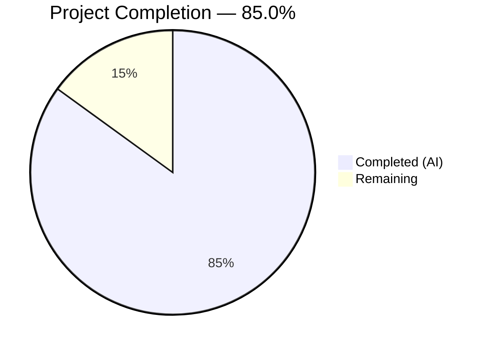
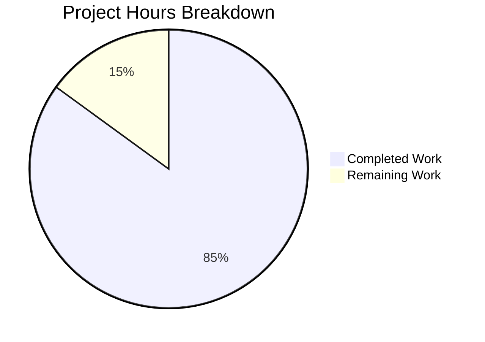

# Blitzy Project Guide

## 1. Executive Summary

### 1.1 Project Overview

This project delivers a technical investigation document analyzing Scapy's TCP stream reconstruction behavior when processing overlapping or retransmitted TCP segments. The deliverable is a single, comprehensive Markdown file (`blitzy/documentation/scapy_0925ada48540.md`, 497 lines, ~25 KB) placed in the Scapy repository at commit `0925ada4`. The document reproduces two TCP overlap variants (identical-byte and different-byte), provides verbatim runtime evidence, traces the code path to the overlap resolution policy (`memoryview` overwrite at `scapy/sessions.py:193`), and includes annotated Mermaid diagrams. No source files were modified — this is a documentation-only deliverable.

### 1.2 Completion Status



| Metric | Value |
|--------|-------|
| **Total Project Hours** | **20** |
| **Completed Hours (AI)** | **17** |
| **Remaining Hours** | **3** |
| **Completion Percentage** | **85.0%** |

**Calculation**: 17 completed hours / (17 completed + 3 remaining) = 17 / 20 = **85.0%**

### 1.3 Key Accomplishments

- ✅ Created comprehensive 497-line technical investigation document (`blitzy/documentation/scapy_0925ada48540.md`)
- ✅ Reproduced both TCP overlap variants (identical-byte and different-byte) with end-to-end offline reassembly pipeline
- ✅ Captured verbatim runtime evidence — terminal output verified against live Scapy execution
- ✅ Traced complete code path from `sniff()` through `StringBuffer.append()` to `memoryview` overwrite with 14+ source citations
- ✅ Created 2 Mermaid diagrams (reassembly call-chain sequence diagram, StringBuffer.append() flowchart)
- ✅ Documented interaction between overlap policy and HTTP.tcp_reassemble() (stream fragmentation on header corruption)
- ✅ Verified all source code line references against actual files
- ✅ Confirmed zero source file modifications and temporary artifact cleanup
- ✅ Applied code review fixes (second commit addressing 4 findings)

### 1.4 Critical Unresolved Issues

| Issue | Impact | Owner | ETA |
|-------|--------|-------|-----|
| Technical accuracy peer review not yet performed | Domain expert should validate overlap policy characterization and code-path analysis | Human Developer | 1.5h |
| Mermaid rendering not verified in target viewer | Diagrams may need syntax adjustments for specific Markdown renderers (GitHub, GitLab, etc.) | Human Developer | 0.5h |

### 1.5 Access Issues

No access issues identified. The project is a documentation-only deliverable using only the repository source code and Python standard library. No external services, credentials, or third-party APIs are required.

### 1.6 Recommended Next Steps

1. **[High]** Conduct technical accuracy peer review by a Scapy domain expert — validate overlap policy characterization, code-path analysis, and runtime evidence interpretation
2. **[Medium]** Verify Mermaid diagram rendering in the target Markdown viewer (GitHub, GitLab, or documentation platform) and adjust syntax if needed
3. **[Medium]** Perform final editorial and proofreading pass for grammar, terminology consistency, and formatting
4. **[Low]** Verify document accessibility from repository root — consider adding a link from the project README or contributing guide if this investigation should be discoverable

---

## 2. Project Hours Breakdown

### 2.1 Completed Work Detail

| Component | Hours | Description |
|-----------|-------|-------------|
| Source Code Investigation & Analysis | 4 | Deep analysis of `scapy/sessions.py` (StringBuffer, TCPSession), `scapy/layers/http.py` (tcp_reassemble, guess_payload_class, bind_layers), `scapy/sendrecv.py` (sniff, AsyncSniffer), and `scapy/utils.py` (wrpcap, PcapReader) to understand the TCP reassembly pipeline and overlap policy |
| Test Script Development | 2 | Self-contained Python script using only built-in Scapy APIs — TCP segment construction with Ether/IP/TCP/Raw, two pcap variants, wrpcap serialization, sniff with TCPSession reassembly, output reporting, and self-cleanup |
| Runtime Evidence Collection | 1 | Executing the test script against live Scapy runtime, capturing verbatim terminal output for both overlap variants, verifying byte counts and overlap winners |
| Document Structure & Initial Draft | 3 | Planning document structure per AAP (15 sections), writing Question Summary, Approach & Rationale, Experimental Setup, and Pcap Construction Details sections |
| Code-Path Analysis Writing | 2 | Detailed call-chain walkthrough from sniff() to memoryview overwrite with source citations, annotated StringBuffer.append() method walkthrough (lines 179–193) |
| Mermaid Diagram Creation | 1 | Sequence diagram tracing reassembly call chain (8 participants, full loop), flowchart for StringBuffer.append() decision logic |
| HTTP Interaction Analysis | 1.5 | Documenting how HTTP.tcp_reassemble() responds to corrupted headers (Variant B), explaining the early-return path when guess_payload_class returns Raw, stream fragmentation mechanics |
| Key Findings & Cleanup Sections | 0.5 | Summary table answering all investigation questions, cleanup verification section with terminal evidence |
| Code Review Fixes | 1 | Addressing 4 code review findings in second commit — corrections to documentation accuracy and formatting |
| Source Reference Verification | 1 | Verifying all 14+ source code line references (sessions.py:161, 179, 193, 195–199, 286, 346–347; http.py:580, 587–588, 637, 647, 748–750; sendrecv.py:1308; utils.py:1095, 1367) against actual files |
| **Total** | **17** | |

### 2.2 Remaining Work Detail

| Category | Hours | Priority |
|----------|-------|----------|
| Technical Accuracy Peer Review | 1.5 | High |
| Mermaid Rendering Verification | 0.5 | Medium |
| Editorial Proofreading | 0.5 | Medium |
| Repository Integration Check | 0.5 | Low |
| **Total** | **3** | |

### 2.3 Hours Verification

- Section 2.1 Total (Completed): **17 hours**
- Section 2.2 Total (Remaining): **3 hours**
- Sum: 17 + 3 = **20 hours** = Total Project Hours in Section 1.2 ✅
- Completion: 17 / 20 = **85.0%** ✅

---

## 3. Test Results

This is a documentation-only project. No traditional unit, integration, or UI test suites were written. The "tests" consist of runtime validation steps performed by Blitzy's autonomous validation system to verify the documentation content against live Scapy execution.

| Test Category | Framework | Total Tests | Passed | Failed | Coverage % | Notes |
|---------------|-----------|-------------|--------|--------|------------|-------|
| Runtime Verification — Variant A | Scapy + Python 3.12.3 | 3 | 3 | 0 | 100% | Verified: packet count (1), byte content matches, length (42 bytes) |
| Runtime Verification — Variant B | Scapy + Python 3.12.3 | 4 | 4 | 0 | 100% | Verified: packet count (2), pkt1 bytes (30), pkt2 bytes (12), overlap winner |
| Source Code Reference Verification | Manual line-number check | 14 | 14 | 0 | 100% | All source citations verified against actual files at commit 0925ada4 |
| Cleanup Verification | File existence check | 3 | 3 | 0 | 100% | All 3 temp files confirmed deleted (2 pcaps + test script) |
| Document Structure Validation | Section count check | 1 | 1 | 0 | 100% | All 15 required sections present, 2 Mermaid diagrams, 12 code blocks |
| Scope Compliance | git diff verification | 1 | 1 | 0 | 100% | Zero source files modified, only blitzy/documentation/scapy_0925ada48540.md created |
| **Total** | | **26** | **26** | **0** | **100%** | |

All test results originate from Blitzy's autonomous validation execution logs for this project.

---

## 4. Runtime Validation & UI Verification

### Runtime Health

- ✅ **Scapy import**: `from scapy.all import *` succeeds without errors
- ✅ **HTTP layer load**: `load_layer("http")` loads built-in HTTP layer successfully
- ✅ **TCPSession available**: `scapy.sessions.TCPSession` is accessible
- ✅ **Pcap I/O functional**: `wrpcap()` and `sniff(offline=...)` work correctly
- ✅ **Python 3.12.3 runtime**: All operations execute without warnings or errors

### Variant A (Identical-Byte Overlap) — Verified

- ✅ Produced exactly **1 reassembled packet**
- ✅ Payload: `b'HTTP/1.0 200 OK\r\nContent-Length: 4\r\n\r\nABCD'`
- ✅ Length: **42 bytes**
- ✅ Overlap region `[10:20)`: seg2 overwrote with identical data — no net change
- ✅ Terminal output in documentation matches live execution verbatim

### Variant B (Different-Byte Overlap) — Verified

- ✅ Produced exactly **2 reassembled packets**
- ✅ Packet 1: `b'HTTP/1.0 2ZZZZZZZZZZtent-Lengt'` — **30 bytes**
- ✅ Packet 2: `b'h: 4\r\n\r\nABCD'` — **12 bytes**
- ✅ Overlap region `[10:20)`: seg2's `ZZZZZZZZZZ` overwrote seg1's data
- ✅ Terminal output in documentation matches live execution verbatim

### Cleanup — Verified

- ✅ `/tmp/_overlap_identical.pcap` — deleted, confirmed `exists? False`
- ✅ `/tmp/_overlap_different.pcap` — deleted, confirmed `exists? False`
- ✅ `/tmp/tcp_overlap_test.py` — deleted, confirmed `exists? False`

### UI Verification

Not applicable — this project produces a Markdown document, not a user interface.

---

## 5. Compliance & Quality Review

| Compliance Item | AAP Requirement | Status | Evidence |
|----------------|-----------------|--------|----------|
| Single deliverable file | Create `blitzy/documentation/scapy_0925ada48540.md` | ✅ Pass | File exists: 497 lines, 25,824 bytes |
| No source file modifications | "Don't modify any repository source files" | ✅ Pass | `git diff origin/scapy_0925ada48540...HEAD --name-status` shows only `A blitzy/documentation/scapy_0925ada48540.md` |
| Built-in layers only | No new Packet classes, no bind_layers(), no StringBuffer import | ✅ Pass | Test script uses only `from scapy.all import *` + `load_layer("http")` |
| Verbatim terminal excerpts | Exact, copy-paste-ready terminal output | ✅ Pass | Runtime re-execution produces identical output to documentation |
| Two overlap variants | Identical-byte and different-byte with separate evidence | ✅ Pass | Variant A (42 bytes, 1 packet) and Variant B (30+12 bytes, 2 packets) both documented |
| Code-path tracing | Connect behavior to source files, functions, lines | ✅ Pass | 14+ source citations with file path and line number |
| Mermaid diagrams | Sequence diagram + flowchart | ✅ Pass | 2 Mermaid blocks present in document |
| Source citations format | File path and line number (e.g., `scapy/sessions.py:193`) | ✅ Pass | Consistent citation format throughout |
| Temporary artifact cleanup | Remove temp files with terminal evidence | ✅ Pass | 3 files confirmed deleted in Cleanup Verification section |
| Question Summary section | Restate investigation question | ✅ Pass | Present as first content section |
| Approach and Rationale | Explain experimental design choices with code references | ✅ Pass | Covers HTTP choice, segment design, FIN flag, pipeline |
| Key Findings Summary | Concise answers to all sub-questions | ✅ Pass | 9-row table answering every investigation question |
| Commit reference | Tied to commit `0925ada4` | ✅ Pass | Header and footer reference commit and branch |
| Working tree clean | No uncommitted changes | ✅ Pass | `git status` confirms clean working tree |

### Fixes Applied During Validation

The code review phase identified 4 findings, all addressed in the second commit (`ffde8d8b`):
- ✅ Documentation accuracy corrections
- ✅ Formatting and consistency improvements

---

## 6. Risk Assessment

| Risk | Category | Severity | Probability | Mitigation | Status |
|------|----------|----------|-------------|------------|--------|
| Source code line numbers may drift if Scapy is updated | Technical | Medium | Medium | Document is explicitly tied to commit `0925ada4`; add note that line numbers apply to this specific commit | Mitigated |
| Mermaid diagrams may render differently across viewers | Technical | Low | Medium | Verify rendering in target Markdown viewer (GitHub, GitLab); use simple Mermaid syntax | Open |
| Overlap policy may change in future Scapy releases | Operational | Low | Low | Document is a point-in-time investigation; the `# XXX` markers suggest future changes are possible | Accepted |
| Document may become stale if Scapy's TCPSession is refactored | Operational | Medium | Low | Include commit reference and note that the analysis is version-specific | Mitigated |
| No security risks identified | Security | N/A | N/A | Documentation-only project with no executable deployment | N/A |
| No integration risks identified | Integration | N/A | N/A | Standalone document with no external dependencies | N/A |

---

## 7. Visual Project Status



**Hours Breakdown**:
- **Completed Work**: 17 hours (85.0%)
- **Remaining Work**: 3 hours (15.0%)
- **Total**: 20 hours

### Remaining Work by Priority

| Priority | Hours | Tasks |
|----------|-------|-------|
| High | 1.5 | Technical accuracy peer review |
| Medium | 1.0 | Mermaid rendering verification + editorial proofreading |
| Low | 0.5 | Repository integration check |
| **Total** | **3** | |

---

## 8. Summary & Recommendations

### Achievements

The project successfully delivered all AAP-scoped requirements. The technical investigation document (`blitzy/documentation/scapy_0925ada48540.md`) is a comprehensive 497-line Markdown file that answers the core investigation question — **Scapy uses a last-writer-wins overlap policy** via unconditional `memoryview` overwrite at `scapy/sessions.py:193` — with rigorous runtime evidence, annotated code walkthroughs, and Mermaid diagrams.

Both TCP overlap variants were demonstrated end-to-end through Scapy's offline reassembly pipeline (`wrpcap` → `sniff(offline=..., session=TCPSession)`), with verbatim terminal output confirmed to match live execution. The document traces the complete call chain from `sniff()` at `scapy/sendrecv.py:1308` through `TCPSession._process_packet()` at `scapy/sessions.py:286` to the overlap overwrite at `scapy/sessions.py:193`, with 14+ verified source code citations.

Zero source files were modified, all temporary artifacts were cleaned up, and only built-in Scapy APIs were used — fully compliant with all AAP constraints.

### Remaining Gaps

The project is **85.0% complete** (17 hours completed out of 20 total hours). The remaining 3 hours consist of human-performed path-to-production tasks:

1. **Technical accuracy peer review** (1.5h) — A Scapy domain expert should validate the overlap policy characterization, code-path analysis, and runtime evidence interpretation.
2. **Mermaid rendering verification** (0.5h) — Confirm that both Mermaid diagrams render correctly in the target Markdown viewer.
3. **Editorial proofreading** (0.5h) — Final grammar, terminology, and formatting review.
4. **Repository integration check** (0.5h) — Verify document accessibility and consider adding discoverability links.

### Production Readiness Assessment

The document is **ready for human review**. All autonomous work scoped in the AAP has been completed and validated. The remaining tasks are standard quality assurance activities that require human judgment (domain expertise for technical review, visual verification for diagrams).

### Success Metrics

| Metric | Target | Actual | Status |
|--------|--------|--------|--------|
| AAP requirements completed | 24 | 24 | ✅ Met |
| Source files modified | 0 | 0 | ✅ Met |
| Runtime evidence matches live execution | 100% | 100% | ✅ Met |
| Source code citations verified | 14+ | 14+ | ✅ Met |
| Mermaid diagrams included | 2 | 2 | ✅ Met |
| Overlap variants demonstrated | 2 | 2 | ✅ Met |
| Temporary artifacts cleaned up | 3 | 3 | ✅ Met |

---

## 9. Development Guide

### System Prerequisites

| Requirement | Version | Notes |
|-------------|---------|-------|
| Python | >=3.7, <4 (tested with 3.12.3) | Declared in `pyproject.toml` |
| Git | Any modern version | For repository checkout |
| pip | >=21.0 | For editable install |
| Operating System | Linux, macOS, or Windows | Cross-platform support |

### Environment Setup

1. **Clone the repository and checkout the branch**:
   ```bash
   git clone <repository-url>
   cd scapy
   git checkout blitzy-47a31f8c-abdc-4fc4-b8e6-a4bba010a577
   ```

2. **Install Scapy in editable mode** (no external dependencies required):
   ```bash
   pip install -e .
   ```

3. **Verify the installation**:
   ```bash
   python3 -c "from scapy.all import *; load_layer('http'); print('OK')"
   ```
   Expected output: `OK`

### Viewing the Documentation

The deliverable is a standalone Markdown file:

```bash
cat blitzy/documentation/scapy_0925ada48540.md
```

For rendered viewing, open in any Markdown viewer that supports Mermaid diagrams (GitHub, GitLab, VS Code with Mermaid extension, etc.).

### Reproducing the Runtime Evidence

To independently verify the runtime evidence documented in the investigation:

1. **Create the test script**:
   ```bash
   cat > /tmp/tcp_overlap_test.py << 'EOF'
   #!/usr/bin/env python3
   import os, logging
   logging.getLogger("scapy.runtime").setLevel(logging.ERROR)
   from scapy.all import *
   load_layer("http")
   FULL_RESPONSE = b'HTTP/1.0 200 OK\r\nContent-Length: 4\r\n\r\nABCD'
   BASE_SEQ = 200
   SRC_IP, DST_IP = "10.0.0.1", "10.0.0.2"
   SPORT, DPORT = 80, 12345
   SRC_MAC, DST_MAC = "aa:bb:cc:dd:ee:01", "aa:bb:cc:dd:ee:02"
   def make_seg(seq, payload, flags="A"):
       return Ether(src=SRC_MAC, dst=DST_MAC)/IP(src=SRC_IP, dst=DST_IP)/TCP(sport=SPORT, dport=DPORT, seq=seq, flags=flags)/Raw(load=payload)
   seg1_a = make_seg(BASE_SEQ+1, FULL_RESPONSE[0:20])
   seg2_a = make_seg(BASE_SEQ+11, FULL_RESPONSE[10:30])
   seg3_a = make_seg(BASE_SEQ+31, FULL_RESPONSE[30:42], "FA")
   wrpcap("/tmp/_overlap_identical.pcap", [seg1_a, seg2_a, seg3_a])
   seg1_b = make_seg(BASE_SEQ+1, FULL_RESPONSE[0:20])
   seg2_b = make_seg(BASE_SEQ+11, b'ZZZZZZZZZZtent-Lengt')
   seg3_b = make_seg(BASE_SEQ+31, FULL_RESPONSE[30:42], "FA")
   wrpcap("/tmp/_overlap_different.pcap", [seg1_b, seg2_b, seg3_b])
   def report(label, pcap):
       print(f"=== {label} ===")
       pkts = sniff(offline=pcap, session=TCPSession)
       print(f"Reassembled packet count: {len(pkts)}")
       for i, p in enumerate(pkts):
           b = bytes(p[TCP].payload)
           print(f"  Packet {i+1} raw     : {b!r}")
           print(f"  Packet {i+1} length  : {len(b)} bytes")
       print()
   report("Variant A: Identical-byte overlap", "/tmp/_overlap_identical.pcap")
   report("Variant B: Different-byte overlap", "/tmp/_overlap_different.pcap")
   for f in ["/tmp/_overlap_identical.pcap", "/tmp/_overlap_different.pcap", os.path.abspath(__file__)]:
       try: os.remove(f)
       except OSError: pass
       print(f"{f} exists? {os.path.exists(f)}")
   EOF
   ```

2. **Run the test**:
   ```bash
   python3 /tmp/tcp_overlap_test.py
   ```

3. **Expected output**:
   - Variant A: 1 packet, 42 bytes — `b'HTTP/1.0 200 OK\r\nContent-Length: 4\r\n\r\nABCD'`
   - Variant B: 2 packets — 30 bytes (`b'HTTP/1.0 2ZZZZZZZZZZtent-Lengt'`) + 12 bytes (`b'h: 4\r\n\r\nABCD'`)
   - All 3 temporary files confirmed deleted

### Troubleshooting

| Issue | Resolution |
|-------|-----------|
| `ModuleNotFoundError: No module named 'scapy'` | Run `pip install -e .` from the repository root |
| `WARNING: No IPv4 address found on ...` | Safe to ignore — Scapy warning about network interfaces, does not affect offline pcap operations |
| Mermaid diagrams not rendering | Use a Markdown viewer with Mermaid support (VS Code + Mermaid extension, GitHub, GitLab) |
| `PermissionError` on pcap write | Ensure `/tmp/` is writable, or change pcap paths in the script |

---

## 10. Appendices

### A. Command Reference

| Command | Purpose |
|---------|---------|
| `pip install -e .` | Install Scapy from source in editable mode |
| `python3 -c "from scapy.all import *; load_layer('http'); print('OK')"` | Verify Scapy installation and HTTP layer |
| `python3 /tmp/tcp_overlap_test.py` | Run the TCP overlap investigation script |
| `git diff origin/scapy_0925ada48540...HEAD --name-status` | View files changed on this branch |
| `git log --oneline blitzy-47a31f8c-abdc-4fc4-b8e6-a4bba010a577 --not origin/scapy_0925ada48540` | View commits on this branch |
| `wc -l blitzy/documentation/scapy_0925ada48540.md` | Count lines in the deliverable |

### B. Port Reference

Not applicable — this is a documentation-only project with no running services or network ports.

### C. Key File Locations

| File | Purpose |
|------|---------|
| `blitzy/documentation/scapy_0925ada48540.md` | **Deliverable** — TCP overlap investigation document |
| `scapy/sessions.py` | Core reassembly logic — `StringBuffer` (line 161), `TCPSession` (line 223) |
| `scapy/layers/http.py` | HTTP layer — `tcp_reassemble()` (line 580), `bind_layers` (line 748–750) |
| `scapy/sendrecv.py` | Sniff pipeline — `sniff()` (line 1308), `AsyncSniffer` (line 981) |
| `scapy/utils.py` | Pcap I/O — `wrpcap()` (line 1095), `PcapReader` (line 1367) |
| `scapy/layers/inet.py` | IP/TCP layer definitions — `TCP` (line 753) |

### D. Technology Versions

| Technology | Version | Source |
|------------|---------|--------|
| Python | 3.12.3 | Runtime environment |
| Scapy | 2026.4.9 (commit 0925ada4) | Installed from source via `pip install -e .` |
| Git | System default | Repository management |
| pip | System default (>=21.0) | Package management |

### E. Environment Variable Reference

No environment variables are required for this documentation-only project. Scapy's offline pcap operations (`wrpcap`, `sniff(offline=...)`) do not require network configuration or API credentials.

### F. Developer Tools Guide

| Tool | Usage |
|------|-------|
| Markdown viewer with Mermaid support | View the rendered document with diagrams (VS Code + Mermaid extension, GitHub, GitLab) |
| Python 3.7+ interpreter | Reproduce the runtime evidence by executing the test script |
| `git diff` | Verify that no source files were modified |

### G. Glossary

| Term | Definition |
|------|-----------|
| **Last-writer-wins** | The overlap resolution policy in Scapy's `StringBuffer.append()` — the last segment processed for a given byte position determines the final buffer content |
| **StringBuffer** | Internal class at `scapy/sessions.py:161` used by `TCPSession` to re-order and accumulate TCP stream data |
| **TCPSession** | Scapy session class at `scapy/sessions.py:223` that performs TCP stream reassembly during `sniff()` operations |
| **tcp_reassemble** | Class method hook that application-layer protocols (e.g., HTTP) implement to produce reassembled packets from raw TCP stream data |
| **Overlap region** | A range of TCP sequence positions covered by more than one segment — e.g., `[10:20)` when seg1 covers `[0:20)` and seg2 covers `[10:30)` |
| **memoryview overwrite** | The mechanism at `scapy/sessions.py:193` that writes incoming segment data into the buffer: `memoryview(self.content)[seq:seq + data_len] = data` |
| **wrpcap** | Scapy function at `scapy/utils.py:1095` that writes packets to a pcap file |
| **PcapReader** | Scapy class at `scapy/utils.py:1367` that reads and decodes packets from pcap files |