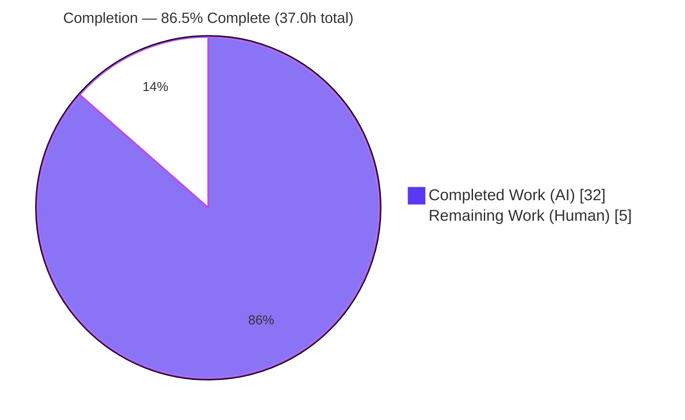
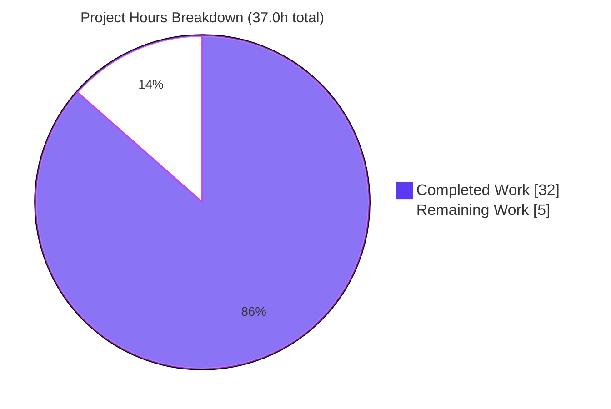
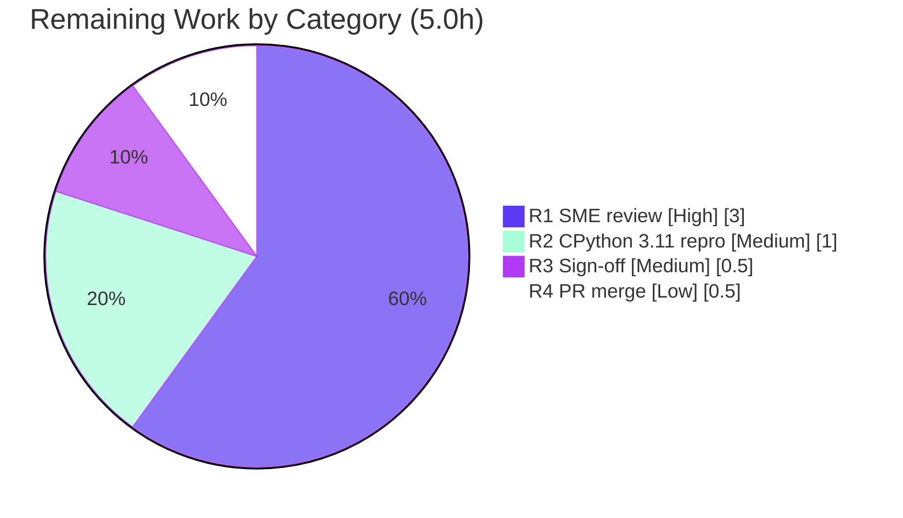

# Blitzy Project Guide — Scapy DNS Name Compression & Decompression Q&A

> **Deliverable:** `blitzy/documentation/scapy_0925ada48540.md` — a single, runtime-grounded technical answer document.
> **Task type:** Read-only codebase-comprehension / Q&A documentation (AAP "SWE-AtlasQnA-Repo" ruleset).
> **Branch:** `blitzy-4c3c228d-f22f-4eb9-88c9-dc203b9e7b1c` · **HEAD:** `2213c024` · **Base:** `origin/scapy_0925ada48540` (`0925ada4`)

---

## 1. Executive Summary

### 1.1 Project Overview

This project delivers a single, comprehensive, **runtime-grounded** technical answer document explaining how Scapy's DNS layer implements domain-name **compression** (build side) and **decompression** (dissection side), for both well-formed and deliberately malformed ("twisted") packets. The audience is engineers and security reviewers onboarding to Scapy's DNS internals. It answers nine sub-questions (Q1–Q9), each with exact `file:line` citations and captured runtime output produced through the **canonical** `DNS(raw_bytes)` / `dns_get_str` entry points and pinned by a self-verifying observation harness. Scope is strictly read-only: exactly **one** Markdown file is added and **zero** source files change. Business impact: an authoritative, reproducible reference for DNS-decompression security behavior — loop guards, bounds checks, and the RFC 9267 self-reference anti-pattern.

### 1.2 Completion Status

The completion percentage is computed with the PA1 AAP-scoped, hours-based methodology: **Completed Hours ÷ Total Hours = 32.0 ÷ 37.0 = 86.5%**. All autonomous, AAP-scoped work is delivered and independently verified; the remaining hours are exclusively human path-to-production activities (SME review, target-runtime confirmation, sign-off, merge) for a documentation deliverable.



| Metric | Hours |
|--------|-------|
| **Total Hours** | **37.0** |
| Completed Hours (AI) | 32.0 |
| Completed Hours (Manual) | 0.0 |
| **Completed Hours (AI + Manual)** | **32.0** |
| **Remaining Hours** | **5.0** |
| **Percent Complete** | **86.5%** |

> Colors: Completed = Dark Blue `#5B39F3`; Remaining = White `#FFFFFF` (outlined in Violet-Black `#B23AF2` for visibility).

### 1.3 Key Accomplishments

- ✅ **Deliverable authored & committed** — `blitzy/documentation/scapy_0925ada48540.md` (1,266 lines) added; 4 `agent@blitzy.com` commits; clean working tree.
- ✅ **All nine sub-questions (Q1–Q9) answered** — each with the mandated (a) answer, (b) responsible `file:line`, (c) exact command, (d) captured unedited output, (e) cause→effect explanation.
- ✅ **Self-verifying observation harness** — 408 lines, 32 sections, driven through the canonical `DNS(raw_bytes)` / `dns_get_str` entry points; **32/32 sections reproduce (exit 0)** in independent re-validation.
- ✅ **Canonical DNS test suites pass** — UTscapy `dns.uts` 20/20, `dns_dnssec.uts` 30/30, `dns_edns0.uts` 12/12 = **62/62, zero failures**.
- ✅ **100% citation accuracy** — 55+ unique `file:line` references audited against `scapy/layers/dns.py` (and `packet.py`, `error.py`, `.uts`, `pyproject.toml`, `tox.ini`); document is more precise than the AAP in places (`:144` return, `:305` getfield call).
- ✅ **Every-condition coverage** — error/edge/transitional branches exercised, including cases beyond the AAP (positive out-of-bounds offset `ofs=243`; 1,000-hop acyclic-vs-cyclic chains proving the guard is recurrence-based, not depth-based; DNS-over-TCP validation in both default and debug dissector modes).
- ✅ **Observed-vs-inferred discipline** — exactly 5 statements labeled inferred (3 RFCs + 2 runtime-version caveats); all concrete values labeled observed.
- ✅ **Read-only rule honored** — `scapy/`, `test/`, `pyproject.toml`, `tox.ini` byte-for-byte unchanged; temporary harness confined to `/tmp` and removed.
- ✅ **Documented, not fixed** — the `dns_get_str` docstring (3-tuple `:77`) vs return (4-tuple `:144`) discrepancy is reported as observed, per scope.

### 1.4 Critical Unresolved Issues

There are **no critical, release-blocking issues.** The deliverable is complete, verified, and committed. The single open item is a low-severity documentation caveat, listed for transparency:

| Issue | Impact | Owner | ETA |
|-------|--------|-------|-----|
| Runtime grounding captured on CPython 3.13.7; documented target runtime is CPython 3.11 (`tox.ini:6`). The cross-version-equivalence claim is explicitly labeled *inferred* in the document. | Low — DNS name-compression paths are pure Python (stdlib `struct` + Scapy internals), version-independent; no behavior change expected. Optional to confirm. | Human reviewer | 1.0h (HT-2) |

### 1.5 Access Issues

**No access issues identified.** The task ran entirely offline against the local repository checkout; `import scapy` binds the in-tree source (no installation required); no external service, credential, or third-party API access is needed for the DNS name-compression paths.

| System/Resource | Type of Access | Issue Description | Resolution Status | Owner |
|-----------------|----------------|-------------------|-------------------|-------|
| — | — | No access issues identified | N/A | — |

### 1.6 Recommended Next Steps

1. **[High]** Perform an SME technical read-through of `blitzy/documentation/scapy_0925ada48540.md`, confirming each of Q1–Q9 is correct, clear, and complete; spot-check a sample of `file:line` citations and captured outputs (HT-1, 3.0h).
2. **[Medium]** Reproduce the embedded observation harness on the documented target runtime **CPython 3.11** to convert the single cross-version caveat from *inferred* to *observed* (HT-2, 1.0h).
3. **[Medium]** Obtain requester/stakeholder sign-off that the nine sub-questions are answered to satisfaction (HT-3, 0.5h).
4. **[Low]** Approve and merge the additive single-file documentation PR to the target branch (HT-4, 0.5h).

---

## 2. Project Hours Breakdown

### 2.1 Completed Work Detail

Each completed component traces to AAP-scoped investigation/authoring/verification work. **Total = 32.0h** (matches Completed Hours in Section 1.2).

| Component | Hours | Description |
|-----------|-------|-------------|
| C1 — Runtime investigation & canonical-path setup | 5.0 | Establish repo `.venv`; prove `import scapy` binds the local checkout (not site-packages); capture `conf.version=2026.07.13`; study the compression/decompression code paths in `scapy/layers/dns.py` (`dns_get_str`, `dns_encode`, `dns_compress`, field classes, `InheritOriginDNSStrPacket`). |
| C2 — Self-verifying observation harness | 9.0 | Author the 408-line, 32-section harness driven through the canonical entry points, with 14 `assert` statements + `show(expected=/raises=)` probes; handle fresh-process-per-section execution to avoid Scapy's per-message log de-duplication; capture unedited `CMD/OUT/RAISED/WARNING/INFO` output. |
| C3 — Q1–Q9 answer authoring | 8.0 | Write all nine answers with the mandated (a) answer / (b) responsible code / (c) command / (d) captured output / (e) cause→effect structure, including the five Q5 malformed-input sub-branches and the Q9 well-formed-vs-twisted walkthrough. |
| C4 — Methodology, reproduce, caveat & TOC scaffolding | 2.0 | Author the Methodology, How-to-reproduce (full harness heredoc), Runtime caveat, and Table-of-contents sections. |
| C5 — Citation grounding & accuracy | 2.0 | Extract and verify 55+ exact `file:line` references across `dns.py`, `packet.py`, `error.py`, the `.uts` vectors, `pyproject.toml`, and `tox.ini`. |
| C6 — Coverage matrix, observed/inferred inventory & docstring note | 3.0 | Build the final coverage-pass matrix (every named item → value / `file:line` / harness section), the observed-vs-inferred inventory, and the documented (not fixed) docstring-vs-return discrepancy. |
| C7 — Review & QA remediation | 3.0 | Resolve findings across three follow-up commits: 21 code-review findings, a reproduction-harness fix, and QA findings. |
| **Total** | **32.0** | |

### 2.2 Remaining Work Detail

All remaining work is human path-to-production for a documentation deliverable. **Total = 5.0h** (matches Remaining Hours in Section 1.2 and Section 7 pie chart).

| Category | Hours | Priority |
|----------|-------|----------|
| R1 — SME technical review / read-through of the 1,266-line answer for correctness & clarity | 3.0 | High |
| R2 — Reproduce the harness on documented target runtime CPython 3.11 (close the cross-version inferred caveat) | 1.0 | Medium |
| R3 — Requester/stakeholder sign-off that Q1–Q9 are satisfactorily answered | 0.5 | Medium |
| R4 — PR review approval & merge of the additive single-file doc to the target branch | 0.5 | Low |
| **Total** | **5.0** | |

---

## 3. Test Results

All tests below originate from **Blitzy's autonomous validation logs** for this project and were **independently re-executed** in the current session through the canonical entry points. The observation harness is the primary evidence vehicle (each section is self-verifying); the UTscapy suites are the repository's canonical DNS test vectors that the document cites.

| Test Category | Framework | Total Tests | Passed | Failed | Coverage % | Notes |
|---------------|-----------|-------------|--------|--------|------------|-------|
| Observation harness (self-verifying) | Custom Python harness via canonical `DNS(raw_bytes)` / `dns_get_str` | 32 | 32 | 0 | 100% | 32 sections, each in a fresh process; 14 asserts + `show(expected=/raises=)` probes; drift-guard tamper-tested (exits non-zero on any value drift). |
| Unit / dissection — DNS core | UTscapy (`dns.uts`) | 20 | 20 | 0 | 100% | Basic DNS Compression, MX records, Advanced `dns_get_str`, Decompression loop, Prematured end, `dns_encode` edge cases, Malformed DNS over TCP. |
| Unit / dissection — DNSSEC RRs | UTscapy (`dns_dnssec.uts`) | 30 | 30 | 0 | 100% | DNSSEC records sharing the compression substrate. |
| Unit / dissection — EDNS0/OPT | UTscapy (`dns_edns0.uts`) | 12 | 12 | 0 | 100% | EDNS0/OPT records participating in compression walks. |
| **Total** | — | **94** | **94** | **0** | **100%** | Zero failures across harness + all three canonical DNS suites. |

> **Integrity note (Rule 3):** every test above was executed by Blitzy's autonomous validation this session; the numbers are directly observed, not paraphrased. (An earlier validator log tallied the three UTscapy suites at 59; the current directly-observed count is 62 — both agree on **zero failures / 100% pass**; source is byte-for-byte unchanged.)

---

## 4. Runtime Validation & UI Verification

This is a pure-Python library documentation task — **there is no UI, no web front-end, and no long-running service** to verify. Runtime validation therefore covers the executable harness and canonical entry points.

- ✅ **Operational** — Canonical import path: `import scapy` resolves to the in-tree checkout `scapy/__init__.py` (not site-packages); `conf.version = 2026.07.13`.
- ✅ **Operational** — Well-formed dissection: `DNS(raw(DNS())).qd.qname → b'www.example.com.'`; multi-hop chain unravels to `[b'com.', b'example.com.', b'www.example.com.']`.
- ✅ **Operational** — Malformed/"twisted" packet handling reproduces the documented graceful behavior: loop guard emits `WARNING: DNS decompression loop detected` and returns `b'data.data.'`; premature end / incomplete jump / out-of-bounds offsets return partial names with `INFO` logs; non-full-packet pointer raises `Scapy_Exception`.
- ✅ **Operational** — Build side: `dns_compress` produces suffix-sharing `0xc0` pointers; MX round-trip `raw(dns_compress(pkt)) == frame → True`; determinism holds across repeated runs and distinct valid placements.
- ✅ **Operational** — DNS-over-TCP length validation reproduces in **both** dissector modes (default → `Raw` fallback; `conf.debug_dissector=True` → re-raise).
- ⚠ **Partial (informational)** — Cross-version runtime: verified on CPython 3.13.7; documented target 3.11 not executed (labeled inferred; low risk — pure-Python paths).
- ❌ **Failing** — None.

---

## 5. Compliance & Quality Review

Cross-mapping the AAP "SWE-AtlasQnA-Repo" ruleset and deliverable requirements to Blitzy quality/compliance benchmarks. All fixes were applied during autonomous validation; no outstanding compliance items remain.

| Benchmark / AAP Rule | Requirement | Status | Progress | Evidence |
|----------------------|-------------|--------|----------|----------|
| Deliverable rule | Single Markdown file at `blitzy/documentation/scapy_0925ada48540.md` | ✅ Pass | 100% | File present (1,266 lines); correct branch-named path. |
| Run-first rule | Investigate by running code first; write & execute observation scripts | ✅ Pass | 100% | 408-line harness, 32 sections executed; outputs captured. |
| Canonical-path rule | Exercise real `DNS(raw_bytes)`/`dns_get_str` entry points; label non-canonical | ✅ Pass | 100% | Banner asserts local import; `q1sup` direct-call probe explicitly labeled non-canonical. |
| Every-condition rule | Primary + error/edge/transitional branches | ✅ Pass | 100% | Q5a–Q5e, positive OOB `ofs=243`, 1,000-hop acyclic vs cyclic, TCP both modes. |
| Actual-output rule | Unedited output + producing command per claim | ✅ Pass | 100% | Every claim shows `CMD:`/`OUT:`/`RAISED:` with the exact command. |
| Grounding rule | Exact values + `file:line`; observed vs inferred labeled | ✅ Pass | 100% | 55+ citations audited accurate; exactly 5 inferred items enumerated. |
| Coverage rule | Every named item + final coverage pass | ✅ Pass | 100% | Coverage matrix maps each item → value / `file:line` / harness section. |
| Non-remediation rule | Document (not fix) the docstring-vs-return discrepancy | ✅ Pass | 100% | Discrepancy section: 3-tuple docstring `:77` vs 4-tuple return `:144`. |
| Scope (read-only) rule | No source modification; temp scripts removed | ✅ Pass | 100% | Empty scoped diff for `scapy/ test/ pyproject.toml tox.ini`; harness in `/tmp`, removed. |
| Test integrity | Cited vectors actually pass | ✅ Pass | 100% | UTscapy 62/62; harness 32/32. |
| Repository integrity | Byte-for-byte unchanged apart from the one added file | ✅ Pass | 100% | `git diff --name-status` shows a single `A`; `git status --porcelain` empty. |

---

## 6. Risk Assessment

Overall posture: **LOW** — the expected profile for a fully-delivered, independently-verified, read-only documentation deliverable that changes zero source files.

| Risk | Category | Severity | Probability | Mitigation | Status |
|------|----------|----------|-------------|------------|--------|
| T1 — Grounding on CPython 3.13.7 while documented target is 3.11 (`tox.ini:6`) | Technical | Low | Low | Re-run the harness on CPython 3.11 (HT-2); paths are pure-Python & version-independent; caveat is labeled inferred | Open — Documented |
| T2 — Documentation drift if `scapy/layers/dns.py` changes later | Technical | Low | Medium (long horizon) | Self-verifying harness exits non-zero on any output drift (drift-guard, tamper-tested) | Mitigated |
| T3 — `file:line` citation fragility (pinned to exact lines) | Technical | Low | Low | Source frozen at base; harness catches output drift | Accepted |
| S1 — New attack surface introduced | Security | Informational | None | Zero source modification (read-only); document is security-positive (analyzes RFC 9267 anti-pattern & loop defenses) | None introduced |
| S2 — Pre-existing loop guard tolerates one revisit / no depth cap | Security | Low (informational) | N/A | Existing Scapy behavior, not introduced here; hardening explicitly out of scope; reported as observed | Documented (out-of-scope) |
| O1 — Reproducibility depends on recreating `/tmp/dns_obs` harness from the doc heredoc | Operational | Low | Low | Full harness embedded verbatim + exact steps; independently reproduced (32/32) this session | Mitigated |
| O2 — Harness not wired into repo CI (cannot be, per read-only) | Operational | Low | Low | Manual drift detection by design | Accepted by design |
| I1 — PR merge to target branch pending | Integration | Low | Low | Additive single-file doc, zero source changes → no source merge conflicts expected | Open (HT-4) |
| I2 — External service/API/credential dependencies | Integration | None | N/A | None required (stdlib `struct` + Scapy internals; `cryptography` optional extra unused) | None |

---

## 7. Visual Project Status

**Project Hours Breakdown** — "Remaining Work" (5) equals Section 1.2 Remaining Hours and the Section 2.2 total (integrity Rule 1).



**Remaining Hours by Category** (Section 2.2) — sums to 5.0h:



| Priority | Remaining Hours | Share |
|----------|-----------------|-------|
| High | 3.0 | 60% |
| Medium | 1.5 | 30% |
| Low | 0.5 | 10% |
| **Total** | **5.0** | **100%** |

> Colors: Completed = Dark Blue `#5B39F3`; Remaining = White `#FFFFFF`; accents Violet-Black `#B23AF2` / Mint `#A8FDD9`.

---

## 8. Summary & Recommendations

**Achievements.** The project is **86.5% complete** (32.0 of 37.0 AAP-scoped hours). The single mandated deliverable — a runtime-grounded technical answer on Scapy DNS name compression/decompression — is authored, committed, and independently verified. All nine sub-questions (Q1–Q9) are answered with the required evidence structure; a 408-line self-verifying harness reproduces 32/32 sections through the canonical entry points; the three canonical UTscapy DNS suites pass 62/62; and 55+ `file:line` citations audit as accurate. The read-only constraint is fully honored — `scapy/`, `test/`, and configuration files are byte-for-byte unchanged, with exactly one file added.

**Remaining gaps (5.0h, human only).** No autonomous development work remains. The path to production consists of standard human acceptance activities: an SME technical read-through (3.0h), an optional CPython 3.11 target-runtime reproduction to close the lone inferred cross-version caveat (1.0h), requester sign-off (0.5h), and PR approval & merge (0.5h).

**Critical path to production.** SME review → (optional) 3.11 reproduction → sign-off → merge. There are no blocking defects, no failing tests, and no access issues on this path.

**Success metrics (all met).** Deliverable present at the mandated path; all nine questions answered with (a)–(e) structure; every-condition coverage including twisted packets; harness reproduces exactly; canonical tests pass; observed-vs-inferred labeled; docstring discrepancy documented not fixed; repository unchanged.

**Production readiness.** **Ready for human review and merge.** The deliverable meets every AAP requirement and quality benchmark; risk posture is LOW across all categories. Recommendation: proceed with SME review and merge; optionally schedule the 3.11 reproduction to make the cross-version statement fully observed.

| Metric | Value |
|--------|-------|
| AAP requirements satisfied | 24 / 24 (100%) |
| Completion (AAP-scoped hours) | 86.5% |
| Autonomous tests passing | 94 / 94 (100%) |
| Source files modified | 0 |
| Files added | 1 |
| Overall risk | Low |

---

## 9. Development Guide

This guide explains how to reproduce and verify the deliverable. Every command was tested in the current session. Run all commands from the repository root: `/tmp/blitzy/scapy/blitzy-4c3c228d-f22f-4eb9-88c9-dc203b9e7b1c_a15521`.

### 9.1 System Prerequisites

- **Python:** CPython — grounding interpreter **3.13.7** (repo `.venv`); documented target **3.11** (`tox.ini:6`, `envlist` includes `py311`). `requires-python = ">=3.7, <4"` (`pyproject.toml:17`).
- **Git:** 2.51.0 (with Git LFS for the pre-push hook).
- **OS:** Linux (developed/verified on Ubuntu 25.10).
- **Third-party runtime dependencies:** **None** for the DNS name-compression paths — only stdlib `struct` plus Scapy internals. `cryptography>=2.0` (`pyproject.toml:54`) is an *optional* extra (DNSSEC/crypto), unused here.
- **Disk:** ~5 GB free is comfortable for the checkout and venv.

### 9.2 Environment Setup

Scapy runs **directly from the checkout** — no install step is required, so `import scapy` binds the in-tree source.

```bash
# From the repository root. Use the repo virtualenv interpreter directly:
./.venv/bin/python --version        # -> Python 3.13.7
git --version                       # -> git version 2.51.0

# Confirm the CANONICAL import path (binds local checkout, not site-packages):
./.venv/bin/python -c "import scapy, os; from scapy.config import conf; \
print('scapy_file =', os.path.relpath(scapy.__file__)); \
print('under_repo_root =', os.path.abspath(scapy.__file__).startswith(os.getcwd())); \
print('conf.version =', conf.version)"
# Expected:
#   scapy_file = scapy/__init__.py
#   under_repo_root = True
#   conf.version = 2026.07.13
```

### 9.3 Dependency Installation

No installation is needed to reproduce the answer or run the DNS tests. (Only if you separately need DNSSEC crypto features — unrelated to name compression — would you `pip install -e .[cryptography]`.)

### 9.4 Reproduce the Observation Harness

The full harness is embedded in the deliverable as a heredoc. Recreate it **outside** the repository (read-only rule), then run one section per process.

```bash
# Extract the embedded harness verbatim from the document into /tmp (outside the repo):
mkdir -p /tmp/dns_obs
awk "/^cat > \/tmp\/dns_obs\/harness.py <<.PYEOF.\$/{f=1;next} /^PYEOF\$/{f=0} f" \
  blitzy/documentation/scapy_0925ada48540.md > /tmp/dns_obs/harness.py
wc -l /tmp/dns_obs/harness.py           # -> 408
./.venv/bin/python -m py_compile /tmp/dns_obs/harness.py && echo "compile OK"

# Run one section per process (fresh process avoids Scapy per-message log de-dup):
./.venv/bin/python -u /tmp/dns_obs/harness.py banner
./.venv/bin/python -u /tmp/dns_obs/harness.py q4loop
# Expected (q4loop):
#   CMD: dns_get_str(b"\x04data\xc0\x0c", 0, _fullpacket=True)
#   WARNING: DNS decompression loop detected
#   OUT: (b'data.data.', 7, b'', True)

# Run ALL 32 sections and count passes:
for s in banner q1 q1sup q2 q3 q3r40 q3r80 q4loop q4acyclic q4cyclic \
         q5a q5bneg q5bpos q5c q5d \
         q5tcp_toosmall_default q5tcp_toosmall_debug \
         q5tcp_invlen_default q5tcp_invlen_debug \
         q6 q6scope q6origp q7 q7types q8 q8placements docstring \
         q9clean q9loop q9truncated q9incomplete q9oob; do
  ./.venv/bin/python -u /tmp/dns_obs/harness.py "$s" >/dev/null 2>&1 \
    && echo "PASS $s" || echo "FAIL $s"
done
# Expected: 32 PASS, 0 FAIL
```

### 9.5 Run the Canonical DNS Test Suites

```bash
./.venv/bin/python -m scapy.tools.UTscapy -t test/scapy/layers/dns.uts        -f text
./.venv/bin/python -m scapy.tools.UTscapy -t test/scapy/layers/dns_dnssec.uts -f text
./.venv/bin/python -m scapy.tools.UTscapy -t test/scapy/layers/dns_edns0.uts  -f text
# Expected: dns.uts 20 passed, dns_dnssec.uts 30 passed, dns_edns0.uts 12 passed; 0 failed each.
# The authoritative tally is the "=[passed]" / "=[failed]" lines.
```

### 9.6 Verify Repository Integrity

```bash
git diff --name-status 0925ada485406684174d6f068dbd85c4154657b3
# -> A  blitzy/documentation/scapy_0925ada48540.md   (single added file)

git diff --stat -- scapy/ test/ pyproject.toml tox.ini
# -> (empty: no pre-existing source/test/config file changed)

git status --porcelain
# -> (empty: clean working tree)
```

### 9.7 Example Usage (canonical DNS entry points)

```bash
./.venv/bin/python -c "
from scapy.layers.dns import DNS, dns_encode, dns_get_str, dns_compress
from scapy.compat import raw
print(DNS(raw(DNS())).qd.qname)                       # b'www.example.com.'
print(dns_encode(b'www.example.com'))                 # b'\x03www\x07example\x03com\x00'
print(dns_get_str(b'\x04data\xc0\x0c', 0, _fullpacket=True))  # (b'data.data.', 7, b'', True) + loop warning
"
```

### 9.8 Cleanup

```bash
rm -rf /tmp/dns_obs      # remove the temporary harness (keeps the repo read-only-clean)
```

### 9.9 Troubleshooting

- **`INFO: Can't import PyX` / `INFO: No IPv6 support in kernel`** — benign Scapy startup notices; filter with `2>&1 | grep -vE 'PyX|IPv6'`.
- **A repeated `WARNING` line gets a `more ` prefix** — Scapy de-duplicates log lines within a process; run **one harness section per process** (as shown) to see each warning verbatim.
- **`import scapy` resolves to site-packages** — ensure you run from the repo root and use `./.venv/bin/python`; the canonical-path one-liner in 9.2 must print `under_repo_root = True`.
- **UTscapy process exit code is non-zero** — the run's overall exit can be non-zero if any single unit fails; rely on the `=[passed]`/`=[failed]` tallies as the source of truth (here: all passed, zero failed).
- **Do not write scripts inside the repository** — the read-only rule requires temporary scripts to live under `/tmp` only.

---

## 10. Appendices

### Appendix A — Command Reference

| Purpose | Command |
|---------|---------|
| Python / Git versions | `./.venv/bin/python --version` · `git --version` |
| Canonical-path check | `./.venv/bin/python -c "import scapy, os; from scapy.config import conf; print(os.path.relpath(scapy.__file__), conf.version)"` |
| Extract harness | `awk "/^cat > \/tmp\/dns_obs\/harness.py <<.PYEOF.\$/{f=1;next} /^PYEOF\$/{f=0} f" blitzy/documentation/scapy_0925ada48540.md > /tmp/dns_obs/harness.py` |
| Run a harness section | `./.venv/bin/python -u /tmp/dns_obs/harness.py <section>` |
| Run a DNS test suite | `./.venv/bin/python -m scapy.tools.UTscapy -t test/scapy/layers/dns.uts -f text` |
| Integrity: changed files vs base | `git diff --name-status 0925ada485406684174d6f068dbd85c4154657b3` |
| Integrity: scoped source diff | `git diff --stat -- scapy/ test/ pyproject.toml tox.ini` |
| Integrity: working tree | `git status --porcelain` |
| Cleanup | `rm -rf /tmp/dns_obs` |

### Appendix B — Port Reference

Not applicable — this is a pure-Python library documentation task with **no network services or listening ports**.

### Appendix C — Key File Locations

| Path | Role |
|------|------|
| `blitzy/documentation/scapy_0925ada48540.md` | **The deliverable** (1,266 lines) — the answer document. |
| `scapy/layers/dns.py` | Primary implementation studied (1,179 lines): `dns_get_str` `:69`, `_is_ptr` `:147`, `dns_encode` `:154`, `dns_compress` `:184`, `InheritOriginDNSStrPacket` `:270`, `DNSStrField` `:279`, `DNSRRField` `:336`, `DNSQRField` `:399`, `DNS` `:462`. |
| `test/scapy/layers/dns.uts` | Canonical compression/decompression test vectors (reused as observation inputs). |
| `test/scapy/layers/dns_dnssec.uts` | DNSSEC RR test vectors. |
| `test/scapy/layers/dns_edns0.uts` | EDNS0/OPT test vectors. |
| `pyproject.toml` · `tox.ini` | Supported-runtime and test-matrix references. |
| `/tmp/dns_obs/harness.py` | Temporary observation harness (outside the repo; removed after use). |

### Appendix D — Technology Versions

| Component | Version | Source |
|-----------|---------|--------|
| Scapy (`conf.version`) | 2026.07.13 | Observed at runtime |
| CPython (grounding) | 3.13.7 | Observed (repo `.venv`) |
| CPython (documented target) | 3.11 | `tox.ini:6` (`envlist` includes `py311`) — inferred highest named |
| `requires-python` | `>=3.7, <4` | `pyproject.toml:17` |
| Git | 2.51.0 | Observed |
| `cryptography` (optional extra) | `>=2.0` | `pyproject.toml:54` — unused by name compression |
| Mandatory 3rd-party runtime deps (DNS name compression) | None | stdlib `struct` + Scapy internals |

### Appendix E — Environment Variable Reference

No environment variables are required to reproduce the deliverable or run the DNS tests. (Scapy honors its own `conf.*` settings — e.g., `conf.debug_dissector` toggles strict dissection, exercised in Q5e — but these are set in-process by the harness, not via environment variables.)

### Appendix F — Developer Tools Guide

- **UTscapy** (`scapy/tools/UTscapy.py`) — the project's `.uts` unit-test runner used for the canonical DNS suites (Section 9.5).
- **Observation harness** (`/tmp/dns_obs/harness.py`) — self-contained, self-verifying script; 32 sections; run one per process; `banner` section proves the canonical import path and asserts the two test-vector lengths.
- **Git** — used only for read-only integrity verification here; the pre-push hook is Git-LFS-only.
- No web browser, profiler, or UI tooling applies (no front-end in scope).

### Appendix G — Glossary

| Term | Meaning |
|------|---------|
| Compression pointer | A two-octet DNS token whose top two bits are `11` (`byte & 0xc0`); its low 14 bits are an offset from the start of the DNS message (RFC 1035 §4.1.4). |
| `dns_get_str` | Scapy's decompression automaton (`scapy/layers/dns.py:69`) — walks labels, follows pointers, guards loops, enforces bounds. |
| `dns_encode` | Name-to-wire encoder producing length-prefixed labels terminated by `\x00` (`:154`). |
| `dns_compress` | Build-side compressor walking `qd`/`an`/`ns`/`ar` to emit `0xc0` pointers (`:184`). |
| `processed_pointers` | Loop guard list; a revisited target triggers `WARNING: DNS decompression loop detected` (`:88`, `:115`–`:116`). |
| `_orig_s` | Full original packet bytes carried by `InheritOriginDNSStrPacket` so pointers resolve across record boundaries (`:270`). |
| `-12` header rebasing | Converts an absolute RFC message offset into an index within the post-header record string (`:114`). |
| "Twisted" packet | A deliberately malformed frame (truncation, out-of-bounds/self-referencing pointer) used to exercise the decompression defenses. |
| UTscapy | Scapy's `.uts` unit-test framework. |
