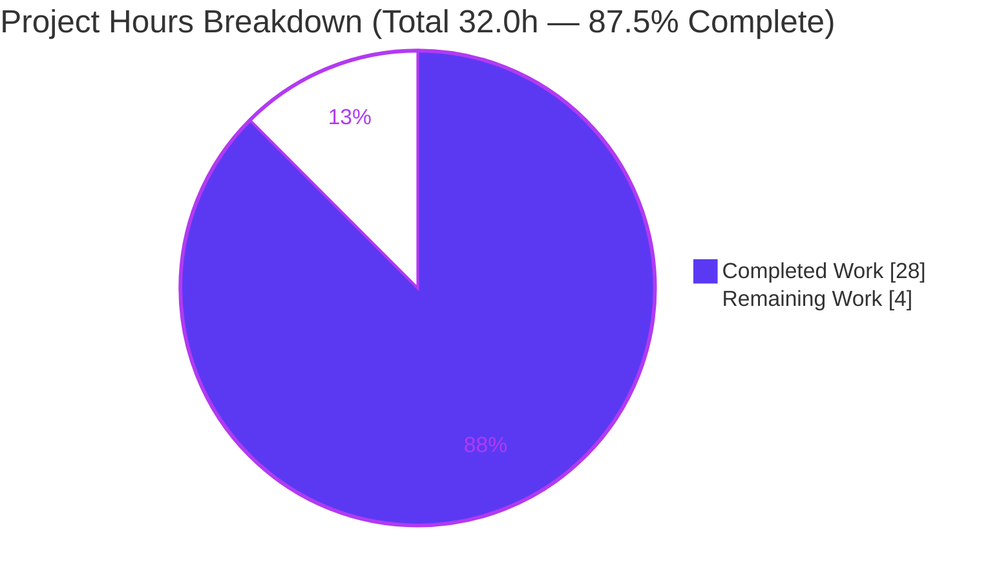
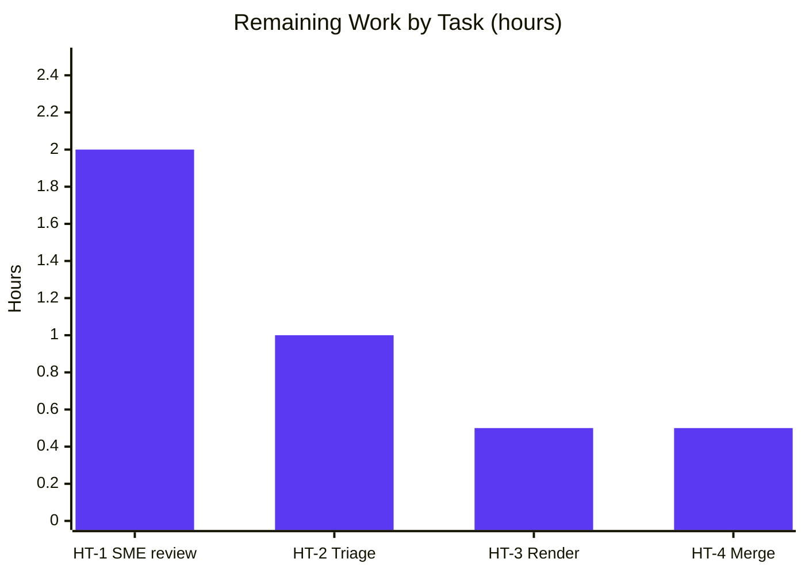

# Blitzy Project Guide — Scapy ICMP Error-to-Request Matching (Runtime-Observed Answer Document)

> **Brand color legend:** Completed / AI Work = **Dark Blue `#5B39F3`** · Remaining / Not Completed = **White `#FFFFFF`** · Headings / Accents = Violet-Black `#B23AF2` · Highlight = Mint `#A8FDD9`.

---

## 1. Executive Summary

### 1.1 Project Overview

This project delivers a single, comprehensive, **runtime-observed** answer document, `blitzy/documentation/scapy_0925ada48540.md`, that explains precisely how Scapy matches inbound ICMP error messages to the outbound requests that triggered them. The audience is Scapy developers and network engineers investigating request/response correlation. The document answers five question clusters (Q1–Q5) — the two-stage `hashret()`/`answers()` matcher, the byte-exact hash mechanism, TTL/checksum tolerance and configuration toggles, byte-swapped IP-ID tolerance, and RFC 4884 extension parsing — with byte-exact captured output grounded to `file:line`. It is a strictly read-only, investigate-by-running task; no Scapy source was modified.

### 1.2 Completion Status

The project is **87.5% complete**, measured on AAP-scoped and path-to-production work only (PA1 methodology): 28.0 autonomous hours delivered out of 32.0 total, leaving 4.0 hours of human review/publish work.


| Metric | Hours |
|--------|-------|
| **Total Hours** | 32.0 |
| **Completed Hours (AI + Manual)** | 28.0 (AI: 28.0 · Manual: 0.0) |
| **Remaining Hours** | 4.0 |
| **Percent Complete** | **87.5%** |

> Formula: `28.0 / (28.0 + 4.0) × 100 = 87.5%`.

### 1.3 Key Accomplishments

- ✅ **Q1 — Two-stage matcher** fully answered: `IP.hashret()` recurses into the embedded citation for ICMP error types `[3,4,5,11,12]` (O(1) bucket), then `IP.answers()` → `IPerror.answers()` confirms field-by-field. Verified `err.answers(req)=1`, `req.answers(err)=0` (directional).
- ✅ **Q2 — Hash mechanism** decomposed byte-exact: request and error both hash to `000000030134120100` = `strxor(src,dst)` (`00000003`) + proto (`01`) + `struct.pack("HH", 0x1234, 1)` (`34120100`).
- ✅ **Q3 — TTL/checksum tolerance & toggles**: proved `IPerror.answers()` compares only `src`/`dst`/`id`/`proto` (TTL & checksum never inspected); documented `conf.checkIPsrc` (default True, acts at both stages) and `conf.check_TCPerror_seqack` (default False) on TCP and UDP-in-error citations.
- ✅ **Q4 — Byte-swapped IP-ID**: `socket.htons(0x1234)=0x3412` (involutory); swept `conf.checkIPID` across False/1/2, reproduced the "sometimes matches" behavior, and documented the genuine **checkIPID=2 comment-vs-code discrepancy**.
- ✅ **Q5 — RFC 4884 extensions**: dissected an oversized error with and without `load_contrib('icmp_extensions')`; match validity (`hashret`/`answers`) is **identical** — only the dissection tree changes. Boundary sweep (144–172) reproduced; RFC 4884 §5.2 corroborated (144 = 8+128+4+4).
- ✅ **Coverage pass** over all 16 named items with concrete value, `file:line`, observed evidence, sibling variants, and causal reasoning.
- ✅ **Read-only mandate honored**: single file added; `git diff <base>` on `scapy/ test/ doc/` is empty; all temporary probes cleaned up.
- ✅ **11/11 runtime probes** pass byte-exact, stable across ≥2 runs, under the canonical venv interpreter.

### 1.4 Critical Unresolved Issues

| Issue | Impact | Owner | ETA |
|-------|--------|-------|-----|
| None blocking — no compilation, test, or functional failures | No release blocker; deliverable complete & validated | — | — |
| `checkIPID=2` comment-vs-code discrepancy (documented finding, not a defect in the deliverable) | Informational; requires a human disposition (document-only vs upstream Scapy issue) | Human reviewer | Within HT-2 (1.0h) |

> There are **no critical unresolved issues that block release or validation.** The one behavioral discrepancy is a genuine, correctly-documented Scapy finding surfaced by the investigation; it requires a human triage decision, not a fix to this deliverable.

### 1.5 Access Issues

| System/Resource | Type of Access | Issue Description | Resolution Status | Owner |
|-----------------|----------------|-------------------|-------------------|-------|
| Scapy repository | Git read/write | Full access confirmed; branch `blitzy-cedc336c-…` checked out; commits landed | ✅ Resolved | — |
| Python / venv runtime | Local execution | Canonical interpreter `/opt/scapy-venv/bin/python` (CPython 3.12.7) available; Scapy imports in-tree | ✅ Resolved | — |
| Network privileges | Raw socket / send | Not required — matching predicates exercised in-memory on crafted/raw-dissected packets | ✅ N/A | — |

**No access issues identified** that prevent build validation, integration, or deployment. This is an in-memory, read-only investigation requiring no external services, credentials, or network access.

### 1.6 Recommended Next Steps

1. **[High]** Have a Scapy SME review and sign off on the five answers (Q1–Q5) and the Coverage Pass table, spot-checking ~60 `file:line` citations against source (HT-1, 2.0h).
2. **[Medium]** Triage the `checkIPID=2` comment-vs-code discrepancy: decide document-only vs filing an upstream Scapy issue, and file it if warranted (HT-2, 1.0h).
3. **[Medium]** Verify Markdown rendering in the target viewer — the single mermaid flowchart plus 54 code fences and tables (HT-3, 0.5h).
4. **[Medium]** Complete PR review, merge approval, and publish the deliverable to make it authoritative (HT-4, 0.5h).
5. **[Low]** *(Optional, uncounted)* Establish a periodic re-verification cadence to guard against citation line-number drift when Scapy source is upgraded.

---

## 2. Project Hours Breakdown

### 2.1 Completed Work Detail

Each row traces to a specific AAP requirement. All items are **Completed** (100%).

| Component | Hours | Description |
|-----------|-------|-------------|
| [AAP] Q1 — Two-stage matcher answer | 3.0 | `IP.hashret()` citation recursion + `IP.answers()`→`IPerror.answers()` confirmation; `SndRcvHandler` orchestration; directional `answers()` proof. Probe: `probe_q1q2`. |
| [AAP] Q2 — Hash decomposition | 2.5 | Byte-exact `000000030134120100` = `strxor`+proto+`struct.pack("HH",id,seq)`; id/seq folding. Probes: `probe_q2_decomp`, `probe_idseq`. |
| [AAP] Q3 — TTL/checksum + `checkIPsrc` + `check_TCPerror_seqack` | 3.5 | Proof TTL/checksum never compared; `checkIPsrc` at both stages; TCP & UDP-in-error toggle behavior. Probes: `probe_q3b`, `probe_q3`. |
| [AAP] Q4 — Byte-swap + `checkIPID` sweep + discrepancy | 2.5 | `socket.htons` involution; sweep False/1/2; "sometimes matches" reproduced 5×; comment-vs-code discrepancy. Probe: `probe_q4`. |
| [AAP] Q5 — RFC 4884 with/without contrib + boundary | 5.0 | Multi-process build→without→with handoff; dissection-tree diff; boundary sweep 144–172; naive vs valid extension. Probes: `probe_q5_build2`, `probe_q5_without2`, `probe_q5_with2`, `probe_q5_boundary`. |
| [AAP] Coverage pass (16 named items) + siblings | 2.5 | Named-item table + direct `ICMP.answers`, `checkIPinIP`, TCP ack, code-mismatch, error-type routing. Probe: `probe_named`. |
| [AAP] Web research — RFC 4884 §5.2 | 1.0 | Corroborated 144 = 8+128+4+4, 137th-octet rule, IP-header-relative reference vs Scapy implementation. |
| [AAP] Methodology + canonical build/version | 2.0 | Investigate-by-running discipline; `conf.version=2026.07.13`; `PYTHONPATH=$PWD` invocation; observed/inferred labeling; ≥2-run stability. |
| [AAP] Deliverable authoring | 2.0 | Created `blitzy/documentation/` dir + 1,655-line document; structure, ~60 `file:line` citations, valid Markdown (54 fences). |
| [AAP] Read-only compliance + temp cleanup | 0.5 | Zero source modifications (empty source diff); all 11 temp probes + helpers removed; adversarial cleanup verification. |
| [AAP] Iterative QA / review remediation | 3.5 | 3 review cycles: 14 code-review findings, QA findings, 6 citation off-by-one corrections (commits `fe314c63`, `a7832cfa`, `d80f81ad`). |
| **Total Completed** | **28.0** | **Matches Section 1.2 Completed Hours.** |

### 2.2 Remaining Work Detail

Each category is human path-to-production work (no autonomous work remains).

| Category | Hours | Priority |
|----------|-------|----------|
| [Path-to-production] SME technical review & sign-off of Q1–Q5 + Coverage Pass; spot-check citations (HT-1) | 2.0 | High |
| [Path-to-production] `checkIPID=2` comment-vs-code discrepancy triage; file upstream issue if warranted (HT-2) | 1.0 | Medium |
| [Path-to-production] Markdown/mermaid render verification in target viewer (HT-3) | 0.5 | Medium |
| [Path-to-production] PR review, merge approval & publish (HT-4) | 0.5 | Medium |
| **Total Remaining** | **4.0** | **Matches Section 1.2 Remaining Hours & Section 7 pie chart.** |

### 2.3 Hours Reconciliation

- Section 2.1 total (Completed) = **28.0h**
- Section 2.2 total (Remaining) = **4.0h**
- **28.0 + 4.0 = 32.0h = Total Project Hours** (Section 1.2) ✔
- Completion = `28.0 / 32.0 × 100 = 87.5%` — consistent across Sections 1.2, 7, and 8. ✔

---

## 3. Test Results

All tests below originate from Blitzy's autonomous validation logs for this project. They are **runtime observation probe scripts** — pure-Python programs that craft/dissect packets, invoke the real `hashret()`/`answers()`/`post_dissection` code paths, and assert **byte-exact** expected output ("ALL ASSERTIONS PASSED"). Executed under the canonical interpreter `/opt/scapy-venv/bin/python` (CPython 3.12.7), Scapy imported in-tree (`conf.version=2026.07.13`), each stable across ≥2 runs with rc=0 and clean stderr.

| Test Category | Framework | Total Tests | Passed | Failed | Coverage % | Notes |
|---------------|-----------|-------------|--------|--------|-----------|-------|
| Q1/Q2 — Matching & hashing | Python `assert` (runtime probes) | 3 | 3 | 0 | N/A¹ | `probe_q1q2`, `probe_q2_decomp`, `probe_idseq`; byte-exact hash `000000030134120100`, directional `answers()` |
| Q3 — TTL/checksum & toggles | Python `assert` (runtime probes) | 2 | 2 | 0 | N/A¹ | `probe_q3b`, `probe_q3`; `checkIPsrc`/`check_TCPerror_seqack` life-cycles |
| Q4 — Byte-swap & `checkIPID` | Python `assert` (runtime probes) | 1 | 1 | 0 | N/A¹ | `probe_q4`; `htons` involution; sweep False/1/2; "sometimes" repro ×5 |
| Q5 — RFC 4884 extensions | Python `assert` (runtime probes) | 4 | 4 | 0 | N/A¹ | `probe_q5_build2`, `probe_q5_without2`, `probe_q5_with2`, `probe_q5_boundary`; with/without contrib invariance; boundary 144–172 |
| Coverage / named-item siblings | Python `assert` (runtime probes) | 1 | 1 | 0 | N/A¹ | `probe_named`; direct `ICMP.answers`, `checkIPinIP`, TCP ack, code-mismatch, error-type routing |
| **Total** | — | **11** | **11** | **0** | **100% pass** | 22 "ALL ASSERTIONS PASSED" markers; stable ≥2 runs |

> ¹ **Coverage %** — Traditional code-coverage is not applicable: the probes exercise Scapy's **REFERENCE** source (not code owned by this task), which must not be instrumented or modified. Instead, **requirement coverage is 100%**: all 16 named items and all five question clusters (Q1–Q5) are exercised with byte-exact evidence. Pass rate is **11/11 = 100%**.

---

## 4. Runtime Validation & UI Verification

**Runtime health (probe execution under canonical venv):**

- ✅ **Operational** — `probe_q1q2` (Q1/Q2 baseline match): `req.hashret()==err.hashret()==000000030134120100`; `err.answers(req)=1`; `req.answers(err)=0`.
- ✅ **Operational** — `probe_q2_decomp` / `probe_idseq`: hash byte decomposition and id/seq folding confirmed.
- ✅ **Operational** — `probe_q3b` / `probe_q3`: TTL & checksum mutations leave `answers()=1`; `checkIPsrc` and `check_TCPerror_seqack` life-cycles reproduced.
- ✅ **Operational** — `probe_q4`: `htons(0x1234)=0x3412`; `checkIPID` False/1/2 sweep; "sometimes matches" reproduced on identical input.
- ✅ **Operational** — `probe_q5_build2` / `probe_q5_without2` / `probe_q5_with2` / `probe_q5_boundary`: match validity invariant with/without contrib; only dissection tree changes; boundary sweep reproduced including `struct.error` at `pkt.len` 157/159.
- ✅ **Operational** — `probe_named`: all 16 named-item assertions pass.

**API integration outcomes:**

- ✅ **N/A (by design)** — No network transmission. `hashret()`/`answers()`/`post_dissection` are the exact predicates `SndRcvHandler` invokes and are exercised in-memory; no raw sockets, no live host, no credentials.

**UI verification:**

- ✅ **N/A (no UI)** — This is a library/CLI code-comprehension task producing a Markdown document. There is no web interface, front-end, or rendered application to verify. The only visual artifact is the Markdown deliverable itself, whose rendering check is tracked as HT-3.

---

## 5. Compliance & Quality Review

Cross-mapping AAP deliverables to Blitzy quality and compliance benchmarks. Fixes applied during autonomous validation are noted.

| AAP Deliverable / Benchmark | Requirement | Status | Fixes Applied / Evidence |
|-----------------------------|-------------|--------|--------------------------|
| Q1 answered by-name | Two-stage matcher, embedded extraction | ✅ Pass | `probe_q1q2`; doc §Q1; `inet.py:L568-608, L1013-1033` |
| Q2 answered by-name | Byte-exact hash + decomposition | ✅ Pass | `probe_q2_decomp`; hash `000000030134120100` |
| Q3 answered by-name | TTL/checksum + `checkIPsrc` + `check_TCPerror_seqack` | ✅ Pass | `probe_q3b`/`probe_q3`; doc §Q3 |
| Q4 answered by-name | Byte-swap + `checkIPID` 1 vs 2 + "sometimes" repro | ✅ Pass | `probe_q4`; discrepancy documented |
| Q5 answered by-name | RFC 4884 with/without contrib + threshold | ✅ Pass | 4 Q5 probes; RFC §5.2 corroborated |
| Investigate-by-running mandate | Byte-exact runtime capture, not reading | ✅ Pass | 11 probes, actual output embedded verbatim |
| Observed vs inferred labeling | Every claim labeled | ✅ Pass | "bug" characterizations labeled inferred |
| ≥2-run stability | Reproducible output | ✅ Pass | Each probe stable across ≥2 runs |
| Coverage pass | Every named item by-name | ✅ Pass | 16/16 named items with `file:line` + evidence |
| Deliverable location/name | `blitzy/documentation/<branch>.md` | ✅ Pass | `scapy_0925ada48540.md` created |
| **Read-only mandate (CRITICAL)** | Zero source modification | ✅ Pass | `git diff <base> -- scapy/ test/ doc/` empty |
| Temp-script cleanup | All `/tmp` probes removed | ✅ Pass | 11 probes + helpers deleted; tree clean |
| Citation accuracy | `file:line` grounding | ✅ Pass (post-fix) | **Fix:** 6 off-by-one TCPerror seq/ack citations corrected (commit `d80f81ad`) |
| Code-review findings | Address reviewer feedback | ✅ Pass | **Fix:** 14 code-review findings resolved (commit `fe314c63`) |
| QA findings | Resolve QA issues | ✅ Pass | **Fix:** QA findings resolved (commit `a7832cfa`) |
| Markdown structural validity | Balanced fences, well-formed | ✅ Pass | 54 balanced code fences, 10 sections, no placeholders |

**Outstanding compliance items:** Human SME sign-off (HT-1) and the `checkIPID=2` discrepancy disposition (HT-2) remain as path-to-production quality gates. No autonomous quality issues are unresolved.

---

## 6. Risk Assessment

| Risk | Category | Severity | Probability | Mitigation | Status |
|------|----------|----------|-------------|------------|--------|
| T1 — Accuracy of ~60 `file:line` citations & byte-exact claims | Technical | Low | Low | Validator audit + independent byte-exact re-verification (Q1/Q2/Q4/Q5); residual = SME sign-off (HT-1) | Mostly Resolved |
| T2 — Citation line-number drift if Scapy source is upgraded/refactored | Technical | Low | Medium (over time) | Pinned to `conf.version=2026.07.13` snapshot; optional re-verification cadence (HT-5) | Open (maintenance) |
| T3 — `checkIPID=2` comment-vs-code discrepancy | Technical | Low (informational) | N/A (documented finding) | Documented as observed; "bug" characterization labeled inferred; HT-2 triages disposition | Open (human decision) |
| T4 — Interpreter-version nuance (system py3.13.7 emits 586-byte `CryptographyDeprecationWarning` on stderr only) | Technical | Low | Low | Outputs captured under canonical venv 3.12.7; stdout byte-identical/clean; documented | Resolved/documented |
| S1 — Read-only mandate violation | Security | High (if occurred) | None | Verified: source-tree diff empty, working tree clean, single file added | Resolved |
| S2 — Temp-script / Q5-wire cleanup touching unintended files | Security | Low | Low | Guarded non-recursive cleanup (no `rmtree`); private `mkdtemp` mode 0700; adversarially verified | Resolved |
| O1 — Markdown/code-fence rendering in target viewer | Operational | Low | Low | 54 balanced fences verified; HT-3 render check | Open (quick check) |
| O2 — PR/merge/publish workflow | Operational | Low | Low | Standard human merge (HT-4) | Open |
| I1 — Mermaid diagram compatibility with target renderer | Integration | Low | Low | 1 mermaid block; widely supported; degrades to code block; HT-3 verifies | Open |
| I2 — External service/API/credential/network dependency | Integration | — | None | No integration surface (in-memory only) | N/A |

**Overall risk posture: LOW.** The read-only mandate is fully honored (no source risk realized). No security surface exists at the application level (no auth, network, persistent data, or secrets). Highest-value residual actions are the human SME review (HT-1) and discrepancy triage (HT-2).

---

## 7. Visual Project Status



**Remaining hours by category (Section 2.2):**



> **Integrity:** "Remaining Work" = **4.0h** in the pie chart equals Section 1.2 Remaining Hours and the Section 2.2 "Hours" total (2.0 + 1.0 + 0.5 + 0.5 = 4.0). "Completed Work" = **28.0h** equals Section 2.1 total. Colors: Completed = `#5B39F3`, Remaining = `#FFFFFF`.

**Priority distribution of remaining work:** 1 High (2.0h) · 3 Medium (2.0h) · 0 Low counted.

---

## 8. Summary & Recommendations

**Achievements.** The project delivers a rigorous, evidence-driven answer document that resolves all five question clusters about Scapy's ICMP error-to-request matching. Every behavioral claim is backed by byte-exact runtime output from the real code paths — `IP.hashret()` citation recursion, `IPerror.answers()` field comparison, the `conf.checkIPsrc` / `check_TCPerror_seqack` / `checkIPID` toggles, and the RFC 4884 `post_dissection` monkeypatch — and grounded to `file:line`. The investigation surfaced a genuine `checkIPID=2` comment-vs-code discrepancy and confirmed that loading the RFC 4884 contrib does **not** change match validity (only the dissection tree). All 11 autonomous probes pass byte-exact and stable.

**Remaining gaps.** The **4.0 remaining hours are entirely human path-to-production**: SME technical sign-off, the `checkIPID=2` discrepancy disposition, a Markdown/mermaid render check, and PR merge/publish. No autonomous work and no code fixes remain.

**Critical path to production.** HT-1 (SME sign-off, High) → HT-2 (discrepancy triage) → HT-3 (render check) → HT-4 (merge & publish). None are blocking; they are validation and publication gates for an already-complete deliverable.

**Production readiness.** The deliverable is **content-complete and validated**. It compiles conceptually (valid Markdown), reproduces byte-exact, respects the read-only mandate absolutely, and leaves the repository unchanged apart from the single mandated file. The project is **87.5% complete**; the residual 12.5% reflects standard human review/publish steps, consistent with never claiming 100% before human review.

| Success Metric | Target | Actual |
|----------------|--------|--------|
| Question clusters answered | 5 (Q1–Q5) | 5 ✅ |
| Named items covered | 16 | 16 ✅ |
| Autonomous probe pass rate | 100% | 11/11 ✅ |
| Source files modified | 0 | 0 ✅ |
| Byte-exact stability | ≥2 runs | ≥2 runs ✅ |
| Completion (AAP-scoped) | — | 87.5% |

---

## 9. Development Guide

> All commands below were executed and verified (rc=0) in the project environment. Run them from the repository root: `/tmp/blitzy/scapy/blitzy-cedc336c-ae65-406d-a7b3-bd7b5996caf9_343b08`.

### 9.1 System Prerequisites

- **OS:** Linux (Ubuntu 25.10 container used; any POSIX environment works).
- **Python:** CPython **3.12.7** (canonical venv). Scapy's `requires-python` is `>=3.7, <4`; system CPython 3.13.7 also works but emits a cosmetic deprecation warning (see Troubleshooting).
- **Git:** 2.51.0 (any recent version).
- **No network privileges required** — all mechanisms run in-memory.

```bash
git --version                       # git version 2.51.0
/opt/scapy-venv/bin/python --version  # Python 3.12.7
```

### 9.2 Environment Setup

Scapy is imported **in-tree from the checkout** (not pip-installed). The canonical interpreter is the pre-provisioned venv:

```bash
# From the repository root:
cd /tmp/blitzy/scapy/blitzy-cedc336c-ae65-406d-a7b3-bd7b5996caf9_343b08

# Canonical interpreter (cryptography==41.0.7 pinned; imports cleanly):
/opt/scapy-venv/bin/python --version   # Python 3.12.7
```

> **Why `PYTHONPATH=$PWD`?** A bare `python /tmp/probe.py` puts the script's own directory first on `sys.path`, shadowing the package and raising `ModuleNotFoundError: No module named 'scapy'`. Setting `PYTHONPATH=$PWD` from the repo root makes the in-tree `scapy` package import correctly.

### 9.3 Verification Steps

```bash
# Capture the canonical Scapy version:
PYTHONPATH=$PWD /opt/scapy-venv/bin/python -c "from scapy.all import conf; print(conf.version)"
# Expected: 2026.07.13

# Confirm default matching toggles:
PYTHONPATH=$PWD /opt/scapy-venv/bin/python -c "from scapy.all import conf; print(conf.checkIPID, conf.checkIPsrc, conf.checkIPaddr, conf.checkIPinIP, conf.check_TCPerror_seqack)"
# Expected: False True True True False
```

### 9.4 Viewing the Deliverable

```bash
# Size and section map:
wc -l -c blitzy/documentation/scapy_0925ada48540.md    # 1655 110127
grep -nE '^## ' blitzy/documentation/scapy_0925ada48540.md   # 10 top-level sections (Preamble, Two-Stage overview, Q1..Q5, Named-item siblings, Coverage Pass, Environment)
```

### 9.5 Reproducing the Runtime Probes

The 11 probe scripts are embedded verbatim in the deliverable's Q1–Q5 sections. To reproduce, copy a probe body into `/tmp/<probe>.py` and run:

```bash
PYTHONPATH=$PWD /opt/scapy-venv/bin/python /tmp/<probe>.py
# Each prints its captured output ending in: ALL ASSERTIONS PASSED
```

### 9.6 Example Usage (verified, reproduces the deliverable's canonical hash)

```bash
cat > /tmp/example.py <<'EOF'
from scapy.all import IP, ICMP, IPerror, ICMPerror
# Outgoing echo request (type 8); src .1 XOR dst .2 -> strxor last byte 0x03
req = IP(src="10.0.0.1", dst="10.0.0.2", id=0x1234)/ICMP(type=8, id=0x1234, seq=1)
# Inbound ICMP destination-unreachable (type 3) citing the original packet
err = (IP(src="10.0.0.2", dst="10.0.0.1")/ICMP(type=3, code=1)
       / IPerror(src="10.0.0.1", dst="10.0.0.2", id=0x1234)
       / ICMPerror(type=8, id=0x1234, seq=1))
print("req.hashret() =", req.hashret().hex())
print("err.hashret() =", err.hashret().hex())
print("hashes equal  =", req.hashret() == err.hashret())
print("err.answers(req) =", err.answers(req))
print("req.answers(err) =", req.answers(err))
EOF
PYTHONPATH=$PWD /opt/scapy-venv/bin/python /tmp/example.py
rm -f /tmp/example.py
```

**Expected output (stable across runs):**

```
req.hashret() = 000000030134120100
err.hashret() = 000000030134120100
hashes equal  = True
err.answers(req) = 1
req.answers(err) = 0
```

### 9.7 Read-Only Compliance Verification

```bash
# Only the deliverable should be added; source tree must be untouched:
git diff 0925ada4 --name-status          # A blitzy/documentation/scapy_0925ada48540.md
git diff 0925ada4 -- scapy/ test/ doc/ | wc -l   # 0  (empty — no source changes)
```

### 9.8 Troubleshooting

- **`ModuleNotFoundError: No module named 'scapy'`** → You omitted `PYTHONPATH=$PWD` or are not in the repo root. Re-run with `PYTHONPATH=$PWD` from the repository root.
- **586-byte `CryptographyDeprecationWarning` (TripleDES) on stderr** → Only appears under system CPython 3.13.7; it is written to **stderr only** and does not affect stdout results. Use the canonical venv (`/opt/scapy-venv/bin/python`) or suppress with `2>/dev/null`.
- **Mermaid diagram not rendering** → The target Markdown viewer may not support mermaid; it degrades gracefully to a fenced code block. Verify in the intended viewer (HT-3).
- **Hash differs from `000000030134120100`** → Check your `src`/`dst` (their last-octet XOR must equal `0x03`) and `id=0x1234`, `seq=1`; the hash is `strxor(src,dst)` + proto + `struct.pack("HH", id, seq)`.

---

## 10. Appendices

### A. Command Reference

| Purpose | Command |
|---------|---------|
| Capture Scapy version | `PYTHONPATH=$PWD /opt/scapy-venv/bin/python -c "from scapy.all import conf; print(conf.version)"` |
| Show default toggles | `PYTHONPATH=$PWD /opt/scapy-venv/bin/python -c "from scapy.all import conf; print(conf.checkIPID, conf.checkIPsrc, conf.checkIPaddr, conf.checkIPinIP, conf.check_TCPerror_seqack)"` |
| Run a probe | `PYTHONPATH=$PWD /opt/scapy-venv/bin/python /tmp/<probe>.py` |
| Deliverable size | `wc -l -c blitzy/documentation/scapy_0925ada48540.md` |
| Section map | `grep -nE '^## ' blitzy/documentation/scapy_0925ada48540.md` |
| Read-only check | `git diff 0925ada4 -- scapy/ test/ doc/ \| wc -l` |
| Added-file check | `git diff 0925ada4 --name-status` |

### B. Port Reference

Not applicable — this is an in-memory library/documentation task. No servers, listeners, or ports are used.

### C. Key File Locations

| Path | Role |
|------|------|
| `blitzy/documentation/scapy_0925ada48540.md` | **Deliverable** (1,655 lines / 110,127 bytes) |
| `scapy/layers/inet.py` | REFERENCE — `IP`/`ICMP` & `*error` `hashret()`/`answers()`; `icmp_id_seq_types` (L949); byte-swap (L1025-1026) |
| `scapy/packet.py` | REFERENCE — base `hashret()`/`answers()`; `post_dissect` hook |
| `scapy/config.py` | REFERENCE — `checkIPID` (L748), `checkIPsrc` (L751), `checkIPaddr` (L752), `checkIPinIP` (L755), `check_TCPerror_seqack` (L758) |
| `scapy/sendrecv.py` | REFERENCE — `SndRcvHandler` two-stage matcher (L244, L276-281) |
| `scapy/contrib/icmp_extensions.py` | REFERENCE — RFC 4884 `post_dissection` monkeypatch (L67-98, L176-178) |
| `scapy/main.py` | REFERENCE — `load_contrib()` (L194) |

### D. Technology Versions

| Component | Version | Notes |
|-----------|---------|-------|
| Scapy (in-tree) | `2026.07.13` (`conf.version`) | Imported from checkout; not pip-installed |
| Python (canonical) | CPython 3.12.7 | `/opt/scapy-venv/bin/python`; `cryptography==41.0.7` pinned |
| Python (system) | CPython 3.13.7 | Works; emits cosmetic deprecation warning on stderr |
| Git | 2.51.0 | — |

### E. Environment Variable Reference

| Variable | Value | Purpose |
|----------|-------|---------|
| `PYTHONPATH` | `$PWD` (repo root) | Ensures the in-tree `scapy` package imports instead of raising `ModuleNotFoundError` |

### F. Developer Tools Guide

- **Interpreter:** `/opt/scapy-venv/bin/python` (canonical). Use for all reproductions to match captured byte-exact output.
- **Probe pattern:** self-contained scripts under `/tmp`, run with `PYTHONPATH=$PWD`, each asserting expected output and printing "ALL ASSERTIONS PASSED"; run ≥2× for stability.
- **Q5 multi-process handoff:** build → dissect-without-contrib → dissect-with-contrib across processes, varying a securely-randomized `WIRE_PATH` (`mkdtemp` mode 0700); guarded non-recursive cleanup.
- **Git diff helpers:** `git diff <base> --name-status` (changed files), `git diff <base> -- <path> | wc -l` (per-path change detection).

### G. Glossary

| Term | Meaning |
|------|---------|
| **`hashret()`** | Scapy method returning an O(1) bucket key for request/response correlation; for ICMP error types it recurses into the embedded citation. |
| **`answers()`** | Scapy predicate confirming a packet answers another via field-by-field comparison. |
| **Citation (embedded packet)** | The copy of the original IP header + leading payload bytes that an ICMP error carries, parsed by Scapy as `IPerror`/`ICMPerror`/`TCPerror`/`UDPerror`. |
| **`IPerror` / `*error`** | Scapy classes representing the embedded original packet inside an ICMP error. |
| **`conf.checkIPID`** | Toggle gating IP-ID comparison (default `False`); values 1/2 intended to differ but both tolerate a byte swap (documented discrepancy). |
| **`conf.checkIPsrc`** | Toggle (default `True`) gating source-IP validation; acts at both matcher stages. |
| **`conf.check_TCPerror_seqack`** | Toggle (default `False`) gating TCP seq/ack comparison in error citations. |
| **`socket.htons()`** | 16-bit byte-swap (host↔network order); involutory: `htons(htons(x)) == x`. |
| **RFC 4884** | "Extended ICMP to Support Multi-Part Messages"; §5.2 defines the 144-octet threshold Scapy's contrib enforces. |
| **`post_dissection`** | Packet hook the RFC 4884 contrib monkeypatches to attach an `ICMPExtensionHeader`. |
| **`SndRcvHandler`** | Scapy's send/receive orchestrator that buckets by `hashret()` and confirms with `answers()`. |

---

*End of Blitzy Project Guide. Completion: **87.5%** (28.0h completed / 32.0h total; 4.0h human review/publish remaining). Colors: Completed `#5B39F3`, Remaining `#FFFFFF`.*