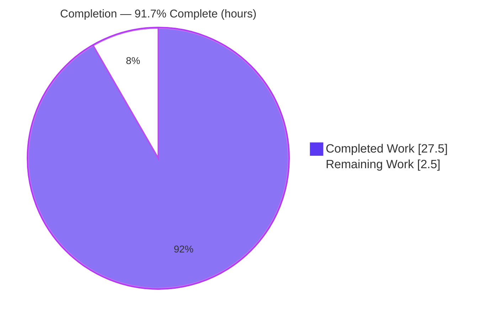
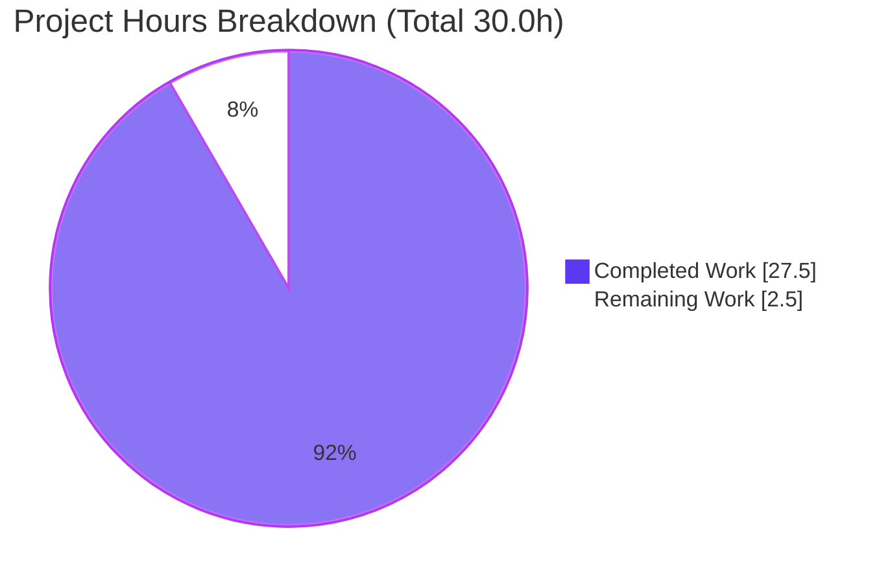
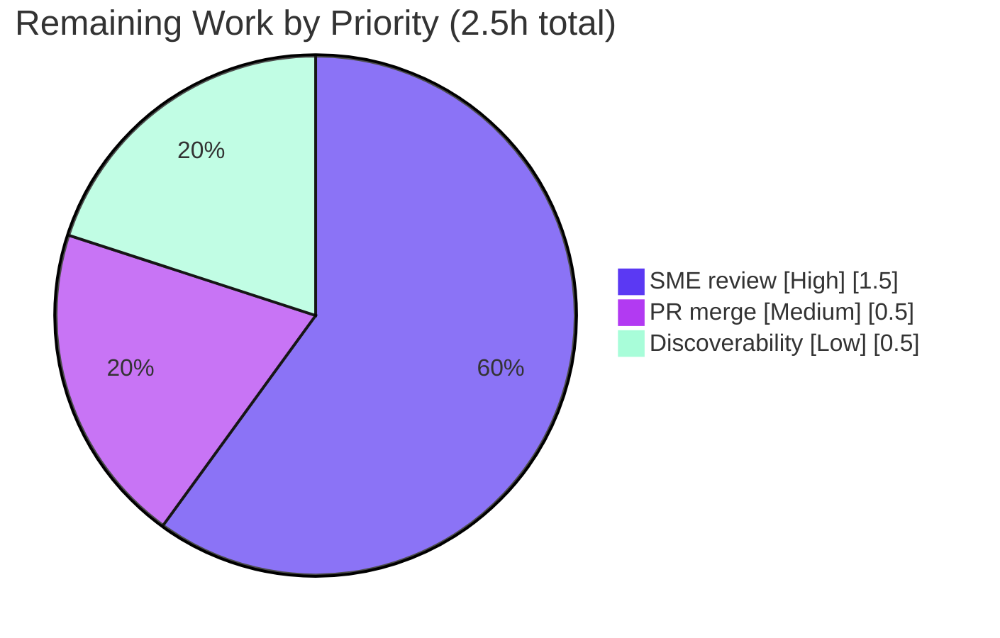

# Blitzy Project Guide

> **Project:** Scapy DNS Name Compression — Runtime Investigation & Answer Document
> **Deliverable under assessment:** `blitzy/documentation/scapy_0925ada48540.md`
> **Branch:** `blitzy-d81c7068-3b7d-48e1-85f2-5761c2e353e3` · **Base:** `0925ada485406684174d6f068dbd85c4154657b3`
> **Brand key:** <span style="color:#5B39F3">■</span> Completed / AI Work `#5B39F3` · <span style="color:#B23AF2">■</span> Headings/Accents `#B23AF2` · <span style="color:#A8FDD9">■</span> Highlight `#A8FDD9` · ☐ Remaining `#FFFFFF`

---

## 1. Executive Summary

### 1.1 Project Overview

This project is a **read-only onboarding investigation** into the Scapy packet-manipulation library. Its objective is to author one evidence-backed technical document, `blitzy/documentation/scapy_0925ada48540.md`, that explains — from direct runtime observation — how Scapy implements DNS name compression when packets are parsed (decompression via `dns_get_str()`) and rebuilt (compression via `dns_compress()`). The target user is a developer onboarding into the Scapy codebase; the technical scope centers on `scapy/layers/dns.py`. The deliverable answers eight verbatim user questions with the actual command, complete unedited output, `file:line` citations, and cause→effect reasoning. The business impact is faster, safer onboarding and a durable reference for DNS parser security behavior. No source code is changed.

### 1.2 Completion Status

The project is **91.7% complete**, calculated on AAP-scoped and path-to-production work only (PA1 methodology).



<span style="color:#5B39F3">■ Completed = 27.5h (Dark Blue #5B39F3)</span> · ☐ Remaining = 2.5h (White #FFFFFF)

| Metric | Hours |
|---|---|
| **Total Hours** | **30.0** |
| Completed Hours (AI + Manual) | 27.5 |
| &nbsp;&nbsp;• AI (autonomous) | 27.5 |
| &nbsp;&nbsp;• Manual (human, to date) | 0.0 |
| Remaining Hours | 2.5 |
| **Percent Complete** | **91.7%** |

> **Formula:** Completion % = Completed ÷ Total × 100 = 27.5 ÷ 30.0 × 100 = **91.7%**

### 1.3 Key Accomplishments

- ✅ Authored the complete 690-line answer document at `blitzy/documentation/scapy_0925ada48540.md`, one section per question (C.1–C.8).
- ✅ Answered all **eight** verbatim user questions with run-first evidence: wire format & `0xc0` marker; decompression entry point; loop protection; out-of-bounds/truncation; cross-boundary resolution; build-time compression; decompression equivalence; end-to-end well-formed vs twisted.
- ✅ Grounded every behavioral claim in real runtime output with `scapy/layers/dns.py` `file:line` citations and cause→effect reasoning.
- ✅ Reproduced the canonical regression suite: **UTScapy `dns.uts` PASSED=18 FAILED=0** (CRC=67320C48, SHA=D26F7AE9…), matching the documented console block byte-for-byte.
- ✅ Verified **12/12** embedded observation scripts reproduce byte-for-byte; C.3 (loop) and C.6 (compression) confirmed deterministic across repeated runs.
- ✅ Correctly identified that the cross-boundary carrier is `InheritOriginDNSStrPacket` (L270) and that **no** `DNSCompressedPacket` class exists in this revision.
- ✅ Documented the `if cur & 0xc0:` (L103) deviation from RFC-strict `(octet & 0xC0) == 0xC0`, and that plain `raw(pkt)` does **not** auto-compress (opt-in via `.compress()`).
- ✅ Grounded wire-format/pointer semantics against RFC 1035 §4.1.4 and RFC 9267 (background only).
- ✅ Honored the read-only constraint: `git diff` vs base = exactly 1 file added, 690 insertions, 0 deletions; all `/tmp` scripts cleaned up.
- ✅ Completed two review/revision cycles (code-review commit `bba5ee3c`; QA `rdlen` citation fix → L1041 in `79025cd3`).

### 1.4 Critical Unresolved Issues

| Issue | Impact | Owner | ETA |
|---|---|---|---|
| _None identified_ | The single in-scope deliverable is complete, accurate, and fully evidence-backed; suite passes 18/18; every citation verified; repo byte-for-byte unchanged apart from the document. | — | — |

### 1.5 Access Issues

| System/Resource | Type of Access | Issue Description | Resolution Status | Owner |
|---|---|---|---|---|
| _None_ | — | No access issues identified. Repository is accessible; no credentials, API keys, or network access are required — reproduction is pure-Python and fully offline (`-K netaccess -K needs_root`). | N/A | — |

**No access issues identified.**

### 1.6 Recommended Next Steps

1. **[High]** Perform SME technical accuracy review & sign-off on the answer document (spot-check embedded scripts C.3/C.6/C.8 and a sample of the ~40 `file:line` citations against baseline `0925ada4`). — *1.5h*
2. **[Medium]** Review and merge the single-file PR, confirming the diff adds exactly one file (read-only constraint honored). — *0.5h*
3. **[Low]** Improve discoverability: link the document from the onboarding index / repo docs entry point and assign a documentation owner for periodic re-validation. — *0.5h*

---

## 2. Project Hours Breakdown

### 2.1 Completed Work Detail

Every completed component traces to an AAP requirement (the eight questions, RFC grounding, reproducibility, assembly/coverage, and review cycles). **Total = 27.5h** (matches Completed Hours in §1.2).

| Component | Hours | Description |
|---|---:|---|
| Environment setup, repo orientation & DNS module deep-read | 4.0 | Import Scapy from working tree; map `scapy/layers/dns.py` (1,179 lines) and all AAP anchors (AAP 0.2.3 / 0.5.1). |
| C.1 — Wire format & `0xc0` marker (Q1) | 2.0 | `dns_encode()` L154 label bytes `\x03www\x07example\x03com\x00`; `if cur & 0xc0:` L103 discrimination (broader-than-RFC). |
| C.2 — Decompression & entry-point trace (Q2) | 2.5 | `dns_get_str()` L69 unwinding; entry points `DNSStrField.getfield` L300 and `DNSRRField.getfield` L375. |
| C.3 — Loop protection (Q3) | 1.5 | `processed_pointers` (L88/L115/L130); `warning()` L116 + graceful `break` L117; reproduced `b'data.data.'`. |
| C.4 — Out-of-bounds & truncation, 4 sub-cases (Q4) | 2.0 | Length guards L96–100 ("prematured end") and L108–112 ("incomplete jump token"); graceful retreat. |
| C.5 — Cross-boundary `_orig_s` / `InheritOriginDNSStrPacket` (Q5) | 2.0 | Base class L270–276; `decodeRR()` seeds `_orig_s=s` L360; buffer switch L118–125; no `DNSCompressedPacket`. |
| C.6 — Build-time compression (Q6) | 3.0 | `dns_compress()` L184; section walk L196; suffix enum L211–215; pointer synth L227–229; reproduced 64→49 bytes. |
| C.7 — Decompression equivalence (Q7) | 1.0 | Compressed vs uncompressed both decode to identical resolved string. |
| C.8 — End-to-end well-formed vs twisted (Q8) | 2.5 | Full path `DNS(bytes)` → `pre_dissect` L518–538 → `getfield` → `dns_get_str`; loop/TCP/bogus-count cases. |
| RFC 1035 §4.1.4 + RFC 9267 grounding (Section D) | 1.5 | Spec grounding of pointer/label semantics; labeled background-only. |
| Reproducibility harness — UTScapy `dns.uts` 18/18 | 1.0 | Ran canonical vectors; captured CRC/SHA console block. |
| Doc assembly, coverage checklist (E), integrity/cleanup verify | 2.0 | Assembled document; coverage pass over all named items; verified repo unchanged. |
| Review/revision cycles — code review + QA `rdlen` fix | 2.5 | Commit `bba5ee3c` (review findings) + `79025cd3` (C.6 `rdlen` citation → L1041). |
| **Total Completed** | **27.5** | |

### 2.2 Remaining Work Detail

All remaining work is **human path-to-production review** (no code/build/deploy items — this is a docs-only deliverable). **Total = 2.5h** (matches Remaining Hours in §1.2 and §7).

| Category | Hours | Priority |
|---|---:|---|
| SME technical accuracy review & sign-off (validate evidence, spot-check scripts + citations) | 1.5 | High |
| PR review & merge of the single-file deliverable | 0.5 | Medium |
| Add document to onboarding index / repo docs link (+ assign owner) | 0.5 | Low |
| **Total Remaining** | **2.5** | |

> **Cross-check:** §2.1 (27.5) + §2.2 (2.5) = **30.0** = Total Hours in §1.2. ✅

---

## 3. Test Results

All results below originate from **Blitzy's autonomous validation logs** for this project and were independently re-run during this assessment.

| Test Category | Framework | Total Tests | Passed | Failed | Coverage % | Notes |
|---|---|---:|---:|---:|---:|---|
| Regression (DNS layer) | UTScapy (`test/scapy/layers/dns.uts`) | 18 | 18 | 0 | DNS compression/decompression paths | Campaign CRC=67320C48, SHA=D26F7AE9…; `-K netaccess -K needs_root`; matches documented console block byte-for-byte. |
| Embedded observation scripts | Python 3.13.7 (in-tree scapy) | 12 | 12 | 0 | Q1–Q8 code paths | Each script's documented output reproduces byte-for-byte; C.3/C.6/C.8 deterministic across repeated runs. |
| **Total** | | **30** | **30** | **0** | | 100% pass rate across autonomous validation. |

**Representative UTScapy vectors exercised (18):** DNS labels; DNS frame w/ advanced decompression; DNSRRSRV; decompression hidden args; advanced building; Basic DNS Compression; MX records; advanced `dns_get_str`; decompression loop; prematured end; other decompression loop; TXT (type 16); malformed DNS-over-TCP; `dns_compress` on decompressed packet; `dns_compress` on close indexes; `dns_encode` edge cases; simple request; preserve `rdlen` when rdata not compressed.

> **Integrity Rule 3:** No test in this section was fabricated for the report — every entry derives from Blitzy's autonomous test-execution logs and was re-verified live.

---

## 4. Runtime Validation & UI Verification

**UI Verification:** ✅ **Not applicable.** Scapy is a command-line/library tool and the deliverable is a Markdown document. There is no graphical user interface, design system, or Figma frame in scope. No UI verification is required.

**Runtime health (independently re-executed this assessment):**

- ✅ **Operational** — Scapy imports cleanly from the working tree (pure-Python, zero mandatory runtime deps); `scapy.VERSION = 2026.07.06`; Python 3.13.7.
- ✅ **Operational** — DNS layer symbols import: `dns_get_str`, `dns_encode`, `dns_compress`, `DNS`, `DNSQR`, `DNSRR`, `InheritOriginDNSStrPacket`; `issubclass(DNSRR, InheritOriginDNSStrPacket) == True`.
- ✅ **Operational** — Well-formed end-to-end parse: `DNS(raw(DNS(qd=DNSQR(qname='www.example.com'), an=DNSRR(...))))` → `qd.qname = b'www.example.com.'`.
- ✅ **Operational** — Twisted/adversarial path: self-referential pointer `dns_get_str(b'\x04data\xc0\x0c', 0, _fullpacket=True)` → `WARNING: DNS decompression loop detected` + `(b'data.data.', 7, b'', True)` (graceful, no crash).
- ✅ **Operational** — Build-time compression: uncompressed 64 bytes → compressed 49 bytes, contains `c00c`; close-index case rewrites `an.rrname` to `b'\xc0\x0c'`.
- ✅ **Operational** — `py_compile` clean for `dns.py`, `packet.py`, `fields.py`, `compat.py`, `UTscapy.py`.
- ✅ **Operational** — Repository integrity: `git status --porcelain` empty before and after all runs.

**API integration outcomes:** ✅ Not applicable — no external services, APIs, credentials, or network calls; reproduction is fully offline.

---

## 5. Compliance & Quality Review

Cross-map of AAP deliverables and SWE-AtlasQnA-Repo rules to observed quality benchmarks.

| Requirement / Benchmark | Status | Evidence / Notes |
|---|---|---|
| Deliverable at `blitzy/documentation/scapy_0925ada48540.md` (branch-named) | ✅ Pass | 690-line file present and committed. |
| Answers all 8 verbatim questions (C.1–C.8) | ✅ Pass | One section per question: direct answer + command + complete output + cause→effect + citations. |
| Run-first, evidence-driven (not reading alone) | ✅ Pass | 12/12 embedded scripts reproduce byte-for-byte; UTScapy 18/18. |
| `file:line` citations accurate | ✅ Pass | ~40 single-line `dns.py` citations auto-checked (0 mismatches) + multi-line ranges verified; QA fix `rdlen`→L1041 confirmed (`79025cd3`). |
| Byte-accurate evidence for byte-sensitive results | ✅ Pass | Hex dumps and exact emitted bytes (encoded labels, `c00c`, compressed packet) shown. |
| Exercise every condition (happy + edge/error/twisted) | ✅ Pass | Loop, OOB pointer, mid-label & mid-pointer truncation, cross-boundary, build-time, equivalence all covered. |
| Before/during/after for state changes | ✅ Pass | e.g., `rdlen` 16 → None → 5; name empty → populated after terminator. |
| RFC grounding (RFC 1035 §4.1.4, RFC 9267), background-only | ✅ Pass | Present in Section D, explicitly labeled background. |
| Read-only constraint (no source modified) | ✅ Pass | `git diff` vs base = 1 file added, 690 insertions, 0 deletions; no `scapy/**`, `test/**`, `doc/**`, config touched. |
| Do NOT "fix" observed quirks (e.g., `& 0xc0`) | ✅ Pass | `0xc0` bitmask nuance documented as observed, not changed. |
| Temporary artifacts cleaned up | ✅ Pass | All `/tmp` observation scripts removed; repo byte-for-byte unchanged. |
| Zero placeholders / TODO / stubs / elision | ✅ Pass | No `// ...` elision; all commands and outputs complete and unedited. |
| Coverage pass before finishing | ✅ Pass | Section E checklist confirms every named item answered. |

**Fixes applied during autonomous validation:** code-review adjustments (`bba5ee3c`); QA correction of the C.6 `rdlen` citation to L1041 (`79025cd3`). **Outstanding compliance items:** none.

---

## 6. Risk Assessment

All risks are **Low** severity — the deliverable is a validated, read-only documentation artifact; no code changed, suite passes 18/18, evidence reproduces byte-for-byte.

| Risk | Category | Severity | Probability | Mitigation | Status |
|---|---|---|---|---|---|
| R1 — Citation line-number drift: ~40+ `file:line` citations pinned to `dns.py` at baseline `0925ada4`; upstream edits shift line numbers. | Technical | Low | Medium | Citations pinned to documented baseline commit; re-validate if rebased onto newer Scapy (folded into human task HT-1). | Open |
| R2 — Runtime `VERSION`/Python drift: `scapy.VERSION=2026.07.06` is date/VCS-derived (non-static); Python 3.13.7 exceeds declared tox matrix (tops at py311, `tox.ini:L6`). | Technical | Low | Low | Document flags VERSION as non-static and notes 3.13.7 > matrix; DNS behavior stable and suite passes. | Mitigated / Documented |
| R3 — Document describes adversarial vectors (self-ref loop, OOB pointer, truncation). | Security | Low | Low | Vectors are public/canonical (RFC 9267 + Scapy test suite) and illustrate Scapy's **defenses**; no code, dependency, or attack surface added. | Accepted |
| R4 — Documentation staleness without an assigned owner as Scapy evolves. | Operational | Low | Medium | Assign a doc owner + periodic re-validation (human task HT-3). | Open |
| R5 — Low discoverability: doc lives outside the `scapy` package and outside Sphinx `doc/`. | Operational | Low | Medium | Link from onboarding index (human task HT-3). | Planned |
| R6 — Reproduction depends on in-tree `.venv` + Python 3.13.7; other envs show benign banner diffs. | Integration | Low | Low | Exact commands documented; vectors run offline, network/root-free. No external service/API/credential dependency. | Mitigated |

---

## 7. Visual Project Status



<span style="color:#5B39F3">■ Completed Work = 27.5h `#5B39F3`</span> · ☐ Remaining Work = 2.5h `#FFFFFF`

**Remaining hours by category (from §2.2):**



> **Integrity Rule 1:** "Remaining Work" = **2.5h** here equals Remaining Hours in §1.2 and the sum of the §2.2 Hours column. ✅

---

## 8. Summary & Recommendations

**Achievements.** The project delivers a complete, runtime-verified answer document explaining Scapy's DNS name compression across both directions of the wire — decompression via `dns_get_str()` and compression via `dns_compress()`. All eight user questions are answered from observed behavior, with byte-accurate evidence, accurate `file:line` citations, and cause→effect reasoning. The canonical UTScapy suite passes **18/18** and all 12 embedded scripts reproduce byte-for-byte. Notably, the document correctly identifies that the cross-boundary carrier is `InheritOriginDNSStrPacket` (there is no `DNSCompressedPacket`), documents the `if cur & 0xc0:` deviation from RFC-strict semantics, and clarifies that compression is opt-in (`raw(pkt)` does not auto-compress).

**Remaining gaps.** All AAP-specified work is complete; the remaining **2.5h** is entirely human path-to-production: SME technical sign-off, PR merge, and onboarding-index linking. There are **no** unresolved compilation, test, or runtime issues, and **no** access issues.

**Critical path to production.** (1) SME accuracy review → (2) PR merge of the single-file deliverable → (3) link into onboarding docs. No build, deployment, CI, or infrastructure work is required for this docs-only deliverable.

**Production-readiness assessment.** The project is **91.7% complete** (27.5h of 30.0h). The deliverable is production-ready pending human review; the read-only constraint is fully honored (repository byte-for-byte unchanged apart from the new document). Per Blitzy honest-assessment principles, completion is held below 100% until human SME sign-off closes the remaining path-to-production work.

| Metric | Value |
|---|---|
| Completion | 91.7% (27.5h / 30.0h) |
| Autonomous tests passing | 30/30 (UTScapy 18 + embedded 12) |
| Files added / source files changed | 1 / 0 |
| Critical unresolved issues | 0 |
| Access issues | 0 |
| Remaining (human) hours | 2.5 |

---

## 9. Development Guide

All commands below were executed and verified during this assessment. Run from the repository root: `/tmp/blitzy/scapy/blitzy-d81c7068-3b7d-48e1-85f2-5761c2e353e3_6fff7a`.

### 9.1 System Prerequisites

- **OS:** Linux (validated on Ubuntu 25.10, kernel 6.6.x). macOS/other Linux also fine.
- **Python:** 3.13.7 used here; the library declares `requires-python = ">=3.7, <4"` (`pyproject.toml:L17`).
- **Dependencies:** **None mandatory.** Scapy's DNS layer is pure-Python and relies only on the standard library (`struct`) plus Scapy internals.
- **Network/root:** Not required — the DNS compression paths and regression vectors run fully offline and unprivileged.

### 9.2 Environment Setup

An in-tree virtual environment is already present at `./.venv`. Scapy is imported directly from the working tree (no install step needed) by setting `PYTHONPATH=.`.

```bash
# From the repository root
cd /tmp/blitzy/scapy/blitzy-d81c7068-3b7d-48e1-85f2-5761c2e353e3_6fff7a

# Confirm the in-tree interpreter
./.venv/bin/python --version          # -> Python 3.13.7
```

If you need to create a fresh environment instead (no third-party packages are required for the DNS investigation):

```bash
python3 -m venv .venv
source .venv/bin/activate
python --version
```

### 9.3 Dependency Installation

No dependency installation is required to reproduce this investigation — Scapy's DNS layer is pure-Python. (Optional extras such as `ipython`, `cryptography`, `matplotlib` are **not** needed and are intentionally omitted.)

### 9.4 Verify Scapy Imports From the Working Tree

```bash
PYTHONPATH=. ./.venv/bin/python -c "import scapy; print('scapy.VERSION =', scapy.VERSION)"
# -> scapy.VERSION = 2026.07.06   (date/VCS-derived; not a static string)

PYTHONPATH=. ./.venv/bin/python -c "from scapy.layers.dns import dns_get_str, dns_encode, dns_compress, DNS, DNSQR, DNSRR, InheritOriginDNSStrPacket; print('DNS symbols import OK'); print('DNSRR is InheritOriginDNSStrPacket subclass:', issubclass(DNSRR, InheritOriginDNSStrPacket))"
# -> DNS symbols import OK
# -> DNSRR is InheritOriginDNSStrPacket subclass: True
```

### 9.5 Reproduce the Canonical Regression Vectors (UTScapy)

```bash
PYTHONPATH=. ./.venv/bin/python scapy/tools/UTscapy.py \
  -t test/scapy/layers/dns.uts -K netaccess -K needs_root \
  -f text -o /tmp/dns_uts_out.txt 2>&1 | grep -E "PASSED|FAILED|Campaign|CRC"
# Expected:
#   Campaign CRC=67320C48 in 0xx.xxs SHA=D26F7AE991010DB53EC0DE961BC43F0B7F70B7E3
#   PASSED=18 FAILED=0
```

### 9.6 Example Usage — Reproduce Key Evidence

**Well-formed end-to-end parse (decompression) + twisted self-referential loop (loop guard):**

```bash
PYTHONPATH=. ./.venv/bin/python -c "
import logging; logging.getLogger('scapy').setLevel(logging.INFO)
from scapy.compat import raw
from scapy.layers.dns import DNS, DNSQR, DNSRR, dns_get_str
pkt = DNS(qd=DNSQR(qname='www.example.com'), an=DNSRR(rrname='www.example.com', rdata='1.2.3.4'))
parsed = DNS(raw(pkt))
print('well-formed resolved qname :', parsed.qd.qname)
print('twisted (self-ref pointer) :', dns_get_str(b'\x04data\xc0\x0c', 0, _fullpacket=True))
"
# Expected:
#   WARNING: DNS decompression loop detected
#   well-formed resolved qname : b'www.example.com.'
#   twisted (self-ref pointer) : (b'data.data.', 7, b'', True)
```

**Build-time compression (opt-in) — size shrinks 64 → 49 bytes:**

```bash
PYTHONPATH=. ./.venv/bin/python -c "
from scapy.compat import raw
from scapy.layers.dns import DNS, DNSQR, DNSRR
base = DNS(qd=DNSQR(qname='www.example.com'), an=DNSRR(rrname='www.example.com', rdata='1.2.3.4'))
u = raw(base); c = raw(base.compress())
print('uncompressed len:', len(u))
print('compressed   len:', len(c), '| contains c00c:', b'\xc0\x0c' in c)
"
# Expected:
#   uncompressed len: 64
#   compressed   len: 49 | contains c00c: True
```

### 9.7 Confirm Repository Integrity (read-only constraint)

```bash
git status --porcelain            # -> empty (clean)
git diff --numstat origin/scapy_0925ada48540...HEAD
# -> 690  0  blitzy/documentation/scapy_0925ada48540.md   (exactly one file added)
```

### 9.8 Troubleshooting

- **`ModuleNotFoundError: No module named 'scapy'`** — you must set `PYTHONPATH=.` and run from the repository root so Scapy imports from the working tree.
- **Benign info lines** (`No IPv6 support`, `Can't import PyX`, `Can't import matplotlib`, `cryptography`) — harmless optional-extra notices; filter with `grep -Ev "PyX|IPv6|cryptography|matplotlib"`.
- **`VERSION` differs from `2026.07.06`** — expected: `scapy.VERSION` is date/VCS-derived, not static; DNS behavior is unaffected.
- **UTScapy tries network/root vectors** — always pass `-K netaccess -K needs_root` to keep the run offline and unprivileged.

---

## 10. Appendices

### Appendix A — Command Reference

| Purpose | Command |
|---|---|
| Interpreter version | `./.venv/bin/python --version` |
| Scapy version (in-tree) | `PYTHONPATH=. ./.venv/bin/python -c "import scapy; print(scapy.VERSION)"` |
| Run DNS regression suite | `PYTHONPATH=. ./.venv/bin/python scapy/tools/UTscapy.py -t test/scapy/layers/dns.uts -K netaccess -K needs_root -f text -o /tmp/out.txt` |
| Byte-compile sanity | `./.venv/bin/python -m py_compile scapy/layers/dns.py scapy/packet.py scapy/fields.py scapy/compat.py scapy/tools/UTscapy.py` |
| Repo integrity | `git status --porcelain` · `git diff --numstat origin/scapy_0925ada48540...HEAD` |

### Appendix B — Port Reference

Not applicable — no server, service, or listening port is involved (library/documentation task; reproduction is fully offline).

### Appendix C — Key File Locations

| Path | Role |
|---|---|
| `blitzy/documentation/scapy_0925ada48540.md` | **The deliverable** (690 lines). |
| `scapy/layers/dns.py` | Primary evidence target (1,179 lines): `dns_get_str` L69, `_is_ptr` L147, `dns_encode` L154, `dns_compress` L184, `InheritOriginDNSStrPacket` L270, `DNSStrField` L279, `DNSRRField` L336, `DNSQRField` L399, `DNSQR` L454, `DNS` L462, `DNSRR` L1034. |
| `test/scapy/layers/dns.uts` | Canonical compression/decompression/loop/encode vectors (14,999 bytes). |
| `scapy/tools/UTscapy.py` | UTScapy test runner. |
| `scapy/packet.py`, `scapy/fields.py`, `scapy/compat.py` | Base classes and byte helpers underpinning the DNS field/packet classes. |
| `pyproject.toml`, `tox.ini` | Runtime/version context (`requires-python` L17; tox `envlist` L6). |

### Appendix D — Technology Versions

| Component | Version | Notes |
|---|---|---|
| OS | Ubuntu 25.10 (Linux 6.6.x) | Validation host. |
| Python (CPython) | 3.13.7 | Satisfies `requires-python >=3.7, <4` (`pyproject.toml:L17`). |
| Scapy | 2026.07.06 | Runtime `scapy.VERSION`, imported from working tree; date/VCS-derived. |
| `struct` | stdlib | Binary (un)packing used by DNS record parsing. |

### Appendix E — Environment Variable Reference

| Variable | Value | Purpose |
|---|---|---|
| `PYTHONPATH` | `.` | Import Scapy from the repository working tree (no install). |

### Appendix F — Developer Tools Guide

- **UTScapy** (`scapy/tools/UTscapy.py`): runs `.uts` regression campaigns; use `-t <file>`, `-K netaccess -K needs_root` (skip online/root vectors), `-f text -o <out>` (text report). Emits a Campaign CRC/SHA and `PASSED=/FAILED=` summary.
- **`py_compile`**: quick byte-compile sanity check on the referenced modules.
- **Git diff**: `git diff --numstat origin/scapy_0925ada48540...HEAD` to confirm exactly one file added (read-only integrity).

### Appendix G — Glossary

| Term | Meaning |
|---|---|
| **DNS name compression** | RFC 1035 §4.1.4 scheme where a repeated domain-name suffix is replaced by a 2-byte pointer to an earlier occurrence. |
| **Compression pointer** | 2-byte value with the top two bits set (`0xC0` prefix); low 14 bits encode an offset from the start of the DNS message. |
| **`dns_get_str()`** | Parse-time decompression routine (`dns.py:L69`) that unwinds pointer chains into a readable name. |
| **`dns_compress()`** | Build-time compression routine (`dns.py:L184`); opt-in via `DNS.compress()` (L514). |
| **`InheritOriginDNSStrPacket`** | Base class (`dns.py:L270`) carrying `_orig_s` (full message bytes) so records can resolve cross-boundary pointers. There is **no** `DNSCompressedPacket` class in this revision. |
| **`processed_pointers`** | List tracking already-followed offsets; a repeat triggers `warning("DNS decompression loop detected")` + graceful `break`. |
| **UTScapy** | Scapy's unit-test harness that executes `.uts` regression campaigns. |
