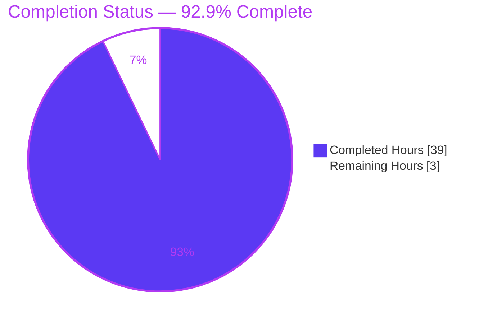
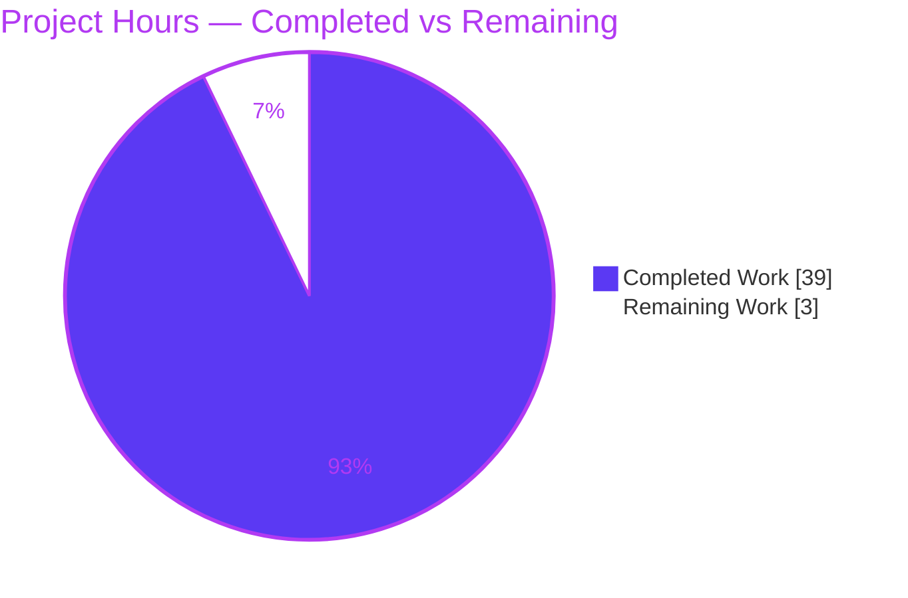
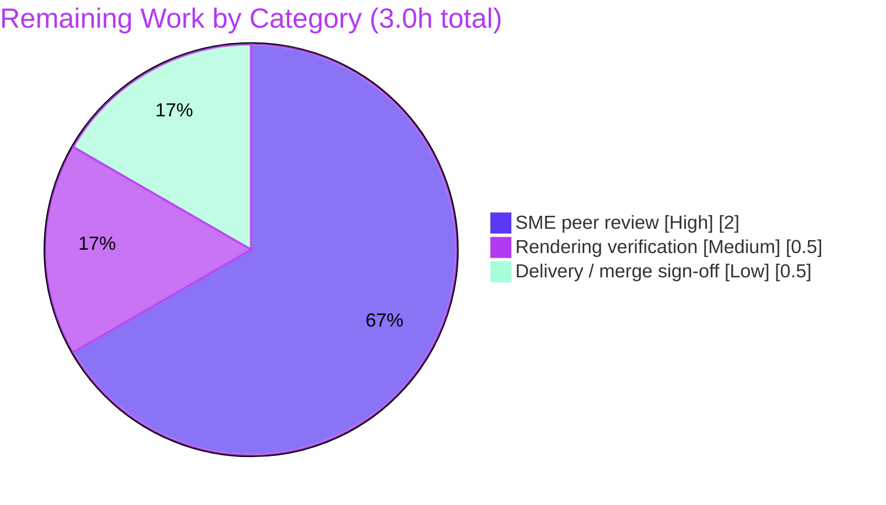

# Blitzy Project Guide — Scapy Build/Dissect Lifecycle & `raw_packet_cache` Q&A

> Empirical, read-only investigation-and-documentation deliverable. Brand colors applied throughout: **Completed = Dark Blue `#5B39F3`**, **Remaining = White `#FFFFFF`**, headings/accents Violet-Black `#B23AF2`, soft accent Mint `#A8FDD9`.

---

# 1. Executive Summary

## 1.1 Project Overview

This project delivers a single, empirically-grounded technical answer document explaining Scapy's packet **build/dissect lifecycle** and its `raw_packet_cache` byte-caching mechanism. It resolves four interrelated questions a developer raised while debugging a custom protocol layer: deferred field-calculation ordering and the `show2()`-twice effect (Q1); a "two-state packet" after dissection and whether `copy()` helps (Q2); why direct-field edits rebuild but nested-payload edits return cached bytes (Q3); and the exact rebuild-versus-cached decision mechanism (Q4). The target users are Scapy developers debugging custom layers. The deliverable — `blitzy/documentation/scapy_0925ada48540.md` — is a read-only study: every behavioral claim is proven by an executed reproduction script with byte-exact output and `file:line` citations, and **zero** Scapy source files are modified.

## 1.2 Completion Status



| Metric | Value |
|---|---|
| **Total Hours** | 42.0 |
| **Completed Hours (AI + Manual)** | 39.0 (39.0 AI + 0.0 Manual) |
| **Remaining Hours** | 3.0 |
| **Percent Complete** | **92.9%** (39.0 ÷ 42.0) |

The completion percentage is computed strictly on AAP-scoped work (the answer document plus its path-to-production review), per the PA1 hours methodology: `Completed ÷ (Completed + Remaining) = 39.0 ÷ 42.0 = 92.9%`.

## 1.3 Key Accomplishments

- ✅ Authored the comprehensive **1,022-line / 9,675-word** answer document at the mandated branch-derived path `blitzy/documentation/scapy_0925ada48540.md`.
- ✅ Answered all **four questions mechanism-first** (Q4 foundation → Q3 → Q2 → Q1), correctly separating the shared `raw_packet_cache` mechanism (Q4/Q3/Q2) from the distinct `post_build` ordering issue (Q1).
- ✅ Built and executed **7 standalone reproduction scripts** (`q4`, `q3`, `q3_edge`, `q2`, `q1`, `q1_redissect`, `stability`) via the real public API (`bytes()`/`raw()`, `show()`, `show2()`, `copy()`, `clear_cache()`) — no mocks or debug hooks.
- ✅ Verified **byte-exact output on two interpreters** (Python 3.11.13 canonical Docker + Python 3.13.7 native venv), establishing version-independence, plus run-to-run stability across independent processes.
- ✅ Verified **47 distinct `file:line` citations** (74 occurrences) against the checkout, including 4 verbatim `sed`-quoted source blocks that match byte-identically.
- ✅ Tagged **every claim** with observed/inferred provenance (93 observed, 65 inferred, 3 combined) and completed the **16/16 coverage-pass checklist**, addressing all 18 named entities and preserving all 3 verbatim user examples.
- ✅ Maintained strict **read-only compliance**: git confirms exactly one file added (+1,022/−0), zero edits to `scapy/`, `test/`, `doc/`, or build config; temp scripts confined to `/tmp` and removed.

## 1.4 Critical Unresolved Issues

No critical unresolved issues block release or validation. All five autonomous validation gates passed and the findings were independently re-confirmed.

| Issue | Impact | Owner | ETA |
|---|---|---|---|
| None identified — all reproductions byte-exact, all citations verified, read-only compliance confirmed | None | — | — |

## 1.5 Access Issues

**No access issues identified.** The repository was fully accessible; Scapy imported from the checkout (`scapy.__file__` resolves to the in-repo `scapy/__init__.py`, `VERSION 2026.07.13`); all reproduction scripts executed successfully; and git history/diff was readable for read-only verification. No repository permissions, service credentials, or third-party API access were required for this read-only documentation task.

| System/Resource | Type of Access | Issue Description | Resolution Status | Owner |
|---|---|---|---|---|
| Repository checkout | Read/execute | None — fully accessible | N/A | — |
| Scapy package (in-repo) | Import via `PYTHONPATH` | None — resolves to checkout | N/A | — |
| Canonical Docker image | Container runtime | None — used for primary reproductions | N/A | — |

## 1.6 Recommended Next Steps

1. **[High]** SME peer review of `blitzy/documentation/scapy_0925ada48540.md` — confirm each Q1–Q4 answer, re-run 1–2 reproduction scripts, and audit a sample of citations (2.0h).
2. **[Medium]** Verify Markdown & Mermaid rendering in the delivery target (GitHub / docs portal) — confirm the lifecycle flowchart, tables, and code fences render cleanly (0.5h).
3. **[Low]** Final delivery / merge sign-off — approve the PR, re-confirm read-only compliance, and deliver to the user (0.5h).

---

# 2. Project Hours Breakdown

## 2.1 Completed Work Detail

Every completed component traces to a specific AAP deliverable. All 13 items are fully delivered and validated.

| Component | Hours | Description |
|---|---:|---|
| Codebase investigation & mechanism analysis | 4.0 | Read `packet.py` (2,553L), `fields.py` (3,868L), `compat.py`; traced the `raw_packet_cache`/`raw_packet_cache_fields` lifecycle across `do_dissect`/`self_build`/`do_build`/`setfieldval`/`copy`/`clear_cache`; researched the `#GH3894` performance rationale |
| Reproduction script suite (7 scripts) | 6.0 | Authored `q4.py`, `q3.py`, `q3_edge.py`, `q2.py`, `q1.py`, `q1_redissect.py`, `stability.py` as genuine `Packet` subclasses exercising the real public API |
| Environment & reproduction protocol | 2.5 | Canonical Docker read-only bind-mount setup, native-venv corroboration path, read-only safety probe, exact run commands |
| Q4 — foundation mechanism section | 4.0 | `self_build()` live-vs-snapshot comparison, `post_build` skip, snapshot semantics, and the three edge-case comparison outcomes |
| Q3 — direct vs. nested modification section | 2.0 | Side-by-side reproduction: `setfieldval()` cache clear vs. nested snapshot unchanged |
| Q2 — two-state + `copy()` vs `clear_cache()` section | 2.5 | `bytes()`/`show()` divergence, `copy()` carries cache forward, `clear_cache()` remedy |
| Q1 — `post_build` ordering + `show2()`-twice section | 3.0 | Checksum/length ordering, determinism characterization, build-then-re-dissect round trip |
| Lifecycle overview + Mermaid diagram | 1.5 | Narrative + dissect/build flowchart with cited line numbers |
| `file:line` citations authoring & verification | 3.0 | 47 distinct tokens verified against the checkout; 4 verbatim `sed`-quoted source blocks |
| Provenance labeling, coverage & user examples | 2.0 | Observed/inferred tagging, 18 named entities, 3 verbatim user examples, 16-item coverage checklist |
| Autonomous validation (5 gates) | 4.0 | Extracted & ran all 7 scripts on 2 interpreters, byte-diffed output, audited citations, compile checks |
| Review remediation across commits | 3.5 | Resolved 19 review findings + 2 cross-section items, 4 QA findings, and 1 citation fix (`__iter__` → `1124-1153`) |
| Read-only compliance verification | 1.0 | Git bookends (clean tree, empty source diff), temp-script cleanup |
| **Total Completed** | **39.0** | |

## 2.2 Remaining Work Detail

Every remaining item is a path-to-production activity for a documentation artifact (human review/delivery). No autonomous engineering work is outstanding.

| Category | Hours | Priority |
|---|---:|---|
| SME peer review of the answer document (validate Q1–Q4, re-run reproductions, audit citations) | 2.0 | High |
| Markdown & Mermaid rendering verification in the delivery target | 0.5 | Medium |
| Final delivery / merge sign-off (approve PR, re-confirm read-only compliance) | 0.5 | Low |
| **Total Remaining** | **3.0** | |

## 2.3 Hours Reconciliation & Methodology

| Reconciliation Check | Value | Status |
|---|---|---|
| Section 2.1 Completed total | 39.0 | ✅ |
| Section 2.2 Remaining total | 3.0 | ✅ |
| Section 2.1 + Section 2.2 | 42.0 = Total (Section 1.2) | ✅ Rule 2 |
| Section 1.2 Remaining = Section 2.2 sum = Section 7 pie "Remaining" | 3.0 = 3.0 = 3.0 | ✅ Rule 1 |
| Completion formula | 39.0 ÷ 42.0 = 92.857% ≈ **92.9%** | ✅ |

Methodology: PA1 AAP-scoped hours. The work universe is (a) the single CREATE deliverable and (b) path-to-production review for a Markdown artifact. All 13 AAP requirements are classified **Completed**; the 3.0 remaining hours are human review/delivery sign-off only. Per RG2, completion is capped below 100% pending human review.

---

# 3. Test Results

For this read-only documentation deliverable, "tests" are the **empirical reproductions and validation checks** executed by Blitzy's autonomous validation systems (GATE 1–5). Each behavioral claim in the document is backed by a script whose complete output was byte-diffed against the documented output. All results below originate from Blitzy's autonomous validation logs and were independently re-confirmed in-session on the native interpreter.

| Test Category | Framework | Total Tests | Passed | Failed | Coverage % | Notes |
|---|---|---:|---:|---:|---:|---|
| Empirical Reproduction — Canonical | Python 3.11.13 (Docker `scapy-canonical`), direct exec + byte-diff | 7 | 7 | 0 | 100% | `q4`, `q3`, `q3_edge`, `q2`, `q1`, `q1_redissect`, `stability` — all byte-exact vs. documented output |
| Empirical Reproduction — Native | Python 3.13.7 (venv), direct exec + byte-diff | 7 | 7 | 0 | 100% | Same 7 scripts; identical output → version-independence confirmed |
| Run-to-Run Stability | Python, 2 independent processes | 2 | 2 | 0 | 100% | `stability.py` identical across processes (`0x4355` / `0100074355aabb` / `0211223344`) |
| Environment Verification | Docker RO bind-mount, import, `compileall` | 3 | 3 | 0 | 100% | Import resolves to checkout; write-probe blocked (`Read-only file system`); `compileall` exit 0 |
| Citation Audit | `sed`/`grep` vs. checkout | 47 | 47 | 0 | 100% | 47 distinct `file:line` tokens verified; 4 verbatim `sed`-quoted source blocks byte-identical |
| **Total** | | **66** | **66** | **0** | **100%** | Zero failures, zero stderr across all validation categories |

**Integrity note (Rule 3):** every test above is drawn from Blitzy's autonomous validation execution logs for this project. No synthetic, mocked, or externally-sourced tests are included; the reproductions exercise the canonical public API on genuine `Packet` subclasses. There is no repository unit-test suite change (read-only scope), so no `test/*.uts` campaign was added or modified.

---

# 4. Runtime Validation & UI Verification

**Runtime health** (documentation deliverable — no long-running service or web UI):

- ✅ **Operational** — Scapy imports cleanly in both environments and resolves to the checkout (`/work/scapy/__init__.py` canonical; in-repo `scapy/__init__.py` native), reporting `VERSION 2026.07.13`.
- ✅ **Operational** — All 7 reproduction scripts execute end-to-end via the real public API (`bytes()`/`raw()`, `show()`, `show2()`, `copy()`, `clear_cache()`) with zero errors and zero stderr.
- ✅ **Operational** — `python -B -m compileall scapy` exits 0 in both environments (no syntax/byte-compile issues in the cited source).
- ✅ **Operational** — Read-only bind mount verified: writes into `/work` fail with `Read-only file system` (exit 1); combined with `python -B`/`PYTHONDONTWRITEBYTECODE=1`, no artifact is created under the repo.
- ✅ **Operational** — Byte-sensitive results confirmed against exact emitted bytes (e.g., Q1 checksum `0x4355`, raw build `0100074355aabb`; Q2 nested `bytes()` `0211223344`).

**Document/UI verification:**

- ✅ **Operational** — Markdown is well-formed: 52 balanced fence markers = 26 code blocks (7 Python, 1 Mermaid, 18 plain output/command/`sed` blocks).
- ⚠ **Partial** — Mermaid lifecycle flowchart and tables render correctly in standard GitHub-flavored Markdown; final rendering in the ultimate delivery viewer is pending human confirmation (remaining task R2).
- ➖ **N/A** — No graphical user interface exists for this deliverable; no Figma frames were provided, so no design-system/UI-component verification applies.

---

# 5. Compliance & Quality Review

Cross-mapping of AAP deliverables and the governing rule (**SWE-AtlasQnA-Repo**) to Blitzy quality/compliance benchmarks. Fixes applied during autonomous validation are noted.

| Benchmark / AAP Deliverable | Requirement | Status | Progress | Notes |
|---|---|:--:|:--:|---|
| Mandatory deliverable & location | New Markdown at `blitzy/documentation/<branch>.md` | ✅ Pass | 100% | `scapy_0925ada48540.md` present (1,022 lines) |
| Q1–Q4 complete coverage | Every question part answered | ✅ Pass | 100% | 4 Direct-answer paragraphs; mechanism-first ordering |
| Named-entity coverage | All named artifacts addressed by name | ✅ Pass | 100% | 18/18 entities present (incl. `bytes_encode` cited-only, correctly) |
| Verbatim user examples | Preserved exactly | ✅ Pass | 100% | 3/3 quoted verbatim |
| Run-first methodology | Observe by running, then write | ✅ Pass | 100% | 7 scripts executed; output pasted inline |
| Empirical fidelity | Same input reproduced; byte-exact | ✅ Pass | 100% | Stable across 2 runs & 2 interpreters |
| Canonical entry points only | No mocks/hooks/synthetic bypass | ✅ Pass | 100% | Real `bytes()`/`show()`/`show2()`/`copy()`/`clear_cache()` |
| Observed-vs-inferred labeling | Every claim tagged | ✅ Pass | 100% | 93 observed / 65 inferred / 3 combined |
| `file:line` grounding | Every code claim cited | ✅ Pass | 100% | 47 distinct tokens verified; 4 verbatim `sed` blocks |
| `#GH3894` optimization framing | Frame nested behavior as intended perf design | ✅ Pass | 100% | Cited at `scapy/packet.py:653` |
| Read-only scope | No source/test/doc/config modified | ✅ Pass | 100% | git: only 1 file added; empty source diff |
| Temp-script hygiene | Scripts under `/tmp`, removed | ✅ Pass | 100% | `/tmp/repro` removed; tree clean |
| Version caveat | State interpreters tested; scope broad claim | ✅ Pass | 100% | 3.11.13 + 3.13.7 tested; ≥3.7 labeled inferred |
| Coverage pass | Final checklist complete | ✅ Pass | 100% | 16/16 items checked |

**Fixes applied during autonomous validation:** 19 review findings + 2 cross-section items (commit `8ee144f7`); 4 QA findings (commit `bda383ca`); 1 citation correction — `__iter__` from `[1124-1159]` to `[1124-1153]` (commit `0e321dd7`). **Outstanding compliance items:** none.

---

# 6. Risk Assessment

| Risk | Category | Severity | Probability | Mitigation | Status |
|---|---|:--:|:--:|---|---|
| Citation line-number drift if Scapy source is later modified/rebased | Technical | Low | Low | 47 citations pinned to checkout HEAD `0925ada4`, all verified accurate now; re-verify on rebase | Mitigated |
| Findings verified on 2 interpreters only; ≥3.7 equivalence is inferred | Technical | Low | Low | Mechanism is pure-Python dict/list/bytes comparison, version-independent by design; doc scopes claim as inferred; `stability.py` re-runnable | Mitigated |
| Mermaid flowchart / tables may render inconsistently across viewers | Technical | Low | Medium | Rendering-verification human task (R2) before delivery; standard GitHub-flavored Markdown used | Open (task R2) |
| No security surface (read-only doc, no code added, no deps, no network/credentials) | Security | None | N/A | Zero-dependency reproductions (stdlib + in-repo scapy only); zero source modified (git-verified) | N/A (negative finding) |
| Re-verification requires canonical Docker image or equivalent Python+checkout | Operational | Low | Low | Native-venv path documented; scripts self-contained, runnable on any Python ≥3.7 + checkout | Mitigated |
| Reproduction scripts are inline in the doc (not repo files, per read-only rule); must be re-extracted | Operational | Info | Low | Complete standalone scripts + exact run commands embedded; trivial regex extraction demonstrated | Accepted (by design) |
| No integration surface (standalone additive artifact; no interface/CI/build/test dependency) | Integration | None | N/A | Document introduces no imports; no downstream repo file depends on it | N/A (negative finding) |

**Overall risk posture: LOW.** All technical risks are Low and mitigated except Mermaid rendering (Low/Medium, addressed by task R2). Security and integration risks are genuine negative findings (none) owing to the read-only, zero-dependency nature of the deliverable. No High or Critical risks; nothing blocks delivery.

---

# 7. Visual Project Status

**Project Hours Breakdown** (Completed = Dark Blue `#5B39F3`, Remaining = White `#FFFFFF`):



**Remaining Hours by Category** (sums to 3.0h — matches Section 2.2 and Section 1.2):



**Integrity check (Rule 1):** the pie chart "Remaining Work" value (3) equals the Section 1.2 Remaining Hours (3.0) and the Section 2.2 "Hours" column sum (2.0 + 0.5 + 0.5 = 3.0). ✅

---

# 8. Summary & Recommendations

**Achievements.** The project is **92.9% complete** (39.0 of 42.0 AAP-scoped hours). The single mandated deliverable — `blitzy/documentation/scapy_0925ada48540.md` — comprehensively answers all four questions about Scapy's build/dissect lifecycle and the `raw_packet_cache` mechanism. It establishes the core mechanism first (Q4) and derives the direct-vs-nested asymmetry (Q3), the two-state phenomenon with the `copy()`-vs-`clear_cache()` distinction (Q2), and the separate `post_build` ordering / `show2()`-twice determinism (Q1). Every behavioral claim is backed by an executed reproduction with complete, byte-exact output and a `file:line` citation, tagged observed or inferred.

**Remaining gaps (3.0h, all human review/delivery).** There is **no outstanding autonomous engineering work** — no failing tests, no compilation errors, no missing coverage. The remaining effort is: SME peer review (2.0h), Mermaid/Markdown rendering verification (0.5h), and final delivery/merge sign-off (0.5h).

**Critical path to production.** SME peer review → rendering verification → merge/deliver. Because the study is read-only and independently reproduced on two interpreters, the path is short and low-risk.

**Success metrics (all met):** all 5 validation gates passed; 66/66 validation checks passed with zero failures; 16/16 coverage items complete; 18/18 named entities addressed; 3/3 user examples preserved; read-only compliance git-verified (exactly one file added, zero source edits).

| Production-Readiness Dimension | Assessment |
|---|---|
| Functional completeness (Q1–Q4) | ✅ Complete — all four answered with evidence |
| Empirical fidelity | ✅ Byte-exact, reproduced on 2 interpreters, stable across runs |
| Citation accuracy | ✅ 47/47 distinct citations verified |
| Read-only compliance | ✅ Git-confirmed; zero source edits |
| Risk posture | ✅ Low; no blocking risks |
| Overall | **Production-ready pending human review sign-off** |

**Recommendation:** Approve after the 2.0h SME review and 0.5h rendering check; the deliverable is otherwise ready to merge and deliver.

---

# 9. Development Guide

This is a **reproduction guide** — the deliverable is documentation, so there is no application to build or deploy. All commands below were tested and produce the documented output.

## 9.1 System Prerequisites

- **Python ≥ 3.7** (verified on 3.13.7 in-session; the canonical document environment is Python 3.11.13 in Docker).
- **Scapy core has zero mandatory runtime dependencies** (`pyproject.toml`); the reproductions use only the standard library plus the in-repo `scapy` package.
- **Optional:** Docker (to reproduce in the canonical `scapy-canonical:latest` image); `git` (for read-only compliance checks).

## 9.2 Environment Setup (no installation — run against the checkout)

```bash
export REPO=/tmp/blitzy/scapy/blitzy-fa0998c5-af02-4392-accc-281e0db9f4c1_212de5
cd "$REPO"
```

## 9.3 Verify the Scapy Import Resolves to the Checkout

```bash
PYTHONPATH="$REPO" python3 -B -c "import scapy, sys; print(scapy.__file__); print('VERSION', scapy.VERSION); print('python', sys.version.split()[0])"
```

Expected output (paths vary by interpreter):

```
/tmp/blitzy/scapy/blitzy-fa0998c5-af02-4392-accc-281e0db9f4c1_212de5/scapy/__init__.py
VERSION 2026.07.13
python 3.13.7
```

## 9.4 Byte-Compile Check (sanity)

```bash
PYTHONPATH="$REPO" python3 -B -m compileall -q scapy/packet.py scapy/fields.py scapy/compat.py
echo "compileall exit=$?"   # expect 0
```

## 9.5 Extract and Run the Reproduction Scripts

The 7 scripts live inline in the document (per the read-only rule). Extract them to `/tmp/repro`, then run any script:

```bash
mkdir -p /tmp/repro
python3 - "$REPO/blitzy/documentation/scapy_0925ada48540.md" <<'PY'
import re, sys
doc = open(sys.argv[1]).read()
fence = chr(96) * 3                    # three backticks, built at runtime
pat = fence + r"python\n(.*?)" + fence   # no literal fence inside this doc
for b in re.findall(pat, doc, re.DOTALL):
    m = re.search(r"#\s*(/tmp/repro/\S+\.py)", b)
    if m:
        open(m.group(1), "w").write(b)
print("extracted scripts to /tmp/repro")
PY

PYTHONPATH="$REPO" python3 -B /tmp/repro/q4.py
```

Expected `q4.py` output (byte-exact):

```
raw_packet_cache        = 0211223344
raw_packet_cache_fields = {'items': [{'id': 17}, {'id': 51}]}
bytes(mp) == raw_bytes  : True
live Sub[0].id          : 17
live Sub[0]/Leaf.x      : 34
```

## 9.6 Canonical Docker Reproduction (read-only bind mount — matches the document)

```bash
docker run --rm --entrypoint /bin/bash \
  -v "$REPO":/work:ro -v /tmp/repro:/repro:ro -w /work \
  -e PYTHONDONTWRITEBYTECODE=1 scapy-canonical:latest \
  -lc 'PYTHONPATH=/work python3 -B /repro/q4.py'
```

## 9.7 Verify Read-Only Compliance

```bash
git status --porcelain                                   # empty = clean working tree
git diff --stat 0925ada485406684174d6f068dbd85c4154657b3..HEAD -- scapy test doc   # empty = zero source edits
```

## 9.8 Clean Up

```bash
rm -rf /tmp/repro
```

## 9.9 Troubleshooting

- **`ModuleNotFoundError: scapy`** → ensure `PYTHONPATH="$REPO"` is set on the command.
- **A `.pyc` appears under the repo** → use `python3 -B` and/or `PYTHONDONTWRITEBYTECODE=1` (or the read-only bind mount) to suppress bytecode writes.
- **Output does not match the document** → confirm `scapy.__file__` resolves to the checkout, not a pip-installed Scapy (§9.3).
- **Mermaid diagram does not render** → view the Markdown in a Mermaid-aware renderer (e.g., GitHub).

---

# 10. Appendices

## Appendix A — Command Reference

| Purpose | Command |
|---|---|
| Set repo root | `export REPO=/tmp/blitzy/scapy/blitzy-fa0998c5-af02-4392-accc-281e0db9f4c1_212de5` |
| Verify import | `PYTHONPATH="$REPO" python3 -B -c "import scapy; print(scapy.__file__, scapy.VERSION)"` |
| Byte-compile check | `PYTHONPATH="$REPO" python3 -B -m compileall -q scapy/packet.py scapy/fields.py scapy/compat.py` |
| Run a reproduction | `PYTHONPATH="$REPO" python3 -B /tmp/repro/q4.py` |
| Canonical Docker run | `docker run --rm -v "$REPO":/work:ro -v /tmp/repro:/repro:ro -w /work -e PYTHONDONTWRITEBYTECODE=1 scapy-canonical:latest -lc 'PYTHONPATH=/work python3 -B /repro/q4.py'` |
| Clean tree check | `git status --porcelain` |
| Source-diff check | `git diff --stat 0925ada4..HEAD -- scapy test doc` |
| Cleanup | `rm -rf /tmp/repro` |

## Appendix B — Port Reference

Not applicable — this deliverable is a documentation artifact with no runtime service, listener, or web UI. No ports are opened or required.

## Appendix C — Key File Locations

| Path | Role |
|---|---|
| `blitzy/documentation/scapy_0925ada48540.md` | **The deliverable** (1,022 lines) — CREATE |
| `scapy/packet.py` | `Packet` lifecycle: `do_dissect` [1002-1020], `_raw_packet_cache_field_value` [648-662], `clear_cache` [664-676], `self_build` [678-714], `do_build` [724-740], `setfieldval` [471-491], `copy` [407-426], `show` [1459-1471], `show2` [1473-1487] — REFERENCE |
| `scapy/fields.py` | Field flags `islist`/`ismutable`/`holds_packets` [154-156], `do_copy` [256-266], `PacketField`/`PacketListField` [1475, 1562-1571] — REFERENCE |
| `scapy/compat.py` | `raw()`/`bytes_encode()` [112, 121-129] — REFERENCE |
| `scapy/layers/can.py`, `bluetooth4LE.py`, `tls/session.py`, `contrib/ethercat.py`, `layers/http.py` | Cache-reset idiom corroboration — REFERENCE |
| `doc/scapy/build_dissect.rst` | Official build/dissect lifecycle docs — REFERENCE |

## Appendix D — Technology Versions

| Component | Version | Notes |
|---|---|---|
| Scapy (this checkout) | `2026.07.13` (git-derived `VERSION`) | Imported via `PYTHONPATH`; not installed, not modified |
| Python (canonical) | 3.11.13 | Docker `scapy-canonical:latest` — primary reproduction environment |
| Python (native) | 3.13.7 | Venv `/opt/scapy-venv` — corroboration environment (in-session sandbox) |
| Supported range | ≥3.7, <4 | `pyproject.toml` `requires-python`; mechanism is version-independent (inferred) |
| Mandatory runtime deps | None | Scapy core is zero-dependency; `cryptography` is an optional extra only |

## Appendix E — Environment Variable Reference

| Variable | Purpose | Example |
|---|---|---|
| `REPO` | Repository root path | `/tmp/blitzy/scapy/blitzy-fa0998c5-af02-4392-accc-281e0db9f4c1_212de5` |
| `PYTHONPATH` | Resolve `import scapy` to the checkout | `PYTHONPATH="$REPO"` |
| `PYTHONDONTWRITEBYTECODE` | Prevent `.pyc` creation under the repo | `1` (with `python3 -B`) |

## Appendix F — Developer Tools Guide

| Tool | Use in this project |
|---|---|
| `git` | Read-only compliance verification (clean tree, empty source diff, commit authorship) |
| `python3 -B` | Run reproductions without writing bytecode |
| `compileall` | Confirm cited source byte-compiles cleanly |
| `docker` | Reproduce in the canonical read-only environment |
| `sed`/`grep` | Verify `file:line` citations against the checkout |

## Appendix G — Glossary

| Term | Definition |
|---|---|
| `raw_packet_cache` | The exact bytes a layer consumed during `do_dissect()`; returned verbatim on an unmodified rebuild |
| `raw_packet_cache_fields` | Per-field snapshot (only `islist`/`holds_packets`/`ismutable` fields) used to detect changes at build time |
| `self_build()` | Compares live field values to the snapshot; returns cached bytes on a hit, else rebuilds |
| `post_build()` | Field-calculation hook (e.g., checksum/length); **skipped** on a cache hit, run when no cache exists |
| `setfieldval()` | Direct-field assignment path that clears the layer's cache, forcing a genuine rebuild |
| `clear_cache()` | Resets the cache across the whole packet tree — the canonical remedy for the two-state effect |
| Cache hit | `self_build()` returns `raw_packet_cache`; `do_build()` returns `pkt + pay` and skips `post_build()` |
| `#GH3894` | GitHub issue motivating the shallow-snapshot design (avoid deep-copying nested packets) |
| Observed / Inferred | Provenance tags: [observed] = proven by running the API; [inferred] = read from source with a citation |

---

*Cross-section integrity validated — Rule 1 (Remaining = 3.0h in §1.2, §2.2, §7 ✅) · Rule 2 (39.0 + 3.0 = 42.0 ✅) · Rule 3 (all tests from autonomous validation logs ✅) · Rule 4 (no access issues ✅) · Rule 5 (Completed `#5B39F3` / Remaining `#FFFFFF` ✅).*