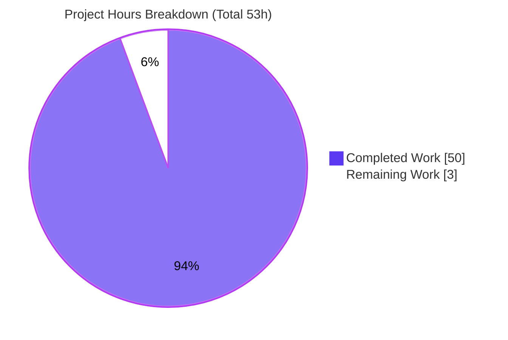

# Blitzy Project Guide
## Scapy ICMP-Error Response Matching — Source Analysis & Empirical Verification

---

## 1. Executive Summary

### 1.1 Project Overview

This project delivers a single, authoritative technical-analysis document that explains—and empirically proves—how Scapy's stimulus–response engine determines whether an inbound ICMP *error* message is the answer to a previously transmitted probe packet. It is a knowledge-extraction task, not a code change: Scapy's existing behavior is reverse-engineered from source, confirmed by building and running the library, and written up with full rationale. The target audience is Scapy users and network engineers who need to understand strict-versus-tolerant response matching. The deliverable answers six interconnected questions spanning the `answers()`/`hashret()` delegation chain, the `*error` layer family, the `conf` matching flags, and RFC 4884 extension parsing—each grounded in exact source citations and reproducible empirical evidence.

### 1.2 Completion Status


| Metric | Hours |
|--------|-------|
| **Total Hours** | **53** |
| Completed Hours (AI + Manual) | 50 (AI: 50 · Manual: 0) |
| Remaining Hours | 3 |
| **Percent Complete** | **94.3%** |

> **Calculation (PA1, AAP-scoped):** Completion % = Completed Hours / (Completed Hours + Remaining Hours) × 100 = 50 / (50 + 3) = 50 / 53 = **94.3%**. All 16 AAP-specified requirements are complete; the remaining 3 hours are human path-to-production gates (review/merge/triage).

### 1.3 Key Accomplishments

- ✅ **Single analysis document delivered** at the mandated path/name: `blitzy/documentation/scapy_0925ada48540.md` (787 lines, 6,438 words, 11 sections).
- ✅ **All six user questions answered** verbatim, each with a source citation, an empirical observation, and explicit rationale.
- ✅ **Empirically verified by building and running Scapy** — all six headline claims reproduce exactly (e.g., request/reply share hash `0x0404040c01cdab0700`).
- ✅ **~70 source citations** across five reference modules cross-checked against actual source; one off-by-one citation corrected to `inet.py` L1000–L1004.
- ✅ **Two "report-don't-fix" findings** surfaced: `checkIPID` mode 2 == mode 1, and `ICMPExtensionHeader.post_build` header-only checksum.
- ✅ **RFC 4884 grounding** validated against the authoritative standard (144-octet threshold, 128-octet datagram, octet-137 extension header).
- ✅ **No-modification constraint upheld**: entire branch delta is the one new markdown file; zero `scapy/` source files changed; working tree clean.
- ✅ **Regression baseline green**: Scapy UTscapy suite 4877 passed / 0 failed; whole package byte-compiles cleanly.

### 1.4 Critical Unresolved Issues

| Issue | Impact | Owner | ETA |
|-------|--------|-------|-----|
| _None_ | No unresolved issues block release. The deliverable is complete, accurate, empirically verified, and committed. | — | — |

> There are no critical or blocking issues. The only outstanding items are routine human path-to-production gates (see §1.6 and §2.2). The two source-level anomalies discovered are correctly surfaced as **findings** (remediation is out of scope per the report-don't-fix rule).

### 1.5 Access Issues

| System/Resource | Type of Access | Issue Description | Resolution Status | Owner |
|-----------------|----------------|-------------------|-------------------|-------|
| _None_ | — | No access issues identified. The task is self-contained: in-repo Scapy source, no databases, no services, no third-party credentials, and no network access required for reproduction. | N/A | — |

> **No access issues identified.** Reproduction of all empirical claims requires only the in-repo source imported via `PYTHONPATH`; no external systems, secrets, or API access are involved.

### 1.6 Recommended Next Steps

1. **[High]** Conduct an SME technical review of the analysis — validate the Q1–Q6 reasoning chains and the two findings against the cited source (1.5h).
2. **[High]** Review and merge the documentation branch — confirm the single-file, zero-source-change diff, then approve and merge (0.5h).
3. **[Low]** Decide the disposition of the two reported findings — file upstream Scapy issues/PRs or formally accept them as documented behavior (1.0h).
4. **[Low]** (Optional) If long-term maintenance is desired, consider a lightweight CI check that re-pins citation line numbers when Scapy is upgraded.

---

## 2. Project Hours Breakdown

### 2.1 Completed Work Detail

| Component | Hours | Description |
|-----------|-------|-------------|
| Repository scope discovery & matching-subsystem reverse-engineering | 8.0 | Exhaustive search establishing the matching subsystem spans exactly 5 modules; read/understood ~7,351 LOC to extract the recursive `sendrecv → packet → inet *error family → config → contrib` delegation. |
| Empirical verification environment | 3.0 | Isolated venv outside the repo; `PYTHONPATH`-based import strategy (no editable install, to avoid writing `scapy.egg-info`); harness scaffolding. |
| Q1 — Matching strategy | 3.5 | Source trace of the `IP.answers()` ICMP-error branch + `IPerror` family dissection; empirical layer/`answers()` confirmation. |
| Q2 — Hashing mechanism | 3.5 | `IP.hashret()` ICMP-error delegation; byte-level decomposition of the shared key `0x0404040c01cdab0700`; empirical equality check. |
| Q3 — Mutation tolerance | 2.0 | Source proof that only `src`/`dst`/`id`/`proto` are compared; empirical `ttl=7`/`chksum=0xDEAD` tolerance. |
| Q4 — Config toggles (`checkIPsrc`, `check_TCPerror_seqack`) | 3.5 | `TCPerror.answers()`/config mapping; empirical flip tests (match↔non-match) for both flags. |
| Q5 — IP-ID byte-swap (+ mode-2 finding) | 3.5 | `conf.checkIPID` + `socket.htons()` analysis; 3-mode empirical matrix; discovery that mode 2 == mode 1. |
| Q6 — RFC 4884 extensions (+ secondary finding) | 5.5 | Web-search RFC 4884 grounding; `post_dissection` hook analysis; two-process (with/without `load_contrib`) empirical; post_build checksum finding. |
| Document authoring | 11.0 | 11 sections, 787 lines, 35 source citations, 33 code blocks, delegation flowchart, synthesis, findings, consolidated table, reproduction appendix. |
| Citation precision cross-checking | 2.0 | Verifying ~70 line-number citations against actual source at base HEAD. |
| Final validation & corrections | 4.5 | UTscapy 4877-test baseline; full §11 appendix re-run; Q1 outer-IP correction; citation L1000–L1004 fix; commit. |
| **Total Completed** | **50.0** | All 16 AAP-specified requirements delivered and verified. |

> **Validation:** the Hours column sums to **50.0**, matching Completed Hours in §1.2.

### 2.2 Remaining Work Detail

| Category | Hours | Priority |
|----------|-------|----------|
| SME Technical Review & Validation | 1.5 | High |
| PR Review & Merge | 0.5 | High |
| Findings Disposition / Upstream Triage | 1.0 | Low |
| **Total Remaining** | **3.0** | — |

> **Validation:** the Hours column sums to **3.0**, matching Remaining Hours in §1.2 and the "Remaining Work" value in §7. **§2.1 (50.0) + §2.2 (3.0) = 53.0 = Total Project Hours in §1.2.**

### 2.3 Hours Methodology Notes

Hours are estimated using the PA2 framework and traced to specific AAP requirements. Completed hours reflect autonomous (AI) work delivered: scope discovery, empirical verification, the six answers, document authoring, citation cross-checking, and final validation. Remaining hours are exclusively human path-to-production gates appropriate to a documentation artifact (review, merge, findings triage) — there is **no engineering rework**, since every AAP-specified requirement is complete and independently verified. Confidence is **High** for both completed and remaining estimates.

---

## 3. Test Results

All tests below originate from Blitzy's autonomous validation logs for this project (the baseline regression suite and the empirical verification harness), and were independently re-confirmed during this assessment.

| Test Category | Framework | Total Tests | Passed | Failed | Coverage % | Notes |
|---------------|-----------|-------------|--------|--------|------------|-------|
| Regression baseline | UTscapy (`test/configs/linux.utsc`) | 4877 | 4877 | 0 | N/A (regression) | Proves the documentation-only change broke nothing; run non-root with `-K tshark -K vcan_socket -K manufdb -K scanner`. |
| Empirical verification (Q1–Q6) | Scapy runtime (PYTHONPATH) | 8 | 8 | 0 | 6/6 questions covered | The eight scenarios in the document's consolidated results table (§10.3); each reproduces the documented outcome exactly. |
| Byte-compile (smoke) | `python -m compileall` | 1 | 1 | 0 | Whole `scapy/` package | Package compiles cleanly (exit 0); reference modules re-checked. |
| **Total** | — | **4886** | **4886** | **0** | — | 100% pass rate across all autonomous checks. |

**Empirical scenario detail (Q1–Q6):**

| Scenario | Observed Result |
|----------|-----------------|
| Q1/Q2 — echo request vs. its ICMP dest-unreach citation | layers `['IP','ICMP','IPerror','ICMPerror']`; `answers()=1`; identical `hashret` `0x0404040c01cdab0700` |
| Q3 — embedded `ttl=7`, `chksum=0xDEAD` | `answers()=1` (tolerated); hash unchanged |
| Q4 — `check_TCPerror_seqack` False→True, seq mismatch | `1 → 0` (now rejected) |
| Q4 — `checkIPsrc` True→False, embedded src mismatch | `0 → 1` (now tolerated) |
| Q5 — `checkIPID=0` | exact, byte-swapped, unrelated all match `(1,1,1)` |
| Q5 — `checkIPID=1` and `=2` | exact + byte-swapped match, unrelated rejected `(1,1,0)` — modes identical |
| Q6 — >144-byte error WITHOUT `load_contrib` | layers `…/Raw/Padding`; `answers()=1` |
| Q6 — same error WITH `load_contrib` + valid checksum | layers gain `ICMPExtensionHeader/ICMPExtensionMPLS`; `answers()=1` |

---

## 4. Runtime Validation & UI Verification

**Runtime health (Scapy library):**
- ✅ **Operational** — Scapy imports cleanly via `PYTHONPATH` on Python 3.11.15 (validator) and Python 3.13.7 (this assessment); `conf.version = 2026.06.26`.
- ✅ **Operational** — Whole `scapy/` package byte-compiles with exit 0.
- ✅ **Operational** — `load_contrib('icmp_extensions')` loads the RFC 4884 parser successfully (the Q6 dependency).
- ✅ **Operational** — The full §11 reproduction appendix runs verbatim end-to-end; all six empirical claims reproduce exactly.

**API integration outcomes:**
- ✅ **Not applicable** — the task introduces no external API integrations, services, or network calls. Reproduction is fully self-contained against in-repo source.

**UI verification:**
- ✅ **Not applicable** — this is a documentation (markdown) deliverable with no user interface. Document integrity was verified instead: 11 well-formed sections, 6 verbatim questions, 35 resolving citations, 33 code blocks, and a consolidated results table.

---

## 5. Compliance & Quality Review

The deliverable is governed by the single user-specified rule **"SWE-AtlasQnA-Repo."** Each clause is cross-mapped to its compliance status below, alongside quality benchmarks for an analysis artifact.

| Benchmark / Rule Clause | Status | Progress | Evidence |
|--------------------------|--------|----------|----------|
| Create a new markdown document named after the source branch | ✅ Pass | 100% | `scapy_0925ada48540.md` matches branch `scapy_0925ada48540`. |
| Build and run the source code to analyze behavior | ✅ Pass | 100% | Scapy imported & run via `PYTHONPATH`; all 6 claims reproduced; UTscapy 4877/0. |
| Do not make assumptions; base answers on code as truth | ✅ Pass | 100% | Every claim tied to an exact source locus + a runtime observation. |
| Provide thinking/rationale behind answers | ✅ Pass | 100% | Each question has a dedicated "Why" subsection (e.g., `strxor` symmetry, `checkIPID` truthiness). |
| Do not modify any existing source files | ✅ Pass | 100% | Branch delta = only the new `.md`; zero `scapy/` files changed; tree clean. |
| Do not add any other code to the repository | ✅ Pass | 100% | No modules/tests/fixtures committed; temp scripts ran under `/tmp` and were deleted; no `scapy.egg-info`. |
| Place the document under `blitzy/documentation/` | ✅ Pass | 100% | Path is `blitzy/documentation/scapy_0925ada48540.md`. |
| Answer exactly the six questions, nothing beyond | ✅ Pass | 100% | Six questions reproduced verbatim; no unrelated subsystems documented. |
| Citation accuracy (~70 line-number citations) | ✅ Pass | 100% | All resolve to source; one off-by-one corrected to L1000–L1004 during validation. |
| RFC 4884 grounding via authoritative source | ✅ Pass | 100% | §9.3 validates threshold/datagram/octet-137/type filter against the standard. |
| Report-don't-fix discipline | ✅ Pass | 100% | Two anomalies surfaced as findings; not "fixed" (which would require forbidden source edits). |

**Fixes applied during autonomous validation:** (1) Q1 corrected to include the `IP.answers()` outer-IP answer-direction check; (2) `guess_payload_class` citation corrected from L1000–L1003 to **L1000–L1004** (matches displayed code and actual source). **Outstanding compliance items:** none.

---

## 6. Risk Assessment

Overall posture is **Low** across all categories — expected for a completed, empirically verified, zero-source-change documentation deliverable. No High or Critical risks; no blockers.

| Risk | Category | Severity | Probability | Mitigation | Status |
|------|----------|----------|-------------|------------|--------|
| Source line-number citations drift as Scapy evolves | Technical | Low | Medium | Document pins exact HEAD `0925ada4` and cites function/symbol names beside line numbers | Mitigated |
| Empirical results tied to observed Scapy version (`2026.06.26`) | Technical | Low | Low | Matching logic is pure-Python & version-independent across `>=3.7,<4`; reproduction appendix re-derives; version recorded | Mitigated |
| Two surfaced Scapy behavioral findings left unresolved (`checkIPID` mode2==mode1; `post_build` header-only checksum) | Technical | Low | N/A | Correctly **reported** per report-don't-fix rule; fixing requires forbidden source edits; tracked as remaining item P3 | Open (by design) |
| No security risk introduced — read-only analysis, no code in prod, no deps, no secrets | Security | None | N/A | Deliverable adds zero attack surface | No risk |
| Document surfaces a security-relevant trade-off (tolerant matching → false positives) | Security | Informational | N/A | §10.1 explains the trade-off so users choose `conf` flags knowingly — value-add, not a risk | Informational |
| No automated CI guard against citation staleness | Operational | Low | Medium | HEAD pinned; re-verification steps in §11; adding CI tooling is out of scope (would add repo code) | Accepted |
| Artifact under `blitzy/documentation/` (not Scapy's native `doc/` tree) — discoverability | Operational | Low | Low | Placement mandated by the rule; it is an analysis artifact, not upstream docs | Accepted (by design) |
| Q6 reproduction depends on `load_contrib('icmp_extensions')` at runtime | Integration | Low | Low | §11.4 gives exact load steps; `load_contrib` verified OK | Mitigated |
| Reproduction requires correct venv + `PYTHONPATH` (editable install would write `scapy.egg-info`) | Integration | Low | Low | §11.0 mandates `PYTHONPATH` and warns against `pip install -e` | Mitigated |

---

## 7. Visual Project Status



**Remaining hours by category (from §2.2):**

| Category | Hours | Priority |
|----------|-------|----------|
| SME Technical Review & Validation | 1.5 | High |
| PR Review & Merge | 0.5 | High |
| Findings Disposition / Upstream Triage | 1.0 | Low |
| **Total** | **3.0** | — |

> **Integrity:** "Remaining Work" = **3** here equals Remaining Hours in §1.2 and the sum of the §2.2 Hours column. "Completed Work" = **50** equals Completed Hours in §1.2. Colors: Completed = Dark Blue `#5B39F3`, Remaining = White `#FFFFFF`.

---

## 8. Summary & Recommendations

**Achievements.** The project delivers a rigorous, self-contained analysis that both explains and empirically proves Scapy's ICMP-error response-matching behavior across all six posed questions. Every claim rests on two independent legs — an exact source citation and a reproducible runtime observation — and the document additionally surfaces two genuine Scapy behavioral findings while strictly honoring the no-modification and report-don't-fix constraints.

**Remaining gaps.** None are technical. The outstanding **3 hours** are human path-to-production gates: an SME technical review (1.5h), PR review & merge (0.5h), and a disposition decision for the two reported findings (1.0h).

**Critical path to production.** SME review → PR merge. Because the deliverable is a committed, validated markdown file with zero source changes, the path is short and low-risk; there is no build/deploy/CI dependency.

**Success metrics (all met):** six questions answered verbatim; ~70 citations resolve to source; all six empirical claims reproduce exactly; regression baseline 4877/0; zero source files modified; working tree clean.

**Production readiness assessment.** The deliverable is **production-ready as a documentation artifact** at **94.3% AAP-scoped completion**. The residual 5.7% is intentionally reserved for human review and merge — consistent with the principle that autonomous work does not self-certify past the human gate. Recommendation: **approve and merge** following a brief SME review.

| Metric | Value |
|--------|-------|
| AAP-scoped completion | 94.3% |
| Total / Completed / Remaining hours | 53 / 50 / 3 |
| AAP-specified requirements complete | 16 / 16 |
| Blocking issues | 0 |
| Source files modified | 0 |

---

## 9. Development Guide

This deliverable is documentation, so the "development guide" is a **build → run → reproduce → verify** workflow. **Key point (tested):** reproducing the Q1–Q6 matching claims requires only Scapy core imported via `PYTHONPATH` — **zero external dependencies**. `cryptography<42` is needed *only* for the optional full TLS test suite.

### 9.1 System Prerequisites
- Python interpreter in Scapy's supported range `>=3.7, <4` (verified with 3.13.7; validator used 3.11.15).
- `git`, with the repository checked out at the analysis branch.
- No database, services, secrets, or network access are required for Q1–Q6 reproduction.

### 9.2 Environment Setup
```bash
# From the repository root
export REPO="$(pwd)"

# Create an isolated venv OUTSIDE the repo. --without-pip works fully offline,
# because Q1–Q6 reproduction needs no third-party packages.
python3 -m venv --without-pip /tmp/scapy-venv

# Verify the interpreter
/tmp/scapy-venv/bin/python --version
```
> **Do NOT** run `pip install -e .` — an editable install writes `scapy.egg-info` into the repository and violates the no-added-code rule. Always import via `PYTHONPATH`.

### 9.3 Dependency Installation
```bash
# For reproducing Q1–Q6: NO dependencies are required (Scapy core is pure Python).

# OPTIONAL — only to run the full UTscapy baseline (TLS tests need cryptography < 42):
#   /tmp/scapy-venv/bin/python -m pip install "cryptography==41.0.7"
```

### 9.4 Run / Reproduce
```bash
# Confirm Scapy imports from in-repo source
PYTHONPATH="$REPO" /tmp/scapy-venv/bin/python -c \
  "from scapy.config import conf; conf.use_pcap=False; print('conf.version =', conf.version)"
# Expected: conf.version = 2026.06.26

# Reproduce the Q1/Q2 headline claim (temporary script under /tmp, then delete)
cat > /tmp/repro.py << 'PY'
from scapy.config import conf
conf.use_pcap = False
from scapy.layers.inet import IP, ICMP, IPerror
orig = IP(bytes(IP(src="1.2.3.4", dst="5.6.7.8", id=7)/ICMP(type=8, id=0xabcd, seq=7)))
err  = IP(bytes(IP(src="5.6.7.8", dst="1.2.3.4")/ICMP(type=3, code=1)/bytes(orig)))
print("layers      :", [l.__name__ for l in err.layers()])
print("answers()   :", err.answers(orig))
print("hash equal  :", orig.hashret() == err.hashret(), orig.hashret().hex())
PY
PYTHONPATH="$REPO" /tmp/scapy-venv/bin/python /tmp/repro.py
rm -f /tmp/repro.py
# Expected: layers ['IP','ICMP','IPerror','ICMPerror'] ; answers() 1 ; hash equal True 0404040c01cdab0700
```
For the complete matrix (Q1–Q6), follow the document's reproduction appendix: §11.0 setup → §11.1 (Q1/Q2/Q3) → §11.2 (Q4) → §11.3 (Q5) → §11.4 (Q6 two-process) → §11.5 cleanup.

### 9.5 Verification Steps
```bash
# Byte-compile the reference modules (offline)
PYTHONPATH="$REPO" /tmp/scapy-venv/bin/python -m compileall -q \
  scapy/sendrecv.py scapy/layers/inet.py scapy/config.py \
  scapy/contrib/icmp_extensions.py scapy/packet.py        # expect exit 0

# Scope-compliance: the only change must be the new document
git diff --name-status 0925ada4..HEAD     # expect: A blitzy/documentation/scapy_0925ada48540.md
git status --porcelain                    # expect: empty (clean tree)

# OPTIONAL full regression baseline (needs cryptography<42 installed)
PYTHONPATH="$REPO" /tmp/scapy-venv/bin/python -m scapy.tools.UTscapy \
  -c test/configs/linux.utsc -N -b -K tshark -K vcan_socket -K manufdb -K scanner
# Validator observed: 4877 passed / 0 failed
```

### 9.6 Example Usage
The document itself is the usage: read §4–§9 for the six answers and their rationale; run §11 to re-derive every empirical result. View the document with any markdown viewer or:
```bash
sed -n '1,40p' blitzy/documentation/scapy_0925ada48540.md
```

### 9.7 Troubleshooting

| Symptom | Cause | Resolution |
|---------|-------|------------|
| `ensurepip ... non-zero exit` during `venv` create | Offline pip bootstrap | Use `python3 -m venv --without-pip` — Q1–Q6 need no packages |
| `libpcap`/`WARNING` noise on import | Optional native backends absent | Harmless; set `conf.use_pcap=False`; filter stderr |
| `scapy.egg-info` appears in the repo | An editable install was run | Remove it; import via `PYTHONPATH` instead |
| Q6 layers don't gain `ICMPExtensionHeader` | `load_contrib('icmp_extensions')` not called, or invalid whole-structure checksum (Finding #2) | Call `load_contrib`; build the extension with a valid whole-structure checksum |
| Citation line numbers don't match | Source not at base HEAD `0925ada4` | Check out the analysis base; Scapy upgrades shift line numbers (Risk TR-1) |
| ~204 TLS tests fail in full suite | `cryptography>=42` installed | Pin `cryptography==41.0.7` (`<42`) |

---

## 10. Appendices

### A. Command Reference

| Purpose | Command |
|---------|---------|
| Create offline venv | `python3 -m venv --without-pip /tmp/scapy-venv` |
| Import check | `PYTHONPATH="$REPO" /tmp/scapy-venv/bin/python -c "from scapy.config import conf; conf.use_pcap=False; print(conf.version)"` |
| Byte-compile package | `PYTHONPATH="$REPO" python -m compileall -q scapy/` |
| Load RFC 4884 parser | `python -c "from scapy.main import load_contrib; load_contrib('icmp_extensions')"` |
| Scope check | `git diff --name-status 0925ada4..HEAD` |
| Clean-tree check | `git status --porcelain` |
| Full regression suite | `PYTHONPATH="$REPO" python -m scapy.tools.UTscapy -c test/configs/linux.utsc -N -b -K tshark -K vcan_socket -K manufdb -K scanner` |

### B. Port Reference
**Not applicable** — the project starts no services and binds no network ports. Reproduction is in-process against in-repo source.

### C. Key File Locations

| Path | Role |
|------|------|
| `blitzy/documentation/scapy_0925ada48540.md` | **The deliverable** (787 lines) — the single new file on the branch |
| `scapy/sendrecv.py` | Reference — two-stage `hsent` bucketing + `answers()` confirmation |
| `scapy/packet.py` | Reference — base `Packet`/`NoPayload` `hashret()`/`answers()` delegation |
| `scapy/layers/inet.py` | Reference — `IP`/`ICMP` + `IPerror`/`TCPerror`/`UDPerror`/`ICMPerror` family (the core) |
| `scapy/config.py` | Reference — `conf.checkIPID`/`checkIPsrc`/`checkIPaddr`/`check_TCPerror_seqack` |
| `scapy/contrib/icmp_extensions.py` | Reference — RFC 4884 `post_dissection` hook |
| `test/configs/linux.utsc` | UTscapy config for the regression baseline |

### D. Technology Versions

| Component | Version |
|-----------|---------|
| Scapy (`conf.version`) | 2026.06.26 |
| Python (this assessment) | 3.13.7 |
| Python (validator venv) | 3.11.15 |
| `requires-python` (declared) | `>=3.7, <4` |
| `cryptography` (full-suite only) | 41.0.7 (`<42`) |
| Base commit | `0925ada485406684174d6f068dbd85c4154657b3` |
| HEAD commit | `1c336ada` |

### E. Environment Variable Reference

| Variable | Purpose | Example |
|----------|---------|---------|
| `PYTHONPATH` | Import in-repo Scapy without installing (avoids `scapy.egg-info`) | `export PYTHONPATH="$(pwd)"` |
| `REPO` | Convenience handle for the repository root | `export REPO="$(pwd)"` |

> No application secrets, API keys, or service credentials exist for this project.

### F. Developer Tools Guide

| Tool | Use in this project |
|------|---------------------|
| `git diff` / `git status` | Verify scope compliance (only the `.md` added) and a clean tree |
| `python -m compileall` | Byte-compile smoke test of the Scapy package |
| `scapy.tools.UTscapy` | Run the regression baseline (4877 tests) |
| `load_contrib('icmp_extensions')` | Activate the RFC 4884 parser for Q6 reproduction |
| Markdown viewer | Read/review the deliverable |

### G. Glossary

| Term | Meaning |
|------|---------|
| `answers()` | Per-layer method returning whether a received packet answers a sent one (field comparison) |
| `hashret()` | "Hash return" — produces the bucket key used to pair requests with replies |
| `*error` family | `IPerror`/`ICMPerror`/`TCPerror`/`UDPerror` — layers used to dissect the original packet embedded in an ICMP error |
| ICMP citation | The copy of the original datagram embedded inside an ICMP error message |
| `conf` flags | Global Scapy settings (`checkIPsrc`, `checkIPID`, `check_TCPerror_seqack`) gating strict-vs-tolerant matching |
| `socket.htons()` | Host-to-network-short 16-bit byte swap (e.g., `0x0102 → 0x0201`), relevant to IP-ID tolerance |
| RFC 4884 | "Extended ICMP to Support Multi-Part Messages" — the standard behind the optional extension parser |
| Report-don't-fix | Surfacing a source-level anomaly as a finding without modifying source (per the governing rule) |

---

*Generated by the Blitzy Platform — AAP-scoped completion methodology. Brand colors: Completed `#5B39F3`, Remaining `#FFFFFF`, Accents `#B23AF2`, Highlight `#A8FDD9`.*