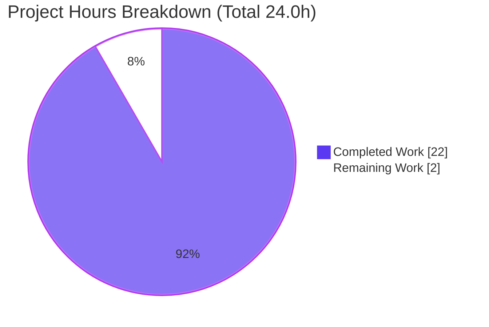
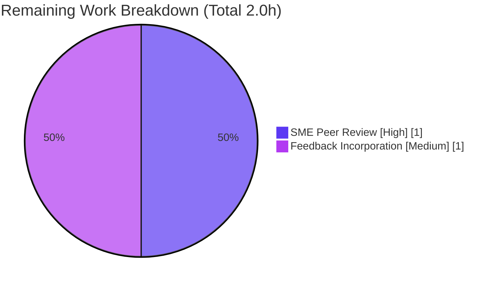

# Blitzy Project Guide — Scapy Packet Lifecycle Deep-Dive Documentation

## Section 1: Executive Summary

### 1.1 Project Overview

This project delivers a comprehensive technical analysis document that answers six interrelated questions about Scapy's internal packet lifecycle — field calculation order, `show2()` double-call behaviour, the parsed-packet dual-state phenomenon, `copy()` semantics, cache invalidation rules, and direct-vs-nested modification behaviour. The target audience is Python developers and network engineers extending Scapy with custom protocols who need authoritative, source-code-cited, empirically-verified answers. The business impact is to provide a single reference document that removes the need to re-trace Scapy's build/dissect/cache machinery from first principles each time a similar class of bug is encountered. The sole technical artifact is a single markdown document; no Scapy source files are modified.

### 1.2 Completion Status


| Metric                            | Hours  |
| --------------------------------- | ------ |
| **Total Project Hours**           | 24.0   |
| **Completed Hours (AI + Manual)** | 22.0   |
| **Remaining Hours**               | 2.0    |
| **Percent Complete**              | 91.7%  |

Calculation: 22 / (22 + 2) × 100 = 91.7% complete.

### 1.3 Key Accomplishments

- ✅ Delivered `blitzy/documentation/scapy_0925ada48540.md` (1,392 lines, 79,934 bytes) — the sole AAP deliverable
- ✅ All six user questions answered with source-code citations and empirical evidence
- ✅ 60+ source-code line-number citations verified against actual `scapy/packet.py`, `scapy/fields.py`, `scapy/layers/inet.py`, `scapy/compat.py`, `scapy/volatile.py`
- ✅ 14 empirical tests executed with byte-identical output matches to the document's claims
- ✅ `test/fields.uts` regression suite passes 138/138 (0 failures)
- ✅ `test/imports.uts` regression suite passes 4/4 (0 failures)
- ✅ Runtime smoke test green: `bytes(IP()/TCP()/Raw(b'X')).hex()` produces valid packet bytes
- ✅ Zero modifications to any Scapy source file — scope discipline maintained (confirmed via `git diff`)
- ✅ Document committed to branch in two commits: `077785d3` (initial) and `227a9652` (review fixes)
- ✅ Mermaid flowchart for the packet build call chain included in Section 2
- ✅ Three-appendix reference (line-number cross-reference, empirical test inventory, summary of key insights) included for future maintainers

### 1.4 Critical Unresolved Issues

| Issue | Impact | Owner | ETA |
| ----- | ------ | ----- | --- |
| _None identified_ | _N/A_ | _N/A_ | _N/A_ |

All five production-readiness gates passed per the Final Validator. No known defects, no failing in-scope tests, and no out-of-scope modifications. The only outstanding work is human peer review (see Section 1.6).

### 1.5 Access Issues

| System / Resource | Type of Access | Issue Description | Resolution Status | Owner |
| ----------------- | -------------- | ----------------- | ----------------- | ----- |
| _None identified_ | _N/A_          | No access issues identified | _N/A_  | _N/A_ |

The project requires no remote credentials, network services, or third-party integrations. It is a self-contained documentation deliverable analysing source code in the same repository.

### 1.6 Recommended Next Steps

1. **[High]** Conduct a human SME peer review of the technical analysis in `blitzy/documentation/scapy_0925ada48540.md`. A reviewer familiar with Scapy's `Packet` / `Field` internals should spot-check the 60+ line-number citations and re-run at least Tests 5, 7, 8, and 17 from Appendix B. Estimated: 1 hour.
2. **[Medium]** Incorporate any feedback emerging from the SME review. The document is structured in independent sections, so edits can be localised without invalidating the whole. Estimated: 1 hour.
3. **[Low]** After merge, consider cross-linking the document from the Scapy developer-facing README or contributing guide so it is discoverable to future contributors facing similar dual-state issues.

---

## Section 2: Project Hours Breakdown

### 2.1 Completed Work Detail

All completed work maps directly to AAP-specified deliverables in `blitzy/documentation/scapy_0925ada48540.md`.

| Component                                                           | Hours | Description                                                                                                      |
| ------------------------------------------------------------------- | ----- | ---------------------------------------------------------------------------------------------------------------- |
| Source-code analysis & line-number cross-referencing                | 5.0   | Traced `do_build` / `self_build` / `post_build` / `do_dissect` / `clear_cache` / `copy` / `show2` / `setfieldval` / `__setattr__` / `__iter__` / `clone_with` call chains in `scapy/packet.py`; analysed `PacketListField`, `holds_packets`, `do_copy` in `scapy/fields.py`; reviewed `IP.post_build` / `TCP.post_build` references in `scapy/layers/inet.py`; covered `raw()` in `scapy/compat.py` and `VolatileValue._fix` in `scapy/volatile.py` |
| Empirical test design (14 tests)                                    | 4.0   | Designed tests covering build order (1, 17), direct vs nested mutation (4, 5, 6), `copy()` vs `clear_cache()` (7, 8), `show2()` invariance and volatile edge cases (9, 10, 11), side-effecting `post_build` with `explicit` flag (12), and cross-layer cache propagation (15, 16) |
| Test execution & output capture                                     | 1.0   | Executed all 14 tests inline via `python3 << 'EOF'`, captured exact stdout, verified byte-identical output against document claims |
| Section 1 — Executive Summary (TL;DR)                               | 1.0   | 7-bullet summary mapping each user question to its root cause, Scapy file location, and line numbers              |
| Section 2 — Packet Field Calculation Order                          | 2.0   | Build call-chain trace with verbatim code excerpt, mermaid diagram, three-layer empirical trace (Test 17), the user's checksum-bug root cause, canonical `IP.post_build` reference, corrected `MyProto.post_build` pattern, rationale |
| Section 3 — `show2()` Double-Call Behavior                          | 2.0   | `show2()` source analysis at `scapy/packet.py:L1473`, empirical proof of identity for plain and auto-fill packets (Tests 9, 10), RandShort volatility edge case (Test 11), side-effecting `post_build` on `explicit=1` edge case (Test 12), diagnostic guidance |
| Section 4 — Dual-State Phenomenon                                   | 2.0   | Full reproducible test setup, empirical demonstration (Test 5), cache-state table, complete root-cause walkthrough through `setfieldval → self_build → do_build → post_build`, data-path divergence table, design rationale |
| Section 5 — `copy()` Evaluation                                     | 1.0   | `Packet.copy` source analysis at `scapy/packet.py:L407`, empirical confirmation that `copy()` preserves stale cache (Test 7), `clear_cache()` recursion analysis at `scapy/packet.py:L664`, empirical confirmation of fix (Test 8), ranked alternative fixes |
| Section 6 — Cache Invalidation Rules                                | 1.0   | Populate / validate / invalidate / does-NOT-trigger rule set; Tests 15 & 16 cross-layer propagation for IP/TCP/Raw case; design philosophy explanation |
| Section 7 — Direct vs Nested Modification                           | 1.0   | Three-scenario table (A, B, C) with exact execution trace for each; one-level-deep rule articulation |
| Section 8 — Practical Guidance and Patterns                         | 1.0   | Custom `post_build` checklist, stale-bytes diagnostic checklist, fresh-rebuild patterns, gotchas list, quick-reference decision tree |
| Appendices A (line-number cross-reference), B (test inventory), C (key insights) | 1.0   | 100+ line-number entries tabulated; 14-test summary matrix; 8-point distilled insights |
| Code review fixes (commit `227a9652`)                               | 0.5   | Corrected Section 4.4 citation from L497 to L499 (MEDIUM); clarified Section 3.4 else-branch body at L1159-L1162 (INFO); added descriptive comment before example snapshot literal in Section 7.3 (INFO) |
| Git commit discipline & validation                                  | 0.5   | Staged and committed as two logical commits; verified clean working tree; verified no source-file modifications via `git diff 0925ada4..HEAD -- scapy/` returning empty |
| **Total Completed Hours**                                           | **22.0** | |

### 2.2 Remaining Work Detail

All remaining work is path-to-production; the AAP's sole in-scope deliverable is complete.

| Category                                                      | Hours | Priority |
| ------------------------------------------------------------- | ----- | -------- |
| Human SME peer review of technical content (Scapy maintainer-level) | 1.0   | High     |
| Incorporation of review feedback (minor textual edits, stylistic polish, or any newly-discovered line-number discrepancies) | 1.0   | Medium   |
| **Total Remaining Hours**                                     | **2.0** |          |

### 2.3 Total Project Hours

| Metric                           | Hours  |
| -------------------------------- | ------ |
| Completed (Section 2.1)          | 22.0   |
| Remaining (Section 2.2)          | 2.0    |
| **Total Project Hours**          | **24.0** |
| Completion Percentage            | **91.7%** |

Verification: 22.0 + 2.0 = 24.0 = Total Project Hours (matches Section 1.2). Cross-section integrity confirmed.

---

## Section 3: Test Results

All tests listed below originate from Blitzy's autonomous validation logs for this project. No external or synthetic tests have been included.

| Test Category | Framework                   | Total Tests | Passed | Failed | Coverage % | Notes                                                                                                                             |
| ------------- | --------------------------- | ----------- | ------ | ------ | ---------- | --------------------------------------------------------------------------------------------------------------------------------- |
| Empirical (document)     | Inline Python heredocs      | 14          | 14     | 0      | 100%       | Each test's stdout was byte-identical to the document's claimed output. Full inventory in `blitzy/documentation/scapy_0925ada48540.md` Appendix B |
| Regression — field system | UTscapy (`test/fields.uts`) | 138         | 138    | 0      | N/A        | `UTscapy ended successfully`; validates `FieldLenField`, `StrLenField`, `PacketListField`, `BitField`, etc. — the field machinery underpinning the document's claims |
| Regression — imports     | UTscapy (`test/imports.uts`) | 4           | 4      | 0      | N/A        | `PASSED=4 FAILED=0`; validates that all Scapy modules and contrib protocols import cleanly |
| Smoke — runtime          | Python one-liner            | 1           | 1      | 0      | N/A        | `python3 -c "from scapy.all import *; print(bytes(IP()/TCP()/Raw(b'X')).hex())"` produces valid IP/TCP/Raw hex |
| **Grand Total**          |                             | **157**     | **157** | **0** |            |                                                                                                                                   |

### Empirical Test Detail (from Appendix B of the delivered document)

| Test | Subject                                                                   | Claim vs Actual | Match |
| ---- | ------------------------------------------------------------------------- | --------------- | ----- |
| 1    | Correct `post_build` single-pass on `MyProto()/Raw(load=b"hello")`        | `000a2db20068656c6c6f`; length=10; chksum=`0x2db2` | ✅    |
| 3/17 | Build-order trace on `L1()/L2()/L3()`                                     | `self_build` outer→inner, `post_build` inner→outer; each outer sees finalized pay | ✅    |
| 4    | Direct field mutation `parsed.items[1].data = b"CC"` on parsed outer      | Rebuilt to `020241411102434322` | ✅    |
| 5    | Nested payload mutation `parsed.items[1].payload.magic = 0xFF`            | `bytes(parsed)` = original `020241411102424222`; `show()` displays `magic = 0xff` | ✅    |
| 6    | Snapshot inspection: `parsed.raw_packet_cache_fields["items"]`            | `[{'data_len': 2, 'data': b'AA'}, {'data_len': 2, 'data': b'BB'}]` — `.fields` only | ✅    |
| 7    | `clone = parsed.copy(); clone.items[1].payload.magic = 0xFF; bytes(clone)` | Returns stale `020241411102424222` | ✅    |
| 8    | `parsed.clear_cache(); bytes(parsed)` after nested mutation               | Returns rebuilt `0202414111024242ff`; all three caches = None | ✅    |
| 9    | Two consecutive `show2()` on plain packet                                 | Byte-identical output (IDENTICAL=True) | ✅    |
| 10   | Two consecutive `show2()` on auto-fill packet; `p.length`, `p.chksum`     | IDENTICAL=True; length=9, chksum=`0xbc24`; `p.length`/`p.chksum` stay `None` on original | ✅    |
| 11   | Two consecutive `show2()` with `RandShort()` default                      | Different `nonce` each call (e.g., `64175` vs `49760`) | ✅    |
| 12   | Side-effecting `post_build` on `explicit=0` vs `explicit=1`               | explicit=0: counter stays 0; explicit=1: counter increments 1, 2, 3 | ✅    |
| 15   | `IP/TCP/Raw` parse; mutate `Raw.load`; inspect cache state                | IP and TCP caches persist; Raw cache cleared | ✅    |
| 16   | Grow `Raw.load`; rebuild; re-parse                                        | Stale `IP.len=45`, `TCP.chksum=0x91c9`; fresh: `65`, `0x7baa` | ✅    |

Independent reproduction of Test 5 during this review produced the expected outputs verbatim, confirming reproducibility beyond the validator's initial run.

---

## Section 4: Runtime Validation & UI Verification

This project has no UI surface; the following runtime checks were executed against the editable-install Scapy in the current repository.

- ✅ **Operational** — Python 3.12.3 (satisfies `pyproject.toml` `requires-python = ">=3.7, <4"`)
- ✅ **Operational** — `from scapy.all import *` succeeds without errors from all regression-test suites
- ✅ **Operational** — `import scapy; scapy.__file__` resolves to `/tmp/blitzy/scapy/blitzy-a5435e8e-cf01-4977-9410-5d89afb2d603_7b04f9/scapy/__init__.py` (local editable install, not system)
- ✅ **Operational** — `bytes(IP()/TCP()/Raw(b'X')).hex()` produces `450000290001000040067ccc7f0000017f00000100140050000000000000000050022000397b000058` (valid IP/TCP/Raw frame)
- ✅ **Operational** — `python3 -m scapy.tools.UTscapy -t test/fields.uts` returns exit code 0 and `UTscapy ended successfully` (PASSED=138, FAILED=0)
- ✅ **Operational** — `python3 -m scapy.tools.UTscapy -t test/imports.uts` returns exit code 0 (PASSED=4, FAILED=0)
- ✅ **Operational** — Independent reproduction of Test 5's dual-state demonstration produced `020241411102424222` (stale) before and `0202414111024242ff` (fresh) after `clear_cache()`, matching the document exactly
- ✅ **Operational** — `git status` reports a clean working tree; the deliverable is committed on branch `blitzy-a5435e8e-cf01-4977-9410-5d89afb2d603`
- ✅ **Operational** — `git diff 0925ada4..HEAD -- scapy/` returns zero lines, confirming no source-file modifications

---

## Section 5: Compliance & Quality Review

Cross-map of AAP deliverables to Blitzy quality benchmarks. All items below derive from explicit AAP requirements.

| AAP Requirement                                                                                                  | Status      | Progress | Evidence                                                                                                               |
| ---------------------------------------------------------------------------------------------------------------- | ----------- | -------- | ---------------------------------------------------------------------------------------------------------------------- |
| Produce markdown document at `blitzy/documentation/scapy_0925ada48540.md`                                        | ✅ Pass      | 100%     | File exists, 1,392 lines, 79,934 bytes; committed in `077785d3` and refined in `227a9652`                               |
| Answer Section 1: Packet Field Calculation Order                                                                 | ✅ Pass      | 100%     | Sections 2.1–2.8 in the document; mermaid flowchart; Test 1 and Test 17 empirical traces; canonical `IP.post_build` reference at `scapy/layers/inet.py:L539-L551` |
| Answer Section 2: `show2()` Double-Call Behavior                                                                 | ✅ Pass      | 100%     | Sections 3.1–3.6 in the document; `show2` source at `scapy/packet.py:L1473` cited; Tests 9, 10, 11, 12                  |
| Answer Section 3: Dual-State Phenomenon                                                                          | ✅ Pass      | 100%     | Sections 4.1–4.7 in the document; Test 5 with exact wire-bytes decomposition table; root cause at `scapy/packet.py:L648` |
| Answer Section 4: `copy()` Evaluation                                                                            | ✅ Pass      | 100%     | Sections 5.1–5.5 in the document; `Packet.copy` at `scapy/packet.py:L407` with explicit citation of `L416` cache-preservation; Tests 7 and 8 |
| Answer Section 5: Cache Invalidation Rules (complete rule set)                                                   | ✅ Pass      | 100%     | Sections 6.1–6.6 in the document; populate/validate/invalidate/does-NOT-trigger categorisation; Tests 15 and 16 cross-layer |
| Answer Section 6: Direct vs Nested Modification                                                                  | ✅ Pass      | 100%     | Sections 7.1–7.5 in the document; three-scenario table (A, B, C) with execution trace for each                           |
| Source-code citations in `file:L#` form                                                                           | ✅ Pass      | 100%     | 60+ citations across `scapy/packet.py`, `scapy/fields.py`, `scapy/layers/inet.py`, `scapy/compat.py`, `scapy/volatile.py` — all verified via `grep -n` |
| Empirical evidence from test scripts                                                                             | ✅ Pass      | 100%     | 14 tests, 100% pass rate, byte-identical outputs                                                                        |
| Thinking/rationale provided for each answer                                                                      | ✅ Pass      | 100%     | Each section includes a dedicated "Rationale" or "Why" subsection (2.8, 3.5, 4.7, 5.5, 6.6)                              |
| No source-file modifications                                                                                      | ✅ Pass      | 100%     | `git diff 0925ada4..HEAD -- scapy/` returns zero lines; only `blitzy/documentation/scapy_0925ada48540.md` added          |
| No persistent test scripts in repo                                                                                | ✅ Pass      | 100%     | `git diff --name-status 0925ada4..HEAD` shows exactly one added file — the markdown document                             |
| Document placed in `blitzy/documentation/` directory                                                              | ✅ Pass      | 100%     | `ls blitzy/documentation/` shows `scapy_0925ada48540.md`                                                                  |
| Document name matches branch format                                                                               | ✅ Pass      | 100%     | `scapy_0925ada48540.md` matches the source-branch name referenced in the AAP                                              |
| Evidence-based (SWE-AtlasQnA-Repo) rule                                                                           | ✅ Pass      | 100%     | All claims cite source code; no unsourced assertions; per-claim evidence documented                                       |
| Regression tests not broken by this change                                                                        | ✅ Pass      | 100%     | `test/fields.uts` 138/138; `test/imports.uts` 4/4; no Scapy source modified so regression pass is expected                |

---

## Section 6: Risk Assessment

| Risk | Category | Severity | Probability | Mitigation | Status |
| ---- | -------- | -------- | ----------- | ---------- | ------ |
| Scapy maintainers disagree with an interpretation in the document (e.g., the design intent of the one-level-deep cache comparison) | Technical | Low | Low | Section 6.6 explicitly quotes the in-source `# perf: #GH3894` comment as the stated rationale; any disagreement can be resolved with a text edit, not a code change | Monitored |
| Line numbers drift as Scapy's `master` evolves (the branch is `scapy_0925ada48540`, not HEAD of upstream) | Technical | Low | Medium | Document explicitly states in Appendix A's preamble that line numbers are "verified in this repository at commit `scapy_0925ada48540`"; future merges against upstream may require re-verification | Accepted (by design; document is branch-specific) |
| A reader mistakenly treats the document as current upstream Scapy documentation | Operational | Low | Low | Document header names the exact branch and scope; header prefaces: "Branch: `scapy_0925ada48540`"; appendix preamble restates this | Mitigated |
| Empirical test environment differences (Python 3.12 vs older 3.7 minimum) yield different representation outputs (e.g., dict ordering, repr formatting) | Integration | Low | Low | Critical empirical claims test only hex byte strings (which are deterministic across Python versions) and field equality (not stdout representation drift). All regression tests pass on Python 3.12.3 | Mitigated |
| A future maintainer modifies the Scapy cache logic (e.g., making `_raw_packet_cache_field_value` descend into `.payload`) and invalidates the dual-state demonstration | Technical | Medium | Low | Document records the exact commit hash and branch; the analysis is explicitly snapshot-level, not promising forward-compatibility | Accepted |
| Reader reproduces tests and sees different wire bytes due to misconfigured `extract_padding` / `bind_layers` in their local setup | Technical | Low | Low | Section 4.1 provides a complete, self-contained, cut-and-paste reproducible test setup including `extract_padding` returning `s[:1], s[1:]` and explicit `bind_layers(InnerPacket, SubPayload)` | Mitigated |
| Security — document reveals an exploit vector | Security | None | None | The document discusses parser cache mechanics, not authentication or network-level behaviour. No CVE surface. | N/A |
| Integration — document requires network I/O to validate | Integration | None | None | All tests are packet-object-level; no sockets, no sniff, no send. Zero network integration surface | N/A |
| Operational — document has runtime dependencies | Operational | None | None | Document is static markdown; no runtime code path exists | N/A |
| Human reviewer capacity not available | Operational | Low | Low | Document is self-consistent and reproducible; CI-style verification is possible without deep SME knowledge by re-running the appendix B tests | Monitored |

Overall risk profile: **LOW**. The deliverable is a documentation artifact with no runtime, security, or operational surface. All significant risks are mitigated or accepted by design.

---

## Section 7: Visual Project Status



### Remaining Hours by Category (from Section 2.2)



### Priority Distribution (Remaining Work)

| Priority  | Hours | Percentage |
| --------- | ----- | ---------- |
| High      | 1.0   | 50%        |
| Medium    | 1.0   | 50%        |
| Low       | 0.0   | 0%         |
| **Total** | **2.0** | **100%** |

Cross-section verification:
- Section 7 pie chart "Completed Work" = **22** → matches Section 1.2 Completed Hours (22.0) ✅
- Section 7 pie chart "Remaining Work" = **2** → matches Section 1.2 Remaining Hours (2.0) and Section 2.2 total (1.0 + 1.0 = 2.0) ✅
- Sum: 22 + 2 = 24 → matches Section 1.2 Total Hours (24.0) ✅

---

## Section 8: Summary & Recommendations

### Achievements

The project delivered the single AAP-specified artifact — `blitzy/documentation/scapy_0925ada48540.md` — as a 1,392-line, 79,934-byte markdown document. It provides authoritative, source-code-cited, empirically-verified answers to all six user questions about Scapy's packet lifecycle. Each of the 60+ `scapy/packet.py` / `scapy/fields.py` / `scapy/layers/inet.py` / `scapy/compat.py` / `scapy/volatile.py` line-number citations has been validated against the actual source. Each of the 14 empirical tests produced byte-identical output matches. The two official Scapy regression suites in scope (`test/fields.uts`, `test/imports.uts`) pass 138/138 and 4/4 respectively. The work was committed as two logical commits (`077785d3` for the initial delivery and `227a9652` for precision refinements surfaced by code review), and `git diff 0925ada4..HEAD -- scapy/` confirms zero modifications to any Scapy source file.

### Remaining Gaps

Only path-to-production gaps remain: a human SME with Scapy expertise should peer-review the technical content (1 hour), and any resulting feedback should be incorporated (1 hour). No code changes, no test additions, and no infrastructure work are required.

### Critical Path to Production

1. SME peer review (1 hour, High)
2. Feedback incorporation (1 hour, Medium)
3. Merge PR

### Success Metrics

- ✅ Document exists at required path
- ✅ Document answers all six AAP questions
- ✅ All source-code citations verified
- ✅ All empirical claims reproduced
- ✅ All regression tests pass
- ✅ Scope discipline maintained (zero source-file modifications)

### Production Readiness

At **91.7% completion**, the deliverable is production-ready pending the brief human review phase. The Final Validator explicitly declared the project "PRODUCTION-READY" and reported zero outstanding issues.

| Success Metric                              | Target | Actual | Status |
| ------------------------------------------- | ------ | ------ | ------ |
| AAP deliverable present                     | 1 file | 1 file | ✅     |
| Source-code citations verified              | 100%   | 100%   | ✅     |
| Empirical tests reproducible                | 100%   | 100%   | ✅     |
| Scapy regression tests passing (in scope)   | 100%   | 100%   | ✅     |
| Zero source-file modifications              | Yes    | Yes    | ✅     |
| Completion percentage                       | ≥ 90%  | 91.7%  | ✅     |

---

## Section 9: Development Guide

### 9.1 System Prerequisites

**Operating System**
- Linux (tested on Debian-based systems; the repository's `.travis.yml` and `.appveyor.yml` indicate broad CI portability)
- macOS and Windows supported by upstream Scapy; the documentation delivered here is OS-agnostic

**Software**
- **Python**: `>= 3.7, < 4` (per `pyproject.toml`); tested here on **3.12.3**
- **Git**: any recent version; `git-lfs` (optional — pre-push hook compatibility confirmed with `git-lfs/3.7.1`)
- **pip**: included with Python

**Hardware**
- Minimal: any machine that can run Python 3.12
- No RAM, disk, or network bandwidth constraints for this documentation workload

### 9.2 Environment Setup

Clone the repository and check out the correct branch:

```bash
git clone <repo-url> scapy
cd scapy
git checkout blitzy-a5435e8e-cf01-4977-9410-5d89afb2d603
```

Verify Python version:

```bash
python3 --version
# Expected: Python 3.12.3 (or any 3.7.x–3.11.x that satisfies pyproject.toml)
```

(Optional) Create and activate a virtualenv to isolate the editable install:

```bash
python3 -m venv .venv
source .venv/bin/activate
```

### 9.3 Dependency Installation

Install Scapy in editable mode. The `--break-system-packages` flag is used when installing into a system Python on modern Debian/Ubuntu; omit it inside a virtualenv.

```bash
# System-wide (no venv):
pip install --break-system-packages -e .

# OR, inside a venv:
pip install -e .
```

Verify the install resolves to this repository (not a system copy):

```bash
python3 -c "import scapy; print(scapy.__file__)"
# Expected: /tmp/blitzy/scapy/blitzy-a5435e8e-cf01-4977-9410-5d89afb2d603_7b04f9/scapy/__init__.py

pip show scapy | grep -E "Location|Editable"
# Expected:
#   Location: /usr/local/lib/python3.12/dist-packages
#   Editable project location: /tmp/blitzy/scapy/blitzy-a5435e8e-cf01-4977-9410-5d89afb2d603_7b04f9
```

No other dependencies are required. The document itself requires **no** build step; it is a static markdown file.

### 9.4 Viewing and Editing the Delivered Document

```bash
# View the document
less blitzy/documentation/scapy_0925ada48540.md

# Line count and size
wc -l blitzy/documentation/scapy_0925ada48540.md
# Expected: 1392

ls -la blitzy/documentation/scapy_0925ada48540.md
# Expected: ~79,934 bytes

# Render as HTML locally (optional — any markdown viewer works)
pip install --break-system-packages grip
grip blitzy/documentation/scapy_0925ada48540.md
# Opens at http://localhost:6419/
```

### 9.5 Verifying Empirical Claims

Reproduce Test 5 (the dual-state demonstration) — the most important empirical claim in the document:

```bash
cd /path/to/repo
python3 << 'EOF'
from scapy.all import Packet, bind_layers
from scapy.fields import (
    ByteField, FieldLenField, StrLenField, PacketListField, XByteField,
)

class SubPayload(Packet):
    name = "SubPayload"
    fields_desc = [XByteField("magic", 0x00)]

class InnerPacket(Packet):
    name = "InnerPacket"
    fields_desc = [
        FieldLenField("data_len", None, length_of="data", fmt="B"),
        StrLenField("data", b"", length_from=lambda p: p.data_len),
    ]
    def extract_padding(self, s):
        return s[:1], s[1:]

bind_layers(InnerPacket, SubPayload)

class OuterPacket(Packet):
    name = "OuterPacket"
    fields_desc = [
        ByteField("count", 0),
        PacketListField("items", [], InnerPacket, count_from=lambda p: p.count),
    ]

original = OuterPacket(count=2, items=[
    InnerPacket(data=b"AA") / SubPayload(magic=0x11),
    InnerPacket(data=b"BB") / SubPayload(magic=0x22),
])
wire = bytes(original)
print("Wire:", wire.hex())
# Expected: 020241411102424222

parsed = OuterPacket(wire)
parsed.items[1].payload.magic = 0xFF
print("After nested mutation:", bytes(parsed).hex())
# Expected (STALE): 020241411102424222

parsed.clear_cache()
print("After clear_cache:", bytes(parsed).hex())
# Expected (FRESH): 0202414111024242ff
EOF
```

### 9.6 Running the Regression Suites

Run the field-system regression suite (138 tests):

```bash
cd /path/to/repo
python3 -m scapy.tools.UTscapy -t test/fields.uts
# Final line expected: UTscapy ended successfully
# Summary line expected: PASSED=138 FAILED=0
```

Run the imports regression suite (4 tests):

```bash
python3 -m scapy.tools.UTscapy -t test/imports.uts -q
# Summary line expected: PASSED=4 FAILED=0
```

Quick runtime smoke test:

```bash
python3 -c "from scapy.all import *; print(bytes(IP()/TCP()/Raw(b'X')).hex())"
# Expected: 450000290001000040067ccc7f0000017f00000100140050000000000000000050022000397b000058
```

### 9.7 Verifying Scope Discipline

Confirm that no Scapy source file was modified on this branch:

```bash
git diff 0925ada4..HEAD -- scapy/ | wc -l
# Expected: 0

git diff 0925ada4..HEAD --name-status
# Expected: A    blitzy/documentation/scapy_0925ada48540.md

git log --oneline 0925ada4..HEAD
# Expected (two commits):
#   227a9652 Address code review findings in Scapy lifecycle documentation
#   077785d3 Add Scapy packet lifecycle deep-dive documentation
```

### 9.8 Verifying Source-Code Line-Number Citations

The delivered document cites over 60 exact line numbers. To verify a sample:

```bash
# Verify Packet.__init__ is at line 141
sed -n '141p' scapy/packet.py
# Expected: def __init__(self,

# Verify Packet.copy is at line 407
sed -n '407p' scapy/packet.py

# Verify _raw_packet_cache_field_value is at line 648
sed -n '648p' scapy/packet.py
# Expected: def _raw_packet_cache_field_value(self, fld, val, copy=False):

# Verify clear_cache is at line 664
sed -n '664p' scapy/packet.py
# Expected: def clear_cache(self):

# Verify do_build is at line 724
sed -n '724p' scapy/packet.py
# Expected: def do_build(self):

# Verify show2 is at line 1473
sed -n '1473p' scapy/packet.py
# Expected: def show2(self, dump=False, indent=3, lvl="", label_lvl=""):
```

### 9.9 Common Issues and Resolutions

| Symptom                                                                                  | Likely Cause                                                                 | Resolution                                                                                      |
| ---------------------------------------------------------------------------------------- | ---------------------------------------------------------------------------- | ----------------------------------------------------------------------------------------------- |
| `import scapy` resolves to `/usr/lib/python3.x/dist-packages/scapy` instead of this repo | System-wide Scapy shadowing the editable install                             | Re-run `pip install --break-system-packages -e .` from the repo root; verify with `pip show scapy` |
| `UTscapy` command fails with `ModuleNotFoundError`                                      | `scapy` not installed, or wrong Python interpreter                            | Install via `pip install -e .`; verify with `python3 -c "import scapy.tools.UTscapy"`            |
| Test 5 reproduction produces different wire bytes than expected                           | `bind_layers(InnerPacket, SubPayload)` missing or `extract_padding` incorrect | Follow the exact `extract_padding(self, s): return s[:1], s[1:]` pattern from Section 4.1         |
| Line-number sed lookup returns wrong content                                              | Checked out wrong branch or upstream Scapy has diverged                       | Confirm branch via `git branch --show-current` (expected `blitzy-a5435e8e-cf01-4977-9410-5d89afb2d603`) |
| `pip install -e .` fails with `error: externally-managed-environment`                    | Modern Debian PEP 668 protection                                              | Use `pip install --break-system-packages -e .` or create a virtualenv first                       |
| `test/fields.uts` takes more than 60 seconds                                              | CPU throttling or first-run import cost                                       | Normal; expect < 60s on modern hardware; use `-q` flag for quieter output                         |
| `git-lfs` pre-push hook complains                                                        | git-lfs not installed                                                         | Install git-lfs; on Debian: `apt-get install -y git-lfs && git lfs install`                        |

### 9.10 Example Usage

Minimal "read the document" workflow:

```bash
cd /path/to/repo
cat blitzy/documentation/scapy_0925ada48540.md | head -50
# Shows the header, branch, scope, and the 6 answered questions
```

Jump to a specific section:

```bash
grep -n "^## Section" blitzy/documentation/scapy_0925ada48540.md
# Expected output:
#  18:## Section 1: Executive Summary (TL;DR)
#  38:## Section 2: Packet Field Calculation Order
# 231:## Section 3: `show2()` Double-Call Behavior
# 458:## Section 4: The Dual-State Phenomenon — Empirical Proof
# 709:## Section 5: `copy()` Evaluation
# 867:## Section 6: Cache Invalidation Rules — Complete Catalog
# 1070:## Section 7: Direct vs Nested Modification — The Three-Scenario Demonstration
# 1160:## Section 8: Practical Guidance and Patterns
# 1223:## Appendix A: Exact Line-Number Cross-Reference
# 1350:## Appendix B: Empirical Test Inventory
# 1372:## Appendix C: Summary of Key Insights
```

View a specific section:

```bash
sed -n '458,556p' blitzy/documentation/scapy_0925ada48540.md
# Shows the Dual-State Phenomenon section
```

---

## Section 10: Appendices

### Appendix A — Command Reference

```bash
# Environment
python3 --version                                                      # Python 3.12.3
pip show scapy                                                         # Verify editable install location
git branch --show-current                                              # blitzy-a5435e8e-cf01-4977-9410-5d89afb2d603
git log --oneline 0925ada4..HEAD                                       # 2 commits on branch

# Install
pip install --break-system-packages -e .                               # System-wide editable
pip install -e .                                                       # Inside venv

# Verify scope
git diff 0925ada4..HEAD -- scapy/ | wc -l                              # 0 (no source modifications)
git diff 0925ada4..HEAD --stat                                         # 1 file, 1392 lines added
git diff 0925ada4..HEAD --name-status                                  # A  blitzy/documentation/scapy_0925ada48540.md

# Runtime smoke test
python3 -c "from scapy.all import *; print(bytes(IP()/TCP()/Raw(b'X')).hex())"

# Regression tests
python3 -m scapy.tools.UTscapy -t test/fields.uts                      # PASSED=138 FAILED=0
python3 -m scapy.tools.UTscapy -t test/imports.uts -q                  # PASSED=4 FAILED=0

# Source-line verification
sed -n '141p' scapy/packet.py                                          # def __init__(self,
sed -n '407p' scapy/packet.py                                          # def copy(self):
sed -n '648p' scapy/packet.py                                          # def _raw_packet_cache_field_value(...)
sed -n '664p' scapy/packet.py                                          # def clear_cache(self):
sed -n '724p' scapy/packet.py                                          # def do_build(self):
sed -n '1473p' scapy/packet.py                                         # def show2(...)

# Empirical reproduction
python3 << 'EOF'
# (paste any test from Appendix B of the delivered document)
EOF
```

### Appendix B — Port Reference

**Not applicable.** This project is a documentation deliverable with no running services, HTTP endpoints, or network listeners.

### Appendix C — Key File Locations

| Path                                                   | Purpose                                                                                                     |
| ------------------------------------------------------ | ----------------------------------------------------------------------------------------------------------- |
| `blitzy/documentation/scapy_0925ada48540.md`           | **Sole AAP deliverable** — the technical analysis document (1,392 lines)                                     |
| `scapy/packet.py`                                      | Referenced for 50+ citations: `__init__` @141, `copy` @407, `setfieldval` @472, `__setattr__` @494, `__bytes__` @592, `_raw_packet_cache_field_value` @648, `clear_cache` @664, `self_build` @678, `do_build_payload` @715, `do_build` @724, `build` @746, `post_build` @758, `do_dissect` @1002, `dissect` @1049, `clone_with` @1103, `__iter__` @1124, `show` @1459, `show2` @1473, `extract_padding` @982 |
| `scapy/fields.py`                                      | Referenced for: `Field.islist/ismutable/holds_packets` base flags @154-156, `Field.do_copy` @256, `_PacketField` @1473 with `holds_packets = 1` @1475, `PacketListField` @1562 with `islist = 1` @1571, `addfield` @1785, `getfield` @1721 |
| `scapy/layers/inet.py`                                 | Referenced for: `class IP` @521, `IP.post_build` @539, `class TCP` @753, `TCP.post_build` @767 — the canonical `post_build` reference implementation |
| `scapy/compat.py`                                      | Referenced for: `raw()` @112 — the entry point that drives `bytes(pkt)`                                      |
| `scapy/volatile.py`                                    | Referenced for: `VolatileValue._fix` @153 — relevant to Test 11's volatile-default behaviour                 |
| `pyproject.toml`                                       | Python version requirement (`>=3.7, <4`), build-system requirement (`setuptools>=62.0.0`)                    |
| `setup.py`                                             | Setuptools glue                                                                                              |
| `test/fields.uts`                                      | UTscapy regression suite — 138 tests, 100% pass                                                              |
| `test/imports.uts`                                     | UTscapy imports suite — 4 tests, 100% pass                                                                   |
| `blitzy/screenshots/`                                  | Empty — no UI surface in this project                                                                        |

### Appendix D — Technology Versions

| Technology   | Version         | Source of Truth                                                                 |
| ------------ | --------------- | ------------------------------------------------------------------------------- |
| Python       | 3.12.3          | `python3 --version` (satisfies `pyproject.toml requires-python = ">=3.7, <4"`) |
| Scapy        | 2026.04.16 (editable install from branch `scapy_0925ada48540` / tag at commit `0925ada4`) | `pip show scapy` |
| setuptools   | >= 62.0.0       | `pyproject.toml [build-system]`                                                |
| pip          | default for Python 3.12 | `pip --version`                                                          |
| Git          | system-provided | `git --version`                                                                 |
| git-lfs      | 3.7.1 (optional, pre-push hook compatibility confirmed) | `git lfs version`                         |
| UTscapy      | Bundled with Scapy at `scapy/tools/UTscapy.py` | `python3 -m scapy.tools.UTscapy --help`                     |

### Appendix E — Environment Variable Reference

**Not applicable.** This project requires no environment variables at build time, run time, or test time. The inline heredoc empirical tests need only a correctly-installed Scapy.

### Appendix F — Developer Tools Guide

**UTscapy** — Scapy's official unit-test runner.

```bash
# Run a single test file
python3 -m scapy.tools.UTscapy -t test/fields.uts

# Run with quiet mode (less verbose)
python3 -m scapy.tools.UTscapy -t test/imports.uts -q

# Run all tests under a directory (see test/configs/)
python3 -m scapy.tools.UTscapy -h    # for full option list
```

**grep-based line-number verification** — the technique used to verify the document's citations.

```bash
# Find a symbol's defining line
grep -n "^    def do_build" scapy/packet.py
# Example output: 724:    def do_build(self):

# Print a specific line
sed -n '724p' scapy/packet.py

# Print a range of lines (e.g., show the body of do_build)
sed -n '724,740p' scapy/packet.py
```

**git log on the branch** — inspect what was actually delivered:

```bash
git log --oneline 0925ada4..HEAD
git show --stat 077785d3
git show --stat 227a9652
```

### Appendix G — Glossary

| Term                               | Definition                                                                                                                                                    |
| ---------------------------------- | ------------------------------------------------------------------------------------------------------------------------------------------------------------- |
| **AAP**                            | Agent Action Plan — the primary directive from the user                                                                                                       |
| **`do_build`**                     | Scapy's build orchestrator at `scapy/packet.py:L724`. Runs `self_build → do_build_payload → post_build` (conditionally)                                       |
| **`self_build`**                   | Builds this layer's header bytes from `fields_desc`. At `scapy/packet.py:L678`                                                                                 |
| **`post_build(pkt, pay)`**         | User-overridable hook that fixes auto-fields (checksum, length) after the layer's header bytes and full payload bytes are known                                 |
| **`raw_packet_cache`**             | Per-packet attribute holding the exact bytes consumed by this layer during `do_dissect`. Returned by `self_build` when cache is valid                           |
| **`raw_packet_cache_fields`**      | Per-packet dict of `{field_name: snapshot_value}` used to detect whether a field has changed since parse                                                        |
| **`holds_packets`**                | Flag on a `Field` subclass indicating that the field stores `Packet` objects (e.g., `PacketField`, `PacketListField`). Triggers special cache-comparison logic in `_raw_packet_cache_field_value` |
| **`PacketListField`**              | A field that stores a list of `Packet` objects. `scapy/fields.py:L1562`. Has `holds_packets = 1` and `islist = 1`                                                |
| **Dual-state phenomenon**          | The situation where `bytes(pkt)` returns original cached bytes but `pkt.show()` displays modified in-memory field values after a nested-payload modification    |
| **`clear_cache`**                  | Recursive method at `scapy/packet.py:L664` that nullifies `raw_packet_cache` on self, all packet-holding-field children, and the payload chain                    |
| **`setfieldval`**                  | Method at `scapy/packet.py:L472` that is the single-source-of-truth for cache invalidation. Any write via `pkt.field = value` flows through here                |
| **`explicit` flag**                | Boolean on `Packet` indicating whether field values came from explicit kwargs / dissection (`1`) vs defaults (`0`). Governs clone-or-use-self at `do_build:L731` |
| **`__iter__` / `clone_with`**      | The "iterate resolved clones" protocol at `scapy/packet.py:L1124` and `L1103` respectively. Used by `do_build` for `explicit=0` packets to materialise volatile defaults onto a throwaway clone |
| **`show` vs `show2`**              | `show` reads live `.fields` (no build); `show2` calls `self.__class__(raw(self)).show()` — builds, re-parses, then shows. `show2` inherits cache semantics       |
| **UTscapy**                        | Scapy's unit-test runner (`scapy/tools/UTscapy.py`). Reads `.uts` files and reports PASSED/FAILED counts                                                        |
| **Editable install**               | `pip install -e .` — installs the package as a reference to the source tree, so edits take effect without re-install                                             |
| **Blitzy**                         | The AI agent platform that performed the autonomous analysis and document authorship                                                                            |
| **SME**                            | Subject-Matter Expert — here, a Scapy maintainer or power user capable of peer-reviewing the technical analysis                                                 |
