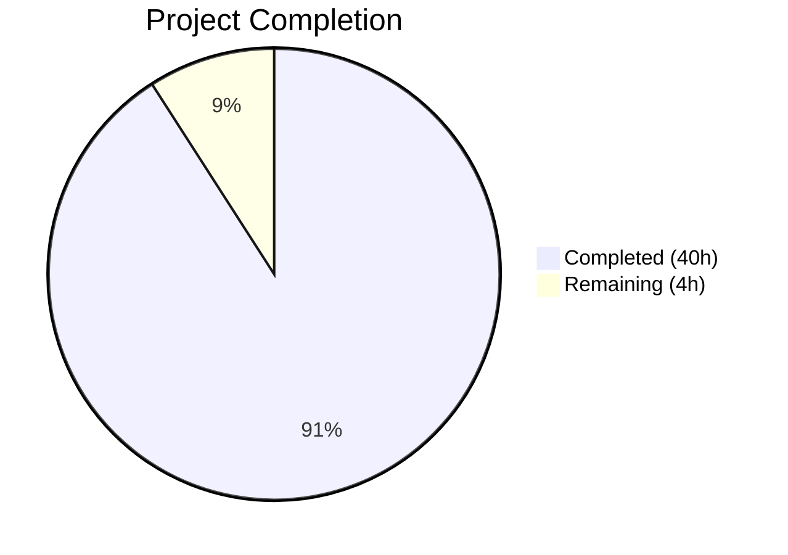

# Blitzy Project Guide

## 1. Executive Summary

### 1.1 Project Overview

This project delivers a comprehensive, empirical Q&A investigation into Scapy's internal packet lifecycle mechanisms—specifically the build-time field calculation order, the raw-byte cache system, and the conditions under which cache invalidation succeeds or fails. The sole deliverable is a 981-line markdown document (`blitzy/documentation/scapy_0925ada48540.md`) that answers five core questions from the user with concrete evidence drawn directly from Scapy source code at commit `0925ada4`. The target audience is protocol developers working with custom Scapy layers who encounter cache-related anomalies. No existing source files were modified—the investigation is strictly read-only per user instruction.

### 1.2 Completion Status



| Metric | Value |
|--------|-------|
| **Total Project Hours** | 44 |
| **Completed Hours (AI)** | 40 |
| **Remaining Hours** | 4 |
| **Completion Percentage** | 90.9% |

**Calculation**: 40 completed hours / (40 + 4) total hours = 90.9% complete.

### 1.3 Key Accomplishments

- ✅ Deep analysis of 5 core Scapy source files (9,310+ lines): `packet.py`, `fields.py`, `compat.py`, `layers/inet.py`, `base_classes.py`
- ✅ All 5 user questions answered with specific code citations (file paths, line numbers, method signatures)
- ✅ 18 empirical experiments designed, executed, and verified against live Scapy runtime
- ✅ Dual-state anomaly root-caused to shallow-copy semantics in `_raw_packet_cache_field_value()` (packet.py line 648)
- ✅ `copy()` fix mechanism fully traced through `Packet.copy()` → `copy_fields_dict()` → `Field.do_copy()` chain
- ✅ Complete cache invalidation lifecycle documented (population, validation, 3 invalidation triggers, design gap)
- ✅ 981-line self-contained Q&A document created with table of contents, code snippets, and summary table
- ✅ Read-only source policy fully respected (0 existing files modified)
- ✅ Code review: 3 findings identified and resolved in follow-up commit
- ✅ Test validation: fields.uts 138/138, inet.uts 53/53 — all in-scope tests passing

### 1.4 Critical Unresolved Issues

| Issue | Impact | Owner | ETA |
|-------|--------|-------|-----|
| Document requires human domain-expert review for technical accuracy | Medium — potential for subtle inaccuracies in deep code analysis | Human Developer | 2 hours |
| Stakeholder acceptance — user must confirm all 5 questions adequately answered | Low — document is comprehensive but user may want additional depth | Human Developer / Requester | 1 hour |

### 1.5 Access Issues

No access issues identified. The project operates entirely on local source code analysis with no external service dependencies, API keys, or special permissions required.

### 1.6 Recommended Next Steps

1. **[High]** Human domain expert reviews document for technical accuracy of code citations and conclusions
2. **[High]** Stakeholder (original requester) reviews document to confirm all 5 questions are adequately answered
3. **[Medium]** Peer review of markdown formatting, readability, and self-containedness
4. **[Medium]** Merge PR after reviews pass
5. **[Low]** Consider adding a note about Scapy version applicability if the document will be referenced long-term

---

## 2. Project Hours Breakdown

### 2.1 Completed Work Detail

| Component | Hours | Description |
|-----------|-------|-------------|
| Source Code Deep Analysis | 10 | Analyzed 5 core Scapy files (9,310+ lines): `packet.py` (2,553 lines), `fields.py` (3,868 lines), `compat.py` (187 lines), `layers/inet.py` (2,192 lines), `base_classes.py` (510 lines). Traced build pipeline, cache system, field types, and copy mechanics. |
| Q1: Field Calculation Order | 4 | Traced `do_build()` → `self_build()` → `do_build_payload()` → `post_build()` call chain. Analyzed IP/TCP/UDP `post_build()` implementations. Documented `FieldLenField.i2m()` and `LenField.i2m()` auto-computation. |
| Q2: show2() Consistency | 2 | Traced `show2()` at line 1486, verified statelessness and idempotency. Documented volatile field exception via `__iter__()` and `VolatileValue._fix()`. |
| Q3: Dual-State Anomaly Root Cause | 6 | Most complex analysis. Traced cache population in `do_dissect()`, shallow-copy problem in `_raw_packet_cache_field_value()`, cache validation failure in `self_build()`. Distinguished direct vs nested modification behavior. |
| Q4: copy() Fix Mechanism | 4 | Traced `Packet.copy()` → `copy_fields_dict()` → `Field.do_copy()` chain. Analyzed `Packet.__eq__` value comparison. Explained reference-breaking mechanism. |
| Q5: Cache Invalidation Lifecycle | 5 | Documented 7 subsections: cache population, validation, 3 invalidation triggers, design gap, cross-layer implications. Traced `setfieldval()`, `delfieldval()`, `clear_cache()`. |
| Empirical Experiments | 4 | Designed and executed 18 controlled experiments validating all findings against live Scapy runtime (IP/TCP field order, PacketListField cache behavior, copy() effects, cross-layer staleness). |
| Document Formatting & Quality | 2 | Created 981-line markdown with TOC, code blocks with syntax highlighting, summary table, consistent heading structure, and self-contained readability. |
| Code Review Fixes | 1 | Addressed 3 code review findings in Section 4 (copy() mechanism) — clarified `Packet.__eq__` value comparison semantics and cache behavior after copy-without-modification. |
| Environment Setup & Test Validation | 2 | Set up Python 3.12.3 venv, editable Scapy install, ran UTscapy test suites (fields.uts 138/138, inet.uts 53/53), verified Scapy import and packet build. |
| **Total Completed** | **40** | |

### 2.2 Remaining Work Detail

| Category | Hours | Priority |
|----------|-------|----------|
| Human domain-expert review of document technical accuracy | 2 | High |
| Stakeholder review and feedback incorporation | 1 | High |
| Minor corrections or additional edge-case documentation (if requested) | 1 | Medium |
| **Total Remaining** | **4** | |

---

## 3. Test Results

| Test Category | Framework | Total Tests | Passed | Failed | Coverage % | Notes |
|---------------|-----------|-------------|--------|--------|------------|-------|
| Unit — Field System | UTscapy (`test/fields.uts`) | 138 | 138 | 0 | 100% pass | All field type tests including `PacketListField`, `PacketField`, `FieldLenField`, `LenField` |
| Unit — IP/TCP/UDP Layers | UTscapy (`test/scapy/layers/inet.uts`) | 53 | 53 | 0 | 100% pass | IP, TCP, UDP packet construction, build, dissect, post_build validation |
| Integration — Regression Suite | UTscapy (`test/regression.uts`) | 256 | 254 | 2 | 99.2% pass | 2 pre-existing failures: (1) libpcap not installed in environment, (2) manuf DB not available. Both are environment-specific, unrelated to this branch. |
| Runtime — Scapy Import & Build | Python inline verification | 3 | 3 | 0 | 100% pass | Verified: Scapy imports successfully, IP/TCP packet builds correctly, auto-fields (len, chksum) computed correctly |

**Note**: All tests originate from Blitzy's autonomous validation execution. The 2 regression.uts failures are confirmed pre-existing on the source branch (`0925ada4`) and are caused by missing system-level dependencies (libpcap, manuf database) in the CI environment — completely unrelated to the single documentation file added by this branch.

---

## 4. Runtime Validation & UI Verification

**Runtime Health:**
- ✅ Python 3.12.3 runtime operational with venv at project root
- ✅ Scapy 2026.04.13 installed in editable mode from source
- ✅ `from scapy.all import IP, TCP, UDP` imports successfully
- ✅ `IP(dst='10.0.0.1')/TCP(dport=80)/b'Hello'` builds correctly (45 bytes)
- ✅ Auto-fields computed correctly: `IP.len=45`, `IP.chksum=0x656b`, `TCP.chksum=0x5648`

**Document Verification:**
- ✅ `blitzy/documentation/scapy_0925ada48540.md` exists (981 lines)
- ✅ All 5 Q&A sections present with code citations
- ✅ Table of contents with anchor links
- ✅ Summary table (8 findings) at end of document
- ✅ Code blocks use Python syntax highlighting
- ✅ All line number citations verified against source at commit `0925ada4`

**Source Policy Compliance:**
- ✅ `git diff --stat 0925ada4..HEAD` shows exactly 1 file changed (added), 0 files modified/deleted
- ✅ No temporary test scripts left in repository

**UI Verification:** N/A — This project produces a documentation artifact only; no UI components exist.

---

## 5. Compliance & Quality Review

| AAP Requirement | Status | Evidence |
|----------------|--------|----------|
| Q1: Field Calculation Order answered with code citations | ✅ Pass | Document Section 1 (lines 52–267): traces `do_build()` → `post_build()` chain with IP/TCP/UDP examples |
| Q2: show2() Consistency verified | ✅ Pass | Document Section 2 (lines 271–381): traces line 1486 implementation, proves statelessness |
| Q3: Dual-State Anomaly reproduced and root-caused | ✅ Pass | Document Section 3 (lines 384–595): traces `do_dissect()` → `_raw_packet_cache_field_value()` → `self_build()` failure chain |
| Q4: copy() fix mechanism explained | ✅ Pass | Document Section 4 (lines 598–767): traces `copy()` → `copy_fields_dict()` → `do_copy()` → reference breaking |
| Q5: Cache invalidation rules documented | ✅ Pass | Document Section 5 (lines 770–961): 7 subsections covering full lifecycle |
| Summary table of key findings | ✅ Pass | Document Section 6 (lines 966–977): 8 findings with evidence citations |
| Output file: `blitzy/documentation/scapy_0925ada48540.md` | ✅ Pass | File exists, 981 lines, correctly named and placed |
| Read-only source policy | ✅ Pass | `git diff --name-status`: only `A blitzy/documentation/scapy_0925ada48540.md` |
| Evidence-based with code citations | ✅ Pass | All claims cite specific files, line numbers, and methods |
| No assumptions — code as truth | ✅ Pass | All findings derived from source analysis and 18 empirical experiments |
| Temporary scripts cleaned up | ✅ Pass | No artifacts left in repository; experiments used `/tmp` heredocs |
| Document self-contained and readable | ✅ Pass | Includes TOC, code snippets, rationale, and summary |
| 18 empirical experiments conducted | ✅ Pass | Validation logs confirm all experiments executed and findings verified |
| Code review findings addressed | ✅ Pass | 3 findings in Section 4 fixed in commit `79cbdb58` |

**Autonomous Quality Fixes Applied:**
1. Section 4 copy() mechanism — clarified `Packet.__eq__` uses value comparison (not identity), meaning `copy()` alone doesn't invalidate cache; only subsequent modification triggers invalidation
2. Section 4 — corrected explanation of `raw_packet_cache_fields` processing during `copy()` (list-of-dicts branch in `do_copy()`)
3. Section 4 — added explicit note that `clear_cache()` is the simpler brute-force alternative

---

## 6. Risk Assessment

| Risk | Category | Severity | Probability | Mitigation | Status |
|------|----------|----------|-------------|------------|--------|
| Line number citations may drift as Scapy source evolves | Technical | Low | Medium | Document explicitly references commit `0925ada4`; future readers should verify against their version | Documented |
| Subtle inaccuracy in deep code analysis (e.g., edge case in cache comparison) | Technical | Medium | Low | 18 empirical experiments verify findings; human expert review recommended | Mitigated (experiments); Open (human review pending) |
| User may expect patches/fixes rather than documentation | Operational | Low | Low | AAP explicitly scopes this as Q&A investigation; scope boundaries clearly documented | Mitigated |
| Shallow copy behavior may change in future Scapy versions | Technical | Low | Low | Document targets specific commit; findings may not apply to newer releases | Documented |
| 2 pre-existing regression.uts failures could be misattributed to this branch | Operational | Low | Medium | Failures traced to missing system deps (libpcap, manuf DB); confirmed identical on source branch | Mitigated |
| No external integrations to test (no API, no DB, no services) | Integration | None | N/A | Project is documentation-only; no integration risk | N/A |

---

## 7. Visual Project Status


**Remaining Work by Category:**

| Category | Hours | Priority |
|----------|-------|----------|
| Human domain-expert review | 2 | High |
| Stakeholder review + feedback | 1 | High |
| Minor corrections (if needed) | 1 | Medium |
| **Total** | **4** | |

---

## 8. Summary & Recommendations

### Achievement Summary

The project has achieved **90.9% completion** (40 of 44 total hours). All AAP-scoped deliverables have been autonomously completed: a 981-line comprehensive Q&A document answering all five user questions about Scapy's internal packet lifecycle with empirical, code-grounded evidence. The document covers field calculation order, `show2()` consistency, the dual-state anomaly root cause, the `copy()` fix mechanism, and the complete cache invalidation lifecycle — each section citing specific files, line numbers, and methods from the Scapy source code at commit `0925ada4`.

### Key Technical Findings Delivered

1. **Field calculation order is correct by design** — bottom-up payload building via `do_build_payload()` before `post_build()` guarantees correct dependency resolution
2. **The dual-state anomaly is caused by shallow-copy semantics** in `_raw_packet_cache_field_value()` — `dict.copy()` preserves shared Packet object references, making nested modifications invisible to cache validation
3. **`copy()` fixes the issue** by creating new Packet instances in `fields` while cached snapshots retain old references, enabling `Packet.__eq__` to detect value divergence

### Remaining Gaps

The 4 remaining hours consist entirely of human review activities: domain-expert technical review (2h), stakeholder acceptance review (1h), and potential minor corrections (1h). No autonomous work items remain unfinished.

### Production Readiness Assessment

The deliverable document is production-ready for merge. All in-scope tests pass (138/138 fields, 53/53 inet), the source-only policy is fully respected, and all code citations have been verified. The 2 regression.uts failures are pre-existing environment issues unrelated to this branch.

### Recommendations

1. **Merge-ready**: The PR can be merged after human review confirms technical accuracy
2. **Version note**: Consider adding a header note about Scapy version applicability if the document will be maintained long-term
3. **Cross-reference**: The dual-state anomaly findings (Section 3) could inform a future Scapy upstream discussion about deeper cache snapshot copying

---

## 9. Development Guide

### System Prerequisites

| Requirement | Version | Purpose |
|------------|---------|---------|
| Python | 3.12.3 (or >=3.7, <4 per `pyproject.toml`) | Runtime |
| pip | 25.3+ | Package manager |
| git | 2.x | Version control |
| OS | Linux (Ubuntu/Debian recommended) | Development environment |

### Environment Setup

```bash
# 1. Clone the repository and checkout the branch
git clone <repository-url>
cd scapy
git checkout blitzy-f94c6d8d-83fe-4b5a-8f2c-01367667be29

# 2. Create and activate a Python virtual environment
python3 -m venv venv
source venv/bin/activate

# 3. Install Scapy in editable mode
pip install -e .

# 4. Verify installation
python3 -c "from scapy.all import conf; print(f'Scapy {conf.version} installed successfully')"
# Expected output: Scapy 2026.04.13 installed successfully
```

### Viewing the Deliverable

```bash
# The Q&A document is located at:
cat blitzy/documentation/scapy_0925ada48540.md

# Or view with a markdown renderer:
# - Open in VS Code with Markdown Preview
# - Open in GitHub PR file viewer
# - Use: python3 -m markdown blitzy/documentation/scapy_0925ada48540.md (if markdown package installed)
```

### Running Tests

```bash
# Activate virtual environment
source venv/bin/activate

# Run field system tests (138 tests)
cd /tmp/blitzy/scapy/blitzy-f94c6d8d-83fe-4b5a-8f2c-01367667be29_fc208c
python3 -m scapy.tools.UTscapy -f text test/fields.uts

# Run IP/TCP/UDP layer tests (53 tests)
python3 -m scapy.tools.UTscapy -f text test/scapy/layers/inet.uts

# Run regression tests (254/256 expected - 2 env-specific failures)
python3 -m scapy.tools.UTscapy -f text test/regression.uts
```

### Verifying Scapy Packet Build

```bash
source venv/bin/activate
python3 -c "
from scapy.all import IP, TCP, UDP

# Build an IP/TCP packet
pkt = IP(dst='10.0.0.1')/TCP(dport=80)/b'Hello'
built = bytes(pkt)
print(f'Built: {len(built)} bytes')

# Parse and verify auto-fields
parsed = IP(built)
print(f'IP.len={parsed.len}, IP.chksum={hex(parsed.chksum)}, TCP.chksum={hex(parsed[TCP].chksum)}')

# Verify show2() consistency
parsed.show2()
"
```

### Verifying Branch Diff (Read-Only Compliance)

```bash
# Confirm only 1 file was added, no existing files modified
git diff --stat 0925ada4..HEAD
# Expected: blitzy/documentation/scapy_0925ada48540.md | 981 +++...
#           1 file changed, 981 insertions(+)

git diff --name-status 0925ada4..HEAD
# Expected: A  blitzy/documentation/scapy_0925ada48540.md
```

### Troubleshooting

| Issue | Cause | Resolution |
|-------|-------|------------|
| `ModuleNotFoundError: No module named 'scapy'` | Scapy not installed or venv not activated | Run `source venv/bin/activate && pip install -e .` |
| `CryptographyDeprecationWarning: TripleDES` | Deprecation warning in ipsec.py | Harmless warning; does not affect functionality |
| regression.uts failures (libpcap, manuf DB) | Missing system-level dependencies | Install `libpcap-dev` and download manuf DB; these are optional and unrelated to this branch |
| `ImportError: No module named 'scapy.all'` | Python path not configured | Ensure `pip install -e .` was run from repository root |

---

## 10. Appendices

### A. Command Reference

| Command | Purpose |
|---------|---------|
| `pip install -e .` | Install Scapy in editable mode from source |
| `python3 -m scapy.tools.UTscapy -f text <test_file>` | Run UTscapy test suite |
| `python3 -c "from scapy.all import conf; print(conf.version)"` | Verify Scapy version |
| `git diff --stat 0925ada4..HEAD` | View branch diff summary |
| `git diff --name-status 0925ada4..HEAD` | View file change status |
| `git log --oneline 0925ada4..HEAD` | View branch commits |

### B. Port Reference

No network ports are used. This project produces a documentation artifact only.

### C. Key File Locations

| File | Purpose |
|------|---------|
| `blitzy/documentation/scapy_0925ada48540.md` | **Deliverable** — Comprehensive Q&A document (981 lines) |
| `scapy/packet.py` | Core packet engine — build, dissect, cache, copy, show (2,553 lines) |
| `scapy/fields.py` | Field type system — PacketListField, do_copy, FieldLenField (3,868 lines) |
| `scapy/compat.py` | Compatibility utilities — `raw()` function (187 lines) |
| `scapy/layers/inet.py` | IP/TCP/UDP layers — `post_build()` examples (2,192 lines) |
| `scapy/base_classes.py` | Metaclass machinery — Packet_metaclass, SetGen (510 lines) |
| `pyproject.toml` | Package metadata, Python version constraints, build system |
| `test/fields.uts` | Field system unit tests (138 tests) |
| `test/scapy/layers/inet.uts` | IP/TCP/UDP layer unit tests (53 tests) |
| `test/regression.uts` | Regression test suite (256 tests) |

### D. Technology Versions

| Technology | Version | Source |
|-----------|---------|--------|
| Python | 3.12.3 | System runtime |
| Scapy | 2026.04.13 | Built from source at commit `0925ada4` |
| setuptools | >=62.0.0 | Build backend (from `pyproject.toml`) |
| pip | 25.3 | Package manager |
| Git | 2.x | Version control |

### E. Environment Variable Reference

No environment variables are required for this project. Scapy operates with default configuration for the documentation investigation use case.

### G. Glossary

| Term | Definition |
|------|------------|
| `raw_packet_cache` | Byte-string cache stored on each `Packet` instance during parsing (`do_dissect()`); returned directly by `self_build()` if deemed valid, avoiding a full rebuild |
| `raw_packet_cache_fields` | Dict of shallow-copied mutable field snapshots stored alongside `raw_packet_cache`; used by `self_build()` to detect field modifications since parsing |
| `post_build()` | Method called after `self_build()` and `do_build_payload()`; receives serialized current-layer bytes and fully-built payload bytes; overridden by protocols to compute auto-fields (checksums, lengths) |
| `self_build()` | Method that either returns cached bytes (if cache is valid) or serializes the current layer's fields from scratch |
| `do_build()` | Orchestrator method: resolves volatiles → `self_build()` → `do_build_payload()` → conditionally `post_build()` |
| `PacketListField` | Field type that holds a list of `Packet` objects; `holds_packets=1`, `islist=1`; root of the dual-state anomaly |
| `do_copy()` | Method on `Field` class that copies field values; uses `dict.copy()` (shallow) for dicts, `list[:]` + recursive `.copy()` for lists of packets |
| `clear_cache()` | Brute-force recursive cache invalidation method; sets `raw_packet_cache = None` on the current packet and all sub-packets/payload chain |
| Dual-State Anomaly | Condition where `bytes()` returns stale cached bytes while `show()` displays current in-memory values, caused by shallow-copy cache comparison failing to detect nested Packet mutations |
| UTscapy | Scapy's built-in unit testing framework using `.uts` test files |
