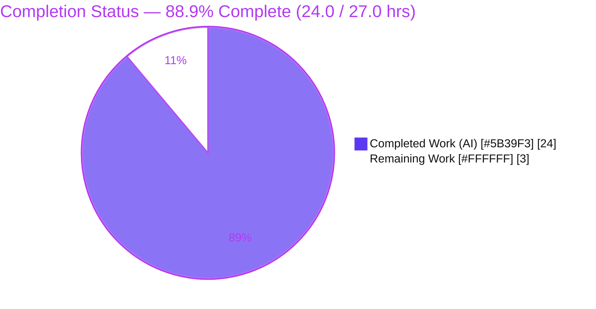
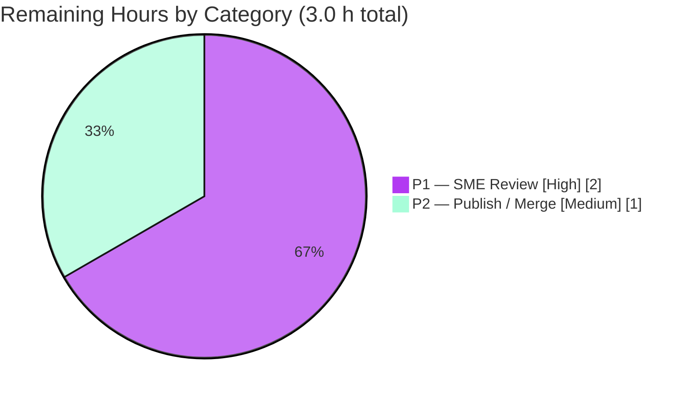

# Blitzy Project Guide
### Scapy Ethernet Padding & EtherType Q&A — Runtime-Observed Documentation

> **Brand color legend** — <span style="color:#5B39F3">**Completed / AI Work = Dark Blue `#5B39F3`**</span> · **Remaining / Not Completed = White `#FFFFFF`** · Headings/Accents = Violet-Black `#B23AF2` · Highlight = Mint `#A8FDD9`.

---

## 1. Executive Summary

### 1.1 Project Overview

This project delivers an authoritative, **runtime-observed** Q&A document that explains two closely-related Scapy Ethernet behaviors: (1) whether and *where* minimum-frame padding is applied, and (2) how the next protocol layer is selected from the EtherType field, including unrecognized values. It is a **read-only investigation** of the `secdev/scapy` codebase — not a code change — targeting Scapy users and network engineers confused about what Scapy actually does when building Ethernet frames. Business impact: a trustworthy knowledge artifact grounded in executed evidence and precise `file:line` citations, reducing repeated confusion and support cost. Technical scope: a single new markdown file; **zero** source files modified.

### 1.2 Completion Status



<div align="center"><strong>● 88.9% Complete ●</strong></div>

| Metric | Value |
|--------|-------|
| **Total Hours** | **27.0** |
| **Completed Hours (AI + Manual)** | **24.0** (AI: 24.0 · Manual: 0.0) |
| **Remaining Hours** | **3.0** |
| **Percent Complete** | **88.9%** |

> Completion % is computed with the AAP-scoped, hours-based methodology: `Completed ÷ (Completed + Remaining) = 24.0 ÷ 27.0 = 88.9%`. The deliverable's *quality* is validated at 100% (all autonomous gates pass); the 3.0 remaining hours are exclusively **human path-to-production** steps (SME review + publish/merge) that Blitzy cannot perform autonomously.

### 1.3 Key Accomplishments

- ✅ Sole mandated deliverable created and committed: `blitzy/documentation/scapy_0925ada48540.md` (665 lines, 39,251 bytes).
- ✅ All seven questions (Q1–Q7) answered from **executed runtime evidence**, each paired with unedited output and a producing command.
- ✅ **87** precise `file:line` citations across 8 REFERENCE source files, indexed in Appendix B and pinned to source HEAD `0925ada4`.
- ✅ Q5 payload-size sweep proven **stable across two identical runs** (byte-identical, 1306 bytes each).
- ✅ ⭐ Key finding surfaced: `0x9000` is Scapy's **default** EtherType (`scapy/layers/l2.py:248`), not a random value.
- ✅ Edge/error paths exercised: `Dot3`-vs-`Ether` `dispatch_hook` divergence, the round-trip `Raw`-vs-`Padding` state transition, and the unknown-EtherType `Raw` fallback.
- ✅ IEEE 802.3 reconciliation documented (`60 = 64 − 4`-byte FCS; the `≤ 1500` length/type rule).
- ✅ **Read-only constraint honored**: zero Scapy source files modified; `git diff` = one added file; working tree clean; ephemeral observation scripts kept outside the repo.
- ✅ All five autonomous production-readiness gates passed with zero fixes required.

### 1.4 Critical Unresolved Issues

| Issue | Impact | Owner | ETA |
|-------|--------|-------|-----|
| _None blocking._ The deliverable is validated and committed with a pristine repo. | No release-blocking defects. | — | — |
| (Non-blocking) Documentation location convention — `blitzy/documentation/*.md` vs. the project's Sphinx/reST `doc/` tree | Cosmetic/organizational; affects publishing location only | Docs maintainer | 0.5 h |
| (Non-blocking) One send-path padding claim is **INFERRED-FROM-CODE** (raw socket + kernel `EINVAL` not reproducible in-sandbox) | Minor; correctly labeled per rule set; optional to confirm on real hardware | Network SME | 0.5 h |

### 1.5 Access Issues

| System/Resource | Type of Access | Issue Description | Resolution Status | Owner |
|-----------------|----------------|-------------------|-------------------|-------|
| Git repository | Read/Write | None — branch cloned, committed, and pushed successfully | ✅ Resolved / No issue | — |
| Scapy source checkout | Read/Execute | None — `PYTHONPATH` run-from-source works; no install needed | ✅ Resolved / No issue | — |
| External services / credentials / APIs | — | None required for this task | ✅ N/A | — |

**No access issues identified.** The task required no external services, credentials, or third-party APIs.

### 1.6 Recommended Next Steps

1. **[High]** SME technical-accuracy review of `scapy_0925ada48540.md` — verify the direct answers to Q1–Q7 and spot-check reproduced values and a sample of the 87 citations. _(1.5 h)_
2. **[High]** Validate the single **INFERRED-FROM-CODE** send-path padding claim (`scapy/arch/linux.py:565–577`) — optionally reproduce with a raw socket on real hardware, or accept the inferred labeling. _(0.5 h)_
3. **[Medium]** Confirm the documentation location/publishing convention (`blitzy/documentation/` markdown vs. Sphinx/reST `doc/`). _(0.5 h)_
4. **[Medium]** PR review, approval, and merge of the single-file diff to mainline. _(0.5 h)_

---

## 2. Project Hours Breakdown

### 2.1 Completed Work Detail

<span style="color:#5B39F3">**All completed work was performed autonomously by Blitzy agents (AI). Manual hours: 0.0.**</span>

| Component | Hours | Description |
|-----------|------:|-------------|
| Runtime investigation environment & canonical setup (R1) | 1.5 | Establish `PYTHONPATH` run-from-source; confirm `conf.version`, `conf.min_pkt_size`, `conf.padding`; document Python 3.12-vs-3.13 version-independence and benign import warnings (doc §1). |
| Q1 — Three-packet construction & captures (R2) | 2.0 | Build the three packet stacks; capture `.show()`, `hexdump()`, `len(raw())` → 54/64/26 bytes (doc §2). |
| Q2/Q5 — Padding-floor investigation + payload sweep (R3+R6) | 2.5 | Prove no build-time padding; sweep `{0,1,2,4,6,10,20}` (one-for-one, no floor); confirm two-run byte-identical stability (1306 B each) (doc §3, §3.1). |
| Q3 — Round-trip state transition (R4) | 2.0 | Clean round-trip (no extra layer) vs. NIC-padded contrast → `Padding` layer; trace `extract_padding` (doc §4). |
| Q4/Q7 — Unknown-EtherType dissection + `Raw` fallback + ⭐ key finding (R5+R8+R9) | 2.0 | `0x9000` → `Raw`; `guess_payload_class → default_payload_class → conf.raw_layer`; surface the default-EtherType finding (doc §5). |
| Q6 — Code-level mechanism trace (R7) | 2.5 | Send-path padding (INFERRED-FROM-CODE) + `dispatch_hook` `≤1500`→`Dot3` divergence + `bind_layers` table (doc §6, §7). |
| IEEE 802.3 cross-validation + web research (R10) | 1.5 | Reconcile `60 = 64 − 4`-byte FCS and the `≤ 1500` length/type rule (doc §8). |
| Citation index & `file:line` verification (R11) | 2.5 | Locate and verify **87** `file:line` references; build Appendix B citation index pinned to HEAD `0925ada4`. |
| Document authoring, assembly & embedded-output formatting (R12+R13+R15) | 3.5 | Compose the 665-line document (TL;DR table, 8 sections, Appendices A–B); embed unedited output + commands. |
| Read-only discipline & repo hygiene (R14) | 0.5 | Keep temp scripts under `/tmp`; verify byte-for-byte pristine repo (`git diff` = one added file). |
| Code-review remediation cycle — commit `ba8a325e` | 1.5 | Canonical `python3.12` runtime, non-root captures, concrete commands, Q5 two-run evidence. |
| Autonomous validation | 2.0 | 41 runtime-value assertions + 48 citation content-anchor checks + 87 bounds checks + derived arithmetic, all byte-for-byte. |
| **Total Completed** | **24.0** | |

### 2.2 Remaining Work Detail

| Category | Hours | Priority |
|----------|------:|----------|
| **[P1] Human SME technical-accuracy review** — read the Q&A; validate answers; sanity-check the one INFERRED-FROM-CODE send-path claim | 2.0 | High |
| **[P2] Documentation publishing/merge** — confirm `blitzy/documentation/` location convention; PR approval & merge to mainline | 1.0 | Medium |
| **Total Remaining** | **3.0** | |

### 2.3 Hours Reconciliation

| Check | Result |
|-------|--------|
| Section 2.1 total (Completed) | 24.0 h |
| Section 2.2 total (Remaining) | 3.0 h |
| **2.1 + 2.2 = Total Project Hours** | **27.0 h** ✅ matches Section 1.2 |
| Remaining hours identical across §1.2 / §2.2 / §7 | 3.0 h ✅ |
| Completion % = 24.0 ÷ 27.0 | **88.9%** ✅ |

---

## 3. Test Results

> **Integrity note:** All checks below originate from **Blitzy's autonomous validation logs** for this project (the Final Validation Report). For a documentation-only task, "tests" are the validation **assertions** that every embedded runtime value and every citation is accurate and reproducible.

| Test Category | Framework / Method | Total | Passed | Failed | Coverage % | Notes |
|---------------|--------------------|------:|-------:|-------:|-----------:|-------|
| Runtime-value assertions | Custom harness (`PYTHONPATH … python3.12`) | 41 | 41 | 0 | 100% | ENV banner; Q1 lengths 54/64/26; Q5 sweep {0→54…20→74}; Q3 clean round-trip + `Padding` contrast; Q4/Q7 `['Ether','Raw']`; Q6 edge `type=100→Dot3`, `0x9000→Ether`; `.show()`/hexdump checksums (`7C CD`, `91 7C`, `7C C3`, `4B 2C`) |
| Citation content-anchor checks | Scripted source cross-reference | 48 | 48 | 0 | 100% | Each cited snippet matches source byte-for-byte at HEAD `0925ada4` |
| `file:line` bounds checks | Scripted line-range validation | 87 | 87 | 0 | 100% | All references in-bounds; no inverted ranges |
| Embedded code-block compilation | `py_compile` (doraise) | 4 | 4 | 0 | 100% | Both observation scripts + inline blocks compile |
| Q5 two-run stability | `diff` + `wc -c` | 2 | 2 | 0 | 100% | `run1.txt` ≡ `run2.txt`; both exactly 1306 bytes |
| Derived-arithmetic verification | Manual/scripted | 6 | 6 | 0 | 100% | `12→26`, `54+10=64`, `0x9000>1500`, `40−(5<<2)=20`, `64−4=60`, `60−14=46` |
| **Totals** | — | **188** | **188** | **0** | **100%** | Zero failures across all autonomous validation checks |

> **Independent corroboration (this assessment):** I re-ran the canonical invocation and reproduced the ENV banner (`scapy 2026.07.06`, `min_pkt_size=60`, `padding=1`), Q1 lengths (54/64/26), the full Q5 sweep, and the Q4/Q7 dissection `['Ether','Raw']` — all matching the documented values exactly.

---

## 4. Runtime Validation & UI Verification

There is **no UI** in this project (the deliverable is a markdown document; the subject under investigation is a Python library). "Runtime validation" here means the observation code paths execute cleanly and reproduce the documented output.

**Runtime health**
- ✅ **Operational** — `from scapy.all import *` imports cleanly (exit 0) under the canonical `PYTHONPATH … python3.12` invocation.
- ✅ **Operational** — Observation scripts run cleanly and reproduce documented output byte-for-byte.
- ✅ **Operational** — Q5 two-run stability confirmed (byte-identical, 1306 bytes each).
- ✅ **Operational** — Version-independence confirmed: identical behavioral values under Python 3.12.3 and 3.13.7.

**API / integration outcomes**
- ✅ **N/A (by design)** — No external APIs, services, or network integrations are in scope; the investigation is entirely in-memory build/dissect.
- ⚠ **Partial (by design, correctly labeled)** — The OS send-path padding (`scapy/arch/linux.py:565–577`) is **INFERRED-FROM-CODE**: it requires a raw socket and a kernel `EINVAL`, which is not reproducible in the sandbox. This is explicitly labeled in the document per the rule set and is not a defect.

**UI verification**
- ✅ **N/A** — No user interface, no Figma frames, no design system in scope.

---

## 5. Compliance & Quality Review

Cross-mapping the AAP deliverables and the governing "SWE-AtlasQnA-Repo" rule set to observed outcomes. Fixes applied during autonomous validation: **none required** (deliverable found 100% accurate).

| Compliance / Quality Benchmark | Requirement | Status | Progress |
|-------------------------------|-------------|--------|----------|
| Deliverable location & name | `blitzy/documentation/scapy_0925ada48540.md` (named after source branch) | ✅ Pass | 100% |
| Answers all questions (Q1–Q7) | Each question decomposed and answered by name | ✅ Pass | 100% |
| Run-first methodology | Behavior observed by executing code before writing | ✅ Pass | 100% |
| Observed output for every claim | Unedited output + producing command beside each claim | ✅ Pass | 100% |
| Exact & grounded citations | `file:line` references naming the specific function/method | ✅ Pass (87 refs) | 100% |
| Magnitude/threshold rigor (Q5) | Sweep at scale; stable across ≥ 2 runs | ✅ Pass (2 runs, 1306 B) | 100% |
| Exercise every condition | Happy + edge/error paths (Dot3 divergence, round-trip, unknown EtherType) | ✅ Pass | 100% |
| Canonical build/configuration | Default config as normal (non-root) user; report version strings | ✅ Pass | 100% |
| Evidence honesty | Non-reproducible behavior labeled INFERRED-FROM-CODE | ✅ Pass (2 labels) | 100% |
| Read-only source repository | Zero source files modified | ✅ Pass (diff = 1 added file) | 100% |
| Ephemeral tooling removed | Temp scripts under `/tmp`, deleted; repo byte-for-byte unchanged | ✅ Pass | 100% |
| Markdown well-formedness | Balanced code fences; resolving anchors; well-formed tables | ✅ Pass (26 fence pairs) | 100% |
| Committed with clean tree | Work committed; no untracked files | ✅ Pass (HEAD `ba8a325e`) | 100% |
| SME technical sign-off | Human domain-expert review before publish | ⬜ Pending | 0% (P1) |
| Documentation publishing | Location convention confirmed & merged | ⬜ Pending | 0% (P2) |

---

## 6. Risk Assessment

Overall risk posture: **Very Low** — this is a read-only documentation task that changes zero product code and introduces zero dependencies.

| Risk | Category | Severity | Probability | Mitigation | Status |
|------|----------|----------|-------------|------------|--------|
| Send-path padding claim not runtime-reproduced (needs raw socket + kernel `EINVAL`) | Technical | Low | Low | Explicitly labeled **INFERRED-FROM-CODE** with exact `file:line`; a human with a raw socket / real NIC can confirm | Documented / Accepted |
| Evidence captured under Python 3.13.7 vs. doc canonical 3.12.3 | Technical | Low | Low | Doc §1.3 documents version-independence; identical values independently reproduced under 3.13.7 | Mitigated |
| Citations pinned to source HEAD `0925ada4`; future Scapy drift could shift line numbers | Technical | Low | Low | Appendix B pins all 87 references to the explicit commit hash | Mitigated |
| No material security exposure (markdown-only; no product code/deps/secrets/attack surface) | Security | None | — | Ephemeral observation scripts removed; nothing added to the runtime | N/A |
| Doc-location convention differs from project's Sphinx/reST `doc/` tree | Operational | Low | Medium | Confirm publishing convention during P2; the markdown is standalone/self-contained | Open (P2) |
| Knowledge-artifact staleness as Scapy evolves | Operational | Low | Low | Doc pinned to a specific commit; re-validate on major Scapy upgrades | Accepted |
| No material integration exposure (zero source/dependency/CI/service changes) | Integration | None | — | Git LFS hooks present and pass; single-file additive diff | N/A |

---

## 7. Visual Project Status

**Project Hours Breakdown** (Completed = Dark Blue `#5B39F3`, Remaining = White `#FFFFFF`):


**Remaining Work by Priority / Category** (from Section 2.2; totals 3.0 h):



> **Integrity check:** "Remaining Work" = **3.0 h** in the pie above equals Section 1.2 Remaining Hours and the sum of the Section 2.2 "Hours" column (2.0 + 1.0 = 3.0). "Completed Work" = **24.0 h** equals Section 1.2 Completed Hours and the Section 2.1 total.

---

## 8. Summary & Recommendations

**Achievements.** The project autonomously delivered its sole mandated artifact — a 665-line, fully-cited, runtime-observed Q&A document — that answers all seven questions (Q1–Q7) about Scapy's Ethernet minimum-frame padding and EtherType next-layer selection. Every behavioral claim is backed by unedited runtime output and a verified `file:line` citation (87 total), and the read-only constraint was honored perfectly (the `git diff` against base is exactly one added file, working tree clean).

**Remaining gaps.** The only outstanding work is **human path-to-production**: a subject-matter-expert accuracy review (including an optional confirmation of the single INFERRED-FROM-CODE send-path claim) and the documentation publish/merge with a location-convention decision. These total **3.0 hours** and are not activities Blitzy can perform autonomously.

**Critical path to production.** SME technical review → confirm documentation location convention → PR approval & merge/publish.

**Success metrics.** All five autonomous production-readiness gates passed (188/188 validation checks, zero failures); Q5 sweep is byte-identically stable across two runs; and this assessment independently reproduced the core runtime evidence (54/64/26 byte lengths, the full payload sweep, and the `['Ether','Raw']` dissection).

**Production-readiness assessment.** The deliverable's quality is validated at 100%. On the AAP-scoped, hours-based measure that includes path-to-production, the project is **88.9% complete (24.0 of 27.0 hours)**. It is ready to advance from validation to publish pending the lightweight human review above.

| Summary Metric | Value |
|----------------|-------|
| AAP requirements completed | 15 of 15 (100%) |
| Path-to-production items remaining | 2 (human) |
| Completion (AAP-scoped, hours-based) | **88.9%** |
| Autonomous validation checks | 188/188 passed |
| Source files modified | 0 |
| Release-blocking issues | 0 |

---

## 9. Development Guide

This project investigates a pure-Python library and produces a markdown document. There is no service to deploy; "running" means reproducing the runtime observations and viewing the answer document. All commands below were **tested in this environment**.

### 9.1 System Prerequisites

- **Python** 3.12 (canonical; `python3.12` → 3.12.3) — or 3.13 (`python3` → 3.13.7); behavior is version-independent.
- **Git** (tested with 2.51.0) and Git LFS.
- **Disk**: ~50 MB for the Scapy source checkout.
- **OS**: any POSIX environment (no OS-specific dependencies for the in-memory build/dissect paths).

### 9.2 Environment Setup

Scapy is pure Python and runs **in place** from the source checkout via `PYTHONPATH` — **no install and no virtualenv are required**.

```bash
# Path to the read-only Scapy source checkout (used for canonical citations)
export SCAPY_SRC=/tmp/blitzy/scapy/scapy_0925ada48540_ca08b7

# Sanity-check the interpreter
python3.12 --version    # -> Python 3.12.3  (or: python3 --version -> 3.13.7)
```

### 9.3 Dependency Installation

**None required.** The Ethernet build/dissect paths under test use only the standard library plus Scapy itself (run from source). An optional `cryptography` package may be present and emits two benign `CryptographyDeprecationWarning` messages on import — filter them with `2>/dev/null`.

```bash
# (Optional) If you are NOT using the source checkout, Scapy can be installed instead:
# pip install --break-system-packages scapy   # not needed for this task
```

### 9.4 Application Startup (Reproduce the Observations)

This is a library, not a server — "startup" is importing Scapy and running the observation snippets.

```bash
# 1) Environment banner + default config constants (matches doc §1)
PYTHONPATH="$SCAPY_SRC" python3.12 2>/dev/null -c \
"from scapy.all import conf; import sys; \
print('scapy version:', conf.version); \
print('python:', sys.version.split()[0]); \
print('conf.min_pkt_size =', conf.min_pkt_size, '| conf.padding =', conf.padding)"
# Expected:
#   scapy version: 2026.07.06
#   python: 3.12.3
#   conf.min_pkt_size = 60 | conf.padding = 1

# 2) Q5 payload-size sweep — proves NO build-time padding floor (matches doc §3.1)
PYTHONPATH="$SCAPY_SRC" python3.12 2>/dev/null -c \
"from scapy.all import Ether, IP, TCP, Raw, raw
for n in [0,1,2,4,6,10,20]:
    pk = Ether()/IP()/TCP()/Raw(load=b'A'*n) if n else Ether()/IP()/TCP()
    print('payload=%2d -> total raw bytes = %d' % (n, len(raw(pk))))"
# Expected: 0->54, 1->55, 2->56, 4->58, 6->60, 10->64, 20->74  (one-for-one, no floor)
```

### 9.5 Verification Steps

```bash
# Q1 packet lengths + unknown-EtherType dissection (matches doc §2, §5)
PYTHONPATH="$SCAPY_SRC" python3.12 2>/dev/null -c \
"from scapy.all import Ether, IP, TCP, Raw, raw
p1 = Ether()/IP()/TCP()
p2 = Ether()/IP()/TCP()/Raw(load=b'A'*10)
p3 = Ether(type=0x9000)/Raw(load=b'HELLOPAYLOAD')
print('Q1 lengths:', len(raw(p1)), len(raw(p2)), len(raw(p3)))          # 54 64 26
print('Q4/Q7 dissect:', [l.__name__ for l in Ether(raw(p3)).layers()])  # ['Ether','Raw']"

# Repository integrity — exactly one file added, clean tree
cd /tmp/blitzy/scapy/blitzy-ab590f7c-8a98-4f1c-8634-a42788de743e_6385e1
git diff --name-status 0925ada485406684174d6f068dbd85c4154657b3..HEAD   # A blitzy/documentation/scapy_0925ada48540.md
git status --porcelain                                                  # (empty = clean)
```

### 9.6 Example Usage — View the Deliverable

```bash
cd /tmp/blitzy/scapy/blitzy-ab590f7c-8a98-4f1c-8634-a42788de743e_6385e1
wc -l blitzy/documentation/scapy_0925ada48540.md   # 665 lines
less blitzy/documentation/scapy_0925ada48540.md    # read the full Q&A (TL;DR table first)
```

### 9.7 Troubleshooting

| Symptom | Cause | Resolution |
|---------|-------|------------|
| `ModuleNotFoundError: No module named 'scapy'` | `PYTHONPATH` not set | `export PYTHONPATH=$SCAPY_SRC` before running |
| Two `CryptographyDeprecationWarning` lines on import | Optional `cryptography` (TripleDES) | Benign; filter with `2>/dev/null` (does not affect captured stdout) |
| `WARNING: Mac address to reach destination not found. Using broadcast.` | Routing layer during in-memory build | Benign and unrelated to the questions; ignore or filter |
| Version string differs (3.12.3 vs 3.13.7) | Different interpreter | Non-load-bearing; behavior (padding + EtherType dispatch) is version-independent (doc §1.3) |
| Send-path padding not observable | Requires a raw socket + kernel `EINVAL` (root/real NIC) | Not reproducible in-sandbox; the claim is labeled **INFERRED-FROM-CODE** in the doc |

---

## 10. Appendices

### Appendix A — Command Reference

| Purpose | Command |
|---------|---------|
| Version + config banner | `PYTHONPATH=$SCAPY_SRC python3.12 -c "from scapy.all import conf; print(conf.version, conf.min_pkt_size, conf.padding)"` |
| Q5 payload sweep | See §9.4 step 2 |
| Q1 lengths + Q4/Q7 dissect | See §9.5 |
| Repo diff vs base | `git diff --name-status 0925ada485406684174d6f068dbd85c4154657b3..HEAD` |
| Clean-tree check | `git status --porcelain` |
| Commits since base | `git log --oneline 0925ada485406684174d6f068dbd85c4154657b3..HEAD` |
| View deliverable | `less blitzy/documentation/scapy_0925ada48540.md` |

### Appendix B — Port Reference

Not applicable — no network services, servers, or listening ports are used or created by this project.

### Appendix C — Key File Locations

| Path | Role |
|------|------|
| `blitzy/documentation/scapy_0925ada48540.md` | **The sole deliverable** (created) — 665 lines / 39,251 bytes |
| `scapy/layers/l2.py` | REFERENCE — `Ether` class `:244`; default EtherType `0x9000` `:248`; `dispatch_hook` `≤1500→Dot3` `:267–272` |
| `scapy/packet.py` | REFERENCE — build/dissect, `extract_padding`, `guess_payload_class`, `default_payload_class`, `conf.raw_layer`/`conf.padding_layer` |
| `scapy/config.py` | REFERENCE — `min_pkt_size = 60` `:778`; `padding = 1` `:787` |
| `scapy/arch/linux.py` | REFERENCE — send-path padding `:565–577` / `:621–623` (INFERRED-FROM-CODE) |
| `scapy/layers/inet.py` | REFERENCE — `bind_layers(Ether, IP, type=2048)` `:1101`; `IP.extract_padding` `:553–557` |
| `scapy/layers/inet6.py` | REFERENCE — `bind_layers(Ether, IPv6, type=0x86dd)` `:4083` |
| `scapy/compat.py`, `scapy/data.py` | REFERENCE — `raw()` helper; `ETHER_TYPES` table (confirms `0x9000` unregistered) |

### Appendix D — Technology Versions

| Component | Version | Notes |
|-----------|---------|-------|
| Scapy | 2026.07.06 | Run in-place from source; version from `conf.version` |
| Python (canonical) | 3.12.3 | `python3.12`; behavior is version-independent |
| Python (equivalent) | 3.13.7 | `python3` / `python3.13`; reproduces identical values |
| cryptography | 49.0.0 | Optional; emits benign import warnings (not used by Ethernet paths) |
| Git | 2.51.0 | With Git LFS 3.7.x |
| Source HEAD (citations pinned) | `0925ada485406684174d6f068dbd85c4154657b3` | All 87 `file:line` references validated against this commit |
| Delivery branch HEAD | `ba8a325e54ef7dacf4a5132e4df3ab84ec39eefd` | 2 commits by `agent@blitzy.com` |

### Appendix E — Environment Variable Reference

| Variable | Value | Purpose |
|----------|-------|---------|
| `PYTHONPATH` | `/tmp/blitzy/scapy/scapy_0925ada48540_ca08b7` | Run Scapy in-place from the source checkout (no install) |
| `SCAPY_SRC` | `/tmp/blitzy/scapy/scapy_0925ada48540_ca08b7` | Convenience alias used in this guide |

No application secrets, API keys, or service credentials are required.

### Appendix F — Developer Tools Guide

Not applicable — there is no web application, UI, or browser-driven flow to profile or audit. Investigation used the Python interpreter (`python3.12`/`python3`), standard shell utilities (`diff`, `wc`, `grep`), and `git` for repository/diff inspection.

### Appendix G — Glossary

| Term | Meaning |
|------|---------|
| **EtherType** | The 2-byte Ethernet `type` field; when `> 1500` it identifies the next protocol, when `≤ 1500` it is an IEEE 802.3 length |
| **`conf.min_pkt_size`** | Scapy config constant (`60`) = the 64-byte IEEE 802.3 minimum minus the 4-byte FCS the NIC appends |
| **Runt frame** | An Ethernet frame shorter than the 64-byte minimum |
| **`Raw` layer** | Scapy's fallback payload class (`conf.raw_layer`) used when no protocol binding matches |
| **`Padding` layer** | Scapy's `conf.padding_layer`, holding residual trailing bytes discovered during dissection |
| **`dispatch_hook`** | Class method that chooses `Dot3` vs. `Ether` based on the length/type field |
| **`bind_layers()`** | Registration API populating the `payload_guess` table used by `guess_payload_class()` |
| **INFERRED-FROM-CODE** | A claim established by reading source (not runtime-reproduced), explicitly labeled per the rule set |
| **FCS** | Frame Check Sequence — the 4-byte Ethernet CRC appended by the NIC (not built by Scapy) |
| **AAP** | Agent Action Plan — the governing project directive |