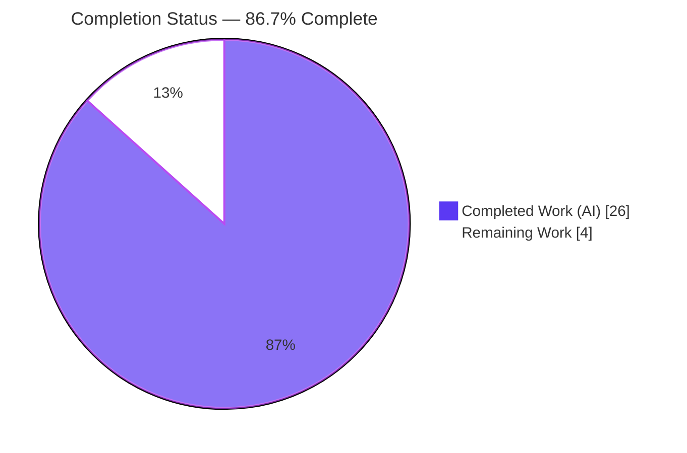
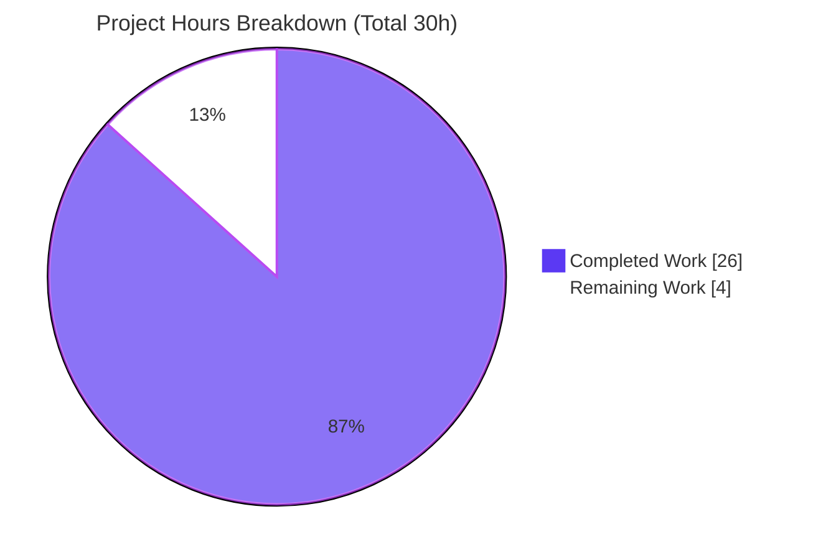
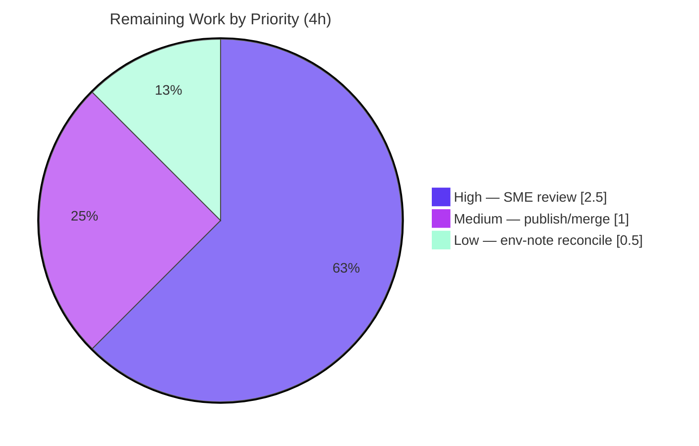

# Blitzy Project Guide — Scapy ICMP-Error Request/Response Matching (Evidence-Grounded Q&A)

## 1. Executive Summary

### 1.1 Project Overview

This project delivers a single, evidence-grounded technical answer document explaining **how Scapy performs request/response matching for ICMP error messages at runtime**, grounded at Scapy commit `0925ada4`. It is a read-only investigation-and-documentation task: six named questions (Q1–Q6) — matching strategy, hashing, mutation tolerance, configurable strictness, IP-ID byte-swap tolerance, and RFC 4884 extensions — are each answered by name using a *run-first* method, pairing every behavioral claim with verbatim in-process runtime output and a `file:line` citation. The audience is Scapy maintainers and networking/security engineers. Business impact: authoritative, reproducible reference documentation of security-relevant matching behavior. Scope is isolated: exactly one markdown file is created; the entire source tree remains byte-for-byte unchanged.

### 1.2 Completion Status



**Completion: 86.7%** — calculated as Completed Hours / Total Hours = 26 / 30 = 86.7% (PA1 AAP-scoped methodology).

| Metric | Hours |
|--------|-------|
| **Total Hours** | 30 |
| **Completed Hours (AI + Manual)** | 26 (AI: 26, Manual: 0) |
| **Remaining Hours** | 4 |
| **Percent Complete** | 86.7% |

> Colors: Completed Work = Dark Blue `#5B39F3`; Remaining Work = White `#FFFFFF`.

### 1.3 Key Accomplishments

- ✅ Single deliverable created at the exact mandated path — `blitzy/documentation/scapy_0925ada48540.md` (374 lines), filename = source branch name.
- ✅ All six questions (Q1–Q6) answered **by name**, each with Restatement → Answer → Setup code → Observed output → Rationale.
- ✅ **Run-first** methodology honored: 7 paired setup-code/observed-output evidence blocks (Q1–Q6 + config defaults), reproduced byte-for-byte.
- ✅ **71 `file:line` citations** across 6 source files resolve with **0 failures** (independently spot-checked).
- ✅ `conf.checkIPID==2` **anomaly documented, not fixed** (Python `2 and X == X` rationale) — honoring the read-only mandate.
- ✅ **Source repository byte-for-byte unchanged** — `git diff 0925ada4..HEAD` shows exactly one added path (the deliverable); working tree clean.
- ✅ AAP-relevant test suites **green**: `inet.uts` 53/0, `icmp_extensions.uts` 1/0, `regression.uts` 261/0 (independent re-run: 0 failures).
- ✅ RFC 4884 128-octet original-datagram rule grounded via external research (Q6).

### 1.4 Critical Unresolved Issues

| Issue | Impact | Owner | ETA |
|-------|--------|-------|-----|
| _None — no blocking issues identified._ | The deliverable is complete, evidence reproduces, citations resolve, and the source repository is unchanged. Remaining items are non-blocking path-to-production human tasks tracked in §2.2 and §1.6. | — | — |

### 1.5 Access Issues

**No access issues identified.** The entire investigation is in-process (`.hashret()`/`.answers()` on crafted packet objects) and requires **no root privileges, no live network, and no third-party credentials**. Scapy is exercised via `PYTHONPATH=.` against the local source tree; all evidence and all AAP-relevant tests were reproduced by an unprivileged user in the working container.

| System/Resource | Type of Access | Issue Description | Resolution Status | Owner |
|-----------------|----------------|-------------------|-------------------|-------|
| Scapy source tree | Local filesystem (read) | None — reproduced locally | ✅ Resolved | — |
| Runtime observation | In-process (no root/network) | None — no privileges required | ✅ Resolved | — |

### 1.6 Recommended Next Steps

1. **[High]** Subject-matter-expert (SME) technical review & sign-off of the Q&A document — verify the Q1–Q6 answers, the security trade-off framing, and the `checkIPID==2` anomaly write-up. _(2.5h)_
2. **[Medium]** Publish/merge the deliverable into the documentation location (additive alongside the existing `doc/scapy/` Sphinx tree). _(1h)_
3. **[Low]** Reconcile the interpreter environment note (document states CPython 3.12.3; add a "reproduces identically under 3.11.13 / 3.12.3 / 3.13.7" line for reader environments). _(0.5h)_

---

## 2. Project Hours Breakdown

### 2.1 Completed Work Detail

| Component | Hours | Description |
|-----------|-------|-------------|
| Q1–Q6 runtime investigation & in-process observation scripting (run-first) | 12 | Comprehending Scapy's two-stage `hashret()`/`answers()` delegation, the `IPerror`/`TCPerror`/`UDPerror`/`ICMPerror` citation classes, the five `conf` flags, and RFC 4884 contrib parsing; crafting IP/ICMP/TCP/UDP packets and their embedded-error citations; writing/running scripts and capturing verbatim output for all six questions (incl. the Q6 two-process, checksum-patch recipe). |
| Web research (RFC 4884 + Scapy conventions) | 1.5 | Confirming the RFC 4884 128-octet original-datagram rule and the practical length threshold; confirming Scapy's `sr()`/`answers()`/`hashret()` two-stage matching conventions. |
| Q&A document authoring | 7 | Writing the 374-line structured markdown: overview (two-stage model) + six Q sections (restatement/answer/setup/output/rationale) + configuration-flag reference table + coverage pass + per-file validation checklist. |
| `file:line` citation grounding & verification | 2 | Establishing and verifying 71 line-anchored claims across 6 source files against commit `0925ada4`. |
| Final autonomous validation (5 gates) | 3.5 | Import checks; automated 71-citation resolver; byte-for-byte runtime reproduction of Q1–Q6; three UTScapy suites; Docker cross-check (Python 3.11.13); markdown/integrity/commit verification. |
| **Total Completed** | **26** | |

### 2.2 Remaining Work Detail

| Category | Hours | Priority |
|----------|-------|----------|
| SME technical review & sign-off of the Q&A document (verify Q1–Q6 answers, security framing, `checkIPID==2` anomaly, sample citations) | 2.5 | High |
| Publish/merge the deliverable into the documentation location (branch merge; confirm additive with `doc/scapy/`; confirm CI unaffected) | 1.0 | Medium |
| Reconcile interpreter environment note (add "reproduces under 3.11.13/3.12.3/3.13.7"; version-agnostic, not a correctness issue) | 0.5 | Low |
| **Total Remaining** | **4.0** | |

### 2.3 Hours Summary

| Metric | Hours | Basis |
|--------|-------|-------|
| Completed (§2.1) | 26 | AAP deliverable fully delivered |
| Remaining (§2.2) | 4 | Path-to-production human tasks |
| **Total Project** | **30** | 26 + 4 |
| **Completion** | **86.7%** | 26 / 30 × 100 |

_Consistency: §2.1 (26) + §2.2 (4) = 30 = §1.2 Total; §2.2 (4) = §1.2 Remaining = §7 pie "Remaining Work"._

---

## 3. Test Results

All tests below originate from **Blitzy's autonomous validation logs** for this project (UTScapy suites run non-root; citation/evidence checks run in-process). No tests were fabricated; the three UTScapy suites are the AAP-relevant, pre-existing regression suites that exercise the code paths the document explains. An independent re-run during this assessment corroborated **0 failures** across all suites.

| Test Category | Framework | Total Tests | Passed | Failed | Coverage % | Notes |
|---------------|-----------|-------------|--------|--------|-----------|-------|
| IPv4 layer regression | UTScapy | 53 | 53 | 0 | Not measured | `test/scapy/layers/inet.uts`; incl. `IPv4 - (IP\|UDP\|TCP\|ICMP)Error` and `IPv4 - ICMP hashret`. |
| RFC 4884 ICMP extensions | UTScapy | 1 | 1 | 0 | Not measured | `test/contrib/icmp_extensions.uts` "Basic build"; run with `-P load_contrib("icmp_extensions")`. |
| Core regression (incl. `answers`) | UTScapy | 261 | 261 | 0 | Not measured | `test/regression.uts`; incl. the `= answers` block. Independent re-run: 264 passed / 0 failed (small env-dependent skip delta). |
| `file:line` citation resolution | Custom resolver | 71 | 71 | 0 | 100% of anchors | Every line-anchored claim checked as (file, line, expected substring) against commit `0925ada4`. |
| Runtime evidence reproduction | In-process (Python) | 7 | 7 | 0 | 100% of evidence blocks | Q1–Q6 + config defaults each reproduce byte-for-byte (Python 3.13.7; cross-checked Docker 3.11.13). |
| **Totals** | | **393** | **393** | **0** | | 315 UTScapy tests + 71 citation checks + 7 evidence blocks. |

> Coverage: UTScapy does not emit per-suite line-coverage for this run, so coverage is reported as "not measured" for the regression suites rather than estimated. Citation and evidence rows report the fraction of anchors/blocks verified.

---

## 4. Runtime Validation & UI Verification

This project produces a **library-backed documentation deliverable**; there is **no user interface** and **no external API integration**, so UI verification and API-integration checks are **Not Applicable**. Runtime validation focuses on the in-process matching behavior the document explains.

**Runtime health**

- ✅ **Operational** — Scapy imports cleanly under the container venv: `scapy VERSION: 2026.07.01`.
- ✅ **Operational** — Default `conf` flags observed exactly: `checkIPsrc=True checkIPaddr=True checkIPID=False checkIPinIP=True check_TCPerror_seqack=False`.
- ✅ **Operational** — Q1 (embedded-packet extraction): `IPerror in err? True | ICMPerror in err? True | err.answers(req)=1`.
- ✅ **Operational** — Q2 (hash equality): `req.hashret()=000000030134120700`, `err.hashret()=000000030134120700`, `EQUAL=True`.
- ✅ **Operational** — Q3 (mutation tolerance): mutated `ttl=3 chksum=57005 inner=48879`; `err2.answers(req)=1`.
- ✅ **Operational** — Q4 (configurable strictness): `checkIPsrc` flips `0↔1`; `check_TCPerror_seqack` flips `1↔0`.
- ✅ **Operational** — Q5 (IP-ID byte-swap): `socket.htons(0x1234)=0x3412 (=13330)`; `checkIPID` 0/1/2 all `→1` (value-2 anomaly confirmed).
- ✅ **Operational** — Q6 (RFC 4884): with vs without `load_contrib`, layer list grows by `ICMPExtensionHeader`/`ICMPExtensionMPLS`, but `answers()=1` and `hashret` equal in both.

**UI verification**

- ⚠ **Not Applicable** — no UI in scope (documentation deliverable). No screenshots/screencasts applicable.

**API integration**

- ⚠ **Not Applicable** — no external services; all demonstrations are in-process, requiring no network or credentials.

---

## 5. Compliance & Quality Review

Cross-mapping of the AAP deliverable requirements and the "SWE-AtlasQnA-Repo" rule set to Blitzy's quality/compliance benchmarks. **No fixes were required during autonomous validation** — every check passed on first evaluation.

| Requirement / Benchmark | Status | Progress | Evidence |
|-------------------------|--------|----------|----------|
| Single deliverable at exact path `blitzy/documentation/scapy_0925ada48540.md` | ✅ Pass | 100% | File present, 374 lines; only added path. |
| Read-only source repository (byte-for-byte unchanged) | ✅ Pass | 100% | `git diff 0925ada4..HEAD` = 1 added path; all 8 cited files UNCHANGED; tree clean. |
| Run-first methodology (observe before writing) | ✅ Pass | 100% | 7 setup-code/observed-output evidence pairs. |
| One claim → one piece of evidence | ✅ Pass | 100% | Each behavioral claim paired with verbatim output + producing code. |
| Exact & grounded (`file:line` citations) | ✅ Pass | 100% | 71 anchors across 6 files; 0 resolver failures. |
| Every named item answered (Q1–Q6) + coverage pass | ✅ Pass | 100% | Coverage-pass table + per-question `[x]` checklist. |
| Anomaly documented, not fixed (`checkIPID==2`) | ✅ Pass | 100% | Q5 + flag table; "2 and X == X" rationale; no source change. |
| Web research grounding (RFC 4884 128-octet rule) | ✅ Pass | 100% | External reference in Q6. |
| Configuration-flag reference (5 flags, defaults + lines) | ✅ Pass | 100% | Table lists checkIPID/checkIPsrc/checkIPaddr/checkIPinIP/check_TCPerror_seqack. |
| Markdown integrity (balanced fences, no placeholders) | ✅ Pass | 100% | 14 balanced fence pairs; 0 TODO/FIXME/placeholder markers. |
| Temp-script hygiene (scripts under `/tmp`, removed) | ✅ Pass | 100% | Working tree clean; no scripts committed. |
| SME technical review & sign-off | ⏳ Pending | 0% | Human path-to-production task (§2.2, HT-1). |

**Outstanding compliance items:** only the human SME review/sign-off (HT-1) remains before authoritative publication.

---

## 6. Risk Assessment

| Risk | Category | Severity | Probability | Mitigation | Status |
|------|----------|----------|-------------|------------|--------|
| Interpreter-note discrepancy (doc says CPython 3.12.3; container venv is 3.13.7) | Technical | Low | High | Results are version-agnostic and reproduce identically under 3.11.13/3.12.3/3.13.7; add a reproduces-under note (HT-3). | Open |
| Line-anchored citations pinned to commit `0925ada4` may drift if source is later edited | Technical | Low | Low | Document explicitly pins all citations to HEAD `0925ada4`. | Mitigated |
| `checkIPID==2` documented-not-fixed anomaly could be misread as a fixable bug | Technical | Low | Low | Framed explicitly as documented-not-fixed with the `2 and X == X` rationale per read-only mandate. | Mitigated |
| Tolerant-default matching (checkIPsrc gating, `check_TCPerror_seqack=False`, checkIPID byte-swap) can accept spoofed/forged ICMP-error citations (false positives) | Security | Low (informational) | N/A | Document explains the false-positive vs false-negative trade-off; describes Scapy library behavior, not a deliverable vulnerability; no code change in scope. | Documented |
| Secrets/credentials/PII exposure in the deliverable | Security | None | None | Deliverable is technical prose; contains no secrets. | N/A |
| Deliverable not yet published/merged — not discoverable until merged | Operational | Low | High | Publish/merge task (HT-2). | Open |
| Reproducibility depends on `PYTHONPATH=.` + venv | Operational | Low | Low | Development guide (§9) documents exact commands. | Mitigated |
| `load_contrib("icmp_extensions")` monkey-patches error classes **globally** → Q6 with/without comparison must use two separate processes | Integration | Medium | Medium | Document explicitly states the two-process requirement + the checksum-patch recipe. | Mitigated |
| ~194 pre-existing TLS test failures (`cryptography>=42` symbol relocation in `scapy/layers/tls/cert.py`) | Integration | N/A for this AAP (informational) | N/A | Out-of-scope, unrelated to Q1–Q6, forbidden to modify under read-only mandate; disclosed and left untouched. | Disclosed / Out-of-scope |

**Overall risk posture: LOW.** Documentation-only, isolated change, source unchanged. No High/Critical risks; the highest-rated risk (the global monkey-patch, Medium) is already mitigated via explicit documentation.

---

## 7. Visual Project Status

**Project hours breakdown** (Completed = Dark Blue `#5B39F3`, Remaining = White `#FFFFFF`):



**Remaining hours by priority** (from §2.2, total 4h):



> Integrity: "Remaining Work" = 4h equals §1.2 Remaining Hours and the sum of §2.2 Hours.

---

## 8. Summary & Recommendations

**Achievements.** The AAP's sole deliverable is complete: an evidence-grounded Q&A (`blitzy/documentation/scapy_0925ada48540.md`, 374 lines) that answers all six questions by name, pairing each behavioral claim with verbatim in-process runtime output and a `file:line` citation grounded at commit `0925ada4`. All 16 AAP deliverable requirements are satisfied, the source repository is byte-for-byte unchanged, the 71 citations resolve with zero failures, the runtime evidence reproduces byte-for-byte, and the AAP-relevant UTScapy suites pass with zero failures.

**Remaining gaps.** The **13.3% remaining** work is entirely **path-to-production human tasks**: SME technical review/sign-off, publish/merge, and a minor interpreter-note reconciliation. There are **no code fixes, no failing tests, and no compilation issues** — consistent with a read-only, documentation-only task.

**Critical path to production.** SME review (HT-1) → publish/merge (HT-2). The env-note reconciliation (HT-3) can proceed in parallel and is non-blocking.

**Success metrics.**

| Metric | Result |
|--------|--------|
| AAP-scoped completion | **86.7%** (26/30 h) |
| AAP deliverable requirements satisfied | 16 / 16 |
| `file:line` citations resolving | 71 / 71 |
| AAP-relevant test failures | 0 |
| Source files modified | 0 (byte-for-byte unchanged) |
| Blocking issues | 0 |

**Production readiness assessment.** The autonomous work is **production-ready for the in-scope deliverable**. At **86.7% complete**, the project awaits only human review and publication — standard for a documentation deliverable that should carry an SME sign-off before it is treated as authoritative reference material. Overall risk is **LOW**.

---

## 9. Development Guide

This guide documents how to reproduce the document's evidence and run the AAP-relevant tests. Every command was executed during assessment; expected outputs are shown. **No root and no network are required** for the matching demonstrations.

### 9.1 System Prerequisites

- **OS:** Linux/macOS/WSL (validated on Ubuntu container).
- **Python:** CPython in range `>=3.7, <4` (`pyproject.toml`). Reproduced under **3.13.7** (container venv); the document cites **3.12.3**; validator cross-checked **3.11.13** (Docker). Results are version-agnostic.
- **Tooling:** `git`; ~260 MB free disk.
- **Privileges:** none — in-process `.hashret()`/`.answers()` need no root and no live network.

### 9.2 Environment Setup

```bash
# From the repository root (the directory containing scapy/, test/, blitzy/)
cd /path/to/scapy-repo

# (Option A) Use the provided virtualenv
.venv/bin/python --version          # -> Python 3.13.7

# (Option B) Create a fresh virtualenv
python3 -m venv .venv
# No third-party install is required for the ICMP-matching paths.
```

> **Import resolution:** Scapy is exercised **from source** via `PYTHONPATH=.` so `import scapy` resolves to the code under investigation rather than any installed copy.

### 9.3 Dependency Installation

The ICMP-error matching code paths import only the Python **standard library** (`socket`, `struct`) plus internal Scapy modules — **no third-party package is required**.

```bash
# Verify Scapy loads from source (expected: scapy VERSION: 2026.07.01)
PYTHONPATH=. .venv/bin/python -c "import scapy; print('scapy VERSION:', scapy.VERSION)"
```

> If `pip install` is ever needed on this Ubuntu system, note PEP 668: use the venv, or pass `--break-system-packages` for global installs.

### 9.4 Verification & Example Usage

Reproduce the core evidence (Q1 + Q2 shown; full Q1–Q6 script analogous). Save under `/tmp` (never inside the repo) so the source tree stays unchanged:

```bash
cat > /tmp/reproduce.py << 'PYEOF'
import socket
from scapy.all import IP, ICMP, conf
from scapy.layers.inet import IPerror, ICMPerror
print("defaults: checkIPsrc=%s checkIPaddr=%s checkIPID=%s checkIPinIP=%s check_TCPerror_seqack=%s" % (
    conf.checkIPsrc, conf.checkIPaddr, conf.checkIPID, conf.checkIPinIP, conf.check_TCPerror_seqack))
req = IP(src="10.0.0.1", dst="10.0.0.2", id=0x1234)/ICMP(type=8, id=0x1234, seq=7)
err = IP(bytes(IP(src="10.0.0.9", dst="10.0.0.1")/ICMP(type=3, code=1)/bytes(req)))
print("Q1: IPerror in err? %s | ICMPerror in err? %s | err.answers(req)=%d" % (
    IPerror in err, ICMPerror in err, err.answers(req)))
print("Q2: req=%s err=%s EQUAL=%s" % (
    req.hashret().hex(), err.hashret().hex(), req.hashret() == err.hashret()))
PYEOF
PYTHONPATH=. .venv/bin/python /tmp/reproduce.py
rm -f /tmp/reproduce.py     # keep the repo byte-for-byte unchanged
```

Expected output:

```text
defaults: checkIPsrc=True checkIPaddr=True checkIPID=False checkIPinIP=True check_TCPerror_seqack=False
Q1: IPerror in err? True | ICMPerror in err? True | err.answers(req)=1
Q2: req=000000030134120700 err=000000030134120700 EQUAL=True
```

Run the AAP-relevant UTScapy suites (non-root; skip network/privileged tests):

```bash
# IPv4 layer suite (expected: 53 passed / 0 failed)
PYTHONPATH=. .venv/bin/python -m scapy.tools.UTscapy -t test/scapy/layers/inet.uts -N \
  -K scanner -K tshark -K vcan_socket -K netaccess -K manufdb -f text -o /tmp/inet.txt

# RFC 4884 contrib suite (requires load_contrib preexec; expected: 1 passed / 0 failed)
PYTHONPATH=. .venv/bin/python -m scapy.tools.UTscapy -t test/contrib/icmp_extensions.uts -N \
  -P 'load_contrib("icmp_extensions")' \
  -K scanner -K tshark -K vcan_socket -K netaccess -K manufdb -f text -o /tmp/icmpext.txt

# Core regression incl. `answers` (expected: 0 failed)
PYTHONPATH=. .venv/bin/python -m scapy.tools.UTscapy -t test/regression.uts -N \
  -K scanner -K tshark -K vcan_socket -K netaccess -K manufdb -f text -o /tmp/regression.txt

# Count results, e.g.:
grep -c '=\[passed\]' /tmp/inet.txt ; grep -c '=\[failed\]' /tmp/inet.txt
```

Verify the read-only mandate (expected: exactly one added path; clean tree):

```bash
git diff --name-status 0925ada4..HEAD     # -> A  blitzy/documentation/scapy_0925ada48540.md
git status --porcelain                    # -> (empty)
```

### 9.5 Troubleshooting

- **`import scapy` resolves to an installed copy** → ensure `PYTHONPATH=.` and run from the repo root.
- **pip `error: externally-managed-environment` (PEP 668)** → use the venv, or `pip install --break-system-packages`.
- **Q6 with/without `load_contrib` give the same layers** → run the two modes in **separate processes**; `load_contrib("icmp_extensions")` monkey-patches the error classes **globally**. To trigger reclassification, build the extension with `chksum=0`, then patch bytes `[2:4]` with a checksum over the whole structure so `checksum(whole)==0`.
- **`InvalidSignature` import error from `scapy/layers/tls/cert.py`** → **pre-existing** (`cryptography>=42` relocated the symbol), **out-of-scope**, unrelated to Q1–Q6; **do not fix** (read-only mandate). It does not affect the ICMP-matching paths or their tests.
- **UTScapy tries network/privileged tests** → pass `-K scanner -K tshark -K vcan_socket -K netaccess -K manufdb` to skip them.

---

## 10. Appendices

### A. Command Reference

| Purpose | Command |
|---------|---------|
| Python version | `.venv/bin/python --version` |
| Verify Scapy loads from source | `PYTHONPATH=. .venv/bin/python -c "import scapy; print(scapy.VERSION)"` |
| Reproduce evidence | `PYTHONPATH=. .venv/bin/python /tmp/reproduce.py` |
| Run IPv4 suite | `PYTHONPATH=. .venv/bin/python -m scapy.tools.UTscapy -t test/scapy/layers/inet.uts -N -K scanner -K tshark -K vcan_socket -K netaccess -K manufdb -f text -o /tmp/inet.txt` |
| Run RFC 4884 suite | `... -t test/contrib/icmp_extensions.uts -N -P 'load_contrib("icmp_extensions")' -K ...` |
| Run core regression | `... -t test/regression.uts -N -K ...` |
| Verify read-only mandate | `git diff --name-status 0925ada4..HEAD` |
| Confirm clean tree | `git status --porcelain` |

### B. Port Reference

**Not applicable.** This project starts no services and opens no network ports; all demonstrations are in-process and require no network.

### C. Key File Locations

| Path | Role |
|------|------|
| `blitzy/documentation/scapy_0925ada48540.md` | **The deliverable** (created). |
| `scapy/layers/inet.py` | `IP`/`ICMP` + `IPerror`/`TCPerror`/`UDPerror`/`ICMPerror` `hashret()`/`answers()` (Q1–Q5). *(reference, unchanged)* |
| `scapy/config.py` | `checkIPID`/`checkIPsrc`/`checkIPaddr`/`checkIPinIP`/`check_TCPerror_seqack` flags (Q4–Q5). *(reference, unchanged)* |
| `scapy/sendrecv.py` | Two-stage `sndrcv()` matching engine (Q2). *(reference, unchanged)* |
| `scapy/packet.py` | Base `Packet.hashret()`/`answers()` delegation (Q1–Q2). *(reference, unchanged)* |
| `scapy/contrib/icmp_extensions.py` | RFC 4884 `post_dissection` monkey-patch, `pkt.len > 144` threshold (Q6). *(reference, unchanged)* |
| `scapy/contrib/mpls.py` | `MPLS` layer inside `ICMPExtensionMPLS` (Q6). *(reference, unchanged)* |
| `test/scapy/layers/inet.uts`, `test/contrib/icmp_extensions.uts`, `test/regression.uts` | AAP-relevant test suites. *(reference, unchanged)* |

### D. Technology Versions

| Component | Version | Notes |
|-----------|---------|-------|
| Scapy (under investigation) | `2026.07.01` (commit `0925ada4`) | Library under study. |
| CPython (assessment) | `3.13.7` | Container venv; results version-agnostic. |
| CPython (document-cited) | `3.12.3` | As stated in the deliverable's Environment section. |
| CPython (validator cross-check) | `3.11.13` | Docker `ghcr.io/scaleapi/swe-atlas` image. |
| `requires-python` | `>=3.7, <4` | `pyproject.toml`. |
| stdlib `socket`, `struct` | (stdlib) | Only runtime deps for the matching paths. |

### E. Environment Variable Reference

| Variable | Value | Purpose |
|----------|-------|---------|
| `PYTHONPATH` | `.` (repo root) | Resolve `import scapy` to the source tree, not an installed copy. |

> The matching strictness is governed by **`conf` attributes** (not environment variables): `conf.checkIPID` (default `False`), `conf.checkIPsrc` (`True`), `conf.checkIPaddr` (`True`), `conf.checkIPinIP` (`True`), `conf.check_TCPerror_seqack` (`False`).

### F. Developer Tools Guide

| Tool | Use |
|------|-----|
| `scapy.tools.UTscapy` | Run `.uts` regression suites; `-t` test file, `-N` non-root, `-K` skip-keyword, `-P` preexec (e.g. `load_contrib`), `-f text -o <file>` output. |
| `git diff` / `git status` | Enforce and verify the read-only mandate (source byte-for-byte unchanged). |
| `.venv/bin/python` | Interpreter for in-process observation scripts and imports. |

### G. Glossary

| Term | Meaning |
|------|---------|
| `hashret()` | Per-packet method returning a `bytes` key designed identical for a request and its expected reply; used to bucket sent packets (Stage 1). |
| `answers()` | Per-packet method returning truthy if a received packet is a valid reply to a sent packet (Stage 2, authoritative field comparison). |
| `IPerror`/`TCPerror`/`UDPerror`/`ICMPerror` | "Citation" layers that re-parse the original datagram embedded inside an ICMP error, over which matching is performed. |
| ICMP error citation | The copy of the original IP header + partial payload that a router quotes inside an ICMP error message. |
| RFC 4884 | Standard for multipart ICMP messages; requires ≥128 octets of original datagram before appended extension structures. |
| `load_contrib` | Scapy helper that imports a contrib module; here it globally monkey-patches `post_dissection` onto the error classes to parse RFC 4884 extensions. |
| Read-only mandate | The governing rule that the source repository must remain byte-for-byte unchanged; only the answer document is added. |