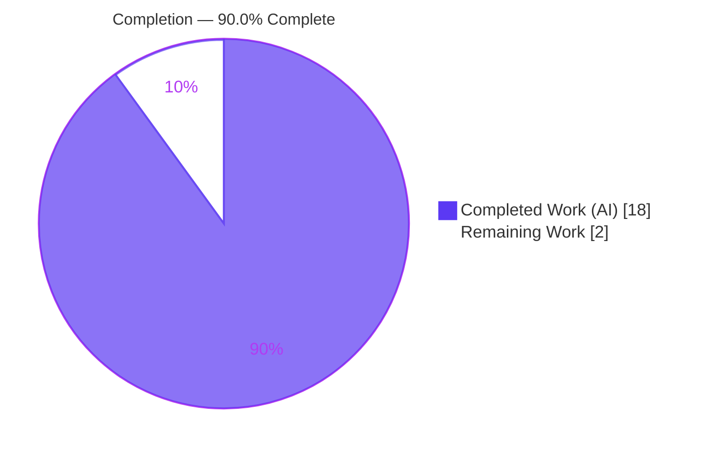
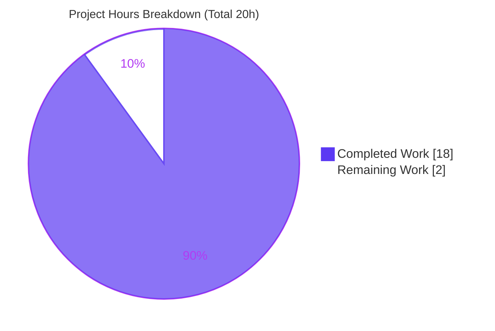

# Blitzy Project Guide — Scapy Packet-Lifecycle Q&A Answer Document

> **Deliverable:** `blitzy/documentation/scapy_0925ada48540.md` — a verbatim-evidence-grounded answer explaining how Scapy behaves at runtime across the build → send → sniff packet lifecycle.
> **Task type:** Read-only documentation (Q&A). **Zero Scapy source code changed.**

---

## 1. Executive Summary

### 1.1 Project Overview

This project answers a technical question about **how Scapy behaves at runtime across the full packet lifecycle — building, sending, and sniffing a multi-layer `Ether/IP/TCP` packet** — grounded in verbatim console output captured by actually running Scapy from this working copy. The audience is developers and reviewers who need an authoritative, source-cited account of Scapy's display, transmission, and dissection behavior. The technical scope is a single additive Markdown document; no Scapy source, tests, packaging, or CI are modified. The deliverable decomposes the question into four requirements (R1 build/display, R2 send/routing, R3 sniff/reconstruction, R4 synthesis) and answers each with exact `file:line` citations and reproduced output.

### 1.2 Completion Status

The project is **90.0% complete** on an AAP-scoped, hours-based basis. All autonomous documentation work is delivered and independently verified; the remaining 2 hours is the standard human review-and-merge gate.



| Metric | Hours |
|--------|-------|
| **Total Hours** | **20** |
| Completed Hours (AI + Manual) | 18 (18 AI + 0 Manual) |
| Remaining Hours | 2 |
| **Percent Complete** | **90.0%** |

*Legend — Completed Work: Dark Blue `#5B39F3`; Remaining Work: White `#FFFFFF`.*

### 1.3 Key Accomplishments

- ✅ Single deliverable authored at the mandated path `blitzy/documentation/scapy_0925ada48540.md` (directory created); 558 lines, ~5,074 words, 48 code fences, ~40 `file:line` citations.
- ✅ **R1 (build/display)** answered: `interact()` startup/banner + standard-shell fallback, per-layer `__repr__`, and `summary()`/`show()`/`ls()`/`show2()`/`raw()` of the `Ether()/IP(dst="127.0.0.1")/TCP(dport=80, flags="S")` stack.
- ✅ **R2 (send)** answered: `conf.route` table, `route("127.0.0.1")` → `('lo', '127.0.0.1', '0.0.0.0')`, `conf.verb`-gated `.` marker and `Sent 1 packets.` line.
- ✅ **R3 (sniff)** answered: `AsyncSniffer` + Python `lfilter` capture, dissection, and reconstructed `layers()`/`summary()`/`show()`/`hexdump()`.
- ✅ **R4 (summary)** answered: build → wire → sniff continuity proven (`raw(cap) == raw(Ether()/built)` → `True`; matching checksums IP `0x7ccd` / TCP `0x917c`; sizes 40/54 bytes).
- ✅ **Run-first methodology** honored — every claim is verbatim captured output or an exact citation; a Coverage pass, Exactness pass, and Honesty pass are included.
- ✅ **Read-only constraint** satisfied: zero `scapy/` and `test/` diffs since base `0925ada4`; temporary observation scripts confined to `/tmp` and removed; `git status` clean.
- ✅ **Independently re-verified** by this assessment: every documented value reproduced from the working copy with zero discrepancies; all audited citations resolve exactly.

### 1.4 Critical Unresolved Issues

| Issue | Impact | Owner | ETA |
|-------|--------|-------|-----|
| None (no blocking issues) | The deliverable is complete, accurate, and validated; no compilation or test failures exist (pure additive Markdown) | — | — |
| *(Advisory, non-blocking)* Intentional "Repository HEAD `0925ada4`" reference vs. current git HEAD `3b8d2054` | Low — `0925ada4` correctly identifies the observed **source** state (HEAD differs only by additive doc commits; zero Scapy source changed). Worth a reviewer's confirmation, not a blocker | Human SME | 0.5h |

### 1.5 Access Issues

**No access issues identified.** All work was performed from the local working copy with sufficient privilege.

| System/Resource | Type of Access | Issue Description | Resolution Status | Owner |
|-----------------|----------------|-------------------|-------------------|-------|
| Repository working copy | Read/Write (local) | None — full access | ✅ Resolved | — |
| Scapy runtime (working copy) | Execute as root | None — ran as `root`, loopback available, native raw sockets | ✅ Resolved | — |
| External network / third-party APIs | N/A | Not required — all packet I/O confined to loopback (`lo`) | ✅ N/A | — |

### 1.6 Recommended Next Steps

1. **[High]** Perform SME technical review of `scapy_0925ada48540.md`: confirm the narrative accurately answers R1–R4 and spot-check the verbatim output blocks and citations against the working copy. *(1.0h)*
2. **[High]** Confirm the intentional "Repository HEAD `0925ada4`" source-state reference and the environment-specific honesty labels (host routing rows, per-run banner quote, `VERSION` string) are acceptable for publication. *(0.5h)*
3. **[Medium]** Approve the pull request and merge the answer document to the target branch. *(0.5h)*

---

## 2. Project Hours Breakdown

### 2.1 Completed Work Detail

Every completed component traces to a specific AAP requirement (R1–R4) or an explicit AAP constraint (run-first, verbatim/citation, coverage, cleanup).

| Component | Hours | Description |
|-----------|-------|-------------|
| Environment baseline + run-first investigation harness | 2 | Establish runtime baseline (Python 3.13.7, Scapy `2026.07.01`, root, loopback, native raw sockets); author temporary `/tmp` observation scripts for build/send/sniff capture |
| R1 — Build & per-layer display | 4 | Stack `Ether()/IP()/TCP()`; capture per-layer `__repr__`, `summary()`, `show()` (deferred `None`), `ls()` (numeric), `show2()` (resolved), and `raw()` (54-byte hex); document with `packet.py` citations |
| R2 — Send, routing & transmission verbosity | 3 | Capture `conf.route` table + `route()` tuple; `send()` `.` marker + `Sent 1 packets.`; `conf.verb` gate and buffered/unbuffered ordering nuance; document with `sendrecv.py`/`route.py` citations |
| R3 — Sniff & dissection round-trip | 4 | `AsyncSniffer` + Python `lfilter` on `lo`; BPF/libpcap edge case; dissection and reconstructed `layers()`/`summary()`/`show()`/`hexdump()`; stop-guard behavior |
| R4 — Build → wire → sniff continuity synthesis | 2 | Prove byte/checksum continuity (`raw(cap[IP])==raw(built)`, `raw(cap)==raw(Ether()/built)`, checksums `0x7ccd`/`0x917c`, sizes 40/54) |
| Coverage pass + exactness verification + citation table | 2 | Coverage-pass table (9 rows), Exactness pass, Honesty pass, and ~40-entry citation table; verify every value/citation |
| QA/review refinement (3 iterative commits) | 1 | Environment alignment and evidence-grounding fixes across 3 review/QA-driven refinement commits (checkpoint env, observed runtime env, `t.stop()` output) |
| **Total Completed** | **18** | |

### 2.2 Remaining Work Detail

| Category | Hours | Priority |
|----------|-------|----------|
| Human SME technical review of document accuracy & completeness | 1.5 | High |
| PR approval & merge to target branch | 0.5 | Medium |
| **Total Remaining** | **2** | |

*Cross-section check: Section 2.1 (18) + Section 2.2 (2) = 20 = Total Project Hours (Section 1.2). Section 2.2 total (2) = Section 1.2 Remaining (2) = Section 7 "Remaining Work" (2).*

### 2.3 Notes on Estimation

Hours reflect the actual investigate-then-author workflow for an evidence-grounded documentation task, corroborated by the git history (initial authoring + three review/QA refinement commits). Confidence is **High**: the scope is well-defined, isolated, read-only, and every value was independently reproduced with zero discrepancies.

---

## 3. Test Results

For this read-only Q&A task, "tests" are the **evidence-reproduction checks executed by Blitzy's autonomous validation** (Gate 1) — re-running the build/send/sniff observation code paths and diffing their output against the document, plus a consolidated smoke test and a citation-resolution audit. **No repository unit tests were added or modified** (out of scope). All results below originate from Blitzy's autonomous validation logs and were reconciled by independent reproduction during this assessment.

| Test Category | Framework | Total Tests | Passed | Failed | Coverage % | Notes |
|---------------|-----------|-------------|--------|--------|------------|-------|
| Build & display reproduction (R1) | Scapy `2026.07.01` runtime + output-diff | 9 | 9 | 0 | 100% | `repr`×3, `summary()`, `show()` (`None` fields), `ls()` (numeric), `show2()` (resolved), `raw()` len/hex, import 0/586-byte STDOUT/STDERR |
| Send & routing reproduction (R2) | Scapy runtime + output-diff | 4 | 4 | 0 | 100% | `conf.route` table, `route()` tuple `('lo','127.0.0.1','0.0.0.0')`, `.` + `Sent 1 packets.`, `verbose=0` silence |
| Sniff & dissection reproduction (R3) | `AsyncSniffer` + output-diff | 5 | 5 | 0 | 100% | BPF/libpcap error, `layers()` `['Ether','IP','TCP']`, `summary()`, resolved `show()`, `hexdump()` |
| Continuity assertions (R4) | Scapy runtime assertions | 4 | 4 | 0 | 100% | `raw(cap[IP])==raw(built)` True, `raw(cap)==raw(Ether()/built)` True, sizes 40/54, checksums `0x7ccd`/`0x917c` |
| Edge-case guards | Scapy runtime | 2 | 2 | 0 | 100% | Stop-guard `Scapy_Exception("Not running ! (check .running attr)")`, `lfilter` vs BPF |
| Citation resolution audit | `grep`/`sed` source check | 34 | 34 | 0 | 100% | Every distinct `file:line` resolves to the claimed symbol/text |
| **Total** | | **58** | **58** | **0** | **100%** | All checks green; deterministic across 3+ runs (exit 0) |

**Integrity note:** All entries derive from Blitzy's autonomous validation logs for this project and were independently re-run during this assessment; zero discrepancies were found.

---

## 4. Runtime Validation & UI Verification

The full **build → send → sniff** lifecycle runs successfully end-to-end from the working copy, deterministic across runs (exit 0).

- ✅ **Scapy import from working copy** — Operational. `import scapy.all` → 0-byte STDOUT / 586-byte STDERR (only the two expected `CryptographyDeprecationWarning` lines from `scapy/layers/ipsec.py:573,577`); no tracebacks.
- ✅ **Interactive startup** — Operational. `interact()` prints the ASCII banner (`Version 2026.07.01`); with `IPython` absent it takes the standard-shell fallback path.
- ✅ **Build lifecycle** — Operational. `Ether()/IP(dst="127.0.0.1")/TCP(dport=80, flags="S")` renders per-layer and assembles to 54 bytes.
- ✅ **Send at L3** — Operational. Routing resolves to `lo`; `.` marker + `Sent 1 packets.` emitted under default `conf.verb = 2`.
- ✅ **Sniff round-trip** — Operational. `AsyncSniffer` on `lo` captures the sent frame via Python `lfilter`.
- ✅ **Dissection / reconstruction** — Operational. Captured frame reconstructs to `['Ether', 'IP', 'TCP']` with all computed fields resolved.
- ✅ **Deliverable rendering** — Operational. Markdown is well-formed: 558 lines, 48 balanced code fences, clean tables and headers.
- ➖ **UI verification** — Not applicable. Scapy is a CLI/library and the deliverable is a Markdown document; there is no graphical UI in scope.

---

## 5. Compliance & Quality Review

AAP deliverables and controlling-rule directives mapped to quality/compliance benchmarks. Fixes applied during autonomous validation are noted; the sole outstanding item is human review.

| Benchmark / AAP Directive | Requirement | Status | Progress | Notes |
|---------------------------|-------------|--------|----------|-------|
| Single deliverable, fixed name/location | Create `blitzy/documentation/scapy_0925ada48540.md` (+ dir) | ✅ Pass | 100% | File and directory created |
| Run-first methodology | Build/run code paths before writing | ✅ Pass | 100% | Environment section + run commands; 4-commit capture history |
| Verbatim evidence + `file:line` citations | Quote actual output; cite exact literals | ✅ Pass | 100% | ~40 citations; all audited resolve exactly |
| Full coverage of the question | Address R1, R2, R3, R4 explicitly | ✅ Pass | 100% | §1–§4 + 9-row Coverage-pass table |
| Exactness (no paraphrased values) | Cite exact literals/numbers | ✅ Pass | 100% | Checksums, sizes, tuples, error strings verbatim |
| Read-only source | Zero changes to `scapy/**`, `test/**`, CI, packaging, `doc/**` | ✅ Pass | 100% | `git diff 0925ada4..HEAD -- scapy/ test/` empty |
| Cleanup / repo unchanged | Remove temporary scripts; clean tree | ✅ Pass | 100% | Temp scripts in `/tmp` removed; `git status` clean |
| Authoritative version note | `pyproject.toml` authoritative over stale `README.md` | ✅ Pass | 100% | Version note section present (`pyproject.toml:17` vs `README.md:29`) |
| Honesty on non-universal facts | Label environment-specific/per-run values | ✅ Pass | 100% | Honesty pass labels routing rows, banner quote, framing |
| Markdown quality | Well-formed structure | ✅ Pass | 100% | Balanced fences, clean tables/headers |
| Human SME review | Independent technical sign-off | ⚠ Pending | 0% | The only outstanding gate (Section 1.6, Section 2.2) |

**Fixes applied during autonomous validation:** three refinement commits aligned the document to the observed runtime environment (checkpoint `python3` runtime, `cryptography 43.0.0`, `IPython` absence) and corrected the `t.stop()` verbatim output. Final validation found zero remaining discrepancies.

---

## 6. Risk Assessment

All risks are **Low** severity — this is an isolated, read-only documentation task with no code or dependency changes and no attack surface. Environment-specific risks are proactively neutralized by the document's built-in honesty passes.

| Risk | Category | Severity | Probability | Mitigation | Status |
|------|----------|----------|-------------|------------|--------|
| `VERSION` string drift (`2026.07.01` resolves dynamically via `scapy.VERSION`) | Technical | Low | Medium | Doc labels `VERSION` dynamic (`pyproject.toml:78`) and provides reproduction method | ✅ Mitigated |
| Per-run banner quote varies (`choice(QUOTES)`, `main.py:646`) | Technical | Low | High | Doc explicitly labels the banner quote as non-universal/per-run | ✅ Mitigated |
| No compilation/build risk (pure additive Markdown) | Technical | Low | Low | No source changed; nothing to compile | ✅ N/A |
| No security exposure (read-only, loopback-only, no secrets/deps) | Security | Low | Low | Packet I/O confined to `lo`; no code or dependency changes | ✅ N/A |
| Host-specific routing rows in §2 (`eth0`/`docker0` addresses) | Operational | Low | High | Doc labels the full routing table as environment-specific | ✅ Mitigated |
| Reproduction requires root + loopback + native raw sockets | Operational | Low | Medium | Prerequisites documented in Environment section | ✅ Mitigated |
| libpcap absent → BPF `filter=` fails | Integration | Low | High | Doc uses Python `lfilter` workaround; edge case documented | ✅ Mitigated |
| `CryptographyDeprecationWarning` ×2 on import (`ipsec.py:573,577`) | Integration | Low | High | Documented verbatim; graceful (not an error) | ✅ Documented |
| "Repository HEAD `0925ada4`" vs git HEAD `3b8d2054` | Documentation | Low | Medium | Intentional — identifies observed source state; HEAD differs only by additive doc commits | ⚠ Confirm in review |

---

## 7. Visual Project Status



**Remaining work by category (hours):**

| Category | Hours | Priority |
|----------|-------|----------|
| Human SME technical review | 1.5 | High |
| PR approval & merge | 0.5 | Medium |
| **Total** | **2** | |

*Integrity: "Remaining Work" (2) = Section 1.2 Remaining (2) = Section 2.2 total (2). "Completed Work" (18) = Section 2.1 total (18). Colors — Completed `#5B39F3`, Remaining `#FFFFFF`.*

---

## 8. Summary & Recommendations

**Achievements.** The project delivers a complete, verbatim-evidence-grounded answer to the user's question about Scapy's packet lifecycle. All four requirements (R1 build/display, R2 send/routing, R3 sniff/reconstruction, R4 synthesis) are answered explicitly with reproduced console output and ~40 exact `file:line` citations. The document includes Coverage, Exactness, and Honesty passes, and a full citation table. The read-only constraint is fully honored: zero Scapy source/test changes, temporary scripts cleaned up, and a byte-for-byte clean working tree aside from the answer file.

**Completion.** On an AAP-scoped, hours-based basis the project is **90.0% complete** (18 of 20 hours). This is computed as Completed Hours ÷ Total Hours = 18 ÷ (18 + 2) = 90.0%.

**Remaining gaps / critical path to production.** The only remaining work is the standard human path-to-production gate for a technical document: SME technical review (1.5h) and PR approval & merge (0.5h). There are **no** code defects, compilation errors, or failing tests to remediate.

**Success metrics.** Every documented value was independently reproduced with zero discrepancies (Scapy `2026.07.01`; import 0/586-byte STDOUT/STDERR; full-stack repr; route tuple `('lo','127.0.0.1','0.0.0.0')`; continuity `True`/`True`; checksums `0x7ccd`/`0x917c`; sizes 40/54; stop-guard exception). All autonomous validation gates passed.

**Production-readiness assessment.** The deliverable is **production-ready pending human review**. Recommended path: (1) SME technical review, (2) confirm the intentional HEAD-reference and environment-specific labels, (3) approve and merge. Because the document proactively labels every non-universal fact, reviewer effort is minimal and focused on sign-off rather than correction.

| Metric | Value |
|--------|-------|
| AAP-scoped completion | 90.0% |
| AAP requirements delivered | 13 of 13 (100%) |
| Path-to-production gates remaining | 2 (human review + merge) |
| Autonomous validation gates passed | 5 of 5 |
| Reproduction discrepancies | 0 |

---

## 9. Development Guide

This guide explains how to reproduce every observation in the answer document and how to verify the deliverable. All commands are copy-pasteable and were tested from the repository root.

### 9.1 System Prerequisites

- **OS:** Linux (kernel with loopback). Verified on Ubuntu-family container.
- **Python:** 3.13.7 (any `>=3.7, <4` per `pyproject.toml:17` works; byte-level protocol values are version-stable).
- **Privilege:** `root` (required for raw-socket send/sniff). Verify with `id -u` → `0`.
- **Interface:** loopback `lo` UP with `127.0.0.1/8`.

```bash
python3 --version            # -> Python 3.13.7
id -u                        # -> 0 (root)
ip addr show lo | grep 127.0.0.1   # -> inet 127.0.0.1/8 ... lo
```

### 9.2 Environment Setup

Scapy is run **directly from the working copy** — no installation required. Set `PYTHONPATH` to the repo root so `import scapy` resolves to `<repo>/scapy/__init__.py`.

```bash
cd /tmp/blitzy/scapy/blitzy-2898de46-6dda-4196-8ab3-537154bc715d_561037
export PYTHONPATH="$(pwd)"
```

### 9.3 Dependency Notes

No dependencies are added, updated, or removed. Optional packages present/absent in the environment of record:

```bash
python3 -c "import cryptography; print('cryptography', cryptography.__version__)"  # -> 43.0.0
python3 -c "import six; print('six present')"                                      # -> six present
python3 -c "import IPython" 2>/dev/null && echo present || echo "IPython absent (standard-shell fallback)"
```

`cryptography` present means a bare import emits **two** `CryptographyDeprecationWarning` lines (expected, graceful). `matplotlib`, `PyX`, and `libpcap`/`tcpdump` are absent → graceful degradation (native raw sockets; `psdump()`/`pdfdump()` disabled).

### 9.4 Reproduce the Observations

**Verify version & config:**

```bash
PYTHONPATH="$(pwd)" python3 -c "from scapy.config import conf; print('VERSION', conf.version, '| verb', conf.verb, '| use_pcap', conf.use_pcap)"
# -> VERSION 2026.07.01 | verb 2 | use_pcap False
```

**R1 — build & display (one-liner):**

```bash
PYTHONPATH="$(pwd)" python3 -c "from scapy.all import *; p=Ether()/IP(dst='127.0.0.1')/TCP(dport=80, flags='S'); print(repr(p)); print(p.summary()); print(len(raw(p)), conf.route.route('127.0.0.1'))"
# repr -> <Ether  type=IPv4 |<IP  frag=0 proto=tcp dst=127.0.0.1 |<TCP  dport=http flags=S |>>>
# summary -> Ether / IP / TCP 127.0.0.1:ftp_data > 127.0.0.1:http S
# 54 ('lo', '127.0.0.1', '0.0.0.0')
```

**R1 — interactive startup (banner on STDERR):**

```bash
PYTHONPATH="$(pwd)" python3 -c "from scapy.main import interact; interact()" </dev/null
```

**R2/R3/R4 — send + sniff round-trip** (temporary script in `/tmp`, deleted afterward):

```bash
cat > /tmp/obs_roundtrip.py << 'PYEOF'
import time
from scapy.all import IP, TCP, Ether, AsyncSniffer, send, raw
built = IP(dst="127.0.0.1")/TCP(dport=80, flags="S"); rb = raw(built)
t = AsyncSniffer(iface="lo", lfilter=lambda p: TCP in p and p[TCP].dport == 80, count=1, timeout=6)
t.start(); time.sleep(1); send(built, verbose=0); time.sleep(1); t.join()
cap = t.results[0]
print([l.__name__ for l in cap.layers()])          # ['Ether', 'IP', 'TCP']
print(raw(cap[IP]) == rb, raw(cap) == raw(Ether()/built))  # True True
print(len(rb), len(raw(cap)))                        # 40 54
print("0x%04x 0x%04x" % (cap[IP].chksum, cap[TCP].chksum))  # 0x7ccd 0x917c
PYEOF
PYTHONPATH="$(pwd)" python3 /tmp/obs_roundtrip.py 2>/dev/null
rm -f /tmp/obs_roundtrip.py     # cleanup — keep the repo clean
```

### 9.5 Verify the Deliverable

```bash
test -f blitzy/documentation/scapy_0925ada48540.md && echo "deliverable exists"
wc -l blitzy/documentation/scapy_0925ada48540.md    # -> 558
grep -c '```' blitzy/documentation/scapy_0925ada48540.md  # -> 48 (balanced)
git diff --name-only 0925ada4 HEAD -- scapy/ test/  # -> (empty: read-only respected)
git status --porcelain                               # -> (empty: clean tree)
```

### 9.6 Troubleshooting

- **`ModuleNotFoundError: scapy`** → ensure `PYTHONPATH="$(pwd)"` points at the repo root.
- **`Cannot set filter: libpcap is not available. Cannot compile filter !`** → expected without libpcap; use a Python `lfilter=` callable instead of a BPF `filter=` string.
- **`Scapy_Exception: Not running ! (check .running attr)`** → do not call `.stop()` after `AsyncSniffer` auto-stops on `count`; read `t.results` after `t.join()`.
- **Permission / socket errors on send/sniff** → run as `root`.
- **Banner quote differs between runs** → expected; the quote is randomly chosen (`main.py:646`).

---

## 10. Appendices

### Appendix A — Command Reference

| Purpose | Command |
|---------|---------|
| Set import path | `export PYTHONPATH="$(pwd)"` |
| Version & config | `python3 -c "from scapy.config import conf; print(conf.version, conf.verb, conf.use_pcap)"` |
| Build & display | `python3 -c "from scapy.all import *; p=Ether()/IP(dst='127.0.0.1')/TCP(dport=80,flags='S'); print(repr(p))"` |
| Interactive start | `python3 -c "from scapy.main import interact; interact()" </dev/null` |
| Bare import (warnings) | `python3 -c "import scapy.all"` |
| Verify deliverable | `wc -l blitzy/documentation/scapy_0925ada48540.md` |
| Read-only check | `git diff --name-only 0925ada4 HEAD -- scapy/ test/` |
| Clean-tree check | `git status --porcelain` |

### Appendix B — Port Reference

No listening services are started; all packet I/O is confined to loopback. The example packet uses:

| Field | Value | Symbolic |
|-------|-------|----------|
| TCP source port | 20 | `ftp_data` |
| TCP destination port | 80 | `http` |

### Appendix C — Key File Locations

| File | Role |
|------|------|
| `blitzy/documentation/scapy_0925ada48540.md` | The deliverable (answer document) |
| `scapy/packet.py` | `__repr__` (L552), `__div__` (L596), `build`/`do_build` (L746/L724), `dissect` (L1049), `show` (L1459), `show2` (L1473), `summary` (L1642) |
| `scapy/sendrecv.py` | `__gen_send` (L332), `os.write` `.` (L380), `Sent` line (L392), `send` (L422), `sendp` (L452), stop-guard (L1299), `sniff` (L1308) |
| `scapy/route.py` | `Route` (L31), `Route.route` → `(iface, output_ip, gateway_ip)` (L146) |
| `scapy/config.py` | `conf.verb` (L759), `conf.route` slot (L806), `conf.use_pcap` (L832) |
| `scapy/main.py` | `interact()` (L503), IPython fallback (L571–577), `choice(QUOTES)` (L646), `code.interact` (L707–708) |
| `scapy/layers/l2.py`, `scapy/layers/inet.py` | `Ether` (l2:244), `IP` (inet:521), `TCP` (inet:753) |
| `pyproject.toml`, `README.md` | `requires-python` (pyproject:17), version attr (pyproject:78), stale note (README:29) |

### Appendix D — Technology Versions

| Component | Version |
|-----------|---------|
| Python | 3.13.7 |
| Scapy (`conf.version`) | 2026.07.01 |
| cryptography | 43.0.0 |
| six | 1.17.x (present) |
| IPython | absent |
| libpcap / tcpdump | absent (native raw sockets) |

### Appendix E — Environment Variable Reference

| Variable | Value | Purpose |
|----------|-------|---------|
| `PYTHONPATH` | `<repo root>` | Makes `import scapy` resolve to the in-repo working copy |

### Appendix F — Developer Tools Guide (Scapy display methods)

| Method | Behavior |
|--------|----------|
| `repr(pkt)` | Shows only set/overloaded fields; skips unset fields and empty collections |
| `summary()` | One-line symbolic description of the layer stack |
| `show()` | Hierarchical, symbolic view; computed fields (`ihl`/`len`/`chksum`/`dataofs`) show `None` before assembly |
| `ls(pkt)` | Field class + numeric/typed values (e.g., `type=2048`, `proto=6`, `dport=80`) |
| `show2()` | Assembles the packet first (`raw(self)`), so computed fields resolve (`ihl=5`, `len=40`, `chksum=0x7ccd`, …) |
| `raw(pkt)` | The exact bytes to be sent (54 bytes for this stack) |
| `hexdump(pkt)` | Offset/hex/ASCII dump of the frame bytes |
| `sniff()` / `AsyncSniffer` | Capture frames; use Python `lfilter` when libpcap is absent |

### Appendix G — Glossary

| Term | Meaning |
|------|---------|
| AAP | Agent Action Plan — the controlling requirements document |
| BPF | Berkeley Packet Filter — kernel-level filter string (requires libpcap) |
| `lfilter` | A Python callable predicate used to filter sniffed packets without libpcap |
| Dissection | Scapy's parsing of raw bytes back into typed protocol layers |
| Overloaded field | A lower-layer field auto-set by stacking an upper layer (e.g., `Ether.type=IPv4`) |
| Computed field | A field (length/checksum) filled in only at assembly time (`build()`/`raw()`) |
| Loopback (`lo`) | The local software network interface (`127.0.0.1`) used for the send/sniff round trip |
| Native raw socket | Scapy's socket backend used when libpcap is absent (`conf.use_pcap = False`) |

---

*Assessment basis: AAP-scoped, hours-based completion (PA1/PA2). All numbers are consistent across Sections 1.2, 2.1, 2.2, and 7: Total 20h, Completed 18h, Remaining 2h, Completion 90.0%. Blitzy brand colors applied — Completed `#5B39F3`, Remaining `#FFFFFF`.*