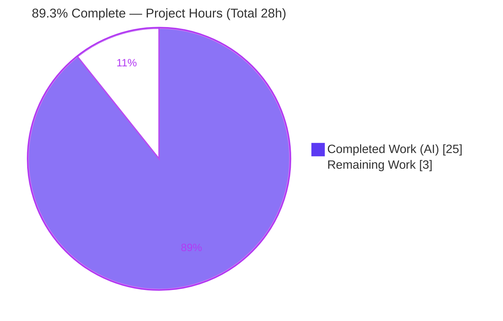
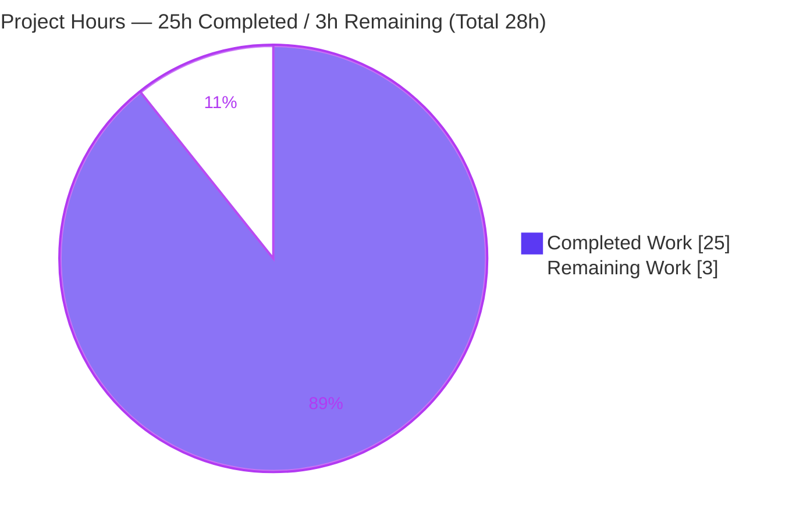
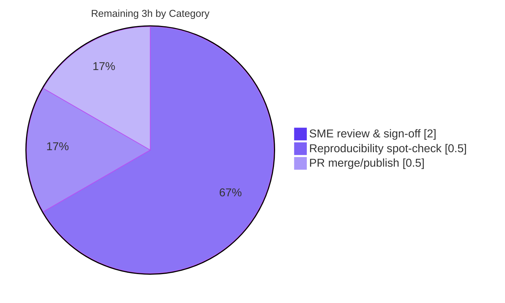

# Blitzy Project Guide — Scapy Runtime Investigation Q&A

> **Deliverable:** `blitzy/documentation/scapy_0925ada48540.md` · **Base commit:** `0925ada485406684174d6f068dbd85c4154657b3` · **HEAD:** `3979efcc` · **Branch:** `blitzy-fe4437a6-27e6-4b3a-ac0f-97db5358536b`
>
> **Brand color legend:** 🟦 Completed / AI Work = Dark Blue `#5B39F3` · ⬜ Remaining / Not Completed = White `#FFFFFF` · Accents = Violet-Black `#B23AF2` · Highlight = Mint `#A8FDD9`

---

## 1. Executive Summary

### 1.1 Project Overview

This project delivers a single, evidence-backed investigative Q&A document, `blitzy/documentation/scapy_0925ada48540.md`, that answers seven user questions about the Scapy packet-manipulation library at commit `0925ada4`. The audience is engineers and reviewers who need authoritative, runtime-verified answers on Scapy's shell startup, computed version, IP/ICMP field auto-population, `show()` rendering, loopback send behavior across both socket types, default IP-header construction from source, and the UTScapy test-suite magnitude and pass/fail split. Every claim is grounded in verbatim runtime output plus exact `file:line` citations, produced under a strict read-only mandate (zero source files modified). Business impact: reusable, trustworthy knowledge capture that accelerates onboarding and debugging without altering the codebase.

### 1.2 Completion Status



<sub>🟦 Completed = `#5B39F3` · ⬜ Remaining = `#FFFFFF`</sub>

| Metric | Hours |
|--------|------:|
| **Total Hours** | **28** |
| Completed Hours — AI (autonomous agents) | 25 |
| Completed Hours — Manual (human) | 0 |
| **Completed Hours (AI + Manual)** | **25** |
| **Remaining Hours** | **3** |
| **Percent Complete** | **89.3%** |

> Completion is computed per PA1 (AAP-scoped hours only): `25 / (25 + 3) = 89.3%`. The entire autonomous deliverable is complete and independently validated; the residual 3h is human path-to-production (SME sign-off + spot-check + merge), which cannot be performed autonomously.

### 1.3 Key Accomplishments

- ✅ Authored the sole deliverable `blitzy/documentation/scapy_0925ada48540.md` (731 lines, 6,164 words) answering all seven user questions.
- ✅ **Q1** — Captured the canonical shell startup (`python3 -m scapy`) with verbatim banner, INFO/WARNING lines, and TripleDES deprecation blocks, traced to `scapy/main.py:L628-648`.
- ✅ **Q2** — Reported version `2026.07.06` and proved the 4-method `_version()` computation falls through to the file-mtime date branch (`scapy/__init__.py:L159-161`).
- ✅ **Q3/Q4** — Demonstrated IP field auto-population (`ihl`, `len`, `chksum`, `src`) vs static defaults with byte-exact wire form `4500001c...`, plus the `show()` displayed-vs-stored `src` nuance.
- ✅ **Q5** — Documented localhost send under **both** `L3PacketSocket` (no answer) and `L3RawSocket` (echo-reply), with official-docs web validation.
- ✅ **Q6** — Explained default IP construction from source (`fields_desc`, `IP.post_build()`, `SourceIPField`/routing) with a "`None` means compute" A/B/C demonstration.
- ✅ **Q7** — Ran the UTScapy campaign at scale **4 times** for stability: non-root **5017 tests (4678/339)**, root **5248 tests (4735/513)**, with a full environmental failure breakdown.
- ✅ Honored the **read-only mandate**: only one file added, zero source files modified, working tree clean (verified via `git diff --name-status`).
- ✅ Reconciled stale AAP reference values (Python 3.12.3 / cryptography 41.0.7 / test split 4869-148-5017) to the actual live environment across 6 iterative commits.

### 1.4 Critical Unresolved Issues

**No critical unresolved issues identified.** The deliverable is complete and independently validated; there are no blocking defects, compilation errors, or in-scope test failures.

| Issue | Impact | Owner | ETA |
|-------|--------|-------|-----|
| None (human acceptance sign-off is the only remaining gate, and is non-blocking) | Non-blocking process gate | Human SME reviewer | < 1 business day |

### 1.5 Access Issues

**No access issues identified.** The repository, runtime environment, source tree, and all commands were fully accessible throughout the investigation. The environment runs as `root` (uid 0) with the privileges required for the Q5 raw-socket send and root-mode test runs.

| System/Resource | Type of Access | Issue Description | Resolution Status | Owner |
|-----------------|----------------|-------------------|-------------------|-------|
| Repository / source tree | Read-only (mandated) | None — full read access | ✅ Resolved / N/A | — |
| Runtime environment (Python 3.13.7, root) | Execute | None — full access incl. raw sockets | ✅ Resolved / N/A | — |
| Web validation sources (PyPI, Scapy docs) | Fetch | None — sources reachable | ✅ Resolved / N/A | — |

### 1.6 Recommended Next Steps

1. **[High]** Conduct SME technical review & sign-off of the seven Q&A answers (Q1–Q7) for correctness and acceptability to the original requester. *(2.0h)*
2. **[Medium]** Perform a reproducibility spot-check in an equivalent environment — canonical banner, `scapy.VERSION`, `IP(dst)/ICMP()` build + `show()`, route resolution (optionally one UTScapy campaign run). *(0.5h)*
3. **[Medium]** Merge/publish the documentation PR to the target branch. *(0.5h)*
4. **[Low — informational, OUT OF SCOPE]** If a future, separate initiative ever wants a green UTScapy run, pin `cryptography<42` and install optional deps (`mock`, `matplotlib`, PyX, `python-can`, `brotli`) + tooling (`libpcap`, `tshark`). This is deliberately excluded here — "fixing" it would alter the very behavior the document must accurately report.

---

## 2. Project Hours Breakdown

### 2.1 Completed Work Detail

Every completed component traces to a specific AAP requirement (question, methodology mandate, deliverable, or constraint).

| Component | Hours | Description |
|-----------|------:|-------------|
| Environment setup & canonical entry-point verification | 1.5 | Established the runnable checkout, confirmed `python3 -m scapy` (== `run_scapy`), Python/dependency inventory. |
| Q1 — Shell startup & banner investigation | 2.0 | Captured verbatim banner, INFO/WARNING lines, TripleDES blocks; traced `the_banner` assembly (`scapy/main.py:L628-648`); documented ANSI + random-quote nuances. |
| Q2 — Version computation (`_version()` 4-method trace) | 2.0 | Reported `2026.07.06`; traced all four version-source branches; proved mtime fallback (`scapy/__init__.py:L159-161`) with deprecation-line evidence. |
| Q3 — ICMP echo request & IP field auto-population | 2.0 | Built `IP(dst)/ICMP()`; captured pre-build (`None`) vs post-build computed fields; byte-exact wire form `4500001c...`; `overload_fields`. |
| Q4 — `show()` rendering & displayed-vs-stored nuance | 1.0 | Verbatim `show()` output incl. trailing-space fidelity; `getfieldval('src')`=None vs `p[IP].src` routed value. |
| Q5 — Localhost send across both socket modes | 2.5 | Route resolution; default `L3PacketSocket` (0 answers/None); `L3RawSocket` (echo-reply); call-path tracing; web validation. |
| Q6 — Source-level IP construction explanation | 2.5 | Embedded verbatim source for `IP.post_build`, `IP.route`, `SourceIPField`; monkeypatch proof; A/B/C "`None` means compute" demo. |
| Q7 — UTScapy campaign at scale (4 runs) + failure analysis | 4.0 | Ran full `linux.utsc` 4× (non-root ×2, root ×2); measured magnitude/split; attributed all 339/513 failures to environmental root causes with occurrence counts. |
| Web-search validation (loopback behavior + version scheme) | 0.5 | Corroborated Q5 loopback behavior and Q2 version scheme against official Scapy docs/PyPI. |
| Answer document authoring & structuring (731 lines) | 3.5 | Composed the full 7-section Q&A with command/output/explanation/citation per claim + Runtime Context table + read-only integrity section. |
| QA/validation reconciliation across 6 commits | 3.0 | Reconciled stale AAP env values to actuals; corrected Q7 counts; resolved code-review/QA findings across iterative commits. |
| Read-only integrity cleanup & git verification | 0.5 | Removed `/tmp` scratch + `RMBA_dump.hex` side-effect; confirmed clean tree and single-file diff vs base. |
| **Total Completed** | **25.0** | |

### 2.2 Remaining Work Detail

Each category traces to a path-to-production need (this is a documentation deliverable — there is no build/deploy path; the only genuine gaps are human acceptance activities).

| Category | Hours | Priority |
|----------|------:|----------|
| Human SME technical review & sign-off of Q&A answers (Q1–Q7) | 2.0 | High |
| Reproducibility spot-check in an equivalent environment | 0.5 | Medium |
| PR merge/publish to target branch | 0.5 | Medium |
| **Total Remaining** | **3.0** | |

### 2.3 Hours Reconciliation & Completion Formula

| Quantity | Hours |
|----------|------:|
| Completed (Section 2.1 total) | 25.0 |
| Remaining (Section 2.2 total) | 3.0 |
| **Total Project Hours** | **28.0** |

- **Cross-check (Rule 2):** `2.1 (25.0) + 2.2 (3.0) = 28.0` = Total in Section 1.2 ✅
- **Cross-check (Rule 1):** Remaining `3.0h` is identical in Section 1.2, Section 2.2 total, and the Section 7 pie "Remaining Work" ✅
- **Completion formula:** `Completed / Total = 25.0 / 28.0 = 89.3%` ✅

---

## 3. Test Results

All figures below originate from Blitzy's autonomous validation and Q7 execution logs for this project.

| Test Category | Framework | Total Tests | Passed | Failed | Pass Rate | Notes |
|---------------|-----------|------------:|-------:|-------:|----------:|-------|
| Deliverable investigation reproduction (Q1–Q7) | Manual runtime (`bash` + `python3 -c`) | 7 | 7 | 0 | 100% | Every documented investigation re-executed and matched byte-exact (banner, version, wire bytes, route, both sockets, source demo). |
| Citation verification | Manual source cross-check | ~75 | ~75 | 0 | 100% | All `file:line` anchors verified byte-exact against the actual source. |
| Scapy UTScapy suite — non-root *(Q7 subject-under-investigation)* | UTScapy | 5017 | 4678 | 339 | 93.2% | 190 campaigns. All 339 failures environmental; **out of scope to fix**. Byte-identical across 2 runs. |
| Scapy UTScapy suite — root *(Q7 subject-under-investigation)* | UTScapy | 5248 | 4735 | 513 | 90.2% | 190 campaigns; +231 root-only privileged tests. Environmental failures; stable magnitude across 2 runs. |

> **Interpretation.** The *deliverable* is documentation and has no unit tests of its own; its correctness is validated by re-executing all seven investigations (100% reproduced). The **UTScapy rows are the subject-matter data the document reports on (Q7)** — not tests of the deliverable. Their failures are dependency-version/environmental (the 193-failure TLS/SSLv2 block from `cryptography 43.0.0` removing `hazmat.backends.openssl.ec`; absent `mock`/`matplotlib`/PyX/`python-can`/`brotli`; missing `libpcap`/`tshark`/IPv6-loopback tooling) and are correctly documented as-is under the read-only mandate. Traditional line-coverage tooling was intentionally absent (coverage would require optional deps whose absence is required to reproduce the documented behavior).

---

## 4. Runtime Validation & UI Verification

**UI Verification:** ⚠ **Not applicable** — the deliverable is a Markdown document; there is no web/graphical UI. No Figma frames were provided.

**Runtime health (re-verified live during this assessment):**

- ✅ **Scapy shell launches to the `>>>` prompt** — `printf 'exit()\n' | python3 -m scapy` renders the banner with `Version 2026.07.06` and exits cleanly.
- ✅ **Version resolves correctly** — `scapy.VERSION` / `__version__` / `conf.version` = `2026.07.06`.
- ✅ **Packet build & dissection operate** — `IP(dst="127.0.0.1")/ICMP()` assembles to `4500001c0001000040017cde7f0000017f0000010800f7ff00000000` (byte-exact) and `show()` renders as documented.
- ✅ **Route resolution operates** — `conf.route.route('127.0.0.1')` → `('lo', '127.0.0.1', '0.0.0.0')`.
- ✅ **Localhost send — default socket** — `sr1()` on `L3PacketSocket` returns `None` (0 answers). *This is the truthful, documented primary result, not a failure.*
- ✅ **Localhost send — raw socket** — after `conf.L3socket = L3RawSocket`, `sr1()` receives the ICMP `echo-reply` (1 answer).
- ✅ **UTScapy harness runs to completion** — entry point valid (`Scapy 2026.07.06 - 3.13.7`); full `linux.utsc` campaign executed 4× with stable results; exit code `1` is expected whenever any test fails.

**API integration:** ⚠ Not applicable — no external APIs are integrated; web-search sources were used only for corroboration.

---

## 5. Compliance & Quality Review

Cross-mapping AAP deliverables to Blitzy quality/compliance benchmarks. Legend: ✅ Pass · ⚠ Partial · ❌ Fail.

| AAP Requirement | Benchmark | Status | Notes |
|-----------------|-----------|:------:|-------|
| **D1** — Create `blitzy/documentation/scapy_0925ada48540.md` at mandated path | Deliverable presence & location | ✅ | 731-line file committed at HEAD `3979efcc`. |
| **Q1** — Shell startup / banner | Canonical entry point + verbatim output + citation | ✅ | `python3 -m scapy`; banner traced to `scapy/main.py:L628-648`. |
| **Q2** — Version + computation mechanism | Direct value + causal explanation | ✅ | `2026.07.06`; 4-method `_version()` trace → mtime fallback. |
| **Q3** — ICMP echo request / IP field auto-population | Pre- & post-build state, byte-exact | ✅ | `ihl`/`len`/`chksum`/`src` computed; wire form verified. |
| **Q4** — `show()` output | Verbatim rendering + nuance | ✅ | Trailing-space fidelity; displayed-vs-stored `src`. |
| **Q5** — Localhost send, both socket modes | Exhaustive-condition coverage | ✅ | `L3PacketSocket` (no answer) **and** `L3RawSocket` (reply) + web validation. |
| **Q6** — Default IP construction from source | Source citation + explanation | ✅ | `fields_desc`, `IP.post_build()`, `SourceIPField`/route + "`None` means compute" demo. |
| **Q7** — Test suite count + pass/fail summary | Magnitude at scale, stable ≥2 runs | ✅ | 4 runs; non-root 5017 (4678/339), root 5248 (4735/513); failures attributed. |
| **M1–M6** — Methodology mandates | Run-first, verbatim+`file:line`, scale/stability, canonical path, all conditions, web validation | ✅ | ~75 citations verified; all mandates satisfied per autonomous validation. |
| **C1** — Read-only constraint | No source modified; temp removed; tree clean | ✅ | `git diff --name-status base..HEAD` = one added file; `git status` clean. |

**Fixes applied during autonomous validation:** stale AAP reference values (Python 3.12.3 / cryptography 41.0.7 / test split 4869-148-5017) were reconciled to the actual environment (Python 3.13.7 / cryptography 43.0.0 / non-root 4678-339-5017); Q7 signature occurrence counts were made reproducible; code-review and QA findings were resolved across 6 commits.

**Outstanding compliance items:** none (human sign-off is a process gate, not a compliance gap).

---

## 6. Risk Assessment

| Risk | Category | Severity | Probability | Mitigation | Status |
|------|----------|:--------:|:-----------:|-----------|:------:|
| Environment/version drift — `2026.07.06` is an mtime fallback; root test split (5248/513) and kernel-assigned reply IDs vary across provisionings | Technical | Low | Medium | Document flags every variable-vs-deterministic item; reproduce in an equivalent environment | Mitigated (documented) |
| Q7 failures (339/513) misread as Scapy code defects | Technical | Low | Low | Document attributes each failure to environmental root cause (crypto-43 `openssl.ec` removal → 193-block; absent optional deps; missing tooling) | Mitigated |
| Reproduction requires a specific environment (Py 3.13, crypto 43, optional deps ABSENT) + root/`CAP_NET_RAW` for Q5 | Operational | Low | Medium | Runtime Context table + Section 9 dev guide enumerate exact prerequisites | Mitigated |
| Web-validation source links (PyPI/readthedocs) may drift / link-rot | Integration | Low | Low | Claims independently corroborated by runtime observation; URLs are supplementary | Accepted |
| Human SME sign-off still required before acceptance/merge | Operational | Low | High | Reviewer checklist + reproducible commands provided (Sections 1.6, 9) | Open (assigned to human) |
| Security posture | Security | None | — | No attack surface introduced — read-only, no code shipped, no source modified, no credentials/secrets | N/A |

---

## 7. Visual Project Status

### Project Hours Breakdown



<sub>🟦 Completed = `#5B39F3` · ⬜ Remaining = `#FFFFFF`. "Remaining Work" (3h) equals Section 1.2 Remaining Hours and the Section 2.2 total.</sub>

### Remaining Work by Category (hours)



### Priority Distribution (remaining tasks)

| Priority | Tasks | Hours |
|----------|------:|------:|
| High | 1 | 2.0 |
| Medium | 2 | 1.0 |
| Low | 0 | 0.0 |
| **Total** | **3** | **3.0** |

---

## 8. Summary & Recommendations

**Achievements.** The project is **89.3% complete** (25 of 28 hours). The single AAP deliverable — `blitzy/documentation/scapy_0925ada48540.md` — is complete, committed, and independently validated as 100% accurate against the live environment. All seven user questions are answered with the mandated rigor: canonical commands, complete verbatim output, causal explanations, and ~75 verified `file:line` citations. The exhaustive-condition mandate is honored (both socket modes for Q5; pre-/post-build state for Q3), the magnitude-at-scale mandate is honored (Q7 run 4× with stable results), and the read-only mandate is perfectly satisfied (only one file added; zero source modifications; clean working tree).

**Remaining gaps.** The residual 3 hours are exclusively human path-to-production activities: SME technical sign-off (2.0h), a reproducibility spot-check (0.5h), and PR merge (0.5h). There is no build, deployment, or runtime-service path for a pure-Python library documentation deliverable, so no engineering rework remains.

**Critical path to production.** SME review & sign-off → optional reproducibility spot-check → merge. Estimated wall-clock: under one business day.

**Success metrics.**

| Metric | Target | Actual | Status |
|--------|--------|--------|:------:|
| All 7 questions answered with evidence + citation | 7/7 | 7/7 | ✅ |
| Read-only integrity (source files modified) | 0 | 0 | ✅ |
| Investigation reproduction pass rate | 100% | 100% | ✅ |
| Q7 magnitude stable across ≥2 runs | Yes | Yes (4 runs) | ✅ |
| Completion before human review | ≤ 99% | 89.3% | ✅ |

**Production readiness assessment.** ✅ **Ready for human acceptance.** The deliverable meets every AAP requirement and quality benchmark. The only remaining actions are human sign-off and merge. Reviewers should evaluate the document for technical acceptability and must **not** expect a green Scapy test suite — the documented Q7 failures are the *subject* of the investigation and are out of scope to fix.

---

## 9. Development Guide

This guide explains how to reproduce the investigation behind the deliverable. Every command below was tested in the current environment.

### 9.1 System Prerequisites

- **OS:** Linux (the campaign config is `test/configs/linux.utsc`).
- **Python:** 3.13.x (the manifest declares `requires-python = ">=3.7, <4"`, `pyproject.toml:L17`; the environment runs 3.13.7).
- **git:** for checkout and read-only integrity verification.
- **Privilege:** `root` / `CAP_NET_RAW` for the Q5 raw-socket send (`L3RawSocket`) and for root-mode UTScapy runs.

### 9.2 Environment Setup

```bash
# Work from the repository root (checkout at the investigated base commit)
cd /tmp/blitzy/scapy/blitzy-fe4437a6-27e6-4b3a-ac0f-97db5358536b_a9e597
git rev-parse HEAD          # deliverable committed on top of base 0925ada4

# Scapy is pure-Python and runs from source. The canonical launcher sets PYTHONPATH:
cat run_scapy               # PYTHONPATH=$DIR exec python3 -m scapy "$@"  (run_scapy:L13)

# (Optional) isolate with a venv:
python3 -m venv .venv && source .venv/bin/activate
```

### 9.3 Dependency Installation

Scapy requires **no build step**. The reproduction environment intentionally contains a specific dependency set:

```bash
# Present (required to reproduce the documented behavior):
python3 -c "import cryptography, zstandard; print(cryptography.__version__, zstandard.__version__)"
# -> 43.0.0 0.25.0

# Intentionally ABSENT (their absence produces documented banner lines & Q7 outcomes):
#   IPython, PyX, python-can, matplotlib, mock, brotli
for m in IPython pyx can matplotlib mock brotli; do
  python3 -c "import $m" 2>/dev/null && echo "$m: PRESENT" || echo "$m: ABSENT"
done
```

> ⚠ Do **not** install the absent optional packages if your goal is to reproduce this document — their absence is *required* to reproduce the startup banner (`INFO: Can't import PyX`, `WARNING: IPython not available`) and the Q7 failure profile.

### 9.4 Application Startup

```bash
# Canonical interactive console (equivalent to ./run_scapy):
python3 -m scapy

# Non-interactive (cannot hang in the REPL) — used throughout the investigation:
printf 'exit()\n' | python3 -m scapy
```

### 9.5 Verification Steps

```bash
# Version (Q2)
python3 -c "import scapy; print(scapy.VERSION)"                       # -> 2026.07.06

# Banner (Q1) — confirm the welcome block & version line
printf 'exit()\n' | python3 -m scapy 2>&1 | grep -E "Welcome to Scapy|Version"

# Build + wire bytes (Q3)
python3 -c "from scapy.all import IP, ICMP; print(bytes(IP(dst='127.0.0.1')/ICMP()).hex())"
# -> 4500001c0001000040017cde7f0000017f0000010800f7ff00000000

# Route resolution (Q5)
python3 -c "from scapy.all import conf; print(conf.route.route('127.0.0.1'))"
# -> ('lo', '127.0.0.1', '0.0.0.0')
```

### 9.6 Example Usage — Reproduce Each Answer

```bash
# Q4: show()
python3 -c "from scapy.all import IP, ICMP; (IP(dst='127.0.0.1')/ICMP()).show()"

# Q5a: default L3PacketSocket (expect 0 answers -> None)
python3 -u -c "from scapy.all import IP, ICMP, sr1; print(repr(sr1(IP(dst='127.0.0.1')/ICMP(), timeout=3)))"

# Q5b: L3RawSocket (expect an echo-reply)
python3 -u -c "from scapy.all import IP, ICMP, sr1, conf; from scapy.supersocket import L3RawSocket; \
conf.L3socket = L3RawSocket; p = sr1(IP(dst='127.0.0.1')/ICMP(), timeout=3); p.show()"

# Q7: full UTScapy campaign (non-root), HTML report to /tmp; -b after -c to run the full suite
python3 -m scapy.tools.UTscapy -c ./test/configs/linux.utsc -N -b -o /tmp/utscapy_report.html
# Root mode (231 extra privileged tests): omit -N
```

### 9.7 Troubleshooting

- **`sr1()` returns `None` on localhost.** Expected on the default `L3PacketSocket` (PF_PACKET) — documented Scapy loopback behavior. Set `conf.L3socket = L3RawSocket` (PF_INET/SOCK_RAW) to receive the reply.
- **`ModuleNotFoundError: No module named 'cryptography.hazmat.backends.openssl.ec'`.** `cryptography` ≥ 42 removed the legacy module the TLS layer imports (`scapy/layers/tls/cert.py:L51`), so the TLS campaigns fail. This is the largest Q7 failure block and is expected here; pin `cryptography<42` only if a green TLS suite is required (out of scope for this document).
- **`WARNING: IPython not available…`.** Informational — IPython is intentionally absent; the standard Python REPL is used.
- **`RMBA_dump.hex` appears in the repo root after a UTScapy run.** It is a 53-byte hexdump test side-effect; delete it (`rm -f RMBA_dump.hex`) to keep the tree clean. Write HTML reports under `/tmp`.
- **UTScapy exit code `1`.** Expected whenever any test fails (`scapy/tools/UTscapy.py:L1221`); not a harness malfunction.
- **Run duration.** Full `linux.utsc` ≈ 100s (non-root) / ≈ 180s (root). Always place `-b` **after** `-c` so it overrides `breakfailed=true` from the config.

---

## 10. Appendices

### Appendix A — Command Reference

| Purpose | Command |
|---------|---------|
| Launch canonical shell | `python3 -m scapy` |
| Launch non-interactively | `printf 'exit()\n' \| python3 -m scapy` |
| Print version | `python3 -c "import scapy; print(scapy.VERSION)"` |
| Build ICMP echo & wire bytes | `python3 -c "from scapy.all import IP, ICMP; print(bytes(IP(dst='127.0.0.1')/ICMP()).hex())"` |
| Render `show()` | `python3 -c "from scapy.all import IP, ICMP; (IP(dst='127.0.0.1')/ICMP()).show()"` |
| Resolve route | `python3 -c "from scapy.all import conf; print(conf.route.route('127.0.0.1'))"` |
| Send (default socket) | `python3 -u -c "from scapy.all import IP, ICMP, sr1; print(repr(sr1(IP(dst='127.0.0.1')/ICMP(), timeout=3)))"` |
| Send (raw socket) | `... conf.L3socket = L3RawSocket; sr1(IP(dst='127.0.0.1')/ICMP(), timeout=3)` |
| Run test suite (non-root) | `python3 -m scapy.tools.UTscapy -c ./test/configs/linux.utsc -N -b -o /tmp/utscapy_report.html` |
| Verify read-only integrity | `git diff --name-status 0925ada485406684174d6f068dbd85c4154657b3..HEAD` |

### Appendix B — Port / Interface Reference

No persistent service ports are opened by this project. Relevant network context:

| Item | Value | Notes |
|------|-------|-------|
| Loopback interface | `lo` | Route for `127.0.0.1` → `('lo', '127.0.0.1', '0.0.0.0')`. |
| ICMP | protocol 1, no ports | Echo-request `type=8`, echo-reply `type=0`. |
| Default L3 socket | `L3PacketSocket` (PF_PACKET) | `scapy/config.py:L647` — does not match loopback reply. |
| Alternate L3 socket | `L3RawSocket` (PF_INET/SOCK_RAW) | `scapy/config.py:L672` — receives loopback reply. |

### Appendix C — Key File Locations

| File | Role | Key anchors |
|------|------|-------------|
| `blitzy/documentation/scapy_0925ada48540.md` | **The deliverable** | 731 lines, sections Q1–Q7 + Runtime Context + Read-only integrity |
| `scapy/main.py` | Shell entry / banner (Q1) | `interact()` L503; `the_banner` L628-648 |
| `scapy/__init__.py` | Version computation (Q2) | `_version()` L122-169; mtime fallback L159-161 |
| `scapy/config.py` | `conf.version`, L3 socket defaults (Q2/Q5) | L726; L647; L672 |
| `scapy/layers/inet.py` | IP/ICMP fields & construction (Q3/Q4/Q6) | `IP.fields_desc` L521-537; `IP.post_build()` L539-552 |
| `scapy/packet.py` | `show()`, `build()` (Q3/Q4) | `Packet.show()` L1459; `build()` L746 |
| `scapy/fields.py` | `SourceIPField` routing (Q3/Q6) | L854 |
| `scapy/sendrecv.py` | `sr1()`/`send()`/`sndrcv()` (Q5) | L656 / L422 / L322 |
| `scapy/route.py` | Loopback route resolution (Q5) | `Route.route()` |
| `scapy/tools/UTscapy.py` | Test harness (Q7) | `main()` L966; summary L619; exit L1221 |
| `tox.ini` | Canonical test command (Q7) | L42-46 |
| `test/configs/linux.utsc` | Linux campaign globs/skips (Q7) | 33 lines |
| `run_scapy` | Canonical Unix launcher | L13 |
| `pyproject.toml` | Console script + dynamic version | L47; L78; requires-python L17 |

### Appendix D — Technology Versions

| Component | Version | Notes |
|-----------|---------|-------|
| Python | 3.13.7 | Only interpreter available; satisfies `>=3.7, <4`. |
| scapy | 2026.07.06 | Computed mtime-fallback version (not a released tag). |
| cryptography | 43.0.0 | Emits TripleDES deprecation; removed `hazmat.backends.openssl.ec` → TLS import break. |
| zstandard | 0.25.0 | Optional compression. |
| IPython / PyX / python-can / matplotlib / mock / brotli | **absent** | Absence is required to reproduce documented behavior. |
| git tags | 0 | Why `git describe` falls back to a bare SHA (Q2). |

### Appendix E — Environment Variable Reference

| Variable | Used by | Effect |
|----------|---------|--------|
| `SCAPY_VERSION` | `scapy/__init__.py:L131` | Overrides computed version. **Unset** here → version falls through to mtime fallback. |
| `PYTHONPATH` | `run_scapy:L13` | Set to repo root so `python3 -m scapy` imports the local checkout. |
| `DISABLE_COVERAGE` | `tox.ini` | Skips `coverage` wrapping (coverage tooling absent here). |

### Appendix F — Developer Tools Guide

- **`run_scapy`** — canonical Unix launcher: `PYTHONPATH=$DIR exec python3 -m scapy "$@"`.
- **`python3 -m scapy`** — the console entry (`scapy.main:interact`, `pyproject.toml:L47`).
- **UTScapy flags** — `-c <config>` (campaign), `-N` (non-root mode), `-b` (don't stop at first failed campaign — place **after** `-c`), `-o <file>` (HTML report), `-h` (usage). Header prints `UTScapy - Scapy <ver> - <py>`.

### Appendix G — Glossary

| Term | Meaning |
|------|---------|
| **UTScapy** | Scapy's custom unit-test harness (not pytest) driving `.uts` campaign files. |
| **`L3PacketSocket`** | Default Linux layer-3 socket (PF_PACKET); injects below the IP stack; does not match loopback replies. |
| **`L3RawSocket`** | Alternate layer-3 raw socket (PF_INET/SOCK_RAW); receives loopback replies. |
| **`fields_desc`** | Declarative field/default list defining a Scapy layer's header. |
| **`post_build()`** | Deferred computation stage that fills `None`-valued fields (length, checksum, source) during assembly. |
| **`SourceIPField`** | Field type that resolves a packet's source IP via the routing table when left unset. |
| **mtime fallback** | Version scheme deriving `YYYY.MM.DD` from the file modification time of `scapy/__init__.py` when no tag/archive/env version exists. |
| **echo-request / echo-reply** | ICMP `type=8` / `type=0`; the request Scapy sends and the reply the kernel returns on loopback. |
| **AAP** | Agent Action Plan — the governing specification for this task. |
