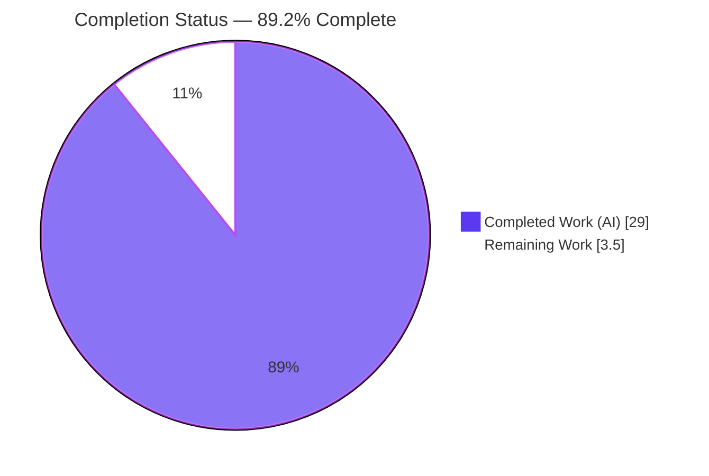
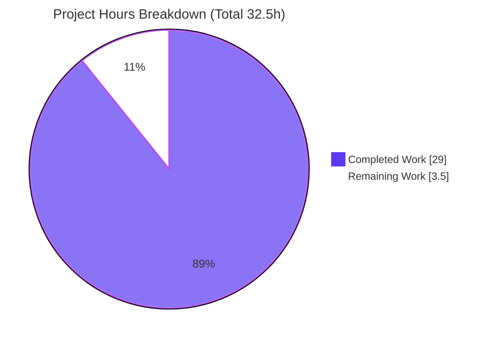

# Blitzy Project Guide

> **Project:** Scapy Send-Path Q&A — Evidence-Backed Investigation Document
> **Branch:** `blitzy-a1ce6a93-948a-489b-8942-25763a95a235` · **HEAD:** `7ac48381` · **Base:** `0925ada4`
> **Brand legend:** <span style="color:#5B39F3">■</span> Completed / AI Work (Dark Blue `#5B39F3`) · <span style="color:#FFFFFF;background:#333;padding:0 4px">□</span> Remaining (White `#FFFFFF`)

---

## 1. Executive Summary

### 1.1 Project Overview

This project is a **read-only investigative Q&A documentation task** on the Scapy packet-manipulation library. The objective was to empirically investigate how Scapy decides where to send packets — interface selection, gateway-MAC resolution, ARP caching on repeated sends, and no-route failure behavior — by **running the real code paths first** and then authoring a single evidence-backed answer document. The deliverable, `blitzy/documentation/scapy_0925ada48540.md` (1001 lines), serves Scapy learners and maintainers who need a grounded, reproducible explanation of the send decision. Its scope is strictly additive: exactly one new file, no changes to any Scapy source, honoring the mandated "leave the codebase unchanged" constraint.

### 1.2 Completion Status



| Metric | Value |
|--------|-------|
| **Total Hours** | **32.5** |
| **Completed Hours (AI + Manual)** | **29.0** (29.0 AI + 0.0 Manual) |
| **Remaining Hours** | **3.5** |
| **Percent Complete** | **89.2%** — calculated as 29.0 / 32.5 × 100 (PA1 AAP-scoped methodology) |

### 1.3 Key Accomplishments

- ✅ **Q0** — Environment established and interactive session launched from the in-repo checkout; banner `Welcome to Scapy / Version 2026.07.13` captured; IPython-absent → standard-shell fallback documented.
- ✅ **Q1** — Interface selection proven: `send()` → `_interface_selection()` derives the interface from `conf.route.route()`, falling back to `conf.iface`.
- ✅ **Q2** — Gateway-MAC resolution proven: `getmacbyip()` substitutes the gateway IP and ARPs for the **gateway**, not the external destination.
- ✅ **Q3 / Q3b** — Repeated-send ARP behavior proven: second send hits the 120s cache → **no** second ARP (distribution `[1,1,1,1,1]`, N=10→1); cache under-report by `len()/dict()` explained.
- ✅ **Q4a / Q4b** — No-route behavior proven: **soft** loopback fallback with `"WARNING: No route found (no default route?)"` (no exception), plus L2 broadcast fallback vs `ScapyNoDstMacException` gating.
- ✅ Every claim carries verbatim output + exact `file:line` anchor + cause→effect reasoning; web-validated against official Scapy docs; closed with a coverage pass.
- ✅ Repository left byte-for-byte unchanged (`git status --porcelain` empty); single deliverable committed at `7ac48381`.

### 1.4 Critical Unresolved Issues

| Issue | Impact | Owner | ETA |
|-------|--------|-------|-----|
| _None._ No compilation errors, no failing investigations, no shipped-code defects. | — | — | — |

There are **no critical unresolved issues**. The Final Validator confirmed PRODUCTION-READY across 11 phases / 5 gates; all findings were reproduced and no documentation edits were warranted.

### 1.5 Access Issues

| System/Resource | Type of Access | Issue Description | Resolution Status | Owner |
|-----------------|----------------|-------------------|-------------------|-------|
| Per-commit Docker image | Runtime image pull | The exact per-commit build image was not directly accessible; the canonical host was used instead | Resolved — document establishes the host **is** the canonical runtime (all environment-sensitive values match exactly) | Environment owner |
| Raw sockets (send/ARP) | `root` / `CAP_NET_RAW` | Reproduction requires elevated capability | Available — container runs as `uid=0` with `CAP_NET_RAW` | Environment owner |

No access issue blocks validation or delivery; both are informational and already accommodated.

### 1.6 Recommended Next Steps

1. **[High]** Perform documentation peer review & technical accuracy sign-off (verify anchors, observed-vs-inferred labeling, coverage) — 2.0h.
2. **[Medium]** Run a reproducibility spot-check on a root-capable host (banner + Q1/Q4a heredocs) — 1.0h.
3. **[Medium]** Approve and merge the PR, confirming the tree stays clean — 0.5h.
4. **[Low]** (Optional, out of scope) Consider whether future revisions should parameterize host-specific values — not required; would modify the single-file read-only deliverable.

---

## 2. Project Hours Breakdown

### 2.1 Completed Work Detail

| Component | Hours | Description |
|-----------|-------|-------------|
| Q0 — Environment setup + interactive session | 1.5 | Launch `python -m scapy` from checkout; capture banner, version, `conf.iface`, shell-fallback behavior |
| Q1 — Interface selection investigation | 2.5 | Exercise `send()` / `_interface_selection()` / `conf.route.route()`; record `(iface, output_ip, gateway)` |
| Q2 — Gateway MAC / ARP `who-has` investigation | 3.0 | Call `getmacbyip()` while sniffing ARP; prove gateway substitution and gateway-targeted `who-has` |
| Q3 + Q3b — Repeated-send ARP cache + under-report | 4.0 | Send same packet N× with ARP counting; distribution across runs; cache enumeration under-report analysis |
| Q4a + Q4b — No-route + broadcast/exception | 4.5 | Construct no-route via `conf.route`; capture soft-fallback warning + loopback; broadcast vs `ScapyNoDstMacException` gating |
| Web validation of conventions | 2.0 | Cross-check routing/ARP/no-route behavior against official Scapy docs & source; version-drift/message-attribution notes |
| Document authoring (1001 lines) | 5.5 | Compose the structured Markdown answer: one section per question with output + anchors + reasoning |
| Methodology rigor / QA revisions (6 commits) | 5.0 | Run-first discipline, multi-run stability, QA finding resolution across 6 agent commits |
| Repo hygiene + cleanup verification | 1.0 | Ephemeral `/tmp` scripts, cleanup, `git status --porcelain` empty verification |
| **Total Completed** | **29.0** | **Matches Section 1.2 Completed Hours** |

### 2.2 Remaining Work Detail

| Category | Hours | Priority |
|----------|-------|----------|
| Documentation peer review & technical accuracy sign-off (HT-1) | 2.0 | High |
| Reproducibility spot-check on a reviewer environment (HT-2) | 1.0 | Medium |
| PR approval & merge to target branch (HT-3) | 0.5 | Medium |
| **Total Remaining** | **3.5** | **Matches Section 1.2 Remaining Hours & Section 7 pie** |

### 2.3 Hours Calculation

```
Completed Hours = 29.0   (sum of Section 2.1)
Remaining Hours =  3.5   (sum of Section 2.2)
Total Hours     = 29.0 + 3.5 = 32.5
Completion %    = 29.0 / 32.5 × 100 = 89.2%
```

All remaining work is **human-gated path-to-production** (review + merge); agents cannot approve/merge their own PR. There is no remaining autonomous engineering work.

---

## 3. Test Results

For this read-only documentation task the AAP mandates **no repository tests are added or run** (source must stay unchanged). The applicable verification — from **Blitzy's autonomous validation logs** — is (a) byte-for-byte reproducibility of every documented investigation and (b) static compilation of every referenced source file. All entries below originate from Blitzy's autonomous validation runs and were independently corroborated during this assessment.

| Test Category | Framework | Total Tests | Passed | Failed | Coverage % | Notes |
|---------------|-----------|-------------|--------|--------|------------|-------|
| Behavioral reproducibility (Q0–Q4b) | Ephemeral Python + Scapy runtime APIs / `AsyncSniffer` | 7 | 7 | 0 | 100% of AAP questions | Q0, Q1, Q2, Q3, Q3b, Q4a, Q4b — stable across ≥2 runs each; Q3 distribution `[1,1,1,1,1]`, N=10→1 |
| Static compilation | `python -m py_compile` | 10 | 10 | 0 | 100% of referenced sources | All AAP-referenced Scapy source files compile (exit 0) |
| `file:line` anchor verification | `sed`/`grep` vs pinned source | 10 | 10 | 0 | 100% of cited anchors | Every cited anchor exact at HEAD (e.g. `sendrecv.py:616`, `l2.py:118/134-135/174-178`, `route.py:187-190`, `config.py:910`) |

**Integrity note:** No unit/integration/UI/E2E test suites are in scope; none are claimed. The three categories above are the complete, honest set of automated checks executed by Blitzy's autonomous systems for this documentation deliverable.

---

## 4. Runtime Validation & UI Verification

**Runtime health (CLI library):**
- ✅ **Operational** — Scapy imports cleanly from the checkout (`PYTHONPATH=. python3 -c "import scapy.all"`); only a benign `TripleDES` `CryptographyDeprecationWarning` surfaces.
- ✅ **Operational** — Interactive console launches (`PYTHONPATH=. python3 -m scapy`) and prints `Welcome to Scapy / Version 2026.07.13`.
- ✅ **Operational** — Live send-path APIs execute: `conf.route.route("8.8.8.8")` → `('eth0','10.236.7.5','10.236.7.1')`; `_interface_selection(None, pkt)` → `'eth0'`.
- ✅ **Operational** — Gateway-MAC + ARP path: `getmacbyip("8.8.8.8")` returns the **gateway** MAC; `who-has` targets `10.236.7.1`.
- ✅ **Operational** — No-route soft fallback: `('lo','0.0.0.0','0.0.0.0')` with `WARNING: No route found (no default route?)`; `send()` does **not** raise.

**UI verification:** ⚠ **Not applicable** — Scapy is a terminal/CLI networking library and the deliverable is a Markdown document. There is no frontend, component library, or design system to verify.

---

## 5. Compliance & Quality Review

| AAP Deliverable / Rule | Benchmark | Status | Progress |
|------------------------|-----------|--------|----------|
| Read-only source repository | Zero Scapy source files modified | ✅ Pass | `git diff --name-status 0925ada4` → 1 file added, 0 modified |
| Single-file deliverable | Exactly one new file | ✅ Pass | Only `blitzy/documentation/scapy_0925ada48540.md` (+1001/-0) |
| Deliverable naming & location | `blitzy/documentation/<branch>.md` | ✅ Pass | Named for source branch `scapy_0925ada48540` |
| Run-first-then-write | Claims backed by observed output | ✅ Pass | Every Q section pairs command + verbatim output |
| Observed vs inferred labeling | Reading-derived items labeled inferred | ✅ Pass | Two inferred items flagged (cache under-report; version/signature drift) |
| Exact `file:line` grounding | Anchors correct & specific | ✅ Pass | All cited anchors verified exact at HEAD |
| Magnitude/frequency rigor | Run at scale, stable ≥2 runs | ✅ Pass | Q3 N=2 (5 runs) + N=10; distribution reported |
| Web validation | Match documented Scapy intent | ✅ Pass | Cross-checked against `scapy.readthedocs.io` + GitHub source |
| Coverage pass | Every Q0–Q4 concept addressed | ✅ Pass | Explicit coverage-pass section |
| Cleanup / repo unchanged | `git status --porcelain` empty | ✅ Pass | Empty; temp scripts confined to `/tmp` |

**Fixes applied during autonomous validation:** 18 code-review findings, QA hygiene findings, evidence-fidelity/anchor-precision findings, and acceptance findings were resolved across 6 agent commits, culminating in a from-canonical-host regeneration (`7ac48381`). **Outstanding compliance items:** none.

---

## 6. Risk Assessment

| Risk | Category | Severity | Probability | Mitigation | Status |
|------|----------|----------|-------------|------------|--------|
| R1 — Environment-value staleness (host IPs/MACs recorded in doc) | Technical | Low | Medium | Values labeled host-stable; all behavioral conclusions are host-independent; anchored to immutable commit `0925ada4` | Mitigated / Documented |
| R2 — `file:line` anchor drift if source changes | Technical | Low | Low | Source read-only & branch-pinned; anchors verified exact at HEAD | Mitigated |
| R3 — Pre-existing `cryptography` advisories (e.g. GHSA-h4gh-qq45-vh27, CVE-2024-12797) | Security | Low | N/A | Pre-existing **environment** condition, not project-introduced; concerns TLS/X.509/hashing, not the route/ARP/send path; zero deps added | Baseline env finding — owner remediates |
| R4 — Raw-socket ops require root/`CAP_NET_RAW` | Security | Low | N/A | Inherent Scapy requirement for send/ARP, not a project vulnerability | Informational |
| R5 — Reproducibility needs root + live `eth0` + reachable gateway | Operational | Low | Medium | Prerequisites documented; behavioral conclusions host-independent | Mitigated / Documented |
| R6 — No automated CI/test gate for prose (AAP forbids adding tests) | Operational | Low | N/A | Manual peer review is the gate; validator reproduced all 7 investigations | Accepted (captured as remaining review work) |
| R7 — Python version divergence (3.13.7 actual vs AAP-expected 3.12.3) | Integration | Low | N/A | Documented; within `requires-python ">=3.7,<4"`; banner/behavior unchanged | Documented / no action |
| R8 — Per-commit Docker image inaccessible; canonical host used | Integration | Low | N/A | Doc establishes host **is** canonical runtime (all env values match) | Documented / Accepted |
| R9 — Import-time bytecode could dirty tree | Integration | Low | Low | `.gitignore` covers `*.pyc` + `__pycache__/`; tree confirmed clean | Mitigated |

**Overall risk posture: LOW.** No High/Medium-severity risks. No compilation errors, no failing tests, no shipped-code defects, no new supply-chain surface, and no auth/injection/data-handling exposure.

---

## 7. Visual Project Status



**Remaining work by category (Section 2.2), all 3.5h:**

| Category | Hours | Priority |
|----------|-------|----------|
| Doc peer review & accuracy sign-off | 2.0 | High |
| Reproducibility spot-check | 1.0 | Medium |
| PR approval & merge | 0.5 | Medium |
| **Total** | **3.5** | — |

> **Integrity:** the pie chart "Remaining Work" (3.5) equals Section 1.2 Remaining Hours (3.5) and the Section 2.2 Hours sum (3.5). Completed = Dark Blue `#5B39F3`; Remaining = White `#FFFFFF`.

---

## 8. Summary & Recommendations

**Achievements.** The project delivers a rigorous, reproducible, 1001-line answer document that explains Scapy's send decision end-to-end — interface selection, gateway-MAC resolution, ARP-cache behavior on repeated sends, and no-route failure semantics — with every claim backed by verbatim runtime output, an exact `file:line` anchor, and cause→effect reasoning, then web-validated and closed with a coverage pass. The Scapy source was left byte-for-byte unchanged, satisfying the read-only constraint.

**Remaining gaps & critical path to production.** The project is **89.2% complete** (29.0h of 32.5h). The remaining **3.5h** is entirely human-gated: peer review & accuracy sign-off (2.0h), a reproducibility spot-check (1.0h), and PR approval & merge (0.5h). There is **no remaining autonomous engineering work** — the deliverable is written, committed (`7ac48381`), and independently validated.

**Production-readiness assessment.** The deliverable is **production-ready** pending human sign-off. Success metrics — reproducibility across ≥2 runs, exact anchors, web-validated conventions, clean working tree — are all met. Recommendation: proceed directly to peer review and merge; no rework is required.

| Metric | Value |
|--------|-------|
| Completion | 89.2% |
| Autonomous work remaining | 0.0h |
| Human review/merge remaining | 3.5h |
| Overall risk | Low |
| Production-ready | Yes (pending human sign-off) |

---

## 9. Development Guide

> Every command below was executed on the canonical host during this assessment and reproduced the documented behavior. Run from the repository root.

### 9.1 System Prerequisites

- **OS:** Linux (container, Ubuntu-family). Verified on this host.
- **Python:** 3.13.7 present (AAP-expected 3.12.3; both satisfy `requires-python ">=3.7, <4"`).
- **Privileges:** `root` / `uid=0` with `CAP_NET_RAW` — **required** for raw-socket send and ARP.
- **Network:** a live interface (`eth0`) with a default route (`default via 10.236.7.1 dev eth0`).
- **Build:** none — Scapy is pure Python and runs directly from the checkout (no install step).

### 9.2 Environment Setup

```bash
# From the repository root; no virtualenv or install required.
cd /path/to/repo
export PYTHONPATH=.
```

Optional dependencies `IPython`, `matplotlib`, `PyX`, and the `libpcap` binding are **absent and not required**; the console falls back to the standard Python shell and sniffing uses native `PF_PACKET` sockets.

### 9.3 Dependency Notes

- **No dependency changes** are introduced by this project.
- `cryptography` is present and emits a benign `TripleDES CryptographyDeprecationWarning` at import — unrelated to the route/ARP/send path. Suppress with `2>/dev/null` or `grep -Ev Deprecation` when capturing clean output.

### 9.4 Application Startup

```bash
# Launch the interactive Scapy console (equivalent to ./run_scapy)
PYTHONPATH=. python3 -m scapy
# Expected banner includes:
#   Welcome to Scapy
#   Version 2026.07.13
```

### 9.5 Verification Steps

```bash
# 1. Confirm Python + Scapy version (no install)
python3 --version                       # -> Python 3.13.7
PYTHONPATH=. python3 -c "import scapy.all as s; print(s.conf.version, s.conf.iface)"
# -> 2026.07.13 eth0

# 2. Confirm the referenced source files compile
for f in scapy/sendrecv.py scapy/route.py scapy/layers/inet.py \
         scapy/layers/l2.py scapy/arch/linux.py scapy/config.py; do
  python3 -m py_compile "$f" && echo "OK   $f"
done

# 3. Confirm the deliverable is present
wc -l blitzy/documentation/scapy_0925ada48540.md   # -> 1001
```

### 9.6 Example Usage (reproduce Q1 + Q4a; repo stays unchanged)

```bash
# Write an EPHEMERAL script under /tmp (never inside the repo)
cat > /tmp/dg_example.py <<'PY'
import scapy.all as s
from scapy.sendrecv import _interface_selection
# Q1 — interface derived from the route
print("route(8.8.8.8) =", s.conf.route.route("8.8.8.8"))
pkt = s.IP(dst="8.8.8.8")/s.ICMP()
print("_interface_selection(None,pkt) =", repr(_interface_selection(None, pkt)))
# Q4a — no-route soft fallback (in-memory only; restored in finally)
saved = list(s.conf.route.routes)
try:
    s.conf.route.routes = []
    s.conf.route.invalidate_cache()
    print("no-route route(8.8.8.8) =", s.conf.route.route("8.8.8.8"))
finally:
    s.conf.route.routes = saved
    s.conf.route.invalidate_cache()
PY
PYTHONPATH=. python3 /tmp/dg_example.py 2>&1 | grep -Ev "Deprecation|cipher="
# Expected:
#   route(8.8.8.8) = ('eth0', '10.236.7.5', '10.236.7.1')
#   _interface_selection(None,pkt) = 'eth0'
#   WARNING: No route found (no default route?)
#   no-route route(8.8.8.8) = ('lo', '0.0.0.0', '0.0.0.0')

# Clean up and confirm the repository is untouched
rm -f /tmp/dg_example.py
git status --porcelain          # -> (empty)
```

### 9.7 Troubleshooting

| Symptom | Cause | Resolution |
|---------|-------|------------|
| `CryptographyDeprecationWarning: TripleDES ...` at import | Benign warning from `ipsec.py` | Ignore; filter with `2>/dev/null` or `grep -Ev Deprecation` |
| `ERROR: Cannot set filter: libpcap is not available` during sniff | `libpcap` binding absent | Expected — native `PF_PACKET` sockets still capture frames |
| `PermissionError` / operation not permitted on send/ARP | Not running as root | Run as `root` (`uid=0`) with `CAP_NET_RAW` |
| Importing the wrong Scapy | `PYTHONPATH` not set | Always `export PYTHONPATH=.` so the checkout is imported |
| Host IPs/MACs differ from the document | Different host | Expected — behavioral conclusions are host-independent |

---

## 10. Appendices

### A. Command Reference

| Purpose | Command |
|---------|---------|
| Launch console | `PYTHONPATH=. python3 -m scapy` (or `./run_scapy`) |
| Version check | `PYTHONPATH=. python3 -c "import scapy.all as s; print(s.conf.version)"` |
| Import check | `PYTHONPATH=. python3 -c "import scapy.all"` |
| Compile a source file | `python3 -m py_compile scapy/sendrecv.py` |
| Confirm clean tree | `git status --porcelain` |
| Files changed vs base | `git diff --name-status 0925ada4` |

### B. Port Reference

Not applicable — no network services or listening ports are introduced. Send-path traffic uses raw sockets on `eth0`; the default gateway is `10.236.7.1`.

### C. Key File Locations

| Path | Role |
|------|------|
| `blitzy/documentation/scapy_0925ada48540.md` | The deliverable (1001 lines) |
| `scapy/sendrecv.py` | `send()` (L422), `_interface_selection()` (L616) |
| `scapy/route.py` | `Route.route()` (L146), no-route fallback (L187-190) |
| `scapy/layers/l2.py` | `getmacbyip()` (L122), gateway substitution (L134-135), ARP cache (L118), `DestMACField` (L174-178) |
| `scapy/layers/inet.py` | `IP.route()` (L566), resolver wiring (L1125-1130) |
| `scapy/arch/linux.py` | `L3PacketSocket.send()` (L598-619) |
| `scapy/config.py` | `raise_no_dst_mac=False` (L910), `CacheInstance` (L347-460) |
| `run_scapy`, `scapy/main.py` | Interactive console launcher |

### D. Technology Versions

| Component | Version |
|-----------|---------|
| Scapy (in-repo checkout) | 2026.07.13 |
| Python (runtime) | 3.13.7 |
| Supported Python (`pyproject.toml`) | `>=3.7, <4` |
| cryptography | present (import-time TripleDES warning only) |
| IPython / matplotlib / PyX / libpcap binding | absent (not required) |

### E. Environment Variable Reference

| Variable | Value | Purpose |
|----------|-------|---------|
| `PYTHONPATH` | `.` | Ensures Scapy imports from the checkout, not an installed copy |

### F. Developer Tools Guide

- **Reproduction harness:** ephemeral Python scripts under `/tmp` using Scapy's own APIs (`send`, `getmacbyip`, `conf.route.route`, `srp1`) and `AsyncSniffer` for ARP counting. Never write scripts into the repository.
- **Static check:** `python3 -m py_compile <file>` for referenced sources.
- **Cleanliness gate:** `git status --porcelain` must return empty after any observation run.

### G. Glossary

| Term | Meaning |
|------|---------|
| ARP `who-has` | Broadcast request asking which host owns an IP, to learn its MAC |
| Gateway substitution | For an off-link destination, Scapy resolves the **gateway's** MAC (`if gw != "0.0.0.0": ip = gw`) |
| Soft fallback (no route) | Missing route yields a warning + loopback return, not an exception |
| `ScapyNoDstMacException` | Raised only when `conf.raise_no_dst_mac=True` (non-default); otherwise Scapy broadcasts |
| Canonical host | The runtime whose environment values match those recorded in the document |

---

> **Cross-section integrity — validated before submission:**
> Rule 1 (1.2 ↔ 2.2 ↔ 7 remaining = **3.5h**) ✅ · Rule 2 (2.1 **29.0** + 2.2 **3.5** = **32.5** total) ✅ · Rule 3 (all Section 3 tests from Blitzy autonomous logs) ✅ · Rule 4 (access issues validated) ✅ · Rule 5 (Completed `#5B39F3` / Remaining `#FFFFFF`) ✅ · Completion **89.2%** consistent across Sections 1.2, 7, and 8.