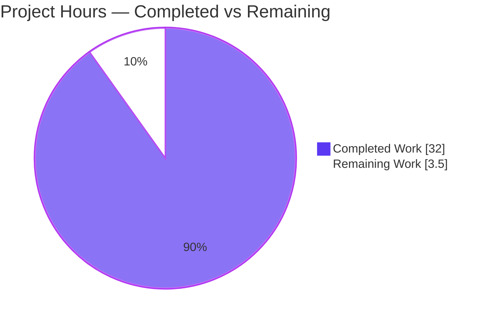
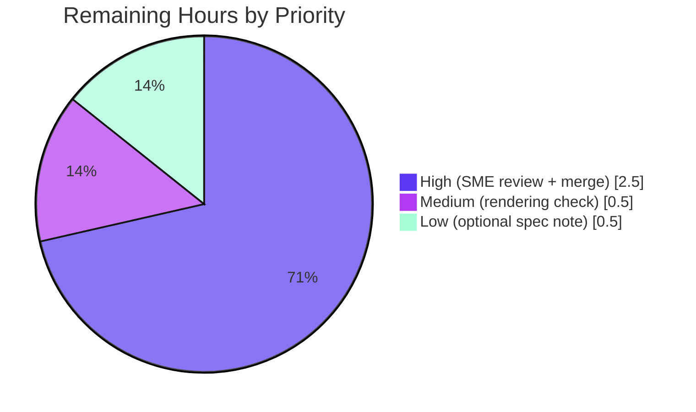

# Blitzy Project Guide — Scapy Send/Route/ARP Onboarding Documentation

> **Brand color legend** — **Completed / AI Work:** Dark Blue `#5B39F3` · **Remaining / Not Completed:** White `#FFFFFF` · **Headings / Accents:** Violet-Black `#B23AF2` · **Highlight:** Mint `#A8FDD9`

---

## 1. Executive Summary

### 1.1 Project Overview

This project delivers a single authoritative, code-grounded onboarding document — `blitzy/documentation/scapy_0925ada48540.md` — that explains how the Scapy packet-manipulation library decides *where* and *how* to send packets. It answers five engineer-posed questions (route resolution, interface selection, gateway-MAC/ARP for external destinations, ARP-cache behavior on repeated sends, and no-route failure semantics). The audience is engineers onboarding to the Scapy codebase. Every answer is traced to specific `scapy/*` source lines at commit `0925ada4` and corroborated by live behavioral verification. It is a purely additive, documentation-only change: zero existing repository files are modified.

### 1.2 Completion Status

**AAP-scoped completion: `90.1%`** (32.0 completed hours of 35.5 total hours).


| Metric | Hours |
|--------|-------|
| **Total Hours** | **35.5** |
| **Completed Hours (AI + Manual)** | **32.0** (32.0 AI + 0.0 Manual) |
| **Remaining Hours** | **3.5** |
| **Percent Complete** | **90.1%** |

### 1.3 Key Accomplishments

- ✅ Authored the complete 792-line deliverable `blitzy/documentation/scapy_0925ada48540.md` answering all five questions, each with (a) a direct answer, (b) a cited code walkthrough, and (c) reproducible evidence.
- ✅ Grounded every answer in source: ~119 `file:line` citation references across 8 Scapy source files (`route.py`, `sendrecv.py`, `layers/l2.py`, `layers/inet.py`, `arch/linux.py`, `config.py`, `data.py`, `__init__.py`).
- ✅ Verified behavior live by running Scapy from repo source — route resolution returns the `(interface, output_ip, gateway_ip)` triple and `send()` reports `Sent 1 packets.`
- ✅ Proved the subtle Q3 claim with a rigorous experiment: on the plain-L3 send path Scapy itself (not the kernel) resolves the **gateway** MAC before `sendto` (operation order `bind → srp1(who-has gateway) → sendto`).
- ✅ Captured the exact verbatim strings required (notably `No route found (no default route?)` and `Mac address to reach destination not found. Using broadcast.`).
- ✅ Honored every hard constraint: ZERO existing files modified, deliverable correctly named and placed, temporary verification scripts kept under `/tmp` (never committed). `git status` is clean.

### 1.4 Critical Unresolved Issues

| Issue | Impact | Owner | ETA |
|-------|--------|-------|-----|
| None | No unresolved issues block release or validation. All five validation gates passed with zero fixes required. | — | — |

### 1.5 Access Issues

| System/Resource | Type of Access | Issue Description | Resolution Status | Owner |
|-----------------|----------------|-------------------|-------------------|-------|
| — | — | No access issues identified. The repository, Python venv (editable Scapy), and required network tools (tcpdump, iproute2, libpcap) were all accessible during autonomous validation. | N/A | — |

### 1.6 Recommended Next Steps

1. **[High]** Have a Scapy/networking SME review the document for technical accuracy and onboarding fitness (≈2.0h).
2. **[High]** Approve and merge the pull request (single additive file); confirm the working tree stays clean (≈0.5h).
3. **[Medium]** Verify the Mermaid flowchart and tables render correctly in the target Markdown viewer (≈0.5h).
4. **[Low]** Decide whether to propagate the documented §4.8.2 route-tuple-order correction `(interface, output_ip, gateway_ip)` to the upstream tech spec (out of this task's code scope; ≈0.5h).

---

## 2. Project Hours Breakdown

### 2.1 Completed Work Detail

| Component | Hours | Description |
|-----------|-------|-------------|
| Environment setup & run-from-source verification | 1.5 | Confirmed editable Scapy install from repo root; populated `conf.route`/`conf.iface` via `import scapy.all`; captured container routing baseline as the evidence backdrop. |
| Source-code investigation & citation tracing (7 subsystems) | 8.0 | Static trace of routing (`route.py`), send path (`sendrecv.py`), ARP/`getmacbyip`/`DestMACField` (`layers/l2.py`), `IP.route` delegation (`layers/inet.py`), L3 socket (`arch/linux.py`), and the timeout cache (`config.py`); identified ~119 precise `file:line` citations. |
| Q1 — "where to send" (route resolution) | 2.0 | Part 2: longest-prefix match returning `(interface, output_ip, gateway_ip)`; walkthrough + three live route-tuple evidence cases. |
| Q2 — interface selection | 1.5 | Part 3: `send()` → `_interface_selection()` → `packet.route()[0]`, falling back to `conf.iface`; walkthrough + live evidence. |
| Q3 — external-destination MAC (incl. L3-path correction) | 4.0 | Part 4: gateway next-hop swap, ARP resolves the gateway's MAC, and the plain-L3 proof that Scapy (not the kernel) resolves the MAC; includes the second-commit correction with a new real-`L3PacketSocket` operation-order experiment. |
| Q4 — double-send ARP cache | 1.5 | Part 5: 120-second `_arp_cache` hit on the repeated send; walkthrough + `srp1`-count evidence (stays at 1 across two resolutions). |
| Q5 — no-route failure & exact message | 2.5 | Part 6: graceful degradation (no exception by default), verbatim warning strings, and the conditional `ScapyNoDstMacException`; walkthrough + two evidence blocks. |
| Primer + Summary sections | 2.5 | Part 1 network-stack primer, run notes, and container baseline; Part 7 decision table, verbatim strings, §4.8.2 accuracy note, end-to-end Mermaid flow, and key takeaways. |
| Behavioral verification scripting & experiments | 4.0 | Eight throwaway `/tmp` scripts including the real `L3PacketSocket.send` op-order experiment, `srp1` cache-count, no-route send, and L2 dest-MAC fallback/exception. |
| Web-search corroboration | 0.5 | One targeted search validating `getmacbyip`/routing/tuple-order against official Scapy documentation. |
| Final validation & QA | 4.0 | Re-verified ~119 citations char-for-char; reproduced every evidence block live; structural lint (balanced fences, valid Mermaid, consistent tables); repo-integrity checks confirming zero existing files changed. |
| **Total Completed** | **32.0** | |

### 2.2 Remaining Work Detail

| Category | Hours | Priority |
|----------|-------|----------|
| SME technical review of the document (verify the five answers, ~119 citations, and onboarding fitness) | 2.0 | High |
| Markdown/Mermaid rendering verification in the target viewer | 0.5 | Medium |
| Stakeholder sign-off & PR merge | 0.5 | High |
| (Optional) Decide on propagating the §4.8.2 route-tuple-order correction upstream | 0.5 | Low |
| **Total Remaining** | **3.5** | |

### 2.3 Hours Reconciliation

- Section 2.1 Completed (**32.0h**) + Section 2.2 Remaining (**3.5h**) = **35.5h** Total Project Hours (matches Section 1.2). ✓
- Section 2.2 Remaining (**3.5h**) equals the Section 1.2 Remaining Hours and the Section 7 "Remaining Work" value. ✓

---

## 3. Test Results

> **Integrity note.** This is a documentation-only task; per the AAP, no unit/integration tests were added or modified, and Scapy's own `.uts` regression suite is out of scope. The entries below are the **autonomous validation activities Blitzy actually executed** against the deliverable (the Final Validator's five gates), summarized faithfully from the validation logs.

| Validation Category | Method / Framework | Total Checks | Passed | Failed | Coverage | Notes |
|---------------------|--------------------|-------------|--------|--------|----------|-------|
| Citation accuracy verification | `sed`/source diff vs `scapy/*` at commit `0925ada4` | ~119 (≈70 unique) | ~119 | 0 | 100% of citations | Every cited `file:line` matched the actual source, including 4 verbatim warning/error strings. |
| Behavioral reproduction (Q1–Q5 evidence) | Live Scapy from repo + throwaway `/tmp` scripts | 8 evidence blocks | 8 | 0 | All 5 questions | Route tuples, gateway-MAC ARP target, L3 op-order, ARP cache-count, no-route send, and L2 MAC fallback/exception all reproduced exactly. |
| Runtime / live execution | `run_scapy` + `send(IP/ICMP)` | 4 | 4 | 0 | Core send path | Scapy runs editable from repo (v2026.06.26); `send()` reports `Sent 1 packets.` |
| Document structural validation | Custom structural lint | 1 doc (792 lines) | Pass | 0 issues | Fences/Mermaid/tables | 70 balanced code fences; 1 valid Mermaid flowchart; consistent tables; no heading jumps or empty links. |
| Repository integrity | `git diff` / `git status` | 1 | Pass | 0 | Whole tree | Working tree clean; `0925ada4..HEAD` shows only the single added file (792 insertions, 0 deletions). |

**Aggregate:** 5 validation categories, **all passing**, **0 failures**, **0 fixes required**.

---

## 4. Runtime Validation & UI Verification

This deliverable is a Markdown document, not a runnable application or UI; "runtime validation" here means running the **library under study** from source to confirm the documented behavior. No UI exists, so no UI/visual verification applies.

- ✅ **Operational** — Scapy imports and runs editable from the repository root (`scapy.__file__` resolves to repo; version `2026.06.26`).
- ✅ **Operational** — Route resolution: `conf.route.route('8.8.8.8')` → `('eth0', '10.236.12.185', '10.236.12.1')`; `conf.route.route('127.0.0.1')` → `('lo', '127.0.0.1', '0.0.0.0')`.
- ✅ **Operational** — Interface selection: `_interface_selection(None, IP(dst='8.8.8.8'))` → `'eth0'`.
- ✅ **Operational** — ARP cache: `scapy.layers.l2._arp_cache.timeout` → `120` seconds.
- ✅ **Operational** — Live send: `send(IP(dst='127.0.0.1')/ICMP(), verbose=1)` → `Sent 1 packets.`
- ✅ **Operational** — No-route path: clearing the in-memory table yields the warning `No route found (no default route?)`, a loopback fallback, and a successful send with **no exception** (graceful degradation by default).
- ⚠ **Partial (human step)** — Mermaid flowchart rendering depends on the target Markdown viewer; verify in the destination portal/GitHub (covered by remaining task; GitHub renders Mermaid natively).
- ❌ **Failing** — None.

---

## 5. Compliance & Quality Review

Cross-mapping of AAP deliverables and binding rules (rule set `SWE-AtlasQnA-Repo`) to their verification status.

| Requirement / Rule | Benchmark | Status | Notes |
|--------------------|-----------|--------|-------|
| Q1 — where to send | Route resolution documented & verified | ✅ Pass | `Route.route` longest-prefix → `(interface, output_ip, gateway_ip)`; 3 live tuples. |
| Q2 — interface selection | Documented & verified | ✅ Pass | `_interface_selection` → `packet.route()[0]` else `conf.iface`; live evidence. |
| Q3 — external-destination MAC | Documented & verified | ✅ Pass | Gateway next-hop swap + ARP; Scapy (not kernel) resolves MAC on L3 path (op-order proof). |
| Q4 — double-send ARP | Documented & verified | ✅ Pass | 120s `_arp_cache` hit; `srp1` count stays 1. |
| Q5 — no-route failure & exact message | Documented & verified | ✅ Pass | Graceful degradation + verbatim strings + conditional `ScapyNoDstMacException`. |
| Code-grounded with `file:line` citations | "Code is the source of truth" | ✅ Pass | ~119 citations, all spot-checks accurate. |
| Verbatim exact strings | Exact transcription | ✅ Pass | All 4 warning/error strings match char-for-char. |
| Reasoning / rationale included | "Provide thinking/rationale" | ✅ Pass | Each question includes explicit rationale + interpretation. |
| Build & run to analyze | Empirical verification | ✅ Pass | Behavior reproduced live from repo source. |
| Do NOT modify existing files | Repo integrity | ✅ Pass | `git diff 0925ada4..HEAD` = add-only; 0 deletions. |
| Do NOT add other code | Single deliverable | ✅ Pass | Only `blitzy/documentation/scapy_0925ada48540.md` added. |
| Output location & filename | `blitzy/documentation/<branch>.md` | ✅ Pass | Correctly named `scapy_0925ada48540.md`. |
| Temp scripts never committed | Process constraint | ✅ Pass | No stray scripts tracked; `/tmp` only. |
| Route-tuple-order correction | Accuracy directive | ✅ Pass | §4.8.2 correction noted inside the document only. |

**Fixes applied during autonomous validation:** None required — the document was already accurate and code-grounded. The prior file-implementation agents had already applied the one substantive refinement (the Q3 plain-L3 send-path correction in commit `80716f88`).

**Outstanding compliance items:** None (autonomous). Human SME sign-off pending (path-to-production).

---

## 6. Risk Assessment

| Risk | Category | Severity | Probability | Mitigation | Status |
|------|----------|----------|-------------|------------|--------|
| Citation line-number drift if Scapy source advances past `0925ada4` | Technical | Low | Medium | Document is explicitly pinned to commit `0925ada4`; re-verify citations if the source is upgraded/rebased. | Mitigated / Documented |
| Behavioral evidence is environment-specific (route IPs `10.236.12.x` reflect the container) | Technical | Low | Medium | Document explains the baseline and that the decision *logic* is host-invariant; only specific IPs differ. | Mitigated |
| No material security exposure | Security | None | — | Documentation-only, additive; no code/dependency/credential/network changes; no secrets; no new attack surface. | Clear / N/A |
| Discoverability — doc lives outside the Sphinx `doc/` tree | Operational | Low | Medium | Intentional per AAP (avoids interfering with the docs build); link from an onboarding index if broader visibility is desired. | Accepted by design |
| Maintenance staleness over time | Operational | Low | Medium | Pinned to commit; schedule periodic re-verification when the routing/ARP subsystems change. | Documented |
| Mermaid diagram may not render in some viewers | Integration | Low | Low–Medium | GitHub renders Mermaid natively; verify in the target viewer (remaining task). | Open (minor) |
| Evidence reproduction needs Scapy-from-repo + root | Integration | Low | Low | Document records the exact setup (`import scapy.all`, run as root for raw sockets). | Mitigated |

Overall risk posture: **Low**. Appropriate for a documentation-only, additive change with zero code modifications.

---

## 7. Visual Project Status

**Project hours breakdown** (Completed = Dark Blue `#5B39F3`, Remaining = White `#FFFFFF`):



**Remaining hours by priority** (3.5h total):



| Status | Hours | Share |
|--------|-------|-------|
| Completed Work | 32.0 | 90.1% |
| Remaining Work | 3.5 | 9.9% |
| **Total** | **35.5** | **100%** |

> Integrity: "Remaining Work" = **3.5h** matches Section 1.2 Remaining Hours and the Section 2.2 "Hours" total exactly.

---

## 8. Summary & Recommendations

**Achievements.** The project is **90.1% complete** on an AAP-scoped basis (32.0 of 35.5 hours). The single mandated deliverable — a 792-line, code-grounded Q&A explaining how Scapy decides where and how to send packets — is authored, committed, and independently validated. All five questions are answered with direct conclusions, precise `file:line` code walkthroughs, explicit rationale, and reproducible live evidence. All five autonomous validation gates passed with **zero fixes required**, and the hard "no existing-file modifications" constraint is fully satisfied (`git diff` is add-only; `git status` is clean).

**Remaining gaps.** The outstanding 3.5 hours are entirely **path-to-production human gates**: an SME technical review (2.0h), rendering verification (0.5h), stakeholder sign-off & merge (0.5h), and an optional decision about propagating the §4.8.2 tuple-order correction upstream (0.5h). There are **no blocking defects, no failing tests, and no compilation issues** — the typical "immediate fixes" backlog is empty.

**Critical path to production.** SME review → rendering check → sign-off & merge. This is a short, low-risk path with no engineering rework required.

**Success metrics.** 5/5 questions answered and verified; ~119/119 citations accurate; 8/8 evidence blocks reproduced; 0 existing files changed; 0 unresolved issues.

**Production-readiness assessment.** The deliverable is **production-ready pending human review**. Given the all-green validation and the additive, low-risk nature of a documentation change, confidence is **High**. Completion is capped below 100% solely because human review and merge remain.

| Metric | Value |
|--------|-------|
| AAP-scoped completion | 90.1% |
| Completed / Total hours | 32.0 / 35.5 |
| Validation gates passed | 5 / 5 |
| Existing files modified | 0 |
| Blocking issues | 0 |
| Confidence | High |

---

## 9. Development Guide

This guide explains how to build, run, and verify the **Scapy-from-source** environment used to produce the deliverable and to reproduce every behavioral-evidence block in it. All commands below were executed and verified during this assessment.

### 9.1 System Prerequisites

- **OS:** Linux (raw-socket sends use `AF_PACKET`; reproductions ran in a Linux container).
- **Python:** 3.13.7 verified. (Scapy declares `>=3.7, <4`; highest documented support is 3.11; 3.13.7 works for verification.)
- **Privileges:** root/`sudo` for raw-socket sends and ARP experiments (`CAP_NET_RAW`).
- **System tools (present):** `tcpdump`, `ip` (iproute2), `ifconfig` (net-tools), `libpcap`, `git` + `git-lfs`.

### 9.2 Environment Setup

The repository already ships a virtual environment at `.venv` with Scapy installed **editable** from the repo root.

```bash
# From the repository root:
.venv/bin/pip show scapy
# Expect: Version: 2026.6.26  and  "Editable project location: <repo root>"
```

> **Critical:** import `scapy.all` (NOT `scapy.config`). Importing `scapy.config` alone leaves `conf.route` and `conf.iface` as `None`; `import scapy.all` initializes them from the OS network configuration.

### 9.3 Dependency Installation (recreate only if needed)

```bash
python3 -m venv .venv
source .venv/bin/activate
pip install -e .            # editable install from the repo root
```

> PEP 668 note: the system Python is externally-managed. Use the `.venv` (preferred) or pass `--break-system-packages` for global installs.

### 9.4 Running Scapy From Source

```bash
# Interactive shell:
./run_scapy

# Non-interactive smoke test (prints the running version):
printf 'conf.version\nexit()\n' | ./run_scapy -H
# -> '2026.06.26'
```

### 9.5 Verification Steps (with expected output)

```bash
# OS routing baseline (the evidence backdrop):
ip route
# -> default via 10.236.12.1 dev eth0
#    10.236.12.0/24 ... src 10.236.12.185
#    172.17.0.0/16 dev docker0 ...

# Q1 — route resolution (tuple order: interface, output_ip, gateway_ip):
.venv/bin/python -c "from scapy.all import conf; print(conf.route.route('8.8.8.8'))"
# -> ('eth0', '10.236.12.185', '10.236.12.1')

# Q2 — interface selection:
.venv/bin/python -c "from scapy.all import IP; from scapy.sendrecv import _interface_selection; print(_interface_selection(None, IP(dst='8.8.8.8')))"
# -> eth0

# Q4 — ARP cache TTL:
.venv/bin/python -c "import scapy.layers.l2 as l2; print(l2._arp_cache.timeout)"
# -> 120

# Live send (Q5 / general send path):
.venv/bin/python -c "from scapy.all import IP, ICMP, send; send(IP(dst='127.0.0.1')/ICMP(), verbose=1)"
# -> Sent 1 packets.
```

### 9.6 Example Usage — Reproducing the Document's Evidence

Behavioral evidence is captured with **throwaway scripts under `/tmp`** (never inside the repo) that monkey-patch `scapy.layers.l2.srp1` to count/inspect ARP `who-has`, or clear `conf.route.routes` in memory to exercise the no-route path. Example (Q4 cache-hit):

```bash
mkdir -p /tmp/blitzy_verify && cat > /tmp/blitzy_verify/q4.py <<'PY'
import scapy.layers.l2 as l2mod
from scapy.all import getmacbyip, ARP, Ether
l2mod._arp_cache.flush()
count = {'n': 0}
def counting_srp1(pkt, *a, **k):
    count['n'] += 1
    return Ether()/ARP(op="is-at", hwsrc="aa:bb:cc:dd:ee:ff", psrc=pkt[ARP].pdst)
l2mod.srp1 = counting_srp1
print("TTL:", l2mod._arp_cache.timeout)
getmacbyip('8.8.8.8'); print("after 1st call, srp1 count =", count['n'])
getmacbyip('8.8.8.8'); print("after 2nd call, srp1 count =", count['n'])
PY
.venv/bin/python /tmp/blitzy_verify/q4.py
# -> TTL: 120 / after 1st call: 1 / after 2nd call: 1   (cache hit, no second ARP)
```

### 9.7 Citation Re-verification & Repository Integrity

```bash
# Verify any cited line, e.g. scapy/route.py:189:
sed -n '189p' scapy/route.py
# -> warning("No route found (no default route?)")

# Confirm the repo is unchanged except for the deliverable:
git status --short                       # (empty output = clean)
git diff --stat 0925ada4..HEAD           # -> only blitzy/documentation/scapy_0925ada48540.md | 792 +
```

### 9.8 Troubleshooting

- **`conf.route` / `conf.iface` are `None`** → you imported `scapy.config`; import `scapy.all` instead.
- **`PermissionError` / socket error on `send()`** → run as root (raw sockets need `CAP_NET_RAW`).
- **Route IPs differ from the document** → expected; the IPs reflect the host's network baseline. The decision *logic* is host-invariant.
- **Mermaid diagram not rendering** → use a Mermaid-capable viewer (GitHub renders it natively).
- **pip `externally-managed-environment`** → use the `.venv` or `--break-system-packages`.

---

## 10. Appendices

### A. Command Reference

| Purpose | Command |
|---------|---------|
| Show Scapy install (editable) | `.venv/bin/pip show scapy` |
| Interactive shell | `./run_scapy` |
| Version smoke test | `printf 'conf.version\nexit()\n' \| ./run_scapy -H` |
| Q1 route resolution | `.venv/bin/python -c "from scapy.all import conf; print(conf.route.route('8.8.8.8'))"` |
| Q2 interface selection | `.venv/bin/python -c "from scapy.all import IP; from scapy.sendrecv import _interface_selection; print(_interface_selection(None, IP(dst='8.8.8.8')))"` |
| Q4 ARP cache TTL | `.venv/bin/python -c "import scapy.layers.l2 as l2; print(l2._arp_cache.timeout)"` |
| Live send | `.venv/bin/python -c "from scapy.all import IP, ICMP, send; send(IP(dst='127.0.0.1')/ICMP(), verbose=1)"` |
| Verify a citation | `sed -n '<N>p' <file>` |
| Repo integrity | `git status --short` · `git diff --stat 0925ada4..HEAD` |

### B. Port Reference

| Port | Service | Notes |
|------|---------|-------|
| — | None | Scapy is a library, not a networked service; no listening ports are opened by this task. |

### C. Key File Locations

| Path | Role |
|------|------|
| `blitzy/documentation/scapy_0925ada48540.md` | **The deliverable** (792 lines). |
| `scapy/route.py` | `Route.route()` longest-prefix match; no-route warning + loopback fallback (Q1, Q5). |
| `scapy/sendrecv.py` | `send()` / `_interface_selection()` (Q2); `Sent %i packets.` |
| `scapy/layers/l2.py` | `_arp_cache`, `getmacbyip()`, gateway swap, `DestMACField` (Q3, Q4, Q5). |
| `scapy/layers/inet.py` | `IP.route()` delegation; `(Ether, IP)` neighbor resolver. |
| `scapy/arch/linux.py` | `L3PacketSocket.send()`; `L2ListenSocket` send guard (Q3). |
| `scapy/config.py` | `CacheInstance` TTL semantics backing `_arp_cache` (Q4). |
| `doc/scapy/routing.rst`, `doc/scapy/usage.rst` | Corroborating official prose (REFERENCE only). |
| `run_scapy` | Interactive launcher. |

### D. Technology Versions

| Component | Version |
|-----------|---------|
| Scapy (editable from repo) | 2026.06.26 (commit `0925ada4`) |
| Python | 3.13.7 |
| tcpdump | 4.99.5 |
| libpcap | 1.10.5 |
| git-lfs | 3.7.1 |

### E. Environment Variable Reference

| Variable | Required? | Notes |
|----------|-----------|-------|
| — | No | No environment variables are required to build, run, or reproduce the deliverable's evidence. |

### F. Developer Tools Guide

| Tool | Use |
|------|-----|
| `run_scapy` | Launch the interactive Scapy session from source. |
| `sed -n '<N>p' <file>` | Re-verify a specific cited source line. |
| `git diff --stat 0925ada4..HEAD` | Confirm the change set is the single added document. |
| `tcpdump` / `ip` | Observe/confirm interface and routing state on the host. |
| Throwaway `/tmp` scripts | Reproduce ARP/no-route behavior without touching the repo. |

### G. Glossary

| Term | Definition |
|------|------------|
| `conf.route` | Scapy's own IPv4 routing table (mirrored from the OS), consulted on every send. |
| `conf.iface` | The default network interface Scapy falls back to when no route is found. |
| Route triple | `(interface, output_ip, gateway_ip)` returned by `Route.route(dst)`. |
| `_arp_cache` | Scapy's 120-second ARP cache mapping next-hop IP → MAC. |
| `getmacbyip` | Function resolving an IP to a MAC (gateway MAC for off-subnet destinations). |
| `ScapyNoDstMacException` | Exception raised on MAC-resolution failure only when `conf.raise_no_dst_mac` is enabled. |
| Gateway next-hop swap | `if gw != "0.0.0.0": ip = gw` — resolve the gateway's MAC for external destinations. |
| UTscapy (`.uts`) | Scapy's native regression-test format (out of scope for this documentation task). |

---

*This guide reflects AAP-scoped completion measured by autonomous engineering hours. Completed = `#5B39F3`; Remaining = `#FFFFFF`. All numbers are consistent across Sections 1.2, 2.1, 2.2, and 7 (Completed 32.0h · Remaining 3.5h · Total 35.5h · 90.1% complete).*