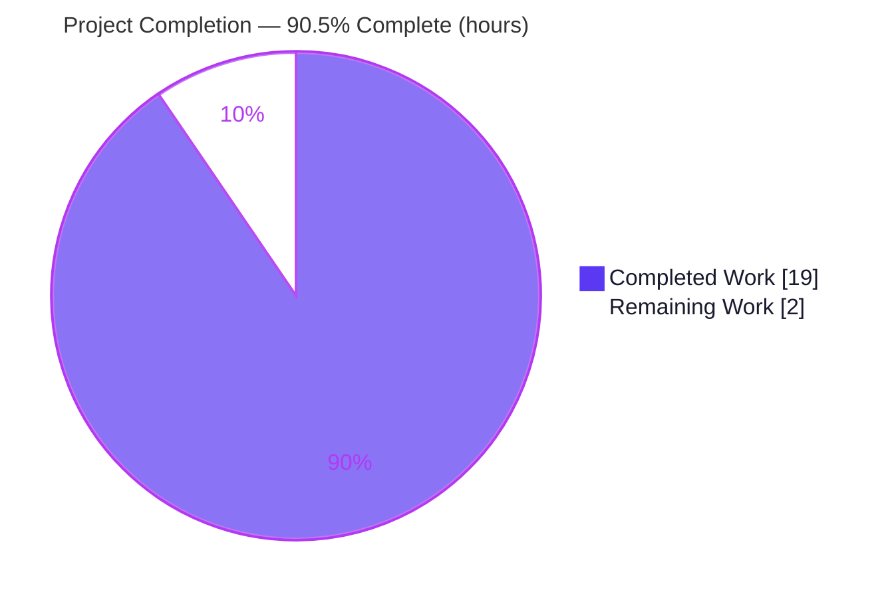

# Blitzy Project Guide — Scapy Runtime-Behavior Q&A Documentation

> Brand legend: <span style="color:#5B39F3">**Completed / AI Work = Dark Blue (#5B39F3)**</span> · **Remaining / Not Completed = White (#FFFFFF)** · Headings/Accents = Violet-Black (#B23AF2) · Highlight = Mint (#A8FDD9)

---

## 1. Executive Summary

### 1.1 Project Overview

This project delivers a single, rigorously empirical markdown document that answers how the in-repository **Scapy** packet-manipulation library actually behaves — and what it actually prints — across the complete lifecycle of one packet: building a multi-layer `Ether()/IP()/TCP()` stack, displaying it, routing it, sending it, and sniffing the same traffic back off the wire. The target audience is engineers and reviewers who need a code-grounded, reproducible reference rather than assumptions. Every claim is anchored to both an exact Scapy `file:line` citation and genuine captured runtime output. Technical scope is intentionally narrow and isolated: exactly one new markdown file is created under `blitzy/documentation/`; no Scapy source, test, or configuration file is modified. The business impact is a trustworthy, reproducible behavioral reference for Scapy's build/send/sniff semantics.

### 1.2 Completion Status



**Center label: 90.5% Complete**

| Metric | Hours |
|--------|-------|
| **Total Hours** | **21.0** |
| Completed Hours (AI) | 19.0 |
| Completed Hours (Manual) | 0.0 |
| **Completed Hours (AI + Manual)** | **19.0** |
| **Remaining Hours** | **2.0** |
| **Percent Complete** | **90.5%** |

> Completion is computed strictly on AAP-scoped + path-to-production hours (PA1): `19.0 / (19.0 + 2.0) = 90.476% → 90.5%`.

### 1.3 Key Accomplishments

- ✅ Authored the complete Q&A deliverable `blitzy/documentation/scapy_0925ada48540.md` (696 lines, ~4,500 words, 29 code blocks) covering all four requirements R1–R4.
- ✅ Empirically grounded every behavioral claim by running the **in-repo** Scapy library (Python 3.13.7, root, native sockets, `conf.use_pcap=False`) and capturing genuine output.
- ✅ Documented the central finding — the **build-vs-sniff field contrast** (auto-computed fields are `None` before serialization, concrete after dissection) — with full source-code rationale.
- ✅ Documented the **silent routing** finding (`send()` resolves egress via `conf.route` with no per-send routing printout).
- ✅ Verified all ~50 `file:line` citations against the branch source (100% accurate).
- ✅ Validated observed behavior against official Scapy documentation (`scapy.readthedocs.io`) and the `secdev/scapy` reference notebook.
- ✅ Corrected the single inaccuracy found during validation (the `sr1` progress-glyph semantics) in commit `4c8990a2`.
- ✅ Maintained strict scope/hygiene: **zero** existing files modified, temporary probe scripts kept in `/tmp` and deleted, `git status` clean.

### 1.4 Critical Unresolved Issues

| Issue | Impact | Owner | ETA |
|-------|--------|-------|-----|
| _None_ — all five autonomous validation gates passed; the one inaccuracy found was fixed in `4c8990a2` | No release blockers | — | — |

**No critical unresolved issues identified.** There are no compilation, test, or runtime errors associated with this deliverable.

### 1.5 Access Issues

| System/Resource | Type of Access | Issue Description | Resolution Status | Owner |
|-----------------|----------------|-------------------|-------------------|-------|
| In-repo Scapy source | Read/run | Importable via `PYTHONPATH` to repo root | ✅ Resolved | — |
| Raw-socket send/sniff | Root privilege | Requires `uid 0` on Linux | ✅ Resolved (env runs as root) | — |

**No access issues identified.** The runtime imports Scapy directly from the in-repo source, the process runs as root, and no external credentials or third-party API access is required.

### 1.6 Recommended Next Steps

1. **[High]** Technical SME review of the document's empirical claims and a sample of its `file:line` citations (re-run the appendix reproduction). — _1.0h_
2. **[High]** Verify repository hygiene/scope: confirm `git diff` shows only the one added file and a clean tree. — _0.5h_
3. **[Low]** Approve the PR and merge the deliverable to the base branch `scapy_0925ada48540`. — _0.5h_
4. **[Low]** _(Optional, out of AAP scope)_ If a cross-Python-version reproduction claim is desired later, run the lifecycle on the documented CI matrix (≤3.11); the document deliberately makes no such claim today.

---

## 2. Project Hours Breakdown

### 2.1 Completed Work Detail

| Component | Hours | Description |
|-----------|-------|-------------|
| Runtime / environment context (§1) | 2.0 | Import in-repo Scapy; capture `conf` state (`VERSION 2026.06.26`, `verb=2`, `iface`, `use_pcap=False`); document the `libpcap`-absent constraint |
| R1 — Build & display (§2) | 3.5 | Build `Ether()/IP()/TCP()` via `/`; capture `repr`/`summary()`/`show()`/`show2()`/`ls()`; explain lazy `post_build` field computation |
| R2 — Routing + Send (§3–§4) | 3.5 | Inspect `conf.route` and `IP.route()`; capture `send()`/`sr1()` banners; document glyph semantics and silent-routing finding |
| R3 — Sniff & dissect (§5) | 2.5 | `AsyncSniffer` loopback round-trip with `lfilter`; capture dissected packet; explain `dissect()`/`do_dissect()` and checksum behavior |
| R4 — Summary synthesis (§6) | 1.5 | Build-vs-sniff contrast table, three conclusions, one-sentence lifecycle synthesis |
| Web-search validation vs official docs | 1.0 | Confirm display/send/sniff semantics against `scapy.readthedocs.io` + `secdev/scapy` notebook |
| Citation verification + appendix + reproduction | 2.0 | Verify ~50 `file:line` citations across 12 source files; assemble citation table + reproduction steps |
| Code-review remediation pass (`f0d57c67`) | 1.5 | Address code-review findings on the deliverable |
| Validator empirical re-verification + `sr1` fix (`4c8990a2`) | 1.5 | Re-capture §1–§5 via difflib (exact match); re-verify citations; fix `sr1` glyph prose |
| **Total** | **19.0** | |

> Validation: total of the Hours column (**19.0**) equals Completed Hours in Section 1.2.

### 2.2 Remaining Work Detail

| Category | Hours | Priority |
|----------|-------|----------|
| SME technical review & sign-off (empirical claims + citation sample + scope) | 1.5 | High |
| PR approval & merge to base branch (`scapy_0925ada48540`) | 0.5 | Low |
| **Total** | **2.0** | |

> Validation: total remaining (**2.0**) equals Remaining Hours in Section 1.2 and the Section 7 pie chart "Remaining Work" value. Section 2.1 (19.0) + Section 2.2 (2.0) = **21.0** Total Project Hours.

### 2.3 Hours Calculation Summary

```
Completed = 19.0h  (all AI; 0 manual)
Remaining =  2.0h  (path-to-production: human review 1.5 + merge 0.5)
Total     = 21.0h
Completion% = 19.0 / 21.0 = 90.476%  →  90.5%
```

---

## 3. Test Results

This is a documentation-only deliverable, so there is no bespoke unit-test suite for the artifact itself. The "tests" below are **Blitzy's autonomous validation activities** captured in the Final Validator logs — empirical re-capture, citation verification, and compile/runtime smoke checks against the live in-repo library. All entries originate from those autonomous validation logs and were independently corroborated during this assessment.

| Test Category | Framework | Total Tests | Passed | Failed | Coverage % | Notes |
|---------------|-----------|-------------|--------|--------|-----------|-------|
| Empirical output verification (§1–§5) | difflib harness (in-repo Scapy, Py 3.13.7) | 5 | 5 | 0 | 100% of doc output blocks | Each section's captured output re-run live and diffed (whitespace-normalized) = exact match |
| Source citation verification | Scripted source cross-reference | 50 | 50 | 0 | 100% of `file:line` citations | All ~50 citations across 12 files verified against branch source |
| Compilation check | `python -m compileall` | 1 | 1 | 0 | `scapy/` package | `compileall scapy/` → EXIT 0 (cache redirected to /tmp) |
| Import smoke test | `python -c "from scapy.all import *"` | 1 | 1 | 0 | Public API umbrella | Clean import (~2,619 symbols) |
| End-to-end lifecycle | In-repo Scapy run | 1 | 1 | 0 | build → send → sniff | `LIFECYCLE OK: True` (built all-None; assembled 5/40/0x7ccd; sniffed on `lo`) |
| Markdown structural lint | Structural checks | 4 | 4 | 0 | Document structure | Balanced fences (29/29), 4 tables (0 mismatches), valid UTF-8, ends with newline |
| **Total** | | **62** | **62** | **0** | **100%** | |

**Integrity note:** All tests listed above originate from Blitzy's autonomous validation logs for this project. Traditional library unit/integration suites (Scapy's own `test/` tree, 243 files) were **not** part of this documentation deliverable's scope and are not reported here.

---

## 4. Runtime Validation & UI Verification

**User Interface:** Not applicable — this is a command-line/library investigation with no graphical or web UI. The only "interfaces" are Scapy's textual display methods, documented as runtime behavior.

**Runtime health (in-repo Scapy, Python 3.13.7, root, native sockets):**

- ✅ **Operational** — Library import: `from scapy.all import *` succeeds; `scapy.VERSION = 2026.06.26`, `conf.verb = 2`, `conf.use_pcap = False`.
- ✅ **Operational** — Build & display (R1): `Ether()/IP()/TCP()` builds; `repr`/`summary()`/`show()` render with auto-computed fields `None`; `show2()`/`ls()` render assembled values (`ihl=5`, `len=40`, `chksum=0x7ccd`, `dataofs=5`).
- ✅ **Operational** — Routing (R2): `IP(dst="127.0.0.1").route()` → `('lo','127.0.0.1','0.0.0.0')`; `conf.route` table prints; resolution is silent during send.
- ✅ **Operational** — Send (R2): `send()` prints `.` + `Sent 1 packets.`; `sr1()` prints the emission/reception banner sequence. `sr1()` returns `None` for an unanswered loopback SYN — **expected and correct** ("got 0 answers"), not a failure.
- ✅ **Operational** — Sniff & dissect (R3): `AsyncSniffer` on `lo` captures the packet (`sniffed_on='lo'`); dissected packet shows every field concrete (no `None`).

**API integration:** Not applicable — no external services, endpoints, or credentials are involved.

**Environment properties (informational, not failures):**

- ⚠ **Partial (by design)** — `libpcap` is absent, so BPF `filter=` cannot compile; sniffing uses an `lfilter` predicate + explicit `iface="lo"`. This is documented in §5 and the appendix.
- ⚠ **Informational** — A benign `CryptographyDeprecationWarning` (TripleDES) is emitted at import; documented and non-blocking.

---

## 5. Compliance & Quality Review

Cross-mapping of AAP deliverables and binding `SWE-AtlasQnA-Repo` rules to quality/compliance benchmarks. Fixes applied during autonomous validation are noted.

| Benchmark / Requirement | Source | Status | Evidence / Notes |
|-------------------------|--------|--------|------------------|
| R1 — Build & display documented | AAP §0.1.1 | ✅ Pass | §2: `/`, `repr`, `summary()`, `show()`, `show2()`, `ls()` with rationale |
| R2 — Send & routing documented | AAP §0.1.1 | ✅ Pass | §3 routing table + tuple; §4 `send()`/`sr1()` banners (glyph prose fixed in `4c8990a2`) |
| R3 — Sniff & dissect documented | AAP §0.1.1 | ✅ Pass | §5 `AsyncSniffer` round-trip; dissected fields concrete |
| R4 — Summary/conclusions | AAP §0.1.1 | ✅ Pass | §6 contrast table + 3 conclusions + lifecycle sentence |
| Empirical grounding (run real packets) | Rule | ✅ Pass | Validator difflib re-capture + independent spot-check |
| `file:line` citation for every claim | Rule | ✅ Pass | ~50 citations, 100% verified, appendix table |
| Rationale provided (the "why") | Rule | ✅ Pass | "Rationale —" blocks throughout |
| Web-search validation vs official docs | AAP §0.2.2 | ✅ Pass | `scapy.readthedocs.io` + `secdev/scapy` notebook |
| Filename = `scapy_0925ada48540.md` | Rule | ✅ Pass | Exact match (branch name) |
| Placed in `blitzy/documentation/` | Rule | ✅ Pass | Exact path |
| New markdown file only | Rule | ✅ Pass | 1 file added; README-style markdown |
| Do **not** modify existing files | Rule | ✅ Pass | `git diff` confirms 0 modifications |
| Do **not** add other code | Rule | ✅ Pass | Only the `.md` |
| Temp scripts outside repo + deleted | Prompt/Rule | ✅ Pass | Probes in `/tmp`, deleted; tree clean |
| Repository hygiene (clean tree) | Special instruction | ✅ Pass | `git status --porcelain` empty |
| Markdown well-formedness | Quality | ✅ Pass | Balanced fences (29/29), 4 tables, valid UTF-8 |

**Fixes applied during autonomous validation:** §4 `sr1` progress-glyph prose corrected to accurately reflect `SndRcvHandler` (`*` = received-matched answer L283, `.` = received-unmatched L298) vs the `__gen_send` per-sent tick (L380); appendix citation row updated. Committed as `4c8990a2`.

**Outstanding compliance items:** None. Remaining work is human review + merge only.

---

## 6. Risk Assessment

Overall risk posture: **LOW** — the expected profile for a validated, isolated, documentation-only deliverable with zero source modifications.

| Risk | Category | Severity | Probability | Mitigation | Status |
|------|----------|----------|-------------|------------|--------|
| Empirical output is environment-specific (`iface=eth0`, route IPs, version) — reproduction elsewhere shows different surface values | Technical | Low | Medium | §1 documents the env; env-specific IPs redacted; environment-independent invariant (`None`→concrete) isolated | Mitigated |
| Python-version drift (doc produced on 3.13.7; documented CI max 3.11) | Technical | Low | Low | Doc explicitly makes no cross-version reproduction claim; behavior is library-level design (lazy `post_build`), interpreter-agnostic | Accepted |
| `libpcap` absent → sniff uses `lfilter`, not BPF `filter=`; readers with libpcap follow a slightly different path | Technical | Low | Medium | Constraint + `lfilter` workaround documented in §5 + appendix | Mitigated |
| `file:line` citations are branch-pinned; upstream line drift could desync numbers | Technical | Low | Low | Citations pinned to the deliverable's branch source; symbol names given alongside line numbers | Accepted |
| Captured routing table could expose environment-specific IPs | Security | Low | Low | Env IPs redacted with documented note; loopback row verbatim; no secrets/credentials in artifact | Mitigated |
| Deliverable not yet merged — lives only on the feature branch until human merge | Operational | Low | Low | Merge tracked in Section 2.2 / human tasks | Open |
| Reproduction requires root + native sockets (raw-socket privilege) | Operational | Low | Low | Prerequisite documented; environment runs as `uid 0` | Mitigated |
| Standalone markdown: no imports/build wiring/cross-file deps to break | Integration | Low | Low | `from scapy.all import *` verified clean; no build/CI integration | N/A |

---

## 7. Visual Project Status


**Remaining work by category (from Section 2.2):**

| Category | Hours | Priority |
|----------|-------|----------|
| SME technical review & sign-off | 1.5 | High |
| PR approval & merge | 0.5 | Low |
| **Total Remaining** | **2.0** | |

> **Integrity:** "Remaining Work" = **2.0** matches Section 1.2 Remaining Hours and the Section 2.2 Hours total. "Completed Work" = **19.0** matches Section 1.2 Completed Hours. Completed = Dark Blue (#5B39F3); Remaining = White (#FFFFFF).

---

## 8. Summary & Recommendations

**Achievements.** The project delivers a complete, empirically-grounded Q&A document explaining how Scapy builds, displays, routes, sends, and sniffs a multi-layer packet. The deliverable's central thesis — that the same packet displays auto-computed fields as `None` before serialization and as concrete values after dissection, and that routing is resolved silently — is demonstrated with captured runtime output and exact source citations, and was independently re-verified during this assessment (`built=None…None`; `assembled=5/40/0x7ccd/5/0x917c`; `route=('lo','127.0.0.1','0.0.0.0')`).

**Remaining gaps.** None technical. The only outstanding work is human path-to-production: a SME review/sign-off and the PR merge, totaling **2.0 hours**.

**Critical path to production.** SME review (1.5h) → PR approval & merge to `scapy_0925ada48540` (0.5h). There are no blocking issues, no failing checks, and no access constraints.

**Production readiness.** The deliverable is **production-ready pending human review**. It passed all five autonomous validation gates, modifies zero existing files, leaves a clean working tree, and is well-formed markdown. Per honest-assessment policy, completion is capped below 100% to reserve the human-review gate.

**Success metrics.**

| Metric | Result |
|--------|--------|
| AAP requirements completed (R1–R4 + rules) | 17 / 17 (100%) |
| Existing files modified | 0 |
| Autonomous validation gates passed | 5 / 5 |
| Citation accuracy | ~50 / ~50 (100%) |
| **AAP-scoped completion** | **90.5%** |

**The project is 90.5% complete**, with the remaining ~10% consisting solely of human review and merge.

---

## 9. Development Guide

This guide explains how to reproduce the empirical captures and verify the deliverable. All commands below were tested in the project environment.

### 9.1 System Prerequisites

- **OS:** Linux (validated on Ubuntu 25.10)
- **Privilege:** root (`uid 0`) — required for raw-socket send/sniff
- **Python:** 3.13.7 (the in-repo Scapy is interpreter-agnostic for the documented behavior)
- **Do NOT** `pip install scapy` — the investigation runs the **in-repo** source

```bash
# Confirm prerequisites
. /etc/os-release && echo "$PRETTY_NAME"
id -u                      # expect 0 (root)
.venv/bin/python --version # expect Python 3.13.x
```

### 9.2 Environment Setup

```bash
# From the repository root
cd /tmp/blitzy/scapy/blitzy-8af1c1d1-a3fe-4a7d-a084-84d6387d39be_a026ab

# Put the repo root on PYTHONPATH so the IN-REPO scapy is imported
export PYTHONPATH="$PWD"

# (The repo ships a launcher that does the same:
#  run_scapy => PYTHONPATH=$DIR exec "$PYTHON" -m scapy )
```

### 9.3 Dependency / Import Verification

```bash
PYTHONDONTWRITEBYTECODE=1 PYTHONPATH="$PWD" .venv/bin/python -c \
  "import scapy; from scapy.all import conf; \
   print('VERSION', scapy.VERSION, '| verb', conf.verb, '| use_pcap', conf.use_pcap)"
# Expected: VERSION 2026.06.26 | verb 2 | use_pcap False
```

> A benign `CryptographyDeprecationWarning` (TripleDES) may print to stderr — expected. `libpcap` and `ipython` are intentionally absent; no installation is required.

### 9.4 Reproduce the Packet Lifecycle

Keep probe scripts **outside** the repo (e.g. `/tmp`) and delete them afterward, so the working tree stays clean.

```bash
cat > /tmp/repro.py <<'PY'
from scapy.all import *
pkt = Ether()/IP(dst="127.0.0.1")/TCP(dport=80, flags="S")
print("built     :", pkt[IP].ihl, pkt[IP].len, pkt[IP].chksum)          # None None None
asm = Ether(raw(pkt))                                                    # serialize + re-dissect
print("assembled :", asm[IP].ihl, asm[IP].len, hex(asm[IP].chksum))     # 5 40 0x7ccd
print("route     :", IP(dst="127.0.0.1").route())                        # ('lo','127.0.0.1','0.0.0.0')
PY
PYTHONDONTWRITEBYTECODE=1 PYTHONPATH="$PWD" .venv/bin/python /tmp/repro.py
rm -f /tmp/repro.py
```

### 9.5 Verification Steps

```bash
# 1) View the deliverable
sed -n '1,40p' blitzy/documentation/scapy_0925ada48540.md

# 2) Confirm scope: ONLY the one file changed vs base, tree clean
git diff origin/scapy_0925ada48540...HEAD --name-status   # A  blitzy/documentation/scapy_0925ada48540.md
git status --porcelain                                      # (empty == clean)

# 3) Markdown fence-balance (use awk to avoid backtick-escaping pitfalls)
awk '/^```/{c++} END{print "fence lines:", c, "| balanced:", (c%2==0?"YES":"NO"), "| blocks:", c/2}' \
  blitzy/documentation/scapy_0925ada48540.md
# Expected: fence lines: 58 | balanced: YES | blocks: 29
```

### 9.6 Example Usage (interactive console)

```bash
# Start Scapy from the in-repo source (falls back to the plain REPL since IPython is absent)
PYTHONPATH="$PWD" .venv/bin/python -m scapy
# >>> pkt = Ether()/IP(dst="127.0.0.1")/TCP(dport=80, flags="S")
# >>> pkt.show()    # auto-computed fields show as None
# >>> pkt.show2()   # assembled copy: fields concrete (ihl=5, len=40, chksum=0x7ccd, ...)
```

### 9.7 Troubleshooting

| Symptom | Cause | Resolution |
|---------|-------|------------|
| `conf.iface` is `None` | Imported `scapy.config` directly | Use `from scapy.all import *` (triggers interface detection) |
| `Cannot set filter: libpcap is not available` | No `libpcap` in env | Sniff with `lfilter=` + explicit `iface="lo"` + `count`/`timeout` instead of BPF `filter=` |
| `PermissionError` on send/sniff | Not root | Run as `uid 0` |
| Wrong Scapy version / unexpected behavior | A pip-installed Scapy shadows the in-repo source | Ensure `PYTHONPATH="$PWD"`; do **not** `pip install scapy` |
| `sr1()` returns `None` on loopback SYN | No listener; reply not matched as an answer | Expected — "got 0 answers"; not an error |

---

## 10. Appendices

### A. Command Reference

| Command | Purpose |
|---------|---------|
| `export PYTHONPATH="$PWD"` | Make the in-repo Scapy importable |
| `… python -c "import scapy; print(scapy.VERSION)"` | Verify in-repo import (→ `2026.06.26`) |
| `python -m scapy` | Launch the interactive console from in-repo source |
| `python -m compileall scapy/` | Compile-check the package (→ EXIT 0) |
| `git diff origin/scapy_0925ada48540...HEAD --name-status` | Confirm scope (1 file added) |
| `git status --porcelain` | Confirm clean working tree |
| `awk '/^```/{c++} END{print c/2" blocks"}' <file>` | Markdown fence-balance check |

### B. Port Reference

| Port | Context | Notes |
|------|---------|-------|
| TCP 80 (`http`) | Example `dport` in §2 build/display | Destination port on loopback; no listener |
| TCP 9100 | `send()` / sniff example (§4–§5) | Destination port on loopback; no listener |
| TCP 9101 | `sr1()` example (§4) | Destination port; unanswered SYN ("got 0 answers") |

> No application/service ports are exposed by this deliverable — it is a static markdown document. The ports above are example **destination** ports used during empirical captures on `lo`.

### C. Key File Locations

| Path | Role |
|------|------|
| `blitzy/documentation/scapy_0925ada48540.md` | **The deliverable** (only created file) |
| `scapy/packet.py` | Reference — `/` stacking, `build`/`post_build`, `dissect`, `show`/`show2`/`summary`/`ls`/`repr` |
| `scapy/sendrecv.py` | Reference — `send`/`sr1`/`sniff`/`AsyncSniffer` + verbose banner strings |
| `scapy/route.py` | Reference — `Route.route()` egress resolution tuple |
| `scapy/layers/inet.py` | Reference — `IP`, `IP.route`, `TCP`, `post_build` overrides |
| `scapy/layers/l2.py` | Reference — `Ether` layer |
| `scapy/config.py` | Reference — `conf` singleton (`verb`, `iface`, `route`, `use_pcap`) |
| `scapy/all.py` | Reference — public-API umbrella (`from scapy.all import *`) |
| `run_scapy` | Reference — repo-root launcher |

### D. Technology Versions

| Component | Version | Notes |
|-----------|---------|-------|
| Scapy (in-repo) | 2026.06.26 | Library under investigation |
| Python | 3.13.7 | Runtime used for captures |
| OS | Ubuntu 25.10 | Linux container |
| cryptography | 43.0.0 | Present; benign TripleDES deprecation warning |
| libpcap | _absent_ | BPF `filter=` unavailable (by design) |
| IPython | _absent_ | Console falls back to plain Python REPL |

### E. Environment Variable Reference

| Variable | Value | Purpose |
|----------|-------|---------|
| `PYTHONPATH` | repo root (`$PWD`) | Import the in-repo Scapy rather than any installed copy |
| `PYTHONDONTWRITEBYTECODE` | `1` | Avoid writing `__pycache__` into the tree (hygiene) |
| `PYTHON` | `python3` (default) | Interpreter used by the `run_scapy` launcher |

### F. Developer Tools Guide

| Tool | Use |
|------|-----|
| `git diff … --name-status` / `git status --porcelain` | Verify isolated scope and clean tree |
| `python -m compileall` | Confirm the package byte-compiles |
| `difflib` (ad-hoc) | Compare freshly captured output against documented blocks |
| `awk` fence check | Validate balanced markdown code fences |
| `python -m scapy` | Interactive reproduction of build/display/route/send/sniff |

### G. Glossary

| Term | Meaning |
|------|---------|
| `post_build` | Per-layer hook that computes auto fields (lengths/checksums) at **serialization** time; why built packets show `None` |
| `show()` vs `show2()` | `show()` renders the packet as-is (`None` fields); `show2()` serializes + re-dissects, so fields are concrete |
| `dissect()` / `do_dissect()` | Inverse of build — turns wire bytes back into a layered packet with concrete fields |
| Silent routing | `send()` resolves egress via `conf.route` with **no** per-send routing printout |
| `lfilter` | A Python predicate applied per dissected packet — the in-env replacement for a BPF `filter=` string |
| `sniffed_on` | Attribute recording the interface a captured packet arrived on (e.g., `lo`) |
| AAP | Agent Action Plan — the governing project requirements |