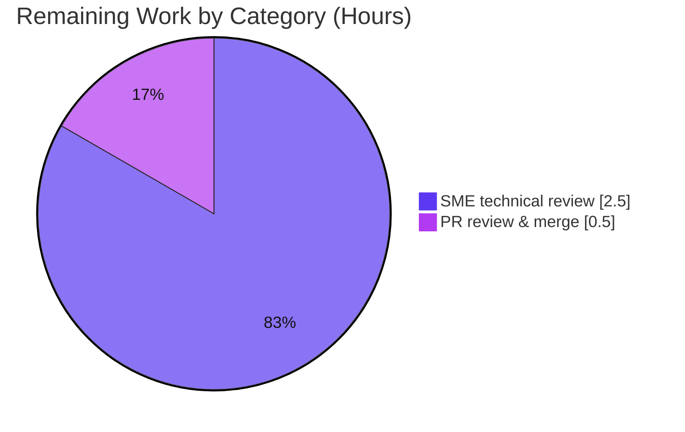

# Blitzy Project Guide — Scapy Request/Response Mis-Pairing Root-Cause Analysis

> **Brand legend (applied throughout):** Completed / AI Work = **Dark Blue `#5B39F3`** · Remaining / Not Completed = **White `#FFFFFF`** · Headings/Accents = Violet-Black `#B23AF2` · Highlight = Mint `#A8FDD9`.

---

## 1. Executive Summary

### 1.1 Project Overview

This project delivers a single, evidence-grounded technical document that explains the **root cause, inside Scapy's request/response matching algorithm, of why a received packet is paired with the wrong sent packet** when probing network paths through multiple tunnel endpoints (gateways). The target users are network engineers and Scapy maintainers investigating mis-attributed `sr`/`sr1` answers. The deliverable answers seven decomposed sub-questions (R1–R7) empirically — building and running the matching code first, then quoting the captured output — and grounds every claim in an exact `file:line` citation. The technical scope is read-only: exactly one Markdown file is added under `blitzy/documentation/`; no Scapy source, test, documentation, or configuration file is modified, so library runtime behavior is unchanged.

### 1.2 Completion Status


**Completion = Completed Hours ÷ Total Hours × 100 = 40 ÷ 43 × 100 = 93.0%.**

| Metric | Hours |
|---|---|
| **Total Hours** | **43** |
| **Completed Hours (AI + Manual)** | **40** (AI autonomous: 40 · Manual: 0) |
| **Remaining Hours** | **3** |
| **Percent Complete** | **93.0%** |

### 1.3 Key Accomplishments

- ✅ **All seven requirements (R1–R7) answered** — each with a dedicated section, verbatim reproduction output, and exact `file:line` citations, verified by an end-of-document coverage-pass table.
- ✅ **Root cause established empirically** — a `hashret()` **bucket collision** (`scapy/layers/inet.py:581`) combined with `answers()` **first-match-wins** selection (`scapy/sendrecv.py:279-292`).
- ✅ **Run-the-code-first methodology honored** — an offline, deterministic harness was authored and executed; its verbatim output is embedded (Appendix A) and reproduced byte-for-byte (SHA-256 `6b00100d…`).
- ✅ **Critical asymmetry documented** — echo-replies are mis-pairable; ICMP-errors are protected by an unconditional `test_IPdst` (`scapy/layers/inet.py:1022`) and drop instead of cross-pairing.
- ✅ **Read-only mandate preserved** — single-file addition; `scapy/**`, `test/**`, `doc/**`, and config untouched; working tree clean.
- ✅ **Independently validated this session** — harness re-run (SHA match), `compileall scapy` exit 0, `inet.uts` 54/54, ~10 citations spot-checked exact.

### 1.4 Critical Unresolved Issues

| Issue | Impact | Owner | ETA |
|---|---|---|---|
| _None._ No unresolved compilation errors, test failures, or blocking defects were identified. The deliverable is validated and production-ready pending human sign-off. | N/A | N/A | N/A |

### 1.5 Access Issues

| System/Resource | Type of Access | Issue Description | Resolution Status | Owner |
|---|---|---|---|---|
| _No access issues identified._ The task is fully self-contained: in-tree Scapy + Python standard library, offline, no root, no live network, no external credentials or services. | N/A | N/A | N/A | N/A |

### 1.6 Recommended Next Steps

1. **[High]** SME technical review — read `blitzy/documentation/scapy_0925ada48540.md`, re-run the embedded harness, and confirm the root-cause claim and R1–R7 coverage (expect SHA-256 `6b00100d…`).
2. **[High]** PR review & merge — verify the single-file diff and read-only compliance, then approve and merge.
3. **[Low]** Publish/cross-link the analysis from the originating issue tracker or team knowledge base for discoverability (optional; beyond AAP scope).

---

## 2. Project Hours Breakdown

### 2.1 Completed Work Detail

All completed hours are **autonomous (AI)** work traceable to specific AAP requirements. Total = **40 hours**.

| Component | Hours | Description |
|---|---|---|
| Matching-pipeline code comprehension & tracing | 8 | Read/traced the send-receive engine across `scapy/sendrecv.py` (bucketing L244; first-match-wins L279-292), `scapy/layers/inet.py` (`IP`/`ICMP` `hashret`/`answers`, `*error` classes), `scapy/packet.py` (delegation), and `scapy/config.py` (flags) to isolate the exact mechanism. |
| Offline reproduction harness | 8 | Designed and authored the 221-line dependency-free harness (stdlib + in-tree Scapy) that crafts probes, calls `hashret()`/`answers()`, replays the selection loop, and sweeps six variables (gateway address, `checkIPaddr`/`checkIPsrc`, ICMP seq, response type, tunnel encapsulation, quote length); verified byte-determinism. |
| R1–R7 root-cause answers | 7 | Wrote seven explicit, grounded sub-answers with reasoning/rationale (bucket collision, distinct-dst-yet-mispaired, not-timing, flag behavior, tunneled-seq truncation, non-causes, end-to-end trace). |
| `file:line` citation grounding | 4 | Anchored ~50+ exact citations to identifiers/values/line numbers across the four modules, the usage guide, and regression tests. |
| Verbatim evidence capture & appendices | 4 | Captured Appendix A (verbatim end-to-end output) and Appendix B (byte-level `hashret()` decomposition). |
| Web-search corroboration | 2 | Validated `sr`/`sr1` matching contract and `conf.checkIPaddr`/`checkIPinIP` purpose against upstream Scapy documentation. |
| Document assembly & structure | 3 | Composed the TL;DR, environment, pipeline explanation, asymmetry section, coverage table, and scope note. |
| Autonomous validation & fixes | 4 | Five-gate validation (dependencies, `compileall`, `inet.uts`/`regression.uts`, runtime reproduction ×2 + SHA, ~50 citation re-verifications) plus two committed citation corrections (`a6eddf1d`). |
| **Total** | **40** | |

> **Validation:** 8 + 8 + 7 + 4 + 4 + 2 + 3 + 4 = **40 hours** — matches Completed Hours in §1.2.

### 2.2 Remaining Work Detail

All remaining work is **human-owned path-to-production** for a validated documentation artifact. Total = **3 hours**.

| Category | Hours | Priority |
|---|---|---|
| SME technical review & sign-off (read 752-line analysis; re-run harness; spot-check citations; confirm R1–R7 accuracy) | 2.5 | High |
| PR review & merge approval (verify single-file diff and read-only compliance; approve; merge) | 0.5 | High |
| **Total** | **3.0** | |

> **Validation:** 2.5 + 0.5 = **3.0 hours** — matches Remaining Hours in §1.2 and the "Remaining Work" slice in §7.
> **Note:** An optional **[Low]** knowledge-base publication/cross-link task exists but is **excluded** from the AAP-scoped total (beyond AAP scope §0.5.2).

### 2.3 Hours Reconciliation

| Line | Hours |
|---|---|
| Completed (§2.1 total) | 40 |
| Remaining (§2.2 total) | 3 |
| **Total Project Hours** | **43** |
| **Completion (40 ÷ 43)** | **93.0%** |

---

## 3. Test Results

All results below originate from **Blitzy's autonomous validation logs** for this project. Campaigns marked *(re-run this session)* were independently re-executed by the Project-Guide agent; others are drawn from the Final Validator's logs and setup baseline. Scapy uses the `UTScapy` framework (`.uts` files), which reports pass/fail per unit test (no built-in line-coverage percentage).

| Test Category | Framework | Total Tests | Passed | Failed | Coverage % | Notes |
|---|---|---|---|---|---|---|
| Unit — IPv4/ICMP matching | UTScapy (`.uts`) | 54 | 54 | 0 | N/A (pass/fail) | `test/scapy/layers/inet.uts`; includes "IPv4 - ICMP hashret" (#050). **Re-run this session → 54/54.** |
| Regression | UTScapy (`.uts`) | 272 | 272 | 0 | N/A (pass/fail) | `test/regression.uts`; includes `hashret`-equality assertions (~L1215-1219) exercising the analyzed mechanism. |
| Directly-relevant subtotal | UTScapy (`.uts`) | 326 | 326 | 0 | N/A | inet.uts (54) + regression.uts (272). |
| Full suite baseline | UTScapy (`.uts`) | 2363 | 2363 | 0 | N/A | Setup baseline; zero failures, zero blocked. |
| Static compilation | `compileall` / `py_compile` | 331 files | 331 | 0 | N/A | Whole `scapy/` package; exit 0. **Re-run this session → exit 0.** |

**Summary:** 100% pass across all directly-relevant campaigns and the full baseline; zero failures and zero blocked tests. No test code was added or modified (read-only mandate).

---

## 4. Runtime Validation & UI Verification

**UI verification:** ⚠ **Not applicable** — this is a documentation deliverable with no application, service, frontend, or endpoint. No UI exists to verify.

**Runtime validation** (offline, deterministic; no root, no live interface, no real transmission):

- ✅ **Operational** — In-tree Scapy import: `import scapy` → `scapy.__version__ = 2026.07.01` (Python 3.13.7).
- ✅ **Operational** — Embedded reproduction harness: exit 0, empty stderr, byte-identical across two runs; **SHA-256 `6b00100d63bf30d9bdc06577455208ff4754b0293ebe41a45e94dff7ea8734e7`**, matching the document's own claim and Appendix A. Reproduced this session under both `.venv` and system `python3`.
- ✅ **Operational** — Whole-package compilation: `compileall scapy` → exit 0 (331 files, clean).
- ✅ **Operational** — Empirical findings confirmed: FINDING 1 bucket collision (both gateways hash to `0134120700` when `checkIPaddr=False`); FINDING 2 MISPAIR (reply from `10.0.0.2` paired to the `10.0.0.1` probe) + control run pairing correctly under defaults; ASYMMETRY (echo-reply mis-pairable vs ICMP-error protected); FINDING 3 tunneled quote-length sweep dropping until N=48.
- ⚠ **Not applicable** — External API/service integration: none required (offline, no network).

---

## 5. Compliance & Quality Review

Cross-mapping of AAP deliverables and the governing rule ("SWE-AtlasQnA-Repo") to Blitzy's quality/compliance benchmarks:

| Benchmark / AAP Requirement | Status | Progress | Notes |
|---|---|---|---|
| R1–R7 fully answered | ✅ Pass | 7/7 | Each has a section + verbatim evidence; coverage-pass table confirms. |
| Run-the-code-first methodology | ✅ Pass | 100% | Harness authored & executed before writing; output captured. |
| Verbatim observed output quoted | ✅ Pass | 100% | Appendix A; SHA-256-verified reproducible. |
| Exact `file:line` citations | ✅ Pass | ~50+ | ~10 spot-checked byte-exact this session against live source. |
| Read-only scope (no source edits) | ✅ Pass | 100% | Single-file addition; no `scapy/**`, `test/**`, `doc/**`, config change; tree clean. |
| Correct deliverable path & name | ✅ Pass | 100% | `blitzy/documentation/scapy_0925ada48540.md` (named after source branch). |
| No workaround (root cause only) | ✅ Pass | 100% | Explains mechanism; proposes no patch/shim, per user request. |
| Web-search corroboration | ✅ Pass | 100% | `sr`/`sr1` contract + `conf.checkIPaddr` purpose vs upstream docs. |
| Offline determinism (no root/interface) | ✅ Pass | 100% | Reproduced with stdlib + in-tree Scapy only. |
| Clean compilation | ✅ Pass | 331/331 | `compileall scapy` exit 0. |
| Relevant tests pass | ✅ Pass | 326/326 | inet.uts 54 + regression.uts 272; baseline 2363/2363. |

**Fixes applied during autonomous validation:** two citation imprecisions corrected in commit `a6eddf1d` — (1) the `name = "IP in ICMP"` literal is at `inet.py:1014` (the `class IPerror(IP):` line is 1013); (2) the `TCPerror.answers()` code-block label corrected to `inet.py:1043-1045`. Grounding-only; no analytical content changed.

**Outstanding compliance items:** human SME sign-off (the 3 hours in §2.2).

---

## 6. Risk Assessment

Overall profile is **Low** across all categories — inherent to a read-only, offline, no-root, no-network, fully-validated documentation deliverable that introduces zero library behavior change.

| Risk | Category | Severity | Probability | Mitigation | Status |
|---|---|---|---|---|---|
| **T1** — `file:line` citations drift as upstream source evolves, reducing precision for readers on newer trees | Technical | Low | Medium | Document pins Scapy `2026.07.01`, branch `scapy_0925ada48540`, commit `0925ada4`; verify against the pinned reference | Accepted (inherent to file:line docs) |
| **T2** — Root-cause coverage limited to IPv4/ICMP echo-reply + tunneled ICMP-error; IPv6/other encapsulations not exercised | Technical | Low | Low | Scope note documents the boundary (AAP §0.5.2); asymmetry section clarifies error-vs-reply behavior | By design |
| **S1** — Discussion of disabling `checkIPsrc`/`checkIPaddr` could be misread as guidance to disable checks | Security | Low | Low | Document frames the flags as the *trigger* of mis-pairing and offers **no** workaround, per user request | Mitigated |
| **O1** — Knowledge-artifact discoverability depends on the doc being published/linked | Operational | Low | Medium | Merge PR and cross-link from the originating issue/knowledge base | Open (human task) |
| **I1** — Reproduction portability: harness needs Python `>=3.7,<4` with in-tree Scapy importable; a different Scapy version could yield different internal byte values | Integration | Low | Low | Environment header printed in output; run command documented; determinism verified (SHA `6b00100d…`) | Mitigated |

No High or Medium **severity** risks. No blocking risks, security vulnerabilities, unresolved compilation/test errors, or missing credentials/integrations.

---

## 7. Visual Project Status

**Project hours breakdown** (Completed = Dark Blue `#5B39F3`, Remaining = White `#FFFFFF`):


**Remaining hours by category** (from §2.2; sums to 3.0h — the "Remaining Work" slice above):



> **Integrity:** "Remaining Work" = **3** here equals the Remaining Hours in §1.2 and the sum of the §2.2 "Hours" column. "Completed Work" = **40** equals Completed Hours in §1.2.

---

## 8. Summary & Recommendations

**Achievements.** The project delivers a complete, empirically-grounded root-cause analysis answering the user's question in full. It pinpoints the defect mechanism precisely: with `conf.checkIPsrc`/`checkIPaddr` set to `False`, `IP.hashret()` falls through to `scapy/layers/inet.py:581`, which omits IP addresses from the match key, so distinct gateways collapse into a single `hashret` bucket; the `SndRcvHandler` selection loop then pairs a received packet with the **first** sent packet in that bucket for which `answers()` is truthy (`scapy/sendrecv.py:279-292`), attributing a genuine reply from one gateway to the probe of another. The analysis also establishes what the behavior is **not** (not timing/race, not TCP-flag strictness, not `Raw`-payload, not `multi_recv`) and documents the echo-reply-vs-ICMP-error asymmetry.

**Remaining gaps & critical path to production.** Nothing in the AAP scope is outstanding. The critical path is short and entirely human: (1) SME technical review/sign-off of the analysis (2.5h), and (2) PR review & merge (0.5h) — **3 hours total**.

**Success metrics.** All seven requirements answered (7/7); reproduction byte-deterministic (SHA `6b00100d…`); directly-relevant tests 326/326 passing; full baseline 2363/2363; whole-package compilation clean; read-only mandate intact (single-file diff, working tree clean).

**Production readiness assessment.** At **93.0% complete (40 of 43 hours)**, the deliverable is validated and production-ready pending human sign-off. Because the artifact is a read-only Markdown document with a dependency-free, deterministic reproduction, deployment risk is negligible; the remaining ~7% is verification-and-merge, not development.

| Metric | Value |
|---|---|
| Completion | 93.0% (40 / 43 hours) |
| Requirements answered | 7 / 7 (R1–R7) |
| Directly-relevant tests | 326 / 326 passed |
| Full baseline tests | 2363 / 2363 passed |
| Reproduction determinism | SHA-256 `6b00100d…` (stable) |
| Files changed | 1 added (+752, −0) |
| Open blocking issues | 0 |

---

## 9. Development Guide

Every command below was executed and verified during this assessment. Run all commands from the repository root unless noted. The **reproduction is dependency-free** — it needs only Python 3 and the in-tree Scapy (no `pip`/virtualenv). A virtual environment with test extras is required only for the full `.uts` test suite.

### 9.1 System Prerequisites

- **Python:** `>=3.7, <4` (per `pyproject.toml:17`). Verified interpreter: **Python 3.13.7**.
- **OS:** Linux (Ubuntu); macOS/Windows also acceptable for the offline reproduction.
- **Privileges/Network:** **None.** No root, no raw sockets, no live interface, no real `sr`/`sr1` transmission.
- **In-tree Scapy:** `scapy.__version__ = 2026.07.01` (imported in place; no build step).

### 9.2 Environment Setup

```bash
# Confirm interpreter satisfies requires-python (>=3.7, <4)
python3 --version                     # → Python 3.13.7

# (Reproduction path) No installation needed — Scapy runs in place:
PYTHONPATH=. python3 -c "import scapy; print('scapy', scapy.__version__)"   # → scapy 2026.07.01
```

```bash
# (Full test-suite path only) Create a virtualenv and install test extras:
python3 -m venv .venv
source .venv/bin/activate
pip install -e ".[test]"
# Test extras used during validation: brotli, coverage, cryptography==41.0.7 (PINNED — do NOT upgrade),
# ipython, mock, python-can, zstandard
```

### 9.3 Dependency Installation

The reproduction requires **no third-party dependencies** — only the Python standard library and the in-tree Scapy package (AAP §0.6). Confirmed by running the harness with system `python3` (outside any venv) and obtaining the identical SHA-256.

### 9.4 Reproduce the Analysis (verified)

```bash
# 1) Extract the self-contained harness embedded in the deliverable (lines 415–635)
sed -n '415,635p' blitzy/documentation/scapy_0925ada48540.md > /tmp/scapy_repro_harness.py

# 2) Run it (offline, deterministic)
PYTHONPATH=. python3 /tmp/scapy_repro_harness.py

# 3) Verify byte-for-byte determinism against the documented digest
PYTHONPATH=. python3 /tmp/scapy_repro_harness.py | sha256sum
# → 6b00100d63bf30d9bdc06577455208ff4754b0293ebe41a45e94dff7ea8734e7
```

Expected output includes: `FINDING 1` (bucket collision when `checkIPaddr=False`), `FINDING 2` (MISPAIR + control run), the `ASYMMETRY` block, `FINDING 3` (tunneled quote-length sweep), `R6` non-causes, and `R3` structural-not-temporal.

### 9.5 Verification Steps

```bash
# Whole-package compilation (should exit 0)
PYTHONPATH=. python3 -m compileall scapy ; echo "exit=$?"

# Directly-relevant unit tests (needs .venv test extras) — expect 54/54
PYTHONPATH=. .venv/bin/python -m scapy.tools.UTscapy \
  -t test/scapy/layers/inet.uts -N \
  -K manufdb -K wireshark -K tshark -K ci_only -K vcan_socket \
  -K automotive_comm -K imports -K scanner -K osx -K windows -K ipv6

# Regression campaign (same invocation) — expect 272/272
PYTHONPATH=. .venv/bin/python -m scapy.tools.UTscapy \
  -t test/regression.uts -N \
  -K manufdb -K wireshark -K tshark -K ci_only -K vcan_socket \
  -K automotive_comm -K imports -K scanner -K osx -K windows -K ipv6

# Read-only compliance (should show ONLY the deliverable; tree clean)
git diff --name-status 0925ada4..HEAD    # → A blitzy/documentation/scapy_0925ada48540.md
git status --porcelain                   # → (empty)
```

### 9.6 Example Usage (core mechanism, verified inline)

```python
from scapy.config import conf
from scapy.layers.inet import IP, ICMP

def probe(dst):
    return IP(src="10.0.0.254", dst=dst) / ICMP(type=8)   # echo-request

# Default flags: IP addresses participate in the key → distinct buckets
conf.checkIPsrc = True;  conf.checkIPaddr = True
print(probe("10.0.0.1").hashret().hex(), probe("10.0.0.2").hashret().hex())
# → 000000ff0100000000 000000fc0100000000   (different → gateways separated)

# Disabled: IP addresses dropped at inet.py:581 → bucket collision
conf.checkIPsrc = False; conf.checkIPaddr = False
print(probe("10.0.0.1").hashret().hex(), probe("10.0.0.2").hashret().hex())
# → 0100000000 0100000000                    (identical → collision → mis-pairing enabled)
```

### 9.7 Troubleshooting

- **`ModuleNotFoundError: scapy`** → run from the repository root with `PYTHONPATH=.` (the package is imported in place, not installed).
- **Different `hashret` bytes than documented** → you are on a different Scapy version. Pin to branch `scapy_0925ada48540` (commit `0925ada4`); the harness prints an environment header for confirmation.
- **`error: externally-managed-environment` during `pip`** → use the project `.venv` (preferred), or pass `--break-system-packages` for a global install.
- **Tests appear to "hang"** → they don't watch; the `-N` flag and `-K` exclusions above keep the run non-interactive and offline.

---

## 10. Appendices

### Appendix A — Command Reference

| Purpose | Command |
|---|---|
| Interpreter version | `python3 --version` |
| Verify in-tree Scapy | `PYTHONPATH=. python3 -c "import scapy; print(scapy.__version__)"` |
| Extract harness | `sed -n '415,635p' blitzy/documentation/scapy_0925ada48540.md > /tmp/scapy_repro_harness.py` |
| Run reproduction | `PYTHONPATH=. python3 /tmp/scapy_repro_harness.py` |
| Verify determinism | `PYTHONPATH=. python3 /tmp/scapy_repro_harness.py \| sha256sum` |
| Compile package | `PYTHONPATH=. python3 -m compileall scapy` |
| Run unit tests | `PYTHONPATH=. .venv/bin/python -m scapy.tools.UTscapy -t test/scapy/layers/inet.uts -N -K manufdb -K wireshark -K tshark -K ci_only -K vcan_socket -K automotive_comm -K imports -K scanner -K osx -K windows -K ipv6` |
| Read-only check | `git diff --name-status 0925ada4..HEAD` |

### Appendix B — Port Reference

Not applicable. The deliverable is a document with an offline reproduction; no services are started and no network ports are used.

### Appendix C — Key File Locations

| Path | Role |
|---|---|
| `blitzy/documentation/scapy_0925ada48540.md` | **The deliverable** (752 lines) |
| `scapy/sendrecv.py` | Matching engine — bucketing (L244), first-match-wins (L279-292), `sndrcv()` (L322), `sr1()` (L656-664) |
| `scapy/layers/inet.py` | `IP.hashret` (L568-581), `IP.answers` (L583-610), `ICMP.hashret` (L986-989), `IPerror.answers`/`test_IPdst` (L1013-1034, L1022) |
| `scapy/packet.py` | Base delegation (L1215-1226); `Raw.answers` returns 1 (L1891-1893) |
| `scapy/config.py` | `conf` flags: `checkIPID` (L748), `checkIPsrc` (L751), `checkIPaddr` (L752), `checkIPinIP` (L755) |
| `test/scapy/layers/inet.uts` | Unit tests incl. "IPv4 - ICMP hashret" |
| `test/regression.uts` | Regression tests incl. `hashret`-equality assertions (~L1215-1219) |
| `doc/scapy/usage.rst` | Upstream `sr`/`sr1` contract and `conf.checkIPaddr` guidance |

### Appendix D — Technology Versions

| Component | Version | Source |
|---|---|---|
| CPython (runtime) | 3.13.7 | Satisfies `requires-python = ">=3.7, <4"` (`pyproject.toml:17`) |
| Scapy (in-tree) | 2026.07.01 | `scapy.__version__` |
| Source branch / commit | `scapy_0925ada48540` / `0925ada4` | AAP base |
| Reproduction digest | SHA-256 `6b00100d…8734e7` | Harness output (stable) |

### Appendix E — Environment Variable Reference

| Variable | Value | Purpose |
|---|---|---|
| `PYTHONPATH` | `.` | Makes the in-tree Scapy importable from the repository root (no install). |

_No application secrets, API keys, or service endpoints are required (offline, read-only)._

### Appendix F — Developer Tools Guide

- **`UTScapy`** (`python -m scapy.tools.UTscapy`) — Scapy's unit-test runner for `.uts` files. Use `-t <file>` to select a campaign, `-N` for non-interactive output, and `-K <keyword>` to exclude environment-dependent test groups (as in §9.5).
- **`compileall`** — fast whole-package byte-compile sanity check.
- **`sha256sum`** — confirms the reproduction's byte-for-byte determinism against the documented digest.
- **`git diff --name-status` / `git status --porcelain`** — enforce the read-only mandate.

### Appendix G — Glossary

| Term | Definition |
|---|---|
| `hashret()` | Method producing the **bucket key** used to group sent packets for answer matching. |
| `answers()` | Method returning truthy when a received packet is a valid reply to a candidate sent packet. |
| First-match-wins | The `SndRcvHandler` selection behavior: within a bucket, the **first** sent packet whose `answers()` is truthy is chosen, then the loop breaks (`scapy/sendrecv.py:279-292`). |
| Bucket collision | Two distinct probes producing the **same** `hashret()` key, so they share one bucket — the precondition for mis-pairing. |
| `checkIPsrc` / `checkIPaddr` | `conf` flags gating whether IP addresses participate in `hashret()`/`answers()`; disabling them removes gateway discrimination. |
| ICMP-error quote | The truncated copy of the original packet embedded in an ICMP error (outer IP + first 8 bytes), which may omit the inner ICMP id/seq for tunneled probes. |
| MISPAIR / DROP / CORRECT | The three verdicts recorded per reproduction scenario. |
| `sr` / `sr1` | Scapy's send-and-receive entry points; `sr1()` returns only the first answer (`ans[0][1]`, `scapy/sendrecv.py:663`). |