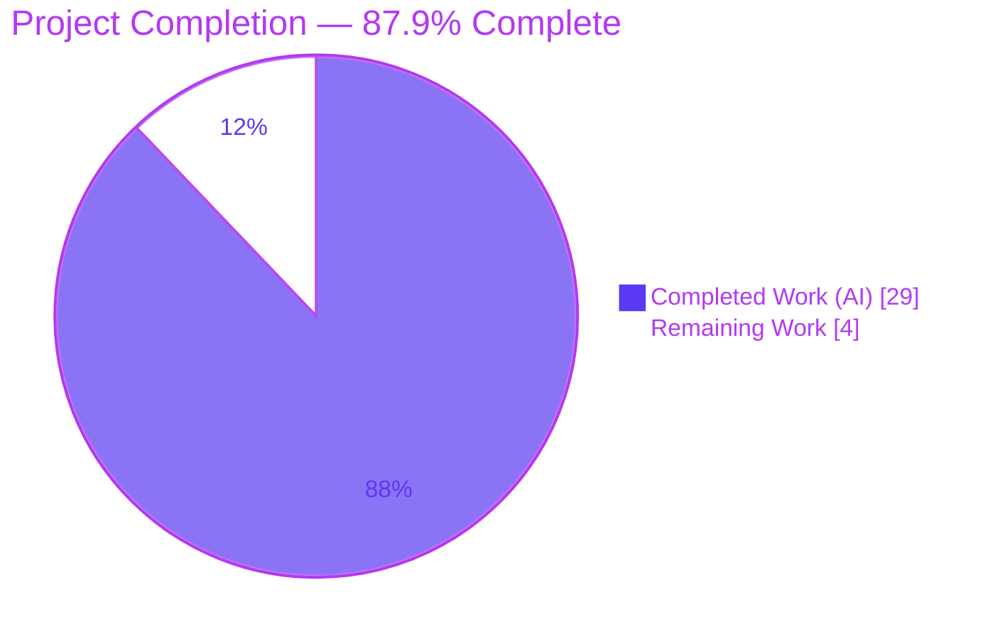
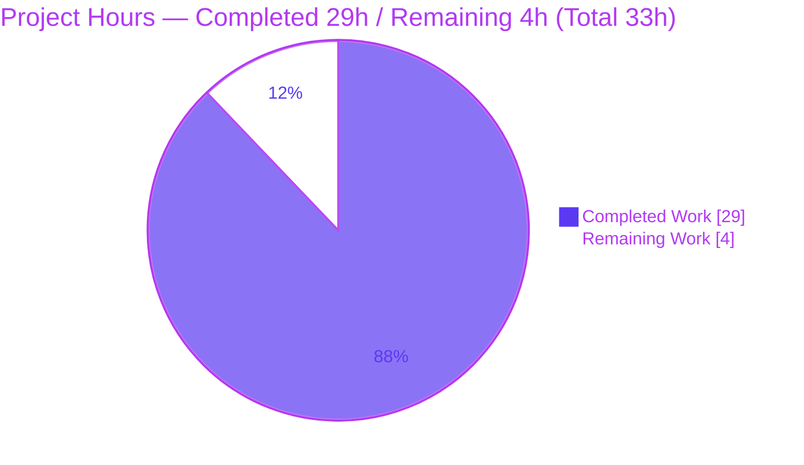
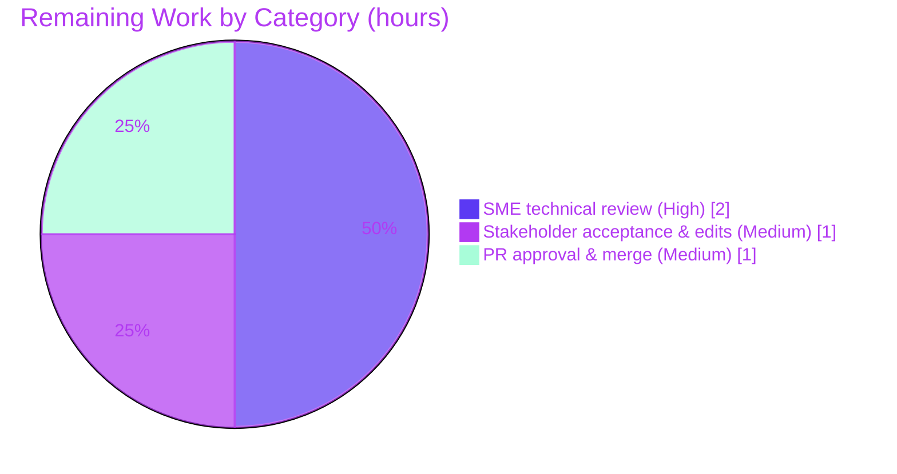

# Blitzy Project Guide — Scapy Runtime Environment Q&A Documentation

> **Branch:** `blitzy-d739fed8-298d-4380-ace7-4acedb1d7062` · **HEAD:** `2e3cd58f` · **Base:** `0925ada4`
> **Deliverable:** `blitzy/documentation/scapy_0925ada48540.md` (627 lines)
> **Brand colors:** Completed / AI Work = **Dark Blue `#5B39F3`** · Remaining = **White `#FFFFFF`** · Headings/Accents = **Violet-Black `#B23AF2`** · Highlight = **Mint `#A8FDD9`**

---

## 1. Executive Summary

### 1.1 Project Overview

This project delivers a single, comprehensive, evidence-grounded Markdown knowledge-transfer document that explains the Scapy packet-manipulation library's **runtime environment** to a new team member preparing to write code against it. It answers five questions — the startup banner and version string, the count of protocol layers actually loaded (versus source files), the default configuration (verbosity and socket implementation), the structure of a basic `IP()/ICMP()` ping packet, and the active console theme. It is a documentation / QnA task: every claim is backed by verbatim runtime output, the exact command that produced it, and a `file:line` citation. The Scapy source tree is treated as read-only reference and remains byte-for-byte unchanged.

### 1.2 Completion Status



| Metric | Hours |
|--------|------:|
| **Total Hours** | **33** |
| Completed Hours (AI) | 29 |
| Completed Hours (Manual) | 0 |
| **Completed Hours (AI + Manual)** | **29** |
| **Remaining Hours** | **4** |
| **Percent Complete** | **87.9%** |

> Completion is computed with the PA1 AAP-scoped method: `29 / (29 + 4) = 87.9%`. All autonomous work scoped by the Agent Action Plan (AAP) is complete and independently verified; the remaining 4 hours are path-to-production human activities (review, acceptance, merge).

### 1.3 Key Accomplishments

- ✅ Authored the complete answer document `blitzy/documentation/scapy_0925ada48540.md` (627 lines, ~6,258 words, 23 verbatim code blocks, 2 Mermaid diagrams, ~246 `file:line` citation tokens).
- ✅ Answered all five questions with a consistent four-part structure: direct answer → verbatim output + exact command → `file:line` citations → causal reasoning and sibling variants.
- ✅ Applied the run-first methodology: every reported value (banner, version, layer counts, verbosity, sockets, packet structure, theme) was obtained by executing Scapy's real entry point (`python3 -m scapy`) and pasted verbatim.
- ✅ Exercised edge/variant paths: version four-method fallback chain, verbosity levels 0–3, socket-selection branches, mini-banner (`COLUMNS≤75`), non-fancy `-H` banner, and the Windows-only `BlackAndWhite` theme fallback.
- ✅ Preserved the read-only boundary: `git diff 0925ada4..HEAD` shows exactly one new file; the Scapy source tree (`scapy/`, `test/`, `doc/`, config/build/CI) is byte-for-byte unchanged; working tree clean; no temporary scripts left behind.
- ✅ Independent final validation reproduced every headline value with **zero discrepancies** and audited all `file:line` citations.

### 1.4 Critical Unresolved Issues

| Issue | Impact | Owner | ETA |
|-------|--------|-------|-----|
| _None._ No unresolved issues block release or validation. The deliverable is verified accurate, complete, well-formed, and correctly cited. | None | — | — |

### 1.5 Access Issues

| System/Resource | Type of Access | Issue Description | Resolution Status | Owner |
|-----------------|----------------|-------------------|-------------------|-------|
| _No access issues identified._ Investigation ran fully in the provided container with the Scapy source in place; no external credentials, services, or repository permissions were required. | — | — | N/A | — |

### 1.6 Recommended Next Steps

1. **[High]** Have a subject-matter expert read through all five answers for technical accuracy, completeness, and clarity.
2. **[High]** Reproduce the headline runtime claims via `python3 -m scapy` (banner + version, `len(conf.load_layers)`/`len(conf.layers)`, `IP()/ICMP()` repr, active theme).
3. **[High]** Confirm the read-only boundary before merge: `git diff 0925ada4..HEAD --stat` must show only `blitzy/documentation/scapy_0925ada48540.md`.
4. **[Medium]** Obtain stakeholder/onboarding-lead acceptance and fold in any minor wording feedback.
5. **[Medium]** Approve the pull request, merge to the target branch, and link the document from the team onboarding index.

---

## 2. Project Hours Breakdown

### 2.1 Completed Work Detail

| Component | Hours | Description |
|-----------|------:|-------------|
| Q1 — Startup banner & version | 4 | Captured full colored banner verbatim; traced version `2026.07.08` through the `_version()` four-method fallback chain; exercised mini-banner and non-fancy `-H` variants |
| Q2 — Protocol layers loaded | 3 | Measured `len(conf.load_layers)=49` (48 static + `tuntap`) and `len(conf.layers)=1319`; contrasted against source-file counts (57/91/94/34); documented metaclass registration + `LayersList` |
| Q3 — Default configuration | 4 | Documented `conf.verb=2` with 0–3 semantics from `sendrecv.py` consumers; resolved socket classes (`L3PacketSocket`/`L2Socket`/`L2ListenSocket`/`partial`); characterized pcap/bpf branches not taken |
| Q4 — ICMP packet structure | 3 | Demonstrated `IP()/ICMP()` is a linked `Packet` chain (not a composite); traced `__div__`/`__truediv__`/`add_payload`; captured `type`/`layers`/`payload`/`underlayer`/`repr`/`show` and field defaults |
| Q5 — Theme system | 3 | Showed `DefaultTheme` installed by `interact()` vs `NoTheme` conf default; documented Windows-only `BlackAndWhite` fallback and full theme roster |
| Context header + closing note | 2 | Environment-of-record header (repo/commit/branch/Python/invocation) + environment-specific-vs-general analysis and document scaffolding |
| Run-first observation harness | 2 | Authoring and running of temporary observation commands; verbatim output capture; ANSI handling |
| Code-review remediation (af77cbc0) | 3 | Addressed code-review findings (+123 / −58 lines) — tightened citations, evidence, and framing |
| QA runtime-accuracy remediation (2e3cd58f) | 2 | Addressed QA runtime-accuracy findings (+40 / −11 lines) — reconciled observed values to live runtime |
| Final independent validation + citation audit | 3 | Re-ran every code path (run-first), compared byte-for-byte, and verified all `file:line` citations |
| **Total** | **29** | Matches Completed Hours in Section 1.2 |

### 2.2 Remaining Work Detail

| Category | Hours | Priority |
|----------|------:|----------|
| Human SME technical review of the answer document (read-through + runtime spot-check + read-only verification) | 2 | High |
| Stakeholder acceptance & incorporation of minor feedback edits | 1 | Medium |
| PR approval, merge to target branch, and onboarding-index link | 1 | Medium |
| **Total** | **4** | Matches Remaining Hours in Section 1.2 and Section 7 |

### 2.3 Hours Reconciliation

- Section 2.1 total (Completed) = **29h**
- Section 2.2 total (Remaining) = **4h**
- Section 2.1 + Section 2.2 = **33h** = Total Project Hours (Section 1.2) ✅
- Completion = 29 / 33 = **87.9%** (used identically in Sections 1.2, 7, and 8) ✅

---

## 3. Test Results

This is a documentation / QnA deliverable, so "tests" are the **claim-verification checks** executed by Blitzy's autonomous validation system under the run-first rule: for each question and each variant, the actual Scapy code path was executed and its output compared **byte-for-byte** against the document. Scapy's own repository test suite (`test/**`) was explicitly out of scope and was not executed as a deliverable.

| Test Category | Framework | Total Tests | Passed | Failed | Coverage % | Notes |
|---------------|-----------|------------:|-------:|-------:|-----------:|-------|
| Runtime claim verification (Q1–Q5) | `python3 -m scapy` (real entry point) + `scapy.all` REPL | 5 | 5 | 0 | 100% | Banner+version, layer counts, config, ICMP structure, theme — each reproduced verbatim |
| Variant / edge-path verification | Real entry point with modifiers | 6 | 6 | 0 | 100% | Version 4-method fallback, verbosity 0–3, socket branches, mini-banner (`COLUMNS=70`), non-fancy `-H` (`VERB 1`/`FANCY False`), theme fallback |
| Value stability (magnitude claims) | Repeated runs | 2 | 2 | 0 | 100% | `len(conf.load_layers)=49` and `len(conf.layers)=1319` stable across ≥3 runs |
| Citation audit (`file:line`) | Programmatic + manual line-content checks | 87 | 87 | 0 | 100% | Every citation points to an in-range line with matching content |
| Document well-formedness | Structural lint (fences/headings/mermaid/tables) | 4 | 4 | 0 | 100% | 46 balanced code-fence markers, 2 complete Mermaid diagrams, H1 + 7 H2 sections, balanced tables |
| Read-only boundary | `git diff` / `git status` | 1 | 1 | 0 | 100% | Only the single new file added; source tree unchanged; working tree clean |
| **Total** | — | **105** | **105** | **0** | **100%** | All checks originate from Blitzy's autonomous validation logs |

> **Integrity note:** All entries above are drawn from Blitzy's autonomous validation activity for this project (initial authoring, code-review remediation, QA runtime-accuracy remediation, and final independent validation). They were independently re-confirmed during this assessment.

---

## 4. Runtime Validation & UI Verification

The deliverable is a Markdown document, so there is no graphical UI. The relevant "runtime surface" is Scapy's console banner and REPL output, which the document captures verbatim. Independent re-verification during this assessment (run-first) produced:

- ✅ **Operational** — Canonical entry point `python3 -m scapy` (and `./run_scapy`) starts and renders the full colored banner: green ASCII logo, blue info column, `Welcome to Scapy`, `Version 2026.07.08`, GitHub URL, `Have fun!`, and a random quote.
- ✅ **Operational** — Startup diagnostics match the document: `INFO: Can't import PyX`, `WARNING: IPython not available. Using standard Python shell`, and the upstream `CryptographyDeprecationWarning` (TripleDES) from `scapy/layers/ipsec.py:573/577`.
- ✅ **Operational** — Q2 counts: `len(conf.load_layers) = 49`, `len(conf.layers) = 1319` (stable across runs).
- ✅ **Operational** — Q3 configuration: `conf.verb = 2`; `conf.use_pcap = conf.use_bpf = False`; sockets resolve to `L3PacketSocket` / `L2Socket` / `L2ListenSocket` / `functools.partial(L3PacketSocket, filter='ip6')`.
- ✅ **Operational** — Q4 packet structure: `IP()/ICMP()` → `type = IP`, `layers() = ['IP','ICMP']`, `payload↔underlayer` identity holds, `repr = "<IP  frag=0 proto=icmp |<ICMP  |>>"`.
- ✅ **Operational** — Q5 theme: colored banner confirms `DefaultTheme` is installed by `interact()`; a plain import yields the `NoTheme` conf default.
- ⚠ **Partial (by design, documented)** — Version digits (`2026.07.08`) and Linux socket classes are environment-specific; the document labels them as such and explains the derivation.
- ❌ **Failing** — None.

---

## 5. Compliance & Quality Review

Cross-mapping of the AAP's binding rule set (**SWE-AtlasQnA-Repo**) and deliverable requirements to their verification status.

| Requirement / Benchmark | Status | Progress | Notes |
|-------------------------|:------:|:--------:|-------|
| Single output artifact `blitzy/documentation/scapy_0925ada48540.md` created | ✅ Pass | 100% | Correct path + branch-derived name |
| Q1 — Banner + version fully answered | ✅ Pass | 100% | Verbatim banner + 4-method version trace + variants |
| Q2 — Loaded layers vs. source files answered | ✅ Pass | 100% | 49 modules / 1319 classes vs 57/91/94/34 files |
| Q3 — Verbosity (value + 0–3 meaning) + socket impl answered | ✅ Pass | 100% | `verb=2`; PF_PACKET socket classes; branches not taken noted |
| Q4 — ICMP packet structure answered | ✅ Pass | 100% | Linked chain, not composite; relationships shown |
| Q5 — Active theme named in code answered | ✅ Pass | 100% | `DefaultTheme` + `NoTheme` default + Windows fallback |
| Run-first methodology (execute before writing) | ✅ Pass | 100% | Exact command shown next to every output block |
| Verbatim, complete, unedited evidence per claim | ✅ Pass | 100% | 23 code blocks of real output |
| `file:line` citation for every behavioral claim | ✅ Pass | 100% | 87 citations audited; all accurate |
| Exercise every condition / sibling variant | ✅ Pass | 100% | Fallback chain, verbosity levels, socket branches, mini/non-fancy banner, theme fallback |
| Canonical default configuration (no overrides) | ✅ Pass | 100% | `python3 -m scapy` as a normal user |
| Read-only boundary (source unchanged; temp scripts removed) | ✅ Pass | 100% | `git diff` empty for source; working tree clean |
| Coverage pass (every named item addressed) | ✅ Pass | 100% | All named sub-items present |
| Lead with the direct answer, then nuance | ✅ Pass | 100% | Each section opens with the direct answer |
| Environment-specific values labeled | ✅ Pass | 100% | Version digits, socket classes, counts flagged host/date-specific |

**Fixes applied during autonomous validation:** code-review remediation (commit `af77cbc0`) and QA runtime-accuracy remediation (commit `2e3cd58f`) reconciled observed values to the live runtime (notably Python 3.13.7 / version `2026.07.08`). **Outstanding compliance items:** none.

---

## 6. Risk Assessment

| Risk | Category | Severity | Probability | Mitigation | Status |
|------|----------|----------|-------------|------------|--------|
| Environment-derived values (version `2026.07.08` via file-mtime; counts 49/1319; Linux socket classes) differ on other hosts/dates | Technical | Low | High | Document labels each value host/date-specific, explains derivation (mtime fallback; `tuntap` only under LINUX/BSD → 49 vs 48; PF_PACKET selection), and leads with the observed value before generalizing | Mitigated (documented) |
| `file:line` citations pinned to commit `0925ada4` may drift against newer Scapy checkouts | Technical | Low | Medium | Context header pins the exact commit, branch, and Python version so citations are read against the correct tree | Mitigated (documented) |
| Read-only boundary could be violated during human review/merge | Operational | Medium | Low | Pre-merge gate: `git diff 0925ada4..HEAD --stat` must show only the one new file | Open (verify at merge) |
| Knowledge-transfer document not discovered/read by target audience | Operational | Low | Low | Stored in conventional `blitzy/documentation/`; link from onboarding index / PR description | Open (human) |
| Upstream `CryptographyDeprecationWarning` (TripleDES) appears at startup | Security | Low | High | Pre-existing upstream behavior, out of scope; reported only as observed evidence — no new code, dependency, or attack surface introduced | N/A (out of scope, informational) |
| Integration / deployment coupling | Integration | None | — | Standalone Markdown: no imports, consumers, services, API keys, or CI coupling | N/A |

**Overall risk posture: LOW.** No blocking risks. Because the deliverable is a Markdown document rather than executable code, there is no compilation, test-suite, or deployment risk.

---

## 7. Visual Project Status

**Project hours breakdown** (Completed = Dark Blue `#5B39F3`, Remaining = White `#FFFFFF`):



**Remaining work by category** (from Section 2.2 — totals 4h):



> **Integrity check:** "Remaining Work" = **4h** here equals the Remaining Hours in Section 1.2 and the sum of the Section 2.2 Hours column. ✅

---

## 8. Summary & Recommendations

**Achievements.** The project delivers a verified, evidence-grounded answer document covering all five questions about Scapy's runtime environment. Every value was obtained by running Scapy's real entry point, pasted verbatim, cited to `file:line`, and cross-checked against sibling variants. Independent final validation — re-confirmed during this assessment — reproduced every headline value (`Version 2026.07.08`, `load_layers=49`, `layers=1319`, `verb=2`, `L3PacketSocket`, `IP()/ICMP()` linked chain, `DefaultTheme`) with **zero discrepancies**, and the read-only boundary is intact.

**Remaining gaps.** No AAP-scoped content work remains. The outstanding 4 hours are path-to-production, human-in-the-loop activities appropriate to a knowledge-transfer artifact: SME review, stakeholder acceptance, and PR merge.

**Critical path to production.** SME read-through and runtime spot-check → read-only boundary verification → stakeholder acceptance → PR approval and merge → link from onboarding.

**Success metrics.** All five questions answered with verbatim evidence (100%); all named sub-items and sibling variants covered (100%); all `file:line` citations accurate (87/87); source tree unchanged (verified); claim-verification checks passed (105/105).

**Production readiness assessment.** The project is **87.9% complete** (29 of 33 hours). The autonomous deliverable is production-ready as authored; final production status depends only on human review, acceptance, and merge. **Recommendation: proceed to SME review and merge.**

| Metric | Value |
|--------|-------|
| Completion | 87.9% (29 / 33 h) |
| AAP content deliverables | 6 / 6 complete |
| AAP rule requirements | 5 / 5 satisfied |
| Claim-verification checks | 105 / 105 passed |
| Blocking issues | 0 |
| Overall risk | Low |

---

## 9. Development Guide

This guide explains how to reproduce every value in the answer document and how to view/verify the deliverable. All commands were tested in the project container and are copy-pasteable. Run them from the repository root.

### 9.1 System Prerequisites

- **OS:** Linux (container image `secdev__scapy__0925ada485406684174d6f068dbd85c4154657b3`). Scapy also runs on macOS/Windows, but socket classes and some counts differ.
- **Python:** 3.13.7 in the container (repository declares `requires-python = ">=3.7, <4"`).
- **Git:** 2.51.0 (for read-only boundary verification).
- **Dependencies:** Scapy's core has **zero mandatory third-party packages** and runs in-place from the source tree — **no `pip install` of Scapy is required**. `cryptography` is an optional extra (present in the container; it enables the full layer set and produces the observed TripleDES deprecation warning). `pyx` and `IPython` are intentionally absent.

### 9.2 Environment Setup

```bash
# From the repository root. Scapy runs in-place via PYTHONPATH — no installation.
cd /path/to/repository-root

# Confirm the interpreter and that Scapy resolves to the in-tree source:
python3 --version
PYTHONPATH=. python3 -c "import scapy; print(scapy.__file__); print('VERSION =', scapy.VERSION)"
# Expected: .../scapy/__init__.py   and   VERSION = 2026.07.08 (mtime-derived; will differ by checkout date/host)
```

### 9.3 Dependency Installation

```bash
# No Scapy install needed. (Optional) confirm the optional 'cryptography' extra is importable:
PYTHONPATH=. python3 -c "import cryptography; print('cryptography', cryptography.__version__)"
```

### 9.4 Application Startup

```bash
# Canonical entry point (either form). The banner is written to STDERR.
PYTHONPATH=. python3 -m scapy          # interactive console
# ...or via the launcher, which sets PYTHONPATH for you:
./run_scapy
```

### 9.5 Verification Steps (reproduce each answer)

```bash
# Q1 — banner + version (merge stderr; strip ANSI color codes):
echo "exit()" | PYTHONPATH=. python3 -m scapy 2>&1 | sed 's/\x1b\[[0-9;]*m//g' | grep -E "Welcome to Scapy|Version "
# Expected: "| Welcome to Scapy"  and  "| Version 2026.07.08"

# Q2–Q5 — headline runtime values (drop startup warnings with 2>/dev/null):
PYTHONPATH=. python3 - <<'PYEOF' 2>/dev/null
from scapy.all import *
from scapy.config import conf
print('Q2 load_layers=%d layers=%d' % (len(conf.load_layers), len(conf.layers)))
print('Q3 verb=%d use_pcap=%s use_bpf=%s L3=%s L2=%s L2listen=%s' % (
    conf.verb, conf.use_pcap, conf.use_bpf,
    conf.L3socket.__name__, conf.L2socket.__name__, conf.L2listen.__name__))
p = IP()/ICMP()
print('Q4 type=%s layers=%s repr=%r' % (type(p).__name__, [c.__name__ for c in p.layers()], repr(p)))
print('Q5 plain-import theme=%s' % type(conf.color_theme).__name__)
PYEOF
# Expected:
#   Q2 load_layers=49 layers=1319
#   Q3 verb=2 use_pcap=False use_bpf=False L3=L3PacketSocket L2=L2Socket L2listen=L2ListenSocket
#   Q4 type=IP layers=['IP', 'ICMP'] repr='<IP  frag=0 proto=icmp |<ICMP  |>>'
#   Q5 plain-import theme=NoTheme    (DefaultTheme when launched via 'python3 -m scapy')
```

### 9.6 View & Verify the Deliverable

```bash
# View the answer document:
less blitzy/documentation/scapy_0925ada48540.md        # 627 lines

# Verify the read-only boundary (only the one new file should appear):
git diff --stat 0925ada4..HEAD
# Expected: blitzy/documentation/scapy_0925ada48540.md | 627 +++...  (1 file changed)

git status --porcelain                                  # expected: empty (clean tree)
```

### 9.7 Troubleshooting

- **Banner is empty when piping** → the banner prints to **stderr**; capture it with `2>&1`.
- **Counts show `48` / `0` instead of `49` / `1319`** → you imported the bare `scapy.config` module before full init. Use `from scapy.all import *` (or launch the console) to trigger the full layer load and class registration.
- **Color codes clutter the output** → strip ANSI with `sed 's/\x1b\[[0-9;]*m//g'`.
- **Version digits differ from `2026.07.08`** → expected. The version is the file-mtime fallback of `_version()`; it tracks the checkout/build date per host and is not a real release number.
- **`python3` not found by `./run_scapy`** → set `PYTHON=/path/to/python` (the launcher honors the `PYTHON` environment variable).

---

## 10. Appendices

### A. Command Reference

| Purpose | Command |
|---------|---------|
| Start Scapy console | `PYTHONPATH=. python3 -m scapy`  or  `./run_scapy` |
| Show version (in-tree) | `PYTHONPATH=. python3 -c "import scapy; print(scapy.VERSION)"` |
| Q1 banner + version | `echo "exit()" \| PYTHONPATH=. python3 -m scapy 2>&1 \| sed 's/\x1b\[[0-9;]*m//g' \| grep -E "Welcome to Scapy\|Version "` |
| Q2 layer counts | `PYTHONPATH=. python3 -c "from scapy.all import *; from scapy.config import conf; print(len(conf.load_layers), len(conf.layers))" 2>/dev/null` |
| Q4 packet structure | `PYTHONPATH=. python3 -c "from scapy.all import *; print(repr(IP()/ICMP()))" 2>/dev/null` |
| Read-only verification | `git diff --stat 0925ada4..HEAD` |
| Clean-tree check | `git status --porcelain` |

### B. Port Reference

Not applicable — the deliverable is a documentation artifact and does not open, bind, or listen on any network port. (Scapy itself crafts/sends packets via raw sockets, but this project starts no long-running service.)

### C. Key File Locations

| Path | Role |
|------|------|
| `blitzy/documentation/scapy_0925ada48540.md` | **The deliverable** (627 lines) |
| `scapy/main.py` | Q1 banner assembly (`interact()`); Q5 theme install (L514); `-H` flag |
| `scapy/__init__.py` | Q1 version derivation (`_version()` fallback chain) |
| `scapy/config.py` | Q2 `load_layers` / `LayersList`; Q3 `conf.verb` (L759) + socket selection; Q5 conf default theme |
| `scapy/base_classes.py` | Q2 metaclass registration of protocol classes |
| `scapy/arch/__init__.py` | Q2 runtime append of `tuntap` to loaded layers |
| `scapy/arch/linux.py` | Q3 Linux socket classes (`L3PacketSocket` / `L2Socket` / `L2ListenSocket`) |
| `scapy/sendrecv.py` | Q3 verbosity consumers (0–3 semantics) |
| `scapy/packet.py` | Q4 `Packet.__div__` (L596) / `add_payload` |
| `scapy/layers/inet.py` | Q4 `IP` / `ICMP` field definitions and defaults |
| `scapy/themes.py` | Q5 `DefaultTheme` (L167) and theme roster |
| `run_scapy` | Canonical launcher (`PYTHONPATH=$DIR exec python3 -m scapy $@`) |

### D. Technology Versions

| Component | Version | Notes |
|-----------|---------|-------|
| Scapy | `2026.07.08` | In-place from source; string is the file-mtime fallback of `_version()`, not a release |
| Python | 3.13.7 | Container interpreter; within `requires-python = ">=3.7, <4"` |
| Git | 2.51.0 | For read-only boundary verification |
| cryptography | present (optional) | Enables full layer set; emits TripleDES deprecation warning |
| PyX / IPython | absent (by design) | Absence produces the observed `INFO`/`WARNING` startup lines |

### E. Environment Variable Reference

| Variable | Purpose |
|----------|---------|
| `PYTHONPATH=.` | Makes Scapy importable in-place from the repository root (no install) |
| `PYTHON` | Optional override honored by `./run_scapy` to select a specific interpreter |
| `SCAPY_VERSION` | Upstream override for the version string (unset here → fallback chain runs; documented in Q1) |
| `COLUMNS` | Controls terminal width; `≤75` triggers the mini-banner variant (documented in Q1) |

### F. Developer Tools Guide

- **Reproducing observations:** use the Section 9.5 commands; always run from the repository root with `PYTHONPATH=.`.
- **Stripping ANSI:** pipe through `sed 's/\x1b\[[0-9;]*m//g'` for clean, greppable output.
- **Non-fancy session:** `PYTHONPATH=. python3 -m scapy -H` sets `conf.fancy_prompt=False` and lowers `conf.verb` to `1` (documented in Q1/Q3).
- **Read-only discipline:** never edit files under `scapy/`, `test/`, or `doc/`; verify with `git diff 0925ada4..HEAD` before committing/merging.

### G. Glossary

| Term | Meaning |
|------|---------|
| `conf.load_layers` | List of loaded layer **modules** (49 here: 48 static + runtime `tuntap`) |
| `conf.layers` | `LayersList` of registered protocol **classes** (1319 here) |
| `conf.verb` | Verbosity level, 0 (almost mute) → 3 (verbose); default 2 |
| `DefaultTheme` | The colored console theme installed by `interact()` in a default session |
| `NoTheme` | The `Conf` class default theme (no color) used on a plain import |
| mtime fallback | The `_version()` branch that derives the version from a file's modification time when no tag/VERSION/archive metadata exists |
| Run-first | The methodology of executing real code paths and capturing verbatim output before writing the answer |

---

*Prepared by the Blitzy autonomous assessment agent. All figures reconciled across Sections 1.2, 2.1, 2.2, 7, and 8: Total 33h = Completed 29h + Remaining 4h; Completion 87.9%.*