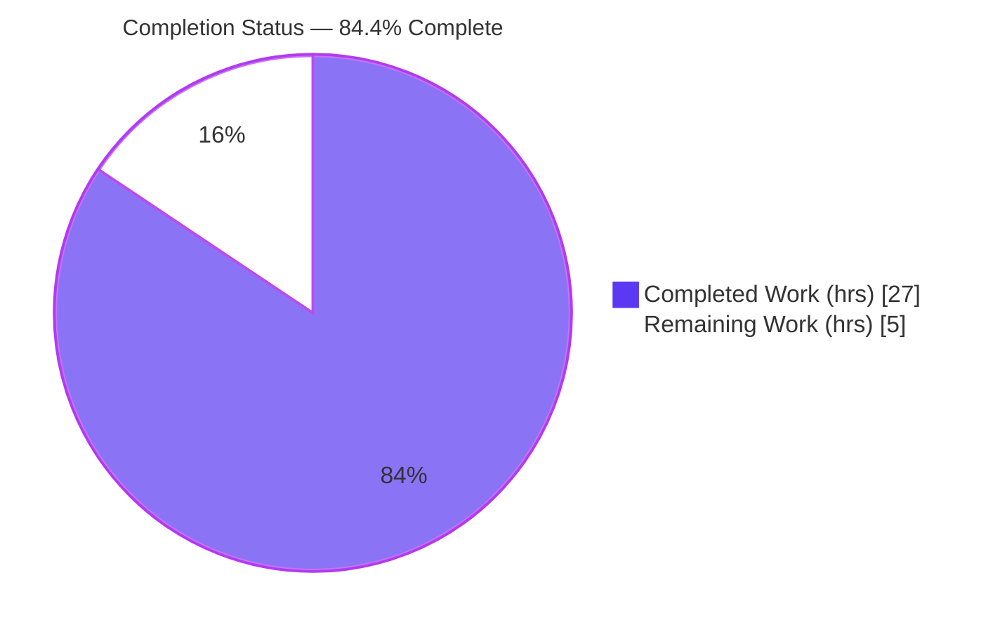
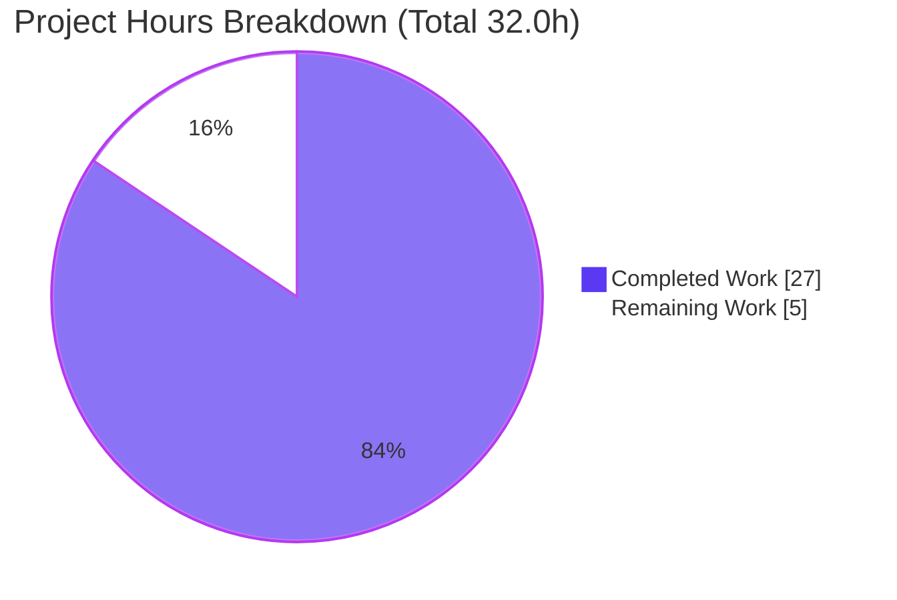
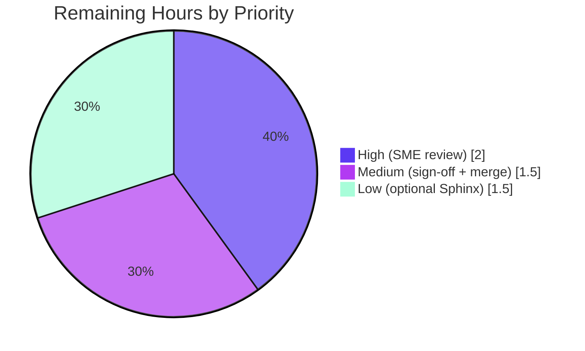

# Blitzy Project Guide — Scapy DNS Name Compression & Decompression Q&A

> **Deliverable:** `blitzy/documentation/scapy_0925ada48540.md` — an evidence-backed technical answer document
> **Repository:** Scapy (pure-Python packet manipulation library) · **Branch:** `blitzy-7b298fa0-1562-4bd6-be51-33085f3e21e9` · **Base:** `0925ada485406684174d6f068dbd85c4154657b3`

---

## 1. Executive Summary

### 1.1 Project Overview

This project answers an onboarding investigation: *how does Scapy's DNS layer compress domain names when building packets and decompress them when parsing?* The sole deliverable is one authoritative markdown document, `blitzy/documentation/scapy_0925ada48540.md`, that explains the DNS name codec in `scapy/layers/dns.py` across eight sub-questions (SQ1–SQ8) — from raw wire bytes to a resolved name and back. Every behavioral claim is grounded in **runtime-observed evidence** and paired with an **exact `file:line` citation**. The audience is engineers onboarding into the Scapy codebase. This is a strictly **read-only, documentation-only** task: no product code, tests, or configuration were changed.

### 1.2 Completion Status

The project is **84.4% complete** on an AAP-scoped, hours-based basis. All autonomous investigation, authoring, and validation is finished; the remaining 5.0 hours are human path-to-production activities (technical review, sign-off, merge).



| Metric | Value |
|--------|-------|
| **Total Hours** | 32.0 h |
| **Completed Hours (AI + Manual)** | 27.0 h (100% autonomous AI; 0 manual) |
| **Remaining Hours** | 5.0 h |
| **Percent Complete** | **84.4%** (27.0 ÷ 32.0) |

> Color key: **Completed = Dark Blue `#5B39F3`**, **Remaining = White `#FFFFFF`**.

### 1.3 Key Accomplishments

- ✅ Authored the single required deliverable `blitzy/documentation/scapy_0925ada48540.md` (840 lines, 6,652 words, 12 H2 sections).
- ✅ Answered all **eight sub-questions (SQ1–SQ8)**, each with a literal, `file:line` citation, verbatim observed evidence, and a cause→effect reason.
- ✅ Followed **run-first methodology**: every behavioral claim is backed by real captured output (126 `file:line` citations; 39 code-evidence blocks).
- ✅ Reproduced **all six failure-mode diagnostics** verbatim (loop `WARNING`, premature-end `INFO`, incomplete-jump `INFO`, no-context `Scapy_Exception`, plus OOB and self-loop variants).
- ✅ Quoted and answered **all five user-example prompt phrases** verbatim, plus a full **Coverage Pass** traceability matrix (30+ rows).
- ✅ Preserved **strict read-only scope** — `git diff` shows exactly one file added and **zero source/test/config files modified**; git tree is clean.
- ✅ Honest reporting: the document supersedes the AAP's stale `total_len=47` with the observed `total_len=49`, with an explicit report-what-you-observe note.

### 1.4 Critical Unresolved Issues

There are **no critical unresolved issues**. The deliverable is complete, accurate, and independently reproduced. Items below are standard path-to-production steps, not defects.

| Issue | Impact | Owner | ETA |
|-------|--------|-------|-----|
| *None — no blocking issues identified* | — | — | — |

### 1.5 Access Issues

**No access issues identified.** The repository is present and writable for the (single) documentation file, the pre-built virtual environment functions, the DNS codec is pure-standard-library, and the UTScapy regression suite runs locally without network or root.

| System/Resource | Type of Access | Issue Description | Resolution Status | Owner |
|-----------------|----------------|-------------------|-------------------|-------|
| Repository (Scapy checkout) | Read/Write (doc only) | None | ✅ No issue | — |
| Python venv (`./.venv`) | Execute | None | ✅ No issue | — |
| UTScapy test runner | Execute | None | ✅ No issue | — |

### 1.6 Recommended Next Steps

1. **[High]** Have a Scapy/DNS SME review `blitzy/documentation/scapy_0925ada48540.md` for technical accuracy — spot-check citations and re-run a few observation snippets (2.0 h).
2. **[Medium]** Obtain stakeholder / onboarding-owner sign-off that the document meets the Q&A objective (1.0 h).
3. **[Medium]** Merge the branch to mainline and publish; confirm the tree remains clean (0.5 h).
4. **[Low]** *(Optional)* Decide whether to wire the document into the Sphinx `doc/` tree (or link it from the onboarding index) for discoverability (1.5 h).

---

## 2. Project Hours Breakdown

### 2.1 Completed Work Detail

All completed work was performed autonomously by Blitzy agents and independently re-verified during this assessment. Each component traces to a specific AAP requirement.

| Component | Hours | Description |
|-----------|-------|-------------|
| Canonical runtime setup & run-first investigation harness | 5.0 | Built/ran Scapy in default config; wrote temporary `/tmp` observation scripts; exercised every code path; captured verbatim output; confirmed stability across ≥2 runs |
| SQ1 — Decompression chain & entry point | 1.5 | `dns_get_str` [L69] length-byte walk; reached from `DNSRRField.getfield`/`DNSStrField.getfield` |
| SQ2 — Wire format & `0xc0` marker | 1.5 | `dns_encode` [L154] length-prefixed labels, 63-byte cap [L169], root terminator, pointer test `if cur & 0xc0` [L103] |
| SQ3 — Loop protection | 1.0 | `processed_pointers` [L88]; `warning("DNS decompression loop detected")` + `break` [L115-117] |
| SQ4 — Failure modes (OOB / invalid / truncation) | 2.0 | Four guards: premature-end [L96-99], incomplete-jump [L108-111], no-context `Scapy_Exception` [L128-129], jump math `-12` [L114] |
| SQ5 — Cross-boundary references | 1.5 | `InheritOriginDNSStrPacket` `_orig_s`/`_orig_p` [L270-276]; `s = s_full` swap [L118-125] |
| SQ6 — Compression on build | 2.5 | `dns_compress` [L184]; `field_gen` order; `possible_shortens` suffixes; index→pointer math [L225-229]; `rdlen` reset [L258-261] |
| SQ7 — Determinism / idempotency | 1.5 | `_is_ptr` [L147-151]; `check_built` guard [L164-166]; recompression round-trip |
| SQ8 — End-to-end flow | 1.5 | `Packet` dissect lifecycle; `DNSRRField`/`DNSStrField`/`DNSQRField`; real mDNS capture parse |
| User Examples section (5 prompt phrases) | 1.5 | Each phrase quoted verbatim + observed evidence |
| Coverage Pass traceability matrix | 2.0 | 30+ rows: literal, `file:line`, evidence, sibling variants, causal reason |
| Citation exactness & methodology compliance | 1.5 | 126 `file:line` citations verified; one-claim-one-evidence discipline |
| Review-finding resolution (2 follow-up commits) | 2.0 | `148cd3f3` resolve final-gate review findings; `b3919160` correct interpreter to CPython 3.13.7 |
| Autonomous validation (5 gates) | 2.0 | Dependencies, citations/imports, UTScapy tests (18/0), runtime evidence reproduction, coverage |
| **Total Completed** | **27.0** | |

### 2.2 Remaining Work Detail

All remaining work is human path-to-production for a documentation deliverable. **Total = 5.0 h** (matches Section 1.2 Remaining Hours and the Section 7 pie chart).

| Category | Hours | Priority |
|----------|-------|----------|
| SME technical accuracy review of the answer document | 2.0 | High |
| Stakeholder sign-off / onboarding acceptance | 1.0 | Medium |
| Merge to mainline & publish | 0.5 | Medium |
| *(Optional)* Sphinx doc-tree integration for discoverability | 1.5 | Low |
| **Total Remaining** | **5.0** | |

### 2.3 Hours Reconciliation

| Check | Result |
|-------|--------|
| Section 2.1 Completed | 27.0 h |
| Section 2.2 Remaining | 5.0 h |
| **Section 2.1 + 2.2 = Total** | **32.0 h** ✅ (matches Section 1.2) |
| Completion % = 27.0 ÷ 32.0 | **84.4%** ✅ |

---

## 3. Test Results

All tests below originate from **Blitzy's autonomous validation logs** and were **independently re-executed during this assessment**. The command used:

```bash
PYTHONPATH=. ./.venv/bin/python scapy/tools/UTscapy.py \
  -t test/scapy/layers/dns.uts -K netaccess -K needs_root -N -f text
```

Result: **18 passed, 0 failed** — `UTscapy ended successfully`.

| Test Category | Framework | Total Tests | Passed | Failed | Coverage % | Notes |
|---------------|-----------|-------------|--------|--------|------------|-------|
| DNS name-codec regression (unit) | UTScapy (in-tree) | 18 | 18 | 0 | Full name-codec path | Encode, decode, compress, loop, truncation, rdlen |
| **Total** | | **18** | **18** | **0** | | 100% pass rate |

**DNS name-codec test cases (all passed):**

- DNS labels
- DNS frame with advanced decompression
- DNS frame with DNSRRSRV
- DNS frame with decompression hidden args
- DNS advanced building
- Basic DNS Compression
- DNS frames with MX records
- Advanced `dns_get_str` tests
- Decompression loop in `dns_get_str`
- Prematured end in `dns_get_str`
- Other decompression loop in `dns_get_str`
- DNS record type 16 (TXT)
- DNS — Malformed DNS over TCP message
- DNS — `dns_compress` on decompressed packet
- DNS — `dns_compress` on close indexes
- DNS — `dns_encode` edge cases
- DNS — simple request
- DNS — preserve `rdlen` when rdata is not a compressed DNS string

> **Integrity note:** No new tests were authored for this task (read-only scope). The 18 tests are the repository's pre-existing DNS regression suite, executed to validate that the documented behaviors hold at the investigated HEAD.

---

## 4. Runtime Validation & UI Verification

**UI Verification: Not Applicable.** Scapy is a Python library and this deliverable is a markdown document — there is no user interface, frontend, or served endpoint to verify.

**Runtime Validation of documented behavior (independently reproduced during this assessment):**

- ✅ **Operational** — Canonical runtime: `import scapy.layers.dns` → `scapy.VERSION = 2026.07.02` under CPython 3.13.7; stable across ≥2 runs.
- ✅ **Operational** — SQ2 encoding: `dns_encode(b"www.example.com")` → `b'\x03www\x07example\x03com\x00'`.
- ✅ **Operational** — SQ7 idempotency: `dns_encode(dns_encode(b"*"))` → `b'\x03\x01*\x00'`; `_is_ptr` → `True`/`False` as documented.
- ✅ **Operational** — SQ1 decompression: `dns_get_str(b"\x03www\x07example\x03com\x00")` → `(b'www.example.com.', 17, b'', False)`.
- ✅ **Operational** — SQ3 loop protection: `dns_get_str(b"\x04data\xc0\x0c", 0, _fullpacket=True)` → `WARNING: DNS decompression loop detected` + `(b'data.data.', 7, b'', True)`.
- ✅ **Operational** — SQ4 truncation (mid-label): `dns_get_str(b"\x05", 0, _fullpacket=True)` → `INFO: DNS RR prematured end (ofs=6, len=1)`.
- ✅ **Operational** — SQ4 truncation (mid-pointer): `dns_get_str(b"\xc0", 0, _fullpacket=True)` → `INFO: DNS incomplete jump token at (ofs=1)`.
- ✅ **Operational** — SQ4 no-context pointer: `dns_get_str(b"\xc0\x0c")` → `Scapy_Exception: DNS message can't be compressed at this point!` (`dns.py:L128`).
- ✅ **Operational** — SQ5 cross-boundary: `dns_get_str(b"\x06cheese\x00...\x06hamand\xc0\x0c", 22, _fullpacket=True)` → `(b'hamand.cheese.', 31, b'', True)`.
- ✅ **Operational** — Diagnostics route to `stderr` as `LEVELNAME: message`; each prints once per call.

**API integration:** Not applicable (no external services; the DNS codec depends only on the Python standard library).

---

## 5. Compliance & Quality Review

Cross-mapping of the governing rule set (`SWE-AtlasQnA-Repo`) and AAP deliverables to Blitzy's quality benchmarks. No fixes were required during validation (the document was already accurate); read-only scope was preserved throughout.

| Benchmark / AAP Requirement | Status | Evidence / Notes |
|------------------------------|--------|------------------|
| Single deliverable created at correct path | ✅ Pass | `blitzy/documentation/scapy_0925ada48540.md` (840 lines) |
| All 8 sub-questions (SQ1–SQ8) answered | ✅ Pass | One H2 section each, plus Coverage Pass matrix |
| Run-first investigation (evidence before prose) | ✅ Pass | Build & Run section; 39 observed-output blocks |
| One-claim-one-evidence discipline | ✅ Pass | Each behavioral claim paired with a verbatim output line |
| Exact `file:line` citations (no paraphrase) | ✅ Pass | 126 `:L` citations; all verified to resolve at HEAD (zero drift) |
| Exhaustive coverage (all variants, all failure modes) | ✅ Pass | 6 failure-mode literals; all label/pointer forms enumerated |
| All 5 user-example phrases addressed verbatim | ✅ Pass | "User Examples" section |
| Coverage pass performed | ✅ Pass | "Coverage Pass" traceability matrix (30+ rows) |
| Canonical build/version reported | ✅ Pass | `scapy.VERSION = 2026.07.02`; CPython 3.13.7; exact invocation stated |
| Read-only source scope preserved | ✅ Pass | `git diff` = 1 file added, 0 source/test/config changed; tree clean |
| Temporary scripts removed | ✅ Pass | No stray files; `git status --porcelain` empty |
| Out-of-scope items labeled (not "fixed") | ✅ Pass | Lenient `0xc0` check explained (benign); cross-layer reuse marked "context only" |
| Inferred-vs-observed labeling | ✅ Pass | Non-runtime statements explicitly marked **Inferred** |
| Regression suite green | ✅ Pass | UTScapy DNS suite: 18 passed, 0 failed |

---

## 6. Risk Assessment

All risks are **Low or informational**, consistent with a read-only, documentation-only deliverable that introduces no product-code change.

| Risk | Category | Severity | Probability | Mitigation | Status |
|------|----------|----------|-------------|------------|--------|
| Citation drift if `dns.py` evolves (126 anchors pinned to HEAD) | Technical | Low | Medium (long-term) | Document pins HEAD `0925ada4…`; re-verify citations if the module changes | Mitigated |
| Documentation claim mismatches code | Technical | Low | Very Low | Run-first evidence; 60 lines swept; independently reproduced in this assessment | Resolved |
| Interpreter-version reporting (AAP 3.12.3 → doc CPython 3.13.7) | Technical | Low | Low | Doc adds interpreter-agnostic note; values stable across runs | Resolved (commit `b3919160`) |
| DoS via decompression loops / malformed pointers | Security | Informational | N/A (no code changed) | Doc *describes* `processed_pointers` mitigation & lenient-check nuance; nothing altered | N/A |
| Secrets/credentials exposure in doc | Security | None | N/A | Reviewed — pure technical text, no secrets | N/A |
| Doc discoverability (not in Sphinx `doc/` build) | Operational | Low | Medium | Optional Sphinx integration (HT-4) or README/onboarding link | Open (by design) |
| Doc staleness over time (point-in-time snapshot) | Operational | Low | Medium (long-term) | Commit-pinned; periodic re-verification | Mitigated |
| Reader assumes doc covers cross-layer consumers | Integration | Very Low | Low | Cross-layer reuse explicitly labeled "context only — inferred, nothing modified" | Mitigated |
| Build/CI integration regression | Integration | None | N/A | Nothing added to build; source unmodified; tests still 18/0 | N/A |

---

## 7. Visual Project Status

**Project hours breakdown** (Completed = Dark Blue `#5B39F3`, Remaining = White `#FFFFFF`):



**Remaining work by priority** (5.0 h total — matches Section 2.2):



> **Integrity check:** "Remaining Work" = **5** in the pie chart = Section 1.2 Remaining Hours (5.0 h) = sum of Section 2.2 Hours column (2.0 + 1.0 + 0.5 + 1.5 = 5.0 h). ✅

---

## 8. Summary & Recommendations

**Achievements.** This task delivered a comprehensive, evidence-backed onboarding document explaining Scapy's DNS name compression and decompression. Every one of the eight sub-questions is answered with a source literal, an exact `file:line` citation, verbatim runtime evidence, and a causal explanation. The work followed strict run-first methodology, preserved a provably read-only source tree, and passed the full DNS regression suite (18/0).

**Remaining gaps.** No engineering gaps remain within the AAP's autonomous scope. The outstanding **5.0 hours** are human path-to-production steps: technical review, sign-off, and merge (plus an optional Sphinx integration for discoverability).

**Critical path to production.** SME technical accuracy review → stakeholder sign-off → merge to mainline. None of these are blocked.

**Production readiness assessment.** The project is **84.4% complete** (27.0 of 32.0 hours). The single deliverable is finished, validated, and reproducible; the read-only mandate is honored. The document is ready for human review and, upon sign-off, immediate merge. Recommended posture: **approve after a focused SME accuracy review**.

| Success Metric | Target | Actual |
|----------------|--------|--------|
| Sub-questions answered | 8 / 8 | ✅ 8 / 8 |
| DNS regression tests passing | 100% | ✅ 18 / 18 (100%) |
| Citation drift | 0 | ✅ 0 |
| Source/test/config files modified | 0 | ✅ 0 |
| Completion (AAP-scoped) | — | 84.4% |

---

## 9. Development Guide

This guide reproduces the investigation environment and verifies the documented behaviors. Every command below was executed successfully in the project container.

### 9.1 System Prerequisites

- **OS:** Linux (Ubuntu-family container). **Hardware:** any modern x86-64; no special resources.
- **Python:** CPython **3.13.7** (project supports `>=3.7, <4`).
- **Git:** 2.51.0.
- **Dependencies:** none beyond the Python standard library — the DNS name codec is pure-stdlib. Scapy is installed editable from the repo checkout.

### 9.2 Environment Setup

```bash
# From the repository root
cd /path/to/scapy-checkout

# A virtual environment is already provided at ./.venv (Python 3.13.7).
# To (re)create one from scratch if needed:
python3 -m venv .venv
./.venv/bin/pip install -e .
```

> **Tip:** Import `scapy.layers.dns` directly rather than `scapy.all`. Importing `scapy.all` pulls the optional
> `cryptography` extra, which prints an unrelated `CryptographyDeprecationWarning` about TripleDES from
> `scapy/layers/ipsec.py`. The DNS codec needs none of that.

### 9.3 Dependency & Version Verification

```bash
./.venv/bin/python -c "import scapy.layers.dns as dns; import scapy; print('VERSION:', scapy.VERSION)"
# Expected: VERSION: 2026.07.02
```

### 9.4 Exercise the DNS Name Codec

```bash
./.venv/bin/python - <<'PY'
from scapy.layers.dns import dns_encode, dns_get_str, _is_ptr
print('encode  :', dns_encode(b'www.example.com'))          # b'\x03www\x07example\x03com\x00'
print('idempot :', dns_encode(dns_encode(b'*')))            # b'\x03\x01*\x00'
print('is_ptr  :', _is_ptr(b'\xc0\x0c'), _is_ptr(b'www.example.com.'))  # True False
print('decode  :', dns_get_str(b'\x03www\x07example\x03com\x00'))       # (b'www.example.com.', 17, b'', False)
PY
```

Reproduce the failure modes (note the `_fullpacket=True` flag and INFO logging):

```bash
./.venv/bin/python - <<'PY'
import logging
logging.getLogger("scapy").setLevel(logging.INFO)
logging.getLogger("scapy.runtime").setLevel(logging.INFO)
from scapy.layers.dns import dns_get_str
print(dns_get_str(b"\x04data\xc0\x0c", 0, _fullpacket=True))  # WARNING loop -> (b'data.data.', 7, b'', True)
print(dns_get_str(b"\x05", 0, _fullpacket=True))              # INFO prematured end (ofs=6, len=1)
print(dns_get_str(b"\xc0", 0, _fullpacket=True))              # INFO incomplete jump token (ofs=1)
try:
    dns_get_str(b"\xc0\x0c")                                   # no context -> Scapy_Exception
except Exception as e:
    print("RAISED:", type(e).__name__, "->", e)
PY
```

### 9.5 Run the DNS Regression Suite

```bash
PYTHONPATH=. ./.venv/bin/python scapy/tools/UTscapy.py \
  -t test/scapy/layers/dns.uts -K netaccess -K needs_root -N -f text
# Expected tail: "UTscapy ended successfully"  (18 passed, 0 failed)
```

### 9.6 Verify Read-Only Scope

```bash
git status --porcelain
# Expected: (empty) — clean tree

git diff --name-status 0925ada485406684174d6f068dbd85c4154657b3..HEAD
# Expected: A	blitzy/documentation/scapy_0925ada48540.md   (only the doc)
```

### 9.7 Read the Deliverable

```bash
less blitzy/documentation/scapy_0925ada48540.md          # 840 lines, 12 H2 sections
grep -n '^## ' blitzy/documentation/scapy_0925ada48540.md # list section headers
```

### 9.8 Troubleshooting

- **TripleDES / cryptography warning at import** → import `scapy.layers.dns` directly instead of `scapy.all`.
- **A pointer byte-string raises `Scapy_Exception` unexpectedly** → this is correct SQ4 behavior: a `0xc0` pointer with no full-packet context cannot be resolved. Pass `_fullpacket=True` (or parse a full packet) to exercise the loop/truncation paths instead.
- **No `INFO` diagnostics appear** → raise the log level: `logging.getLogger("scapy").setLevel(logging.INFO)` and the same for `scapy.runtime`. Diagnostics print to `stderr`.
- **Keep the tree clean** → write any temporary observation scripts under `/tmp` (outside the repo) and delete them afterward.

---

## 10. Appendices

### Appendix A — Command Reference

| Purpose | Command |
|---------|---------|
| Verify Scapy version | `./.venv/bin/python -c "import scapy; print(scapy.VERSION)"` |
| Run DNS regression suite | `PYTHONPATH=. ./.venv/bin/python scapy/tools/UTscapy.py -t test/scapy/layers/dns.uts -K netaccess -K needs_root -N -f text` |
| Confirm clean tree | `git status --porcelain` |
| Confirm doc-only diff | `git diff --name-status 0925ada485406684174d6f068dbd85c4154657b3..HEAD` |
| List doc sections | `grep -n '^## ' blitzy/documentation/scapy_0925ada48540.md` |
| Canonical script invocation | `PYTHONPATH=<repo-checkout> python3 -u <script.py>` |

### Appendix B — Port Reference

**Not applicable.** This project runs no server and opens no network ports; the DNS codec is exercised entirely in-process.

### Appendix C — Key File Locations

| Path | Role |
|------|------|
| `blitzy/documentation/scapy_0925ada48540.md` | **The deliverable** (answer document) |
| `scapy/layers/dns.py` | Primary source of truth for the DNS name codec (1,179 lines) |
| `test/scapy/layers/dns.uts` | Canonical DNS regression suite (241 lines) |
| `scapy/packet.py` | `Packet` dissect/build lifecycle (end-to-end flow) |
| `scapy/fields.py` | `StrField` / `StrLenField` base classes |
| `scapy/error.py` | `Scapy_Exception`, `warning`, `log_runtime.info` |
| `scapy/compat.py` | `orb` / `chb` / `raw` byte helpers |
| `scapy/tools/UTscapy.py` | UTScapy test runner |

### Appendix D — Technology Versions

| Technology | Version |
|------------|---------|
| Scapy (`scapy.VERSION`) | 2026.07.02 |
| CPython | 3.13.7 |
| Git | 2.51.0 |
| Supported Python range | `>=3.7, <4` (`pyproject.toml:L17`) |
| Test framework | UTScapy (in-tree) |

### Appendix E — Environment Variable Reference

| Variable | Purpose | Example |
|----------|---------|---------|
| `PYTHONPATH` | Resolve Scapy from the repo checkout rather than an installed copy | `PYTHONPATH=/path/to/scapy-checkout` |

### Appendix F — Developer Tools Guide

- **UTScapy** — the in-tree regression runner (`scapy/tools/UTscapy.py`) executes plaintext `.uts` suites. Use `-N` for non-interactive text output and `-K <keyword>` to exclude tests needing network/root.
- **Python REPL / one-liners** — the fastest way to exercise the codec is a direct `import scapy.layers.dns` and calling `dns_encode` / `dns_get_str` / `dns_compress`.
- **Git** — use `git diff --name-status <base>..HEAD` and `git status --porcelain` to prove the read-only scope.

### Appendix G — Glossary

| Term | Meaning |
|------|---------|
| **Label** | A length-prefixed segment of a DNS name (one length octet 0–63 followed by that many bytes). |
| **Compression pointer** | A two-octet sequence with top bits `11` (`0xc0`); its low 14 bits are an offset from the start of the DNS message. |
| **`dns_get_str`** | The decompression entry point; walks labels and follows pointers until a `0x00` terminator. |
| **`dns_encode`** | The encoder producing length-prefixed labels + root octet. |
| **`dns_compress`** | The build-time compressor that rewrites repeated names as `0xc0` pointers. |
| **`processed_pointers`** | The list tracking followed pointer targets to detect decompression loops. |
| **`_fullpacket`** | Flag telling `dns_get_str` the input already is the full packet, so a pointer can be resolved in place. |
| **`_orig_s` / `_orig_p`** | The stashed original packet buffer and offset enabling cross-record-boundary name resolution. |
| **UTScapy** | Scapy's in-tree unit-test framework driving `.uts` files. |
| **RDATA** | The record-data portion of a DNS resource record. |

---

*Prepared by the Blitzy autonomous assessment agent. Completion percentage (84.4%) is AAP-scoped and hours-based: 27.0 completed of 32.0 total, 5.0 remaining. Completed = Dark Blue `#5B39F3`; Remaining = White `#FFFFFF`.*