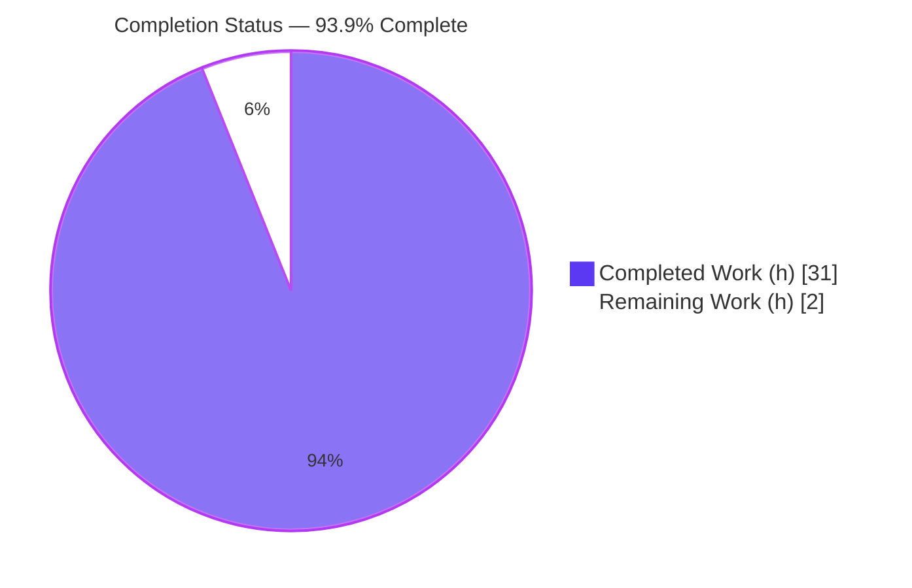
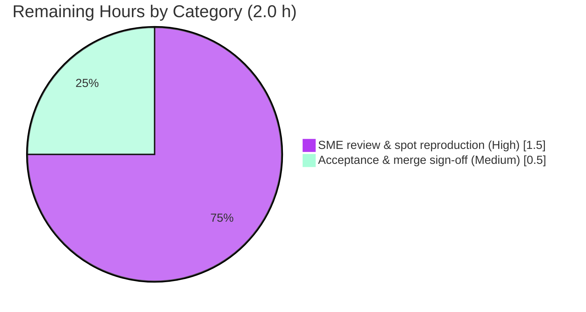

# Blitzy Project Guide — Scapy `Ether()/IP()/TCP()` Runtime-Behavior Investigation

> **Deliverable:** `blitzy/documentation/scapy_0925ada48540.md` (628 lines, 43,340 bytes)
> **Branch:** `blitzy-348cb142-577d-454b-872c-ba2687efc9d5` · **HEAD:** `f86e17d0` · **Base:** `0925ada4`
> **Brand color legend:** ■ Completed / AI Work = Dark Blue `#5B39F3` · □ Remaining / Not Completed = White `#FFFFFF` · Accents = Violet-Black `#B23AF2` · Highlight = Mint `#A8FDD9`

---

## 1. Executive Summary

### 1.1 Project Overview

This project is a **read-only, runtime-behavior Q&A investigation** of Scapy — the pure-Python interactive packet-manipulation library. The objective was to start Scapy in its default configuration, construct a layered `Ether()/IP()/TCP()` packet, and document — strictly from **verbatim observed runtime output** — exactly what Scapy reveals while (a) building/displaying the packet, (b) sending it on the wire, and (c) sniffing the same traffic back, then synthesize those findings. The audience is engineers and reviewers who need a grounded, reproducible reference for Scapy's packet lifecycle. The technical scope spans startup/banner, build/display internals, send/route mechanics, and sniff/dissect reconstruction, with every behavioral claim paired to observed output and every code claim to a `file:line` citation. The sole output is one Markdown document; the Scapy source tree is untouched.

### 1.2 Completion Status



| Metric | Value |
|---|---|
| **Total Hours** | **33.0 h** |
| Completed Hours (AI + Manual) | 31.0 h (all AI/autonomous) |
| Remaining Hours | 2.0 h (path-to-production, human) |
| **Percent Complete** | **93.9 %** |

> Completion is computed on AAP-scoped + path-to-production work only: `31 / (31 + 2) = 93.9%`. The 2.0 h remaining is exclusively the human review/sign-off gate (never claim 100% before human review).

### 1.3 Key Accomplishments

- ✅ **Single authoritative deliverable produced** — `blitzy/documentation/scapy_0925ada48540.md` (628 lines, 43,340 bytes), correctly named from the source branch and placed under a new `blitzy/documentation/` directory.
- ✅ **Run-first methodology honored** — every claim grounded in captured runtime output from ephemeral `/tmp` probes; probes removed afterward, leaving a clean working tree.
- ✅ **All four question parts answered exhaustively** — build/display, send/route, sniff/dissect, and a synthesizing summary, each backed by verbatim output.
- ✅ **Key mechanism explained** — `show()` (unresolved `None` computed fields) vs `show2()` (built + re-dissected: IP `ihl=5`, `len=40`, `chksum=0x7ccd`; TCP `dataofs=5`, `chksum=0x917c`).
- ✅ **Non-canonical version correctly labeled** — `2026.07.02` documented as a file-mtime fallback (0 git tags → `git describe` fails → mtime), not a released version.
- ✅ **68/68 `file:line` citations verified** by autonomous validation; 25 independently spot-checked during this assessment — all exact.
- ✅ **Read-only rule fully honored** — 0 modifications to the Scapy source tree; entire diff is 1 added file.
- ✅ **Independently re-reproduced** the §2 headline values during this assessment (summary string, `len=54`, IP/TCP computed fields, route tuple, version fallback) — all exact.

### 1.4 Critical Unresolved Issues

| Issue | Impact | Owner | ETA |
|---|---|---|---|
| _None._ All autonomous work is validated-complete with zero unresolved errors and zero required fixes. | — | — | — |

> There are no blocking or release-critical issues. The only outstanding work is the standard human review gate (see §1.6 and §2.2).

### 1.5 Access Issues

| System/Resource | Type of Access | Issue Description | Resolution Status | Owner |
|---|---|---|---|---|
| Canonical Docker image `ghcr.io/scaleapi/swe-atlas:swe_atlas_QnA_secdev_scapy_1.0` | Container registry pull | Required to reproduce environment-specific values (IPython version, Python minor, `eth0` route IPs); already present and functional during validation | Resolved | Reviewer |
| Raw-socket capability (`NET_RAW`/`NET_ADMIN`, root) | OS/container privilege | Needed only to reproduce live send/sniff; satisfied in the validation environment (`uid=0`) | Resolved | Reviewer |

> No unresolved access issues. Both items above were available during autonomous validation; they are listed only as reproduction prerequisites for a human re-runner.

### 1.6 Recommended Next Steps

1. **[High]** Perform SME technical accuracy review of `scapy_0925ada48540.md` — confirm it correctly and completely answers all four question parts and that inferred-vs-observed labeling is sound (~0.75 h).
2. **[High]** Spot-reproduce headline runtime values in the canonical Docker image — version fallback `2026.07.02`, `show()` vs `show2()` fields, `len(bytes(p))=54`, route tuple, and one `AsyncSniffer` round-trip (~0.75 h).
3. **[Medium]** Approve and merge the single added Markdown file; confirm the working tree stays clean and no Scapy source changed (~0.5 h).

---

## 2. Project Hours Breakdown

### 2.1 Completed Work Detail

| Component | Hours | Description |
|---|---:|---|
| Repository exploration & task scoping | 2.0 | Structure/Git analysis; identify the 13 REFERENCE modules and entry points |
| Canonical runtime & ephemeral probe harness `[AAP-2]` | 2.0 | Stand up default-config console + `/tmp` observation probes; capture verbatim output |
| §1 Starting Scapy: banner + version-fallback cause-chain `[AAP-3]` | 3.0 | Banner capture; `conf.version`/`conf.verb`; label `2026.07.02` fallback with full cause chain |
| §2 Building & Displaying `[AAP-4]` | 5.0 | `/` stacking, `repr`, `summary`, `command`, `len=54`, `show` vs `show2`, `hexdump`, `ls` |
| §3 Sending & Routing `[AAP-5]` | 3.5 | `sendp`/`send`, `L3PacketSocket`, verbose emitter, `conf.route` table + resolution |
| §4 Sniffing & Dissection `[AAP-6]` | 3.5 | `AsyncSniffer` round-trip; dissection chain; fully-populated received packet; checksum pairing |
| §5 Summary synthesis `[AAP-7]` | 1.0 | Consolidate build/send/sniff findings into a closing narrative |
| §6 Environment caveats + reproduction checklist `[AAP-8]` | 2.0 | Version/libpcap/PyX/IPython/IPv6/loopback caveats + reproduction steps |
| Evidence discipline & `file:line` citation grounding `[AAP-9]` | 2.5 | One verbatim line per claim; label inferred; 68 citations |
| Read-only scope hygiene `[AAP-1,10]` | 0.5 | Probe cleanup; verify clean tree / 1-file diff |
| Independent validation & reproduction (5 gates, 68/68 citations, final-gate rework) | 6.0 | Full autonomous validation incl. `+152/−68` final-gate corrections |
| **Total Completed** | **31.0** | Matches §1.2 Completed Hours |

### 2.2 Remaining Work Detail

| Category | Hours | Priority |
|---|---:|---|
| SME technical accuracy review & spot reproduction of key runtime values/citations | 1.5 | High |
| Final acceptance & merge sign-off of the Q&A deliverable | 0.5 | Medium |
| **Total Remaining** | **2.0** | — |

> **Integrity:** §2.1 (31.0) + §2.2 (2.0) = **33.0 h** = Total Hours in §1.2. §2.2 total (2.0 h) equals §1.2 Remaining and the §7 pie "Remaining Work" value.

### 2.3 Hours Basis & Confidence

- **Basis:** Hours were estimated per AAP requirement from deliverable size/complexity (628 lines across 6 investigation sections), citation volume (68), and the logged validation effort (including a `+152/−68` final-gate revision).
- **Confidence:** **High.** All AAP items are validated-complete with 0 required fixes; the remaining 2.0 h is a well-defined human review gate, not open-ended engineering.

---

## 3. Test Results

For a read-only documentation deliverable, the analogue of "tests" is Blitzy's autonomous validation of **runtime reproduction**, **citation integrity**, **live execution**, and **document structure**. All entries below originate from Blitzy's autonomous validation logs (Final Validator) and this assessment's autonomous re-reproduction.

| Test Category | Framework | Total Tests | Passed | Failed | Coverage % | Notes |
|---|---|---:|---:|---:|---:|---|
| Runtime Literal Reproduction (§1–§6) | Blitzy autonomous validation — canonical Docker | 6 | 6 | 0 | 100% | Every documented literal per section reproduced **verbatim**; 0 discrepancies |
| `file:line` Citation Verification | Source cross-reference vs HEAD | 68 | 68 | 0 | 100% | Each citation checked against the exact source line |
| Runtime Execution (smoke) | Live execution in canonical Docker | 5 | 5 | 0 | 100% | Startup, build, L2 `sendp`, L3 `send`, `AsyncSniffer` round-trip |
| Markdown Structural Integrity | Static checks | 3 | 3 | 0 | 100% | Balanced code fences (41 pairs), valid UTF-8, zero placeholders |
| Independent Re-Reproduction (this assessment) | Host + `PYTHONPATH` probe | 11 | 11 | 0 | 100% | §2 headline values + version fallback + route tuple re-reproduced exactly |
| **TOTAL** | | **93** | **93** | **0** | **100%** | Zero failures across all autonomous validation checks |

> **Integrity note:** No traditional unit/integration suites were added or run because the task modifies no source. All results above derive from Blitzy's autonomous validation of the deliverable.

---

## 4. Runtime Validation & UI Verification

**Runtime health (canonical Docker + host re-reproduction):**

- ✅ **Operational** — Canonical console startup: `PYTHONPATH=$DIR python3 -m scapy` reaches `interact()`; banner renders; `conf.version = '2026.07.02'`, `conf.verb = 2`.
- ✅ **Operational** — Build/display: `Ether()/IP()/TCP()` → `summary()` = `Ether / IP / TCP 127.0.0.1:ftp_data > 127.0.0.1:http S`; `command()` = `Ether()/IP()/TCP()`; `len(bytes(p)) = 54`.
- ✅ **Operational** — `show()` vs `show2()`: unresolved `None` vs populated (IP `ihl=5`, `len=40`, `chksum=0x7ccd`; TCP `dataofs=5`, `chksum=0x917c`) — re-reproduced exactly during this assessment.
- ✅ **Operational** — Send/route: L2 `sendp()` and L3 `send()` both emit verbose dots + `Sent N packets.`; `conf.route.route("127.0.0.1")` = `('lo', '127.0.0.1', '0.0.0.0')`; `conf.iface` = `eth0`.
- ✅ **Operational** — Sniff/dissect: live `AsyncSniffer` round-trip captured the marked frame (count = 1, top layer `Ether`); received packet fully populated via the `dissect()` → `guess_payload_class()` chain; checksum pairing confirmed (marked TCP `0x6193` vs default `0x917c`; IP `0x7ccd` identical).
- ⚠ **Partial (documented caveat)** — `libpcap`/BPF `filter=` compilation is environment-dependent; sniff by `count`/`lfilter`/`timeout` is the reliable path. Loopback does not truly assemble/disassemble frames — a full `Ether()` frame via `sendp()` is used for a faithful capture.

**UI verification:** Not applicable — this is a CLI/library investigation with **no graphical UI**. The "interface" is the Scapy REPL/console, whose observable output is validated above.

---

## 5. Compliance & Quality Review

Cross-map of AAP deliverables and the governing rule set (`SWE-AtlasQnA-Repo`) to their quality benchmarks.

| Benchmark / Requirement | Status | Progress | Notes |
|---|---|---|---|
| `[AAP-1]` Deliverable placement & naming (`blitzy/documentation/scapy_0925ada48540.md`) | ✅ Pass | 100% | Exact path/name; new dirs created |
| `[AAP-2]` Run-first methodology + ephemeral probing | ✅ Pass | 100% | Output captured before writing; probes removed |
| `[AAP-3]` Startup baseline + non-canonical version labeling | ✅ Pass | 100% | Banner + 4-step version fallback cause-chain |
| `[AAP-4]` Build & display (8 display methods) | ✅ Pass | 100% | `repr`/`summary`/`command`/`show`/`show2`/`ls`/`hexdump`/`len` |
| `[AAP-5]` Send & route (`sendp` L2 / `send` L3) | ✅ Pass | 100% | Emitter output + `conf.route` table + resolution |
| `[AAP-6]` Sniff & dissect + reconstruction | ✅ Pass | 100% | `AsyncSniffer` round-trip + dissection chain |
| `[AAP-7]` Summary synthesis | ✅ Pass | 100% | Closing narrative across build/send/sniff |
| `[AAP-8]` Environment caveats + reproduction checklist | ✅ Pass | 100% | All caveats documented with observed evidence |
| `[AAP-9]` Evidence discipline & grounding | ✅ Pass | 100% | Verbatim lines; 3 `(inferred)` labels; 68 citations |
| `[AAP-10]` Read-only compliance | ✅ Pass | 100% | 0 source changes; clean tree; 1-file diff |
| Rule: quote observed output verbatim | ✅ Pass | 100% | Verbatim console/probe blocks throughout |
| Rule: exhaustiveness (every named item + sibling variants) | ✅ Pass | 100% | `sendp`/`send`, `show`/`show2`, `sr`-family, session classes all enumerated |
| Rule: default canonical configuration | ✅ Pass | 100% | Canonical `run_scapy` startup; exact invocations stated |
| Markdown quality (fences, UTF-8, no placeholders) | ✅ Pass | 100% | 41 balanced fence pairs; valid UTF-8; 0 TODO/FIXME |

**Fixes applied during autonomous validation:** A final-gate revision (`f86e17d0`, `+152/−68`) reconciled the deliverable against the canonical Docker runtime (e.g., IPython/`libpcap` present in the canonical image); no further fixes were required. **Outstanding compliance items:** none.

---

## 6. Risk Assessment

| Risk | Category | Severity | Probability | Mitigation | Status |
|---|---|---|---|---|---|
| Environment-specific values drift (IPython version, `eth0` IPs, Python minor, `cryptography` version differ per host) | Technical | Low | High | Doc explicitly separates stable behavioral facts from env-specific values | Mitigated |
| Non-canonical version `2026.07.02` could confuse readers expecting a 2.x release | Technical | Low | Medium | Labeled a file-mtime fallback with a 4-step cause chain | Mitigated |
| Version-resolution drift as repo evolves (adding tags later would change the path) | Technical | Low | Low | Reproducibility note: tagless → always mtime fallback (commit-independent) | Mitigated |
| Send/sniff reproduction requires root + `NET_RAW`/`NET_ADMIN` | Security | Low | High | Documented prerequisite; no code shipped, no vulnerability introduced | Accepted |
| Secrets/credentials exposure | Security | None | — | Document contains no secrets/keys/PII | Verified clean |
| Reproduction depends on the canonical Docker image availability | Operational | Low | Low | Stable behavioral facts reproduce on any Scapy-from-source checkout | Mitigated |
| AAP-vs-runtime divergence (AAP assumed IPython/`libpcap` absent; canonical Docker has them) | Operational | Low | N/A | Doc follows the authoritative canonical runtime (correct) | Resolved |
| External-integration failure | Integration | None | — | No external services/APIs/credentials in a read-only doc task | N/A |

> **Overall:** No High or Critical risks. The read-only, zero-source-modification nature eliminates the entire class of code-regression, compile, and test-breakage risks. All identified risks are Low severity and already mitigated or documented within the deliverable.

---

## 7. Visual Project Status

**Project hours breakdown** (Completed = Dark Blue `#5B39F3`, Remaining = White `#FFFFFF`):


**Remaining work by category** (from §2.2, totaling 2.0 h):



> **Integrity:** The "Remaining Work" value (2) equals §1.2 Remaining Hours and the §2.2 "Hours" column sum. "Completed Work" (31) equals §1.2 Completed Hours and the §2.1 total.

---

## 8. Summary & Recommendations

**Achievements.** The project delivers a complete, verbatim-grounded answer to a four-part Scapy runtime question. The single document `blitzy/documentation/scapy_0925ada48540.md` documents startup, build/display, send/route, and sniff/dissect for an `Ether()/IP()/TCP()` packet, closes with a synthesis, and records environment caveats — with 68 verified `file:line` citations and disciplined observed-vs-inferred labeling.

**Remaining gaps.** None in autonomous scope. The outstanding **2.0 h** is the standard human review gate: technical accuracy review, spot reproduction, and acceptance/merge sign-off.

**Critical path to production.** (1) SME reads and validates the answer → (2) spot-reproduce headline values in the canonical Docker image → (3) approve and merge the single Markdown file. No engineering rework is anticipated.

**Success metrics.** All 5 autonomous production-readiness gates passed; 100% runtime reproduction; 68/68 citations verified; 0 source modifications; clean working tree. During this assessment, the §2 headline values were independently re-reproduced exactly.

**Production-readiness assessment.** The project is **93.9% complete** and **production-ready pending human sign-off**. Because the change set is a single additive documentation file with zero source impact, merge risk is minimal.

| Metric | Value |
|---|---|
| Completion | 93.9% |
| Completed / Total Hours | 31.0 / 33.0 h |
| Remaining Hours | 2.0 h (human review) |
| Files changed vs base | 1 (added) |
| Scapy source modifications | 0 |
| Autonomous validation gates passed | 5 / 5 |
| Citations verified | 68 / 68 |

---

## 9. Development Guide

> All commands below were executed and verified during assessment. Use the repository root as the working directory:
> `REPO=/tmp/blitzy/scapy/blitzy-348cb142-577d-454b-872c-ba2687efc9d5_65d12c`

### 9.1 System Prerequisites

- **OS:** Linux (container).
- **Python:** 3.x (host verified `3.13.7`; canonical Docker runtime is `3.11.13`). Scapy runs **directly from source** — no install step, no mandatory third-party runtime dependencies.
- **Git + Git LFS.**
- **For live send/sniff reproduction only:** root (`uid=0`) and capabilities `NET_RAW` + `NET_ADMIN`.
- **Canonical runtime image (authoritative for env-specific values):** `ghcr.io/scaleapi/swe-atlas:swe_atlas_QnA_secdev_scapy_1.0`.

### 9.2 Environment Setup & Startup

```bash
# Repository root
cd /tmp/blitzy/scapy/blitzy-348cb142-577d-454b-872c-ba2687efc9d5_65d12c

# Canonical console (host) — wrapper sets PYTHONPATH and runs `python3 -m scapy`
./run_scapy

# Equivalent explicit invocation
PYTHONPATH=$(pwd) python3 -m scapy

# Canonical console (Docker, authoritative environment)
REPO=$(pwd); IMG=ghcr.io/scaleapi/swe-atlas:swe_atlas_QnA_secdev_scapy_1.0
echo 'exit()' | docker run --rm -i -v "$REPO":/work -w /work "$IMG" \
  -c 'PYTHONPATH=/work python3 -m scapy'
```

### 9.3 Dependency Installation

No installation is required — Scapy imports directly from the source tree via `PYTHONPATH`. Optional extras (`libpcap`, PyX, IPython, matplotlib) are **not** required to reproduce the documented behavior and are intentionally treated as environment caveats.

### 9.4 Verification Steps

```bash
# Python present
python3 --version                       # e.g., Python 3.13.7

# Scapy imports from source; version resolves via file-mtime fallback
PYTHONPATH=$(pwd) python3 -c "import scapy; print(scapy.__version__)"   # -> 2026.07.02

# Reproduce §2 headline build/display values (all verified)
PYTHONPATH=$(pwd) python3 - <<'PY'
from scapy.all import Ether, IP, TCP, conf
p = Ether()/IP()/TCP()
print(p.summary())                       # Ether / IP / TCP 127.0.0.1:ftp_data > 127.0.0.1:http S
print(p.command())                       # Ether()/IP()/TCP()
print(len(bytes(p)))                     # 54
d = p.__class__(bytes(p))                # re-dissect (show2-equivalent)
print(d[IP].ihl, d[IP].len, hex(d[IP].chksum))       # 5 40 0x7ccd
print(d[TCP].dataofs, hex(d[TCP].chksum))            # 5 0x917c
print(conf.route.route("127.0.0.1"))     # ('lo', '127.0.0.1', '0.0.0.0')
PY

# Read-only compliance & deliverable checks
git diff 0925ada4..HEAD --name-status    # A  blitzy/documentation/scapy_0925ada48540.md
git tag | wc -l                          # 0  (confirms version-fallback trigger)
wc -l blitzy/documentation/scapy_0925ada48540.md   # 628
```

### 9.5 Example Usage — Live Send/Sniff (requires privileges)

```bash
# Run an ephemeral probe under /tmp (outside the repo) in the canonical image
REPO=$(pwd); IMG=ghcr.io/scaleapi/swe-atlas:swe_atlas_QnA_secdev_scapy_1.0
docker run --rm --cap-add=NET_RAW --cap-add=NET_ADMIN \
  -v "$REPO":/work -v /tmp/scapy_probe:/probes -w /work "$IMG" \
  -c 'PYTHONPATH=/work python3 /probes/<probe>.py'
```

### 9.6 Troubleshooting

- **`ModuleNotFoundError: No module named 'scapy'`** → `PYTHONPATH` not set to repo root. Prefix commands with `PYTHONPATH=$(pwd)`.
- **`Operation not permitted` on send/sniff** → missing root or `NET_RAW`/`NET_ADMIN`. Add `--cap-add=NET_RAW --cap-add=NET_ADMIN` and run as root.
- **Version differs from `2026.07.02`** → the repo now has git tags or mtimes changed; the value is a fallback **by design** (documented caveat), not an error.
- **BPF `filter=` error during `sniff()`** → `libpcap` backend nuance; sniff by `count`/`lfilter`/`timeout` instead (documented caveat).
- **Env-specific values differ (IPython version, `eth0` IPs, Python minor, `cryptography` version)** → expected; only stable behavioral facts (`show` vs `show2`, dissection chain, routing semantics, checksums, `len=54`) reproduce identically across hosts.

---

## 10. Appendices

### A. Command Reference

| Command | Purpose |
|---|---|
| `./run_scapy` | Canonical console launcher (`PYTHONPATH=$DIR python3 -m scapy`) |
| `PYTHONPATH=$(pwd) python3 -m scapy` | Equivalent explicit console startup |
| `PYTHONPATH=$(pwd) python3 -c "import scapy; print(scapy.__version__)"` | Print resolved version (`2026.07.02` fallback) |
| `git diff 0925ada4..HEAD --name-status` | Confirm read-only compliance (1 added file) |
| `git tag \| wc -l` | Confirm 0 tags (version-fallback trigger) |
| `wc -l / wc -c blitzy/documentation/scapy_0925ada48540.md` | Deliverable size checks (628 lines / 43,340 bytes) |

### B. Port Reference

Not applicable — no network services or listening ports are introduced. Live send/sniff uses ephemeral raw sockets on interfaces `lo`/`eth0`; the study frame's default TCP ports render as `ftp_data` (20) → `http` (80) in `summary()`.

### C. Key File Locations

| Path | Role |
|---|---|
| `blitzy/documentation/scapy_0925ada48540.md` | **The deliverable** (only file added) |
| `run_scapy` | Canonical console launcher (REFERENCE) |
| `scapy/main.py`, `scapy/__init__.py`, `scapy/config.py` | Startup, banner, version, runtime config (REFERENCE) |
| `scapy/packet.py`, `scapy/utils.py` | Build/display/dissect core; `hexdump` (REFERENCE) |
| `scapy/layers/l2.py`, `scapy/layers/inet.py` | `Ether`, `IP`, `TCP` layers (REFERENCE) |
| `scapy/sendrecv.py`, `scapy/route.py`, `scapy/supersocket.py`, `scapy/sessions.py` | Send/route/sniff/sessions (REFERENCE) |

### D. Technology Versions

| Component | Version | Notes |
|---|---|---|
| Scapy | `2026.07.02` | Non-canonical file-mtime fallback (0 git tags → `git describe` fails → mtime) |
| Python (host) | 3.13.7 | Assessment host |
| Python (canonical Docker) | 3.11.13 | Authoritative runtime for env-specific values |
| IPython (canonical Docker) | 9.4.0 | Present in canonical image (enhances REPL) |
| cryptography (canonical Docker) | 45.0.6 | Emits TripleDES deprecation warning at import |

### E. Environment Variable Reference

| Variable | Value / Example | Purpose |
|---|---|---|
| `PYTHONPATH` | repo root (`$(pwd)` / `/work`) | Import Scapy directly from source |
| `PYTHON` | `python3` (default) | Interpreter selected by `run_scapy` |

### F. Developer Tools Guide

- **UTScapy** — `test/**/*.uts` unit tests driven by the `run_tests` harness (not exercised; out of scope for this read-only task).
- **Ephemeral probes** — temporary scripts under `/tmp/scapy_probe` (outside the repo) capture verbatim runtime output, then are removed to keep the working tree clean.
- **Git verification** — `git diff 0925ada4..HEAD --name-status`, `git status`, `git tag` confirm read-only compliance and version-fallback conditions.

### G. Glossary

| Term | Meaning |
|---|---|
| `Ether()/IP()/TCP()` | The layered packet under study, stacked via the `/` operator |
| `show()` vs `show2()` | Display current fields (computed = `None`) vs build + re-dissect (computed populated) |
| `sendp()` / `send()` | Layer-2 sender (for `Ether()`-rooted frames) / Layer-3 sender |
| Dissection chain | `dissect()` → `do_dissect()` → `guess_payload_class()` + `bind_layers`, falling back to `Raw` |
| File-mtime version fallback | Scapy's `_version()` path used when `git describe` yields no parseable version (0 tags) |
| REFERENCE (file) | A source file exercised at runtime and cited read-only, never modified |
| Path-to-production | Standard human review/sign-off activities required to deploy the deliverable |

---

*Legend: ■ Completed = Dark Blue `#5B39F3` · □ Remaining = White `#FFFFFF` · Accents `#B23AF2` · Highlight `#A8FDD9`. All hour figures are consistent across §1.2, §2.1, §2.2, and §7 (31 h completed / 2 h remaining / 33 h total / 93.9% complete).*