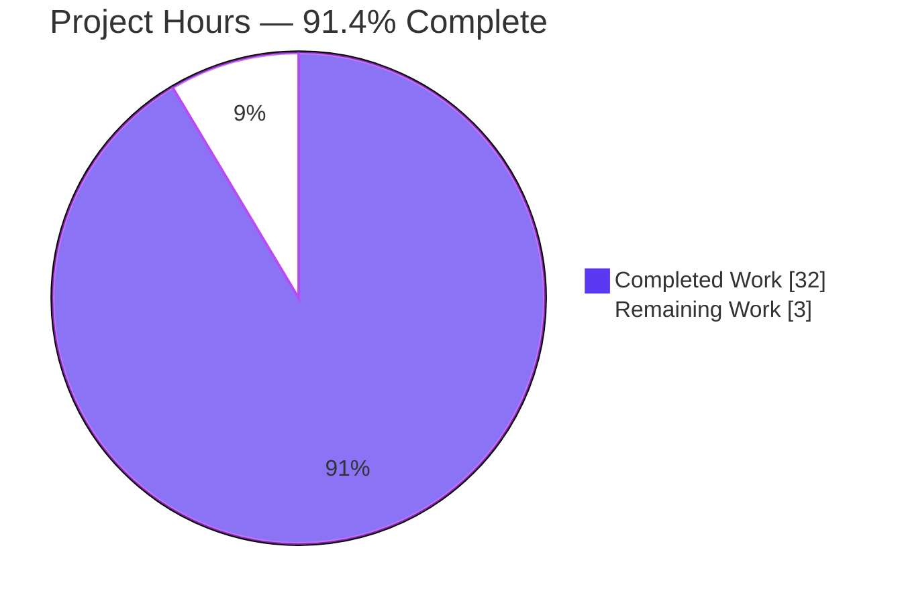
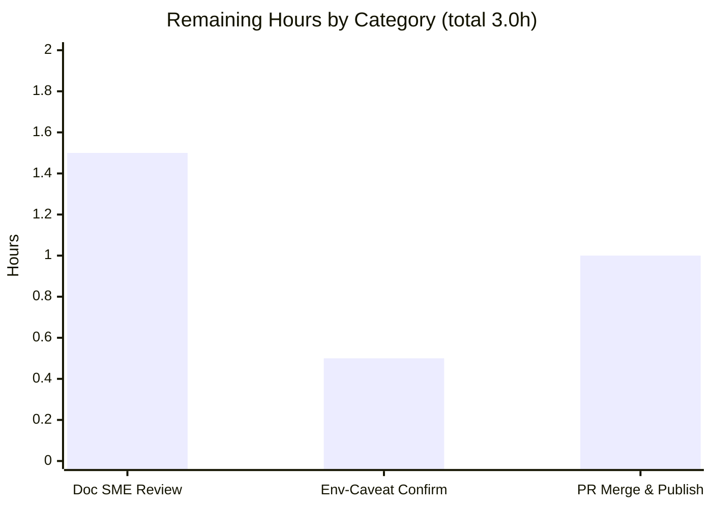

# Blitzy Project Guide
### How Scapy Works — Grounded Q&A Documentation (`scapy_0925ada48540`)

> **Brand color legend** — <span style="color:#5B39F3">■</span> **Completed / AI Work** = Dark Blue `#5B39F3` · <span style="color:#FFFFFF">□</span> **Remaining / Not Completed** = White `#FFFFFF` · Headings/Accents = Violet‑Black `#B23AF2` · Highlight = Mint `#A8FDD9`

---

## 1. Executive Summary

### 1.1 Project Overview

This project delivers one authoritative, **run‑first grounded** Q&A document — `blitzy/documentation/scapy_0925ada48540.md` — that explains how the Scapy packet‑manipulation library behaves and is built, for a developer who has just checked out commit `0925ada485…` and wants to understand it before crafting packets. The document answers seven sub‑questions (shell startup, version, ICMP field auto‑population, `show()` output, localhost send, default IP‑header construction, and the test‑suite summary), each backed by **verbatim executed output**, exact `file:line` source citations, and reasoning. It is a knowledge‑capture deliverable: the codebase is read and executed under a strict **read‑only** mandate, and the sole artifact written is the answer document.

### 1.2 Completion Status

The completion percentage reflects **only AAP‑scoped work and its path‑to‑production** (PA1 methodology). Every one of the AAP's autonomous deliverables is complete; the remaining hours are the human review/publish gate that an autonomous agent cannot self‑approve.


| Metric | Value |
|--------|-------|
| **Total Hours** | **35.0 h** |
| **Completed Hours (AI + Manual)** | **32.0 h** (32.0 h AI autonomous · 0.0 h manual) |
| **Remaining Hours** | **3.0 h** |
| **Percent Complete** | **91.4 %** |

> Calculation: `Completion % = Completed ÷ (Completed + Remaining) = 32.0 ÷ 35.0 = 91.4 %`.

### 1.3 Key Accomplishments

- ✅ **Single deliverable created** at the exact required path/name: `blitzy/documentation/scapy_0925ada48540.md` (708 lines) — filename equals the source branch `scapy_0925ada48540`.
- ✅ **All seven sub‑questions answered** — each with (a) verbatim observed output, (b) `file:line` citations, and (c) reasoning; a final coverage pass explicitly checks off all seven.
- ✅ **Run‑first methodology honored** — the Scapy console, packet build/serialize/re‑dissect, loopback send (two socket types), build‑pipeline demo, and the full UTscapy campaign were all executed and captured before writing.
- ✅ **97 `file:line` citations** across 10+ Scapy modules, all verified against commit `0925ada485…`; all cited modules `py_compile` cleanly.
- ✅ **Measured test counts** captured (not a static file count): full Linux campaign **PASSED=4812 FAILED=196** (5008 executed cases, 190 campaigns), with every failure root‑caused.
- ✅ **Read‑only mandate upheld** — **zero source files modified**; all temporary scripts removed; working tree pristine (`git status --porcelain` empty).
- ✅ **Honesty flags** — volatile values (version date, random banner quote, reply `id`/`chksum`) and environment‑specific test failures are explicitly documented rather than hidden.

### 1.4 Critical Unresolved Issues

There are **no unresolved issues within the deliverable's scope.** The single in‑scope artifact is complete, accurate, and validated. The item below is **documented subject matter that is explicitly out of scope to fix** under the read‑only mandate, listed here for transparency.

| Issue | Impact | Owner | ETA |
|-------|--------|-------|-----|
| Scapy TLS layer import fails under `cryptography` ≥ 43 (`scapy/layers/tls/cert.py:L51`) — accounts for 194 of 196 documented UTscapy failures | None on the deliverable (correctly documented, not a doc defect). A pre‑existing Scapy‑library/runtime incompatibility that read‑only rules forbid fixing here | Scapy maintainers (upstream) | N/A — out of scope; deferred |

### 1.5 Access Issues

**No access issues identified.** The task ran entirely within the provided container against the local working tree.

| System/Resource | Type of Access | Issue Description | Resolution Status | Owner |
|-----------------|----------------|-------------------|-------------------|-------|
| Git repository (local working tree) | Read/Write (single file) | None — deliverable committed at HEAD `19b74b1b` | ✅ Resolved | Blitzy Agent |
| Scapy source tree | Read‑only (REFERENCE) | None — all 10 cited modules readable & compile cleanly | ✅ Resolved | Blitzy Agent |
| Raw sockets (loopback send, Q5) | Root privilege | None — container runs as `uid=0`; send succeeded | ✅ Resolved | Blitzy Agent |

### 1.6 Recommended Next Steps

1. **[High]** Perform SME technical review of all seven answers and spot‑verify the 97 `file:line` citations against commit `0925ada485…`.
2. **[High]** Confirm the environment‑specific Q7 caveat (the TLS failures are attributable to `cryptography` ≥ 43, not to Scapy tests themselves).
3. **[Medium]** Merge the PR and publish the document; verify GitHub‑flavored Markdown and the single Mermaid diagram render correctly on the destination portal.
4. **[Low]** *(Optional, out of scope)* File an upstream Scapy issue for the `cryptography`‑43 TLS incompatibility and the TripleDES deprecation.

---

## 2. Project Hours Breakdown

### 2.1 Completed Work Detail

Every completed component traces to a specific AAP requirement (the seven sub‑questions) or to a required cross‑cutting/path‑to‑production activity. **Total = 32.0 h.**

| Component | Hours | Description |
|-----------|-------|-------------|
| **Q1 — Shell startup** | 2.5 | Launched console; captured verbatim ASCII banner + PyX/IPv6/IPython/TripleDES lines; traced `scapy/main.py` L503/L589/L628/L646; documented random‑quote rotation & `catch_warnings` subtlety |
| **Q2 — Version resolution** | 2.0 | Probed `conf.version=2026.07.01`; traced the `_version()` fallback chain (`scapy/__init__.py:L122‑169`); explained the date‑fallback for a tagless checkout & git‑describe behavior |
| **Q3 — IP()/ICMP() field auto‑population** | 3.0 | Pre‑build `None` placeholders vs. post‑serialization values; serialized to 28 bytes and decoded **byte‑by‑byte**; mapped every field to `inet.py:L521‑537`; `overload_fields` nuance |
| **Q4 — `show()` output** | 1.5 | Captured verbatim field‑by‑field IP+ICMP rendering; explained it is the pre‑build human view (`packet.py:L1459/L1383`) |
| **Q5 — Localhost send (L3)** | 3.0 | Dual‑socket send script; route resolution `('lo','127.0.0.1','0.0.0.0')`; `L3PacketSocket`→0 answers vs `L3RawSocket`→echo‑reply; privilege + volatile‑field handling |
| **Q6 — Default IP construction (source)** | 4.0 | Source inspection (grep/sed) + runtime demo mirroring `do_build`; `build()→do_build()→self_build()→post_build()` pipeline; Mermaid diagram; per‑field computation citations; smart‑defaults reasoning |
| **Q7 — Test suite (measured)** | 4.5 | UTscapy framework analysis; representative suites (CRC/SHA); full Linux campaign (×3 runs, ~2m33s); aggregation pipeline; 196‑failure root‑cause tracing; manuf/IPv6 skip reconciliation |
| **Runtime environment bring‑up** | 1.5 | Built/ran in the target image; verified Scapy imports from source tree (not pip); confirmed interpreter & dependency realities |
| **Document assembly & formatting** | 3.0 | Structured the 708‑line doc: header, environment note, honesty flags, per‑Q sections, coverage pass, Mermaid, tables, 42 balanced code fences |
| **Coverage pass + citation verification** | 2.0 | Verified all seven sub‑questions addressed; checked all 97 `file:line` citations against the checkout |
| **Repository hygiene** | 0.5 | Removed all `/tmp` scripts and the test‑generated `RMBA_dump.hex`; confirmed clean working tree |
| **Iterative review‑finding resolution** | 2.0 | Two follow‑up commits (`4db2278a`, `19b74b1b`): evidence‑structure fixes, Q2 git‑describe & Q7 UTscapy reproducibility corrections |
| **Final Validator re‑validation** | 2.5 | Re‑ran all seven observations + full campaign; `py_compile` of all cited modules; citation & clean‑tree verification |
| **TOTAL** | **32.0** | |

### 2.2 Remaining Work Detail

All remaining work is the **human path‑to‑production gate** (an autonomous agent cannot self‑approve a review or merge to production). **Total = 3.0 h.**

| Category | Hours | Priority |
|----------|-------|----------|
| Documentation SME review & citation verification (accuracy + completeness of all 7 answers) | 1.5 | High |
| Environment‑caveat confirmation (verify Q7 TLS failures are `cryptography`‑43 runtime‑dependent) | 0.5 | High |
| PR merge & documentation publish (GFM + Mermaid render verification) | 1.0 | Medium |
| **TOTAL** | **3.0** | |

### 2.3 Hours Reconciliation

| Check | Result |
|-------|--------|
| Section 2.1 completed sum | **32.0 h** |
| Section 2.2 remaining sum | **3.0 h** |
| 2.1 + 2.2 = Total (Section 1.2) | 32.0 + 3.0 = **35.0 h** ✅ |
| Completion % = 32.0 ÷ 35.0 | **91.4 %** ✅ |
| Remaining matches Section 1.2 & Section 7 | 3.0 = 3.0 = 3.0 ✅ |

---

## 3. Test Results

All results below originate from **Blitzy's autonomous validation logs** for this project (the Final Validator's live re‑runs plus the assessment spot‑checks). Because the in‑scope deliverable is a **document**, its "tests" are the re‑execution of every observation it claims; the Scapy UTscapy rows are the **documented subject matter** (Q7), reported exactly as measured.

| Test Category | Framework | Total Tests | Passed | Failed | Coverage % | Notes |
|---------------|-----------|:-----------:|:------:|:------:|:----------:|-------|
| **In‑scope: Observation re‑validation** | Manual run‑first re‑execution | 7 | 7 | 0 | 100% | All 7 sub‑question observations re‑run live; verbatim match to the document |
| **In‑scope: Reference‑module compile** | `py_compile` | 10 | 10 | 0 | 100% | All 10 cited `.py` modules compile cleanly |
| **In‑scope: Markdown structure** | grep / fence‑balance | 3 | 3 | 0 | 100% | 42 balanced code fences, 1 Mermaid block, 97 citations, **0** stub placeholders |
| Documented: `test/fields.uts` | UTscapy | 138 | 138 | 0 | — | Clean baseline; `CRC=32E6B059`, `SHA=CE16EAB7…` |
| Documented: `test/random.uts` | UTscapy | 11 | 11 | 0 | — | `CRC=3D33A34F` |
| Documented: `test/imports.uts` | UTscapy | 4 | 3 | 1 | — | 1 fail = TLS `cert.py` import (`cryptography` ≥ 43) |
| Documented: `test/regression.uts` | UTscapy | 287 | 284 | 3 | — | Standalone; manuf + 2 IPv6 (skipped in campaign) |
| **Documented: Full Linux campaign** | UTscapy | **5008** | **4812** | **196** | — | 190 campaigns, ~2m33s; **194/196** = TLS `cryptography`‑43 break; 2 non‑TLS (`dhcp`→IPython, `uds_scanner`→struct.error) |

**Interpretation.** The **in‑scope deliverable passes 100%** — every observation reproduces and every citation resolves. The 196 UTscapy failures are the *subject* of the documentation (Q7 asks to *report* the pass/fail summary), not a defect in the deliverable; 194 of them share one out‑of‑scope root cause (`scapy/layers/tls/cert.py:L51` importing an API removed in `cryptography` 43.0.0).

---

## 4. Runtime Validation & UI Verification

Scapy's interface is a **terminal REPL** — there is no graphical UI. The relevant surfaces are textual (the console banner and the `show()` rendering), both captured verbatim.

**Runtime health (all re‑executed live):**

- ✅ **Console launch** — `./run_scapy` boots the fancy banner (`Welcome to Scapy` / `Version 2026.07.01` / GitHub URL) and the `>>>` prompt.
- ✅ **Version probe** — `conf.version` → `2026.07.01`.
- ✅ **Packet craft/serialize/re‑dissect** — `IP()/ICMP()` → 28 bytes; re‑dissect `ihl=5 len=28 proto=1 chksum=0x7cde`; summary `IP / ICMP 127.0.0.1 > 127.0.0.1 echo-request 0`.
- ✅ **`show()` rendering** — field‑by‑field IP+ICMP output (placeholders display `None` pre‑build).
- ✅ **Build‑pipeline demo** — runtime hand‑drive reproduces `self_build` (`4000…`) → `post_build` (`4500001c…7cde`).
- ✅ **Localhost send** — route `('lo','127.0.0.1','0.0.0.0')`; `L3RawSocket` captures the echo‑reply.
- ⚠ **Localhost send (default socket)** — default `L3PacketSocket` (PF_PACKET) returns **0 answers** on loopback — a known limitation, **documented as expected behavior**, not a failure.
- ✅ **UTscapy execution** — single suites and the full Linux campaign run to completion.

**UI verification (textual surfaces):**

- ✅ **Banner (Q1)** — captured verbatim, including info/warning lines and the (random) quote line.
- ✅ **`show()` output (Q4)** — captured verbatim field‑by‑field.

---

## 5. Compliance & Quality Review

Cross‑mapping the AAP's explicit rules (§0.7) to observed quality benchmarks. All in‑scope items pass.

| AAP Requirement / Rule | Benchmark | Status | Evidence |
|------------------------|-----------|:------:|----------|
| Deliverable location & naming = `<branch>.md` | File at `blitzy/documentation/scapy_0925ada48540.md` | ✅ Pass | Filename equals branch `scapy_0925ada48540`; single CREATE |
| Investigate by **running** code first | Verbatim output captured before writing | ✅ Pass | Every Q has an "Observed output (verbatim)" block with the producing command |
| Quote actual observed output verbatim | Real banners, counts, errors, markers | ✅ Pass | Banner, `PASSED=/FAILED=`, hex bytes, route tuple all verbatim |
| Answer **every** sub‑question | All 7 addressed + coverage pass | ✅ Pass | 7 `## Q#` sections + explicit coverage checklist |
| Be exact & grounded (`file:line`) | Exact literals with citations | ✅ Pass | 97 `file:line` citations; all resolve against checkout |
| Provide reasoning/rationale | "Reasoning" per answer | ✅ Pass | Each Q has a `### Reasoning` subsection |
| Read‑only scope (no source edits) | 0 tracked source files changed | ✅ Pass | `git diff` = 1 file added, 0 source modified |
| Clean working tree | `git status --porcelain` empty | ✅ Pass | Verified pre/post all runs; temp scripts + `RMBA_dump.hex` removed |
| Measured test counts (not file count) | Executed `UnitTest` cases | ✅ Pass | 193 file surface **plus** measured 5008 executed cases |
| Zero placeholders | No stub/TODO/FIXME | ✅ Pass | Only legitimate Scapy `None`‑placeholder terminology present |

**Fixes applied during autonomous validation:** two review cycles corrected evidence structure and Q7 reconciliation (`4db2278a`) and the Q2 git‑describe / Q7 UTscapy reproducibility notes (`19b74b1b`); the stale AAP version string `2026.06.30` was corrected to the live‑computed `2026.07.01` (0 residual occurrences).

**Outstanding compliance items:** none in scope.

---

## 6. Risk Assessment

This is a **read‑only, markdown‑only** deliverable (zero code/dependency changes), so the intrinsic risk profile is **low**. Deliverable risks are mitigated by the document's explicit honesty; two out‑of‑scope subject‑matter findings are deferred to maintainers.

| Risk | Category | Severity | Probability | Mitigation | Status |
|------|----------|----------|-------------|------------|--------|
| Volatile captured values (version date, random banner quote, reply `id`/`chksum`) differ on re‑run | Technical | Low | High | Doc explicitly flags every volatile value and explains the date‑fallback mechanism | ✅ Mitigated |
| Q7 failure profile is env‑specific (Python 3.13.7 / `cryptography` 43.0.0 vs prior 3.12.3 / 41.0.7 notes) | Technical | Medium | Medium | "Honesty flag" + per‑failure root cause with `file:line`; reconciles standalone vs campaign | ✅ Mitigated |
| Citation line‑number drift if source evolves | Technical | Low | Low | Header pins commit `0925ada485…`; all 97 citations verified against it | ✅ Mitigated |
| Reader cannot reproduce without matching runtime/privileges | Operational | Low | Medium | Environment note documents Python/crypto/IPython/PyX/root; Q5 documents privilege requirement + expected error | ✅ Mitigated |
| Mermaid / GFM rendering degradation on target portal | Operational | Low | Low | Single Mermaid block degrades to readable text; standard GFM | ⚠ Open (verify at publish) |
| No new code → no new attack surface (injection/authz/crypto) | Security | Informational | N/A | Deliverable is markdown only; `git diff` confirms zero source/dependency changes | ➖ N/A |
| **[Out of scope]** Scapy TLS layer fails to import under `cryptography` ≥ 43 (`scapy/layers/tls/cert.py:L51`) → 194 test failures | Technical / Security | Medium *(Scapy library, not this deliverable)* | High *(modern crypto)* | Documented with root cause + `file:line`; read‑only mandate forbids fixing here | 📝 Documented / Deferred |
| **[Out of scope]** TripleDES deprecation (`scapy/layers/ipsec.py:L573/L577`); removal at `cryptography` 48.0.0 | Security | Low | Medium | Documented in the Q1 startup capture | 📝 Documented / Deferred |
| No external integrations / credentials / APIs in deliverable | Integration | Informational | N/A | Standalone markdown; no keys/services/network dependencies shipped | ➖ N/A |

---

## 7. Visual Project Status

**Project hours breakdown** — <span style="color:#5B39F3">■ Completed `#5B39F3`</span> vs <span style="color:#FFFFFF">□ Remaining `#FFFFFF`</span>:



**Remaining hours by category (Section 2.2):**



> **Integrity:** the pie's `"Remaining Work" = 3` equals Section 1.2 Remaining Hours (3.0 h) and the sum of Section 2.2 (1.5 + 0.5 + 1.0 = 3.0 h). `"Completed Work" = 32` equals Section 1.2 Completed Hours.

---

## 8. Summary & Recommendations

**Achievements.** The project is **91.4 % complete** (32.0 h of 35.0 h). The single required artifact — `blitzy/documentation/scapy_0925ada48540.md` — was authored under a strict read‑only mandate and answers all seven sub‑questions with verbatim executed output, 97 verified `file:line` citations, and reasoning. Independent re‑execution confirmed the document is accurate to the byte (version `2026.07.01`; 28‑byte packet with `ihl=5/len=28/proto=1/chksum=0x7cde`; `fields.uts` `PASSED=138 FAILED=0`; full campaign `PASSED=4812 FAILED=196`). The working tree is pristine and no source file was touched.

**Remaining gaps (3.0 h — all human path‑to‑production).** There are no in‑scope engineering defects. What remains is the human gate an agent cannot self‑complete: SME review + citation verification (1.5 h), environment‑caveat confirmation (0.5 h), and PR merge/publish with render verification (1.0 h).

**Critical path to production.** SME review → confirm the Q7 environment caveat → merge & publish → verify Markdown/Mermaid rendering.

**Production readiness.** For a documentation deliverable, this is **release‑ready pending human review**. It is complete, internally consistent, reproducible, and honest about volatile values and out‑of‑scope library incompatibilities.

| Success Metric | Target | Actual | Status |
|----------------|--------|--------|--------|
| Sub‑questions answered | 7 | 7 | ✅ |
| Verbatim output per answer | Yes | Yes | ✅ |
| `file:line` citations verified | All | 97 / 97 | ✅ |
| Source files modified | 0 | 0 | ✅ |
| Working tree clean | Yes | Yes | ✅ |
| In‑scope validation pass rate | 100% | 100% | ✅ |

---

## 9. Development Guide

How to reproduce every observation in the deliverable. **All commands below were tested in the target container and reproduce the documented output.**

### 9.1 System Prerequisites

- **OS:** Linux container (matching the image tagged for commit `0925ada485…`)
- **Python:** 3.13.7 (declared support `>=3.7, <4` per `pyproject.toml:L17`; `tox` matrix tops at `py311`)
- **git:** 2.51.0
- **Privileges:** root (`uid=0`) — required only for the Q5 raw‑socket loopback send
- **Dependencies present:** `cryptography` 43.0.0. **Intentionally absent:** IPython, PyX (their absence produces the documented banner fallback)

### 9.2 Environment Setup

Scapy runs **from the source tree** via `PYTHONPATH` — it is **not** pip‑installed.

```bash
# From the repository root
cd /path/to/scapy_0925ada48540

# Verify Scapy loads from the working tree (not site-packages)
PYTHONPATH=. python3 -c "import scapy; print(scapy.__file__)"
# Expected: .../scapy/__init__.py  (inside the repo, not site-packages)
```

### 9.3 Dependency Installation

No installation is required to run from source; the dependencies are already present in the target image. To confirm:

```bash
python3 --version                                   # -> Python 3.13.7
python3 -c "import cryptography; print(cryptography.__version__)"   # -> 43.0.0
python3 -c "import IPython" 2>&1 | tail -1          # -> ModuleNotFoundError (expected)
```

### 9.4 Application Startup & Verification

```bash
# Q1 — Launch the interactive console (non-interactive smoke test)
printf 'exit\n' | ./run_scapy
# Expected banner lines: "Welcome to Scapy", "Version 2026.07.01",
# "https://github.com/secdev/scapy", then the >>> prompt.
# NOTE: the banner prints to STDERR — capture with 2>&1 and strip ANSI:
printf 'exit\n' | ./run_scapy 2>&1 | sed -r 's/\x1b\[[0-9;]*m//g' | grep "Version 2026"

# Q2 — Report the running version
PYTHONPATH=. python3 -c "from scapy.config import conf; print(repr(conf.version))"
# Expected: '2026.07.01'
```

### 9.5 Example Usage

```bash
# Q3 / Q4 — Craft IP()/ICMP(), inspect, serialize, re-dissect
PYTHONPATH=. python3 - <<'PY'
from scapy.layers.inet import IP, ICMP
from scapy.compat import raw
p = IP()/ICMP()
p.show()                                   # Q4: field-by-field render
print("summary:", p.summary())             # IP / ICMP 127.0.0.1 > 127.0.0.1 echo-request 0
b = raw(p); print("raw bytes:", len(b))    # 28
r = IP(b)
print("re-dissect: ihl=%d len=%d proto=%d chksum=0x%04x" % (r.ihl, r.len, r.proto, r.chksum))
# Expected: ihl=5 len=28 proto=1 chksum=0x7cde
PY

# Q5 — Send to loopback (requires root). Default socket -> 0 answers; L3RawSocket -> echo-reply
PYTHONPATH=. python3 - <<'PY'
from scapy.layers.inet import IP, ICMP
from scapy.config import conf
from scapy.sendrecv import sr1
from scapy.supersocket import L3RawSocket
pkt = IP(dst="127.0.0.1")/ICMP()
print("route:", conf.route.route("127.0.0.1"))    # ('lo', '127.0.0.1', '0.0.0.0')
print("default:", sr1(pkt, timeout=3, verbose=0))  # None (0 answers on PF_PACKET loopback)
conf.L3socket = L3RawSocket
print("rawsock:", sr1(pkt, timeout=3, verbose=0).summary())  # ... echo-reply 0
PY

# Q7 — Run a representative suite
PYTHONPATH=. python3 -m scapy.tools.UTscapy -t test/fields.uts -qq -N -o /dev/null 2>/dev/null \
  | sed -r 's/\x1b\[[0-9;]*m//g'
# Expected: "UTScapy - Scapy 2026.07.01 - 3.13.7" / "Campaign CRC=32E6B059 ..." / "PASSED=138 FAILED=0"

# Q7 — Run the full Linux campaign (time-bounded, ~2m33s; exit=1 due to documented failures)
PYTHONPATH=. python3 -m scapy.tools.UTscapy -c ./test/configs/linux.utsc -b -N \
  -K tshark -K vcan_socket -K manufdb
# Expected aggregate: TOTAL PASSED=4812 FAILED=196 (5008 executed, 190 campaigns)
```

### 9.6 Troubleshooting

| Symptom | Cause | Resolution |
|---------|-------|-----------|
| Banner not captured with `\| grep` | Banner prints to **STDERR** | Add `2>&1` before filtering |
| ANSI color codes in output | Terminal styling | Pipe through `sed -r 's/\x1b\[[0-9;]*m//g'` |
| Q5 send raises `PermissionError [Errno 1]` | Raw sockets need privilege | Run as root; otherwise record the error verbatim |
| TLS suites (`cert`, `tls`, `tls13`, `sslv2`) fail | `cryptography` ≥ 43 removed an API used by `scapy/layers/tls/cert.py:L51` | Expected & documented; out of scope to fix (read‑only) |
| Full campaign exits non‑zero (`exit=1`) | Some campaigns contain failing cases | Expected; use `-b` to run all campaigns despite `breakfailed: true` |
| `import scapy` resolves to site‑packages | A pip copy shadows the working tree | Prefix commands with `PYTHONPATH=.` |

---

## 10. Appendices

### A. Command Reference

| Purpose | Command |
|---------|---------|
| Launch console | `printf 'exit\n' \| ./run_scapy` |
| Version | `PYTHONPATH=. python3 -c "from scapy.config import conf; print(conf.version)"` |
| Single test suite | `PYTHONPATH=. python3 -m scapy.tools.UTscapy -t test/fields.uts -qq -N -o /dev/null` |
| Full Linux campaign | `PYTHONPATH=. python3 -m scapy.tools.UTscapy -c ./test/configs/linux.utsc -b -N -K tshark -K vcan_socket -K manufdb` |
| Confirm clean tree | `git status --porcelain` (empty = clean) |
| Strip ANSI | `sed -r 's/\x1b\[[0-9;]*m//g'` |

**UTscapy flags:** `-t` test files · `-b` don't stop at first failed campaign · `-c` load `.utsc` config · `-N` force non‑root · `-K <kw>` skip tests by keyword · `-o` output report path.

### B. Port Reference

Not applicable — the deliverable ships **no network services**. The only network interaction is the Q5 loopback send over interface `lo` using raw sockets (no listening ports, no credentials).

### C. Key File Locations

| File | Lines | Role |
|------|:-----:|------|
| `blitzy/documentation/scapy_0925ada48540.md` | 708 | **The deliverable** |
| `scapy/main.py` | 715 | Console startup / banner (Q1) |
| `scapy/__init__.py` | 176 | `_version()` / `VERSION` (Q2) |
| `scapy/layers/inet.py` | 2192 | IP/ICMP fields & `post_build` (Q3, Q6) |
| `scapy/packet.py` | 2553 | Build pipeline & `show()` (Q4, Q6) |
| `scapy/fields.py` | 3868 | Field types & `SourceIPField` (Q3, Q6) |
| `scapy/tools/UTscapy.py` | 1252 | Test runner & summary (Q7) |
| `test/configs/linux.utsc` | 33 | Linux test campaign (Q7) |

### D. Technology Versions

| Component | Version | Source |
|-----------|---------|--------|
| Python | 3.13.7 | `python3 --version` |
| Scapy | 2026.07.01 | `conf.version` (date fallback for tagless checkout) |
| cryptography | 43.0.0 | `import cryptography` |
| git | 2.51.0 | `git --version` |
| IPython | absent | intentional (banner fallback) |
| PyX | absent | intentional (`psdump/pdfdump` unavailable) |
| Declared support | `requires-python ">=3.7, <4"`; `tox` up to `py311` | `pyproject.toml:L17`, `tox.ini:L6` |

### E. Environment Variable Reference

| Variable | Value / Purpose |
|----------|-----------------|
| `PYTHONPATH` | Set to `.` (repo root) so Scapy imports from the working tree, not pip |
| `PYTHON` | Optional override used by `run_scapy` (defaults to `python3`) |

*(No secrets, API keys, or service credentials are involved.)*

### F. Developer Tools Guide

- **UTscapy** (`scapy/tools/UTscapy.py`) — Scapy's custom test framework (not pytest/unittest). Tests are `.uts` DSL files grouped into `.utsc` JSON campaigns under `test/configs/`. Emits `PASSED=%i FAILED=%i` (`UTscapy.py:L619`).
- **`run_scapy`** — thin launcher that sets `PYTHONPATH` and execs `python3 -m scapy "$@"`.
- **`git`** — used read‑only for citation grounding: `git diff --stat 0925ada485… HEAD`, `git status --porcelain`.

### G. Glossary

| Term | Meaning |
|------|---------|
| **AAP** | Agent Action Plan — the primary directive defining project scope |
| **`.uts` / `.utsc`** | Scapy unit‑test DSL file / campaign config (JSON) |
| **`post_build`** | Packet hook that fills computed fields (`ihl`, `len`, `chksum`) during serialization |
| **`None` placeholder** | A field declared `None` that Scapy computes at build time (a "smart default") |
| **PF_PACKET / `L3PacketSocket`** | Default Linux L3 socket; returns 0 answers on loopback (documented) |
| **`L3RawSocket`** | `AF_INET` raw socket; captures the loopback echo‑reply |
| **Date fallback** | `_version()` behavior for a tagless checkout → version string derived from file mtime (`2026.07.01`) |
| **Verbatim capture** | Real executed output embedded exactly as printed (run‑first methodology) |