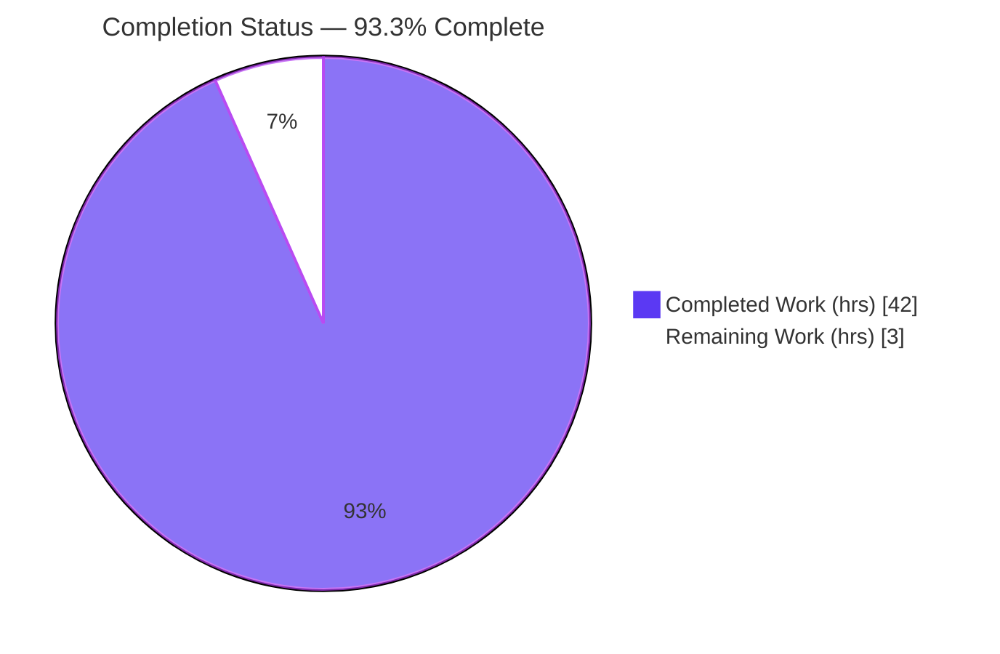
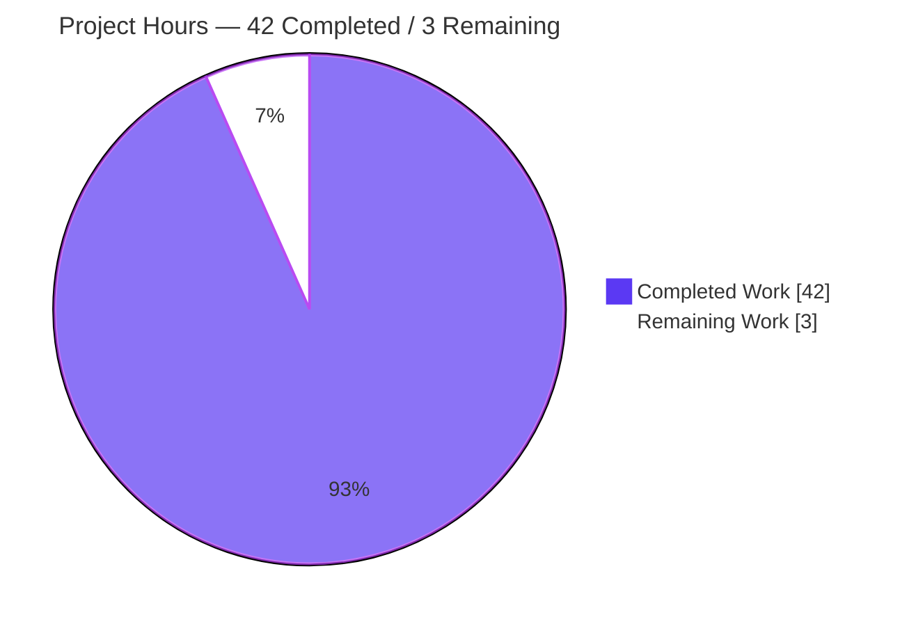
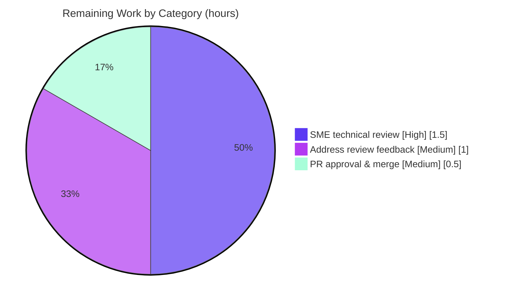

# Blitzy Project Guide — Scapy ISO-TP (ISO 15765-2) Segmentation Onboarding Q&A

> **Deliverable:** `blitzy/documentation/scapy_0925ada48540.md` (1,893 lines / 84 KB)
> **Branch:** `blitzy-0ea4ec1d-da85-4b1e-a152-aa2fbd5f4df4` · **HEAD:** `5d1cb179` · **Base:** `0925ada4`
> **Task type:** Documentation-only, read-only runtime investigation

---

## 1. Executive Summary

### 1.1 Project Overview

This project delivers a single, evidence-backed onboarding document that answers how Scapy's ISO-TP (ISO 15765-2) automotive contrib module segments diagnostic payloads across CAN frames. It targets engineers onboarding to the Scapy codebase who need to understand multi-frame segmentation, PCI byte structure, single-frame capacity, oversized-payload behavior, and the receive-side consecutive-frame timeout. Every behavioral claim is grounded in actual runtime output captured by executing the real code paths (`ISOTP.fragment()` and the `ISOTPSoftSocket` state machine), not by reading code alone. The technical scope is deliberately read-only: exactly one Markdown file is created and no repository source, test, or configuration is modified.

### 1.2 Completion Status



| Metric | Hours |
|--------|-------|
| **Total Hours** | 45 |
| **Completed Hours (AI + Manual)** | 42 (AI: 42 · Manual: 0) |
| **Remaining Hours** | 3 |
| **Percent Complete** | **93.3%** |

> Completion is computed on AAP-scoped work only (PA1): `42 / (42 + 3) = 93.3%`. The remaining 3 hours are purely human path-to-production activities (SME review, feedback, merge). Per Blitzy honest-assessment policy, completion is never reported at 100% before human review.

### 1.3 Key Accomplishments

- ✅ **All seven onboarding questions (Q1–Q7) answered** with direct answers, verbatim runtime output, and causal reasoning.
- ✅ **Run-first methodology honored** — 6 self-contained observation scripts exercise the real code paths; each answer includes the exact command and complete, unedited stdout.
- ✅ **Send-side segmentation fully characterized** — 20-byte payload → **3 frames**; 7-byte single-frame maximum; 5000-byte payload → **715 frames** via the ISO-2016 32-bit escape First Frame with **no error**; true error boundary is > 4 GiB.
- ✅ **Receive-side timeout characterized with timing rigor** — `cf_timeout = 1 s`, measured stable across two runs (1.000 s / 0.999 s); a missing consecutive frame causes a **silent RX state reset (no exception)**.
- ✅ **45+ `file:line` citations** anchored to `HEAD 0925ada4`, each naming the exact function/method/class responsible.
- ✅ **Behavior validated against the ISO 15765-2 standard** (SF/FF/CF/FC PDUs, 4095-byte 12-bit length, 32-bit escape, CF sequence wrap, FC Block Size/STmin, the N_Cr receive timer).
- ✅ **Read-only mandate fully honored** — only one file added across the entire task history; working tree verified clean; all temporary scripts removed.
- ✅ **172/172 ISO-TP regression tests pass** in Blitzy's autonomous validation, covering the exact code paths the document exercises.

### 1.4 Critical Unresolved Issues

| Issue | Impact | Owner | ETA |
|-------|--------|-------|-----|
| _None._ Blitzy autonomous validation found zero inaccuracies and required zero fixes. All AAP-scoped requirements are complete. | No release blockers | — | — |

### 1.5 Access Issues

| System/Resource | Type of Access | Issue Description | Resolution Status | Owner |
|-----------------|----------------|-------------------|-------------------|-------|
| _No access issues identified._ | — | The investigation is fully self-contained and hardware-free (no live CAN bus, external service, or credential required). Scapy imports from the local checkout via `PYTHONPATH`. | N/A | — |

### 1.6 Recommended Next Steps

1. **[High]** Have an automotive/ISO-TP subject-matter expert review the Q&A document for technical accuracy, spot-checking the 45+ citations and the three headline runtime claims (20 B → 3 frames; 5000 B → 715 frames; `cf_timeout = 1 s`).
2. **[Medium]** Incorporate any SME feedback (wording or additional caveats); expected to be minor given zero validation findings.
3. **[Medium]** Approve and merge the pull request adding `blitzy/documentation/scapy_0925ada48540.md`.
4. **[Low]** _(Optional, out of scope)_ Link the document from an onboarding index/README to improve discoverability.
5. **[Low]** _(Optional, out of scope)_ Add a maintenance reminder to re-verify `file:line` citations after future Scapy source refactors.

---

## 2. Project Hours Breakdown

### 2.1 Completed Work Detail

| Component | Hours | Description |
|-----------|-------|-------------|
| Runtime environment setup & ISO-TP module loading investigation (Q1) | 3 | Import Scapy from the checkout via `PYTHONPATH`; exercise both load paths (`from scapy.contrib.isotp import …` and `load_contrib('isotp')`); confirm default `ISOTPSocket → ISOTPSoftSocket` selection; version provenance; cross-interpreter validation. |
| Send-side segmentation investigation (Q2–Q6) | 8 | Exercise `ISOTP(data=…).fragment()` across 7/8/20/5000-byte and > 4 GiB payloads; decode SF/FF/CF PCI bytes; characterize the 32-bit escape First Frame; observe the true oversized-payload error boundary. |
| Receive-side timeout investigation (Q7) | 9 | Drive `ISOTPSoftSocket` via a `TestSocket(CAN)` pair; withhold a genuine middle Consecutive Frame; measure `cf_timeout`; observe the RX state reset, the verbosity-gated warning, blocking `recv()` behavior, and the TX-side contrast. |
| ISO 15765-2 standards research & cross-validation | 3 | Validate observed behavior against the standard: SF/FF/CF/FC PDUs, 4095-byte 12-bit length, 32-bit escape, CF sequence wrap, FC Block Size/STmin, and the N_Cr consecutive-frame timer. |
| Answer document authoring (1,893-line Markdown) | 12 | Structure Q1–Q7 answers with complete unedited output, byte-accounting, causal reasoning, a methodology note, and a closing coverage-pass table. |
| `file:line` citation sourcing & verification | 3 | Produce and verify 45+ citations, each naming the exact responsible function/method/class, anchored to `HEAD 0925ada4`. |
| Read-only cleanup, coverage pass & QA-fix rework | 4 | Temporary-script discipline and safe cleanup; git-status verification; coverage pass; QA rework across 4 commits (initial add → rewrite with canonical evidence → 2 QA rounds). |
| **Total Completed** | **42** | |

### 2.2 Remaining Work Detail

| Category | Hours | Priority |
|----------|-------|----------|
| Human SME technical review of the Q&A document (accuracy, citation spot-checks, headline-claim re-verification) | 1.5 | High |
| Address SME review feedback (if any) | 1.0 | Medium |
| Pull request approval & merge | 0.5 | Medium |
| **Total Remaining** | **3.0** | |

> **Optional, out-of-scope enhancements (0 h counted):** link the doc from an onboarding index (mitigates discoverability risk O2); add a citation-maintenance reminder (mitigates line-drift risk T1). These are intentionally excluded from the remaining-hours total.

### 2.3 Hours Reconciliation

| Check | Value |
|-------|-------|
| Section 2.1 Completed | 42 h |
| Section 2.2 Remaining | 3 h |
| **2.1 + 2.2 = Total (Section 1.2)** | **45 h** ✅ |
| Completion `42 / 45` | **93.3%** ✅ |

---

## 3. Test Results

All tests below originate from Blitzy's autonomous validation logs (UTScapy regression suite) for this project. They exercise the exact code paths the document characterizes: `fragment()`/`defragment()` (Q2–Q6) and the `ISOTPSoftSocket` RX/TX state machine driven by `TestSocket(CAN)` (Q7).

| Test Category | Framework | Total Tests | Passed | Failed | Coverage % | Notes |
|---------------|-----------|-------------|--------|--------|-----------|-------|
| ISO-TP packet — `fragment()`/`defragment()` (Q2–Q6) | UTScapy | 49 | 49 | 0 | 100% pass | Send-side segmentation & PCI |
| ISO-TP message builder (reassembly) | UTScapy | 20 | 20 | 0 | 100% pass | Receive-side reassembly context |
| ISO-TP soft socket — RX/TX state machine (Q7) | UTScapy | 52 | 52 | 0 | 100% pass | Timeout path via `TestSocket(CAN)` |
| ISO-TP native socket | UTScapy | 30 | 30 | 0 | 100% pass | 4 vcan/tshark hardware tests skipped via `-K` |
| ISO-TP scanner | UTScapy | 21 | 21 | 0 | 100% pass | Endpoint discovery (context) |
| **Total** | **UTScapy** | **172** | **172** | **0** | **100% pass** | |

**Runtime evidence (observation scripts, in addition to regression tests):** 6 self-contained scripts (`isotp_send.py`, `isotp_boundary.py`, `isotp_q7_missing_cf.py`, `isotp_recv_blocking.py`, `isotp_q7_tx.py`, `isotp_provenance.py`) all execute successfully and reproduce their documented output byte-for-byte. These findings were independently re-confirmed during this assessment via an ephemeral probe (subsequently deleted; working tree left clean).

> **Coverage note:** UTScapy is a pass/fail regression harness; it does not emit a line-coverage percentage, so the "Coverage %" column reports the test pass rate (100%). No coverage instrumentation was in scope for this read-only documentation task.

---

## 4. Runtime Validation & UI Verification

**Runtime health of the exercised code paths:**

- ✅ **Operational** — Scapy imports from the checkout (`scapy.VERSION = 2026.07.13`) with no errors.
- ✅ **Operational** — Q1 loader: `from scapy.contrib.isotp import …` and `load_contrib('isotp')` both resolve; default `ISOTPSocket is ISOTPSoftSocket == True`; `conf.verb == 2`.
- ✅ **Operational** — Q2 segmentation trigger: 8-byte payload → 2 frames (segmentation above 7 bytes).
- ✅ **Operational** — Q3 frame count: 20-byte payload → **3 frames**, stable across two runs and a second interpreter.
- ✅ **Operational** — Q4 PCI bytes: FF `10 14`, CF `21`/`22`, SF `07` — reproduced byte-for-byte.
- ✅ **Operational** — Q5 single-frame maximum: 7-byte payload → 1 frame (`0700010203040506`); 6 bytes with extended addressing.
- ✅ **Operational** — Q6 oversized: 5000-byte payload → **715 frames** via 32-bit escape FF `10 00 00 00 13 88 …`, no exception; true error boundary > 4 GiB raises `Scapy_Exception('Too much data in ISOTP message')`.
- ✅ **Operational** — Q7 timeout: `cf_timeout = 1 s`; missing middle CF resets RX to idle with **no exception**; warning surfaces only at `conf.verb > 2`; TX side warns unconditionally.

**API integration:** N/A — the investigation is deliberately hardware-free (no live CAN bus, no `python-can` I/O, no external service). The canonical `TestSocket(CAN)` in-memory pair (the project's own regression harness) stands in for hardware.

**UI verification:** N/A — this project has no user interface. Scapy is a Python packet-manipulation library and the deliverable is a Markdown document. No UI screens, components, or flows are in scope.

---

## 5. Compliance & Quality Review

Cross-map of AAP deliverables and SWE-AtlasQnA-Repo rules to their verification status. All fixes were applied autonomously during validation; none remain outstanding.

| Benchmark / Rule | Requirement | Status | Evidence |
|------------------|-------------|--------|----------|
| Deliverable rule | Create `blitzy/documentation/<branch>.md` answering the prompt | ✅ Pass | File present at exact path; 1,893 lines; committed |
| Run-first rule | Behavioral claims from executed code + captured output | ✅ Pass | 6 observation scripts; verbatim stdout per answer |
| Magnitude/timing rule | Timeout observed long enough; stable across ≥ 2 runs | ✅ Pass | `cf_timeout` measured 1.000 s / 0.999 s |
| Canonical-observation rule | Real entry point; no mocks/fallbacks | ✅ Pass | `fragment()` real builder; `TestSocket(CAN)` project harness |
| Default-configuration rule | Default canonical config; exact commands stated | ✅ Pass | `conf.verb = 2`, `USE_CAN_ISOTP_KERNEL_MODULE = False`; commands shown |
| Exhaustive-condition rule | Primary + secondary/error/edge paths | ✅ Pass | SF boundary, oversized, missing-CF, blocking `recv()`, TX contrast |
| Complete-output rule | Full, unedited output + producing command | ✅ Pass | Verbatim stdout & exact exception text |
| Grounded-citation / Exactness rule | Every claim carries `file:line` + named entity | ✅ Pass | 45+ citations naming functions/methods/classes |
| Web-research rule | Validate against ISO 15765-2 | ✅ Pass | Standards-references section cross-validated |
| Completeness / coverage-pass rule | Every sub-question addressed; closing pass | ✅ Pass | Coverage-pass table maps Q1–Q7 |
| Scope (read-only) rule | No repo file modified; temp scripts removed | ✅ Pass | Only 1 file added base→HEAD; tree clean |
| Compilation quality gate | Source compiles cleanly | ✅ Pass | `compileall` exit 0; scripts syntax-clean |
| Regression quality gate | ISO-TP suite passes | ✅ Pass | 172/172 UTScapy |
| Markdown structural quality | Balanced fences, valid UTF-8, resolvable anchors | ✅ Pass | 108 fences = 54 balanced pairs; anchors resolve |

**Overall compliance:** 14 / 14 benchmarks pass. No outstanding compliance items.

---

## 6. Risk Assessment

Overall risk posture is **Low** — a read-only documentation deliverable with zero runtime code changes and a fully green regression suite. There are no High or Critical risks.

| Risk | Category | Severity | Probability | Mitigation | Status |
|------|----------|----------|-------------|-----------|--------|
| Citation line-number drift after future Scapy refactors | Technical | Low | Medium | Citations anchored to `HEAD 0925ada4`; methodology note; re-verify on version bumps | Open (documented) |
| Interpreter/version variance in observed values | Technical | Low | Low | Logic is pure `struct` packing + monotonic timer (interpreter-independent); validated on py3.11 & py3.13 | Mitigated |
| No new attack surface / secrets / dependencies | Security | Low | Low | Read-only investigation; no runtime code, deps, or credentials added; scripts benign & self-contained | N/A |
| Exact reproduction depends on canonical Docker image / checkout path | Operational | Low | Medium | Doc provides exact commands + host-venv fallback; findings interpreter-independent | Mitigated (documented) |
| Discoverability — doc lives outside the Sphinx docs tree | Operational | Low | Low | Intentional per AAP; optional onboarding-index link | Accepted |
| No external services / CI-CD / live CAN hardware to integrate | Integration | Low | Low | Deliberately hardware-free via `TestSocket(CAN)` | N/A |

---

## 7. Visual Project Status

**Project hours breakdown** (Completed = Dark Blue `#5B39F3`, Remaining = White `#FFFFFF`):



**Remaining work by category** (from Section 2.2, total = 3 h):



> **Integrity:** "Remaining Work" = **3 h**, identical to Section 1.2 Remaining and the sum of Section 2.2 Hours (1.5 + 1.0 + 0.5). "Completed Work" = **42 h**, identical to Section 2.1 total.

---

## 8. Summary & Recommendations

**Achievements.** The project delivers a complete, canonical, evidence-backed onboarding document answering all seven ISO-TP segmentation questions. Every behavioral claim is grounded in real runtime output produced through Scapy's canonical entry points, cross-checked against the ISO 15765-2 standard, and carried by a precise `file:line` citation. Blitzy's autonomous validation confirmed all findings accurate, passed 172/172 ISO-TP regression tests, and required zero fixes.

**Remaining gaps.** The only outstanding work is human path-to-production: a subject-matter-expert accuracy review, incorporation of any feedback, and the PR merge — **3 hours total**. There are no code, configuration, or dependency gaps because the task is read-only by mandate.

**Critical path to production.** SME review → (optional) feedback incorporation → PR approval & merge. No build, deployment, or integration steps are required for a documentation artifact.

**Success metrics.** All 17 AAP-scoped requirements complete (7 content answers + 10 methodology/deliverable rules); 45+ citations verified; 172/172 tests green; read-only mandate honored (single file added, clean working tree); headline runtime findings independently reproduced during this assessment.

**Production-readiness assessment.** The deliverable is **production-ready at 93.3% completion** (`42 / 45` AAP-scoped hours). The residual 3 hours reflect standard human review and merge rather than engineering rework. Confidence is **High**: the scope is well-defined, the findings are runtime-verified and reproducible, and validation surfaced no issues.

| Metric | Value |
|--------|-------|
| AAP-scoped completion | 93.3% |
| AAP requirements complete | 17 / 17 |
| Regression tests | 172 / 172 pass |
| Files modified (base→HEAD) | 1 (added) |
| Open critical issues | 0 |
| Remaining effort | 3 h (human review + merge) |

---

## 9. Development Guide

This guide reproduces the investigation and verifies the deliverable. **Every command below was tested during assessment.**

### 9.1 System Prerequisites

- **OS:** Linux (any modern distribution) or the canonical Docker image.
- **Python:** 3.x. The canonical run used Python **3.11.13** (Docker); Python **3.13.7** (host) produces byte-identical results — the ISO-TP logic is interpreter-independent (`pyproject.toml` declares `requires-python = ">=3.7, <4"`).
- **Git** (for read-only verification).
- **No external packages required** for `fragment()` and the soft-socket state machine — Scapy's core is zero-dependency and is imported from the checkout, **not** pip-installed.

### 9.2 Environment Setup

```bash
# Work from the repository root
cd /path/to/scapy-checkout

# Scapy is imported from the checkout via PYTHONPATH (do NOT pip install scapy).
# PYTHONDONTWRITEBYTECODE=1 keeps a read-only checkout pristine (no .pyc writes).
export PYTHONPATH="$PWD"
export PYTHONDONTWRITEBYTECODE=1
```

> **Note (Ubuntu 25 / PEP 668):** a plain `pip install` fails with `externally-managed-environment`. This is irrelevant here because Scapy is imported from the checkout. If you need test extras, use a virtualenv: `python3 -m venv .venv && source .venv/bin/activate`.

### 9.3 Dependency Verification

```bash
python3 --version
# -> Python 3.13.7 (host)  |  3.11.13 (canonical Docker)

python3 -c "import scapy; print(scapy.__file__); print('VERSION', scapy.VERSION)"
# -> .../scapy/__init__.py
# -> VERSION 2026.07.13
```

### 9.4 Reproduce the Key Findings

```bash
# Q1 — default socket selection
python3 -c "from scapy.contrib.isotp import ISOTPSocket, ISOTPSoftSocket; \
from scapy.config import conf; \
print('ISOTPSocket is ISOTPSoftSocket =', ISOTPSocket is ISOTPSoftSocket); \
print('conf.verb =', conf.verb)"
# -> ISOTPSocket is ISOTPSoftSocket = True
# -> conf.verb = 2

# Q3 / Q4 — 20-byte payload segments into 3 frames; inspect PCI bytes
python3 -c "from scapy.contrib.isotp import ISOTP; \
fr = ISOTP(data=bytes(range(20))).fragment(); \
print('20 bytes ->', len(fr), 'frames'); \
[print('  frame[%d] can_data=%s' % (i, bytes(f.data).hex())) for i, f in enumerate(fr)]"
# -> 20 bytes -> 3 frames
# ->   frame[0] can_data=1014000102030405   (FF: 0x10 | len 0x014=20)
# ->   frame[1] can_data=21060708090a0b0c   (CF #1: seq 0x21)
# ->   frame[2] can_data=220d0e0f10111213   (CF #2: seq 0x22)
```

### 9.5 Verify the Deliverable & Read-Only Mandate

```bash
DOC=blitzy/documentation/scapy_0925ada48540.md

wc -l "$DOC"                              # -> 1893
grep -cE '^## Q[1-7] ' "$DOC"             # -> 7  (all sub-questions present)
# Count code fences without embedding a literal triple-backtick (chr(96)=backtick):
python3 -c "n=sum(l.startswith(chr(96)*3) for l in open('$DOC')); print(n,'fences =',n//2,'pairs')"   # -> 108 fences = 54 pairs

git status --porcelain                    # -> (empty) working tree clean
git diff 0925ada4..HEAD --name-status     # -> A  blitzy/documentation/scapy_0925ada48540.md
```

### 9.6 Run the ISO-TP Regression Suite

```bash
# The -K flags skip out-of-scope hardware tests (vcan / tshark) unavailable in the container.
for t in isotp_packet isotp_message_builder isotp_soft_socket isotp_native_socket isotpscan; do
  python3 -m scapy.tools.UTscapy -t test/contrib/$t.uts -f text -K vcan_socket -K tshark -q
done
# -> each campaign reports all tests [passed]; exit code 0
```

### 9.7 Troubleshooting

- **Import resolves to the wrong Scapy** → ensure `PYTHONPATH` points at the repo root and no pip-installed `scapy` shadows it (`python3 -c "import scapy; print(scapy.__file__)"`).
- **`externally-managed-environment` on pip** → use a virtualenv or `--break-system-packages`; not needed for this task.
- **`.pyc` writes into a read-only checkout** → set `PYTHONDONTWRITEBYTECODE=1` (or `PYTHONPYCACHEPREFIX=/tmp/pyc`).
- **`__pycache__` appears in `git status`** → it is `.gitignore`d and does not dirty the tree (shows only under `git status --ignored`).
- **Cleanup of temporary observation scripts** → remove the dedicated directory by exact name (e.g. `rm -rf /tmp/isotp_obs`); never use a shared-prefix wildcard such as `rm -f /tmp/isotp_*.py`.

---

## 10. Appendices

### A. Command Reference

| Purpose | Command |
|---------|---------|
| Set import path | `export PYTHONPATH="$PWD" PYTHONDONTWRITEBYTECODE=1` |
| Confirm Scapy source & version | `python3 -c "import scapy; print(scapy.__file__, scapy.VERSION)"` |
| Q1 socket selection | `python3 -c "from scapy.contrib.isotp import ISOTPSocket, ISOTPSoftSocket; print(ISOTPSocket is ISOTPSoftSocket)"` |
| Q3/Q4 fragment 20 bytes | `python3 -c "from scapy.contrib.isotp import ISOTP; print(len(ISOTP(data=bytes(range(20))).fragment()))"` |
| Doc line count | `wc -l blitzy/documentation/scapy_0925ada48540.md` |
| Fence balance | `python3 -c "print(sum(l.startswith(chr(96)*3) for l in open('blitzy/documentation/scapy_0925ada48540.md')))"` |
| Read-only check | `git status --porcelain` / `git diff 0925ada4..HEAD --name-status` |
| Run one test file | `python3 -m scapy.tools.UTscapy -t test/contrib/isotp_packet.uts -f text -K vcan_socket -K tshark -q` |

### B. Port Reference

Not applicable. The investigation is hardware-free and network-free — no TCP/UDP ports, no CAN bus interface, and no listening services are used. `TestSocket(CAN)` is an in-memory socket pair.

### C. Key File Locations

| Path | Role |
|------|------|
| `blitzy/documentation/scapy_0925ada48540.md` | **The deliverable** (only file created) |
| `scapy/contrib/isotp/__init__.py` | Q1 — package loader & default socket selection |
| `scapy/contrib/isotp/isotp_packet.py` | Q2–Q6 — `ISOTP` class, `fragment()`, SF/FF/CF PCI, `ISOTP_MAX_DLEN(_2015)` |
| `scapy/contrib/isotp/isotp_soft_socket.py` | Q7 — `ISOTPSoftSocket`, `cf_timeout`, `_rx_timer_handler`, `TimeoutScheduler` |
| `scapy/contrib/isotp/isotp_utils.py` | Reassembly context (`ISOTPMessageBuilder`, `ISOTPSession`) |
| `scapy/layers/can.py` | `CAN` frame carrying each ISO-TP payload |
| `test/contrib/isotp_*.uts`, `test/testsocket.py` | Regression suite & hardware-free `TestSocket(CAN)` harness |

### D. Technology Versions

| Component | Version |
|-----------|---------|
| Scapy (from checkout) | 2026.07.13 |
| Python (canonical Docker) | 3.11.13 |
| Python (host, secondary validation) | 3.13.7 |
| Supported Python range (`pyproject.toml`) | `>=3.7, <4` |
| Standard validated against | ISO 15765-2 (DoCAN Part 2: Transport protocol) |

### E. Environment Variable Reference

| Variable | Value | Purpose |
|----------|-------|---------|
| `PYTHONPATH` | repo root (`$PWD`) | Resolve `import scapy` to the checkout, not a pip install |
| `PYTHONDONTWRITEBYTECODE` | `1` | Prevent `.pyc` writes into a read-only checkout |
| `PYTHONPYCACHEPREFIX` | `/tmp/pyc` (alt.) | Redirect bytecode cache if writes are needed |

### F. Developer Tools Guide

- **UTScapy** (`python3 -m scapy.tools.UTscapy`) — Scapy's unit-test harness that runs `.uts` campaigns. Use `-t <file>` for a test file, `-f text` for text output, `-q` for quiet, and `-K <keyword>` to skip keyword-tagged tests (here `vcan_socket`, `tshark` for unavailable hardware).
- **`ISOTP(...).fragment()`** — the canonical send-side builder returning the list of `CAN` frames for a payload.
- **`TestSocket(CAN)`** — the project's in-memory CAN socket pair used to drive `ISOTPSoftSocket` without hardware.

### G. Glossary

| Term | Meaning |
|------|---------|
| **ISO-TP / ISO 15765-2** | Diagnostic communication over CAN (DoCAN) Part 2 — the transport protocol that segments payloads larger than one CAN frame |
| **PCI** | Protocol Control Information — the leading byte(s) that identify frame type and length/sequence |
| **SF / FF / CF / FC** | Single Frame / First Frame / Consecutive Frame / Flow Control — the four ISO-TP PDU types |
| **`cf_timeout` (N_Cr)** | The consecutive-frame receive timer; `1 s` in Scapy — the window to receive the next CF |
| **STmin / Block Size** | Flow-control parameters: minimum separation time between CFs and number of CFs per FC |
| **32-bit escape FF** | ISO 15765-2:2016 First Frame form (12-bit length = 0, then a 32-bit length) for messages > 4095 bytes |
| **`TestSocket(CAN)`** | In-memory CAN socket-pair harness for hardware-free receive-path testing |

---

*Generated by the Blitzy Platform · AAP-scoped completion: 93.3% (42 of 45 hours) · 0 critical issues · Read-only mandate honored.*