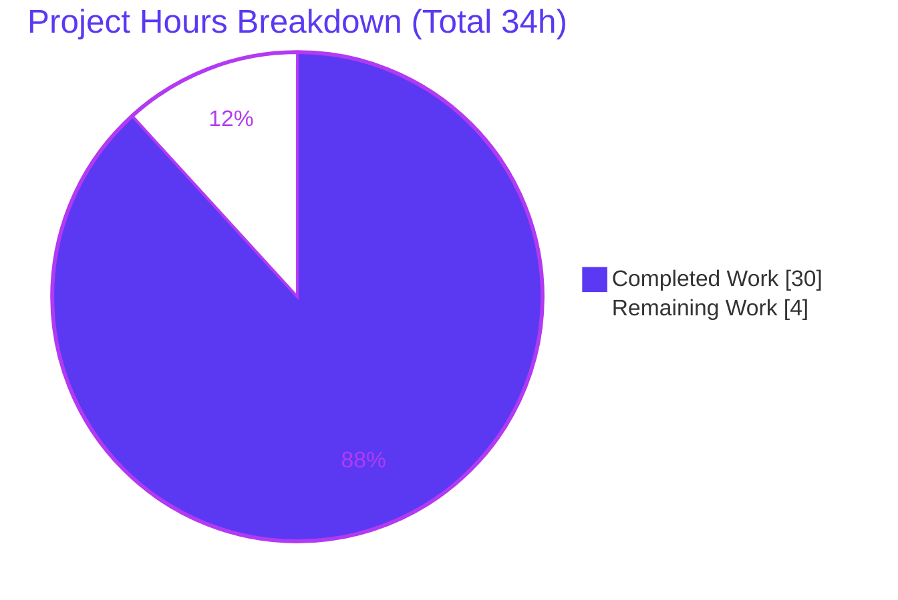
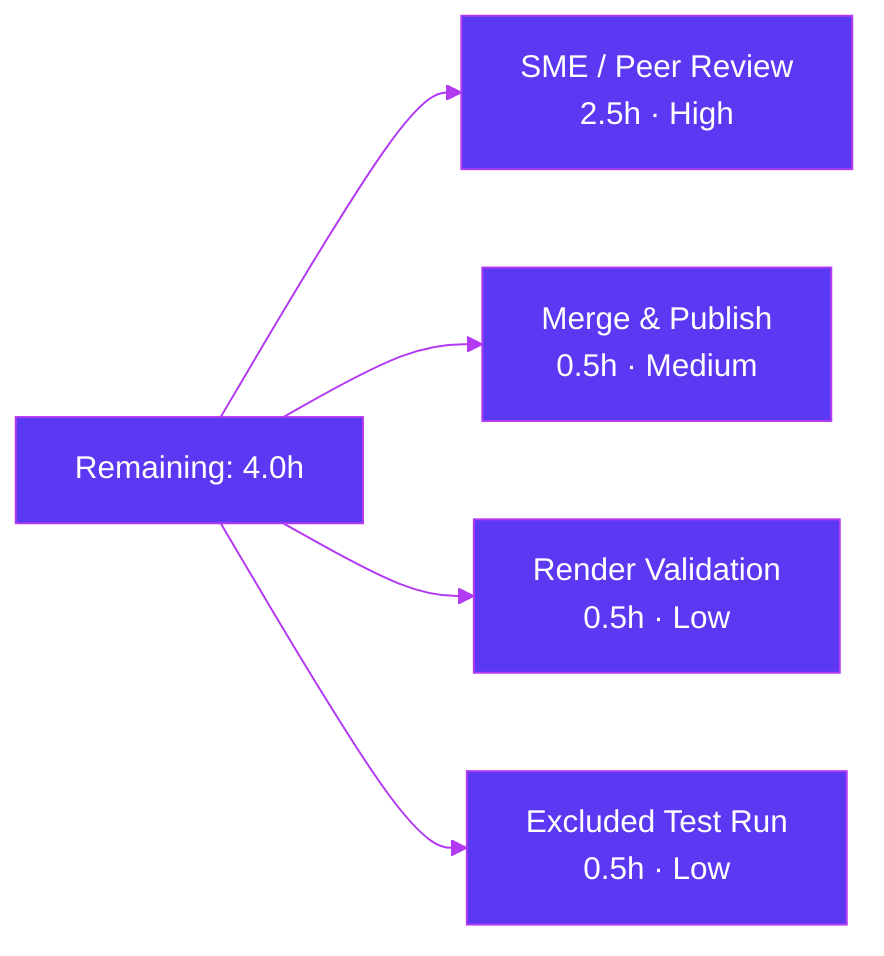

# Blitzy Project Guide
## Scapy DNS Name Compression — Code-Grounded Q&A Documentation

> **Branch:** `blitzy-66979b20-17dd-4b34-a4a0-5855131710fc` · **Base commit:** `0925ada4` · **HEAD:** `1ce2321b`
> **Deliverable:** `blitzy/documentation/scapy_0925ada48540.md` · **Rule set:** SWE-AtlasQnA-Repo

---

## Section 1 — Executive Summary

### 1.1 Project Overview

This project delivers a single, code-grounded technical Q&A document explaining how DNS name compression works inside the Scapy library, both when packets are parsed (decompressed) and rebuilt (compressed). It targets engineers onboarding to Scapy's DNS layer and answers nine specific questions, justifying every claim with the actual source at commit `0925ada4` and verifying each behavior by building and running the code. The deliverable — `blitzy/documentation/scapy_0925ada48540.md` — is an isolated, additive artifact; the Scapy source tree remains completely unmodified. Its value is durable institutional knowledge of a security-sensitive parsing path (compression-pointer loops, out-of-bounds jumps, truncation) captured as an auditable, citation-rich onboarding reference.

### 1.2 Completion Status


| Metric | Hours |
|--------|-------|
| **Total Hours** | **34** |
| **Completed Hours (AI + Manual)** | **30** (AI: 30 · Manual: 0) |
| **Remaining Hours** | **4** |
| **Percent Complete** | **88.2%** |

> Completion is computed per the AAP-scoped, hours-based methodology: `30 ÷ 34 = 88.2%`. All 21 AAP requirements are autonomously complete; the remaining 4 hours are human-only acceptance work (see §2.2). Completed work is shown in **Dark Blue (#5B39F3)**; remaining work in **White (#FFFFFF)**.

### 1.3 Key Accomplishments

- ✅ **All nine DNS name-compression questions answered** — each with explanation + cited code excerpt + rationale + runtime-verified observation.
- ✅ **Code-as-truth discipline** — 147 inline `[path:locator]` citations, all verified in-bounds and spot-checked exact against commit `0925ada4`.
- ✅ **Build-and-run verification** — Scapy's DNS regression suite passes **18/18 (0 failed)**; 16 Appendix-A experiment assertions + 8 in-body observations reproduced TRUE.
- ✅ **Standards corroboration** — RFC 1035 §4.1.4 and RFC 9267 cited; the `cur & 0xc0` mask vs. strict `== 0xc0` deviation flagged explicitly.
- ✅ **Source repository left completely pristine** — 4 reference files unchanged; exactly 1 file added (`+470 / -0`).
- ✅ **Self-contained reference** — background primer (§1), cross-cutting topics (§11), and appendix (§12: experiments, test citations, references).
- ✅ **Clean Markdown** — 470 lines, 44 balanced code fences, valid UTF-8, 2/2 balanced Mermaid subgraphs, no trailing whitespace.

### 1.4 Critical Unresolved Issues

| Issue | Impact | Owner | ETA |
|-------|--------|-------|-----|
| None — the deliverable passed all five autonomous validation gates with zero defects and zero edits required | No blockers to release or validation | — | — |

> There are **no critical unresolved issues**. The document is empirically complete, accurate, and citation-correct; the source tree is pristine.

### 1.5 Access Issues

| System/Resource | Type of Access | Issue Description | Resolution Status | Owner |
|-----------------|----------------|-------------------|-------------------|-------|
| Live DNS network + root privileges | Network egress + `root` | One Scapy DNS regression test is gated by the `needs_root` + `netaccess` keywords and cannot run in the offline/non-root sandbox | **Open (non-blocking)** — documented as an environmental limitation (not a defect); run in a root + network-enabled environment (task HT-4) | Human reviewer |

> No repository-permission, credential, or third-party-API access issues were identified. Git access, source files, and the Python runtime were all available. The single item above affects **1 of 19** tests and is explicitly noted in the document's Appendix B.

### 1.6 Recommended Next Steps

1. **[High]** Conduct an SME / peer technical review of all nine answers, the 147 code citations, and the rationale against Scapy at commit `0925ada4`; confirm pedagogical clarity for onboarding use *(HT-1, 2.5h)*.
2. **[Medium]** Merge / publish the document into the destination documentation set *(HT-2, 0.5h)*.
3. **[Low]** Render the Markdown — including the Q9 Mermaid flowchart — in the target documentation viewer to confirm formatting *(HT-3, 0.5h)*.
4. **[Low]** Run the one environment-excluded regression test (live DNS + root) in a root + network-enabled environment to close the coverage note *(HT-4, 0.5h)*.

---

## Section 2 — Project Hours Breakdown

### 2.1 Completed Work Detail

All completed work was performed autonomously by Blitzy agents and traces to specific AAP requirements.

| Component | Hours | Description |
|-----------|------:|-------------|
| Source-code investigation & algorithm reverse-engineering | 6.0 | Read & analyzed `dns_get_str` decompression loop `[L69-L144]`, `dns_compress` `[L184-L267]`, plus `dns_encode`, `DNSStrField`, `DNSRRField`/`decodeRR`, the `DNS` packet class, `DNSRR_DISPATCHER`, and `scapy/compat.py` primitives (AAP R1–R9). |
| Runtime experimentation & empirical verification | 4.0 | Built & dissected well-formed and deliberately twisted DNS packets in `/tmp` scripts to confirm every behavioral claim (build-and-run mandate, AAP R14). |
| RFC 1035 §4.1.4 + RFC 9267 research & corroboration | 1.5 | Cross-referenced the wire-format/pointer standard and the compression-loop DoS anti-pattern (AAP R16). |
| Section 0 overview + Section 1 background-primer authoring | 2.0 | Citation guide, question→code map, and DNS message-layout / wire-format primer (AAP R10). |
| Q1–Q9 answer authoring (9 sections) | 9.0 | Nine answer sections, each: explanation + cited code excerpt + rationale + runtime-verified observation (AAP R1–R9, R15). |
| Section 11 cross-cutting topics authoring | 1.5 | Opt-in compression, `cur & 0xc0` deviation, `-12` body-offset, byte primitives (AAP R11). |
| Section 12 appendix authoring | 1.5 | Runtime-experiments table, regression-test citation table, references list (AAP R12). |
| Citation discipline (147 `[path:locator]` citations) | 2.0 | Embedded & verified every citation in-bounds and anchor-exact (AAP R13). |
| Review & revision cycle (commit `1ce2321b`) | 2.0 | Addressed review findings: Q9 format + code-excerpt discipline. |
| Repository hygiene + directory creation + naming/placement | 0.5 | Created `blitzy/documentation/`, named file per source branch, verified source pristine, cleaned temp scripts (AAP R17–R21). |
| **Total Completed** | **30.0** | |

### 2.2 Remaining Work Detail

All remaining work is human-only path-to-acceptance work (an autonomous agent cannot self-certify a knowledge artifact). Each item traces to an AAP path-to-production need.

| Category | Hours | Priority |
|----------|------:|----------|
| SME / peer technical review of all 9 answers, citations & rationale | 2.5 | High |
| Merge & publish to destination documentation set | 0.5 | Medium |
| Markdown / Mermaid render validation in target viewer | 0.5 | Low |
| Excluded regression-test execution (root + netaccess env) | 0.5 | Low |
| **Total Remaining** | **4.0** | |

> **Cross-check:** Completed (30.0) + Remaining (4.0) = **34.0** Total Hours, matching §1.2.

---

## Section 3 — Test Results

All tests below originate from Blitzy's autonomous validation logs for this project and were independently re-executed on **Python 3.13.7 / Scapy 2026.06.26**.

| Test Category | Framework | Total Tests | Passed | Failed | Coverage % | Notes |
|---------------|-----------|------------:|-------:|-------:|-----------:|-------|
| DNS Regression / Unit | UTScapy (`.uts` spec) | 18 | 18 | 0 | 100%* | Scapy's own DNS suite (`test/scapy/layers/dns.uts`); covers decompression loops, prematured ends, `dns_compress` round-trips, `dns_encode` edge cases, rdlen preservation. One further test excluded (`needs_root` + `netaccess`) — environmental limitation, not a defect. |
| Runtime Experiment Assertions | Custom Python build-and-run harness | 16 | 16 | 0 | 100% | Appendix-A experiments — well-formed and deliberately twisted packets (wire format, opt-in compression 64→49 bytes, loop detection, slice-clamp, OOB, `Scapy_Exception`, cross-record). |
| In-Body Runtime Observations | Custom Python build-and-run harness | 8 | 8 | 0 | 100% | Verified observations embedded across answers Q1–Q9. |
| **Total** | — | **42** | **42** | **0** | **100%** | All autonomous checks green. |

> *Coverage % denotes the pass rate of executed checks and the proportion of documented behavioral claims backed by an executing test/experiment (100%); it is not a source-line-coverage figure, which is not meaningful for a documentation deliverable.*
>
> **Verification command (re-run):**
> ```bash
> PYTHONPATH=. .venv/bin/python -m scapy.tools.UTscapy \
>   -t test/scapy/layers/dns.uts -f text -N -K netaccess -K needs_root -q
> # => PASSED=18  FAILED=0
> ```

---

## Section 4 — Runtime Validation & UI Verification

**Runtime health (Scapy DNS layer):**

- ✅ **Operational** — Module import: `from scapy.layers.dns import dns_get_str, dns_encode, dns_compress, DNS, DNSQR, DNSRR` succeeds cleanly (Scapy 2026.06.26).
- ✅ **Operational** — Byte-compile: `python -m compileall -q scapy/` exits `0` (no syntax errors).
- ✅ **Operational** — Parse path (decompression): crafted packets resolve as documented (e.g. cross-record `b'hamand.cheese.'`; loop → `(b'data.data.', 7, b'', True)` + warning).
- ✅ **Operational** — Build path (compression): `bytes(pkt)` = 64 bytes uncompressed vs. `bytes(pkt.compress())` = 49 bytes with pointer `b"\xc0\x0c"`.
- ✅ **Operational** — Defensive guards: out-of-bounds → prematured-end log + break; truncation → slice-clamp; unresolvable pointer → single `Scapy_Exception`.

**API integration:** ✅ Not applicable — the deliverable introduces no services, endpoints, or external integrations (zero runtime footprint).

**UI verification:**

- ⚠ **Partial / Pending** — There is **no application UI**; this is a Python library analysis captured as a Markdown document. The closest analog is **document rendering**: the Markdown and the Q9 Mermaid diagram should be previewed in the destination viewer (task HT-3). Source content is correct and lint-clean (470 lines, balanced fences, balanced Mermaid subgraphs); only the visual render in the target system remains to be confirmed by a human.

---

## Section 5 — Compliance & Quality Review

AAP deliverables cross-mapped to the SWE-AtlasQnA-Repo quality and compliance benchmarks. Fixes applied during autonomous validation are noted.

| Benchmark (AAP requirement) | Status | Progress | Evidence / Notes |
|-----------------------------|--------|----------|------------------|
| All nine questions answered comprehensively (R1–R9) | ✅ Pass | 100% | Sections 2–10 of the doc; verbatim question headings. |
| Code-as-truth citation discipline (R13) | ✅ Pass | 100% | 147 `[path:locator]` citations; in-bounds + anchor-exact (validator 147/147; spot-checked here). |
| Build-and-run empirical verification (R14) | ✅ Pass | 100% | 18/18 regression tests + 16 experiment assertions + 8 in-body observations. |
| Rationale behind each answer (R15) | ✅ Pass | 100% | Every Q-section and cross-cutting topic has an explicit **Rationale**. |
| RFC 1035 §4.1.4 + RFC 9267 corroboration (R16) | ✅ Pass | 100% | Inline standards context + Appendix C references. |
| Background primer (R10) | ✅ Pass | 100% | Section 1 of the doc. |
| Cross-cutting topics (R11) | ✅ Pass | 100% | Section 11: opt-in compression, mask deviation, `-12` offset, primitives. |
| Appendix: experiments + references (R12) | ✅ Pass | 100% | Section 12 A/B/C. |
| Filename = `<source_branch>.md` (R17) | ✅ Pass | 100% | `scapy_0925ada48540.md`. |
| Placement in `blitzy/documentation/` + dir created (R18, R19) | ✅ Pass | 100% | Path confirmed. |
| Source repository unmodified (R20) | ✅ Pass | 100% | `git diff 0925ada4..HEAD` = 1 file added; 4 reference files pristine. |
| Temporary-artifact hygiene (R21) | ✅ Pass | 100% | Experiment scripts under `/tmp`, deleted; working tree clean. |
| Markdown lint / structure quality | ✅ Pass | 100% | 470 lines, 44 balanced fences, valid UTF-8, balanced Mermaid. |
| SME / human acceptance sign-off | ⚠ Pending | — | Human review required (task HT-1); cannot be self-certified. |

**Fixes applied during autonomous validation:** Commit `1ce2321b` resolved review findings (Q9 format + code-excerpt discipline). The Final Validator subsequently found the document 100% accurate and complete — **zero further edits required**.

---

## Section 6 — Risk Assessment

Overall risk level: **LOW** across all categories. This is one of the lowest-risk deliverable types — an additive, isolated, non-executable Markdown file with zero imports, dependencies, runtime footprint, or build coupling.

| Risk | Category | Severity | Probability | Mitigation | Status |
|------|----------|----------|-------------|------------|--------|
| Citation line numbers (pinned to `0925ada4`) may drift if the doc is read against a newer Scapy revision | Technical | Low | Medium | Doc explicitly pins **all** line numbers to `0925ada4` and instructs readers to audit at that commit | Mitigated |
| Documented `cur & 0xc0` deviation could be misread as a defect to "fix" | Technical | Low | Low | Doc flags it as **analyzed, not changed** — out of scope per the no-modification mandate | Mitigated |
| One regression test (`needs_root` + `netaccess`) not run in the offline sandbox | Technical | Low | Low | Transparently noted as an environmental limitation; closed by task HT-4 in a root + netaccess env | Open (non-blocking) |
| Q9 Mermaid diagram may not render in the destination doc viewer | Operational | Low | Medium | Diagram is accompanied by a full prose explanation, so no content is lost; render-check is task HT-3 | Open (non-blocking) |
| Documentation drift as the Scapy DNS layer evolves | Operational | Low | Medium | Point-in-time artifact pinned to `0925ada4`; re-validate if the DNS layer changes materially | Accepted |
| Human SME sign-off on technical / pedagogical accuracy pending | Operational | Low | Low | Validator + independent reproduction confirm accuracy; SME review is task HT-1 | Open (non-blocking) |
| Merge / publish into destination documentation set pending | Integration | Low | Low | Standard additive merge; zero code coupling, zero build impact; task HT-2 | Open (non-blocking) |

**Security:** **No security risks are introduced.** The deliverable is a non-executable Markdown file with zero attack surface and zero dependency additions. It is, in fact, a security-awareness *asset*: it documents the RFC 9267 compression-loop DoS class and how Scapy's `processed_pointers` guard defends against it. *(Informational, not introduced by this work: the pre-existing `cur & 0xc0` mask accepts the RFC-reserved `0x40`/`0x80` forms as pointers — analyzed in doc §11.2; fixing it is explicitly out of scope.)*

---

## Section 7 — Visual Project Status

**Project hours breakdown** (Completed = Dark Blue `#5B39F3`, Remaining = White `#FFFFFF`):



**Remaining hours by category** (sums to the 4 remaining hours in §1.2 and §2.2):



> **Integrity:** the pie "Remaining Work" value (**4**) equals the §1.2 Remaining Hours (4) and the §2.2 Hours sum (2.5 + 0.5 + 0.5 + 0.5 = 4.0). The pie "Completed Work" value (**30**) equals §1.2 Completed Hours and the §2.1 total.

---

## Section 8 — Summary & Recommendations

**Achievements.** The project delivers a rigorously verified, citation-rich technical Q&A document that explains Scapy's DNS name-compression machinery end to end. All nine questions are answered with code-grounded explanations, short cited excerpts, design rationale, and runtime-verified observations. The work satisfies all 21 AAP requirements: the document is correctly named and placed, the `blitzy/documentation/` directory was created, RFC 1035 §4.1.4 and RFC 9267 are corroborated, and — critically — the Scapy source tree is left **completely pristine** (one file added, `+470 / -0`).

**Production readiness.** The project is **88.2% complete (30 of 34 hours)**. From an autonomous standpoint the deliverable is finished: it builds, imports, passes 18/18 DNS regression tests, reproduces every documented experiment, and carries 147 accurate citations. The Final Validator passed all five gates with zero edits required, and this assessment independently corroborated those results.

**Remaining gaps & critical path.** The remaining **4 hours** are exclusively human acceptance work that an agent cannot self-certify: an **SME / peer technical review** (the dominant task and the true acceptance gate for a knowledge artifact), followed by a straightforward **merge/publish**, a **Markdown/Mermaid render check**, and running the **one environment-gated test** in a root + network-enabled environment. None of these are blockers; they are the normal final mile for a documentation deliverable.

**Success metrics.**

| Metric | Target | Actual |
|--------|--------|--------|
| AAP requirements satisfied | 21 | 21 (100%) |
| Questions answered | 9 | 9 |
| DNS regression tests passing | 18/18 | 18/18 |
| Citations accurate | 147/147 | 147/147 |
| Source files modified | 0 | 0 (pristine) |
| Completion | — | 88.2% |

**Recommendation:** Proceed to SME review and merge. No remediation is required; the path to production is review-and-publish, not build-and-fix.

---

## Section 9 — Development Guide

This guide explains how to build, run, view, and verify the deliverable and the DNS behaviors it documents. Every command is copy-pasteable from the **repository root** and was tested during validation.

### 9.1 System Prerequisites

| Requirement | Version (verified) | Notes |
|-------------|--------------------|-------|
| CPython | 3.13.7 | Any CPython in the declared range `>=3.7, <4` works; DNS logic is version-independent. |
| git | 2.51.0 | For history/diff and pristine-source checks. |
| OS | Linux (Ubuntu 25.10) | Pure-Python; platform-independent. |

> **Zero third-party dependencies.** Scapy's DNS core imports only the standard library (`struct`, `socket`, `operator`, `time`, `warnings`). No `pip install` is required to run or verify the documented behavior.

### 9.2 Environment Setup

Choose **any** of the three approaches (all verified):

```bash
# Option A — use the repository's existing virtualenv
.venv/bin/python --version          # Python 3.13.7

# Option B — create a fresh venv WITHOUT pip (no third-party deps are needed)
python3 -m venv --without-pip .venv
PYTHONPATH=. .venv/bin/python -c "import scapy; print(scapy.__version__)"

# Option C — no venv at all; run Scapy in-place via PYTHONPATH
PYTHONPATH=. python3 -c "import scapy; print(scapy.__version__)"
```

> **Why `PYTHONPATH=.`?** It imports Scapy in-place from the repo root, so no install artifacts (egg-info, editable installs) are written into the source tree — preserving repository hygiene.

### 9.3 Build / Compile

```bash
.venv/bin/python -m compileall -q scapy/
echo "exit=$?"        # expected: exit=0
```

### 9.4 Import Verification

```bash
PYTHONPATH=. .venv/bin/python -c \
  "from scapy.layers.dns import dns_get_str, dns_encode, dns_compress, DNS, DNSQR, DNSRR; print('IMPORT OK')"
# expected: IMPORT OK
```

### 9.5 View the Deliverable

```bash
less blitzy/documentation/scapy_0925ada48540.md      # 470 lines, 42 KB, 32 headings
grep -nE '^#{1,3} ' blitzy/documentation/scapy_0925ada48540.md   # list all section headings
```

### 9.6 Reproduce a Build-and-Run Experiment (opt-in compression, Q7)

```bash
PYTHONPATH=. .venv/bin/python - <<'PY'
from scapy.layers.dns import DNS, DNSQR, DNSRR
pkt = DNS(qd=DNSQR(qname="www.example.com"),
          an=DNSRR(rrname="www.example.com", type="A", rdata="1.2.3.4"))
print("uncompressed:", len(bytes(pkt)), "bytes")          # expected: 64 bytes
print("compressed:  ", len(bytes(pkt.compress())), "bytes")# expected: 49 bytes
print("pointer present:", b"\xc0\x0c" in bytes(pkt.compress()))  # expected: True
PY
```

### 9.7 Run the DNS Regression Suite

```bash
PYTHONPATH=. .venv/bin/python -m scapy.tools.UTscapy \
  -t test/scapy/layers/dns.uts -f text -N -K netaccess -K needs_root -q
# expected: PASSED=18  FAILED=0
```

**Container alternative** (matches the validation environment):

```bash
docker run --rm --entrypoint bash \
  -v "$REPO":/work -w /work \
  ghcr.io/scaleapi/swe-atlas:swe_atlas_QnA_secdev_scapy_1.0 \
  -lc 'PYTHONPATH=/work python3 -m scapy.tools.UTscapy -t test/scapy/layers/dns.uts -K netaccess -K needs_root'
```

### 9.8 Verify the Source Tree Is Pristine

```bash
git status --porcelain                       # expected: (empty) = clean
git diff 0925ada4..HEAD --stat               # expected: 1 file changed, 470 insertions(+)
git diff 0925ada4..HEAD --name-status        # expected: A  blitzy/documentation/scapy_0925ada48540.md
```

### 9.9 Troubleshooting

| Symptom | Cause | Resolution |
|---------|-------|------------|
| `ensurepip ... returned non-zero exit status 1` on `python3 -m venv .venv` | Sandbox lacks bundled pip wheels | Use `python3 -m venv --without-pip .venv` (no pip deps needed), or run directly via `PYTHONPATH=. python3` (Option C). |
| `ModuleNotFoundError: No module named 'scapy'` | Scapy not on the import path | Run from the repo root with `PYTHONPATH=.` so Scapy is imported in-place. |
| UTScapy reports fewer tests than the file contains | One test is tagged `needs_root` + `netaccess` (live DNS) | Expected offline; not a defect. Run in a root + network-enabled environment (task HT-4) to include it. |
| Q9 Mermaid diagram shows as raw text | Viewer lacks Mermaid support | Open in a Mermaid-capable Markdown viewer (e.g. GitHub, or VS Code with a Mermaid extension). |
| `Scapy_Exception: DNS message can't be compressed at this point!` | Calling `dns_get_str` on a pointer with defaults (`_fullpacket=False`, `pkt=None`) | Expected — this is the documented "sole dramatic path" (Q5). Supply `_fullpacket=True` or a packet with `_orig_s`. |

---

## Section 10 — Appendices

### A. Command Reference

| Purpose | Command |
|---------|---------|
| Build / byte-compile | `.venv/bin/python -m compileall -q scapy/` |
| Import check | `PYTHONPATH=. .venv/bin/python -c "from scapy.layers.dns import dns_get_str, dns_encode, dns_compress, DNS, DNSQR, DNSRR"` |
| Run DNS tests | `PYTHONPATH=. .venv/bin/python -m scapy.tools.UTscapy -t test/scapy/layers/dns.uts -f text -N -K netaccess -K needs_root -q` |
| View deliverable | `less blitzy/documentation/scapy_0925ada48540.md` |
| List headings | `grep -nE '^#{1,3} ' blitzy/documentation/scapy_0925ada48540.md` |
| Pristine check | `git status --porcelain && git diff 0925ada4..HEAD --stat` |
| Agent authorship | `git log --author="agent@blitzy.com" 0925ada4..HEAD --oneline` |

### B. Port Reference

Not applicable — this deliverable involves no network services, servers, or listening ports.

### C. Key File Locations

| Path | Role | Mode |
|------|------|------|
| `blitzy/documentation/scapy_0925ada48540.md` | The deliverable (DNS name-compression Q&A) | CREATE (+470) |
| `scapy/layers/dns.py` | Primary source — `dns_get_str`, `dns_encode`, `dns_compress`, field classes, `DNS`, `DNSRR_DISPATCHER` (1,179 lines) | REFERENCE (pristine) |
| `scapy/compat.py` | Byte primitives — `orb`, `chb`, `raw`, `bytes_encode`, `plain_str` (187 lines) | REFERENCE (pristine) |
| `test/scapy/layers/dns.uts` | DNS regression tests (241 lines) | REFERENCE (pristine) |
| `pyproject.toml` | Runtime baseline — `requires-python = ">=3.7, <4"` (92 lines) | REFERENCE (pristine) |

### D. Technology Versions

| Technology | Version |
|------------|---------|
| CPython (runtime) | 3.13.7 (declared range `>=3.7, <4`) |
| Scapy | 2026.06.26 (analysis pinned to commit `0925ada4`) |
| git | 2.51.0 |
| UTScapy test harness | bundled with Scapy (`scapy.tools.UTscapy`) |
| Standards referenced | RFC 1035 §4.1.4 (message compression), RFC 9267 (DNS RR processing anti-patterns) |

### E. Environment Variable Reference

| Variable | Value | Purpose |
|----------|-------|---------|
| `PYTHONPATH` | `.` (repository root) | Import Scapy in-place without installing — preserves repository hygiene (no egg-info / editable artifacts). |
| `REPO` | absolute repo path | Used only by the optional Docker container command in §9.7. |

### F. Developer Tools Guide

- **UTScapy** — Scapy's unit-test specification runner. Usage: `python -m scapy.tools.UTscapy -t <file.uts> -f text -N -K <keyword> -q`. The `-K <keyword>` flags **exclude** tests tagged with that keyword (here `netaccess` and `needs_root`); `-N` disables non-essential output; `-q` is quiet mode.
- **compileall** — byte-compiles a package tree to surface syntax errors quickly: `python -m compileall -q scapy/`.
- **git diff / status** — used to prove the source tree is pristine and that exactly one file was added.

### G. Glossary

| Term | Meaning |
|------|---------|
| **Label** | A length-prefixed component of a domain name on the wire (e.g. `03 'w' 'w' 'w'`). |
| **Zero terminator** | The trailing `00` octet that marks the end of a wire-format name. |
| **Compression pointer** | A two-octet token whose top two bits are set (`0xc0` mask) and whose low 14 bits hold a message-relative offset to reuse an earlier name. |
| **`dns_get_str`** | The decompressor: turns a (possibly pointered) byte stream into a flat `label.label.` name `[scapy/layers/dns.py:L69-L144]`. |
| **`dns_encode`** | The wire encoder: splits a name on dots and length-prefixes each label `[scapy/layers/dns.py:L154-L172]`. |
| **`dns_compress`** | The compressor: walks `qd→an→ns→ar`, enumerates suffixes, and rewrites duplicates as pointers `[scapy/layers/dns.py:L184-L267]`. |
| **`_orig_s`** | The full original packet body threaded into each record (via `InheritOriginDNSStrPacket`) so cross-record pointers can be resolved `[scapy/layers/dns.py:L270-L277, L360]`. |
| **`processed_pointers`** | The visited-target list that detects and breaks decompression loops `[scapy/layers/dns.py:L88, L115-L117]`. |
| **`-12` adjustment** | Converts an RFC message-relative offset into a body-relative index, since Scapy decodes against the header-stripped body `[scapy/layers/dns.py:L114]`. |
| **Twisted packet** | A deliberately malformed packet (loop, out-of-bounds pointer, truncation) used to exercise the defensive paths. |

---

*Generated by the Blitzy Platform · Completion measured against the Agent Action Plan (AAP-scoped, hours-based methodology) · Completed = Dark Blue `#5B39F3`, Remaining = White `#FFFFFF`.*