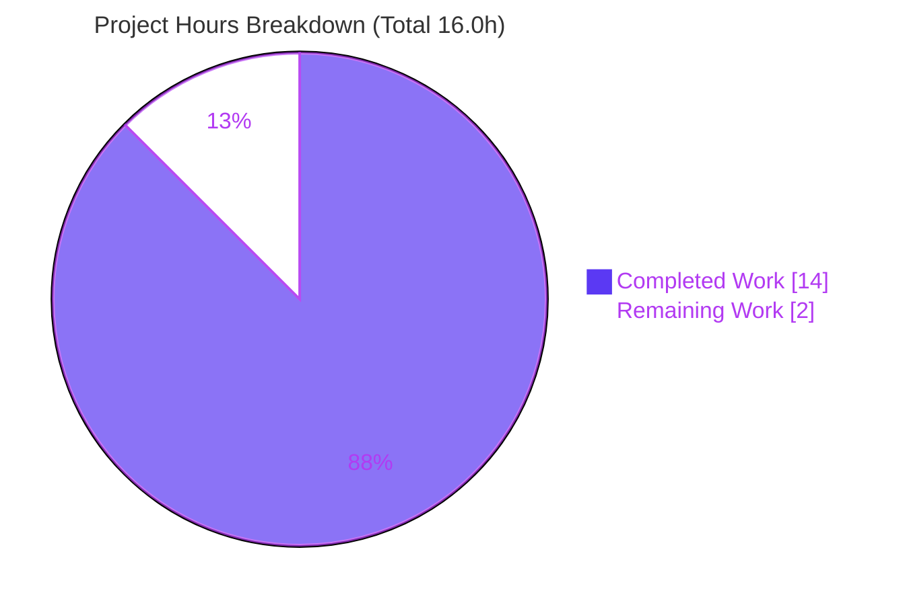
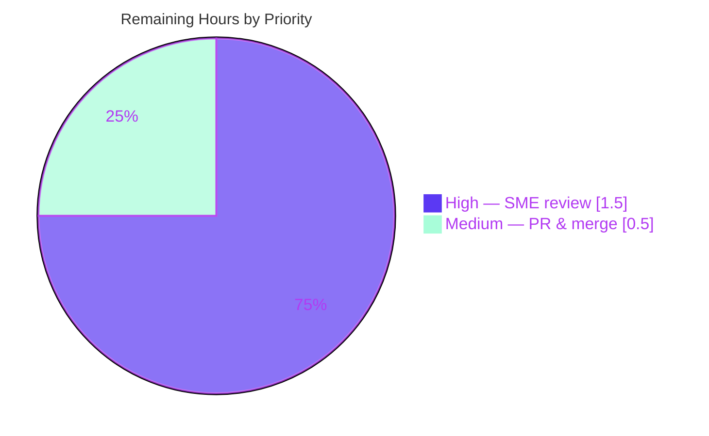

# Blitzy Project Guide — Scapy Build-Time Field Compute/Cache Investigation

> Branch: `scapy_0925ada48540` · HEAD `7320850f` · Base `0925ada4`
> Deliverable: `blitzy/documentation/scapy_0925ada48540.md`

---

## 1. Executive Summary

### 1.1 Project Overview

This project answers a developer's confusion about **when Scapy recomputes versus caches derived packet fields** (the IP header checksum, the TCP checksum, and the IP total-length) during serialization (`bytes()` / `build()`). The deliverable is a single, evidence-based Markdown document that walks through six concrete IP/TCP scenarios, grounding every claim in exact Scapy source citations (`scapy/packet.py`, `scapy/layers/inet.py`, `scapy/utils.py`) and in real, byte-for-byte runtime hex/numeric output. The target audience is Scapy users and packet-crafting engineers. Technical scope is intentionally narrow and additive: one new documentation file, zero source changes — an investigation, not a behavior change.

### 1.2 Completion Status


> **Color key:** Completed = Dark Blue `#5B39F3` · Remaining = White `#FFFFFF`

| Metric | Value |
|---|---|
| **Total Hours** | 16.0 |
| **Completed Hours (AI + Manual)** | 14.0 (AI: 14.0 · Manual: 0.0) |
| **Remaining Hours** | 2.0 |
| **Percent Complete** | **87.5%** |

> Completion is computed strictly on AAP-scoped + path-to-production work (PA1): `14.0 / (14.0 + 2.0) = 87.5%`. All 13 AAP-scoped requirements are delivered and validated; the remaining 2.0h is the unavoidable human technical review and merge.

### 1.3 Key Accomplishments

- ✅ Single deliverable authored: `blitzy/documentation/scapy_0925ada48540.md` (261 lines), filename stem equal to the source branch name.
- ✅ All **six** required scenarios answered: compute-on-build, recompute-vs-cache, override-before-build, override-after-build, deep-copy isolation, length-on-growth.
- ✅ **61** exact `file:line` source citations — every one independently re-verified against the live source (zero discrepancies).
- ✅ **Byte-for-byte** runtime evidence reproduced for all scenarios (e.g., `IP.chksum=0xf6c6`, `TCP.chksum=0xc7a3`; S2 differing positions `[36,40]`; S6 `50/50` and `60/60`).
- ✅ Full **before/after** buffers shown for Scenarios 2 and 5 (complete buffers, not diffs) per the user instruction.
- ✅ Two governing rules synthesized (compute-only-when-`None`; dissection-only per-layer caching) plus the `checksum()` / `in4_chksum` primitives.
- ✅ Scope compliance proven: `git diff base..HEAD` shows exactly one added file, zero existing files modified; ephemeral `/tmp` probes removed; working tree clean.
- ✅ Library health confirmed: `from scapy.all import *` succeeds; `python -m compileall scapy` exits 0.

### 1.4 Critical Unresolved Issues

| Issue | Impact | Owner | ETA |
|---|---|---|---|
| _None_ — no blocking issues identified | The deliverable is accurate, complete, in-scope, and self-validated byte-for-byte | — | — |

> The only outstanding work is the standard human review/merge gate (see §1.6 and §2.2); it is not a defect or blocker.

### 1.5 Access Issues

| System/Resource | Type of Access | Issue Description | Resolution Status | Owner |
|---|---|---|---|---|
| _N/A_ | _N/A_ | **No access issues identified** | N/A | N/A |

> Repository read/write access is confirmed (git operations succeed), the `.venv` is present and functional, and the task involves no external services, credentials, or third-party APIs.

### 1.6 Recommended Next Steps

1. **[High]** Perform the SME technical review of `scapy_0925ada48540.md`: spot-check a sample of the 61 citations against the source at commit `0925ada4`, and reproduce Scenarios 1, 2, and 6 in the venv to confirm the byte-for-byte hex.
2. **[Medium]** Approve the pull request and merge the single additive documentation file to the target branch (no build/deploy required).
3. **[Low]** _(Optional, out of AAP scope)_ Add a discoverability cross-link to the document from the project's docs index / README.

---

## 2. Project Hours Breakdown

### 2.1 Completed Work Detail

| Component | Hours | Description |
|---|---|---|
| Source-code investigation & exact-citation fixing | 3.5 | Read & traced the build/cache/copy machinery: `packet.py` `build`/`do_build`/`self_build`/`post_build`, `raw_packet_cache` lifecycle, `copy`/`__deepcopy__`; `inet.py` `IP`/`TCP` `post_build`; `utils.py` `checksum` — pinning every `file:line` locator (AAP R7–R9 foundation). |
| Probe scripting & runtime-evidence capture | 3.5 | Wrote/ran ephemeral `/tmp` probes for all six scenarios + the dissected stale-cache nuance; captured byte-for-byte hex via the re-dissection read-back idiom `IP(bytes(p))` (AAP R1–R6, R10). |
| Authoring Scenario sections 1–6 | 3.0 | Restated question, governing code path with citations, runtime evidence (full before/after buffers for S2 & S5), and reasoning for each scenario (AAP R1–R6, R11). |
| Authoring governing-rules + checksum primitives + framing | 2.0 | Two-rule synthesis (compute-only-when-`None`; dissection-only per-layer caching), `checksum()`/`in4_chksum` primitives, Overview, Shared setup, Summary/mental model (AAP R7, R8, R11). |
| Citation verification + byte-for-byte self-validation | 1.5 | Exact-matched all 61 citations against source; reproduced scenarios byte-for-byte; `compileall scapy` (exit 0) and `from scapy.all import *` smoke (AAP R9 + validation gates). |
| Scope compliance & corrections | 0.5 | Correct path/filename, no-modify enforcement, `/tmp` cleanup, and the interpreter-string correction commit `7320850f` (AAP R12, R13). |
| **Total** | **14.0** | |

> **Validation:** the Hours column sums to **14.0**, matching Completed Hours in §1.2.

### 2.2 Remaining Work Detail

| Category | Hours | Priority |
|---|---|---|
| Human SME technical review of document accuracy (verify sample of citations; reproduce Scenarios 1/2/6 byte-for-byte; confirm full buffers for S2 & S5; sign-off) | 1.5 | High |
| PR review/approval & merge of the single additive file to target branch | 0.5 | Medium |
| **Total** | **2.0** | |

> **Validation:** the Hours column sums to **2.0**, matching Remaining Hours in §1.2 and the "Remaining Work" value in the §7 pie chart. The optional docs-index cross-link is **out of AAP scope** and is intentionally excluded from this total.

### 2.3 Hours Reconciliation

| Check | Result |
|---|---|
| §2.1 Completed total | 14.0 |
| §2.2 Remaining total | 2.0 |
| §2.1 + §2.2 = §1.2 Total | 14.0 + 2.0 = **16.0** ✅ |
| Completion % = 14.0 / 16.0 | **87.5%** ✅ |

---

## 3. Test Results

All entries below originate from Blitzy's autonomous validation logs for this project (and were independently re-run during this assessment). Because the AAP forbids adding code/tests, no repository test suite was added or modified; "tests" here are the autonomous evidence-validation activities that prove the documentation is accurate against the live codebase.

| Test Category | Framework | Total Tests | Passed | Failed | Coverage % | Notes |
|---|---|---|---|---|---|---|
| Scenario reproduction (evidence validation) | Ephemeral Python probe + working-tree Scapy | 6 | 6 | 0 | N/A | Scenarios 1–6 reproduce **byte-for-byte**; deterministic (constant `IP.id=1`, `TCP.seq=0`). |
| Source citation accuracy | `grep`/`sed` exact-match vs. Scapy source | 61 | 61 | 0 | N/A | Every `file:line` citation verified exact across `packet.py`, `layers/inet.py`, `utils.py`. |
| Package compile check | `python -m compileall` | 1 | 1 | 0 | N/A | Entire `scapy/` package compiles; exit code 0. |
| Library import smoke | CPython 3.12.13 / `scapy.all` | 1 | 1 | 0 | N/A | `from scapy.all import *` loads cleanly, including TLS (`cert.Cert`) and IPsec (`ESP`). |

> **Scope note:** the repository's existing regression suite (`test/**`, 193 `.uts` files) was **not** in scope for this documentation task and was neither added to nor modified.

---

## 4. Runtime Validation & UI Verification

**Runtime health (library & evidence):**

- ✅ **Operational** — `from scapy.all import *` imports cleanly (Scapy `2026.06.26`, CPython `3.12.13`).
- ✅ **Operational** — `python -m compileall scapy` returns exit 0 (entire package syntactically valid).
- ✅ **Operational** — all six documented scenarios execute and reproduce byte-for-byte against the working tree.
- ✅ **Operational** — output is fully deterministic across repeated runs (constant `IP.id`, `TCP.seq`).

**UI verification:**

- ➖ **Not applicable** — the deliverable is a Markdown document and the subject is a Python library; there is no user interface to verify.

**API / integration verification:**

- ➖ **Not applicable** — no external APIs, services, network endpoints, or credentials are involved (purely additive documentation).

---

## 5. Compliance & Quality Review

AAP deliverables and the governing **SWE-AtlasQnA-Repo** rules cross-mapped to Blitzy quality benchmarks:

| Requirement / Benchmark | Status | Progress | Notes |
|---|---|---|---|
| Branch-named answer document created | ✅ Pass | 100% | `scapy_0925ada48540.md` — filename stem == source branch. |
| Placed under `blitzy/documentation/` | ✅ Pass | 100% | Exact path confirmed; parent dirs created. |
| Build & run source to analyze behavior (no assumptions) | ✅ Pass | 100% | Byte-for-byte runtime evidence captured via live execution. |
| Answers grounded in code as truth (`file:line`) | ✅ Pass | 100% | 61 citations, all verified exact. |
| Reasoning/"thinking" per answer | ✅ Pass | 100% | Part (d) in every scenario + Summary/mental model. |
| Full before/after buffers for S2 & S5 | ✅ Pass | 100% | Complete buffers shown (not diffs), per user instruction. |
| All six scenarios answered with hex/numeric evidence | ✅ Pass | 100% | S1–S6 each with captured values. |
| Do not modify existing files | ✅ Pass | 100% | `git diff base..HEAD` = 1 added file, 0 modified. |
| Do not add other code | ✅ Pass | 100% | Only the Markdown committed. |
| Ephemeral scripts cleaned up | ✅ Pass | 100% | `/tmp` probes removed; working tree clean. |
| Human technical review & sign-off | ⬜ Pending | 0% | Path-to-production gate (see §2.2 / §1.6). |

**Fixes applied during autonomous validation:** the reproducibility interpreter string was corrected from `CPython 3.12.3` to the actual `CPython 3.12.13` (commit `7320850f`), keeping the empirical "reproduced byte-for-byte" claim truthful while preserving the version-invariance note.

**Outstanding compliance items:** only the human review/merge gate remains; no quality defects are open.

---

## 6. Risk Assessment

| Risk | Category | Severity | Probability | Mitigation | Status |
|---|---|---|---|---|---|
| Citation line-number drift if Scapy source is later edited | Technical | Low | Low | Document pins the exact branch `scapy_0925ada48540` @ commit `0925ada4`; citations are valid as-of that commit. | Mitigated |
| Runtime hex values vary across interpreter versions | Technical | Low | Low | Behavior is pure-Python and invariant across `>=3.7,<4`; values reproduced byte-for-byte on CPython 3.12.13; invariance stated in the doc. | Mitigated |
| Reader misapplies the dissected per-layer stale-cache nuance (S2) | Technical | Low | Low | Doc strictly scopes the nuance to *dissected* packets and reconciles it with Governing Rule 2. | Mitigated |
| Document discoverability (separate from the Sphinx/RST docs) | Operational | Low | Medium | Separation is intentional per the AAP rule; an optional docs-index cross-link (out of scope) can be added later. | Accepted (by design) |
| Review gate not yet passed (self-validated, not yet human-reviewed/merged) | Operational | Low | High | Human tasks HT-1 (review) and HT-2 (merge) in §2.2. | Open |
| Security exposure | Security | None | — | No code/dependencies added, no secrets/auth/PII, ephemeral probes removed. | N/A |
| Integration breakage | Integration | None | — | Purely additive single Markdown file; no imports, interfaces, services, or APIs touched. | N/A |

> **Overall risk posture: LOW**, consistent with a documentation-only, zero-code-change, isolated additive deliverable.

---

## 7. Visual Project Status



> **Color key:** Completed Work = Dark Blue `#5B39F3` · Remaining Work = White `#FFFFFF`. The "Remaining Work" value (**2**) equals Remaining Hours in §1.2 and the sum of the §2.2 Hours column.

**Remaining hours by priority (from §2.2):**



---

## 8. Summary & Recommendations

**Achievements.** The project is **87.5% complete** (14.0 of 16.0 hours). Every one of the 13 AAP-scoped requirements is delivered and validated: a single, correctly named and placed Markdown document answers all six investigation scenarios, synthesizes the two governing rules, documents the checksum primitives, carries 61 verified source citations, and presents byte-for-byte runtime evidence (with full before/after buffers for Scenarios 2 and 5). Scope discipline is exact — one added file, zero modifications, clean working tree.

**Remaining gaps.** The remaining **2.0 hours** are entirely path-to-production and human-only: a subject-matter-expert technical review of the document's accuracy (1.5h) and PR approval/merge (0.5h). These cannot be completed autonomously.

**Critical path to production.** Review → approve → merge. No build, deployment, configuration, or integration work is required because the deliverable is standalone documentation.

**Success metrics.** All six scenarios reproduce byte-for-byte; all 61 citations verified exact; `compileall` exit 0; `scapy.all` imports cleanly; `git diff` confirms a single additive file.

**Production readiness assessment.** **Ready for human review.** The artifact is accurate, in-scope, and self-validated; risk is LOW across all categories. Per Blitzy policy, completion is held below 100% pending the human review/merge gate.

| Metric | Value |
|---|---|
| AAP-scoped requirements delivered | 13 / 13 |
| Completion (hours-based) | 87.5% |
| Open defects / blockers | 0 |
| Overall risk | Low |
| Production-readiness | Ready for human review |

---

## 9. Development Guide

A short guide to reproduce the document's evidence and verify the deliverable. All commands were tested live during this assessment.

### 9.1 System Prerequisites

- **OS:** Linux/macOS/WSL (any POSIX shell).
- **Git:** any recent version (repository already cloned at the working directory).
- **Python:** the project supports `>=3.7, <4`. The provisioned **`.venv` uses CPython 3.12.13**, which is the interpreter the evidence was validated against. _Note: the host's system `python3` is 3.13.7 — always activate the venv to match the validated values._
- **Disk:** ~255 MB for the repository working tree.

### 9.2 Environment Setup

```bash
# 1. Move to the repository root
cd /tmp/blitzy/scapy/blitzy-20fffbd8-47d6-4805-b991-0185fe20bfae_3d2527

# 2. Activate the provisioned virtual environment (CPython 3.12.13)
source .venv/bin/activate

# 3. Confirm the interpreter
python --version          # -> Python 3.12.13
```

> If you need to rebuild the environment from scratch instead of using `.venv`:
> ```bash
> python3 -m venv .venv && source .venv/bin/activate && pip install -e .
> ```

### 9.3 Dependency Installation

No dependencies are required to read or validate the document. The Scapy behavior under study relies solely on the Python standard library (`struct`, `array`, `socket`). The provisioned `.venv` already includes optional extras (e.g., `cryptography` for TLS/IPsec) used only by the import smoke test.

### 9.4 Verify the Library (health checks)

```bash
# Library imports cleanly (prints the Scapy version)
python -c "from scapy.all import conf; print('scapy', conf.version)"
# -> scapy 2026.06.26

# Entire package compiles (exit code 0)
python -m compileall -q scapy ; echo "exit=$?"
# -> exit=0
```

### 9.5 Reproduce the Documented Evidence

Create a throwaway probe (outside the repository, so the tree stays clean), run it, then delete it:

```bash
mkdir -p /tmp/scapy_probe
cat > /tmp/scapy_probe/repro.py <<'PY'
from scapy.all import IP, TCP, Raw
import copy
R, S = "192.0.2.2", "192.0.2.1"
mk = lambda load: IP(src=R, dst=S)/TCP()/Raw(load=load)

# Scenario 1 — compute on build (read back via re-dissection)
b1 = bytes(mk(b"hello")); d = IP(b1)
print("S1", hex(d.chksum), hex(d[TCP].chksum), d.len, len(b1)); print(b1.hex())

# Scenario 2 — recompute on mutation (full before/after)
p = mk(b"hello"); before = bytes(p); p[Raw].load = b"Hello"; after = bytes(p)
print("S2 BEFORE", before.hex()); print("S2 AFTER ", after.hex())
print("S2 diffs", [i for i in range(len(before)) if before[i] != after[i]])

# Scenario 6 — length on growth
for n in (10, 20):
    bb = bytes(mk(b"A"*n)); print("S6", IP(bb).len, len(bb), IP(bb).len == len(bb))
PY
python /tmp/scapy_probe/repro.py
rm -rf /tmp/scapy_probe        # clean up — keep the repo tree pristine
```

**Expected output (byte-for-byte):**

```text
S1 0xf6c6 0xc7a3 45 45
4500002d000100004006f6c6c0000202c000020100140050000000000000000050022000c7a3000068656c6c6f
S2 BEFORE 4500002d000100004006f6c6c0000202c000020100140050000000000000000050022000c7a3000068656c6c6f
S2 AFTER  4500002d000100004006f6c6c0000202c000020100140050000000000000000050022000e7a3000048656c6c6f
S2 diffs [36, 40]
S6 50 50 True
S6 60 60 True
```

### 9.6 Verify the Deliverable & Scope

```bash
# The deliverable exists at the mandated path
ls -l blitzy/documentation/scapy_0925ada48540.md

# Exactly one added file, zero existing files modified
git diff 0925ada485406684174d6f068dbd85c4154657b3..HEAD --name-status
# -> A   blitzy/documentation/scapy_0925ada48540.md

# Working tree is clean
git status --porcelain   # (prints nothing)
```

### 9.7 Troubleshooting

- **Hex values don't match the doc.** You are likely on the wrong interpreter. Run `source .venv/bin/activate` and confirm `python --version` is `3.12.13` (the host's system `python3` is 3.13.7).
- **`p.chksum` / `p.len` is `None` after `bytes(p)`.** This is **expected** for a *constructed* packet — building does not write computed values back onto the Python object. Read them back by re-dissecting: `IP(bytes(p)).chksum`.
- **A citation's line number looks off.** Citations are pinned to commit `0925ada4`. Check out that commit (or `git show 0925ada4:scapy/layers/inet.py`) before comparing line numbers.
- **`ModuleNotFoundError: scapy`.** Activate the venv first, or `pip install -e .` from the repository root.

---

## 10. Appendices

### A. Command Reference

| Command | Purpose |
|---|---|
| `source .venv/bin/activate` | Activate the validated CPython 3.12.13 environment |
| `python -c "from scapy.all import conf; print('scapy', conf.version)"` | Library import smoke test (prints `2026.06.26`) |
| `python -m compileall -q scapy ; echo "exit=$?"` | Compile the whole package (expect `exit=0`) |
| `git diff 0925ada4..HEAD --name-status` | Confirm single added file, zero modifications |
| `git status --porcelain` | Confirm clean working tree |
| `git log --oneline 0925ada4..HEAD` | Show the three documentation commits |

### B. Port Reference

➖ **Not applicable** — the deliverable is a document and no network services or ports are started by this task.

### C. Key File Locations

| Path | Role |
|---|---|
| `blitzy/documentation/scapy_0925ada48540.md` | **The sole deliverable** (261 lines) |
| `scapy/packet.py` | REFERENCE — build/cache/copy lifecycle (`do_build` `737-740`, `setfieldval` `485-487`, `do_dissect` `1019`, `copy`/`__deepcopy__` `407-426`/`239-244`) |
| `scapy/layers/inet.py` | REFERENCE — `IP.post_build` `539-551`, `TCP.post_build` `767-786`, `in4_chksum` `692` |
| `scapy/utils.py` | REFERENCE — `checksum()` `496-504` |

### D. Technology Versions

| Component | Version | Notes |
|---|---|---|
| Scapy | 2026.06.26 | Library under study (working tree); not installed or modified |
| CPython (venv) | 3.12.13 | Interpreter the evidence was validated against |
| CPython (system) | 3.13.7 | Host default — **not** used for validation; activate the venv |
| `requires-python` | `>=3.7, <4` | From `pyproject.toml`; behavior invariant across this range |
| Std-lib used | `struct`, `array`, `socket` | Used internally by `post_build` / `checksum()` |

### E. Environment Variable Reference

➖ **None required.** The task uses no environment variables, secrets, or configuration files.

### F. Developer Tools Guide

- **Diff a single reference file at the pinned commit:** `git show 0925ada4:scapy/layers/inet.py | sed -n '539,551p'`
- **Re-verify a citation block:** `sed -n '496,504p' scapy/utils.py`
- **Inspect the commit history:** `git log --oneline 0925ada4..HEAD` (three commits: `11bc475e`, `ea853e86`, `7320850f`).
- **Re-dissection read-back idiom:** `IP(bytes(p))` — the canonical way to read computed checksum/length values that a constructed packet does not write back to its Python fields.

### G. Glossary

| Term | Meaning |
|---|---|
| `post_build(pkt, pay)` | Per-layer hook that writes derived fields (checksum/length) **only when the field is `None`**. |
| `raw_packet_cache` | Per-layer cache of header bytes; populated **only by dissection**, it short-circuits `post_build` in `do_build` when valid; invalidated on field assignment/deletion. |
| Compute-only-when-`None` | Governing Rule 1 — an explicitly set field value is preserved verbatim; only unset (`None`) fields are computed. |
| Dissection-only caching | Governing Rule 2 — constructed packets have no cache (always recompute); dissected packets cache per layer (can emit a stale parent header). |
| `in4_chksum` | Helper that computes an L4 checksum over the IPv4 pseudo-header + segment; why the TCP checksum depends on payload and src/dst. |
| Re-dissection read-back | Reading computed values by re-parsing emitted bytes (`IP(bytes(p))`) rather than from the original Python object. |
| Dissection | Parsing raw bytes into a layered packet object (`IP(raw_bytes)`), which populates `raw_packet_cache`. |
