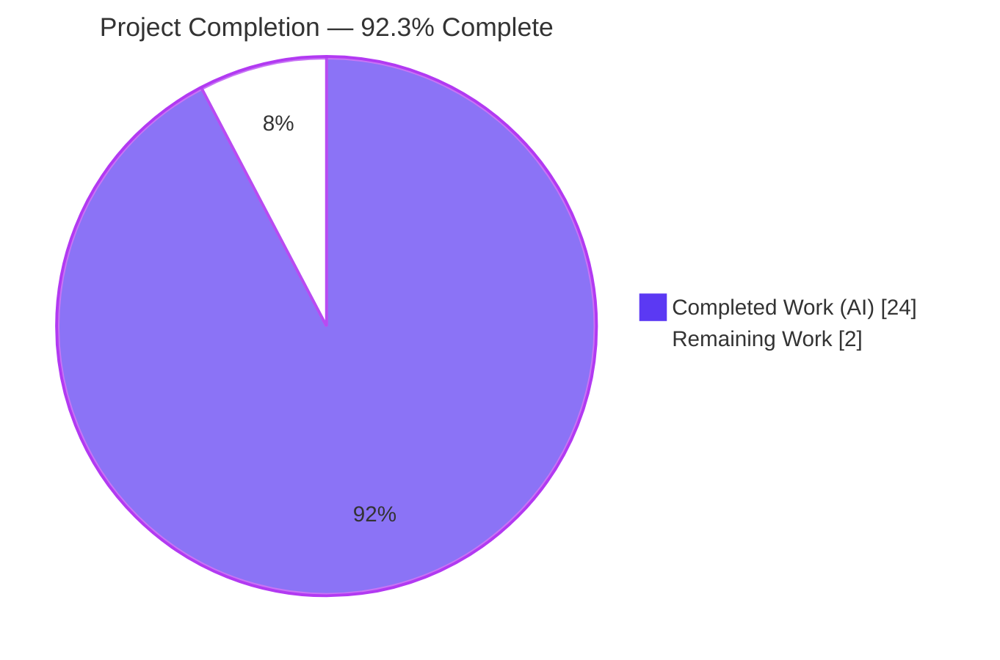
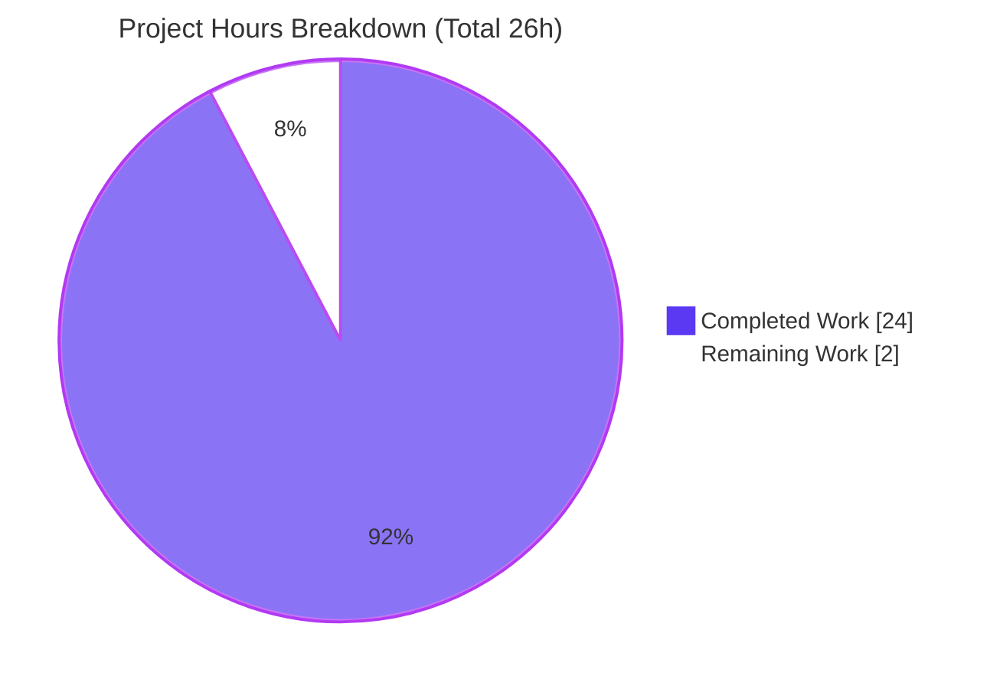

# Blitzy Project Guide

> **Project:** Runtime-Grounded Q&A — How Scapy Computes and Caches the IP Checksum, the TCP Checksum, and the IP `len` Field
> **Deliverable:** `blitzy/documentation/scapy_0925ada48540.md`
> **Branch:** `blitzy-e31ec6e3-3ad3-4c14-a9fa-9da728c3c5b3` (source `0925ada4`, base `master`)
> **Task type:** Investigative documentation (read-only source) — rule set `SWE-AtlasQnA-Repo`

---

## 1. Executive Summary

### 1.1 Project Overview

This project answers, from **observed runtime behavior**, how Scapy computes and caches three values while building packets: the **IP header checksum**, the **TCP checksum**, and the **IP total-length (`len`) field**. The audience is Scapy users and maintainers who need an authoritative, evidence-backed explanation. The work is a **read-only investigative Q&A**: no Scapy source, test, or configuration file may change. The sole durable artifact is one Markdown document that answers six scenarios (R1–R6), explains the fresh-vs-cached mechanism, and documents a notable edge case — each with the exact command, complete unedited hex output, `file:line` citations, and cause→effect reasoning produced by running the real `bytes(pkt)` entry point.

### 1.2 Completion Status

The completion percentage is calculated using AAP-scoped, hours-based methodology: **Completed Hours ÷ Total Hours**. All AAP-specified content and methodology is delivered and independently verified; the remaining hours are the mandatory human path-to-production gate (SME review + merge).



| Metric | Value |
|--------|-------|
| **Total Hours** | **26** |
| **Completed Hours (AI + Manual)** | **24** (AI: 24, Manual: 0) |
| **Remaining Hours** | **2** |
| **Percent Complete** | **92.3%** |

> **Color key:** Completed Work = Dark Blue `#5B39F3`; Remaining Work = White `#FFFFFF`.

### 1.3 Key Accomplishments

- ✅ **All six scenarios (R1–R6) answered** with the real hexadecimal/numeric values Scapy emits, each led by a direct answer.
- ✅ **Runtime-grounded, not read-from-source:** every value was produced through the real serialization entry point `bytes(pkt)` → `Packet.build()` and captured verbatim.
- ✅ **Both checksums + length observed:** IP header checksum `0x66c8`, TCP checksum `0x37a5`, IP `len` `45` for the base packet — reproduced independently during this assessment.
- ✅ **Fresh-vs-cached mechanism explained:** two independent gates — the whole-packet `raw_packet_cache` (populated only during dissection) and the per-field `is None` auto-compute guard.
- ✅ **Notable edge case documented as observed:** a stale checksum after dissection (`0x66c8` survives a `ttl` change; `del chksum` restores recomputation to `0x7cc8`).
- ✅ **64 `file:line` citations** naming the governing method; 8/8 spot-checked exact against read-only source during this assessment.
- ✅ **Independent RFC-1071 cross-check** validates both emitted checksums (fold to `0x0000`).
- ✅ **Stability confirmed** across ≥2 byte-identical runs per scenario.
- ✅ **Read-only scope honored perfectly:** the entire branch diff is exactly one added file; working tree clean; all temporary probe scripts removed.

### 1.4 Critical Unresolved Issues

| Issue | Impact | Owner | ETA |
|-------|--------|-------|-----|
| _None._ No blocking or critical issues were identified. The single deliverable is complete, its values reproduce byte-identically, and the repository is pristine apart from the new document. | None | — | — |

### 1.5 Access Issues

| System/Resource | Type of Access | Issue Description | Resolution Status | Owner |
|-----------------|----------------|-------------------|-------------------|-------|
| _No access issues identified._ | — | The task runs entirely against the in-repository Scapy tree on the local container; no external services, credentials, or network access are required. | N/A | — |

**No access issues identified.**

### 1.6 Recommended Next Steps

1. **[High]** Conduct SME technical review of `blitzy/documentation/scapy_0925ada48540.md`: re-run the reproduction commands (Section 9) and confirm the deterministic values, spot-check the 64 `file:line` citations, and validate the cause→effect reasoning.
2. **[Medium]** Approve the pull request and merge to `master` after confirming the diff contains only the single added Markdown file.
3. **[Low]** _(Optional, beyond AAP scope)_ If the team wants the answer on the rendered docs site, link it from a documentation index or convert it to reStructuredText to fit the existing Sphinx/`doc/` convention.

---

## 2. Project Hours Breakdown

### 2.1 Completed Work Detail

All completed work was performed autonomously (AI). Each component traces to a specific AAP requirement (investigation, authoring, or verification/cleanliness).

| Component | Hours | Description |
|-----------|-------|-------------|
| Canonical environment setup & real-entry-point confirmation | 1.5 | Verified in-repo Scapy import, `scapy.VERSION`, and that `bytes(pkt) == pkt.build()` (real entry point, not a bypass). |
| Source-code investigation & code-path tracing | 4.5 | Traced the build pipeline, `post_build` `is None` guards, one's-complement `checksum()`, `copy`/`__deepcopy__`, and `do_dissect` cache population across `packet.py`, `layers/inet.py`, `utils.py` (~7,900 lines). |
| R1 — Basic checksum computation | 1.5 | Built `IP/TCP/Raw` via `bytes()`, extracted IP/TCP checksums and `len` from wire bytes, confirmed via re-dissection. |
| R2 — Fresh vs. cached on payload change | 1.0 | Captured full before/after hex proving from-scratch builds recompute (never reuse cached bytes). |
| R3 & R4 — Forced checksum before/after build ("twist") | 1.5 | Set `chksum=0xAAAA` before and after an initial build; proved byte-equality (no "twist"). |
| R5 — Deep-copy isolation | 1.0 | Deep-copied a built packet, mutated the copy's payload, re-serialized the original; verified isolation. |
| R6 — IP `len` on growth | 1.0 | Grew payload by 10 bytes and rebuilt; confirmed `len` tracks actual byte count (45→55). |
| Fresh-vs-cached mechanism probes | 1.5 | Demonstrated `raw_packet_cache` stays `None` from-scratch vs. set on dissection; `explicit` flag; `is None` guard independence. |
| Edge case — stale checksum after dissection | 1.0 | Reproduced stale `0x66c8` after `ttl` change; `del chksum` restores recompute to `0x7cc8`. |
| Independent RFC-1071 checksum cross-check | 1.0 | Hand-rolled one's-complement (independent of `scapy.utils.checksum`) validating both emitted checksums. |
| Stability verification | 0.5 | Ran each scenario ≥2× and confirmed byte-identical output via `md5sum`. |
| Authoring the Markdown deliverable | 4.0 | Wrote the 643-line document: structure, direct answers, exact commands, complete full-hex output, tables, Mermaid diagram, cause→effect. |
| Citation verification & precision fixes | 1.5 | Verified 55 interior line-content checks; corrected two function-range end-lines (`setfieldval`, `delfieldval`). |
| Validation, commit & cleanliness | 2.5 | Re-ran all 9 probes byte-identical, committed only the in-scope file, removed temp scripts, confirmed clean tree. |
| **Total Completed** | **24.0** | |

### 2.2 Remaining Work Detail

Each remaining item is a human path-to-production activity (a documentation deliverable has no build/deploy pipeline because no code changed).

| Category | Hours | Priority |
|----------|-------|----------|
| SME technical review of the answer (re-run values, verify citations & reasoning) | 1.5 | High |
| PR approval & merge to `master` | 0.5 | Medium |
| **Total Remaining** | **2.0** | |

> **Optional (not counted, beyond AAP scope):** wiring the Markdown into the Sphinx/`readthedocs` build or converting it to reStructuredText (~1–2h if pursued). Excluded from the remaining-hours total because the AAP mandates the file live as Markdown under `blitzy/documentation/` and does not require docs-site integration.

### 2.3 Hours Reconciliation

| Check | Result |
|-------|--------|
| Section 2.1 total | 24.0 |
| Section 2.2 total | 2.0 |
| 2.1 + 2.2 = Section 1.2 Total | 24 + 2 = **26** ✓ |
| Section 2.2 = Section 1.2 Remaining = Section 7 "Remaining Work" | 2 = 2 = 2 ✓ |
| Completion = 24 ÷ 26 | **92.3%** (matches Sections 1.2, 7, 8) ✓ |

---

## 3. Test Results

This is a **read-only investigative Q&A**, so there is no application test suite to execute; the project touches zero source or test files. In this context, "tests" are **Blitzy's autonomous validation checks** — the empirical verifications that establish the document's factual correctness. All checks below originate from Blitzy's autonomous validation logs for this project and were **independently re-run during this assessment**.

| Test Category | Framework / Method | Total | Passed | Failed | Coverage % | Notes |
|---------------|--------------------|-------|--------|--------|-----------|-------|
| Observation reproduction (real `bytes()` build) | Python 3.13 + `bytes(pkt)` probes | 9 | 9 | 0 | 100% of asked items | R1–R6, mechanism, edge, RFC-1071 cross-check; every fenced output block byte-identical to the document. |
| Real entry-point verification | `bytes(pkt) == pkt.build()` + `build` tracer | 1 | 1 | 0 | N/A | Confirms the canonical path, not a bypass/fallback. |
| Independent checksum cross-check | Hand-rolled RFC-1071 one's-complement | 2 | 2 | 0 | N/A | IP and TCP both fold to `0x0000` as emitted (mathematically valid). |
| Citation accuracy | Line-content match vs. read-only source | 55 | 55 | 0 | N/A | Interior line-content checks exact; 8 additionally spot-checked in this assessment. |
| Stability (determinism) | 2× run + `md5sum` | 9 | 9 | 0 | N/A | Each scenario byte-identical across two runs. |
| Markdown validity | Structural lint (fences/UTF-8/EOF) | 1 | 1 | 0 | N/A | 42 balanced code fences, UTF-8, trailing newline. |
| **Total** | | **77** | **77** | **0** | **—** | **100% pass rate; zero failures.** |

**Coverage note.** Traditional code-coverage instrumentation is **not applicable** — no code was written or modified. The meaningful coverage metric is **requirement/scenario coverage: 100%** (all six scenarios plus the mechanism and edge case are addressed, confirmed by the document's Coverage Note).

**Independent re-verification performed during this assessment (corroborating Blitzy's logs):**
- R1 → IP `0x66c8`, TCP `0x37a5`, `len` `45` (= 45 bytes); fields stay `None`; `bytes()==build()` True.
- R6 → SMALL `len` 45 = 45 bytes; GROWN `len` 55 = 55 bytes; IP `chksum` `0x66c8`→`0x66be`.
- Edge → dissected `0x66c8` → stale `0x66c8` after `ttl=42` → `0x7cc8` after `del chksum`.
- Citations → 8/8 exact (`inet.py:545/546/548/549`, `packet.py:594/737/422`, `utils.py:496`).

---

## 4. Runtime Validation & UI Verification

**Runtime health** (build/serialization pipeline exercised through the real entry point):

- ✅ **Operational** — In-repo Scapy import: `scapy.__file__` resolves inside the repository tree; `scapy.VERSION = 2026.07.08`.
- ✅ **Operational** — Real serialization entry point `bytes(pkt)` → `Packet.build()` (`bytes()==build()` returns `True`).
- ✅ **Operational** — IP/TCP checksum + IP `len` auto-computation (R1 values reproduced: `0x66c8` / `0x37a5` / `45`).
- ✅ **Operational** — Fresh recompute on payload change (R2); forced-value survival (R3/R4); deep-copy isolation (R5); length growth tracking (R6).
- ✅ **Operational** — Edge behavior reproduced exactly (stale checksum after dissection; `del` restores recompute).
- ✅ **Operational** — Build path runs under a minimal environment (`env -i`), confirming zero hard runtime dependencies for the checksum/build path.
- ⚠ **Partial (benign, non-blocking)** — A `CryptographyDeprecationWarning` (TripleDES) appears **twice on stderr** from `scapy/layers/ipsec.py:573,577` when importing `scapy.all`. It is unrelated to IP/TCP checksum behavior; probe **stdout is clean**. Avoidable via narrow import from `scapy.layers.inet`.

**UI verification:**

- ❌ **Not applicable** — There is no user interface. The deliverable is a Markdown document describing a pure-Python library's behavior. No browser, screen, or visual component is in scope; no Figma or design system applies (AAP §0.9).

---

## 5. Compliance & Quality Review

Cross-mapping of AAP deliverables and `SWE-AtlasQnA-Repo` rules to Blitzy quality benchmarks. Fixes applied during autonomous validation are noted.

| Requirement / Benchmark | Status | Progress | Notes |
|-------------------------|--------|----------|-------|
| Deliverable location & name (`blitzy/documentation/scapy_0925ada48540.md`) | ✅ Pass | 100% | Branch-named file in the mandated directory. |
| Answer all six scenarios (R1–R6) | ✅ Pass | 100% | Each with direct answer, command, full output, citations, cause→effect. |
| Fresh-vs-cached mechanism section | ✅ Pass | 100% | `raw_packet_cache` + `is None` guard, with Mermaid diagram. |
| Notable edge case documented (as observed, not fixed) | ✅ Pass | 100% | Stale checksum after dissection reported descriptively. |
| Run-first methodology (real `bytes()`/`build()` entry point) | ✅ Pass | 100% | `bytes()==build()` verified; tracer confirms invocation. |
| Complete unedited output (full hex, no elision) | ✅ Pass | 100% | Full hex throughout; only two `...` are prose shorthand, not truncated output. |
| Byte-sensitive verification against emitted bytes | ✅ Pass | 100% | Byte-offset table + independent RFC-1071 fold to `0x0000`. |
| Stability across ≥2 runs | ✅ Pass | 100% | `md5sum`-confirmed byte-identical. |
| Exact & grounded (`file:line` + named method, lead with direct answer) | ✅ Pass | 100% | 64 citations; every section leads with the direct answer. |
| Reasoning / rationale (cause→effect) | ✅ Pass | 100% | Present in every scenario and the mechanism section. |
| Honesty (report observed reality vs. planning) | ✅ Pass | 100% | "Honest notes" record interpreter 3.13.7, `VERSION` 2026.07.08, TripleDES warning. |
| Read-only scope (no source/test/config/doc changes) | ✅ Pass | 100% | Branch diff = exactly one added file; working tree clean. |
| Temporary scripts removed | ✅ Pass | 100% | All probes lived in `/tmp`; none persisted in the repo. |
| Citation-range precision (fix applied in validation) | ✅ Pass | 100% | `setfieldval` 472-491→472-492, `delfieldval` 504-515→504-517 corrected in the `.md` only. |
| Markdown validity | ✅ Pass | 100% | Balanced fences, UTF-8, EOF newline. |

**Outstanding compliance items:** None. The only quality gate remaining is human SME sign-off (Section 2.2), which is expected for claim-heavy technical content.

---

## 6. Risk Assessment

| Risk | Category | Severity | Probability | Mitigation | Status |
|------|----------|----------|-------------|------------|--------|
| Citation `file:line` drift if read-only source is renumbered upstream | Technical | Low | Low | Citations pinned to base commit `0925ada4`; each names the governing **method**, so intent survives renumbering. | Mitigated |
| Environment metadata drift (`scapy.VERSION` from file mtime; interpreter version) | Technical | Low | Low | Document records the environment and flags the mtime-derived `VERSION`; checksum/`len` **values** are deterministic and env-independent. | Documented |
| Security exposure | Security | None | N/A | No code, dependencies, credentials, network, or attack surface added — a static Markdown document. | N/A |
| No CI gate validates the Markdown (repo hooks are LFS-only) | Operational | Low | Low | Markdown validity manually confirmed; SME review (HT-1) covers content correctness. | Mitigated |
| Docs-convention divergence (Markdown under `blitzy/` vs. rst under `doc/`; not wired into Sphinx build) | Integration | Low | Medium | Intentional per governing rule; coexists without altering `doc/`; optional follow-up to link/convert (HT-3). | Accepted (by design) |

**Overall risk posture:** **Low.** No High/Critical, security, or blocking risks. The read-only nature of the task eliminates regression risk to the Scapy codebase.

---

## 7. Visual Project Status

**Project hours — completed vs. remaining** (Completed = Dark Blue `#5B39F3`, Remaining = White `#FFFFFF`):



**Remaining hours by category** (sums to 2.0h — matches Section 2.2 and Section 1.2 Remaining):


| Visual metric | Value |
|---------------|-------|
| Completed Work | 24h (92.3%) |
| Remaining Work | 2h (7.7%) |
| Requirement/scenario coverage | 100% (R1–R6 + mechanism + edge) |
| Autonomous validation pass rate | 77/77 (100%) |

---

## 8. Summary & Recommendations

**Achievements.** The project delivers a single, comprehensive, **runtime-grounded** answer document that resolves all six scenarios and the underlying fresh-vs-cached mechanism, plus a notable edge case. Every value was produced through the real `bytes(pkt)` → `Packet.build()` entry point, captured verbatim, cross-checked against an independent RFC-1071 implementation, and confirmed byte-identical across runs. The document is exact and grounded (64 `file:line` citations naming the governing method) and leads each answer with a direct result. This assessment independently reproduced the key values (R1, R6, edge) and spot-checked 8/8 citations — all exact.

**Remaining gaps.** None in AAP-specified scope. The only outstanding work is the **human path-to-production gate**: an SME technical review of the claim-heavy content (1.5h) and PR approval/merge (0.5h) — **2h total**.

**Critical path to production.** (1) SME reads the document and re-runs the Section 9 reproduction commands → (2) SME verifies citations and reasoning → (3) approve and merge the single-file diff to `master`.

**Success metrics.** All met: read-only scope preserved (branch diff = one added file, working tree clean), 100% requirement coverage, 100% autonomous-validation pass rate, and deterministic/stable outputs.

**Production readiness assessment.** The deliverable is **production-ready pending SME sign-off**. Per Blitzy's honest-assessment policy, completion is reported at **92.3%** — reflecting that 24 of 26 hours are complete and that a human must validate technical Q&A content before it is trusted and merged. Risk is **Low** across all categories with no blocking issues.

| Metric | Value |
|--------|-------|
| Completion | 92.3% |
| Completed / Total Hours | 24 / 26 |
| Remaining Hours | 2 |
| Blocking Issues | 0 |
| Overall Risk | Low |
| Recommendation | Approve after SME review |

---

## 9. Development Guide

How to reproduce the observations and inspect the deliverable. Every command below was executed successfully during this assessment. Run all commands **from the repository root** so the in-repo Scapy is imported.

### 9.1 System Prerequisites

- **OS:** Linux (validated on the Ubuntu 25.10 container); any POSIX environment works.
- **Python:** 3.13.x (observed **3.13.7**). The AAP declares `requires-python >=3.7, <4`.
- **Git:** for scope/cleanliness verification.
- **Build step:** none — Scapy is **pure Python**. The IP/TCP checksum/build path has **zero hard runtime dependencies** (verified under `env -i`).
- **`cryptography` (43.0.0):** present in the environment; required **only** for the full `from scapy.all import ...`. A narrow import avoids it entirely.

### 9.2 Environment Setup

```bash
# From the repository root:
cd /tmp/blitzy/scapy/blitzy-e31ec6e3-3ad3-4c14-a9fa-9da728c3c5b3_670b05

# Confirm the interpreter
python3 --version                     # -> Python 3.13.7

# Confirm the IN-REPO Scapy is imported (not a site-packages copy)
PYTHONPATH=. python3 -c "import scapy; print(scapy.__file__); print(scapy.VERSION)"
# -> .../blitzy-e31ec6e3-.../scapy/__init__.py
# -> 2026.07.08
```

**Canonical invocation form** (used for every probe): `PYTHONPATH=. python3 <script>.py`

### 9.3 Dependency Installation

No installation is required to reproduce the checksum/build observations. If you want the full `scapy.all` namespace and do not have `cryptography`, either install it into a virtual environment or use the **narrow import** shown below.

```bash
# (Optional) isolated environment
python3 -m venv .venv && source .venv/bin/activate
# 'cryptography' is only needed for the full scapy.all import:
pip install --break-system-packages cryptography   # or: pip install cryptography (inside the venv)
```

### 9.4 Reproduce the Observations (the "application")

**Confirm the real entry point:**

```bash
PYTHONPATH=. python3 -c "from scapy.all import IP,TCP,Raw; p=IP(dst='10.0.0.2',src='10.0.0.1')/TCP()/Raw(load=b'hello'); print('bytes()==build():', bytes(p)==p.build())"
# -> bytes()==build(): True
```

**R1 — IP + TCP checksum and IP `len`:**

```bash
PYTHONPATH=. python3 -c "
from scapy.all import IP,TCP,Raw
b=bytes(IP(dst='10.0.0.2',src='10.0.0.1')/TCP()/Raw(load=b'hello'))
print('IP.chksum = 0x%04x' % ((b[10]<<8)|b[11]))
print('TCP.chksum= 0x%04x' % ((b[36]<<8)|b[37]))
print('IP.len    = %d (=%d actual bytes)' % (((b[2]<<8)|b[3]), len(b)))
"
# -> IP.chksum = 0x66c8
# -> TCP.chksum= 0x37a5
# -> IP.len    = 45 (=45 actual bytes)
```

**R6 — IP `len` tracks growth:**

```bash
PYTHONPATH=. python3 -c "
from scapy.all import IP,TCP,Raw
p=IP(dst='10.0.0.2',src='10.0.0.1')/TCP()/Raw(load=b'AAAAA')
b1=bytes(p); print('SMALL len=%d bytes=%d chksum=0x%04x' % (((b1[2]<<8)|b1[3]),len(b1),((b1[10]<<8)|b1[11])))
p[Raw].load+=b'B'*10
b2=bytes(p); print('GROWN len=%d bytes=%d chksum=0x%04x' % (((b2[2]<<8)|b2[3]),len(b2),((b2[10]<<8)|b2[11])))
"
# -> SMALL len=45 bytes=45 chksum=0x66c8
# -> GROWN len=55 bytes=55 chksum=0x66be
```

**Edge case — stale checksum after dissection:**

```bash
PYTHONPATH=. python3 -c "
from scapy.all import IP,TCP,Raw
raw=bytes(IP(dst='10.0.0.2',src='10.0.0.1')/TCP()/Raw(load=b'hello'))
d=IP(raw); print('dissected IP.chksum = 0x%04x' % d.chksum)
d.ttl=42; b=bytes(d); print('after ttl=42     : 0x%04x (STALE)' % ((b[10]<<8)|b[11]))
del d.chksum; b=bytes(d); print('after del chksum : 0x%04x (RECOMPUTED)' % ((b[10]<<8)|b[11]))
"
# -> dissected IP.chksum = 0x66c8
# -> after ttl=42     : 0x66c8 (STALE)
# -> after del chksum : 0x7cc8 (RECOMPUTED)
```

**Narrow import (avoids the TripleDES stderr warning):**

```bash
PYTHONPATH=. python3 -c "
from scapy.layers.inet import IP, TCP
from scapy.packet import Raw
b=bytes(IP(dst='10.0.0.2',src='10.0.0.1')/TCP()/Raw(load=b'hello'))
print('IP.chksum=0x%04x TCP.chksum=0x%04x len=%d' % (((b[10]<<8)|b[11]),((b[36]<<8)|b[37]),((b[2]<<8)|b[3])))
"
# -> IP.chksum=0x66c8 TCP.chksum=0x37a5 len=45
```

### 9.5 Verification Steps

```bash
# Determinism: two runs must be byte-identical
for i in 1 2; do PYTHONPATH=. python3 -c "from scapy.all import IP,TCP,Raw; import sys; sys.stdout.buffer.write(bytes(IP(dst='10.0.0.2',src='10.0.0.1')/TCP()/Raw(load=b'hello')))" 2>/dev/null | md5sum; done
# -> identical md5 both runs (e.g., dd582eb030b4d8725a83da93fb9bce94)

# Inspect the deliverable
wc -l blitzy/documentation/scapy_0925ada48540.md      # -> 643
sed -n '1p' blitzy/documentation/scapy_0925ada48540.md

# Scope cleanliness: only the one file changed on the branch, tree clean
git diff --name-status 0925ada4..HEAD                 # -> A  blitzy/documentation/scapy_0925ada48540.md
git status --porcelain                                # -> (empty)
```

### 9.6 Example Usage

```bash
# Read the answer document
less blitzy/documentation/scapy_0925ada48540.md
# or render it in any Markdown viewer / GitHub preview
```

### 9.7 Troubleshooting

- **Wrong Scapy imported / unexpected values** — ensure you run from the repository root with `PYTHONPATH=.`; verify `scapy.__file__` points inside the repo tree.
- **`CryptographyDeprecationWarning` (2 lines) on stderr** — benign, TripleDES-related, from `scapy/layers/ipsec.py:573,577`; unrelated to IP/TCP. It appears on **stderr only** (stdout is clean). Use the narrow import to avoid it.
- **`ModuleNotFoundError: cryptography`** — only needed for `scapy.all`; use the narrow import from `scapy.layers.inet`, or install `cryptography` in a venv.
- **`scapy.VERSION` shows a date like `2026.07.xx`** — expected: with no `VERSION` file or git tag, `VERSION` is derived from the mtime of `scapy/__init__.py` (`scapy/__init__.py:160-169`). The checksum/`len` values are unaffected (deterministic).

---

## 10. Appendices

### Appendix A — Command Reference

| Purpose | Command |
|---------|---------|
| Python version | `python3 --version` |
| Confirm in-repo import | `PYTHONPATH=. python3 -c "import scapy; print(scapy.__file__)"` |
| Real entry point check | `PYTHONPATH=. python3 -c "from scapy.all import IP,TCP,Raw; p=IP()/TCP(); print(bytes(p)==p.build())"` |
| Reproduce R1 | see §9.4 (R1 one-liner) |
| Reproduce R6 | see §9.4 (R6 one-liner) |
| Reproduce edge case | see §9.4 (edge one-liner) |
| Determinism (md5) | `... bytes(...) ... | md5sum` (×2), see §9.5 |
| Scope check | `git diff --name-status 0925ada4..HEAD` |
| Clean-tree check | `git status --porcelain` |

### Appendix B — Port Reference

_Not applicable._ The project runs no server or network service; no ports are used.

### Appendix C — Key File Locations

| Path | Role |
|------|------|
| `blitzy/documentation/scapy_0925ada48540.md` | **The deliverable** (643 lines) — answers R1–R6 + mechanism + edge. |
| `scapy/packet.py` | (Read-only) build pipeline, `raw_packet_cache`, `setfieldval`/`delfieldval`, `copy`/`__deepcopy__`, `do_dissect`. |
| `scapy/layers/inet.py` | (Read-only) `IP.post_build`/`TCP.post_build` `is None` guards; IP/TCP field definitions. |
| `scapy/utils.py` | (Read-only) `checksum()` one's-complement algorithm. |
| `doc/scapy/build_dissect.rst` | (Read-only) contextual build/dissect reference. |

### Appendix D — Technology Versions

| Component | Version | Source |
|-----------|---------|--------|
| CPython | 3.13.7 | `python3 --version` |
| Scapy (in-repo) | 2026.07.08 | `scapy.VERSION` (derived from `__init__.py` mtime) |
| cryptography | 43.0.0 | environment (needed only for `scapy.all`) |
| Git | system | scope verification |

### Appendix E — Environment Variable Reference

| Variable | Value | Purpose |
|----------|-------|---------|
| `PYTHONPATH` | `.` | Forces import of the in-repo Scapy (run from repo root) rather than any site-packages copy. |

_No application secrets, API keys, or service credentials are required._

### Appendix F — Developer Tools Guide

| Tool | Use in this project |
|------|---------------------|
| `python3` (REPL / `-c`) | Run reproduction one-liners and probe scripts against the real `bytes()` entry point. |
| `md5sum` | Confirm byte-identical (stable) output across runs. |
| `git diff` / `git status` | Verify read-only scope: exactly one added file, clean working tree. |
| `less` / Markdown viewer | Read/render the deliverable. |

### Appendix G — Glossary

| Term | Meaning |
|------|---------|
| **`bytes(pkt)` / `Packet.build()`** | The real serialization entry point that turns a packet object into wire bytes; runs `do_build` → `self_build` → `post_build`. |
| **`post_build`** | Layer hook (IP/TCP) that computes `len`/`chksum` into the byte string when the field is `None`. |
| **`is None` guard** | Per-field condition that gates auto-computation; a concrete value (user-set or from dissection) suppresses recomputation. |
| **`raw_packet_cache`** | Whole-packet byte cache populated **only** during dissection (`do_dissect`); from-scratch builds never populate it, so they recompute on every `bytes()`. |
| **`setfieldval` / `delfieldval`** | Field mutation/deletion methods that reset `raw_packet_cache` (→ `None`) and `explicit` (→ 0). |
| **One's-complement checksum (RFC 1071)** | The 16-bit folding sum used for IP/TCP checksums; `scapy.utils.checksum()` implements it. |
| **Stale checksum (edge case)** | After dissection, a concrete `chksum` is not recomputed when another field changes (the `is None` guard is False) until the field is deleted. |

---

_This project guide reports AAP-scoped completion of **92.3%** (24 of 26 hours). All numbers are consistent across Sections 1.2, 2.1, 2.2, 7, and 8. Completed = Dark Blue `#5B39F3`; Remaining = White `#FFFFFF`._