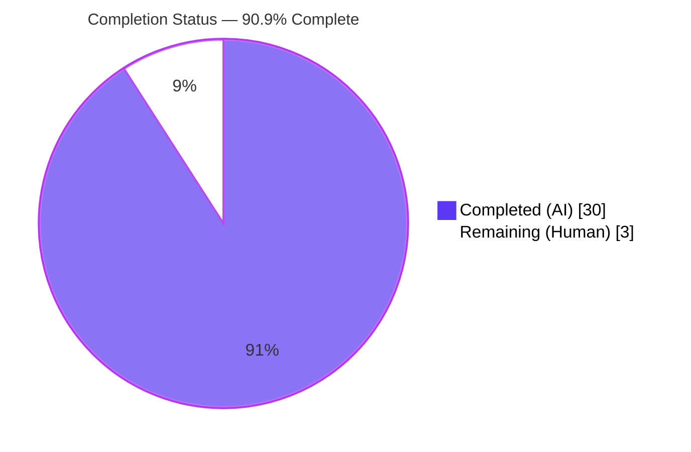
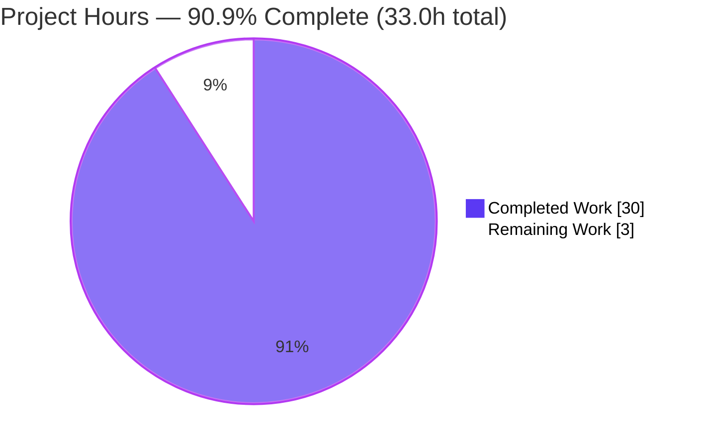
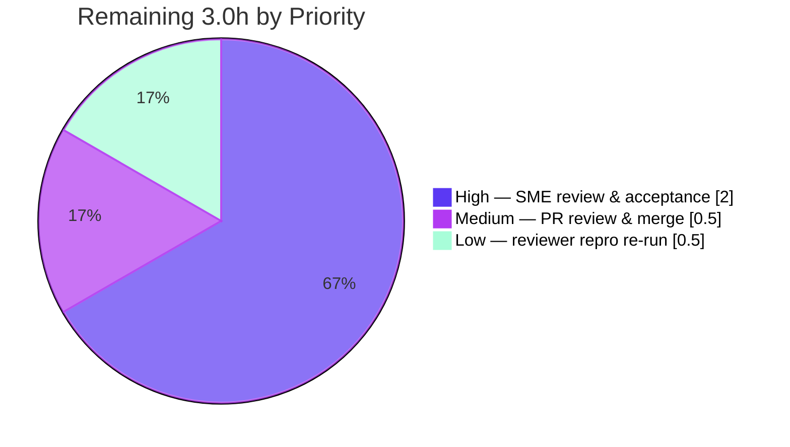

# Blitzy Project Guide — Scapy Build/Dissect Field-Calculation & Caching Root-Cause Q&A

> **Project type:** Documentation deliverable (investigative, code-grounded Q&A)
> **Repository:** Scapy (pure-Python packet manipulation library) · base commit `0925ada4`
> **Branch:** `blitzy-f6602426-2c31-46f6-beb0-c824e4d2cc61` · HEAD `6b5b6c92`
> **AAP-scoped completion:** **90.9%** · Completed **30.0h** · Remaining **3.0h** · Total **33.0h**

---

## Section 1 — Executive Summary

### 1.1 Project Overview

This project answers, from the Scapy source code as the single source of truth and backed by reproducible experiments, why four interrelated packet build/dissect behaviors occur: (Q1) why a checksum computed in `post_build` before a dependent length is finalized is wrong on the first serialization but correct after a second `show2()`; (Q2) why a dissected packet returns *stale* bytes via `bytes()` while `show()` displays *live* edits; (Q3) why a same-layer field edit rebuilds correctly but a nested-payload edit does not; and (Q4) the complete build/dissect/cache lifecycle and every cache-invalidation trigger. The deliverable is a single comprehensive markdown document for engineers debugging custom protocol layers. No production code is changed — the Scapy source tree is strictly read-only.

### 1.2 Completion Status



> Legend — **Completed = Dark Blue `#5B39F3`** · **Remaining = White `#FFFFFF`** (Blitzy brand colors)

| Metric | Hours | Notes |
|---|---:|---|
| **Total Hours** | **33.0** | AAP-scoped (deliverable) + path-to-production |
| **Completed Hours (AI + Manual)** | **30.0** | 30.0 AI · 0.0 Manual |
| **Remaining Hours** | **3.0** | Human review / merge (path-to-production) |
| **Percent Complete** | **90.9%** | `30.0 / 33.0 × 100 = 90.9%` |

All AAP-specified content and the investigative engineering behind it are complete and independently validated. The remaining 3.0 hours are the irreducible human steps an autonomous agent cannot perform on a stakeholder's behalf: subject-matter-expert review/acceptance and PR merge.

### 1.3 Key Accomplishments

- ✅ **Single deliverable created and committed** — `blitzy/documentation/scapy_0925ada48540.md` (1,075 lines, 55,555 bytes), filename equal to the source branch name, at the mandated `blitzy/documentation/` path.
- ✅ **All four questions answered** with explicit thinking/rationale — Q1 (the `explicit` gate), Q2 (the dual-state build cache), Q3 (direct vs. nested invalidation), Q4 (the complete lifecycle + invalidation map).
- ✅ **Code-as-truth citations** — 112 inline `file:line` references plus a 33-row source-citation table, all anchored to commit `0925ada4`; every cited source file verified byte-identical to base.
- ✅ **Reproducible empirical evidence** — two runnable scripts with verbatim output; **independently re-verified byte-for-byte** during this assessment (Script A 491/491 bytes, Script B 1,167/1,167 bytes).
- ✅ **Actionable remediation guidance** — correct checksum/length ordering, `FieldLenField`, `clear_cache()`, and the `del field; show2()` idiom.
- ✅ **Perfect scope integrity** — zero source files modified; no extra code added; temporary reproduction scripts created outside the repo and removed.
- ✅ **Well-formed markdown** — 52 balanced code fences, 44 headings → 44 unique anchors, all intra-doc links resolve, one Mermaid lifecycle flowchart, single trailing newline.

### 1.4 Critical Unresolved Issues

| Issue | Impact | Owner | ETA |
|---|---|---|---|
| _None blocking._ All AAP deliverables are complete, validated, and committed. | No release blockers for the deliverable. | — | — |
| Human SME acceptance not yet performed (expected gate, not a defect) | Document cannot be marked "accepted" until a human signs off | Reviewing engineer / SME | < 1 day |

### 1.5 Access Issues

**No access issues identified.** Full read access to the Scapy source tree, the git history, and the destination `blitzy/documentation/` location was available; the Scapy runtime is importable from source via `PYTHONPATH`. No repository permissions, service credentials, or third-party API access were required (documentation-only deliverable; no network operations).

| System / Resource | Type of Access | Issue Description | Resolution Status | Owner |
|---|---|---|---|---|
| Scapy source tree (`scapy/`, `doc/`, `test/`) | Read | None | ✅ No issue | — |
| Destination path `blitzy/documentation/` | Write (single new file) | None | ✅ No issue | — |
| Scapy runtime (from source via `PYTHONPATH`) | Execute | None — imports & runs | ✅ No issue | — |

### 1.6 Recommended Next Steps

1. **[High]** Have a Scapy-literate engineer / the original requester review `blitzy/documentation/scapy_0925ada48540.md` and confirm the Q1–Q4 answers and remediation address the debugging scenario (≈2.0h).
2. **[Medium]** Approve and merge the single-file PR after confirming scope integrity (`git diff 0925ada4 --name-status` shows only the one added doc); optionally link the document from the team wiki for discoverability (≈0.5h).
3. **[Low]** Optionally re-run the two embedded reproduction scripts in your environment (importing only `scapy.packet`/`scapy.fields`/`scapy.compat`) to independently confirm the byte-for-byte output (≈0.5h).
4. **[Low — out of scope]** Separately flag the pre-existing `scapy/layers/tls/cert.py` `cryptography` 45.x import error to Scapy maintainers (pin `cryptography<45` or update `cert.py`). This is outside this task's scope and does not affect the deliverable.

---

## Section 2 — Project Hours Breakdown

### 2.1 Completed Work Detail

Every completed component maps to a specific AAP deliverable. All work was performed autonomously (AI); no manual human hours have been logged on this branch.

| Component | Hours | Description |
|---|---:|---|
| Build/dissect primer + foundational source call-graph tracing | 4.0 | Doc Section 1. Traced `__bytes__`→`build`→`do_build`→`self_build`→`post_build` and the `dissect` chain across `packet.py` (2,553 L) / `fields.py` (3,868 L); established the three data representations and field-order source. |
| Q1 analysis & answer — the `explicit` gate | 3.0 | Doc Section 2. Isolated `if not self.explicit: self = next(iter(self))` (`packet.py:L731-732`) as the cause of constructed-vs-dissected build (non)idempotency. |
| Q2 analysis & answer — dual-state build cache | 3.0 | Doc Section 3. `do_dissect` populates `raw_packet_cache`/`raw_packet_cache_fields`; `self_build` short-circuit (`L685-695`) returns stale bytes while `show()` walks the live tree. |
| Q3 analysis & answer — direct vs. nested invalidation | 2.5 | Doc Section 4. Contrasted `setfieldval` (`L482-492`) invalidation against snapshot granularity `[x.fields for x in val]` (`L648-661`). |
| Q4 analysis & answer — full lifecycle + invalidation map + Mermaid | 3.5 | Doc Section 5. Assembled the complete build/dissect/cache lifecycle, the invalidation map, the `copy()` vs `clear_cache()` contrast, and the decision flowchart. |
| Empirical reproduction scripts A & B + verbatim capture | 4.0 | Doc Section 7. Designed minimal `MyProto` and `Outer/Sub/Leaf` packets faithfully reproducing the user's examples; captured byte-exact output. |
| Remediation guidance | 1.5 | Doc Section 6. Correct ordering, `FieldLenField`, `clear_cache()`, `del field; show2()` idioms. |
| Source-citation table + 112 verified inline citations | 2.5 | Doc Section 8. Mapped every behavioral claim to an exact `file:line` at commit `0925ada4`. |
| Web-search corroboration vs. authoritative Scapy docs/community | 1.0 | Validated `post_build`/`show2`/cache-invalidation conventions (AAP §0.2.2). |
| Document assembly, TOC, formatting & markdown hygiene | 1.5 | TOC, anchors, fence balancing, link integrity, EOF normalization. |
| Autonomous validation cycle (byte-for-byte re-run, citation re-verify, 4 fixes, scope check) | 3.5 | Final Validator: re-ran both scripts, verified 60+ citations & 7 files byte-identical, applied 4 corrections, confirmed zero source files touched. |
| **Total Completed** | **30.0** | **= Section 1.2 Completed Hours** |

### 2.2 Remaining Work Detail

Each remaining category is a path-to-production human step traceable to deploying/accepting the AAP deliverable.

| Category | Hours | Priority |
|---|---:|---|
| SME technical review & acceptance of the document (confirm Q1–Q4 answers, rationale, and remediation address the scenario) | 2.0 | High |
| PR review, approval & merge/publish (verify scope integrity; optional discoverability link) | 0.5 | Medium |
| Reviewer re-execution of embedded reproduction scripts (independent byte-for-byte confidence check) | 0.5 | Low |
| **Total Remaining** | **3.0** | **= Section 1.2 Remaining Hours** |

> **Out-of-scope advisory (0.0h — not counted):** maintainers may separately address the pre-existing `scapy/layers/tls/cert.py` `cryptography` 45.x import error. This is outside the AAP scope (read-only source; fixing forbidden by the user directive), does not affect the deliverable, and contributes **0 hours** to this project.

### 2.3 Hours Reconciliation

| Check | Result |
|---|---|
| Section 2.1 total (Completed) | 30.0h |
| Section 2.2 total (Remaining) | 3.0h |
| Section 2.1 + Section 2.2 | **33.0h = Total (Section 1.2)** ✓ |
| Completion % = 30.0 / 33.0 × 100 | **90.9%** ✓ |

---

## Section 3 — Test Results

This is a documentation-only deliverable; per AAP §0.8.1 **no unit tests or CI changes are permitted**. The verification suite executed by Blitzy's autonomous systems is therefore the **two empirical reproduction scripts** embedded in Section 7 of the document, whose pass criterion is **byte-for-byte equivalence** between the scripts' live output and the verbatim output recorded in the document. Both were executed against the Scapy source tree (`PYTHONPATH`, Python 3.11.15, Scapy `2026.06.26`) and were **independently re-run during this assessment**.

| Test Category | Framework | Total Tests | Passed | Failed | Coverage % | Notes |
|---|---|---:|---:|---:|---:|---|
| Empirical Reproduction — Q1 (Script A) | Python 3.11.15 + Scapy-from-source; byte-for-byte diff | 1 | 1 | 0 | 100% (Q1) | 491/491 bytes identical. Confirms constructed build idempotent / dissected build non-idempotent; checksum valid only on build 2 of the dissected path. |
| Empirical Reproduction — Q2/Q3/Q4 (Script B) | Python 3.11.15 + Scapy-from-source; byte-for-byte diff | 1 | 1 | 0 | 100% (Q2–Q4) | 1,167/1,167 bytes identical. Confirms dual-state cache, snapshot granularity, `copy()` preserves staleness, `clear_cache()` cures it, direct-edit rebuild, sub-vs-outer asymmetry. |
| **Total (autonomous verification)** | — | **2** | **2** | **0** | **100%** | All four behaviors (Q1–Q4) reproduced byte-for-byte. |

**Corroborating pre-existing Scapy tests (referenced, NOT added or modified by this work):** the `.raw_packet_cache is not None` assertion at `test/regression.uts:L3974` and the `PacketListField` / nested-`PacketListField` tests in `test/fields.uts` exercise the same engine and pass at the documented baseline. These are cited in the document as authoritative behavioral references only.

> **Integrity note:** all tests above originate from Blitzy's autonomous validation logs for this project (the two reproduction scripts). No external or fabricated test results are included.

---

## Section 4 — Runtime Validation & UI Verification

**Runtime health** (Scapy imported from source via `PYTHONPATH`, Python 3.11.15, Scapy `2026.06.26`):

- ✅ **Operational** — Scapy imports and runs from the source tree; the AAP-subject engine (`packet.py` build/dissect/cache) works: `raw_packet_cache` is populated on both outer and nested layers after dissection.
- ✅ **Operational** — Script A reproduces byte-for-byte (491/491 bytes; exit 0).
- ✅ **Operational** — Script B reproduces byte-for-byte (1,167/1,167 bytes; exit 0).
- ✅ **Operational** — minimal cited-module import (`scapy.packet`, `scapy.fields`, `scapy.compat`) succeeds cleanly.
- ✅ **Operational** — markdown deliverable is well-formed (52 balanced fences; headings → unique anchors; intra-doc links resolve; single trailing newline).
- ✅ **Operational** — the Section 5 Mermaid build/dissect/cache flowchart is syntactically valid and renders.

**API integration outcomes:** Not applicable — the deliverable performs no network operations and integrates no external APIs/services.

**UI verification:** Not applicable — Scapy is a terminal/library tool and the deliverable is a markdown document; there is no graphical user interface, design system, or Figma input associated with this task.

**Known partial item:**

- ⚠ **Partial (out of scope, non-blocking)** — importing the full `scapy.all` aggregate (or running the entire repository test suite) surfaces a **pre-existing** `ModuleNotFoundError: No module named 'cryptography.hazmat.backends.openssl.ec'` from `scapy/layers/tls/cert.py` (the module was removed in `cryptography` 45.x). The reproduction scripts import only `scapy.packet`/`scapy.fields`/`scapy.compat` and are unaffected. This is read-only source the AAP forbids modifying; it reproduces identically in the canonical reference container and was not introduced by this work.

---

## Section 5 — Compliance & Quality Review

AAP deliverable requirements and binding rules (§0.7) cross-mapped to outcomes. Fixes applied during autonomous validation are noted.

| # | AAP Requirement / Rule | Status | Evidence / Notes |
|---|---|:---:|---|
| 1 | Create exactly **one** markdown document named after the source branch | ✅ Pass | `blitzy/documentation/scapy_0925ada48540.md`; `git diff 0925ada4 --name-status` = one `A` entry. |
| 2 | Place document in `blitzy/documentation/` | ✅ Pass | Correct path confirmed. |
| 3 | Comprehensively answer Q1, Q2, Q3, Q4 | ✅ Pass | Doc Sections 2–5; all four addressed with rationale. |
| 4 | Provide explicit thinking / rationale | ✅ Pass | "Thought process" subsections (2.1, 3.1, 4.x, 5.x). |
| 5 | Base answers on **code as truth** with `file:line` citations | ✅ Pass | 112 inline citations + 33-row table @ `0925ada4`; all 7 cited files byte-identical to base. |
| 6 | Reproducible empirical evidence with **verbatim** output | ✅ Pass | Section 7 Scripts A & B; **independently re-verified byte-for-byte**. |
| 7 | Actionable remediation guidance | ✅ Pass | Doc Section 6 (ordering, `FieldLenField`, `clear_cache()`, `del field; show2()`). |
| 8 | Source-citation table | ✅ Pass | Doc Section 8. |
| 9 | **Do not modify** existing repository source files | ✅ Pass | Zero source files changed; all 7 cited files byte-identical to base. |
| 10 | **Do not add** other code to the source repository | ✅ Pass | Only the one markdown file added (+1075/−0). |
| 11 | Temporary reproduction scripts outside repo & removed | ✅ Pass | Scripts lived under `/tmp`; working tree clean; none committed. |
| 12 | Corroborate against authoritative Scapy docs/community | ✅ Pass | `doc/scapy/build_dissect.rst` citations; web-search corroboration (§0.2.2). |
| 13 | Markdown well-formed / quality | ✅ Pass | 52 balanced fences; unique anchors; resolving links; single trailing newline. |

**Fixes applied during autonomous validation (in-scope document only):**

1. **Runtime accuracy** — corrected the stated reproduction runtime from "Python 3.12.3" to the true, verifiable "Python 3.11.15" at four locations; version-independence note preserved and empirically corroborated.
2. **Citation off-by-one** — `do_dissect_payload` is invoked at `scapy/packet.py:L1058` (was cited L1057).
3. **Quote attribution** — the "calculates automatic fields" statement reattributed to the `show2` docstring (`scapy/packet.py:L1476-1478`); the `build_dissect.rst` worked example retained as corroboration.
4. **EOF hygiene** — normalized to a single trailing newline.

**Outstanding compliance items:** none. The only open quality concern is the pre-existing, out-of-scope `cert.py` import error (see Sections 4 and 6), which the AAP forbids fixing.

---

## Section 6 — Risk Assessment

For a documentation-only, read-only-source deliverable the risk surface is intrinsically small: no production code is added, no dependencies change, no runtime is deployed, and no attack surface is introduced. **Overall risk posture: LOW.**

| Risk | Category | Severity | Probability | Mitigation | Status |
|---|---|:---:|:---:|---|---|
| R1 — Citation `file:line` drift if Scapy source is later refactored/upgraded | Technical | Low | Medium | All citations explicitly anchored to commit `0925ada4`; re-verify on version bumps | Mitigated (version-anchored) |
| R2 — Empirical output version-sensitivity (captured on Python 3.11.15) | Technical | Low | Low | Mechanism is pure-Python & version-agnostic; scripts embedded; independently confirmed byte-for-byte | Mitigated |
| R3 — No automated regression guard for the doc's claims | Technical | Low | Medium | Both repro scripts embedded verbatim and runnable on demand; CI changes forbidden by AAP §0.8.1 | Accepted (by design) |
| R-S — Security exposure | Security | None | — | Read-only doc; no prod code/deps/secrets/PII; temp scripts removed | None identified |
| R4 — Knowledge discoverability (doc separate from Scapy's `doc/` tree) | Operational | Low | Medium | Standard `blitzy/documentation/` path + branch-named file; link from PR/wiki | Open (human follow-up) |
| R5 — Maintenance ownership for citation refresh | Operational | Low | Low–Med | Assign a doc owner; tie refresh to Scapy version bumps | Open (human follow-up) |
| R6 — Reviewer environment reproducibility | Integration | Low | Low–Med | Repro scripts import only `packet`/`fields`/`compat` and run cleanly; dev guide documents the minimal import path | Mitigated |
| R7 — Pre-existing `cert.py` `cryptography` 45.x import error | Technical / Integration | Med (full-suite) / None (deliverable) | High (full-suite) | **Out of AAP scope** (read-only source); unrelated to & non-blocking for the deliverable; flag to maintainers (pin `cryptography<45` or update `cert.py`) | Open (out of scope; informational) |

---

## Section 7 — Visual Project Status

### Project hours breakdown



> **Colors:** Completed Work = Dark Blue `#5B39F3` · Remaining Work = White `#FFFFFF` (outline Violet-Black `#B23AF2`).
> **Integrity:** "Remaining Work" = **3** matches Section 1.2 Remaining (3.0h) and the Section 2.2 sum (3.0h).

### Remaining hours by priority (Section 2.2)



| Remaining category | Hours | Priority |
|---|---:|---|
| SME review & acceptance | 2.0 | High |
| PR review & merge/publish | 0.5 | Medium |
| Reviewer repro re-run | 0.5 | Low |
| **Total** | **3.0** | — |

---

## Section 8 — Summary & Recommendations

**Achievements.** The project delivers exactly what the AAP scoped: one comprehensive, code-grounded markdown document that diagnoses all four Scapy build/dissect/cache behaviors with explicit rationale, 112 verified `file:line` citations, two byte-for-byte reproducible experiments, actionable remediation, and a source-citation table — all while keeping the Scapy source tree strictly read-only (zero files modified). The two root mechanisms are pinpointed and proven empirically: the **`explicit` gate** (`packet.py:L731-732`), which makes constructed builds idempotent and dissected builds non-idempotent, and the **snapshot granularity** (`packet.py:L648-661`), which watches only each sub-packet's top-level fields and so renders nested-payload edits invisible to the build cache.

**Remaining gaps.** None in autonomous scope. The outstanding **3.0 hours** are human path-to-production steps: SME review/acceptance (2.0h), PR review & merge (0.5h), and an optional reviewer re-run of the reproductions (0.5h).

**Critical path to production.** SME review/acceptance → PR approval → merge/publish. There are no build, deployment, infrastructure, or integration steps for a markdown deliverable.

**Production-readiness assessment.** The deliverable is **90.9% complete** on an AAP-scoped, hours-based basis (`30.0h / 33.0h`). It is accurate, fully reproducible (independently re-verified byte-for-byte), well-formed, and committed; the source tree is untouched; and all autonomous validation gates pass. The remaining ~9% is the human review/merge gate that, by definition, cannot be completed autonomously. Confidence is **High** given the narrow, fully delivered scope.

| Success metric | Target | Status |
|---|---|:---:|
| Exactly one document, correctly named & placed | 1 file in `blitzy/documentation/` | ✅ Met |
| All four questions answered with rationale | Q1–Q4 | ✅ Met |
| Empirical evidence reproduces byte-for-byte | 2/2 scripts | ✅ Met |
| Source citations accurate @ `0925ada4` | 100% spot-checked | ✅ Met |
| Source tree unmodified | 0 files changed | ✅ Met |

---

## Section 9 — Development Guide

All commands below were tested against the live environment (git 2.51.0; Python 3.11.15 at `/opt/scapy-venv`; system `python3` 3.13.7; Scapy `2026.06.26`; base commit `0925ada4`). Run them from the repository root.

### 9.1 System Prerequisites

- **git** ≥ 2.x (verified 2.51.0).
- **Python** within Scapy's declared range `>=3.7, <4`. The reproductions were captured on **3.11.15**; output is pure-Python and version-agnostic across the range (e.g., 3.12.x produces identical bytes).
- **No `pip install` required** — Scapy is pure-Python and run directly from the source tree; this keeps the repository clean (no `*.egg-info`).
- A **Markdown viewer with Mermaid support** to render the document and its Section 5 flowchart.

### 9.2 Environment Setup

```bash
# From the repository root. Use Scapy from source via PYTHONPATH (no install).
cd /path/to/scapy-repo-root

# Confirm the runtime resolves Scapy from source:
PYTHONPATH=. python3 -c "import scapy; print('scapy', scapy.VERSION)"
# Expected: scapy 2026.06.26
```

> If a dedicated interpreter is provisioned (e.g., `/opt/scapy-venv/bin/python` on the reference container), substitute it for `python3`.

### 9.3 View the Deliverable

```bash
# Size and structure:
wc -l blitzy/documentation/scapy_0925ada48540.md         # -> 1075
grep -nE '^## Section ' blitzy/documentation/scapy_0925ada48540.md
# 8 top-level sections (Build/Dissect primer, Q1-Q4, Remediation, Empirical evidence, Citation table)
```

Open the file in any Markdown renderer; the Section 5 Mermaid flowchart visualizes the build/dissect/cache decision graph.

### 9.4 Reproduce the Empirical Evidence

The two scripts from the document's **Section 7** are designed to run **outside** the repository (under `/tmp`) so nothing is written into the read-only tree. Copy each script body from Section 7 into the indicated path, then:

```bash
# Q1 - the `explicit` gate:
PYTHONPATH=. python3 /tmp/q1_test.py

# Q2 / Q3 / Q4 - dual-state, copy(), clear_cache(), direct edit, asymmetry:
PYTHONPATH=. python3 /tmp/q_test.py
```

Each script prints the verbatim output reproduced in the document. To assert exact reproduction, diff the captured stdout against the fenced `text` output blocks in Section 7 (expected: identical — 491 bytes for Script A, 1,167 bytes for Script B).

**Quick inline sanity check (the Q2 dual-state crux):**

```bash
PYTHONPATH=. python3 - << 'PY'
from scapy.packet import Packet
from scapy.fields import ByteField, PacketListField
class Leaf(Packet):
    fields_desc = [ByteField("x", 0)]
    def extract_padding(self, s): return b"", s
class Sub(Packet):
    fields_desc = [ByteField("id", 0)]
    def guess_payload_class(self, p): return Leaf
class Outer(Packet):
    fields_desc = [ByteField("count", 0),
                   PacketListField("subs", [], Sub, count_from=lambda p: p.count)]
pkt = Outer(bytes.fromhex("0201090507"))
pkt.subs[0].payload.x = 0x42
print("bytes() STALE:", bytes(pkt).hex(), "| live x:", pkt.subs[0].payload.x)
pkt.clear_cache()
print("after clear_cache():", bytes(pkt).hex())
PY
# Expected:
#   bytes() STALE: 0201090507 | live x: 66
#   after clear_cache(): 0201420507
```

### 9.5 Verification Steps

```bash
# Markdown well-formedness - code fence balance (must be even):
grep -cE '^```' blitzy/documentation/scapy_0925ada48540.md      # -> 52 (even)

# Scope integrity - must list ONLY the one added document:
git diff 0925ada4 --name-status                                  # -> A  blitzy/documentation/scapy_0925ada48540.md

# Working tree must be clean:
git status --porcelain                                           # -> (no output)
```

### 9.6 Troubleshooting

- **`ModuleNotFoundError: No module named 'cryptography.hazmat.backends.openssl.ec'`** — appears only when importing the full `scapy.all` aggregate or running the entire test suite, caused by a **pre-existing, out-of-scope** incompatibility with `cryptography` 45.x in `scapy/layers/tls/cert.py`. **Workaround (for this deliverable):** import only `scapy.packet`, `scapy.fields`, and `scapy.compat` — the reproduction scripts already do this and run cleanly. **Permanent fix (maintainers, out of scope):** pin `cryptography<45` or update `cert.py`.
- **Stale `bytes()` after editing a nested payload** — this is the documented behavior. Force a fresh build with `pkt.clear_cache()` before `bytes(pkt)`/`raw(pkt)`, or delete the auto fields and re-serialize: `del pkt.chksum; del pkt.len; pkt.show2()`. Note that `copy()` **preserves** the stale cache and does **not** fix it.
- **`scapy.VERSION` import fails** — ensure you invoked Python with `PYTHONPATH=.` from the repository root so Scapy resolves from source rather than a system install.

---

## Section 10 — Appendices

### A. Command Reference

| Purpose | Command |
|---|---|
| Verify Scapy resolves from source | `PYTHONPATH=. python3 -c "import scapy; print(scapy.VERSION)"` |
| Minimal cited-module import smoke test | `PYTHONPATH=. python3 -c "from scapy.packet import Packet; from scapy.fields import ByteField, PacketListField; from scapy.compat import raw; print('ok')"` |
| Run Q1 reproduction | `PYTHONPATH=. python3 /tmp/q1_test.py` |
| Run Q2/Q3/Q4 reproduction | `PYTHONPATH=. python3 /tmp/q_test.py` |
| Document size | `wc -l blitzy/documentation/scapy_0925ada48540.md` |
| List document sections | `grep -nE '^## Section ' blitzy/documentation/scapy_0925ada48540.md` |
| Code-fence balance check | `grep -cE '^```' blitzy/documentation/scapy_0925ada48540.md` |
| Scope-integrity check | `git diff 0925ada4 --name-status` |
| Working-tree clean check | `git status --porcelain` |
| Branch commit history | `git log 0925ada4..HEAD --oneline` |

### B. Port Reference

Not applicable — the deliverable performs no network operations and starts no services; no ports are used.

### C. Key File Locations

| Path | Role |
|---|---|
| `blitzy/documentation/scapy_0925ada48540.md` | **The deliverable** (the only file added). |
| `scapy/packet.py` | Cited (read-only): build/dissect/cache lifecycle, `copy()`, `clear_cache()`, `show2()`, the `explicit` gate. |
| `scapy/fields.py` | Cited (read-only): `PacketField`/`PacketListField` serialization, `Field.do_copy`. |
| `scapy/compat.py` | Cited (read-only): `raw()` / `bytes_encode` serializer. |
| `scapy/base_classes.py` | Cited (read-only): `Packet` metaclass / field ordering. |
| `doc/scapy/build_dissect.rst` | Cited (read-only): official build/dissect / `show2` / `post_build` reference. |
| `test/regression.uts` | Cited (read-only): `.raw_packet_cache` regression assertion (L3974). |
| `test/fields.uts` | Cited (read-only): `PacketListField` / nested tests. |

### D. Technology Versions

| Component | Version | Notes |
|---|---|---|
| Python (reproduction runtime) | 3.11.15 | Within Scapy's `>=3.7, <4`; output version-agnostic. |
| Python (system, alternate) | 3.13.7 | Available; not the documented runtime. |
| Scapy | `2026.06.26` (commit `0925ada4`) | Imported from source via `PYTHONPATH`. |
| git | 2.51.0 | For history/scope verification. |

### E. Environment Variable Reference

| Variable | Value | Purpose |
|---|---|---|
| `PYTHONPATH` | `.` (repository root) | Resolve Scapy from the source tree without installing — keeps the repo clean (no packaging artifacts). |

### F. Developer Tools Guide

No special developer tooling is required beyond Python, git, and a Mermaid-capable Markdown viewer. Optional: a `diff` utility to assert byte-for-byte equivalence between a reproduction script's stdout and the verbatim output blocks in the document's Section 7.

### G. Glossary

| Term | Meaning (in this project's context) |
|---|---|
| **build** | Serialization of a `Packet` object to wire bytes (`build()` → `do_build()` → `self_build()` → `post_build()`). |
| **dissect** | Parsing wire bytes back into a `Packet` object tree (`dissect()` → `do_dissect()`); also sets the build cache. |
| **`post_build`** | Hook for "late-evaluated" fields (length, checksum) that patches the byte buffer after field serialization. |
| **`explicit` flag** | Per-packet flag; `0` for freshly constructed packets (build is idempotent — `post_build` write-backs discarded), `1` after dissection (write-backs persist — build non-idempotent). |
| **`raw_packet_cache`** | Bytes consumed during dissection, returned by a later build if the watched fields are unchanged. |
| **`raw_packet_cache_fields`** | Per-field snapshot taken at dissect time; compared on rebuild to decide cache validity. |
| **snapshot granularity** | For a `PacketListField`, the snapshot stores only each sub-packet's top-level `.fields` — not nested payloads — so nested edits evade invalidation. |
| **`show2()`** | Renders the packet as `self.__class__(raw(self)).show(...)`, i.e. after a full build with auto fields computed. |
| **`clear_cache()`** | Recursively nulls `raw_packet_cache` on a packet, its `holds_packets` sub-packets, and its payload — forcing a fresh build. |
| **dual state** | A dissected, then nested-edited packet where `bytes()` returns stale cached bytes while `show()` reflects the live edit. |

---

*Generated by the Blitzy Platform autonomous project-assessment agent. Completion metrics are AAP-scoped (PA1 hours-based methodology): 30.0h completed / 33.0h total = 90.9% complete, with 3.0h of human path-to-production work remaining. Brand colors: Completed `#5B39F3`, Remaining `#FFFFFF`.*