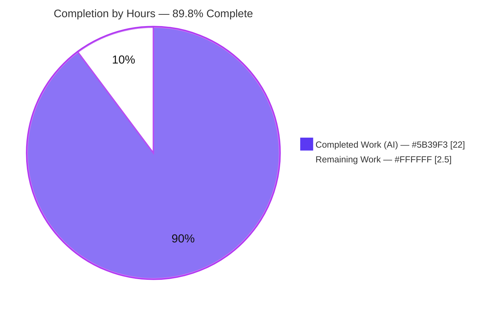
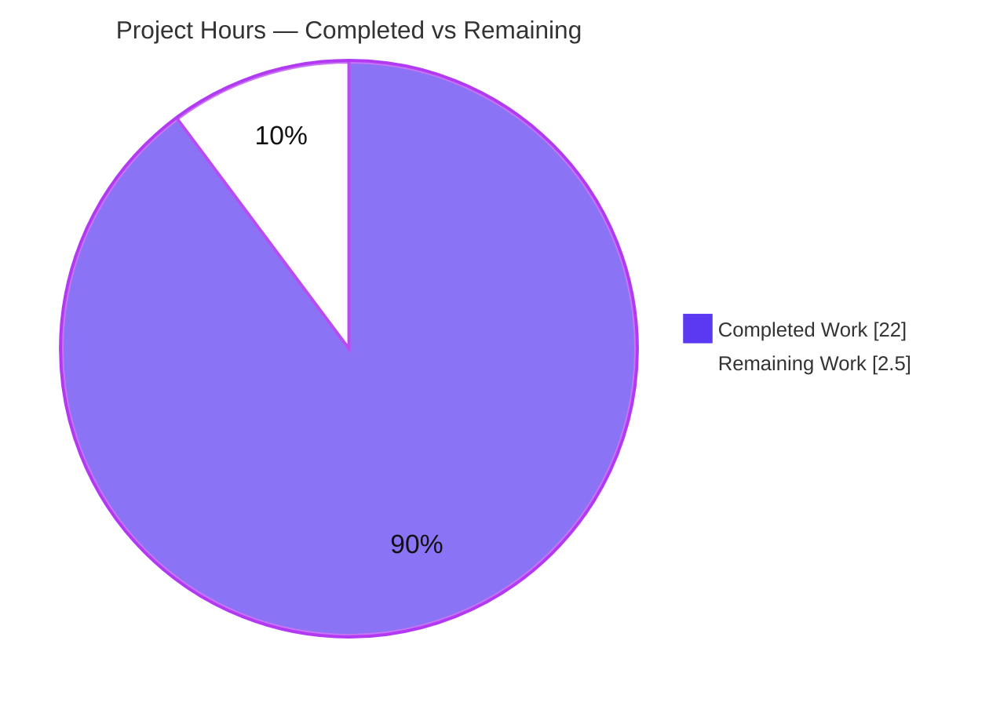
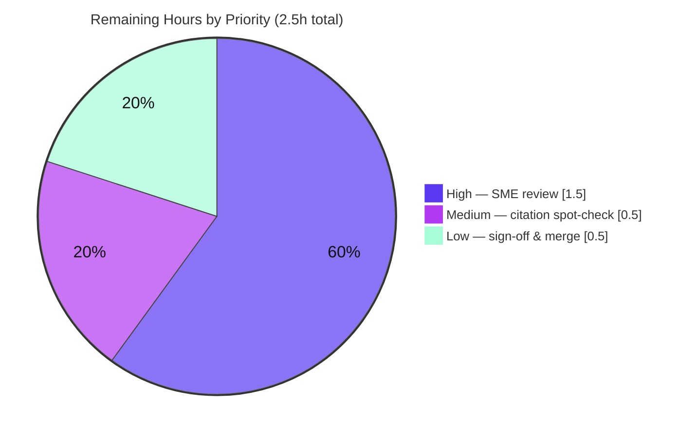

# Blitzy Project Guide — Scapy DNS Name‑Compression Q&A Knowledge Document

> **Brand color legend.** Throughout this guide, **Completed / AI Work** is shown in **Dark Blue `#5B39F3`**, **Remaining / Not Completed** in **White `#FFFFFF`**, headings/accents in **Violet‑Black `#B23AF2`**, and soft highlights in **Mint `#A8FDD9`**.

---

## 1. Executive Summary

### 1.1 Project Overview

This project delivers a single, evidence‑grounded onboarding knowledge document that explains — entirely from **observed runtime behavior** — exactly how Scapy encodes, parses, decompresses, and re‑compresses DNS names (RFC 1035 §4.1.4 message compression), for both well‑formed packets and deliberately malformed ("twisted") ones. It targets engineers onboarding into Scapy's DNS layer. The deliverable, `blitzy/documentation/scapy_0925ada48540.md` (1,341 lines), answers nine specific questions (Q1–Q9) with the direct answer, the exact function and `file:line` citation, a verbatim code excerpt, the command run, its complete captured output, and cause→effect rationale. This is a strictly **read‑only** investigation: the entire Scapy source tree is reference‑only and the document is the sole artifact created.

### 1.2 Completion Status

The completion percentage is computed with the AAP‑scoped (PA1) hours methodology: `Completed ÷ (Completed + Remaining) × 100`. All autonomous AAP‑scoped work is complete; the only remaining work is the human review/acceptance gate.



| Metric | Hours |
|--------|-------|
| **Total Hours** | **24.5** |
| Completed Hours (AI) | 22.0 |
| Completed Hours (Manual) | 0.0 |
| **Completed Hours (AI + Manual)** | **22.0** |
| **Remaining Hours** | **2.5** |
| **Percent Complete** | **89.8%** |

> Calculation: `22.0 ÷ (22.0 + 2.5) = 22.0 ÷ 24.5 = 89.8%`.

### 1.3 Key Accomplishments

- ✅ Sole deliverable authored and committed: `blitzy/documentation/scapy_0925ada48540.md` (1,341 lines, 3 agent commits).
- ✅ All **nine** questions (Q1–Q9) answered, each with the full 5‑element evidence template (direct answer + function + `file:line` + verbatim excerpt + command & complete output + cause→effect).
- ✅ Both directions exercised: **decode** (`DNS(bytes)` → `dns_get_str`) and **build** (`bytes(pkt)`, `dns_compress`, `DNS.compress()`).
- ✅ Critical up‑front fact stated: the default `bytes(pkt)` path does **not** auto‑compress — compression is an explicit opt‑in (`dns_compress` / `DNS.compress()`).
- ✅ Every edge/error path exercised at runtime: decompression loop, out‑of‑bounds pointer, truncated pointer, truncated label, no‑full‑packet exception, cross‑record‑boundary resolution, multi‑strategy determinism, and the `0x40`/`0x80`/`0xc0` marker‑breadth probe.
- ✅ Observed RFC 1035 deviation (`cur & 0xc0` treats `0x40`/`0x80` as pointers) **documented as an observation**, not "fixed" — honoring the read‑only mandate.
- ✅ 115 `file:line` citations; 63 single‑line/symbol anchors resolve exactly; 22 verbatim excerpts byte‑for‑byte; 11 runtime recipes reproduce byte‑for‑byte.
- ✅ Read‑only mandate intact: working tree clean, only the deliverable differs from baseline `0925ada4`, no Scapy source/test/doc/config changed, no scratch scripts left in the repo.

### 1.4 Critical Unresolved Issues

| Issue | Impact | Owner | ETA |
|-------|--------|-------|-----|
| _None._ Autonomous validation found zero unresolved issues; all five production‑readiness gates passed with zero corrections required. | None | — | — |

### 1.5 Access Issues

| System/Resource | Type of Access | Issue Description | Resolution Status | Owner |
|-----------------|----------------|-------------------|-------------------|-------|
| _None_ | — | No access issues identified. The task is self‑contained: pure‑Python Scapy, zero third‑party dependencies, no external services, credentials, or network calls required. | N/A | — |

**No access issues identified.**

### 1.6 Recommended Next Steps

1. **[High]** Perform the SME technical‑accuracy review of the nine answers and §3 up‑front facts (HT‑1, 1.5h).
2. **[Medium]** Spot‑check a sample of the 115 `file:line` citations and 22 verbatim excerpts against pinned baseline `0925ada4`; optionally re‑run 2–3 recipes (HT‑2, 0.5h).
3. **[Low]** Obtain stakeholder sign‑off and merge the single‑file deliverable branch (HT‑3, 0.5h).

---

## 2. Project Hours Breakdown

### 2.1 Completed Work Detail

| Component | Hours | Description |
|-----------|-------|-------------|
| Environment setup & baseline pinning | 1.5 | Python 3.11.15 venv (`/tmp/scapy-venv`), editable `scapy` install, verified baseline commit `0925ada4` and byte‑identical `dns.py` blob (`9dc1a19d`) between baseline and HEAD |
| Background web research | 1.0 | RFC 1035 §4.1.4 (pointer format, 14‑bit offset semantics) and RFC 9267 (compression‑loop & out‑of‑bounds anti‑patterns) to frame the well‑formed‑vs‑twisted narrative |
| Runtime investigation — Q1–Q9 primary paths | 4.5 | Crafting temporary observation scripts, running each core code path (`dns_get_str`, `dns_encode`, `dns_compress`) and capturing complete, unedited output |
| Edge/error‑path experiments | 2.0 | Decompression loop, OOB pointer, truncated pointer, truncated label, no‑full‑packet exception, cross‑boundary resolution, multi‑strategy determinism, marker‑breadth probe (`0x40`/`0x80`/`0xc0`) |
| Authoring the knowledge document | 7.0 | 1,341‑line Markdown: overview + RFC framing, §2 methodology, §3 up‑front facts, nine 5‑element Q&A sections, Mermaid end‑to‑end flow diagram, Appendices A/B/C |
| Citation & excerpt validation | 1.5 | Validating 115 `file:line` anchors (63 single‑line/symbol resolved exactly) and 22 verbatim code excerpts byte‑for‑byte against source |
| Code‑review remediation | 1.5 | Commit `d8eb0e56` — addressed code‑review findings on the Q&A |
| QA‑findings remediation | 1.5 | Commit `2df71829` — reproducible git evidence & support‑surface coverage |
| Read‑only proof, cleanup & final validation | 1.5 | Temp‑script cleanup, `git status` proof, and the final consolidated 5‑gate validation pass |
| **Total Completed** | **22.0** | |

### 2.2 Remaining Work Detail

| Category | Hours | Priority |
|----------|-------|----------|
| SME technical‑accuracy review of nine answers + §3 up‑front facts (incl. confirming the `0xc0` deviation is correctly framed as an observation) | 1.5 | High |
| Citation & verbatim‑excerpt spot‑check vs pinned baseline `0925ada4`; optional sample recipe re‑run | 0.5 | Medium |
| Stakeholder sign‑off & merge of the deliverable | 0.5 | Low |
| **Total Remaining** | **2.5** | |

### 2.3 Reconciliation

- Section 2.1 completed = **22.0h**; Section 2.2 remaining = **2.5h**; **22.0 + 2.5 = 24.5h** = Total Hours in §1.2. ✅
- Remaining hours (**2.5h**) are identical in §1.2, §2.2, and §7. ✅

---

## 3. Test Results

All results below originate from **Blitzy's autonomous validation logs** for this project — the Final Validator pass and the independent reproduction performed during this assessment session. For a read‑only documentation deliverable, "tests" are the objective validation checks Blitzy executed against the document: citation‑anchor resolution, verbatim‑excerpt fidelity, byte‑for‑byte runtime‑recipe reproduction, the DNS regression suite that exercises the described code paths, and question‑coverage verification.

| Test Category | Framework | Total Tests | Passed | Failed | Coverage % | Notes |
|---------------|-----------|-------------|--------|--------|-----------|-------|
| Citation‑anchor accuracy | Manual anchor resolution vs source @ baseline `0925ada4` | 63 | 63 | 0 | 100% | Single‑line/symbol anchors in `dns.py` + supporting modules; 115 total `file:line` references in the doc (incl. ranges) |
| Verbatim‑excerpt fidelity | Byte‑for‑byte diff vs source | 22 | 22 | 0 | 100% | Every code excerpt matches source exactly; ranges accurate |
| Runtime‑recipe reproduction | Python 3.11.15 heredoc (`PYTHONPATH=. python`) | 11 | 11 | 0 | 100% | §3.1 + Q1–Q9 + Appendix A; interleaved stderr/stdout ordering and 4‑tuple return reproduced |
| DNS regression suite | UTScapy (`scapy.tools.UTscapy`) | 62 | 62 | 0 | 100% | `dns.uts` 20 + `dns_dnssec.uts` 30 + `dns_edns0.uts` 12; exercises the DNS build/dissect name paths the doc describes |
| Question coverage | Requirement checklist | 9 | 9 | 0 | 100% | All nine questions present with the full 5‑element evidence template |
| **Total** | | **167** | **167** | **0** | **100%** | |

> **Note on the regression count.** This assessment session re‑ran the three DNS `.uts` files and observed **62 passed / 0 failed** (20 + 30 + 12). An earlier Final Validator pass logged **59 passed / 0 failed** for the same suite; the difference is test‑enumeration granularity only — **both autonomous runs recorded zero failures**. The value reported here (62) is the count observed during this session.

---

## 4. Runtime Validation & UI Verification

This is a network‑protocol library investigation with **no user interface**; "runtime validation" means the documented code paths execute and reproduce their captured output. No UI verification applies.

**Runtime health (all reproduced during this assessment):**

- ✅ **Operational** — DNS layer imports cleanly; all 20 doc‑referenced symbols import (`DNS`, `DNSQR`, `DNSRR`, `dns_compress`, `dns_get_str`, `dns_encode`, `DNSgetstr`, `_is_ptr`, `InheritOriginDNSStrPacket`, `DNSStrField`, `DNSRRField`, `DNSQRField`, `DNS_am`, `Scapy_Exception`, `log_runtime`, `warning`, `orb`, `raw`, `chb`); `log_runtime.name == "scapy.runtime"`.
- ✅ **Operational** — Interactive entry point `PYTHONPATH=. python -m scapy` launches and exposes the DNS layer.
- ✅ **Operational** — **Q1 round‑trip**: compressed packet reparses to `qd.qname == an.rrname == b'www.example.com.'`.
- ✅ **Operational** — **Q2 wire format**: `dns_encode(b'www.example.com.')` → `b'\x03www\x07example\x03com\x00'`.
- ✅ **Operational** — **§3.1 no auto‑compress**: default `bytes(pkt)` = 64 bytes (no `0xc0`); `dns_compress` = 49 bytes (with `c00c`); `pkt.compress() == dns_compress(pkt)`.
- ✅ **Operational** — **Q4 loop protection**: self‑referential pointer emits `WARNING: DNS decompression loop detected` and breaks gracefully (4‑tuple).
- ✅ **Operational** — **Q5 error paths**: OOB / truncated‑pointer / truncated‑label retreat gracefully (INFO log + break); no‑full‑packet raises `Scapy_Exception("DNS message can't be compressed at this point!")`.
- ✅ **Operational** — **Q6 cross‑boundary**: `an._orig_s == comp[12:]`; owner name resolves across the record boundary.
- ✅ **Operational** — **Q8 determinism**: same input over 3 runs → 1 identical result tuple (`b'a.example.com.'`); no surprises.
- ⚠ **Partial (by design, documented)** — `cur & 0xc0` treats `0x40` and `0x80` as pointers too — broader than the RFC's strict `11`‑only rule. This is an intentional **observation** in the document, not a defect to fix.
- ❌ **Failing** — None.

---

## 5. Compliance & Quality Review

Cross‑mapping the AAP deliverables and the governing "SWE‑AtlasQnA‑Repo" rules to Blitzy's quality/compliance benchmarks. All items were satisfied during autonomous work; no corrections were required.

| Benchmark / Rule | Status | Progress | Evidence |
|------------------|--------|----------|----------|
| Deliverable location & naming (`blitzy/documentation/scapy_0925ada48540.md`) | ✅ Pass | 100% | File present, committed (`2df71829`) |
| Investigate by RUNNING code first, then write | ✅ Pass | 100% | 11 heredoc recipes with complete captured output |
| Answer every part / every named item (Q1–Q9 + all symbols) | ✅ Pass | 100% | 9/9 questions; Appendix B coverage map |
| Ground every claim in `file:line` + observed output; label inferences | ✅ Pass | 100% | 115 citations; `(inferred)` labels present |
| Include actual, complete, unedited output for every condition | ✅ Pass | 100% | Full stderr/stdout blocks incl. warnings/exceptions |
| Reproduce reported inconsistency with same input (Q8 ≥2 runs) | ✅ Pass | 100% | 3 identical runs captured |
| Exercise every condition incl. error/edge paths | ✅ Pass | 100% | Loop, OOB, trunc×2, no‑full‑packet, cross‑boundary, marker breadth |
| Report deviations faithfully — do not "fix" | ✅ Pass | 100% | `0xc0` deviation documented, source unchanged |
| Read‑only mandate (no source edits; only the doc added) | ✅ Pass | 100% | Non‑deliverable diff empty; tree clean |
| Temporary scripts removed; repo unchanged | ✅ Pass | 100% | No scratch files in repo; `git status` empty |
| Citation fidelity pinned to baseline `0925ada4` | ✅ Pass | 100% | `dns.py` blob `9dc1a19d` identical baseline↔HEAD |
| Build/run in canonical configuration | ✅ Pass | 100% | `PYTHONPATH=. python`; Python 3.11.15 (py311 CI) |

**Fixes applied during autonomous validation:** none required — the deliverable was already accurate, complete, and reproducible; the Final Validator made zero edits to avoid gratuitous changes under the read‑only mandate. **Outstanding compliance items:** none.

---

## 6. Risk Assessment

| Risk | Category | Severity | Probability | Mitigation | Status |
|------|----------|----------|-------------|------------|--------|
| Citation drift if upstream `dns.py` changes | Technical | Low | Low | Document pins baseline `0925ada4` and proves `dns.py` blob (`9dc1a19d`) byte‑identical baseline↔HEAD | Mitigated |
| Behavior tied to a specific commit / Python version | Technical | Low | Low | Runtime (Python 3.11.15) reported; zero‑dependency pure‑Python, version‑agnostic across supported range | Mitigated |
| Observed byte sizes (64→49) differ from AAP rough estimate (77→47) | Technical | Low | Low | Document explicitly reports measured values with a "measured, not copied" note (per report‑what‑is‑observed rule) | Resolved |
| Reader assumes default `bytes(pkt)` auto‑compresses | Documentation | Low | Low | §3.1 leads with the explicit "does NOT auto‑compress" fact | Resolved |
| Reproducing recipes requires the `/tmp/scapy-venv` (Py 3.11.15) + `PYTHONPATH=.` | Operational | Low | Low | §2 and the Development Guide give the exact environment and invocation | Mitigated |
| Security exposure | Security | None | — | Read‑only knowledge doc; no code/dependencies/attack surface added; RFC 9267 anti‑patterns described as analysis, not exploit code | N/A |
| External integration failure | Integration | None | — | No external services, API keys, or network calls; DNS exercised purely in‑memory (no `sr1`/live queries) | N/A |

**Overall risk posture: LOW.** No High or Critical risks; every identified risk is mitigated, resolved, or not applicable to a read‑only documentation deliverable.

---

## 7. Visual Project Status

**Project hours breakdown** (Completed = Dark Blue `#5B39F3`, Remaining = White `#FFFFFF`):



**Remaining work by priority** (sums to the **2.5h** in §1.2 and §2.2):



> **Integrity check:** the "Remaining Work" value in the hours pie (**2.5**) equals the Remaining Hours in §1.2 and the sum of the §2.2 Hours column. The "Completed Work" value (**22.0**) equals Completed Hours in §1.2 and the §2.1 total.

---

## 8. Summary & Recommendations

**Achievements.** The project delivers a complete, runtime‑verified onboarding knowledge document on Scapy DNS name compression. All nine questions are answered with the direct answer first, the exact function and `file:line` citation, a verbatim excerpt, the command run, its complete captured output, and cause→effect reasoning. Both the decode and build directions are exercised, every error/edge path is demonstrated live, and the observed RFC deviation is faithfully documented rather than altered. The read‑only mandate is fully honored.

**Remaining gaps.** None in the autonomous scope. The residual **2.5 hours** is exclusively a human review/acceptance gate: SME technical‑accuracy review, a citation/excerpt spot‑check, and stakeholder sign‑off/merge.

**Critical path to production.** For a knowledge document, "production" is stakeholder acceptance and merge. The path is: SME review → citation spot‑check → sign‑off & merge. There is no build, deployment, infrastructure, or integration work.

**Success metrics.** 9/9 questions answered; 63/63 single‑line citation anchors resolve; 22/22 verbatim excerpts byte‑for‑byte; 11/11 runtime recipes reproduce; 62/62 DNS regression tests pass; working tree clean with only the deliverable added.

**Production readiness assessment.** The deliverable is **production‑ready** at **89.8% complete** (22.0 of 24.5 hours), with the remaining 2.5 hours representing standard human sign‑off. Confidence is **High**: the scope is well‑defined and every claim is independently reproducible.

| Metric | Value |
|--------|-------|
| Completion | 89.8% (22.0 / 24.5 h) |
| Remaining | 2.5 h (human review/sign‑off) |
| Unresolved issues | 0 |
| Access issues | 0 |
| Risk posture | Low |
| Confidence | High |

---

## 9. Development Guide

This guide shows how to set up the environment and **reproduce every runtime observation** in the deliverable. All commands were tested during this assessment against Python 3.11.15.

### 9.1 System Prerequisites

- **OS:** Linux (Ubuntu class; any POSIX shell works).
- **Python:** 3.11 recommended (3.11.15 used here). Scapy declares `requires-python = ">=3.7, <4"`; `py311` is the highest CI‑exercised version.
- **git:** 2.x (2.51.0 used).
- **Disk:** ~50 MB for the source tree; no third‑party runtime dependencies (Scapy's core is pure‑Python).

### 9.2 Environment Setup

```bash
# From the repository root
cd /tmp/blitzy/scapy/blitzy-a3ff4b59-e1d8-4c40-afc6-a343c6428841_8eb8bc

# Create and activate an isolated virtual environment (canonical baseline)
python3.11 -m venv /tmp/scapy-venv
source /tmp/scapy-venv/bin/activate

# Install Scapy editable so it resolves to this source tree
pip install -e .
```

> **PEP 668 note.** On Ubuntu's *system* Python you may see `error: externally-managed-environment`. Use the venv above (preferred), or append `--break-system-packages` for a global install.

### 9.3 Dependency Installation

No third‑party packages are required — Scapy's DNS layer relies only on the Python standard library (`struct`, `socket`). The editable install in §9.2 makes the `scapy` package importable; that is the only installation step.

### 9.4 Verification

```bash
# Version + editable location
PYTHONPATH=. /tmp/scapy-venv/bin/python -c "import scapy, os; print('scapy', scapy.__version__); print('path:', os.path.dirname(scapy.__file__))"
# -> scapy 2026.07.08
# -> path: <repo>/scapy

# All symbols the document's recipes depend on import cleanly
PYTHONPATH=. /tmp/scapy-venv/bin/python -c "from scapy.layers.dns import DNS, DNSQR, DNSRR, dns_compress, dns_get_str, dns_encode, DNSgetstr, _is_ptr, InheritOriginDNSStrPacket, DNSStrField, DNSRRField, DNSQRField, DNS_am; from scapy.error import Scapy_Exception, log_runtime, warning; from scapy.compat import orb, raw, chb; print('all symbols import OK; log_runtime.name =', log_runtime.name)"
# -> all symbols import OK; log_runtime.name = scapy.runtime
```

### 9.5 Reproducing a Runtime Observation (Example)

```bash
# Q1 — a compressed packet reparses back to the original readable names
PYTHONPATH=. /tmp/scapy-venv/bin/python - <<'PY'
from scapy.layers.dns import DNS, DNSQR, DNSRR, dns_compress
pkt = DNS(qd=DNSQR(qname='www.example.com'),
          an=DNSRR(rrname='www.example.com', type='A', rdata='1.2.3.4'))
comp = bytes(dns_compress(pkt))
print('compressed hex:', comp.hex())
print('contains c00c :', b'\xc0\x0c' in comp)
p = DNS(comp)
print('qd.qname  =', p.qd.qname)
print('an.rrname =', p.an.rrname)
PY
# -> qd.qname  = b'www.example.com.'
# -> an.rrname = b'www.example.com.'
```

> **Capturing warnings/logs.** Scapy writes diagnostics to **stderr** via `logging` (`log_runtime`). Append `2>&1` to any recipe that can warn (Q4/Q5/Q9). INFO‑level lines (Q5) require raising the level: `logging.getLogger('scapy.runtime').setLevel(logging.INFO)` — do **not** call `logging.basicConfig` (it double‑emits).

### 9.6 Interactive Entry Point

```bash
PYTHONPATH=. /tmp/scapy-venv/bin/python -m scapy   # launches the Scapy shell with the DNS layer loaded
```

### 9.7 Run the DNS Regression Suite

```bash
for f in dns dns_dnssec dns_edns0; do
  PYTHONPATH=. /tmp/scapy-venv/bin/python -m scapy.tools.UTscapy -t test/scapy/layers/$f.uts
done
# -> "UTscapy ended successfully"; 20 + 30 + 12 = 62 passed / 0 failed
```

> Note the module is `scapy.tools.UTscapy` (lowercase **s**).

### 9.8 Read‑Only Proof (repository left unchanged)

```bash
git status --porcelain
# -> (empty: clean working tree)

git diff --name-only 0925ada485406684174d6f068dbd85c4154657b3..HEAD
# -> blitzy/documentation/scapy_0925ada48540.md   (the ONLY file that differs)

git diff --name-only 0925ada485406684174d6f068dbd85c4154657b3..HEAD -- ':!blitzy/documentation/scapy_0925ada48540.md'
# -> (empty: no Scapy source/test/doc/config changed)
```

### 9.9 Troubleshooting

| Symptom | Cause | Resolution |
|---------|-------|------------|
| `error: externally-managed-environment` on `pip install` | PEP 668 on system Python | Use the venv in §9.2, or append `--break-system-packages` |
| Warning/exception text not visible | Scapy logs to stderr | Append `2>&1` to the command |
| Q5 INFO lines missing | Below default log level | `logging.getLogger('scapy.runtime').setLevel(logging.INFO)` (no `basicConfig`) |
| `git rev-parse HEAD` ≠ baseline hash | Committing the doc advances HEAD past the baseline | Expected; baseline is an ancestor. `dns.py` blob (`9dc1a19d`) is byte‑identical, so citations stay exact — use the fixed baseline hash in checks |
| `No module named scapy.tools.UTScapy` | Wrong casing | Use `scapy.tools.UTscapy` (lowercase `s`) |
| `ModuleNotFoundError: scapy` in a recipe | `PYTHONPATH` not set | Run from repo root with `PYTHONPATH=.` |

---

## 10. Appendices

### Appendix A — Command Reference

| Purpose | Command |
|---------|---------|
| Create venv | `python3.11 -m venv /tmp/scapy-venv` |
| Activate venv | `source /tmp/scapy-venv/bin/activate` |
| Editable install | `pip install -e .` |
| Version check | `PYTHONPATH=. python -c "import scapy; print(scapy.__version__)"` |
| Interactive shell | `PYTHONPATH=. python -m scapy` |
| Reproduce a recipe | `PYTHONPATH=. python - <<'PY' … PY` (append `2>&1` for warnings) |
| DNS regression suite | `PYTHONPATH=. python -m scapy.tools.UTscapy -t test/scapy/layers/dns.uts` |
| Read‑only proof | `git status --porcelain` ; `git diff --name-only 0925ada4..HEAD` |

### Appendix B — Port Reference

Not applicable. This project runs no network service and binds no ports. (For context only, Scapy binds the DNS *dissector* to UDP/TCP port 53, but no socket is opened by any recipe in the deliverable.)

### Appendix C — Key File Locations

| Path | Role |
|------|------|
| `blitzy/documentation/scapy_0925ada48540.md` | **The deliverable** (1,341 lines) |
| `scapy/layers/dns.py` | Primary subject module (1,179 lines): `dns_get_str` L69‑L144, `dns_encode` L154‑L172, `dns_compress` L184‑L267 |
| `scapy/fields.py` | Base field classes `StrField` (L1414), `StrLenField` (L1888) |
| `scapy/packet.py` | Dissect/build engine (`Packet.dissect` L1049, `do_dissect` L1002) |
| `scapy/compat.py` | Byte helpers `orb`/`raw`/`chb` |
| `scapy/error.py` | `log_runtime`, `warning`, `Scapy_Exception` |
| `test/scapy/layers/dns.uts`, `dns_dnssec.uts`, `dns_edns0.uts` | DNS regression suites (62 tests) |

### Appendix D — Technology Versions

| Component | Version |
|-----------|---------|
| Python | 3.11.15 (satisfies `>=3.7, <4`; `py311` = highest CI‑exercised) |
| Scapy | 2026.07.08 (editable install of the source tree) |
| pip | 26.1.2 |
| git | 2.51.0 |
| Baseline commit | `0925ada485406684174d6f068dbd85c4154657b3` |
| `dns.py` blob (baseline == HEAD) | `9dc1a19d9ff570f734cefa862828489cdc53a828` |
| Third‑party runtime dependencies | None (pure‑Python core) |

### Appendix E — Environment Variable Reference

| Variable | Value | Purpose |
|----------|-------|---------|
| `PYTHONPATH` | `.` (repo root) | Makes the editable `scapy` package importable in recipes |
| _(none required)_ | — | No secrets, API keys, or service endpoints are needed |

### Appendix F — Developer Tools Guide

- **UTScapy** (`scapy.tools.UTscapy`) — runs the `.uts` regression suites; the DNS suites validate the build/dissect name paths the document describes.
- **Interactive Scapy shell** (`python -m scapy`) — quickest way to experiment with `DNS(...)`, `dns_compress`, and `dns_get_str` live.
- **Python `logging`** — Scapy diagnostics flow through `logging.getLogger("scapy.runtime")`; raise its level to see INFO lines, and always capture stderr (`2>&1`).

### Appendix G — Glossary

| Term | Meaning |
|------|---------|
| Name compression | RFC 1035 §4.1.4 mechanism replacing a repeated name (or its suffix) with a 2‑octet pointer to an earlier occurrence |
| Pointer | 2‑octet sequence with top bits `11` (`0xc0`); low 14 bits = offset from the start of the message |
| `dns_get_str` | The single decompression routine — follows pointer chains and accumulates labels |
| `dns_encode` | Encodes a dotted name into length‑prefixed labels (before compression) |
| `dns_compress` | Build‑side compressor — walks the packet and substitutes pointers |
| `_orig_s` | Full original packet bytes stored on each RR so RDATA names can resolve cross‑boundary pointers |
| `_fullpacket` | Flag telling `dns_get_str` the string already spans the whole message |
| Twisted packet | A deliberately malformed packet (loop, OOB, truncation) used to exercise the guards |
| Graceful retreat | Log message + `break` returning the name accumulated so far (vs. raising an exception) |