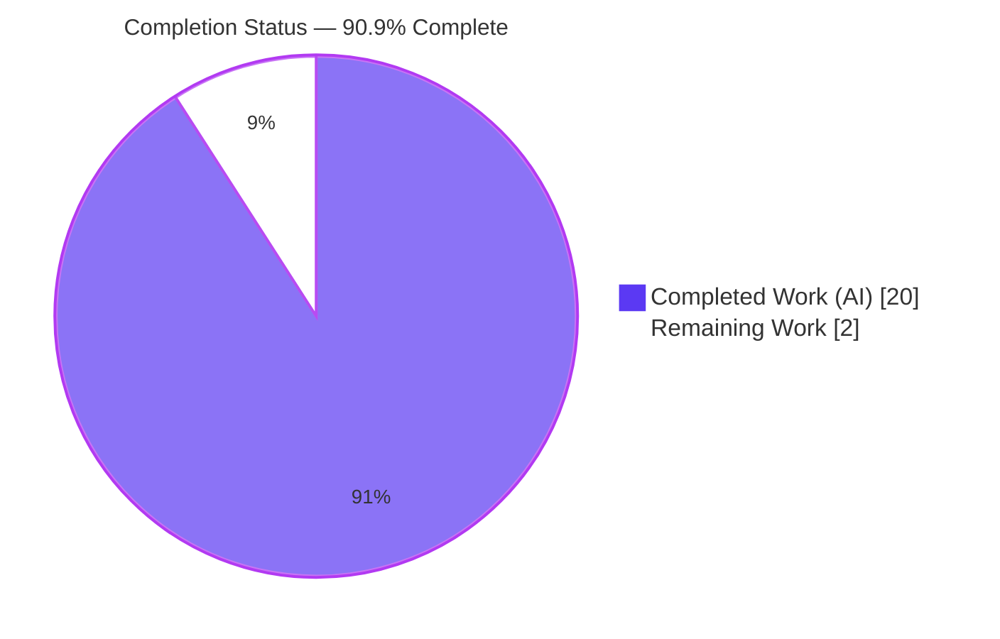
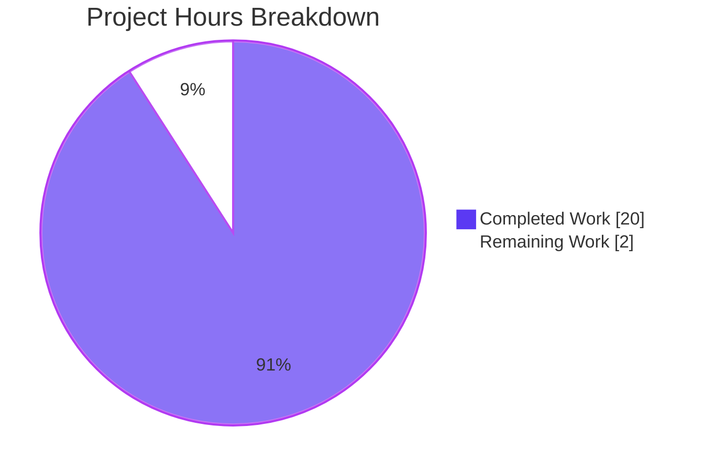
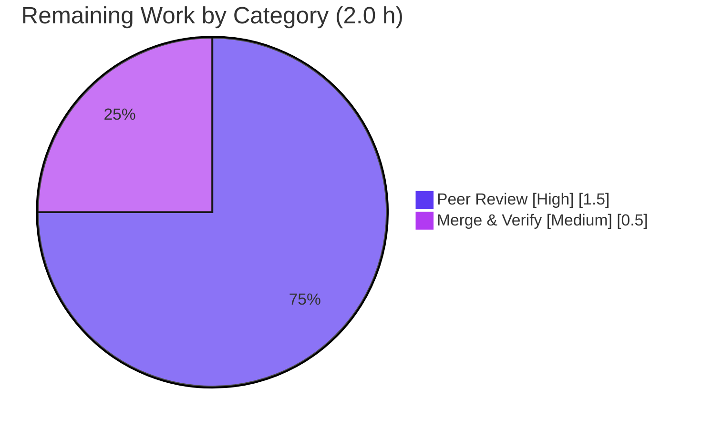

# Blitzy Project Guide — Scapy TCP Overlap/Retransmission Reassembly Investigation

> Read-only investigative Q&A documentation deliverable on `secdev/scapy`.
> Brand color legend — **Completed / AI Work: Dark Blue `#5B39F3`** · **Remaining / Not Completed: White `#FFFFFF`** · Headings/Accents: Violet-Black `#B23AF2` · Highlight: Mint `#A8FDD9`.

---

## 1. Executive Summary

### 1.1 Project Overview

This project answers, empirically and with code-level grounding, how Scapy's `TCPSession` reconstructs an application byte stream when TCP segments **overlap or retransmit**. The target users are Scapy maintainers, protocol/network engineers, and security analysts who need an authoritative, reproducible explanation of which bytes "win" in an overlap region. The technical scope is deliberately narrow and read-only: build minimal `IP/TCP/Raw` segments carrying one HTTP message whose body is written twice over the same sequence range, drive them through the canonical offline path `sniff(offline=…, session=TCPSession)`, observe the reconstructed bytes for two variants, and trace the observed policy to the exact `file:line` that implements it. The sole repository artifact is one Markdown answer document; **zero source files are modified**.

### 1.2 Completion Status

The project is **90.9% complete** on an AAP-scoped, hours-based basis. All autonomous (AI) work defined by the Agent Action Plan is finished and independently validated; the only remaining work is the path-to-production human gate (technical peer review + merge).



| Metric | Hours |
|--------|-------|
| **Total Hours** | 22.0 |
| **Completed Hours (AI + Manual)** | 20.0 (AI: 20.0 · Manual: 0.0) |
| **Remaining Hours** | 2.0 |
| **Percent Complete** | **90.9%** |

> Formula (PA1): Completion % = Completed ÷ (Completed + Remaining) = 20.0 ÷ (20.0 + 2.0) = 20 ÷ 22 = **90.9%**.

### 1.3 Key Accomplishments

- [x] **Core question answered and proven** — Scapy resolves overlapping/retransmitted segments by **UNCONDITIONAL OVERWRITE (last-writer-wins)**, traced to the single slice assignment `memoryview(self.content)[seq:seq + data_len] = data` at `scapy/sessions.py:193`.
- [x] **Two runtime variants captured verbatim** — identical-byte overlap → `AAAABBBBCCCC` (51 bytes); differing-byte overlap → `AAAAXXXXCCCC` (51 bytes, the later `XXXX` wins).
- [x] **Canonical offline path exercised** — `wrpcap` → `sniff(offline=…, session=TCPSession)`, mirroring the project's own test convention (`test/scapy/layers/http.uts:16`).
- [x] **All four candidate policies (accept / drop / merge / overwrite) named and adjudicated** against code + observed output.
- [x] **Determinism confirmed** across ≥2 runs (byte-identical output; matching SHA-256; unchanged-input proof).
- [x] **Read-only mandate honored** — exactly one new file added (`blitzy/documentation/scapy_0925ada48540.md`, 1,024 lines); zero source files touched; clean working tree.
- [x] **Independently re-validated during this assessment** — the reproduction was re-run through the canonical path; both variants reproduced byte-for-byte with `ALL ASSERTIONS PASSED`.

### 1.4 Critical Unresolved Issues

| Issue | Impact | Owner | ETA |
|-------|--------|-------|-----|
| _None._ Final Validation reported all five production-readiness gates PASS with zero unresolved errors and zero source modifications. | None | — | — |

### 1.5 Access Issues

| System/Resource | Type of Access | Issue Description | Resolution Status | Owner |
|-----------------|----------------|-------------------|-------------------|-------|
| — | — | No access issues identified. The repository is checked out locally, the deliverable is committed, and the reproduction requires no external services, credentials, or network access. | N/A | — |

**No access issues identified.**

### 1.6 Recommended Next Steps

1. **[High]** Technical peer review — have a Scapy-familiar SME read the answer document end-to-end, confirm the overwrite/last-writer-wins finding at `scapy/sessions.py:193`, and spot-check a sample of the `file:line` citations against the checkout.
2. **[Medium]** Approve & merge — approve the PR (optionally re-running `repro.py` once via `PYTHONPATH` to independently confirm both variants), then merge the branch into the target.
3. **[Low]** _(Optional, out of AAP scope — 0 h)_ If desired, open/track an upstream discussion referencing `secdev/scapy` Issue #4340 (TCPSession retransmission handling); re-verify citation line numbers if the vendored Scapy is ever bumped.

---

## 2. Project Hours Breakdown

### 2.1 Completed Work Detail

All completed work is autonomous (AI). Each component traces to a specific AAP requirement.

| Component | Hours | Description |
|-----------|-------|-------------|
| Reproduction design, scripts & canonical offline path (AAP R1–R3) | 4.5 | Built-in `IP/TCP/Raw` segments with a 4-byte overlap; `wrpcap` → `sniff(offline=…, session=TCPSession)`; purity constraints (no new `Packet`, no `bind_layers`, no `StringBuffer` import) via HTTP auto-binding. |
| Two overlap variants + verbatim capture + order-swap control (AAP R4) | 2.5 | Identical-byte (`AAAABBBBCCCC`) and differing-byte (`AAAAXXXXCCCC`) variants at len 51; non-canonical order-swap control (`XXXXCCCC`, len 8) establishing causality. |
| Source-code tracing + runtime call-path trace + citations (AAP R5) | 3.5 | 61 distinct `file:line` citations across 10 source files; `sys.settrace` branch trace; mermaid call-path diagram from `sniff` → `_process_packet` → `StringBuffer.append` → `sessions.py:193`. |
| Determinism / stability proof across ≥2 runs (AAP + Rules 0.7) | 1.5 | Gen-once/read-twice, `sha256sum` of transcripts, unchanged-input proof; byte-identical across runs. |
| Authoring the 1,024-line answer document (AAP 0.4) | 4.5 | Direct answer, 4-policy adjudication table, verbatim excerpts, length-invariance arithmetic, coverage pass; well-formed Markdown (22 balanced code-fence pairs). |
| Reassembly-path investigation + web-search validation + sibling enumeration | 1.5 | Traced the offline path end-to-end; validated the canonical convention; enumerated sibling `tcp_reassemble` protocols (TLS/DCE-RPC/Kerberos/PostgreSQL) for completeness. |
| Code-review resolution + final validation reproduction | 2.0 | 11 code-review findings addressed (commit `5aea433f`); every claim reproduced through the canonical entry point; all five validation gates PASS. |
| **Total** | **20.0** | Matches Completed Hours in Section 1.2. |

### 2.2 Remaining Work Detail

Each remaining item is a path-to-production human gate (no autonomous code work remains).

| Category | Hours | Priority |
|----------|-------|----------|
| Documentation Peer Review (technical accuracy + `file:line` citation spot-check) | 1.5 | High |
| Merge & Optional Re-run Verification (PR approval → optional `repro.py` re-run → merge) | 0.5 | Medium |
| **Total** | **2.0** | — |

> Validation: Section 2.1 (20.0) + Section 2.2 (2.0) = **22.0** = Total Hours (Section 1.2). Section 2.2 total (2.0) = Remaining Hours (Section 1.2) = Section 7 "Remaining Work".

### 2.3 Basis of Estimate

Estimates use the PA2 framework anchored to the AAP. This is a documentation/investigation task with no production code surface, so completed hours reflect investigative reproduction, source tracing, and technical writing; remaining hours reflect only the human review/merge gate. Confidence: **High** — scope is fully defined, the deliverable is complete and independently reproduced, and the validator reported zero defects.

---

## 3. Test Results

All tests below originate from Blitzy's autonomous validation logs for this project (the reproduction scripts and their assertions), plus one independent re-run performed during this assessment (explicitly labeled). Because this is a **read-only reproduction** rather than a unit-test suite, "Coverage %" denotes verification of documented claims (every behavioral/verbatim claim reproduced), not source line coverage.

| Test Category | Framework | Total Tests | Passed | Failed | Coverage % | Notes |
|---------------|-----------|-------------|--------|--------|-----------|-------|
| Reassembly Reproduction (`repro.py`) | Python `assert` (mirrors UTScapy `http.uts:16`) | 9 (3 cases × 3 assertions) | 9 | 0 | 100%* | IDENTICAL→`AAAABBBBCCCC`(51); DIFFERING→`AAAAXXXXCCCC`(51); ORDER-SWAP→`XXXXCCCC`(8); exact bytes+len+count. |
| Before/After Buffer State (`before_state.py`) | Python `assert` | 2 | 2 | 0 | 100%* | `seg1` alone completes `[]`; `seg1+seg2` completes `AAAAXXXXCCCC`. |
| Order-Swap Diagnostic (`swap_diag.py`) | Python read-only observer | 2 | 2 | 0 | 100%* | CALL#1 len 8 completed=True; CALL#2 len 47 completed=False. |
| Branch/Line Trace (`trace_http.py`) | `sys.settrace` | 3 | 3 | 0 | 100%* | `http.py:601` never runs; `:598` runs CALL#1; CALL#2 completes. |
| Determinism / Stability | Python + `sha256sum` + `diff` | 2 runs | 2 | 0 | 100%* | Byte-identical output; matching SHA-256; unchanged-input proof. |
| Compilation | `python -m compileall`, `py_compile` | scapy/ + 6 scripts | all | 0 | 100% | Exit 0 on host and canonical container. |
| Independent Re-run (this assessment) | Python `assert` (host Python 3.13.7) | 3 cases | 3 | 0 | 100%* | Reproduced byte-for-byte; `ALL ASSERTIONS PASSED`; stable across 2 runs (diff empty). |

* Coverage reflects verification of documented claims, not source-line coverage (read-only reproduction, not a unit-test suite).

**Aggregate:** every autonomous reproduction assertion and the independent re-run **PASS** (0 failures). Runtimes exercised: canonical container Python 3.11.13 and host Python 3.13.7 — reassembly output is identical across both.

---

## 4. Runtime Validation & UI Verification

**Runtime health (canonical offline path):**

- ✅ **Operational** — `sniff(offline="…pcap", session=TCPSession)` runs successfully (canonical container + host).
- ✅ **Operational** — In-repo Scapy loaded (`scapy.__file__` inside the checkout; `scapy.VERSION 2026.07.13`) via `PYTHONPATH`, not a site-packages/`/app` copy.
- ✅ **Operational** — Identical-byte variant reconstructs `AAAABBBBCCCC` (51 bytes).
- ✅ **Operational** — Differing-byte variant reconstructs `AAAAXXXXCCCC` (51 bytes; later `XXXX` wins).
- ✅ **Operational** — Non-canonical order-swap control reconstructs `XXXXCCCC` (8 bytes), demonstrating first-processed anchoring.
- ✅ **Operational** — Determinism confirmed across ≥2 runs (byte-identical; SHA-256 match).
- ✅ **Operational** — Repository left read-only (`git status --porcelain` empty after run + cleanup).

**API integration:** ✅ Operational — the built-in TCP:80/8080/8000 → HTTP binding routes the payload into `HTTP.tcp_reassemble` with no user `bind_layers` call.

**UI verification:** **Not applicable.** Scapy is a command-line/library package; this deliverable is a Markdown document. There is no web/GUI frontend in scope, so no screenshots, responsive checks, or visual-regression captures apply.

---

## 5. Compliance & Quality Review

AAP deliverables and the SWE-AtlasQnA rule set cross-mapped to status. Fixes applied during autonomous validation are noted.

| Benchmark / AAP Item | Requirement | Status | Notes |
|----------------------|-------------|--------|-------|
| R1 — Split/overlapping payload | Built-in layers only; ≥2 segments; ≥1 overlap | ✅ Pass | `IP/TCP/Raw`; 4-byte overlap at seq `S+43`. |
| R2 — Canonical offline path | `wrpcap` → `sniff(offline=, session=TCPSession)` | ✅ Pass | Mirrors `test/scapy/layers/http.uts:16`. |
| R3 — Demo purity | No new `Packet`; no `bind_layers`; no `StringBuffer` import | ✅ Pass | HTTP auto-binding; `StringBuffer` cited only. |
| R4 — Two variants + verbatim | Identical + differing; bytes, length, winner | ✅ Pass | `AAAABBBBCCCC` / `AAAAXXXXCCCC`, len 51. |
| R5 — Policy trace to code | `file:line` + WHY | ✅ Pass | 61 citations; traced to `sessions.py:193`. |
| R6 — Read-only repo + cleanup | No source edits; temp artifacts removed | ✅ Pass | Clean tree; only deliverable added. |
| Rule — Run-first methodology | Derive answer from observed output | ✅ Pass | Reproduction precedes prose. |
| Rule — Stability ≥2 runs | Confirm value stable | ✅ Pass | Byte-identical; SHA-256 match. |
| Rule — Canonical entry only | No mocks/bypasses; label non-canonical | ✅ Pass | Diagnostics labeled non-canonical. |
| Rule — Default build values | Version/banner from default config | ✅ Pass | `scapy.VERSION 2026.07.13` (mtime fallback, grounded). |
| Rule — Answer every named item | `StringBuffer`; accept/drop/merge/overwrite | ✅ Pass | Coverage pass adjudicates all four. |
| Rule — Exact & grounded | `file:line` for each code claim | ✅ Pass | All citations in-range at pinned commit. |
| Quality — Markdown well-formed | Valid fences/structure | ✅ Pass | 22 balanced code-fence pairs; mermaid diagram valid. |
| Quality — Compilation | Source + scripts compile | ✅ Pass | `compileall`/`py_compile` exit 0. |

**Fixes applied during autonomous validation:** 11 code-review findings resolved in commit `5aea433f` (doc-only refinements). **Outstanding:** human peer review + merge (Section 2.2). **In-scope code defects:** none — zero source modifications were required or made.

---

## 6. Risk Assessment

This is a read-only documentation deliverable: no source modified, no dependencies added, no runtime surface introduced. Overall risk posture is **Very Low** — no High or Critical risks.

| Risk | Category | Severity | Probability | Mitigation | Status |
|------|----------|----------|-------------|------------|--------|
| T1 — `file:line` citation drift if Scapy source is later refactored | Technical | Low | Medium | Citations pinned to commit `0925ada4`; source-filtered `git diff` empty (byte-identical at HEAD) | ✅ Mitigated |
| T2 — `scapy.VERSION 2026.07.13` misread as a release (it is an mtime date-fallback) | Technical | Low | Low | Doc §2 grounds it explicitly (`git describe` raises `ValueError`; fallback branch documented) | ✅ Mitigated |
| T3 — Overlap policy could change in a future Scapy release | Technical | Low | Low | Exact commit pinned; behavior confirmed on Python 3.11.13 and 3.13.7 | ✅ Mitigated |
| S1 — New attack surface / vulnerable dependency | Security | None | N/A | Read-only; no code added to source tree; zero dependency changes | ✅ N/A |
| O1 — Reproduction environment dependency (exact banner from canonical container) | Operational | Low | Low | Host cross-run confirmed; reassembly is version-independent | ✅ Mitigated |
| O2 — Monitoring / logging / health checks | Operational | None | N/A | Not applicable to a documentation artifact | ✅ N/A |
| I1 — Merge conflict | Integration | Low | Very Low | Isolated additive change: one new file in a new directory | ✅ Mitigated |
| I2 — External services / API keys / credentials | Integration | None | N/A | No integrations in scope | ✅ N/A |

> **Informational (not a risk introduced by this task):** the observed last-writer-wins overlap behavior is itself relevant to TCP-overlap IDS/IPS evasion and matches upstream `secdev/scapy` Issue #4340. This task **observes and explains** the behavior; changing it is explicitly out of scope (AAP 0.5.2).

---

## 7. Visual Project Status

Hours breakdown (Completed = Dark Blue `#5B39F3`, Remaining = White `#FFFFFF`):



Remaining hours by category (Section 2.2):



> **Integrity:** "Remaining Work" = **2** here = Remaining Hours (Section 1.2) = Section 2.2 total. "Completed Work" = **20** = Completed Hours (Section 1.2).

---

## 8. Summary & Recommendations

**Achievements.** The project delivers a rigorous, empirically-grounded answer to how Scapy's `TCPSession` reconstructs overlapping/retransmitted TCP byte streams. It proves — through the canonical offline path and byte-for-byte reproduction — that the policy is **unconditional overwrite (last-writer-wins)** at `scapy/sessions.py:193`, adjudicates all four candidate policies by name, captures both required variants verbatim (`AAAABBBBCCCC` and `AAAAXXXXCCCC`, 51 bytes each), demonstrates determinism across runs, and leaves the repository read-only (one file added, zero source changes).

**Remaining gaps.** None in autonomous scope. The only outstanding work is the path-to-production human gate: technical peer review (1.5 h) and merge (0.5 h) — **2.0 h total**.

**Critical path to production.** Peer review → optional independent re-run → PR approval → merge. No build, deployment, configuration, or integration steps are required (zero-dependency pure-Python core; documentation-only artifact).

**Success metrics.** All six AAP requirements PASS; all five validation gates PASS; every behavioral/verbatim claim reproduced (independently re-confirmed during this assessment); 100% of documented claims verified; 0 test failures; 0 source modifications.

**Production readiness.** The deliverable is **90.9% complete** and assessed **ready for human review and merge**. Confidence is High: scope is fully defined, evidence is reproducible, citations are commit-pinned and verified, and risk posture is Very Low.

| Metric | Value |
|--------|-------|
| AAP requirements satisfied | 6 / 6 |
| Validation gates passed | 5 / 5 |
| Test failures | 0 |
| Source files modified | 0 |
| Completion | 90.9% |
| Remaining effort | 2.0 h |

---

## 9. Development Guide

How to build, run, verify, and troubleshoot the reproduction. Every command below was tested during this assessment. Commands are copy-pasteable; run them from the repository root unless noted. All temporary artifacts are created **outside** the checkout (under `/tmp`) to preserve the read-only mandate.

### 9.1 System Prerequisites

- **Python** 3.7–3.13 (per `requires-python ">=3.7, <4"`). Verified on **3.13.7** (host) and **3.11.13** (canonical container).
- **Git** (verified 2.51.0) — for checkout and read-only verification.
- **Docker** — *optional*, only to reproduce the exact container banner via `ghcr.io/scaleapi/swe-atlas:swe_atlas_QnA_secdev_scapy_1.0`.
- **Third-party packages:** **none** — Scapy's core is a zero-dependency pure-Python library.

### 9.2 Environment Setup

```bash
# From the repository root:
cd /tmp/blitzy/scapy/blitzy-154f92d1-0885-4a7d-982d-731aea49d048_a0e523

# Confirm the source-branch commit the citations are pinned to:
git log -1 --format='%H %s' 0925ada485406684174d6f068dbd85c4154657b3

# Exercise the IN-REPO Scapy (not a site-packages copy) via PYTHONPATH:
PYTHONPATH="$(pwd)" python3 -c "import scapy, sys; \
print('python', sys.version.split()[0]); \
print('scapy.VERSION', scapy.VERSION); \
print('scapy.__file__', scapy.__file__)"
# Expect: scapy.__file__ points INSIDE this checkout; scapy.VERSION 2026.07.13
```

*Optional* isolated environment (no pip needed — zero-dependency core):

```bash
python3 -m venv --without-pip /tmp/scapy_venv
PYTHONPATH="$(pwd)" /tmp/scapy_venv/bin/python -c "import scapy; print(scapy.VERSION)"
rm -rf /tmp/scapy_venv
```

### 9.3 Dependency Installation

**None required.** `pyproject.toml` declares no mandatory runtime dependencies. Do **not** `pip install` anything for the offline reassembly path.

### 9.4 Run the Reproduction

Write the script **outside** the repo, then run it against the in-repo Scapy:

```bash
mkdir -p /tmp/scapy_qna_repro
cat > /tmp/scapy_qna_repro/repro_min.py <<'PYEOF'
from scapy.layers.inet import IP, TCP
from scapy.packet import Raw
from scapy.utils import wrpcap
from scapy.sendrecv import sniff
from scapy.sessions import TCPSession
import scapy.layers.http           # built-in TCP:80 -> HTTP binding (no bind_layers)
from scapy.compat import raw

HEADERS = b"HTTP/1.1 200 OK\r\nContent-Length: 12\r\n\r\n"
S = 1000

def build(overlap, path):
    seg1 = IP(src="10.0.0.1", dst="10.0.0.2")/TCP(sport=1234, dport=80, seq=S,    flags="A")/Raw(load=HEADERS + b"AAAA" + b"BBBB")
    seg2 = IP(src="10.0.0.1", dst="10.0.0.2")/TCP(sport=1234, dport=80, seq=S+43, flags="A")/Raw(load=overlap + b"CCCC")
    wrpcap(path, [seg1, seg2])     # ascending-seq (seg1 first) = canonical order

def run(path):
    out = []
    for p in sniff(offline=path, session=TCPSession):
        if p.haslayer("HTTP"):
            out.append(raw(p["HTTP"]))
    return out[-1] if out else b""

P = "/tmp/scapy_qna_repro/x.pcap"
build(b"BBBB", P); ident = run(P)
build(b"XXXX", P); diff = run(P)
print("IDENTICAL:", ident, "len", len(ident))
print("DIFFERING:", diff, "len", len(diff))
assert ident.endswith(b"AAAABBBBCCCC") and len(ident) == 51
assert diff.endswith(b"AAAAXXXXCCCC")  and len(diff)  == 51
print("VERIFIED: last-writer-wins (XXXX overwrote BBBB); both 51 bytes")
PYEOF

PYTHONPATH="$(pwd)" python3 /tmp/scapy_qna_repro/repro_min.py
```

### 9.5 Verification Steps

Expected output:

```text
IDENTICAL: b'HTTP/1.1 200 OK\r\nContent-Length: 12\r\n\r\nAAAABBBBCCCC' len 51
DIFFERING: b'HTTP/1.1 200 OK\r\nContent-Length: 12\r\n\r\nAAAAXXXXCCCC' len 51
VERIFIED: last-writer-wins (XXXX overwrote BBBB); both 51 bytes
```

Confirm the repository is untouched, then clean up:

```bash
git status --porcelain        # expect EMPTY (repo unmodified)
rm -rf /tmp/scapy_qna_repro    # remove temp artifacts (outside the repo)
git status --porcelain        # still EMPTY
```

### 9.6 Example Usage — Order-Swap Control (non-canonical)

Feeding the higher-sequence segment first anchors the buffer to the wrong origin and yields a short, non-canonical result (`b'XXXXCCCC'`, len 8) — demonstrating first-processed anchoring (`scapy/sessions.py:340`). Order segments ascending-by-sequence for the canonical demonstration.

### 9.7 Troubleshooting

- **`scapy.__file__` points outside the checkout** → `PYTHONPATH` is unset or a site-packages copy shadows it. Re-export `PYTHONPATH="$(pwd)"` from the repo root.
- **Reconstructed body is empty (`b''`)** → segments were processed higher-sequence-first (relative-seq mis-anchored). Order them ascending-by-sequence (`seg1` first).
- **`CryptographyDeprecationWarning` (TripleDES, `ipsec.py:573/577`)** → you imported `scapy.all`. Use direct submodule imports (as in `repro_min.py`) to keep the run warning-free.
- **`venv` fails with an `ensurepip` error** → use `python3 -m venv --without-pip` (the zero-dependency core needs no pip).

---

## 10. Appendices

### A. Command Reference

| Command | Purpose |
|---------|---------|
| `PYTHONPATH="$(pwd)" python3 -c "import scapy; print(scapy.VERSION, scapy.__file__)"` | Prove in-repo Scapy + version banner |
| `PYTHONPATH="$(pwd)" python3 /tmp/scapy_qna_repro/repro_min.py` | Run the two-variant reproduction |
| `git status --porcelain` | Confirm read-only (empty = clean) |
| `git diff --name-status 0925ada4 HEAD` | Show the single added file |
| `python -m compileall scapy/` | Compile-check the source tree |
| `grep -c '^\`\`\`' blitzy/documentation/scapy_0925ada48540.md` | Check Markdown fence balance (44 = 22 pairs) |
| `rm -rf /tmp/scapy_qna_repro` | Remove temp artifacts |

### B. Port Reference

| Port | Protocol | Role |
|------|----------|------|
| 80 / 8080 / 8000 (TCP) | HTTP | Built-in binding routes the TCP payload into `HTTP` dissection/`tcp_reassemble` (no user `bind_layers`). Used as the TCP destination port in the reproduction segments. |

_No network listeners are opened; the offline path reads a pcap from disk._

### C. Key File Locations

| Path | Role |
|------|------|
| `blitzy/documentation/scapy_0925ada48540.md` | **The deliverable** (1,024 lines) — the answer document |
| `scapy/sessions.py` | `StringBuffer` (:161), `append` (:179), **overwrite** (:193), `TCPSession` (:223), `_process_packet` (:286) |
| `scapy/layers/http.py` | `HTTP.tcp_reassemble` (:580) — surfaces reconstructed bytes |
| `scapy/layers/inet.py` | `IP` (:521) / `TCP` (:753) field definitions |
| `scapy/utils.py` | `wrpcap` (:1095) / `PcapReader` (:1367) offline round-trip |
| `scapy/sendrecv.py` | `sniff` (:1308) offline entry point |
| `scapy/compat.py` | `raw()` (:112) byte extraction |
| `test/scapy/layers/http.uts` | Canonical convention reference (:16) |

### D. Technology Versions

| Component | Version | Source |
|-----------|---------|--------|
| Python (host) | 3.13.7 | Verified in this assessment |
| Python (canonical container) | 3.11.13 | Deliverable banner |
| Scapy (`scapy.VERSION`) | 2026.07.13 | mtime date-fallback (grounded in doc §2) |
| Git | 2.51.0 | Verified |
| Source-branch commit (citation pin) | `0925ada485406684174d6f068dbd85c4154657b3` | `git log` |
| Workspace HEAD | `5aea433f0d53b0087c0083211cb2cac3bfdf3d81` | `git rev-parse HEAD` |

### E. Environment Variable Reference

| Variable | Value | Purpose |
|----------|-------|---------|
| `PYTHONPATH` | `<repository root>` | Force use of the in-repo Scapy (matches cited code) |
| `SCAPY_VERSION` | _(unset)_ | If set, overrides `scapy.VERSION`; intentionally unset so the default build value surfaces |

### F. Developer Tools Guide

- **Reproduction scripts** (created under `/tmp`, outside the repo): `repro.py` (two variants + order-swap), `before_state.py` (buffer state), `swap_diag.py` (order-swap diagnostic), `trace_http.py` (`sys.settrace` branch trace), plus a gen/read stability harness.
- **Static checks:** `python -m py_compile <script>`; `python -m compileall scapy/`.
- **Read-only verification:** `git status --porcelain` (must be empty); `git diff --name-status 0925ada4 HEAD` (must show only the deliverable).
- **Determinism:** run twice and `diff` the transcripts; `sha256sum` to confirm byte-identical output.

### G. Glossary

| Term | Definition |
|------|------------|
| **TCPSession** | Scapy session object that reassembles TCP streams for protocols implementing `tcp_reassemble` (`scapy/sessions.py:223`). |
| **StringBuffer** | Internal per-direction reorder buffer inside `TCPSession` (`scapy/sessions.py:161`); its `append` performs the decisive overwrite at `:193`. |
| **Overwrite / last-writer-wins** | Overlap policy where the later-processed fragment's bytes replace the same sequence-relative offset — no compare/drop/merge. |
| **`tcp_reassemble`** | Per-protocol classmethod that surfaces reassembled bytes; `HTTP` provides the built-in one used here. |
| **Canonical offline path** | `wrpcap` → `sniff(offline=…, session=TCPSession)` — the documented, tested reassembly entry point. |
| **Overlap / retransmission** | Two TCP segments covering the same sequence range; the investigation's subject. |
| **Relative-seq anchor** | Buffer offsets are anchored to the first-processed packet (`scapy/sessions.py:340`), making reconstruction sensitive to processing order. |

---

*Generated by the Blitzy Platform. Completion is measured on AAP-scoped work only: **90.9%** (20.0 of 22.0 hours). Brand colors — Completed `#5B39F3`, Remaining `#FFFFFF`.*