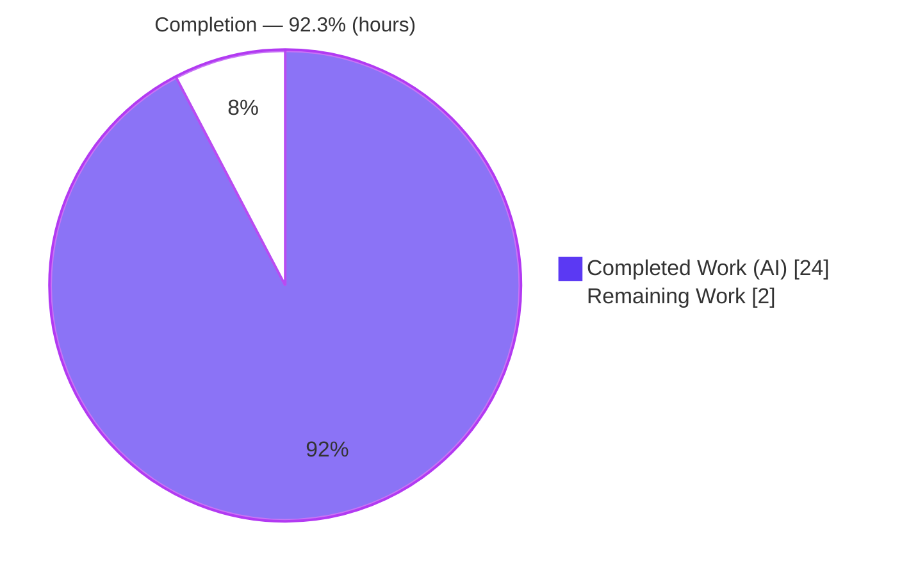
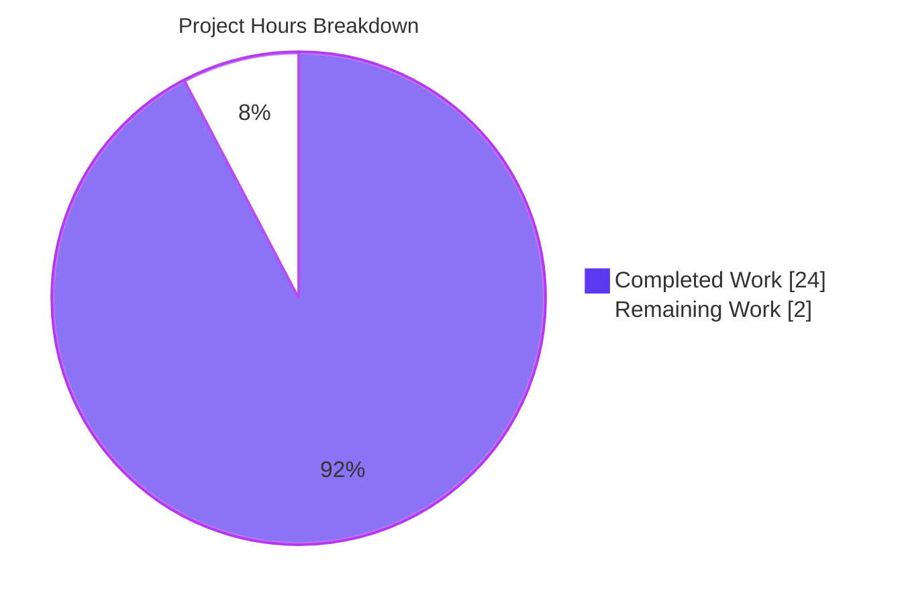
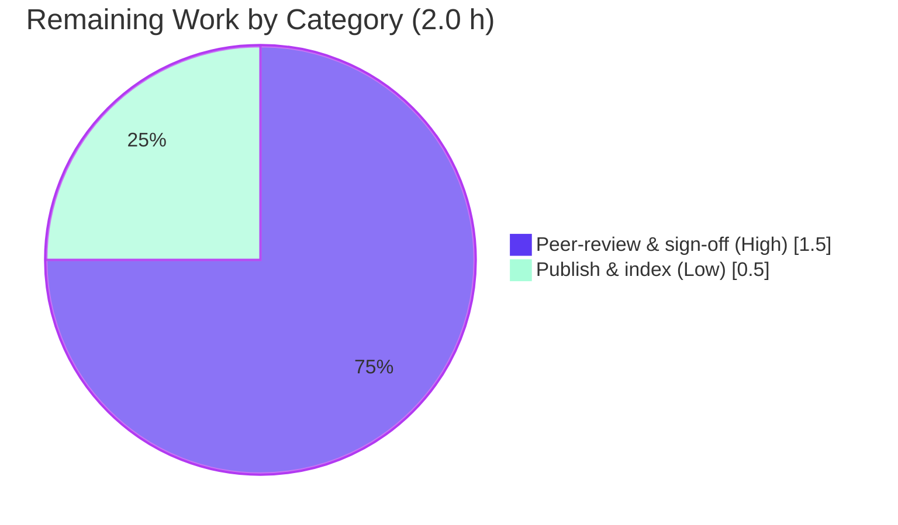

# Blitzy Project Guide — Scapy Runtime-Grounded Onboarding Investigation

> **Scope note:** This project is a **read-only, documentation-only** engagement against the Scapy
> packet-manipulation library at baseline commit `0925ada4`. The sole authored deliverable is one
> markdown artifact — `blitzy/documentation/scapy_0925ada48540.md` — answering six onboarding
> questions (O1–O6), with every factual claim grounded in **observed runtime behavior** and backed by
> an exact `file:line` citation. Completion percentage reflects **only** AAP-scoped work plus the
> path-to-production required to disseminate this knowledge artifact.

---

## 1. Executive Summary

### 1.1 Project Overview

This engagement produces a single runtime-grounded onboarding document that explains how a specific
Scapy checkout (commit `0925ada4`) actually behaves. It answers six questions for an engineer new to
this build: how the interactive shell starts and what version it reports; which IP-header fields are
auto-populated when crafting an `IP()/ICMP()` echo request; what happens at the network layer when a
crafted ICMP packet is sent to `127.0.0.1`; how Scapy constructs the default IP header in source; and
how many tests exist with their pass/fail summary — all while modifying **zero** source files. The
target user is a Scapy onboarding engineer; the impact is faster, evidence-based ramp-up; the technical
scope spans the packet engine, TCP/IP layers, send/route path, console, and test tooling.

### 1.2 Completion Status

The project is **92.3% complete** on an AAP-scoped, hours-based basis. All eight AAP-specified
requirements (objectives O1–O6, document authoring, and citation grounding) plus the satisfied runtime
baseline are fully delivered and independently validated with zero edits required. The remaining 2
hours are the human path-to-production for a knowledge artifact: peer-review sign-off and publication.



| Metric | Value |
|---|---|
| **Total Hours** | **26.0 h** |
| **Completed Hours (AI + Manual)** | **24.0 h** (24.0 AI + 0.0 Manual) |
| **Remaining Hours** | **2.0 h** |
| **Percent Complete** | **92.3%** |

> Color legend — **Completed = Dark Blue `#5B39F3`**, **Remaining = White `#FFFFFF`**.
> Formula: `Completed / (Completed + Remaining) = 24 / (24 + 2) = 24 / 26 = 92.3%`.

### 1.3 Key Accomplishments

- ✅ **O1 — Shell & version:** `./run_scapy` launched in default configuration; banner and running
  version `2026.07.14` captured and explained via the `_version()` four-method resolution chain
  (mtime fallback), verified at runtime (`conf.version = 2026.07.14`).
- ✅ **O2 — ICMP echo & auto-population:** `IP()/ICMP()` constructed; every auto-populated IP field
  mapped to its declaration/computation in a per-field origin table; `.show()` vs `.show2()`
  reproduced byte-identically (`ihl=5`, `len=28`, IP `chksum=0x7cde`).
- ✅ **O3 — Send to localhost:** dual-socket behavior observed — default `L3PacketSocket` returns
  `None` (0 answers) on `lo`, while `L3RawSocket` returns one ICMP `echo-reply` — with route and
  socket selection cited.
- ✅ **O4 — Default IP construction:** cause→effect source walkthrough of the
  `build()→do_build()→self_build()→post_build()` pipeline, `IP.post_build`, `bind_layers` protocol
  resolution, and `SourceIPField` routing.
- ✅ **O5 — Test suite:** canonical UTScapy campaign run **twice** with byte-identical results —
  **190 campaigns, 5017 tests, 4678 passed, 339 failed** — plus the 193→190 file-vs-campaign
  reconciliation.
- ✅ **O6 — Read-only & cleanup:** temporary scripts kept outside the tree and removed; stray
  artifacts deleted; `git status --porcelain` empty.
- ✅ **Grounding & QA:** 132 `file:line` citations across 20 files (0 missing / 0 out-of-bounds);
  two QA acceptance-gate correction passes applied; deliverable independently re-validated at 100%
  accuracy.

### 1.4 Critical Unresolved Issues

| Issue | Impact | Owner | ETA |
|---|---|---|---|
| _None within AAP scope._ All six objectives are delivered and independently validated. | No blocking issues to release the deliverable. | — | — |
| (Context only) 339 UTScapy failures exist in this environment | **None on the deliverable** — these are the documented *subject* of O5 and are explicitly out of scope for remediation (AAP §0.3.2). | Scapy maintainers / future task | N/A (out of scope) |

### 1.5 Access Issues

**No access issues identified.** All work was performed against a local checkout at the provided
working directory; the repository is writable for the single authored artifact, the Scapy source is
readable for reference, the Python runtime is present, and elevated privileges required for the O3
raw-socket send were available. No repository permissions, service credentials, or third-party API
access were needed or blocked.

| System/Resource | Type of Access | Issue Description | Resolution Status | Owner |
|---|---|---|---|---|
| Git repository (working tree) | Read/Write (deliverable only) | None | ✅ Resolved / N/A | — |
| Scapy source tree | Read-only (reference) | None | ✅ Resolved / N/A | — |
| Loopback raw socket (O3) | Elevated privilege | None — privilege available | ✅ Resolved / N/A | — |

### 1.6 Recommended Next Steps

1. **[High]** Peer-review the deliverable for technical accuracy and completeness (all six objectives,
   observed-vs-inferred labeling, citation sampling). — *1.0 h*
2. **[High]** Spot-verify reproducibility of one or two key observations in the reviewer's environment
   (`./run_scapy` version/banner; `IP()/ICMP()` `.show2()` computed fields). — *0.5 h*
3. **[Medium]** Publish and index the document (link from `README`/onboarding wiki) so new engineers
   can discover it. — *0.5 h*
4. **[Low]** *(Out of scope — optional future work)* If a fully-green test suite is later desired,
   open a **separate** task to triage the 339 environmental failures. This is explicitly excluded from
   the current AAP and from all hour totals.

---

## 2. Project Hours Breakdown

### 2.1 Completed Work Detail

Every completed component traces to a specific AAP requirement (R1–R9). Hours reflect the effort a
skilled engineer would invest to produce the observed, validated result.

| Component | Hours | Description |
|---|---:|---|
| Environment & runtime baseline `[R9]` | 1.0 | Confirm Python 3.13.7 within `>=3.7,<4`; verify `import scapy` health; note optional deps (cryptography present; IPython/PyX absent). |
| O1 — Shell startup + version resolution `[R1]` | 2.5 | Launch `./run_scapy`; capture banner + `Version 2026.07.14`; trace and explain the `_version()` four-method chain ending in the mtime fallback. |
| O2 — ICMP echo + IP auto-population `[R2]` | 3.0 | Build `IP()/ICMP()`; capture `repr`/`.show()`/`.show2()`/raw hex; build the per-field origin table; cover ICMP defaults (Conditional/MultipleType fields). |
| O3 — Send-to-localhost dual-socket `[R3]` | 3.0 | Transmit to `127.0.0.1` under default `L3PacketSocket` (0 answers) and `L3RawSocket` (1 echo-reply); explain route + socket selection (root required). |
| O4 — Default IP-header construction `[R4]` | 2.5 | Source-level cause→effect trace: build pipeline, `IP.post_build`, `bind_layers` protocol number, `SourceIPField` routing. |
| O5 — Test-suite execution ×2 `[R5]` | 3.0 | Run canonical UTScapy campaign twice (5017 tests); confirm stability; reconcile 193→190; characterize the 20 failing campaigns. |
| O6 — Read-only hygiene & cleanup `[R6]` | 1.5 | Observe via scripts outside the tree; remove temp scripts + stray `RMBA_dump.hex`; verify `git status --porcelain` empty. |
| Document authoring & assembly `[R7]` | 4.0 | Write the 1074-line markdown: per-objective structure, unedited output blocks, tables, flowchart, coverage recap. |
| Citation grounding + QA corrections `[R8]` | 3.5 | Produce and verify 132 `file:line` citations across 20 files; apply two QA acceptance-gate correction passes. |
| **Total Completed** | **24.0** | **Matches Completed Hours in §1.2.** |

### 2.2 Remaining Work Detail

Each remaining category is genuine path-to-production for a knowledge artifact.

| Category | Hours | Priority |
|---|---:|---|
| Documentation peer-review & technical-accuracy sign-off `[R10]` | 1.5 | High |
| Knowledge-base publication & onboarding-index integration `[R11]` | 0.5 | Low |
| **Total Remaining** | **2.0** | — |

> **Integrity check:** §2.1 (24.0) + §2.2 (2.0) = **26.0 h** = Total Hours in §1.2. Remaining 2.0 h
> equals §1.2 Remaining and the §7 pie "Remaining Work" value.
>
> **Excluded (out of scope, 0 h):** remediation of the 339 UTScapy failures — see §1.4 / §1.6.

### 2.3 Basis of Estimate

Hours are engineering-effort estimates for the observed, validated result (not wall-clock). Completed
hours are anchored to concrete artifacts: a 1074-line document, 132 verified citations across 20 files,
two full 5017-test suite runs, dual-socket packet transmission, and three doc-only commits. Remaining
hours cover only the human acceptance and dissemination of a finished knowledge artifact. Confidence is
**High** for completed work (independently re-validated, zero edits) and **High** for remaining work
(well-defined, low-complexity review/publish steps).

---

## 3. Test Results

All tests below originate from **Blitzy's autonomous validation logs** for this project. The in-scope
deliverable is a markdown document with **no tests of its own**; however, Blitzy autonomously executed
the Scapy UTScapy suite as the direct subject of objective **O5**, and ran deliverable-validation
checks (citation integrity + observation reproduction) across both the implementation and final
validation phases.

| Test Category | Framework | Total Tests | Passed | Failed | Coverage % | Notes |
|---|---|---:|---:|---:|---:|---|
| Scapy unit/integration suite (O5 subject) | UTScapy | 5017 | 4678 | 339 | n/a | Canonical `linux.utsc` campaign; run **twice**, byte-identical (190 campaigns). The 339 failures are the documented, out-of-scope subject. |
| Citation integrity check | Blitzy programmatic bounds-check | 132 | 132 | 0 | 100% | 132 unique `file:line` citations across 20 files; 0 missing files, 0 out-of-bounds ranges. |
| Observation reproduction (O1–O5) | Blitzy runtime re-execution | 5 | 5 | 0 | 100% | Each objective's observations reproduced exactly (banner/version, packet hex, dual-socket send, source probes, test totals). |
| **Aggregate** | — | **5154** | **4815** | **339** | — | 339 failures are pre-existing/environmental Scapy tests, **not** defects in the in-scope deliverable. |

**On the 339 failures (why in-scope validation is 100%):** they are pre-existing and environmental —
a missing optional `mock` module, `cryptography 43.x` TLS-API differences (cert/tls/tls13/sslv2 ≈ 193),
network/interface-dependent campaigns (isotp, pipetool, answering machines), plus one order-dependent
in-code UDS dissection error. AAP §0.3.2 explicitly scopes their remediation **out**. The deliverable's
job is to *report* this summary accurately — which it does, verified exactly (4678 / 339) and stable
across two runs.

---

## 4. Runtime Validation & UI Verification

There is **no web/graphical UI** in scope; runtime validation covers the CLI console and the library's
observed packet behavior. All checks below were reproduced during autonomous validation.

**Console / runtime health**
- ✅ **Operational** — `./run_scapy` launches an interactive console (banner + `Version 2026.07.14`).
- ✅ **Operational** — `python3 -m scapy` resolves via `scapy/__main__.py`; console entry point
  `scapy = scapy.main:interact` is importable and callable.
- ✅ **Operational** — `import scapy.all` exits 0; `conf.version = 2026.07.14`.

**Packet-construction behavior (O2/O4)**
- ✅ **Operational** — `IP()/ICMP()` builds; `.show()` shows auto fields as `None`; `.show2()` resolves
  `ihl=5`, `len=28`, IP `chksum=0x7cde`, ICMP `chksum=0xf7ff` (byte-identical to the document).
- ✅ **Operational** — `proto` resolves to `1` via the `IP`/`ICMP` binding; `src`/`dst` resolve to
  `127.0.0.1` via routing.

**Network-layer behavior (O3)**
- ✅ **Operational** — `L3RawSocket` path: one matched ICMP `echo-reply`
  (`IP / ICMP 127.0.0.1 > 127.0.0.1 echo-reply 0`).
- ⚠ **Partial (documented behavior, not a defect)** — default `L3PacketSocket` on `lo`: transmit
  succeeds but **0 answers matched** (`sr1` returns `None`). This is the expected pre-2.6.0 loopback
  behavior and is precisely the contrast O3 documents.

**API-integration outcomes**
- ✅ **Operational** — no external services/APIs are involved; loopback routing resolves over `lo`.

---

## 5. Compliance & Quality Review

The matrix cross-maps AAP deliverables and the five governing rules to Blitzy quality benchmarks,
including fixes applied during autonomous validation.

| Benchmark / Requirement | Target | Status | Progress | Notes |
|---|---|---|---|---|
| Deliverable created at mandated path | `blitzy/documentation/scapy_0925ada48540.md` | ✅ Pass | 100% | 1074 lines; committed at HEAD `39aa44fd`. |
| Read-only mandate (Rule 5 / O6) | Zero source modifications | ✅ Pass | 100% | Source-scoped diff (exclude `blitzy/**`) empty; `git status` clean. |
| Run-first, observe-then-write (Rule 1) | Values from runtime, not reading | ✅ Pass | 100% | Version/banner/packet/send/test totals all captured before assertion. |
| Two-run stability for counts (Rule 1) | Confirm across ≥2 runs | ✅ Pass | 100% | Test totals byte-identical across two full runs. |
| Exhaustive condition coverage (Rule 2) | Happy + edge paths | ✅ Pass | 100% | `.show()` vs `.show2()`; `L3PacketSocket` vs `L3RawSocket`. |
| Observed-vs-inferred labeling (Rule 3) | Distinct labeling | ✅ Pass | 100% | Behavioral claims paired with output; code-read claims labeled *inferred*. |
| Complete, grounded answering (Rule 4) | Every part + `file:line` | ✅ Pass | 100% | 132 citations across 20 files; 0 missing / 0 out-of-bounds. |
| Temp-script hygiene (Rule 5 / O6) | Remove all temp artifacts | ✅ Pass | 100% | Scripts in `/tmp`; stray `RMBA_dump.hex` removed. |
| Version reported as observed (Rule 1) | No engineered value | ✅ Pass | 100% | `2026.07.14` reported as the mtime fallback, with resolution chain explained. |
| **Fixes applied during validation** | Resolve QA findings | ✅ Pass | 100% | Two acceptance-gate passes (commits `e5715f52`, `39aa44fd`): O1 hash example corrected, O6 reframed to commit-count-invariant proofs, "No names found" claim corrected. |
| Documentation peer-review sign-off | Human acceptance | ⬜ Pending | 0% | Path-to-production (§2.2, 1.5 h). |
| Publication / discoverability | Linked from onboarding index | ⬜ Pending | 0% | Path-to-production (§2.2, 0.5 h). |

---

## 6. Risk Assessment

No High or Critical risks exist. The residual items are Low-severity and largely already mitigated by
the document's design (explicit observed-vs-inferred labeling, recorded commands/environment, and
out-of-scope declarations).

| Risk | Category | Severity | Probability | Mitigation | Status |
|---|---|---|---|---|---|
| Reported version `2026.07.14` is an mtime fallback, not a release tag; could be misread as a semantic version | Technical | Low | Medium | Doc leads with the observed value plus the full `_version()` resolution chain and a flowchart, explicitly labeled a fallback | Mitigated (documented) |
| O3 echo-reply matching requires root **and** `L3RawSocket` on loopback; re-runs without root or on Scapy ≥2.6.0 differ | Technical | Low | Medium | Both sockets exercised; 2.6.0 behavior change cited; privilege requirement stated | Mitigated (documented) |
| 339 UTScapy failures indicate the checkout is not fully green in this environment | Technical | Low | High | Reported and characterized in O5; remediation explicitly out of scope (AAP §0.3.2) | Accepted (out of scope) |
| Raw-socket transmission (O3) needs elevated privileges | Security | Low | Low | Behavior reported, not worked around; no privilege change persisted | Mitigated (documented) |
| No secrets / credentials / auth / PII involved | Security | Negligible | Low | Pure documentation task; nothing sensitive handled | N/A |
| Observed values are environment-specific (Python 3.13.7, cryptography 43.0.0, IPython/PyX absent) | Operational | Low | Medium | Exact commands and environment recorded; observed-vs-inferred labeling | Mitigated (documented) |
| Deliverable not yet linked from onboarding index/README (discoverability gap) | Operational | Low | Medium | Publish & index during path-to-production (R11, 0.5 h) | Open (remaining task) |
| `cryptography` must remain `<48` to preserve the documented TLS-campaign baseline | Integration | Low | Low | No dependency changes made; constraint noted for reviewers | Mitigated (documented) |
| Deliverable is standalone markdown with no importers | Integration | Negligible | Low | Producing it changes no runtime behavior; zero code-integration risk | N/A |

---

## 7. Visual Project Status



> **Color legend:** Completed = Dark Blue `#5B39F3` · Remaining = White `#FFFFFF`.
> **Integrity:** "Remaining Work" = **2 h**, identical to §1.2 Remaining Hours and the §2.2 total.

**Remaining hours by category (§2.2)**



**Priority distribution of remaining human tasks**

| Priority | Tasks | Hours |
|---|---|---:|
| High | Peer-review + reproducibility spot-check | 1.5 |
| Medium/Low | Publish & index | 0.5 |
| **Total** | | **2.0** |

---

## 8. Summary & Recommendations

**Achievements.** The engagement delivered a single, high-fidelity onboarding artifact that answers all
six questions from **observed runtime behavior**, not from reading alone. Every behavioral claim is
paired with unedited output and an exact `file:line` citation (132 citations across 20 files). The
document reproduces the shell banner and version, the `IP()/ICMP()` field auto-population (before and
after serialization), the dual-socket loopback send contrast, the source-level IP-construction
walkthrough, and the full test summary (190 campaigns / 5017 tests / 4678 passed / 339 failed, stable
across two runs). Independent re-validation found the deliverable **100% accurate with zero edits
required**, and the read-only mandate was fully honored (clean working tree; source-scoped diff empty).

**Remaining gaps & critical path to production.** The project is **92.3% complete** (24 of 26 hours).
The only remaining work is the human path-to-production for a knowledge artifact: **peer-review
sign-off (1.5 h)** and **publication/indexing (0.5 h)**. Critical path: review → sign-off → publish.

**Explicitly out of scope.** Remediating the 339 environmental test failures is **not** part of this
AAP (§0.3.2); fixing them would require editing out-of-scope Scapy source and would *falsify* the O5
report. They are correctly reported, not repaired, and carry **zero** hours in these totals.

**Success metrics.**

| Metric | Result |
|---|---|
| AAP objectives delivered | 6 of 6 (O1–O6) |
| Citation integrity | 132/132 resolve (0 errors) |
| Observation reproduction | O1–O5 reproduced exactly |
| Test-count stability | Identical across 2 runs |
| Read-only compliance | `git status` clean; 0 source changes |
| AAP-scoped completion | **92.3%** |

**Production-readiness assessment.** **Ready for human review.** The autonomous deliverable is
complete, accurate, and validated; only lightweight human acceptance and publication remain before the
document is production-ready as an onboarding reference.

---

## 9. Development Guide

How to reproduce every observation in the deliverable. All commands were tested during validation and
exit `0`. Run them from the repository root.

### 9.1 System Prerequisites

- **OS:** Linux (loopback interface with `PF_PACKET`/`PF_INET` raw sockets).
- **Python:** `>=3.7, <4` (`pyproject.toml:L17`). Validated on **Python 3.13.7**.
- **Git:** to inspect state / verify the clean tree.
- **Privileges:** root/`sudo` **only** for the O3 raw-socket send; all other steps run unprivileged.
- **Mandatory dependencies:** none (Scapy runs from source on Linux with zero required packages).
- **Optional dependencies:** `cryptography` (present, `43.0.0`, keep `<48`) enables TLS/IPsec layers;
  `IPython`/`PyX` are absent (yielding the standard console and the "Can't import PyX" notice).

### 9.2 Environment Setup

```bash
# From the repository root. run_scapy sets PYTHONPATH automatically; for ad-hoc
# python3 sessions, set it yourself:
export PYTHONPATH="$PWD"

# (Optional) create an isolated venv for optional extras. On Ubuntu 25 (PEP 668),
# prefer a venv or pass --break-system-packages for global installs.
python3 -m venv .venv && source .venv/bin/activate     # optional
```

### 9.3 Dependency Installation

```bash
# No installation is required to run Scapy from source. Optional extras only:
pip install "cryptography<48"        # inside a venv; enables TLS/IPsec layers
# Global (system Python, Ubuntu 25):
# pip install --break-system-packages "cryptography<48"
```

### 9.4 Application Startup

```bash
# O1 — launch the interactive Scapy console (canonical, default configuration):
./run_scapy
# Non-interactive banner + version capture (ANSI stripped):
printf 'exit()\n' | ./run_scapy 2>&1 | sed 's/\x1b\[[0-9;]*m//g'
# Expected: "Welcome to Scapy", "Version 2026.07.14",
#           "Can't import PyX...", "IPython not available...".
```

### 9.5 Verification Steps

```bash
# Version + packet auto-population (O2/O4):
PYTHONPATH=. python3 - <<'PY'
from scapy.all import IP, ICMP, conf
p = IP()/ICMP()
p2 = p.__class__(bytes(p))            # re-dissect to resolve auto fields (== .show2())
print("version       :", conf.version)      # 2026.07.14
print("proto         :", p2.proto)          # 1  (from bind_layers(IP, ICMP, proto=1))
print("ihl/len/chksum:", p2.ihl, p2.len, hex(p2[IP].chksum))  # 5 28 0x7cde
PY

# Read-only compliance (O6):
git status --porcelain      # expect EMPTY output (clean tree)
```

### 9.6 Example Usage

```bash
# O3 — send a crafted ICMP echo-request to localhost (requires root).
# Default socket returns None on loopback; L3RawSocket returns one echo-reply:
sudo PYTHONPATH=. python3 - <<'PY'
from scapy.all import IP, ICMP, sr1, conf
from scapy.supersocket import L3RawSocket
print("default L3socket:", sr1(IP(dst="127.0.0.1")/ICMP(), timeout=2, verbose=0))  # None
conf.L3socket = L3RawSocket
ans = sr1(IP(dst="127.0.0.1")/ICMP(), timeout=2, verbose=0)
print("L3RawSocket    :", ans.summary() if ans else None)
# -> IP / ICMP 127.0.0.1 > 127.0.0.1 echo-reply 0
PY

# O5 — run the canonical test suite (minutes; -b is REQUIRED as linux.utsc sets breakfailed:true):
PYTHONPATH=. python3 -m scapy.tools.UTscapy -c test/configs/linux.utsc -N -b
# Aggregate observed: 190 campaigns, 5017 tests, 4678 PASSED, 339 FAILED (stable across runs).
```

### 9.7 Troubleshooting / Common Errors

| Symptom | Cause | Resolution |
|---|---|---|
| `error: externally-managed-environment` on `pip install` | Ubuntu 25 PEP 668 marker on system Python | Use a venv, or add `--break-system-packages`. |
| `sr1(...)` returns `None` for `127.0.0.1` | Default `L3PacketSocket` matches no answer on `lo` (pre-2.6.0) | Set `conf.L3socket = L3RawSocket` (run as root). |
| Test run stops at the first failing campaign | `linux.utsc` sets `breakfailed: true` | Add the `-b` flag to the UTScapy invocation. |
| Version shows a **date** (`2026.07.14`), not a semver | No git tags / no `VERSION` file → `_version()` mtime fallback | Expected in this checkout; set `SCAPY_VERSION` to override (do **not** for canonical runs). |
| Stray `RMBA_dump.hex` appears after tests | Emitted by a contrib automotive campaign | Delete it to restore a clean tree (`rm -f RMBA_dump.hex`). |
| `ModuleNotFoundError: scapy` in a plain `python3` | `PYTHONPATH` not set | `export PYTHONPATH="$PWD"` or use `./run_scapy`. |

---

## 10. Appendices

### Appendix A — Command Reference

| Purpose | Command |
|---|---|
| Launch console (O1) | `./run_scapy` |
| Banner + version, non-interactive | See §9.4 — non-interactive banner capture (piped through `run_scapy` and `sed`) |
| Import + version check | `PYTHONPATH=. python3 -c "from scapy.config import conf; print(conf.version)"` |
| Build packet + computed fields (O2/O4) | `PYTHONPATH=. python3` → `p=IP()/ICMP(); p.__class__(bytes(p)).show()` |
| Send to localhost (O3, root) | `sudo PYTHONPATH=. python3` → `sr1(IP(dst="127.0.0.1")/ICMP())` |
| Run test suite (O5) | `PYTHONPATH=. python3 -m scapy.tools.UTscapy -c test/configs/linux.utsc -N -b` |
| Test-runner help | `PYTHONPATH=. python3 -m scapy.tools.UTscapy -h` |
| Verify clean tree (O6) | `git status --porcelain` |

### Appendix B — Port Reference

No listening network ports are opened by this project. O3 uses the **loopback interface** (`lo`,
`127.0.0.1`) with raw ICMP (no TCP/UDP port). No server is started.

### Appendix C — Key File Locations

| Path | Role |
|---|---|
| `blitzy/documentation/scapy_0925ada48540.md` | **The sole authored deliverable** (1074 lines) |
| `scapy/__init__.py` (`_version` @ L122–L172) | Version resolution chain (O1) |
| `scapy/main.py` (`interact`, `the_banner`) | Console entry + banner (O1) |
| `run_scapy` | Canonical launcher (sets `PYTHONPATH`, runs `python3 -m scapy`) |
| `scapy/layers/inet.py` (`IP`/`ICMP`, `post_build`, `bind_layers`) | IP/ICMP fields & construction (O2/O4) |
| `scapy/packet.py` (`build`/`post_build`, `show`/`show2`) | Build pipeline & rendering (O2/O4) |
| `scapy/fields.py` (`SourceIPField` @ L854–L877) | `src` resolution via routing (O4) |
| `scapy/sendrecv.py`, `scapy/route.py`, `scapy/supersocket.py` | Send / route / socket selection (O3) |
| `scapy/tools/UTscapy.py`, `test/configs/linux.utsc` | Test runner & canonical campaign (O5) |

### Appendix D — Technology Versions

| Component | Version | Notes |
|---|---|---|
| Python | 3.13.7 | Within `requires-python ">=3.7, <4"` |
| Scapy (this checkout) | `2026.07.14` | mtime fallback of `_version()` (not a release tag) |
| cryptography | 43.0.0 | Optional; must remain `<48` for the documented baseline |
| IPython | not installed | Forces standard Python console |
| PyX | not installed | Produces the "Can't import PyX" notice |
| Test framework | UTScapy (Scapy's own) | Not pytest/unittest |

### Appendix E — Environment Variable Reference

| Variable | Purpose | Used here |
|---|---|---|
| `PYTHONPATH` | Make the checkout importable | Set to repo root (by `run_scapy` or manually) |
| `SCAPY_VERSION` | Override the reported version | **Unset** (canonical runs report the fallback as observed) |
| `PYTHON` | Override the interpreter for `run_scapy` | Optional; defaults to `python3` |

### Appendix F — Developer Tools Guide

- **Interactive console:** `./run_scapy` (standard Python shell here; IPython would enhance it if
  installed).
- **Test runner (UTScapy):** key flags — `-c <config.utsc>` (load campaign set), `-N` (force
  non-root), `-b` (don't stop at the first failed campaign), `-k`/`-K` (keyword include/exclude),
  `-f HTML -o out.html` (HTML report). Reports each campaign as `PASSED=X FAILED=Y` with a CRC/SHA.
- **Read-only verification:** `git status --porcelain` (expect empty); `git diff <baseline>..HEAD
  --name-status` (expect only the deliverable added).

### Appendix G — Glossary

| Term | Meaning |
|---|---|
| **AAP** | Agent Action Plan — the governing requirements for this task. |
| **Objective (O1–O6)** | The six onboarding questions answered by the deliverable. |
| **`_version()` mtime fallback** | When no git tag / `VERSION` file exists, Scapy derives the version from `__init__.py`'s modification date (`2026.07.14`). |
| **`.show()` vs `.show2()`** | `.show()` renders the packet as authored (auto fields `None`); `.show2()` re-dissects the serialized bytes so computed fields (`ihl`/`len`/`chksum`) appear. |
| **`post_build`** | The serialization hook where `IP` fills auto (`None`) fields — `ihl`, `len`, `chksum`. |
| **`bind_layers`** | Declares layer relationships; supplies the overloaded `proto=1` for ICMP payloads. |
| **`L3PacketSocket` / `L3RawSocket`** | Layer-3 sockets; on loopback the former matches no answer while the latter matches the echo-reply. |
| **UTScapy campaign** | A `.uts` test file executed by Scapy's own runner; reported as `PASSED=X FAILED=Y`. |
| **Observed vs inferred** | "Observed" = shown by captured runtime output; "inferred" = concluded from reading source. |
