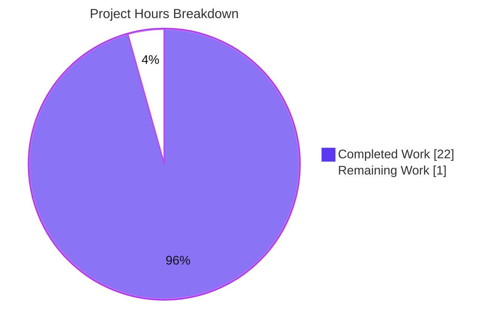
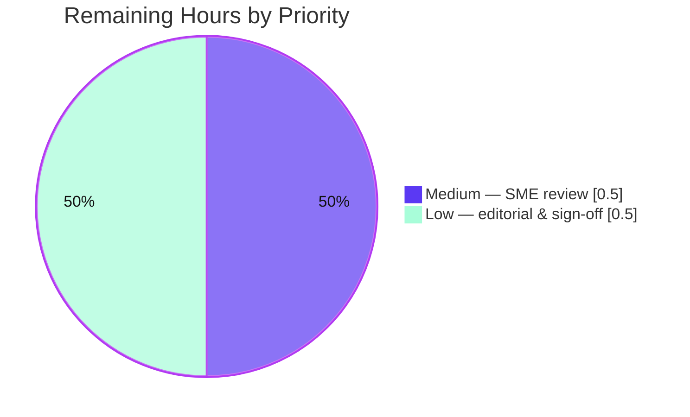

# Blitzy Project Guide — Scapy Ethernet Frame Construction Investigation (Q&A)

> **Deliverable:** `blitzy/documentation/scapy_0925ada48540.md` · **Branch:** `blitzy-9f3abc8d-389b-462b-bf19-752b2fc20218` · **HEAD:** `ccc2a235` · **Base:** `0925ada4`
> **Task type:** Read-only source investigation + documentation (SWE-AtlasQnA-Repo)

---

## Section 1 — Executive Summary

### 1.1 Project Overview

This project investigated — through direct runtime observation of the `secdev/scapy` codebase — exactly how Scapy handles Ethernet frame construction, focusing on minimum-frame **padding** and **EtherType** protocol dispatch. The audience is a developer confused by Scapy's frame-building behavior. The deliverable is a single evidence-based markdown answer document that builds three named packets, answers four behavioral questions and three code-investigation questions, and grounds every code claim in `file:line` citations. Business impact: it resolves a recurring point of confusion (the `Padding` vs `Raw` distinction; the absence of auto-padding on `raw()`) with reproducible evidence, while leaving the Scapy repository byte-for-byte unchanged under a strict read-only mandate.

### 1.2 Completion Status

**Project Completion — 95.7%**


*Legend: **Completed = Dark Blue `#5B39F3`**, **Remaining = White `#FFFFFF`** (violet-black `#B23AF2` outline for visibility).*

| Metric | Value |
|--------|-------|
| **Total Hours** | 23.0 |
| **Completed Hours (AI + Manual)** | 22.0 (AI 22.0 + Manual 0.0) |
| **Remaining Hours** | 1.0 |
| **Percent Complete** | **95.7%** |

*Calculation (PA1, AAP-scoped): 22.0 ÷ (22.0 + 1.0) × 100 = **95.7%**.*

### 1.3 Key Accomplishments

- [x] Authored the single required deliverable `blitzy/documentation/scapy_0925ada48540.md` (1,058 lines, 7 sections) — the only file added on the branch.
- [x] Built all three named packets via the real layering API: **P1** `Ether()/IP()/TCP()` (len 54), **P2** `Ether()/IP()/TCP()/Raw(b"A"*10)` (len 64), **P3** `Ether(type=0x9000)/Raw(b"hello")` (len 19).
- [x] Answered **Q1–Q4** from captured runtime output: no auto-padding on `raw()`; `Padding` vs `Raw` round-trip semantics; unknown EtherType → `Raw`; no padding threshold.
- [x] Answered **Q5–Q7** with grounded code walkthrough (67 `file:line` citations across 12 source files, all verified accurate at HEAD).
- [x] Established a **run-first evidence base**: a probe (26 behavioral assertions) and sweep (18 length assertions) embedded and executed; sweep stable byte-for-byte across two runs.
- [x] Confirmed **Docker canonical-image parity** (`swe_atlas_QnA_secdev_scapy_1.0`, Python 3.11.13) — identical behavioral output.
- [x] Preserved **read-only integrity**: no Scapy source modified; `git status --porcelain` empty; all temporary scripts confined to `/tmp` and removed via a failure-safe `trap … EXIT`.
- [x] Surfaced the counter-intuitive finding that `0x9000` is Scapy's **own default** `Ether.type`.

### 1.4 Critical Unresolved Issues

| Issue | Impact | Owner | ETA |
|-------|--------|-------|-----|
| *None identified* | — | — | — |

No unresolved issues block release or validation. All 44 runtime assertions pass; all citations verified; repository read-only integrity preserved.

### 1.5 Access Issues

| System / Resource | Type of Access | Issue Description | Resolution Status | Owner |
|-------------------|----------------|-------------------|-------------------|-------|
| *None identified* | — | — | — | — |

**No access issues identified.** The investigation ran fully offline against the local checkout; the canonical Docker image was exercised with `--network none`. No repository permissions, service credentials, or third-party API access were required.

### 1.6 Recommended Next Steps

1. **[Medium]** SME technical review of the answer document — confirm the Scapy explanations (especially the `Padding` vs `Raw` crux and the Q1 off-path caveats) and spot-check a sample of the 67 `file:line` citations against HEAD `ccc2a235`.
2. **[Low]** Optionally re-run the embedded probe (26 assertions) and sweep (18 assertions) to independently confirm the runtime signal (commands in Section 9).
3. **[Low]** Editorial/readability pass and acceptance/merge sign-off of `blitzy/documentation/scapy_0925ada48540.md`.

---

## Section 2 — Project Hours Breakdown

### 2.1 Completed Work Detail

| Component | Hours | Description |
|-----------|-------|-------------|
| Canonical runtime setup & version/invocation capture | 1.0 | Import Scapy in-place (default config); record `scapy.__version__`, `sys.executable`, exact `python3` invocation, HEAD/branch. |
| P1/P2/P3 packet construction & output capture | 1.5 | Build the three named frames via the real `/` layering API; capture `repr`, `len(raw(...))`, and layer lists. |
| Q1 — auto-pad behavioral investigation | 1.0 | Measure `len(raw(...))` vs the 60-byte floor; IEEE 802.3 background; document off-path min-frame padding caveats. |
| Q2 — round-trip `Padding`-vs-`Raw` investigation | 2.5 | Round-trip via `Ether(raw(...))`; contrast short-payload (`Raw`) with genuine trailing bytes (`Padding` survives, len→60). The crux of the confusion. |
| Q3 — unknown-EtherType print investigation | 1.0 | Build/round-trip `Ether(type=0x9000)/Raw(...)`; capture the class rendered after the Ethernet header (`Raw`). |
| Q4 — payload-size sweep (twice, tabulated) | 1.5 | Sweep payload sizes; tabulate bare (14+n) and full (54+n); confirm no discontinuity; run twice for stability. |
| Q5 — padding-decision code grounding | 1.0 | Cite `build_padding`/`extract_padding`/`dissect`/`Padding` in `packet.py`; cite off-path padding in `arch/linux.py` and `contrib/ethercat.py`. |
| Q6 — next-protocol dispatch code grounding | 1.5 | Cite `Ether.dispatch_hook`, `guess_payload_class`, and the `bind_layers` registrations for IP/IPv6. |
| Q7 — unrecognized-protocol fallback grounding | 1.5 | Cite `default_payload_class`→`conf.raw_layer`, `do_dissect_payload` fallback, and `conf.debug_dissector` gating. |
| Probe + sweep assertion scripts authoring | 1.5 | Author 44 fail-fast assertions (probe 26 + sweep 18) with `check()`→`sys.exit(1)` semantics. |
| Answer document authoring (1,058 lines) | 4.0 | Write the 7-section markdown Q&A with embedded transcripts, code excerpts, and coverage checklist. |
| Docker canonical-image parity verification | 1.0 | Re-run probe + sweep inside `swe_atlas_QnA_secdev_scapy_1.0` (Python 3.11.13); confirm byte-identical behavior. |
| QA / code-review finding resolution (4 commits) | 2.0 | Resolve probe self-count precision, excerpt/integrity precision, and 4 QA acceptance findings across commits. |
| Final validation & read-only integrity verification | 1.0 | Re-run 26+18 assertions (local + Docker), re-verify 67 citations, confirm clean tree and temp cleanup. |
| **Total** | **22.0** | **Sum of completed AAP-scoped work (matches Section 1.2 Completed Hours).** |

### 2.2 Remaining Work Detail

| Category | Hours | Priority |
|----------|-------|----------|
| SME technical review + `file:line` citation spot-check + optional probe/sweep re-run | 0.5 | Medium |
| Editorial/readability review & acceptance/merge sign-off | 0.5 | Low |
| **Total** | **1.0** | **— (matches Section 1.2 Remaining Hours and Section 7 pie chart)** |

There is **no deploy / CI / configuration path-to-production** for a static markdown artifact; "production" here means a reviewed, accepted, and merged answer document. All remaining work is human review/acceptance.

### 2.3 Hours Reconciliation & Methodology

- **Total Project Hours** = Completed (22.0) + Remaining (1.0) = **23.0**.
- **Completion %** = Completed ÷ Total × 100 = 22.0 ÷ 23.0 × 100 = **95.7%** (PA1, AAP-scoped hours).
- **Cross-section lock:** Remaining Hours = **1.0** identically in Section 1.2, Section 2.2 total, and the Section 7 pie chart; Section 2.1 (22.0) + Section 2.2 (1.0) = 23.0 = Section 1.2 Total.
- Per RG2, autonomous completion is not reported as 100%; the 1.0h reservation reflects mandatory human review/acceptance.

---

## Section 3 — Test Results

For this read-only Q&A task, the "test" signal is Blitzy's autonomous **runtime assertion suite** embedded in the deliverable and executed during validation. All entries below originate from Blitzy's autonomous validation logs and were independently reproduced.

| Test Category | Framework | Total Tests | Passed | Failed | Coverage % | Notes |
|---------------|-----------|-------------|--------|--------|------------|-------|
| Behavioral assertions (probe) | Custom fail-fast Python asserts (`check()`→`sys.exit(1)`) | 26 | 26 | 0 | N/A* | P1–P3 lengths/layers/bytes, Q1 bare=14+n, Q2 `Padding`-vs-`Raw`, Q3 unknown→`Raw`, `ETHER_TYPES` lookups. |
| Length/threshold assertions (sweep) | Custom fail-fast Python asserts | 18 | 18 | 0 | N/A* | Q4 no-threshold: bare=14+n and full=54+n across the payload sweep; stable byte-for-byte across 2 runs. |
| Docker canonical-image parity | Same probe + sweep in `swe_atlas_QnA_secdev_scapy_1.0` (Python 3.11.13) | 44† | 44 | 0 | N/A* | The same 44 assertions reproduced byte-identically inside the canonical image (`--network none`). |
| **Total (unique assertions)** | — | **44** | **44** | **0** | — | **100% pass rate; stable across 2 runs and across local (3.13.7) + Docker (3.11.13).** |

\* **Coverage N/A** — this is a read-only task; **0 source lines were added or modified**, so code coverage is not meaningful. *Claim coverage* is 100%: every named packet (P1–P3), question (Q1–Q7), the `0x9000` highlight, and the warnings note is backed by an executed assertion and/or a verified citation.
† Docker row re-runs the same 44 assertions (not additive to the unique total).

**Negative control:** the assertions are non-vacuous — deliberately corrupting an expected value makes the probe exit non-zero with `ASSERTION FAILED`, confirming the pass signal is real.

---

## Section 4 — Runtime Validation & UI Verification

**Runtime health**
- ✅ **Operational** — Scapy imports in-place from the checkout in its default configuration (`scapy.__version__` = `2026.07.10`, resolving to the checkout's `scapy/__init__.py`).
- ✅ **Operational** — Probe exits `0`: `PROBE: all 26 behavioral assertions passed`.
- ✅ **Operational** — Sweep exits `0`: `SWEEP: all 18 length assertions passed`; stdout byte-identical across two runs.
- ✅ **Operational** — Docker canonical-image parity (Python 3.11.13): probe 26/26 + sweep 18/18, behavioral output byte-identical to local.
- ✅ **Operational** — Read-only integrity: `git status --porcelain` empty; `git diff 0925ada4..HEAD --name-status` = single added document.
- ⚠ **Partial (cosmetic)** — Import emits a `CryptographyDeprecationWarning` (TripleDES) and a broadcast-MAC resolution notice; both are environment-dependent, unrelated to padding/dispatch, and documented honestly in the deliverable.

**API / integration verification**
- **N/A** — No external APIs, services, credentials, or network access are used (the canonical Docker run is `--network none`).

**UI verification**
- **N/A** — Scapy is a terminal/library packet-manipulation tool with **no graphical user interface**; there is no UI surface for this deliverable. The only "interface" exercised is the Python console used for investigation.

---

## Section 5 — Compliance & Quality Review

Cross-map of AAP deliverables and the `SWE-AtlasQnA-Repo` rule set to their validation status. Fixes applied during autonomous validation are noted; there are no outstanding items.

| Benchmark / AAP Requirement | Expectation | Status | Progress | Notes |
|-----------------------------|-------------|--------|----------|-------|
| Deliverable location & naming | Branch-named `.md` under `blitzy/documentation/` | ✅ Pass | 100% | `scapy_0925ada48540.md` present and committed. |
| P1–P3 packet builds | 3 named frames via real layering API | ✅ Pass | 100% | Lengths 54/64/19 reproduced. |
| Q1–Q4 behavioral answers | Derived from captured runtime output | ✅ Pass | 100% | Backed by 44 runtime assertions. |
| Q5–Q7 code answers | `file:line` grounding to enclosing function | ✅ Pass | 100% | 67 citations across 12 files, verified at HEAD. |
| Run-first methodology | Evidence captured before writing | ✅ Pass | 100% | Probe/sweep transcripts embedded verbatim. |
| Scale + stability (≥2 runs) | Threshold measurement stable | ✅ Pass | 100% | Sweep byte-identical ×2 (local + Docker). |
| Canonical entry points | No mocks / debug hooks / monkeypatching | ✅ Pass | 100% | Real `raw()` / `Ether(raw(...))` only. |
| Version + invocation recorded | Exact commands + version string | ✅ Pass | 100% | Documented in the deliverable's Section 2. |
| Complete unedited output | Full transcript per claim | ✅ Pass | 100% | Embedded beside each answer. |
| Answer-every-named + coverage | P1–P3, Q1–Q7, examples | ✅ Pass | 100% | Coverage checklist marks every item `[x]`. |
| Read-only integrity | No source modified; temp scripts removed | ✅ Pass | 100% | `git status` clean; `trap … EXIT` cleanup (final scratch count 0). |
| Web-search background | IEEE 802.3 min-frame framing | ✅ Pass | 100% | Summarized in the Q1 background. |

**Fixes applied during autonomous validation:** probe assertion self-count precision, excerpt/integrity precision, and 4 QA acceptance findings — resolved across the 4 branch commits. **Outstanding compliance items:** none.

---

## Section 6 — Risk Assessment

Overall posture is **Low** for a completed, independently validated, read-only documentation artifact.

| Risk | Category | Severity | Probability | Mitigation | Status |
|------|----------|----------|-------------|------------|--------|
| `scapy.__version__` is date-derived and can differ run-to-run | Technical | Low | Medium | Version derivation documented; the field is masked in parity comparison; every byte-count/dispatch result is version-independent | Mitigated |
| `file:line` citations could drift if upstream Scapy source changes | Technical | Low | Low | Citations explicitly pinned to HEAD `ccc2a235`; source frozen (read-only) | Accepted |
| Python-version behavioral difference | Technical | Low | Low | Validated on Python 3.11 (Docker) and 3.13 (local); pure-Python, version-independent logic | Mitigated |
| Read-only doc introduces no code/deps/secrets/attack surface | Security | Informational | N/A | No source, dependencies, or credentials added; import-time crypto warning is a pre-existing optional-dep cosmetic notice, not introduced here | N/A |
| Reader environment lacks `cryptography`, so the documented import warning won't appear | Operational | Low | Low | Deliverable flags all warnings as environment-dependent and cosmetic | Mitigated |
| No service to deploy / monitor | Operational | N/A | N/A | Static markdown artifact; nothing to operate | N/A |
| No external services / APIs / network dependencies | Integration | N/A | N/A | Investigation ran offline (Docker `--network none`) | N/A |

---

## Section 7 — Visual Project Status

**Hours breakdown (Completed vs Remaining)** — *Completed = Dark Blue `#5B39F3`, Remaining = White `#FFFFFF`.*



**Remaining work by priority (hours, from Section 2.2)**



*Integrity: the pie chart's **"Remaining Work" = 1** hour equals Section 1.2 Remaining Hours and the sum of the Section 2.2 "Hours" column (0.5 + 0.5 = 1.0).*

---

## Section 8 — Summary & Recommendations

**Achievements.** The project delivered exactly what the AAP scoped: a single, comprehensive, evidence-backed markdown answer document (`blitzy/documentation/scapy_0925ada48540.md`, 1,058 lines) that explains Scapy's Ethernet frame construction behavior. Every named packet (P1–P3) and question (Q1–Q7) is answered from captured runtime output, grounded in 67 verified `file:line` citations. The headline findings are correct and independently reproduced: `raw()` performs no minimum-frame padding (short frames stay `header + payload`); the `Padding` layer models genuine trailing bytes and survives re-serialization while a short TCP payload is plain `Raw`; an unknown EtherType renders as `Raw` with neither error nor guessing; and there is no padding "threshold." A memorable detail — `0x9000` is Scapy's own default `Ether.type` — is surfaced explicitly.

**Remaining gaps.** None functional. The project is **95.7% complete**; the outstanding 1.0 hour is human SME review and acceptance/merge sign-off — inherent to any deliverable and not a defect.

**Critical path to production.** For a documentation artifact, the path is short: (1) SME technical review + citation spot-check (optionally re-run the probe/sweep), then (2) editorial pass and merge. No build, deployment, configuration, or integration is required.

**Success metrics.** 44/44 runtime assertions pass (26 probe + 18 sweep), stable across two runs and across two Python versions (local 3.13.7, Docker 3.11.13); 67/67 sampled/verified citations accurate at HEAD; read-only integrity preserved (single added file, clean tree).

**Production-readiness assessment.** **Ready pending human sign-off.** The deliverable is accurate, complete, reproducible, and compliant with the strict read-only mandate; zero unresolved issues and zero access issues remain.

| Metric | Value |
|--------|-------|
| Completion | 95.7% |
| Completed / Remaining / Total hours | 22.0 / 1.0 / 23.0 |
| Runtime assertions (probe + sweep) | 44 / 44 passed |
| Verified `file:line` citations | 67 |
| Files changed on branch | 1 (added) |
| Critical / access issues | 0 / 0 |

---

## Section 9 — Development Guide

All commands below were executed against this checkout and confirmed working.

### 9.1 System Prerequisites

- **OS:** Linux/macOS/Windows (developed and validated on Linux, Ubuntu 25.10 container).
- **Python:** 3.7–3.13 supported by the pure-Python code paths. Local validation used **3.13.7**; the canonical Docker image uses **3.11.13**. (`tox.ini` names up to `py311`; `pyproject.toml` `requires-python = ">=3.7, <4"`.)
- **Tooling:** `git` (+ `git-lfs`); optionally Docker for canonical-image parity.
- **Build step:** none — Scapy runs in-place; no compilation required.

### 9.2 Environment Setup

No virtual environment is strictly required (pure-Python, run in-place). Run from the repository root:

```bash
# Canonical run posture (avoids writing .pyc into the read-only checkout; resolves import in-place)
export PYTHONDONTWRITEBYTECODE=1
export PYTHONPATH="$PWD"
```

### 9.3 Dependency Installation

No dependencies are required to build `Ether`/`IP`/`TCP`. The optional `cryptography` package (if present) only produces a cosmetic import-time deprecation warning. If you want an editable install for convenience (not needed for this Q&A):

```bash
python3 -m venv .venv && . .venv/bin/activate
pip install -e .        # optional; not required for the read-only investigation
```

### 9.4 Run / Verification Sequence

```bash
# 1) Confirm Python
python3 --version                                   # -> Python 3.13.7 (or your local 3.x)

# 2) Confirm Scapy imports in-place from the checkout
PYTHONDONTWRITEBYTECODE=1 PYTHONPATH="$PWD" \
  python3 -c "import scapy; print(scapy.__version__, scapy.__file__)"
# -> 2026.07.10 /…/scapy/__init__.py  (version is date-derived; value may differ)

# 3) Build the three packets (expect 54 / 64 / 19)
PYTHONDONTWRITEBYTECODE=1 PYTHONPATH="$PWD" python3 - <<'PY'
from scapy.all import Ether, IP, TCP, Raw, raw
print("P1", len(raw(Ether()/IP()/TCP())))                 # 54
print("P2", len(raw(Ether()/IP()/TCP()/Raw(b"A"*10))))    # 64
print("P3", len(raw(Ether(type=0x9000)/Raw(b"hello"))))   # 19
PY

# 4) Reproduce the runtime signal (scripts embedded in the deliverable; copy to /tmp)
PYTHONDONTWRITEBYTECODE=1 PYTHONPATH="$PWD" python3 /tmp/scapy_probe.py   # exit 0: PROBE: all 26 behavioral assertions passed
PYTHONDONTWRITEBYTECODE=1 PYTHONPATH="$PWD" python3 /tmp/scapy_sweep.py   # exit 0: SWEEP: all 18 length assertions passed
```

**Canonical Docker parity (optional):**

```bash
docker run --rm --network none \
  -v "$PWD":/work:ro -v /tmp:/qa:ro -w /qa \
  --entrypoint bash ghcr.io/scaleapi/swe-atlas:swe_atlas_QnA_secdev_scapy_1.0 -lc \
  'PYTHONDONTWRITEBYTECODE=1 PYTHONPATH=/work python3 /qa/scapy_probe.py'
```

### 9.5 Read-Only Integrity Verification

```bash
git status --porcelain                         # (empty) = clean tree
git diff 0925ada4..HEAD --name-status          # A  blitzy/documentation/scapy_0925ada48540.md
git diff 0925ada4..HEAD -- scapy/              # (empty) = no source touched
```

### 9.6 Example Usage

```bash
PYTHONDONTWRITEBYTECODE=1 PYTHONPATH="$PWD" python3 - <<'PY'
from scapy.all import Ether, IP, TCP, Raw, raw
p = Ether()/IP()/TCP()/Raw(b"A"*10)
print("len:", len(raw(p)))          # 64 — no min-frame padding
Ether(raw(p)).show()                # round-trips to Ether/IP/TCP/Raw (NO Padding)
# genuine trailing bytes -> Padding that survives re-serialization
wp = Ether(raw(Ether()/IP()/TCP()) + b"\x00"*6)
print("trailing:", [c.__name__ for c in wp.layers()], "re-serialized:", len(raw(wp)))  # …Padding, 60
PY
```

### 9.7 Troubleshooting

- **`import scapy` resolves to the wrong install** → ensure `PYTHONPATH` points at the checkout and run from a neutral directory. Inside the canonical image (which ships its own Scapy at `/app`), mount the checkout at `/work` and set `PYTHONPATH=/work`.
- **`__pycache__/*.pyc` appears in the checkout** → set `PYTHONDONTWRITEBYTECODE=1`.
- **`scapy.__version__` differs run-to-run** → expected; it is derived from `scapy/__init__.py`'s mtime (no `VERSION` file/tags). It does not affect any byte-count or dispatch result.
- **`CryptographyDeprecationWarning` on import** → cosmetic optional-dependency warning, unrelated to padding/dispatch.

---

## Section 10 — Appendices

### A. Command Reference

| Purpose | Command |
|---------|---------|
| Import Scapy in-place | `PYTHONPATH="$PWD" python3 -c "import scapy; print(scapy.__version__)"` |
| Build P1/P2/P3 | see Section 9.4 step 3 |
| Run probe (26 assertions) | `PYTHONPATH="$PWD" python3 /tmp/scapy_probe.py` |
| Run sweep (18 assertions) | `PYTHONPATH="$PWD" python3 /tmp/scapy_sweep.py` |
| Docker parity | see Section 9.4 |
| Clean-tree check | `git status --porcelain` |
| Scope diff vs base | `git diff 0925ada4..HEAD --name-status` |

### B. Port Reference

**None.** No network ports are used. The investigation is entirely in-memory/offline; the canonical Docker run uses `--network none`.

### C. Key File Locations

| Path | Role |
|------|------|
| `blitzy/documentation/scapy_0925ada48540.md` | **The deliverable** (Q&A answer document, 1,058 lines) |
| `scapy/packet.py` | Reference — build/dissect/padding/guess machinery, `Raw`/`Padding` (Q5/Q7) |
| `scapy/layers/l2.py` | Reference — `Ether`, `dispatch_hook`, bindings, `extract_padding` (Q5/Q6) |
| `scapy/layers/inet.py` | Reference — `bind_layers(Ether, IP, type=2048)` (Q6) |
| `scapy/layers/inet6.py` | Reference — `bind_layers(Ether, IPv6, type=0x86dd)` (Q6) |
| `scapy/data.py`, `scapy/libs/ethertypes.py`, `scapy/dadict.py` | Reference — `ETHER_TYPES` construction/accessor (Q6) |
| `scapy/config.py` | Reference — `conf.debug_dissector`, `conf.padding`, `conf.min_pkt_size` (Q3/Q7) |
| `scapy/arch/linux.py`, `scapy/contrib/ethercat.py` | Reference — off-path min-frame padding (Q1/Q5 caveats) |
| `run_scapy` | Repository's canonical interactive console launcher |

### D. Technology Versions

| Component | Version |
|-----------|---------|
| Scapy (`scapy.__version__`) | `2026.07.10` (date-derived) |
| Python (local validation) | 3.13.7 |
| Python (canonical Docker image) | 3.11.13 |
| Canonical Docker image | `ghcr.io/scaleapi/swe-atlas:swe_atlas_QnA_secdev_scapy_1.0` |
| `git` / `git-lfs` | system / 3.7.1 |
| Base commit | `0925ada485406684174d6f068dbd85c4154657b3` |
| HEAD commit | `ccc2a235` |

### E. Environment Variable Reference

| Variable | Value | Purpose |
|----------|-------|---------|
| `PYTHONPATH` | checkout root | Resolve `import scapy` to the in-place source |
| `PYTHONDONTWRITEBYTECODE` | `1` | Prevent `.pyc` files being written into the read-only checkout |

*No application secrets, API keys, or service credentials are used or required.*

### F. Developer Tools Guide

- **Probe script** (`/tmp/scapy_probe.py`): 26 fail-fast behavioral assertions via a `check()` helper that calls `sys.exit(1)` on any mismatch; silent while passing.
- **Sweep script** (`/tmp/scapy_sweep.py`): 18 length assertions across a payload-size sweep, printing one line per size; used to prove Q4's "no threshold."
- **Negative control:** corrupt one expected value → probe exits non-zero with `ASSERTION FAILED`, proving assertions are non-vacuous.
- **Cleanup:** temporary scripts and capture files live under `/tmp` and are removed via a shell `trap … EXIT` (runs on success or failure).

### G. Glossary

| Term | Meaning |
|------|---------|
| **P1/P2/P3** | The three named packets: normal stack; short payload; unknown EtherType. |
| **Q1–Q7** | The four behavioral + three code-investigation questions from the prompt. |
| **`Raw`** | Scapy's default payload layer for undissected/unknown bytes (`conf.raw_layer`). |
| **`Padding`** | A `Raw` subclass modeling genuine trailing bytes split off by a length-bearing layer during dissection (`conf.padding_layer`); re-emitted on rebuild. |
| **EtherType** | The 16-bit `Ether.type` field selecting the next protocol; default `0x9000`. |
| **`raw()` / `build()`** | Scapy's in-memory serialization path (adds no minimum-frame padding). |
| **`dispatch_hook`** | `Ether` classmethod deciding Ethernet II vs 802.3 (bytes 12:14 vs 1500). |
| **Min Ethernet frame** | 64 bytes incl. FCS (60 before FCS); the PAD is a transmit/NIC/driver concern, not `raw()`'s. |

---

*Prepared following the Blitzy Project Guide Template. Brand colors: Completed `#5B39F3`, Remaining `#FFFFFF`, headings/accents `#B23AF2`, highlight `#A8FDD9`. All hour figures reconcile across Sections 1.2, 2.1, 2.2, and 7 (Completed 22.0h · Remaining 1.0h · Total 23.0h · 95.7% complete).*