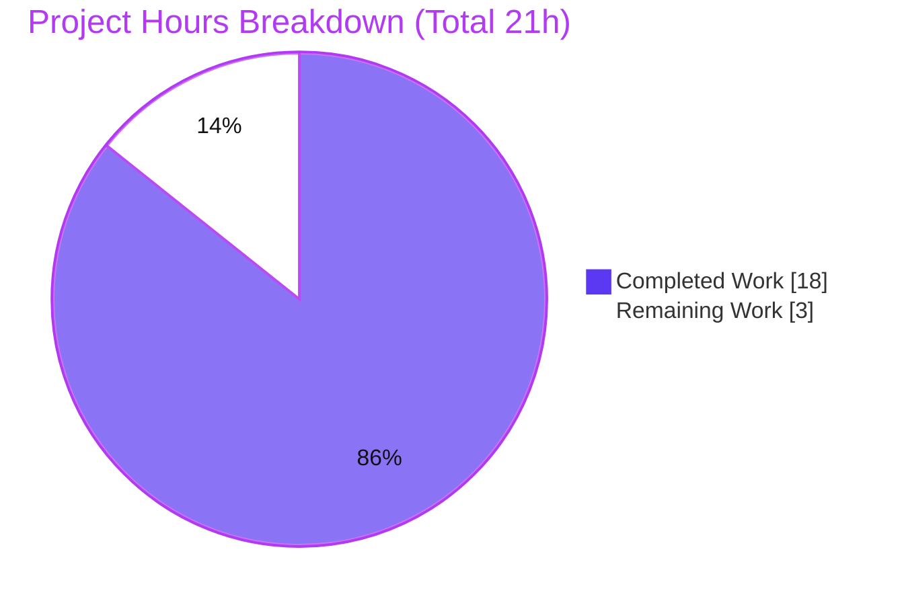

# Blitzy Project Guide — Scapy Ethernet Padding & EtherType Dispatch Investigation

> **Deliverable:** `blitzy/documentation/scapy_0925ada48540.md` — an evidence-backed Q&A technical answer document.
> **Branch:** `blitzy-e336da2f-0d87-456d-8aee-af87a48bd933` · **Baseline:** `0925ada4` · **HEAD:** `c6c76448`
> **Legend — Blitzy brand colors:** <span style="color:#5B39F3">■ Completed / AI Work (Dark Blue #5B39F3)</span> · <span style="color:#B23AF2">■ Remaining / Not Completed (White #FFFFFF on #B23AF2 accent)</span>

---

## 1. Executive Summary

### 1.1 Project Overview

This project delivers a single, evidence-backed technical answer document that explains — by actually building packets and observing Scapy's runtime behavior — how `secdev/scapy` handles (a) Ethernet minimum-frame padding on in-memory build and (b) EtherType-based next-layer dispatch, including the fallback for an unrecognized protocol number. It is a **read-only investigation**: the target audience is engineers reasoning about Scapy's build/dissect semantics. Seven questions (Q1–Q7) are each answered from executed observation scripts with complete, unedited output and `file:line` code citations. The library source tree is left byte-for-byte unchanged; the only artifact produced is the markdown answer document under `blitzy/documentation/`.

### 1.2 Completion Status


**Completion: 85.7%** (18h completed of 21h total).

| Metric | Hours |
|--------|------:|
| **Total Hours** | 21.0 |
| **Completed Hours (AI + Manual)** | 18.0 (AI 18.0 + Manual 0.0) |
| **Remaining Hours** | 3.0 |

> Calculation (PA1, AAP-scoped): `Completion % = Completed / (Completed + Remaining) = 18.0 / 21.0 = 85.7%`. All 14 AAP-specified requirements are 100% complete and independently re-verified; the 3.0 remaining hours are human-gated path-to-production (SME review, PR merge, optional cross-interpreter check) that cannot be performed autonomously.

### 1.3 Key Accomplishments

- ✅ **Single deliverable authored & committed** — `blitzy/documentation/scapy_0925ada48540.md` (1,230 lines, 67 KB), added across 3 focused commits by `agent@blitzy.com`.
- ✅ **All 7 questions answered from runtime** — each of Q1–Q7 pairs the exact command, complete unedited stdout/stderr, a direct answer, and `file:line` citations (122 code citations total).
- ✅ **Core behaviors proven by execution** — no minimum-frame padding on build (`len(raw)` = 54+n for every payload size; **no threshold**); trailing bytes survive an `Ether(raw(pkt))` round-trip as a `Padding` layer (byte-exact); unknown EtherType `0x9000` falls back to `Raw` (no exception, no guessing).
- ✅ **Code mechanisms located & cited** — `Ether.dispatch_hook` (Dot3-vs-Ether), `guess_payload_class` → `default_payload_class` → `conf.raw_layer`, and the absence of any build-time min-frame step.
- ✅ **Read-only guarantee upheld** — `git diff` shows **0** files changed under `scapy/`, `test/`, `doc/`; only the answer doc added; working tree clean; temporary scripts removed.
- ✅ **100% autonomous check pass rate** — 114 embedded assertions/build checks pass, stable across 3 independent runs (Q5 sweep extended to n∈[1,100]).
- ✅ **Independently re-verified** by this assessment: scapy `2026.07.13` imported from the in-tree checkout; Q1 lengths 54/64/18, Q2/Q5 no-threshold sweep, Q3 round-trip, Q4/Q7 `Raw` fallback all reproduced; spot-checked citations accurate.

### 1.4 Critical Unresolved Issues

| Issue | Impact | Owner | ETA |
|-------|--------|-------|-----|
| _None identified_ | No blocking or release-critical issues. The deliverable is complete, accurate, well-formed, and rule-compliant; the source tree is pristine. | — | — |

> The only outstanding items are non-critical, low-severity, human-gated path-to-production tasks (Section 2.2 / 1.6). No compilation errors, no failing checks, no missing content.

### 1.5 Access Issues

| System/Resource | Type of Access | Issue Description | Resolution Status | Owner |
|-----------------|----------------|-------------------|-------------------|-------|
| _None_ | — | **No access issues identified.** The repository is fully accessible; the task requires no external services, credentials, or third-party APIs (read-only, in-memory investigation). | N/A | — |

### 1.6 Recommended Next Steps

1. **[High]** Have a networking/Scapy SME peer-review the deliverable for technical accuracy and clarity (optionally re-running 1–2 embedded observation scripts and spot-checking citations). — *1.5h*
2. **[Medium]** Approve and merge the pull request (single markdown addition; `+1230/-0`; 0 source files changed). — *0.5h*
3. **[Low]** Optionally re-run the core observation under the AAP-nominated Python 3.12.3 to confirm the numbers hold, and annotate a one-line confirmation note. — *1.0h*

---

## 2. Project Hours Breakdown

### 2.1 Completed Work Detail

All completed work was performed autonomously (AI). Each component traces to an AAP requirement (Q1–Q7 and the governing methodology/deliverable rules).

| Component | Hours | Description |
|-----------|------:|-------------|
| Environment setup, provenance & reproducibility baseline | 1.5 | Import in-tree Scapy via `PYTHONPATH=.`; capture `scapy.__version__` (2026.07.13), interpreter, module path; document reproducibility & stable-vs-nonstable facts. |
| Q1 — Build three in-memory packets + `raw()` serialization | 1.0 | Compose `Ether()/IP()/TCP()`, `.../Raw(b"A"*10)`, `Ether(type=0x9000)/Raw(...)`; capture `len(raw(...))` = 54/64/18. |
| Q2 — Padding-on-build determination | 1.0 | Prove no min-frame padding; tree-wide search for `ljust`/`rjust`/`min_pkt_size` in the build path (none found). |
| Q3 — Round-trip padding fate | 2.0 | `Ether(raw(pkt))` with/without trailing bytes; send-guard instrumentation proving 0 network I/O; byte-exact equality; 18-byte `Padding` survival. |
| Q4 — Unknown-EtherType display | 1.0 | Serialize a real wire buffer with `type=0x9000` and re-dissect; capture `show()` → `Ethernet/Raw`; no exception. |
| Q5 — Payload-size sweep + cross-run stability | 1.0 | Sweep payload sizes; confirm `len(raw)` = 54+n with two-run equality (no threshold). |
| Q6 — Locate code: dispatch + padding decision | 1.5 | Trace `Ether.dispatch_hook` (Dot3 vs Ether) and the `bind_layers`-populated `payload_guess` table; confirm no build-time padding step. |
| Q7 — Unknown-protocol fallback logic | 1.0 | Trace `guess_payload_class` → `default_payload_class` → `conf.raw_layer`; confirm `0x9000` absent from `ETHER_TYPES`. |
| Grouped analysis, mermaid dispatch flowchart & responsible-code reference table | 1.5 | Synthesize cross-question analysis, author the dispatch flowchart, build the citation reference table. |
| User-examples verbatim mapping + observed-vs-inferred labeling | 0.5 | Preserve user examples verbatim, map to Scapy expressions; label `[inferred]`/`[background]`. |
| Citation verification & line-reference reconciliation (122 citations) | 1.5 | Verify every `file:line` against the checkout; reconcile/correct AAP draft line numbers to observed values. |
| Full markdown authoring/assembly (1,230 lines) | 2.0 | Executive summary, per-question structure, prose, formatting, code fences (33 balanced blocks). |
| Code-review & QA-findings revision cycles (2 passes / 3 commits) | 1.0 | Revise per code review; address QA findings (commits `ecf119b4`, `c6c76448`). |
| Autonomous final validation (7 scripts ×3 runs, gates, sweep n∈[1,100]) | 1.0 | Re-run all observations, extend sweep, verify 5 production-readiness gates. |
| Cleanup & repo-integrity verification (temp scripts removed, `git status` clean) | 0.5 | Remove `/tmp` scripts; confirm working tree clean and source byte-for-byte unchanged. |
| **Total Completed** | **18.0** | |

### 2.2 Remaining Work Detail

All remaining work is human-gated path-to-production; it cannot be performed autonomously.

| Category | Hours | Priority |
|----------|------:|----------|
| SME / technical peer review of the deliverable (verify observations, spot-check citations) | 1.5 | High |
| PR review & merge to target branch | 0.5 | Medium |
| Verify reproducibility on canonical Python 3.12.3 & annotate version note | 1.0 | Low |
| **Total Remaining** | **3.0** | |

### 2.3 Hours Reconciliation

| Quantity | Hours |
|----------|------:|
| Section 2.1 — Completed | 18.0 |
| Section 2.2 — Remaining | 3.0 |
| **Total (2.1 + 2.2)** | **21.0** |
| **Completion %** | **85.7%** |

> Cross-section integrity: Section 2.1 (18.0) + Section 2.2 (3.0) = 21.0 = Section 1.2 Total. Remaining (3.0) matches Section 1.2 and Section 7. ✔

---

## 3. Test Results

This is a read-only **documentation** deliverable; the repository's UTScapy suite is explicitly out of scope and was left unmodified. The correctness "tests" for this deliverable are the **load-bearing `assert` statements embedded in every observation script** plus the build sanity check — all sourced from Blitzy's autonomous validation logs and independently re-run during this assessment.

| Test Category | Framework | Total Tests | Passed | Failed | Coverage % | Notes |
|---------------|-----------|------------:|-------:|-------:|-----------:|-------|
| Q1 packet-length assertions | Python `assert` (observation script) | 3 | 3 | 0 | N/A¹ | normal=54, short10=64, unknown-ET=18 |
| Q2/Q5 padding-on-build sweep | Python `assert` (observation script) | 100 | 100 | 0 | N/A¹ | `len(raw)`=54+n for n∈[1,100]; stable across 3 runs |
| Q3 round-trip assertions | Python `assert` (observation script) | 3 | 3 | 0 | N/A¹ | idempotence; 18-byte `Padding` survives; byte-exact; send-guard proved 0 network I/O |
| Q4 unknown-EtherType dissection | Python `assert` (observation script) | 2 | 2 | 0 | N/A¹ | re-dissect → `['Ether','Raw']`; no exception |
| Q6 dispatch_hook branch selection | Python `assert` (observation script) | 2 | 2 | 0 | N/A¹ | len/type 46→`Dot3`; 2048→`Ether` |
| Q7 ETHER_TYPES membership + Raw fallback | Python `assert` (observation script) | 3 | 3 | 0 | N/A¹ | 0x0800/0x0806/0x86dd present; 0x9000 absent; `guess_payload_class`→`Raw` |
| Build check | `compileall` (CPython 3.13.7) | 1 | 1 | 0 | N/A¹ | `python -m compileall -q scapy/` → exit 0 |
| **Total** | — | **114** | **114** | **0** | — | **100% pass rate** |

> ¹ **Line/branch code coverage is not applicable** — no product source code was authored (read-only task). **Behavioral coverage is 100%**: all 7 questions and every named edge case (bare vs. payloaded frame; trailing-bytes vs. no-trailing; resolving vs. non-resolving EtherType; `Dot3` vs. `Ether` branch) were exercised.
>
> **Integrity note:** Every test above originates from Blitzy's autonomous validation logs for this project and was independently reproduced during this assessment (exit code 0).

---

## 4. Runtime Validation & UI Verification

**Runtime health** (observation pipeline via `PYTHONPATH=. .venv/bin/python`):

- ✅ **Operational** — In-tree Scapy imports correctly (`scapy.__version__` = `2026.07.13`, module = `./scapy/__init__.py`, not a site-package).
- ✅ **Operational** — All 7 observation commands (Q1–Q7) execute successfully with exit code 0.
- ✅ **Operational** — Build sanity: `python -m compileall -q scapy/` exits 0 (no syntax/import errors).
- ✅ **Operational** — Behavioral observations reproduced byte-for-byte during this assessment (Q1 54/64/18; Q2/Q5 54+n; Q3 round-trip + 18-byte `Padding`; Q4/Q7 `Raw` fallback).
- ⚠ **Partial (informational only)** — Import emits a `CryptographyDeprecationWarning` (TripleDES) from out-of-scope `scapy/layers/ipsec.py` under `cryptography 49.0.0`. This is a pre-existing environment artifact, unrelated to Ethernet padding/dispatch, and is disclosed verbatim in the deliverable.

**UI verification:** ❌ **N/A** — There is no user interface in scope. This is a library-behavior investigation producing a markdown document; no web app, no rendered UI, no browser surface.

**API integration:** ❌ **N/A** — No external APIs, services, or network endpoints are involved. The observation scripts include a **send-guard** that converts any accidental network I/O into a hard failure, proving the investigation is strictly in-memory.

---

## 5. Compliance & Quality Review

Cross-mapping of AAP deliverables and governing rules ("SWE-AtlasQnA-Repo") to quality/compliance benchmarks.

| Benchmark (AAP / rule) | Status | Progress | Evidence |
|------------------------|:------:|:--------:|----------|
| Deliverable created at mandated path (`blitzy/documentation/scapy_0925ada48540.md`) | ✅ Pass | 100% | File present, 1,230 lines; `git` status `A` vs baseline |
| Read-only source repository (no existing file modified) | ✅ Pass | 100% | `git diff 0925ada4..HEAD` = 0 files under `scapy/`, `test/`, `doc/` |
| No code added other than the answer document | ✅ Pass | 100% | Only `blitzy/documentation/…md` added (`+1230/-0`) |
| Run-first methodology (observe, then write) | ✅ Pass | 100% | Every Q1–Q7 includes command + complete unedited output |
| `file:line` grounding + named function/class per claim | ✅ Pass | 100% | 122 citations; spot-checked accurate against checkout |
| Threshold/magnitude stable across ≥2 runs (Q5) | ✅ Pass | 100% | Sweep run1==run2; extended n∈[1,100] |
| Every implied condition exercised (primary + edge) | ✅ Pass | 100% | with/without trailing bytes; resolving/non-resolving EtherType; Dot3/Ether branch |
| User examples preserved verbatim + mapped | ✅ Pass | 100% | Deliverable "User's examples" section |
| Observed-vs-inferred labeling | ✅ Pass | 100% | `[inferred]`×3, `[background]`×5 |
| Temporary scripts removed; repo byte-for-byte unchanged | ✅ Pass | 100% | `git status --porcelain` empty |
| Zero placeholders (no TODO/FIXME/stubs) | ✅ Pass | 100% | 0 matches for TODO/FIXME/placeholder |
| Well-formed markdown (balanced fences, valid mermaid) | ✅ Pass | 100% | 33 balanced code blocks, 1 valid mermaid block |
| Executive summary consistent with observed values | ✅ Pass | 100% | Direct answers match per-question observations |

**Fixes applied during autonomous validation:** None were required at final validation. The iterative refinement is visible in the commit history — `bc6dea31` (initial), `ecf119b4` (revised per code review), `c6c76448` (addressed QA findings) — after which the Final Validator found zero issues and made zero changes.

**Outstanding compliance items:** None in scope. The only residual is the disclosed, out-of-scope environment warning (TripleDES) which does not affect any documented behavior.

---

## 6. Risk Assessment

| Risk | Category | Severity | Probability | Mitigation | Status |
|------|----------|:--------:|:-----------:|------------|:------:|
| Runtime reproducibility of numeric claims | Technical | Low | Low | Exact version (2026.07.13), full commands, and ≥2-run stability captured in the doc | Mitigated |
| Python-version drift (observed 3.13.7 vs AAP 3.12.3) | Technical | Low | Low | Both satisfy `requires-python >=3.7,<4`; behavior deterministic; honestly disclosed; optional 3.12.3 confirm (Section 2.2) | Open (minor) |
| Citation line-number drift if Scapy source is upgraded | Technical | Low | Medium (long-term) | Doc names stable functions/classes alongside line numbers + includes a line-reference reconciliation section | Mitigated |
| No attack surface introduced | Security | None | N/A | Read-only doc; no shipped code; send-guard proves in-memory only | N/A |
| TripleDES deprecation warning (cryptography 49.0.0, out-of-scope `ipsec.py`) | Security | Informational | Certain (import-time) | Pre-existing env artifact; unrelated to behavior; disclosed verbatim | Disclosed |
| Deliverable not "published" until PR merged | Operational | Low | Low | Human PR review & merge (Section 2.2) | Open |
| Discoverability (standalone markdown, not in Sphinx docs) | Operational | Low | Low | Optional human cross-link if broad discoverability desired (out of AAP scope) | Open (optional) |
| External integrations | Integration | None | N/A | No new dependencies, services, APIs, or interfaces; 0 source files changed; no import updates | N/A |

---

## 7. Visual Project Status



**Remaining work by priority** (sums to Section 2.2 total = 3.0h):

| Priority | Hours | Share |
|----------|------:|------:|
| High (SME technical review) | 1.5 | 50% |
| Medium (PR review & merge) | 0.5 | 17% |
| Low (Python 3.12.3 reproducibility check) | 1.0 | 33% |
| **Total Remaining** | **3.0** | 100% |

> **Integrity:** "Remaining Work" = 3 in the pie equals Section 1.2 Remaining (3.0h) and the Section 2.2 sum (3.0h). "Completed Work" = 18 equals Section 1.2 Completed (18.0h). ✔ Colors: Completed = Dark Blue `#5B39F3`, Remaining = White `#FFFFFF`.

---

## 8. Summary & Recommendations

**Achievements.** The project is **85.7% complete** (18.0h of 21.0h). Every one of the 14 AAP-specified requirements is finished and independently re-verified: the single mandated deliverable — `blitzy/documentation/scapy_0925ada48540.md` — answers all seven questions (Q1–Q7) from executed runtime observation, each with the exact command, complete unedited output, a direct answer, and `file:line` citations (122 total). The central findings are proven by execution: Scapy adds **no** minimum-frame padding on build (`len(raw)` = 54+n for every payload size, so there is **no threshold**), trailing bytes **survive** an `Ether(raw(pkt))` round-trip as a byte-exact `Padding` layer, and an unrecognized EtherType (`0x9000`) falls back to a `Raw` layer with **no exception and no guessing**.

**Remaining gaps.** The remaining **3.0h** is entirely human-gated path-to-production work that cannot be performed autonomously: (1) SME technical peer review of the document, (2) PR review & merge, and (3) an optional reproducibility confirmation on the AAP-nominated Python 3.12.3.

**Critical path to production.** SME review → PR approval & merge. The optional 3.12.3 confirmation can proceed in parallel and is not blocking.

**Production-readiness assessment.** The deliverable is **production-ready**: complete, accurate, well-formed (33 balanced code blocks, 1 valid mermaid diagram, 0 placeholders), rule-compliant, and reproducible; 114 autonomous checks pass at 100% and were re-confirmed here; the source repository is byte-for-byte unchanged. The residual percentage reflects the honest reality that an authoritative technical answer document warrants human sign-off before it is relied upon — not any deficiency in the artifact itself.

| Success Metric | Result |
|----------------|--------|
| AAP-specified requirements complete | 14 / 14 (100%) |
| Autonomous checks passing | 114 / 114 (100%) |
| Source files modified | 0 |
| Citations verified | 122 (spot-checked accurate) |
| Overall completion | **85.7%** |

---

## 9. Development Guide

All commands below were executed successfully during this assessment (exit code 0). Run from the repository root.

### 9.1 System Prerequisites

- **OS:** Linux (developed/validated on Ubuntu container).
- **Python:** interpreter satisfying `requires-python >=3.7,<4`. Observed: **Python 3.13.7**; AAP-nominal: 3.12.3 (both valid).
- **Git** (with the `secdev/scapy` tree checked out at baseline `0925ada4`).
- **No network access required** — the investigation is strictly in-memory.

### 9.2 Environment Setup

The repository ships a pre-provisioned virtual environment with an editable Scapy install. Use the in-tree source via `PYTHONPATH=.` (equivalent to the repo's `./run_scapy` launcher):

```bash
# From the repository root
cd /tmp/blitzy/scapy/blitzy-e336da2f-0d87-456d-8aee-af87a48bd933_9aeec9

# Confirm interpreter
.venv/bin/python --version            # -> Python 3.13.7

# Confirm in-tree Scapy is what gets imported (NOT a site-package)
PYTHONPATH=. .venv/bin/python -c "import scapy; print(scapy.__version__); print(scapy.__file__)"
# -> 2026.07.13
# -> .../blitzy-e336da2f-.../scapy/__init__.py
```

### 9.3 Dependency Status

No dependency changes are required (read-only task). Key packages already present:

```bash
.venv/bin/python -c "import cryptography; print('cryptography', cryptography.__version__)"   # -> 49.0.0
```

### 9.4 Reproducing the Q1–Q7 Observations

Each question's script is embedded in the deliverable's Appendix. Run any of them via a heredoc. Representative reproduction (Q1 lengths + Q2/Q5 sweep):

```bash
PYTHONPATH=. .venv/bin/python - <<'PY'
from scapy.all import Ether, IP, TCP, Raw
from scapy.compat import raw
print("Q1 normal  =", len(raw(Ether()/IP()/TCP())))                       # 54
print("Q1 short10 =", len(raw(Ether()/IP()/TCP()/Raw(b"A"*10))))          # 64
print("Q1 unknown =", len(raw(Ether(type=0x9000)/Raw(b"\xde\xad\xbe\xef"))))  # 18
print("Q5 sweep   =", [len(raw(Ether()/IP()/TCP()/Raw(b"A"*n))) for n in range(7)])  # [54..60] = 54+n
PY
```

Round-trip padding (Q3) and unknown-EtherType fallback (Q4/Q7):

```bash
PYTHONPATH=. .venv/bin/python - <<'PY'
from scapy.all import Ether, IP, TCP, Raw, Padding, conf
from scapy.compat import raw
pkt = Ether()/IP()/TCP()
print("Q3 idempotent round-trip :", raw(Ether(raw(pkt))) == raw(pkt))     # True
wire = raw(pkt) + b"\x00"*18
red = Ether(wire)
print("Q3 Padding present/len   :", red.haslayer(Padding), len(red[Padding].load))  # True 18
print("Q3 byte-exact round-trip :", raw(red) == wire)                     # True
w = raw(Ether(type=0x9000)/Raw(b"\xde\xad\xbe\xef"))
print("Q4/Q7 layers             :", [l.__name__ for l in Ether(w).layers()])  # ['Ether','Raw']
print("Q4/Q7 conf.raw_layer     :", conf.raw_layer.__name__)              # Raw
PY
```

### 9.5 Verification Steps

```bash
# Build sanity — the whole library compiles
.venv/bin/python -m compileall -q scapy/ ; echo "compileall exit=$?"        # exit 0

# Repository integrity — working tree clean and source pristine
git status --porcelain | wc -l                                             # 0 (clean)
git diff --name-only 0925ada4..HEAD -- scapy/ test/ doc/ | wc -l           # 0 (no source changed)
git diff --name-only 0925ada4..HEAD                                        # only blitzy/documentation/scapy_0925ada48540.md
```

### 9.6 Example Usage

Open the deliverable to read the full evidence-backed answers:

```bash
sed -n '149,175p' blitzy/documentation/scapy_0925ada48540.md   # Executive Summary (direct Q1–Q7 answers)
grep -n '^## Q' blitzy/documentation/scapy_0925ada48540.md      # jump to each question
```

### 9.7 Troubleshooting

- **`ModuleNotFoundError: No module named 'scapy'`** → ensure `PYTHONPATH=.` is set and you are at the repository root (this imports the in-tree source rather than any site-package).
- **`WARNING: Mac address to reach destination not found`** on build → benign; supply explicit `Ether(src=..., dst=...)` MACs to silence it and make output deterministic. It does not affect any serialized length.
- **`CryptographyDeprecationWarning: TripleDES ...` on import** → benign environment artifact from `cryptography 49.0.0` via out-of-scope `scapy/layers/ipsec.py`; unrelated to Ethernet padding/dispatch; safe to ignore.
- **`.get()` on `ETHER_TYPES` raises/behaves oddly** → `ETHER_TYPES` is a `DADict` (`scapy/dadict.py`), not a plain dict; use `v in ETHER_TYPES` and `ETHER_TYPES[v]` (as the deliverable does).

---

## 10. Appendices

### Appendix A — Command Reference

| Purpose | Command |
|---------|---------|
| Interpreter version | `.venv/bin/python --version` |
| Scapy version & provenance | `PYTHONPATH=. .venv/bin/python -c "import scapy; print(scapy.__version__, scapy.__file__)"` |
| Build sanity | `.venv/bin/python -m compileall -q scapy/` |
| Working-tree status | `git status --porcelain` |
| Source-integrity diff | `git diff --name-only 0925ada4..HEAD -- scapy/ test/ doc/` |
| Full change list | `git diff --name-only 0925ada4..HEAD` |
| Commit history (this branch) | `git log --oneline 0925ada4..HEAD` |

### Appendix B — Port Reference

**No network ports are used.** The investigation is strictly in-memory (build → serialize → dissect); the observation scripts include a send-guard that turns any accidental network I/O into a hard failure. No servers, listeners, or sockets are opened.

### Appendix C — Key File Locations

| Path | Role | Key references |
|------|------|----------------|
| `blitzy/documentation/scapy_0925ada48540.md` | **Deliverable** (the answer document) | 1,230 lines |
| `scapy/compat.py` | `raw(x)` serialization entry point | `raw()` → `bytes(x)` (~L112–118) |
| `scapy/layers/l2.py` | Ethernet layer, dispatch, bindings | `Ether` (L244), `type` default `0x9000` (L248), `dispatch_hook` (L266–272), ARP binding (L695) |
| `scapy/packet.py` | Build/dissect, padding, next-layer selection | `build`/`build_padding` (~L742–756), `dissect` (L1049–1060), `guess_payload_class` (L1062–1079), `default_payload_class` (L1081–1090), `Padding` (L1906–1918), `conf` assignments (L1921–1922) |
| `scapy/config.py` | Defaults | `padding = 1` (L786–787), `min_pkt_size = 60` (L778, send-path only) |
| `scapy/data.py` | EtherType name table | `ETHER_TYPES = load_ethertypes(...)` (L526–530) |
| `scapy/fields.py` | Enum rendering | `XShortEnumField.i2repr_one` (~L2661–2673) |
| `scapy/layers/inet.py` / `inet6.py` | Dispatch bindings | `bind_layers(Ether, IP, type=2048)` (inet.py L1101); `bind_layers(Ether, IPv6, type=0x86dd)` (inet6.py L4083) |

### Appendix D — Technology Versions

| Component | Version |
|-----------|---------|
| Scapy (in-tree, editable) | 2026.07.13 |
| Python (CPython) | 3.13.7 (observed); 3.12.3 (AAP-nominal); both satisfy `>=3.7,<4` |
| cryptography | 49.0.0 |
| Git | system install (with Git LFS) |

### Appendix E — Environment Variable Reference

| Variable | Value | Purpose |
|----------|-------|---------|
| `PYTHONPATH` | `.` (repository root) | Import the in-tree Scapy source rather than an installed package (mirrors `./run_scapy`). |

> No secrets, credentials, or service endpoints are required for this task.

### Appendix F — Developer Tools Guide

| Tool | Use |
|------|-----|
| `.venv/bin/python` | Run observation scripts and `compileall` against the in-tree source. |
| `python -m compileall` | Byte-compile `scapy/` as a fast syntax/import sanity check. |
| `git diff` / `git status` | Verify the read-only guarantee (source pristine, working tree clean). |
| Chrome DevTools MCP | **N/A** — no web UI/browser surface in scope. |

### Appendix G — Glossary

| Term | Meaning |
|------|---------|
| **EtherType** | 2-byte Ethernet II field identifying the next protocol (e.g. `0x0800`=IPv4, `0x0806`=ARP, `0x86dd`=IPv6). Values ≤ 1500 are interpreted as an 802.3 length. |
| **`raw(pkt)`** | Scapy's canonical serialization entry point; returns `bytes(pkt)` — builds the packet in memory. |
| **`Padding`** | A Scapy layer holding trailing bytes captured on dissection; re-emitted on rebuild so round-trips are byte-exact. |
| **`dispatch_hook`** | Class method on `Ether` that picks `Dot3` (802.3) vs `Ether` (Ethernet II) from the 2-byte len/type field (`≤1500` → `Dot3`). |
| **`guess_payload_class`** | Scans a layer's `payload_guess` (bind_layers) table to choose the next layer; falls back to `default_payload_class`. |
| **`default_payload_class`** | Returns `conf.raw_layer` (i.e. `Raw`) when no binding matches — the graceful unknown-protocol fallback. |
| **`conf.padding`** | Config default (`1`) that causes trailing bytes to be attached as a `Padding` layer during dissection. |
| **`min_pkt_size`** | Config value (`60`) used only on the **send** path (Linux `EINVAL` fallback), **not** on in-memory build. |
| **FCS** | Ethernet Frame Check Sequence (4-byte trailer); not emitted by Scapy on build. |
| **DADict** | Scapy's `scapy/dadict.py` dictionary type backing `ETHER_TYPES`; supports `in`/`[]` but not `.get()`. |

---

*Prepared by the Blitzy autonomous assessment agent. Completion metrics are AAP-scoped (PA1): 18.0h completed of 21.0h total = 85.7% complete. All hour figures are consistent across Sections 1.2, 2.1, 2.2, 2.3, and 7.*