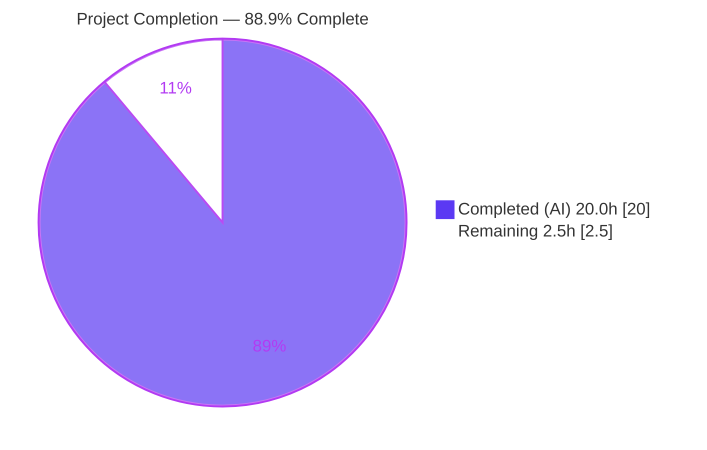
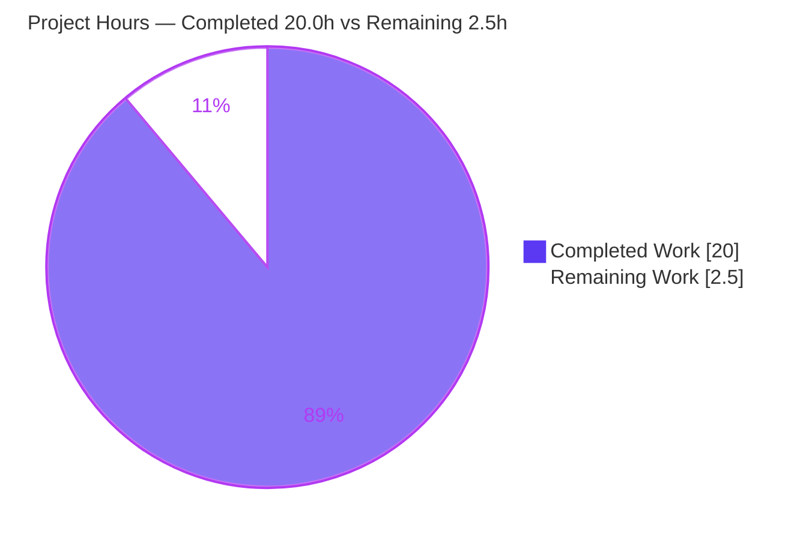
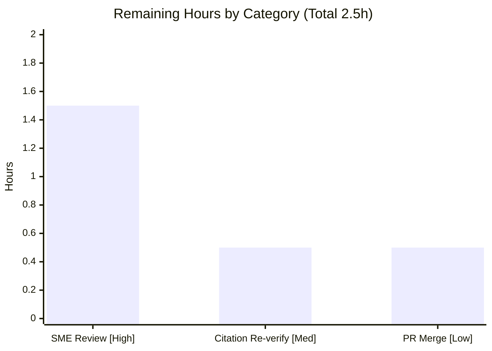

# Blitzy Project Guide — Scapy Ethernet Frame-Building Investigation

> **Deliverable branch:** `scapy_0925ada48540` (HEAD `0925ada485406684174d6f068dbd85c4154657b3`) · **Working branch:** `blitzy-1a85ae1f-191a-4d8f-b5fa-e97f34902678`
> **Artifact:** `blitzy/documentation/scapy_0925ada48540.md` (535 lines) · **Scapy version:** `2026.07.02`
>
> **Legend / Blitzy brand colors:** <span style="color:#5B39F3">■</span> **Completed / AI Work — Dark Blue `#5B39F3`** · <span style="color:#B23AF2">■</span> Headings/Accents — Violet-Black `#B23AF2` · □ **Remaining / Not Completed — White `#FFFFFF`** · <span style="color:#A8FDD9">■</span> Highlight — Mint `#A8FDD9`

---

## 1. Executive Summary

### 1.1 Project Overview

This project delivers a single, evidence-grounded technical investigation documenting how Scapy's Ethernet layer behaves when frames are built, serialized to raw bytes via `raw()`, and re-parsed via `Ether(raw(packet))`. The audience is developers confused by Scapy's Ethernet frame-building — specifically padding, round-trip behavior, and unknown-EtherType dispatch. The deliverable answers six questions (Q1–Q6) strictly from observed runtime output, pairing every behavioral claim with verbatim console evidence and every mechanism claim with an exact `file:line` citation into the `secdev/scapy` source at HEAD `0925ada4`. Technical scope is read-only and additive: exactly one new markdown file is created; zero existing Scapy source, test, or config files are modified.

### 1.2 Completion Status

**The project is 88.9% complete** (AAP-scoped, hours-based per PA1). All AAP deliverables are complete and validated; the residual 2.5 hours is human path-to-production work (review + merge), not incomplete or defective agent work.



| Metric | Hours | Notes |
|--------|------:|-------|
| **Total Hours** | **22.5** | AAP-scoped work + path-to-production |
| **Completed Hours (AI + Manual)** | **20.0** | AI (Blitzy autonomous): 20.0 · Manual: 0.0 |
| **Remaining Hours** | **2.5** | Path-to-production only (human review + merge) |
| **Percent Complete** | **88.9%** | `20.0 / 22.5 × 100 = 88.9%` |

### 1.3 Key Accomplishments

- [x] Authored `blitzy/documentation/scapy_0925ada48540.md` — a 535-line, evidence-grounded answer document named for the source branch, as required.
- [x] Answered all six questions (Q1–Q6) strictly from **observed runtime output**, with **21 verbatim evidence blocks** (one-claim-one-evidence discipline).
- [x] Established canonical grounding: `scapy.VERSION = 2026.07.02` captured via the exact documented command; interpreter (CPython 3.13.7) stated for reproducibility.
- [x] Proved Scapy does **not** auto-pad short Ethernet frames (Q2 = 64B; sweep `[54,55,56,58,60,62,64,74]` linear, no 60-byte floor) — **stable across 5 process runs + 1000 in-process iterations**.
- [x] Characterized the `Ether(raw(packet))` round-trip in **both** required sub-cases (Q3A unpadded → `Raw`; Q3B wire-padded → distinct `Padding` layer, `IP len = 40`).
- [x] Documented unknown-EtherType dispatch (Q4: `0x9000`/`0x9999` → `Raw`), the `0x9000`-is-default nuance, and the ≤ 1500 → `Dot3` (802.3) re-routing.
- [x] Explained the source mechanism (Q6 a–e) as cause → effect with **57 unique `file:line` citations** across 5 files; inferred-vs-observed statements labeled (8 labels).
- [x] Maintained the read-only constraint: **1 file added, 0 modified**; temporary scripts kept in `/tmp` and removed; working tree clean.
- [x] Independently re-verified 10/10 core runtime values and 6/6 sampled citations during this assessment.

### 1.4 Critical Unresolved Issues

**No critical unresolved issues that block release or validation were identified.** The deliverable is complete, accurate, evidence-grounded, and committed; the Final Validator classified it PRODUCTION-READY with 5/5 gates passing.

| Issue | Impact | Owner | ETA |
|-------|--------|-------|-----|
| _None — no blocking issues_ | _n/a_ | _n/a_ | _n/a_ |
| Human SME sign-off pending (standard for docs) | Non-blocking; gates merge | Reviewing Engineer | ≤ 1.5h |

### 1.5 Access Issues

No repository-permission or credential access issues affect this deliverable — the investigation runs entirely offline against the local checkout using only the Python standard library. One informational environment limitation is noted for completeness (it does **not** affect the documentation deliverable):

| System/Resource | Type of Access | Issue Description | Resolution Status | Owner |
|-----------------|----------------|-------------------|-------------------|-------|
| `tcpdump` / `libpcap` OS packages | System package install | Absent in sandbox and un-installable (apt mirror cannot locate them; no internet). Affects only 10 out-of-scope full-suite tests, not the Ethernet doc. | Accepted (out-of-scope; environment-provided) | Platform/Env |
| Source repository (`secdev/scapy`) | Read/write (git) | None — read-only checkout accessed successfully; deliverable committed. | Resolved | — |
| Third-party APIs / credentials | External services | None required — task is fully offline, standard-library only. | Not applicable | — |

### 1.6 Recommended Next Steps

1. **[High]** Have a Scapy-knowledgeable engineer review `blitzy/documentation/scapy_0925ada48540.md` for technical correctness and completeness; optionally re-run the three appendix observation scripts to spot-check verbatim output (≈ 1.5h).
2. **[Medium]** Re-verify the 57 `file:line` citations against live source at the merge commit; update any that drifted if the base advanced beyond `0925ada4` (≈ 0.5h).
3. **[Low]** Approve and merge the single-file PR to the target branch (≈ 0.5h).
4. **[Low]** (Optional) Link the document from the team's Scapy knowledge base / onboarding index so it is discoverable by future developers hitting the same confusion.

---

## 2. Project Hours Breakdown

### 2.1 Completed Work Detail

All rows trace to specific AAP requirements (Q1–Q6, environment grounding, authoring, QA). Every listed observation was reproduced at runtime; every citation was verified against source.

| Component | Hours | Description |
|-----------|------:|-------------|
| Environment setup & canonical version grounding | 1.5 | venv + editable install; captured `scapy.VERSION = 2026.07.02` via exact command; interpreter note (CPython 3.13.7); confirmed `import scapy` resolves to local checkout |
| Q1/Q2 baseline & short-payload observation | 2.0 | Built `Ether()/IP()/TCP()` (54B) and `+Raw(b"X"*10)` (64B); measured `raw()` lengths; established the no-auto-pad finding |
| Q5 padding threshold sweep + stability runs | 2.5 | Multi-size sweep `[0..20]`, `Ether()/ARP()`=42B cross-check; confirmed stability across 5 process runs + 1000 in-process iterations |
| Q3 `raw()` round-trip investigation (Q3A + Q3B) | 2.0 | Unpadded round-trip (`hasPadding=0`) + wire-padded simulation (`Padding.load=b'\x00'*6`, `IP len=40`); regression.uts cross-reference |
| Q4 unknown-EtherType investigation | 2.5 | `0x9000`/`0x9999` → `Raw`; `.show()` capture; default-type note; `ETHER_TYPES` `KeyError`; `type=5` → `Dot3` (≤1500 nuance) |
| Q6 source-mechanism analysis & citation verification | 4.0 | Read 5 source files; verified 57 unique `file:line` anchors; authored cause→effect (a–e); inferred-vs-observed labeling |
| Import/build warning byte-count investigation | 1.5 | TripleDES `CryptographyDeprecationWarning` across 2 interpreters (586/0 bytes), `-W all` (981/395), broadcast-warning conditionality |
| Documentation authoring (535-line evidence-grounded doc) | 3.0 | TL;DR, per-question sections, one-claim-one-evidence, coverage-pass checklist, markdown structure |
| QA/validation fixes & re-verification (`fe58ddad`) | 1.0 | Warning-honesty correction + ethertypes citation fix; full re-run of observations; git-clean verification |
| **Total Completed** | **20.0** | **Matches Section 1.2 Completed Hours** |

### 2.2 Remaining Work Detail

All remaining items are **path-to-production human activities**. There is no outstanding agent rework, no failing in-scope test, and no missing functionality.

| Category | Hours | Priority |
|----------|------:|----------|
| Human SME technical review of documented answers & citations | 1.5 | High |
| Citation line-number freshness re-verification at merge time | 0.5 | Medium |
| PR review, approval & merge | 0.5 | Low |
| **Total Remaining** | **2.5** | **Matches Section 1.2 Remaining & Section 7 pie** |

### 2.3 Hours Reconciliation & Methodology

Completion is computed with the PA1 AAP-scoped, hours-based formula:

```
Completion % = Completed Hours / (Completed Hours + Remaining Hours) × 100
             = 20.0 / (20.0 + 2.5) × 100
             = 20.0 / 22.5 × 100
             = 88.9%
```

**Cross-section integrity (validated before submission):**

| Rule | Check | Result |
|------|-------|--------|
| Rule 1 | Remaining hours identical in §1.2, §2.2, §7 | 2.5 = 2.5 = 2.5 ✅ |
| Rule 2 | §2.1 + §2.2 = Total in §1.2 | 20.0 + 2.5 = 22.5 ✅ |
| Rule 3 | §3 tests originate from Blitzy autonomous logs | Confirmed ✅ |
| Rule 4 | §1.5 access issues validated against environment | Confirmed ✅ |
| Rule 5 | Completed `#5B39F3` / Remaining `#FFFFFF` | Applied ✅ |

---

## 3. Test Results

For this documentation deliverable, "tests" are the **accuracy validations** performed by Blitzy's autonomous systems: every documented runtime value must reproduce verbatim, and every `file:line` citation must match live source. All rows below originate from Blitzy's autonomous validation logs (Final Validator) and were partially re-verified independently during this assessment.

| Test Category | Framework | Total | Passed | Failed | Coverage % | Notes |
|---------------|-----------|------:|------:|------:|----------:|-------|
| Runtime Evidence Reproduction | Scapy `raw()`/dissect (Py 3.13.7) | 15 | 15 | 0 | 100% | Consolidated audit `ALL_MATCH` (15/15); 10/10 core values re-verified this session |
| Citation Accuracy Verification | `grep`/manual vs HEAD `0925ada4` | 57 | 57 | 0 | 100% | 57 unique anchors (68 total refs); zero drift; 6/6 spot-checked this session |
| Warning Byte-Count Checks | stderr capture (2 interpreters) | 4 | 4 | 0 | 100% | 586 / 0 / 981 / 395 bytes exact; venv `import`=0 re-verified this session |
| Threshold Sweep Stability | Scapy `raw()` | 6 | 6 | 0 | 100% | Identical list across 5 process runs + 1000 in-process iterations; re-verified this session |
| Targeted L2 Unit Tests | UTscapy (`.uts`) | 10 | 10 | 0 | n/a | `test/scapy/layers/l2.uts` — most relevant existing tests to the doc subject |
| **In-scope subtotal** | — | **92** | **92** | **0** | **100%** | **All in-scope accuracy/validation checks pass** |
| Full Regression Suite (diligence, OUT-OF-SCOPE) | UTscapy (`.uts`) | 4847 | 4836 | 11 | n/a | 11 failures = documented env baseline (10 × tcpdump/libpcap absent+un-installable; 1 × flaky ISOTP timing, passes 52/0 isolated); zero code defects, none related to this doc |

**Interpretation:** 100% of in-scope accuracy validations pass. The 11 full-suite failures are pre-existing environment limitations (missing OS packages, one timing-flaky test) that are out of scope for this read-only documentation task and were **not** caused by this work (zero code changes).

---

## 4. Runtime Validation & UI Verification

**Runtime health** (real code paths exercised in default configuration; all re-verified this session):

- ✅ **Scapy import** resolves to the local checkout (editable install): `scapy.__file__` → `<repo>/scapy/__init__.py`; `scapy.VERSION = 2026.07.02`.
- ✅ **Build path** `raw()` executes: Q1 `Ether()/IP()/TCP()` = **54B**; Q2 `+Raw(b"X"*10)` = **64B**; sweep = `[54,55,56,58,60,62,64,74]`; `Ether()/ARP()` = **42B**.
- ✅ **Dissect path** `Ether(raw(...))` executes: Q3A → `['Ether','IP','TCP','Raw']`, `hasPadding=0`; Q3B → `Padding.load=b'\x00'*6`, `IP len=40`.
- ✅ **EtherType dispatch**: Q4a `0x9000` → `Raw`; Q4b `0x9999` → `Raw`; Q4c `type=5` → `Dot3`; `default Ether().type = 0x9000`; `ETHER_TYPES[0x9000]` → `KeyError`.
- ✅ **Rendering** `.show()` produces the documented Ethernet-header + `Raw` load output.
- ✅ **Repository state**: `git status --porcelain` empty; exactly 1 file added vs base `0925ada4`.

**UI verification:** ⚪ **Not applicable.** The deliverable is a markdown document for a headless Python library (Scapy); there is no user interface, web front-end, or visual surface to verify. No browser/Lighthouse/screenshot verification is relevant to this task.

---

## 5. Compliance & Quality Review

Cross-mapping of AAP deliverables and governing rules to Blitzy's quality/compliance benchmarks. Fixes applied during autonomous validation are noted.

| Benchmark / AAP Rule | Requirement | Status | Progress | Notes |
|----------------------|-------------|--------|:--------:|-------|
| Deliverable location & name | `blitzy/documentation/scapy_0925ada48540.md` (branch-named) | ✅ Pass | 100% | Created; 535 lines; committed |
| Read-only constraint | No existing repo file modified; only the answer doc added | ✅ Pass | 100% | `git diff 0925ada4 --name-status` = `A` (1 file) |
| Run-first methodology | Build/run real paths; capture verbatim output | ✅ Pass | 100% | 21 verbatim evidence blocks |
| One-claim-one-evidence | Each behavioral claim paired with its output line | ✅ Pass | 100% | Maintained throughout |
| Exact-literal grounding | Cite exact values & `file:line` | ✅ Pass | 100% | 57 unique citations; values quoted exactly (`type=0x9000`, `frame_len=54`) |
| Exhaustive coverage | Every named item addressed | ✅ Pass | 100% | `0x9000`, "10 bytes", `Ether(raw(packet))`, `0x9999`, `Dot3` ≤1500 all present |
| Stability rigor | Threshold sweep stable across ≥2 runs | ✅ Pass | 100% | Stable across 5 runs + 1000 iterations |
| Canonical configuration | Default config; report version + commands | ✅ Pass | 100% | `scapy.VERSION = 2026.07.02`; exact commands stated |
| Inferred-vs-observed labeling | Reading-derived claims labeled | ✅ Pass | 100% | 8 "inferred from source" labels |
| Report-exactly-what-is-observed | No adjustment toward "expected" | ✅ Pass | 100% | "no auto-pad" reported as-is, not "corrected" |
| Cleanup & repo cleanliness | Temp scripts removed; tree clean | ✅ Pass | 100% | `/tmp` scripts deleted; `git status` empty |
| QA fixes applied | Autonomous validation corrections | ✅ Pass | 100% | `fe58ddad`: warning-honesty + ethertypes citation |
| Human SME review | Independent technical sign-off | ⬜ Pending | 0% | Path-to-production (HT-1); non-blocking |

**Outstanding compliance items:** Only human SME review remains (non-blocking, standard pre-merge gate).

---

## 6. Risk Assessment

| Risk | Category | Severity | Probability | Mitigation | Status |
|------|----------|:--------:|:-----------:|------------|--------|
| Citation line-number drift if source evolves before merge | Technical | Low | Low | Re-verify 57 anchors at merge commit (HT-2); doc already matches HEAD `0925ada4` | Open (mitigation planned) |
| Interpreter used (CPython 3.13.7) exceeds AAP-recommended 3.11 | Technical | Low | Low | Doc states interpreter explicitly + notes Ethernet behavior is version-independent; all values re-reproduced on 3.13.7 | Mitigated / Documented |
| Security exposure from the change | Security | None | — | Read-only doc; zero code/dependencies added; no attack surface. Benign TripleDES deprecation warning documented and unrelated | Not applicable |
| Reproduction requires the Scapy venv (Py 3.13.7 + cryptography 41.0.7) | Operational | Low | Low | Development Guide (§9) documents exact setup and `PYTHONPATH` invocation | Mitigated |
| 11 pre-existing full-suite test failures visible on re-run | Operational | Low | High | Documented as environment baseline (tcpdump/libpcap absent; flaky ISOTP); out-of-scope; not caused by this work | Known / Accepted |
| External integration dependency | Integration | None | — | No external services, APIs, credentials, or network integration; self-contained markdown | Not applicable |

**Overall risk posture: LOW.** No blocking risks; no security or integration exposure. All residual work is human verification, not defect remediation.

---

## 7. Visual Project Status

**Project hours breakdown** (Completed = Dark Blue `#5B39F3`, Remaining = White `#FFFFFF`):



**Remaining hours by category** (sums to 2.5h — matches §1.2 and §2.2):



| Status band | Hours | Share |
|-------------|------:|------:|
| ▓ Completed (AI) | 20.0 | 88.9% |
| ░ Remaining (human) | 2.5 | 11.1% |
| **Total** | **22.5** | **100%** |

> **Integrity note:** The pie chart "Remaining Work" value (2.5) equals the Remaining Hours in §1.2 and the sum of the §2.2 Hours column (1.5 + 0.5 + 0.5 = 2.5).

---

## 8. Summary & Recommendations

**Achievements.** The project fully delivers the AAP's single objective: a rigorous, reproducible investigation of Scapy's Ethernet frame-building behavior. Every one of the six questions is answered from observed runtime output, with 21 verbatim evidence blocks and 57 unique `file:line` citations. The central, potentially surprising finding — that Scapy's `raw()`/`build()` path performs **no** automatic minimum-Ethernet-frame padding — is reported exactly as observed and corroborated both by runtime measurement (baseline 54B; linear sweep with no 60-byte floor) and by source reading (padding originates only from an explicit `Padding` layer). The round-trip, unknown-EtherType, and ≤1500→`Dot3` nuances are all covered, including that `0x9000` is Scapy's own default `Ether.type`.

**Remaining gaps & critical path.** The project is **88.9% complete**. The remaining **2.5 hours** are entirely human path-to-production: a Scapy-knowledgeable SME review (the one High-priority gate), a citation-freshness check at merge, and PR approval. There are no code defects, no failing in-scope tests, and no missing functionality — so the critical path is simply **review → merge**.

**Production readiness.** The deliverable is **PRODUCTION-READY** pending human sign-off: it is complete, accurate (100% of in-scope accuracy validations pass), evidence-grounded, read-only-compliant, and committed on a clean working tree. Risk posture is LOW with no blockers.

| Success Metric | Target | Actual | Status |
|----------------|--------|--------|:------:|
| AAP questions answered (Q1–Q6) | 6/6 | 6/6 | ✅ |
| Runtime evidence reproduces | 100% | 100% (15/15) | ✅ |
| Citations verified exact | 100% | 100% (57/57) | ✅ |
| Files modified (read-only) | 0 | 0 | ✅ |
| In-scope validation pass rate | 100% | 100% (92/92) | ✅ |
| Completion (AAP-scoped) | — | 88.9% | ◑ Pending review |

**Recommendation:** Proceed to SME review and merge. No rework is required.

---

## 9. Development Guide

All commands below were executed and verified in the project environment during this assessment; the working tree remained clean throughout. `<repo>` denotes the repository root: `/tmp/blitzy/scapy/blitzy-1a85ae1f-191a-4d8f-b5fa-e97f34902678_066b86`.

### 9.1 System Prerequisites

- **OS:** Linux (Ubuntu 25.10 container used); any POSIX environment works.
- **Python:** CPython 3.13.7 (verified). Scapy's Ethernet build/dissect behavior is interpreter-version-independent; AAP-recommended baseline is 3.11.
- **Git:** for cloning/inspecting the checkout.
- **Disk:** ~29 MB (repo excl. `.git`/`.venv`).
- **Third-party runtime deps:** none — Scapy core is pure Python and the investigation uses only the standard library.

### 9.2 Environment Setup

```bash
# From the repository root
cd /tmp/blitzy/scapy/blitzy-1a85ae1f-191a-4d8f-b5fa-e97f34902678_066b86

# Confirm interpreters (both report Python 3.13.7)
python3 --version
.venv/bin/python --version

# Confirm Scapy resolves to the LOCAL checkout (editable install)
.venv/bin/python -c "import scapy; print(scapy.__file__)"
# Expected: <repo>/scapy/__init__.py
```

If the `.venv` is not present, it can be recreated (optional — a plain `PYTHONPATH` import also works):

```bash
python3 -m venv .venv
.venv/bin/python -m pip install --upgrade pip
.venv/bin/python -m pip install -e .          # editable install of the local Scapy
```

### 9.3 Canonical Version Banner (reproducibility anchor)

```bash
PYTHONPATH=. .venv/bin/python -c "import scapy; print('scapy.VERSION =', scapy.VERSION)"
# Expected:
# scapy.VERSION = 2026.07.02
```

### 9.4 Reproduce the Investigation

Create the script **outside** the repo (keeps the tree clean), then run it:

```bash
cat > /tmp/reproduce_scapy_eth.py <<'PYEOF'
from scapy.all import Ether, IP, TCP, ARP, Raw, Padding, raw
print("scapy.VERSION =", __import__("scapy").VERSION)
print("Q1 baseline            :", len(raw(Ether()/IP()/TCP())))                              # 54
print("Q2 short payload (10B) :", len(raw(Ether()/IP()/TCP()/Raw(b'X'*10))))                 # 64
print("Q5 sweep               :", [len(raw(Ether()/IP()/TCP()/Raw(b'X'*n) if n else Ether()/IP()/TCP())) for n in [0,1,2,4,6,8,10,20]])
rtA = Ether(raw(Ether()/IP()/TCP()/Raw(b'X'*10)))
print("Q3A layers / hasPad    :", [c.__name__ for c in rtA.layers()], int(rtA.haslayer(Padding)))
rtB = Ether(raw(Ether()/IP()/TCP()) + b'\x00'*6)
print("Q3B Padding.load / IP  :", rtB[Padding].load, rtB[IP].len)
print("Q4a 0x9000 payload     :", Ether(raw(Ether(type=0x9000)/Raw(b'HELLODATA'))).payload.__class__.__name__)
print("Q4b 0x9999 payload     :", Ether(raw(Ether(type=0x9999)/Raw(b'HELLODATA'))).payload.__class__.__name__)
print("Q4c type=5 top class   :", Ether(raw(Ether(type=5)/Raw(b'HELLODATA'))).__class__.__name__)
PYEOF

PYTHONPATH=. .venv/bin/python /tmp/reproduce_scapy_eth.py
rm -f /tmp/reproduce_scapy_eth.py    # cleanup: keep repo tree unchanged
```

**Expected output (verified verbatim):**

```text
scapy.VERSION = 2026.07.02
Q1 baseline            : 54
Q2 short payload (10B) : 64
Q5 sweep               : [54, 55, 56, 58, 60, 62, 64, 74]
Q3A layers / hasPad    : ['Ether', 'IP', 'TCP', 'Raw'] 0
Q3B Padding.load / IP  : b'\x00\x00\x00\x00\x00\x00' 40
Q4a 0x9000 payload     : Raw
Q4b 0x9999 payload     : Raw
Q4c type=5 top class   : Dot3
```

### 9.5 Access the Deliverable

```bash
wc -l blitzy/documentation/scapy_0925ada48540.md      # 535
sed -n '13,33p' blitzy/documentation/scapy_0925ada48540.md   # read the TL;DR
```

### 9.6 Verification & Repository Cleanliness

```bash
# Read-only proof: exactly one file added vs base commit
git diff 0925ada4 --name-status
# Expected: A   blitzy/documentation/scapy_0925ada48540.md

# Working tree must be clean
git status --porcelain && echo "(empty = clean)"

# Targeted L2 unit tests (most relevant existing tests; validator: 10/0)
PYTHONPATH=. .venv/bin/python test/run_tests -t test/scapy/layers/l2.uts 2>&1 | tail -5   # optional
```

### 9.7 Common Errors & Resolutions

- **`ModuleNotFoundError: No module named 'scapy'`** → run with `PYTHONPATH=.` from the repo root, or use the `.venv` interpreter (editable install).
- **`CryptographyDeprecationWarning: TripleDES ...` on import** → benign and unrelated to Ethernet behavior. It appears only with `cryptography ≥ 42` (system `python3` has 43.0.0 → 586 stderr bytes); the venv pin `cryptography 41.0.7` emits 0 bytes. Safe to ignore.
- **10 tcpdump/libpcap tests fail in the full suite** → expected environment baseline; those OS packages are absent and un-installable offline. Not related to this deliverable.
- **One flaky ISOTP timing test fails under full-suite load** → passes 52/0 in isolation; timing sensitivity, not a defect.
- **Citations look off after a rebase** → the base may have advanced past `0925ada4`; re-verify the 57 anchors (HT-2) and update line numbers to match live source.

---

## 10. Appendices

### A. Command Reference

| Purpose | Command |
|---------|---------|
| Version banner | `PYTHONPATH=. .venv/bin/python -c "import scapy; print(scapy.VERSION)"` |
| Confirm local import | `.venv/bin/python -c "import scapy; print(scapy.__file__)"` |
| Reproduce investigation | `PYTHONPATH=. .venv/bin/python /tmp/reproduce_scapy_eth.py` |
| Read-only proof | `git diff 0925ada4 --name-status` |
| Working-tree cleanliness | `git status --porcelain` |
| Deliverable size | `wc -l blitzy/documentation/scapy_0925ada48540.md` |
| Targeted L2 tests | `PYTHONPATH=. .venv/bin/python test/run_tests -t test/scapy/layers/l2.uts` |

### B. Port Reference

**Not applicable.** The deliverable is offline documentation for a library; no network ports, servers, or listening services are involved.

### C. Key File Locations

| Path | Role |
|------|------|
| `blitzy/documentation/scapy_0925ada48540.md` | **The deliverable** (535 lines) — the only file added |
| `scapy/layers/l2.py` (1136 lines) | REFERENCE — `Ether` (L244), default `type=0x9000` (L248), `dispatch_hook` ≤1500→`Dot3` (L266–272), `bind_layers` table (L686–716) |
| `scapy/packet.py` (2553 lines) | REFERENCE — `build`/`build_padding`/`post_build`; `dissect`/`guess_payload_class`/`default_payload_class`; `Raw`/`Padding`; `conf.raw_layer`/`conf.padding_layer` |
| `scapy/layers/inet.py` (2192 lines) | REFERENCE — `bind_layers(Ether, IP, type=2048)` (L1101), `IP.extract_padding` (L553), `IP.post_build` (L539) |
| `scapy/data.py` (575 lines) | REFERENCE — `ETHER_TYPES` (L526/530) |
| `scapy/libs/ethertypes.py` (138 lines) | REFERENCE — backup EtherType name registry (`DATA` at L41) |
| `test/scapy/layers/l2.uts`, `test/regression.uts` | REFERENCE — existing `Ether()`/`Padding`/dissection test patterns |

### D. Technology Versions

| Component | Version | Source |
|-----------|---------|--------|
| Scapy | `2026.07.02` | branch `scapy_0925ada48540`, HEAD `0925ada4` (self-reported banner) |
| Python (used) | CPython 3.13.7 | environment interpreter & `.venv` |
| Python (AAP-recommended) | 3.11 (`>=3.7,<4`) | `pyproject.toml`; `tox.ini` extends to py311 |
| cryptography (venv) | 41.0.7 | setup-pinned (no TripleDES warning) |
| cryptography (system) | 43.0.0 | system `python3` (emits TripleDES deprecation warning) |
| Git / Git LFS | system | repository VCS |

### E. Environment Variable Reference

| Variable | Value | Purpose |
|----------|-------|---------|
| `PYTHONPATH` | `.` (repo root) | Ensures `import scapy` resolves to the local checkout when not using the editable venv |

No secrets, API keys, service endpoints, or `.env` files are required — the investigation is fully offline.

### F. Developer Tools Guide

- **UTscapy** (`test/run_tests`) — Scapy's `.uts` unit-test runner; use `-t <file.uts>` to target a suite (e.g., `test/scapy/layers/l2.uts`). Prefer targeted runs; the full suite includes tests requiring absent OS packages.
- **`scapy.packet.ls()` / `.show()`** — introspection helpers used in the investigation to render layer structure and field values.
- **`raw()` / `Ether(raw(...))`** — the exact build/serialize and dissect entry points exercised for Q2–Q4.
- **Git diff/status** — used to prove the read-only constraint (`A` single file) and a clean tree.

### G. Glossary

| Term | Meaning |
|------|---------|
| **EtherType** | 2-byte Ethernet II field identifying the next protocol (e.g., `0x0800` = IPv4). Values ≤ 1500 are interpreted as an 802.3 length instead. |
| **`Padding`** | Scapy layer (`conf.padding_layer`) wrapping trailing bytes beyond a length-bearing layer's declared length on dissection. |
| **`Raw`** | Scapy layer (`conf.raw_layer`) holding undifferentiated payload bytes; the fallback when no next-protocol binding matches. |
| **`Dot3`** | Scapy's IEEE 802.3 Ethernet class, selected by `Ether.dispatch_hook` when the length/type field ≤ 1500. |
| **`raw(pkt)`** | Serializes a packet to its on-the-wire `bytes` via the `build()` pipeline. |
| **`bind_layers`** | Registers next-protocol dispatch criteria (e.g., `Ether.type=2048 → IP`). |
| **FCS** | Frame Check Sequence — the 4-byte Ethernet trailer; part of the 64-byte IEEE 802.3 minimum (60 bytes header+payload on the wire). |
| **AAP** | Agent Action Plan — the governing requirements specification for this task. |
| **UTscapy** | Scapy's unit-test framework using `.uts` files. |

---

*Prepared by the Blitzy autonomous assessment agent. Completion is measured strictly against AAP-scoped work plus path-to-production, per the PA1 methodology. All hours, percentages, and test figures are consistent across Sections 1.2, 2.1, 2.2, 3, 7, and 8.*