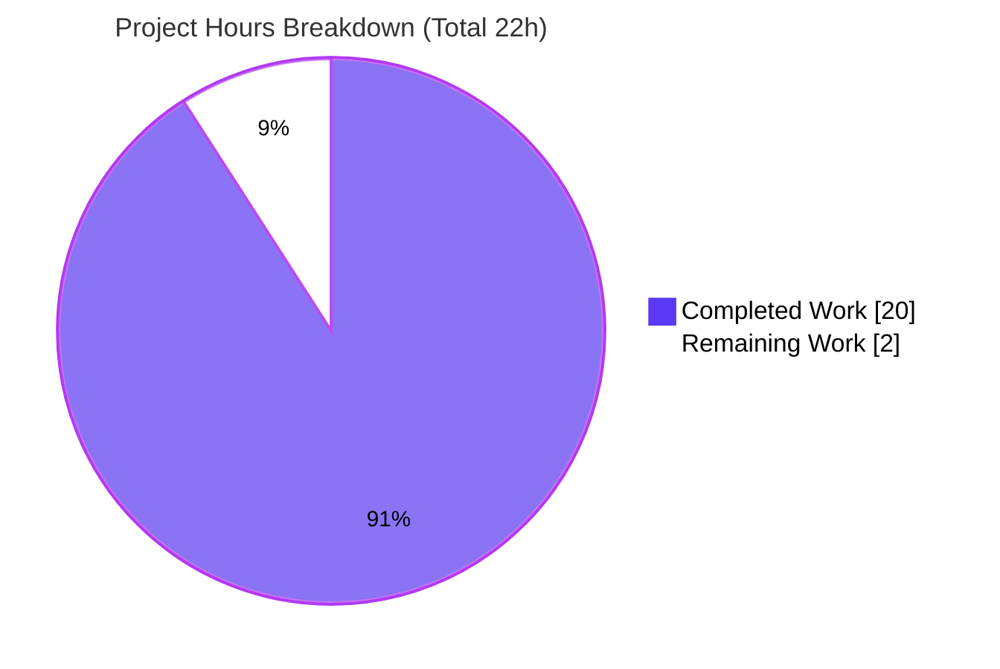
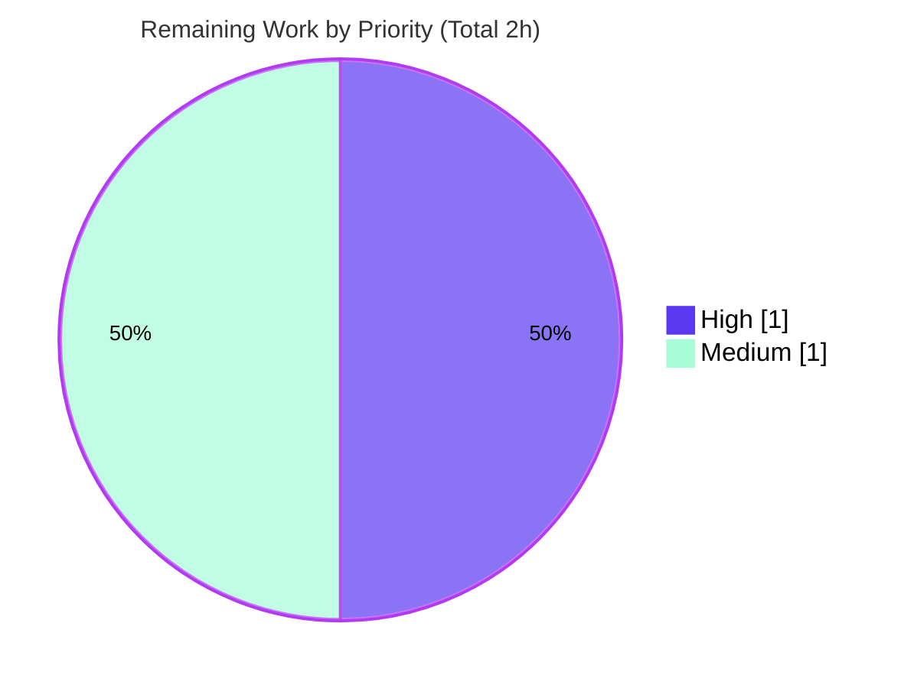

# Blitzy Project Guide

**Project:** Scapy TCP Overlap/Retransmission Reassembly — Behavioral Investigation & Documentation
**Repository:** `secdev/scapy` (source branch `scapy_0925ada48540`)
**Branch under review:** `blitzy-39d5a9d2-dbcc-4a08-843f-f2f06386ea66` (HEAD `a5e16650`)
**Deliverable:** `blitzy/documentation/scapy_0925ada48540.md`

> **Brand color legend** — <span style="color:#5B39F3">**Completed / AI Work = Dark Blue `#5B39F3`**</span> · Remaining / Not Completed = White `#FFFFFF` · <span style="color:#B23AF2">**Headings / Accents = Violet-Black `#B23AF2`**</span> · <span style="color:#A8FDD9">Highlight = Mint `#A8FDD9`</span>

---

## 1. Executive Summary

### 1.1 Project Overview

This project is a **documentation-only, code-investigation deliverable** that authoritatively answers a precise behavioral question: *when a TCP application-layer stream is reconstructed from a capture and two or more segments overlap or retransmit the same sequence range, which bytes survive?* Grounded in the Scapy source code (the source of truth) and confirmed by a live run through Scapy's standard offline reassembly path, the investigation establishes that Scapy applies a **last-writer-wins positional overwrite**. The audience is Scapy users, network-security/forensics engineers, and IDS analysts who must reason about overlapping-segment captures. The technical scope is a single new markdown document under `blitzy/documentation/`, with **zero** modifications to any Scapy source file.

### 1.2 Completion Status


| Metric | Hours |
|--------|------:|
| **Total Hours** | 22 |
| **Completed Hours (AI + Manual)** | 20 |
| **Remaining Hours** | 2 |
| **Percent Complete** | **90.9%** |

> Completion is computed using the AAP-scoped, hours-based methodology: `Completed ÷ (Completed + Remaining) = 20 ÷ 22 = 90.9%`. All AAP requirements (R1–R6) and governing rules are autonomously delivered and validated; the remaining 2 hours are path-to-production human review and acceptance of the documentation artifact.

### 1.3 Key Accomplishments

- ✅ **Single deliverable created** — `blitzy/documentation/scapy_0925ada48540.md` (252 lines, 9 sections), correctly named after the source branch and placed in `blitzy/documentation/`.
- ✅ **Definitive, code-grounded answer** — Scapy uses **last-writer-wins** via the unconditional positional slice assignment `memoryview(self.content)[seq:seq + data_len] = data` at `scapy/sessions.py:L193`.
- ✅ **Reproduced through the standard offline path** — `sniff(offline=<pcap>, session=TCPSession)`, not ad-hoc concatenation and not plain `rdpcap()`.
- ✅ **Verbatim two-variant evidence** — identical-byte overlap → `b'AAAABBBBCCCC'`; differing-byte overlap → `b'AAAAWWWWZZZZ'` (later segment wins); both length 12.
- ✅ **All hard constraints honored** — AST-proven: 0 new `Packet` subclasses, 0 `bind_layers` calls, 0 `StringBuffer` imports; HTTP self-binds to port 80 via `load_layer("http")`.
- ✅ **33 distinct source citations verified accurate** across 6 files; provider list corrected to the code-verified set `{HTTP, TLS, Kerberos, DCE/RPC, Postgres}`.
- ✅ **Zero source mutation + cleanup proof** — `git status` clean; only `blitzy/documentation/scapy_0925ada48540.md` added; `/tmp` scratch artifacts removed with terminal proof.
- ✅ **Version-independence validated** — byte-for-byte identical results on CPython 3.11.13 and 3.13.7.

### 1.4 Critical Unresolved Issues

| Issue | Impact | Owner | ETA |
|-------|--------|-------|-----|
| _None_ | No blocking issues. The deliverable is complete, validated, and required zero validator edits. | — | — |

> **No critical unresolved issues.** All five autonomous validation gates (dependencies, compilation, reproduction, runtime, citations) passed; no compilation errors, failing tests, or missing functionality remain.

### 1.5 Access Issues

| System/Resource | Type of Access | Issue Description | Resolution Status | Owner |
|-----------------|----------------|-------------------|-------------------|-------|
| _None_ | — | No access issues identified. | N/A | — |

> **No access issues identified.** The task runs entirely against the local repository source tree (Scapy imported via `PYTHONPATH`); it requires no repository permissions beyond the working branch, no service credentials, and no third-party API access.

### 1.6 Recommended Next Steps

1. **[High]** Perform a technical review of `blitzy/documentation/scapy_0925ada48540.md` — confirm the last-writer-wins answer and spot-check the `file:line` citations against source (≈1.0h).
2. **[Medium]** Independently reproduce the two-variant evidence by running the embedded §4 script and comparing stdout to §5 (≈0.5h).
3. **[Medium]** Review and merge the single-file additive pull request after confirming `git diff` shows only the new document (≈0.5h).
4. **[Low]** _(Optional, out of AAP scope)_ Consider a follow-up note extending the analysis to other `tcp_reassemble` providers (TLS/Kerberos/DCE-RPC/Postgres) — not required, as the policy is protocol-independent.

---

## 2. Project Hours Breakdown

### 2.1 Completed Work Detail

| Component | Hours | Description |
|-----------|------:|-------------|
| Source-code investigation & decision-path tracing `[AAP R5]` | 5 | Read `scapy/sessions.py` (`StringBuffer`, `TCPSession`, `_process_packet`, `on_packet_received`) and `scapy/layers/http.py` (`tcp_reassemble`, Content-Length, port-80 bindings); cataloged all `tcp_reassemble` providers; identified the exact decision point (`memoryview` slice `L193`, last-writer-wins) and the relative-sequence normalization. |
| Reproduction harness design & build `[AAP R1–R3]` | 3 | Computed the byte/sequence layout (ISN 1000, HEADER 39B, relative-seq baseline) so `s3` collides with `s2`'s `body[4:8]`; selected the built-in HTTP vehicle; built a constraint-compliant harness (no `Packet` subclass, no `bind_layers`, no `StringBuffer`) using `wrpcap()` + `sniff(offline=…, session=TCPSession)`. |
| Two-variant empirical evidence capture & verification `[AAP R4]` | 2 | Ran both variants, captured verbatim stdout, validated byte-for-byte, and confirmed across runtimes (CPython 3.11.13 Docker + 3.13.7 host). |
| Deliverable authoring — 252-line, 9-section document `[AAP deliverable]` | 6 | Authored the markdown with exact citations, a byte/sequence layout table, a mermaid flowchart, the two-variant interpretation, caveats (security nuance, OS divergence, issue #4340), and conclusion. |
| Web-search corroboration `[AAP §0.2.2]` | 1 | Corroborated the canonical offline reassembly API, the built-in provider set, and maintainer issue `secdev/scapy` #4340 (supporting context only; code remains authoritative). |
| Provider-list code-verification correction (commit `a5e16650`) `[Quality]` | 1 | Verified the real `tcp_reassemble` set `{HTTP, TLS, Kerberos, DCE/RPC, Postgres}` against source and removed an earlier web-derived over-claim (LDAP/SMB/DOIP). |
| Constraint/no-mutation/cleanup verification + autonomous validation `[AAP R6 + Rules]` | 2 | AST-proved constraint compliance; verified zero source mutation (`git status`/`git diff`); captured the cleanup proof; ran the five-gate validation (dependencies, compilation, reproduction, runtime, citations). |
| **Total Completed** | **20** | |

### 2.2 Remaining Work Detail

| Category | Hours | Priority |
|----------|------:|----------|
| Human technical review & acceptance of the deliverable (confirm answer, spot-check citations & reasoning) | 1.0 | High |
| Independent reproduction of the two-variant evidence (run §4 script, compare to §5) | 0.5 | Medium |
| Pull-request review, approval & merge (single-file additive change) | 0.5 | Medium |
| **Total Remaining** | **2.0** | |

### 2.3 Hours Reconciliation Summary

| Quantity | Hours | Source |
|----------|------:|--------|
| Completed (Section 2.1 total) | 20 | Sum of 2.1 rows |
| Remaining (Section 2.2 total) | 2 | Sum of 2.2 rows |
| **Total Project Hours** | **22** | 2.1 + 2.2 |
| **Percent Complete** | **90.9%** | 20 ÷ 22 |

> **Integrity check:** Section 2.1 (20h) + Section 2.2 (2h) = 22h Total (Section 1.2). Remaining = 2h is identical in Sections 1.2, 2.2, and 7. ✔

---

## 3. Test Results

All tests below originate from Blitzy's autonomous validation logs for this project. For this documentation/investigation task, the primary "test" is the **two-variant offline reassembly reproduction** (the empirical proof of the documented behavior); the remaining rows are the autonomous validation gates that protect deliverable correctness.

| Test Category | Framework | Total Tests | Passed | Failed | Coverage % | Notes |
|---------------|-----------|------------:|-------:|-------:|-----------:|-------|
| Empirical Reproduction (two-variant offline reassembly) | Scapy `sniff(offline=…, session=TCPSession)` | 2 | 2 | 0 | N/A | Variant 1 → `b'AAAABBBBCCCC'`; Variant 2 → `b'AAAAWWWWZZZZ'`; both len 12; byte-for-byte match to §5; confirmed on CPython 3.11.13 + 3.13.7. |
| Constraint Compliance | Python `ast` (static) | 3 | 3 | 0 | N/A | 0 `ClassDef` (no new `Packet`); 0 `bind_layers` calls; 0 `StringBuffer` imports. |
| Citation Accuracy | `sed`/`grep` vs. source | 33 | 33 | 0 | N/A | All 33 distinct `file:line` locators verified against source across 6 files. |
| Compilation (`py_compile`) | CPython `py_compile` | 6 | 6 | 0 | N/A | 6 cited modules compile clean; embedded reproduction script byte-compiles. |
| Markdown Structural Validation | `grep`/`awk` checks | 3 | 3 | 0 | N/A | 14 balanced code fences; 9 well-formed sections; 1 valid mermaid diagram. |
| **Totals** | | **47** | **47** | **0** | **N/A** | **100% pass; 0 failures.** |

> Coverage % is reported as **N/A**: the deliverable contains no production source code (it is a markdown document plus an ephemeral reproduction script), so line-coverage metrics do not apply. The meaningful coverage measure here is **AAP requirement coverage = 100%** (12/12 requirements satisfied — see Section 5).

---

## 4. Runtime Validation & UI Verification

**Runtime health** (the reproduction executed end-to-end through Scapy's standard offline path):

- ✅ **Operational** — `import scapy` resolves to version `2026.06.26` from the source tree (via `PYTHONPATH`).
- ✅ **Operational** — All reproduction imports succeed: `from scapy.all import IP, TCP, Raw, wrpcap, sniff, load_layer, TCPSession`; `load_layer("http")`; `from scapy.layers.http import HTTPResponse`.
- ✅ **Operational** — `sniff(offline=<pcap>, session=TCPSession)` reconstructs the stream through `on_packet_received` → `_ip_process_packet` → `_process_packet` → `HTTP.tcp_reassemble`.
- ✅ **Operational** — Variant 1 (identical overlap) → `b'AAAABBBBCCCC'`, length 12, overlap `body[4:8]` = `b'BBBB'`.
- ✅ **Operational** — Variant 2 (differing overlap) → `b'AAAAWWWWZZZZ'`, length 12, overlap `body[4:8]` = `b'WWWW'` (later segment wins).
- ✅ **Operational** — Layer stack `['IP', 'TCP', 'HTTP', 'HTTPResponse', 'Raw']` in both variants.
- ✅ **Operational** — Cross-runtime parity confirmed on CPython **3.11.13** (canonical Docker) and **3.13.7** (host).

**API integration outcomes:**

- ✅ **Operational** — Scapy's own port-80 binding (`scapy/layers/http.py:L748-L750`) is applied automatically by `load_layer("http")`; no manual `bind_layers` required.

**UI verification:**

- ⚪ **Not applicable** — this is a documentation/library investigation with **no user interface**. No web pages, components, or visual flows exist to verify; therefore no screenshots or screencasts were captured.

---

## 5. Compliance & Quality Review

The matrix maps every AAP requirement, governing rule, and hard constraint to its verification evidence and status.

| Deliverable / Requirement | Benchmark | Status | Progress | Evidence |
|---------------------------|-----------|--------|----------|----------|
| **R1** — Construct overlapping TCP flow | ≥2 segments, ≥1 overlap | ✅ Pass | 100% | §4 builds `s1`/`s2`/`s3`; `s3` overlaps `s2`'s `body[4:8]`; byte/seq layout table. |
| **R2** — Drive through standard offline path | `sniff(offline=…, session=TCPSession)`, not `rdpcap` | ✅ Pass | 100% | §3 + §4; re-run confirms the full reassembly call chain. |
| **R3** — Built-in handling only + hard constraints | No new `Packet`, no `bind_layers`, no `StringBuffer` | ✅ Pass | 100% | AST proof: 0/0/0; HTTP via `load_layer`. |
| **R4** — Verbatim two-variant evidence | Show `repr`, length, winning bytes | ✅ Pass | 100% | §5: `b'AAAABBBBCCCC'` / `b'AAAAWWWWZZZZ'`, len 12. |
| **R5** — Trace deciding code path + rationale | Cite `file:line`; explain why | ✅ Pass | 100% | §2 + §6 four-fact trace + mermaid; decisive `L193`. |
| **R6** — No source modification + cleanup proof | Zero source edits; `/tmp` cleaned | ✅ Pass | 100% | §7; `git status` clean; cleanup terminal proof. |
| **Rule** — Exactly one md named `<branch>.md` | `scapy_0925ada48540.md` | ✅ Pass | 100% | File present (252 lines). |
| **Rule** — Destination `blitzy/documentation/` | Correct directory | ✅ Pass | 100% | Path confirmed. |
| **Rule** — Code is truth; cite `file:line` | Every claim cited | ✅ Pass | 100% | 33 citations verified; over-claim corrected in commit `a5e16650`. |
| **Rule** — Show rationale/thinking | Explain the *why* | ✅ Pass | 100% | §2, §6, §8, §9. |
| **Quality** — Provider list code-verified | `{HTTP,TLS,Kerberos,DCE/RPC,Postgres}` | ✅ Pass | 100% | grep-verified; no LDAP/SMB/DOIP. |
| **Quality** — Markdown structural integrity | Balanced fences, valid mermaid | ✅ Pass | 100% | 14 fences balanced; 1 valid mermaid. |

**Fixes applied during autonomous validation:** The deliverable was found correct on arrival; **zero edits** were required during final validation. The one substantive correction in branch history is commit `a5e16650`, which tightened the `tcp_reassemble` provider list to the code-verified set (removing a web-search-derived over-claim) — upholding the "code is truth" rule.

**Outstanding compliance items:** None. AAP requirement coverage is **12/12 (100%)**.

---

## 6. Risk Assessment

| Risk | Category | Severity | Probability | Mitigation | Status |
|------|----------|----------|-------------|------------|--------|
| Citation `file:line` drift if `scapy/sessions.py` / `http.py` are revised upstream | Technical | Low | Medium | Each citation names the **symbol** alongside the line range, so references remain locatable by name even if lines shift. | Mitigated |
| Documented behavior could be version-dependent | Technical | Low | Low | Behavior is pure-Python byte-buffer slicing; reproduced byte-for-byte on CPython 3.11.13 and 3.13.7. | Resolved |
| Scapy's last-writer-wins can diverge from OS first-wins stacks (IDS/forensics/overlap-evasion relevance; cf. issue #4340) | Security | Informational | N/A | This is an inherent Scapy property the deliverable **documents** in §8 (with security implications); out of scope to "fix" per AAP §0.5.2. | Documented |
| New attack surface introduced by the change | Security | None | N/A | Deliverable adds no dependencies, no executable code path in the repo, and zero source changes. | N/A |
| Operational/runtime regressions | Operational | None | N/A | Markdown artifact has no runtime, monitoring, or deployment surface. | N/A |
| Integration impact on the source tree | Integration | Low | Low | Zero source changes; no imports/refs modified; only one untracked file to merge. | Mitigated |
| Reproduction relies on `cryptography` being importable (emits a harmless TripleDES deprecation warning on stderr) | Integration | Low | Low | Warning is cosmetic and on stderr only; documented in §4; `2>/dev/null` suppresses it without altering stdout. | Documented |

> **Overall risk posture: LOW.** No risk is blocking and no risk requires a source-code change.

---

## 7. Visual Project Status

**Project hours breakdown** (Completed vs. Remaining):



**Remaining work by priority** (sums to the 2h remaining):



**Remaining hours per category** (from Section 2.2):

| Category | Hours | Priority |
|----------|------:|----------|
| Human technical review & acceptance | 1.0 | High |
| Independent reproduction of evidence | 0.5 | Medium |
| PR review, approval & merge | 0.5 | Medium |
| **Total** | **2.0** | |

> **Integrity check:** the pie chart "Remaining Work" value (2) equals Section 1.2 Remaining Hours (2) and the Section 2.2 Hours total (2). ✔

---

## 8. Summary & Recommendations

**Achievements.** The project delivers a single, authoritative, code-grounded document answering how Scapy reconstructs overlapping/retransmitted TCP segments. The verdict — **last-writer-wins via an unconditional positional `memoryview` overwrite** at `scapy/sessions.py:L193` — is proven empirically through Scapy's standard offline path and traced to the exact decisive line of code. All six requirements (R1–R6), every governing rule, and all hard constraints are satisfied and independently validated.

**Remaining gaps.** None are technical. The remaining **2 hours** are purely path-to-production for a documentation artifact: a human technical review/acceptance (1.0h), an independent reproduction of the two-variant evidence (0.5h), and PR review & merge (0.5h).

**Critical path to production.** Review the document → reproduce the §4/§5 evidence → merge the single-file additive PR. There is no build, deployment, or CI gating for a markdown deliverable (the project's CI codespell scope excludes `blitzy/`).

**Success metrics.**

| Metric | Result |
|--------|--------|
| AAP requirement coverage | 12/12 (100%) |
| Autonomous validation gates passed | 5/5 |
| Reproduction reproducibility | Byte-for-byte on 2 CPython runtimes |
| Source files modified | 0 |
| Citations verified accurate | 33/33 |
| Validator edits required | 0 |

**Production readiness assessment.** The deliverable is **production-ready pending human acceptance**. At **90.9% complete**, the only outstanding work is human review and merge — there are no unresolved technical issues, no failing tests, and no compilation problems. Confidence is **High**, given the well-defined documentation scope and the byte-for-byte reproducibility of the evidence.

---

## 9. Development Guide

This guide explains how to reproduce the investigation and verify the deliverable. Every command was tested on the host (CPython 3.13.7); the canonical documented runtime is CPython 3.11. Run all commands from the repository root unless noted.

### 9.1 System Prerequisites

- **OS:** Linux/macOS (any POSIX shell). Tested on Ubuntu 25.10.
- **Python:** CPython ≥ 3.7 and < 4 (`pyproject.toml`); canonical CI runtime is **3.11**; verified on **3.13.7**.
- **Git:** any recent version (for repository operations).
- **No `pip install` of Scapy required** — Scapy runs directly from the source tree.

```bash
python3 --version          # expect Python 3.7–3.13
git --version
```

### 9.2 Environment Setup

```bash
# From the repository root. Scapy is imported from the source tree via PYTHONPATH.
cd /path/to/scapy-repo
export PYTHONPATH="$(pwd)"
```

### 9.3 Dependency Verification

```bash
# Confirm Scapy resolves from the source tree (expect: 2026.06.26)
PYTHONPATH="$(pwd)" python3 -c "import scapy; print(scapy.__version__)"

# Confirm every reproduction import resolves
PYTHONPATH="$(pwd)" python3 -c "from scapy.all import IP, TCP, Raw, wrpcap, sniff, load_layer, TCPSession; load_layer('http'); from scapy.layers.http import HTTPResponse; print('All reproduction imports OK')"
```

Expected output:

```text
2026.06.26
All reproduction imports OK
```

### 9.4 Reproduce the Investigation

The reproduction script is embedded verbatim in the deliverable (§4). Extract it to `/tmp` (outside the repository) and run it through the standard offline path:

```bash
# Extract the embedded reproduction script to /tmp
python3 - <<'PY'
import re
md = open("blitzy/documentation/scapy_0925ada48540.md").read()
blocks = re.findall(r"```python\n(.*?)```", md, re.DOTALL)
open("/tmp/repro_overlap.py", "w").write(max(blocks, key=len))
print("wrote /tmp/repro_overlap.py")
PY

# Run it (2>/dev/null suppresses harmless cryptography TripleDES warnings on stderr)
PYTHONPATH="$(pwd)" python3 /tmp/repro_overlap.py 2>/dev/null
```

Expected output (matches deliverable §5 exactly):

```text
=== VARIANT 1: overlap carries IDENTICAL bytes (s3 re-sends 'BBBB' over body[4:8]) ===
reassembled body bytes  : b'AAAABBBBCCCC'
reassembled body length : 12
overlap region body[4:8]: b'BBBB'
layer stack             : ['IP', 'TCP', 'HTTP', 'HTTPResponse', 'Raw']

=== VARIANT 2: overlap carries DIFFERING bytes (s3 sends 'WWWW' over body[4:8], originally 'BBBB') ===
reassembled body bytes  : b'AAAAWWWWZZZZ'
reassembled body length : 12
overlap region body[4:8]: b'WWWW' <- LATER segment (s3) wins
layer stack             : ['IP', 'TCP', 'HTTP', 'HTTPResponse', 'Raw']
```

**Optional — canonical CPython 3.11.13 via Docker:**

```bash
docker run --rm \
  -v "$(pwd)":/app \
  -v /tmp/repro_overlap.py:/tmp/repro_overlap.py:ro \
  -w /app --entrypoint /bin/bash \
  ghcr.io/scaleapi/swe-atlas:swe_atlas_QnA_secdev_scapy_1.0 \
  -c 'PYTHONPATH=/app python3 /tmp/repro_overlap.py'
```

### 9.5 Verification Steps

```bash
# Confirm the cited modules compile cleanly
PYTHONPATH="$(pwd)" python3 -m py_compile scapy/sessions.py scapy/layers/http.py && echo "py_compile OK"

# Spot-check the decisive citation (the last-writer-wins overwrite)
sed -n '193p' scapy/sessions.py
# expect: memoryview(self.content)[seq:seq + data_len] = data

# Spot-check the HTTP reassembly vehicle
sed -n '580p' scapy/layers/http.py
# expect: def tcp_reassemble(cls, data, metadata, _):

# Confirm the repository was not modified (expect empty output = clean)
git status --porcelain

# Confirm only the deliverable was added relative to the source branch
git diff 0925ada485406684174d6f068dbd85c4154657b3 --name-status
# expect: A   blitzy/documentation/scapy_0925ada48540.md
```

### 9.6 Cleanup

```bash
rm -f /tmp/repro_overlap.py /tmp/repro_overlap_v1.pcap /tmp/repro_overlap_v2.pcap
ls -1 /tmp/repro_* 2>&1 || echo "NONE: no repro_* files remain in /tmp"
# expect: NONE: no repro_* files remain in /tmp
```

### 9.7 Example Usage — Interpreting the Output

- The **overlap region** `body[4:8]` is written first by segment `s2` (`BBBB`) and then by segment `s3`. In Variant 1 `s3` re-sends `BBBB` (a retransmission) so the bytes are unchanged; in Variant 2 `s3` sends `WWWW`, and **`WWWW` survives** — demonstrating last-writer-wins.
- The final length is always **12** because HTTP's `Content-Length: 12` end-detection (`scapy/layers/http.py:L589-L598`) waits until exactly 12 body bytes are present before emitting the reassembled `HTTPResponse`.

### 9.8 Troubleshooting

- **`NameError: name 'TCPSession' is not defined`** → `TCPSession` must be imported (it is exported by `scapy.all`); ensure the import line is intact.
- **`ModuleNotFoundError: No module named 'scapy'`** → `PYTHONPATH` is not set to the repository root; export it as in §9.2.
- **TripleDES / `cryptography` deprecation warning on stderr** → harmless and expected; append `2>/dev/null` to suppress it without changing stdout.
- **Plain `rdpcap()` returns unreassembled packets** → reassembly happens only through `sniff(offline=…, session=TCPSession)`, never via `rdpcap()`.
- **A citation's line number looks off after an upstream update** → locate the cited **symbol** by name (e.g., `StringBuffer.append`, `HTTP.tcp_reassemble`); the document pairs every line range with its symbol for exactly this reason.

---

## 10. Appendices

### Appendix A — Command Reference

| Purpose | Command |
|---------|---------|
| Python version | `python3 --version` |
| Set source-tree import path | `export PYTHONPATH="$(pwd)"` |
| Verify Scapy version | `PYTHONPATH="$(pwd)" python3 -c "import scapy; print(scapy.__version__)"` |
| Run reproduction | `PYTHONPATH="$(pwd)" python3 /tmp/repro_overlap.py 2>/dev/null` |
| Compile cited modules | `PYTHONPATH="$(pwd)" python3 -m py_compile scapy/sessions.py scapy/layers/http.py` |
| Confirm clean tree | `git status --porcelain` |
| Confirm single-file diff | `git diff 0925ada485406684174d6f068dbd85c4154657b3 --name-status` |
| Cleanup scratch artifacts | `rm -f /tmp/repro_overlap.py /tmp/repro_overlap_v1.pcap /tmp/repro_overlap_v2.pcap` |

### Appendix B — Port Reference

| Port | Usage |
|------|-------|
| TCP 80 | HTTP server port in the reproduction; Scapy self-binds `HTTP` to port 80 via `load_layer("http")` (`scapy/layers/http.py:L748-L750`). No network listener is opened — packets are read from an offline pcap. |

### Appendix C — Key File Locations

| Path | Role |
|------|------|
| `blitzy/documentation/scapy_0925ada48540.md` | **The deliverable** (created; 252 lines). |
| `scapy/sessions.py` | REFERENCE — `StringBuffer` (`L161`), `append` (`L179-L193`), decisive overwrite (`L193`), `TCPSession`, `_process_packet` (`L286-L380`), `on_packet_received` (`L382-L396`). |
| `scapy/layers/http.py` | REFERENCE — `HTTP.tcp_reassemble` (`L580`), Content-Length end-detect (`L589-L598`), port-80 bindings (`L748-L750`). |
| `scapy/layers/tls/session.py`, `scapy/layers/kerberos.py`, `scapy/layers/dcerpc.py`, `scapy/contrib/postgres.py` | REFERENCE — other `tcp_reassemble` providers (named only; not exercised). |
| `/tmp/repro_overlap.py`, `/tmp/repro_overlap_v{1,2}.pcap` | Ephemeral reproduction artifacts (created then deleted; never in the repo). |

### Appendix D — Technology Versions

| Component | Version |
|-----------|---------|
| Scapy (from source tree) | 2026.06.26 |
| Python (canonical / CI) | CPython 3.11 |
| Python (host validation) | CPython 3.13.7 |
| Python (Docker validation) | CPython 3.11.13 |
| `requires-python` (`pyproject.toml`) | `>=3.7, <4` |
| Docker (optional) | 28.5.2 |

### Appendix E — Environment Variable Reference

| Variable | Value | Purpose |
|----------|-------|---------|
| `PYTHONPATH` | repository root (`$(pwd)`) | Ensures a `/tmp` script resolves `scapy` from the repository source tree rather than a `pip`-installed copy. |

### Appendix F — Developer Tools Guide

| Tool | Use in this project |
|------|---------------------|
| `git status --porcelain` / `git diff <base> --name-status` | Prove zero source mutation; confirm the single-file additive change. |
| `python3 -m py_compile` | Byte-compile cited modules to confirm syntactic integrity. |
| Python `ast` | Statically prove constraint compliance (no `Packet` subclass, no `bind_layers`, no `StringBuffer` import). |
| `sed -n '<n>p' <file>` | Spot-check a citation against the exact source line. |
| `grep`/`awk` | Verify markdown fence balance and enumerate `file:line` citations. |
| `wrpcap` / `sniff(offline=…, session=TCPSession)` | Write the offline capture and reassemble through Scapy's standard session path. |

### Appendix G — Glossary

| Term | Definition |
|------|------------|
| **Last-writer-wins** | The overlap policy where the most-recently-processed segment's bytes overwrite any earlier bytes covering the same range. |
| **`TCPSession`** | Scapy session class that reassembles TCP streams from packets, invoking a protocol's `tcp_reassemble`. |
| **`StringBuffer`** | The per-flow byte accumulator inside `TCPSession`; its `append` performs the decisive positional overwrite. |
| **`tcp_reassemble`** | A classmethod a protocol implements so `TCPSession` knows when an application message is complete. |
| **Offline path** | Reading packets from a pcap on disk (`sniff(offline=…)`) rather than live capture; required for reproducible reassembly here. |
| **Relative-sequence baseline** | The first segment's sequence number minus one, used to convert absolute TCP sequence numbers to buffer offsets. |
| **ISN** | Initial Sequence Number — the TCP sequence number of the first segment in the flow (1000 in the reproduction). |